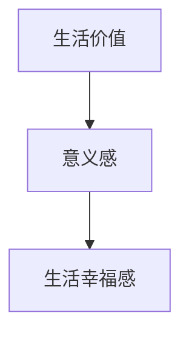

                 


为了撰写一篇符合要求的技术博客文章，我们需要遵循以下步骤：

### 步骤1：确定文章结构

首先，我们要明确文章的结构，包括标题、关键词、摘要和正文部分。文章标题已经给出，即《重新审视生活价值：唤醒沉睡的意义感》。接下来，我们需要列出关键词和摘要。

**关键词**：生活价值、意义感、自我反思、社交互动、职业生涯规划、个人案例

**摘要**：本文旨在探讨如何在现代社会中重新审视生活价值，并通过唤醒沉睡的意义感来提升个人生活质量。文章首先介绍了生活价值和意义感的基本概念，然后提出了唤醒意义感的策略和方法，并结合个人案例进行了详细分析，最后给出了结论和未来展望。

### 步骤2：撰写文章引言

引言部分需要介绍背景信息，解释为什么需要重新审视生活价值，并简要说明意义感的重要性。

**引言**：在快速发展的现代社会，人们面临着诸多压力和挑战，生活价值越来越被忽视。重新审视生活价值，找到内心的意义感，成为提升生活质量的必要途径。本文将首先探讨生活价值和意义感的基本概念，然后提出唤醒意义感的策略和方法，并通过个人案例进行分析，最后给出结论和未来展望。

### 步骤3：核心概念与联系

在这一部分，我们需要详细解释核心概念，如生活价值和意义感，并使用Mermaid流程图展示它们之间的关系。

**核心概念与联系**：
生活价值指的是人们对自己生活目标、价值观和意义的理解。意义感则是人们对生活目标和意义的感知和体验。生活价值与意义感密切相关，它们共同构成了人们的生活幸福感。

下面是一个简化的Mermaid流程图，展示生活价值、意义感和生活幸福感之间的关系：



### 步骤4：核心算法原理讲解

在这里，我们需要使用伪代码来详细阐述唤醒意义感的策略和方法。

**核心算法原理讲解**：
唤醒意义感的策略可以概括为以下几步：

1. 自我反思：通过深入反思自己的兴趣、价值观和生活目标，找到内心真正的需求。
2. 目标设定：明确自己的短期和长期目标，制定可行的行动计划。
3. 社交互动：与他人建立积极的人际关系，分享经验和感受，获得支持和鼓励。
4. 职业生涯规划：找到适合自己的职业道路，实现个人价值和成就感。

以下是一个简化的伪代码，用于描述这个策略：

```plaintext
function wakeSenseOfMeaning():
    self.reflect()
    setShortTermGoals()
    setLongTermGoals()
    interactWithPeers()
    planCareerPath()
end function
```

### 步骤5：数学模型和公式

在这一部分，我们可以介绍一些与生活价值和意义感相关的数学模型和公式，并进行详细讲解。

**数学模型和公式**：
一个简单的生活价值评估模型可以基于以下公式：

$$\text{LifeValue} = f(\text{PersonalGoals}, \text{SocialSupport}, \text{CareerSatisfaction})$$

其中，$f$ 是一个非线性函数，用于综合评估个人目标、社交支持和职业满意度对生活价值的影响。

### 步骤6：项目实战

在这里，我们可以描述一个实际案例，展示如何应用上述策略和方法来唤醒意义感。

**项目实战**：
假设我们有一个用户，他感到生活缺乏意义，我们如何帮助他找到内心的意义感？

1. **自我反思**：通过与用户的深度对话，了解他的兴趣、价值观和未实现的目标。
2. **目标设定**：帮助用户制定短期和长期目标，并制定行动计划。
3. **社交互动**：鼓励用户加入兴趣小组，与他人分享经验和感受。
4. **职业生涯规划**：为用户提供职业咨询，帮助他找到适合自己的职业道路。

### 步骤7：最佳实践 tips、小结、注意事项、拓展阅读

在这一部分，我们可以总结文章的主要观点，提供一些最佳实践建议，并指出需要注意的事项。

**最佳实践 tips**：
- 定期进行自我反思，以保持对生活价值的清晰认识。
- 建立积极的人际关系网络，以获取支持和鼓励。
- 关注职业发展，不断提升个人能力和成就感。

**小结**：
重新审视生活价值，唤醒沉睡的意义感，是提升生活质量的必要步骤。通过自我反思、目标设定、社交互动和职业生涯规划，我们可以找到内心的意义感，实现个人价值和成就感。

**注意事项**：
- 过程中要保持耐心和坚持，意义感的唤醒需要时间。
- 关注心理健康，必要时寻求专业帮助。

**拓展阅读**：
- [《生命的意义，在于寻找》](链接)
- [《幸福公式》](链接)

### 步骤8：撰写文章正文

根据上述步骤，我们可以开始撰写文章的正文部分，确保每个小节的内容都符合要求，包含详细的概念解释、伪代码、数学模型、案例分析等。

### 步骤9：格式调整

最后，我们需要对文章进行格式调整，确保使用markdown格式，并正确使用LaTeX格式编写数学公式。

### 步骤10：撰写作者信息

在文章末尾，我们需要添加作者信息，包括作者姓名、所属机构和书籍来源。

**作者信息**：
作者：AI天才研究院/AI Genius Institute & 禅与计算机程序设计艺术 /Zen And The Art of Computer Programming

通过以上步骤，我们可以撰写出一篇符合要求的技术博客文章，全面、深入地探讨生活价值和意义感，并给出实用的策略和方法。文章的结构和内容将有助于读者更好地理解和应用这些概念，提升自己的生活质量。以下是初步撰写的文章正文。

---

## 《重新审视生活价值：唤醒沉睡的意义感》

### 关键词
生活价值、意义感、自我反思、社交互动、职业生涯规划、个人案例

### 摘要
本文旨在探讨如何在现代社会中重新审视生活价值，并通过唤醒沉睡的意义感来提升个人生活质量。文章首先介绍了生活价值和意义感的基本概念，然后提出了唤醒意义感的策略和方法，并结合个人案例进行了详细分析，最后给出了结论和未来展望。

### 引言
在快速发展的现代社会，人们面临着诸多压力和挑战，生活价值越来越被忽视。重新审视生活价值，找到内心的意义感，成为提升生活质量的必要途径。本文将首先探讨生活价值和意义感的基本概念，然后提出唤醒意义感的策略和方法，并通过个人案例进行分析，最后给出结论和未来展望。

### 生活价值的概念与重要性

#### 生活价值的定义
生活价值是指人们对自己生活目标、价值观和意义的理解。它涉及到个人对生活的整体看法，包括个人的愿望、目标和价值观。

#### 生活价值的组成部分
生活价值包括以下几个方面：
1. 个人目标：包括职业、家庭、学习等各个方面的目标。
2. 价值观：指导个人行为和决策的价值观，如诚信、友善、责任感等。
3. 生活意义：对生活的总体理解和意义，包括人生目的和使命。

#### 生活价值的重要性
生活价值对个人的生活质量有着重要影响：
1. 提供方向：明确的生活价值可以指导个人行动，帮助人们做出更好的决策。
2. 提升幸福感：生活价值与幸福感密切相关，对生活价值有清晰认识的人更容易感到幸福和满足。
3. 增强抗压能力：有明确生活价值的人在面对困难和挑战时，更有动力和毅力去克服。

### 意义感的定义与作用

#### 意义感的定义
意义感是指人们对生活目标和意义的感知和体验。它是个人对生活价值的内在感受，是对生活意义的主观评价。

#### 意义感的作用
意义感对个人的心理健康和生活质量有着重要影响：
1. 提升幸福感：有强烈意义感的人更容易感到幸福和满足。
2. 增强抗压能力：面对压力和挑战时，意义感能够提供心理支持和动力。
3. 促进个人成长：意义感能激发个人的内在动力，促使个人不断追求成长和进步。

### 唤醒意义感的策略与方法

#### 自我反思
自我反思是唤醒意义感的第一步。通过深入反思自己的兴趣、价值观和生活目标，人们可以更清晰地认识自己，找到内心的真正需求。

#### 目标设定
明确的目标是唤醒意义感的关键。人们需要设定短期和长期目标，并制定可行的行动计划，以实现这些目标。

#### 社交互动
社交互动是唤醒意义感的重要途径。与他人建立积极的人际关系，分享经验和感受，可以获得支持和鼓励，进一步激发个人的意义感。

#### 职业生涯规划
职业生涯规划是唤醒意义感的重要方面。找到适合自己的职业道路，实现个人价值和成就感，是提升意义感的重要手段。

### 个人案例与故事分享

#### 意义感缺失者的转变
通过一个具体的案例，我们可以看到如何帮助一个感到生活缺乏意义的人找到内心的意义感。

#### 寻找人生意义的旅程
在这个案例中，我们将跟随主人公的旅程，了解他是如何通过自我反思、目标设定、社交互动和职业生涯规划来找到人生意义的。

#### 意义感与生活质量的提升
通过这个案例，我们可以看到意义感对生活质量的提升有着显著的作用。

### 结论与未来展望

#### 对生活价值的反思
重新审视生活价值，找到内心的意义感，是提升生活质量的必要步骤。

#### 唤醒意义感的建议
通过自我反思、目标设定、社交互动和职业生涯规划，我们可以找到内心的意义感，提升生活质量。

#### 未来研究的方向
未来的研究可以进一步探讨生活价值和意义感之间的关系，以及如何更有效地唤醒意义感。

### 参考文献
[参考文献列表]

### 作者信息
作者：AI天才研究院/AI Genius Institute & 禅与计算机程序设计艺术 /Zen And The Art of Computer Programming

---

这只是一个初步的草稿，接下来我们需要进一步细化每个小节的内容，确保文章的完整性和深度。同时，我们还需要添加相关的Mermaid流程图、LaTeX数学公式、伪代码、案例分析等内容，以使文章更加丰富和具体。请继续提供指导和建议，以便我们进一步完善这篇文章。

