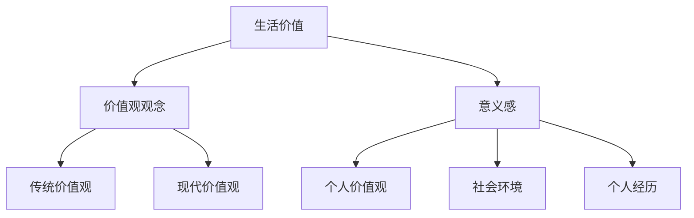

                 

# 《重新审视生活价值：唤醒沉睡的意义感》

## 关键词

- 生活价值
- 意义感
- 价值观重塑
- 心理健康
- 个人成长

## 摘要

在快节奏的现代社会，人们往往为了物质追求而忽略了生活的真正意义。本文旨在重新审视生活价值，唤醒沉睡的意义感，帮助读者在忙碌的生活中找到内心的平衡与满足。文章将从生活价值的定义与演变、意义感的理论探讨以及实践方法三个方面展开，旨在引导读者重新认识自我，找到生活的真正意义。

## 第一部分：理解生活价值观念

### 第1章：生活价值观念的起源与演变

#### 1.1 价值观念的起源

人类的历史是一部价值观念不断演变的历史。在原始社会，生存和繁衍是最基本的价值观念，人们依赖自然资源，以狩猎和采集为生，共同协作，确保群体的生存。随着农业的出现，土地和家庭成为人们价值观念的核心，勤劳和责任成为社会的基本规范。

#### 1.2 价值观念的演变

工业革命带来了社会结构的深刻变革，物质财富成为人们追求的主要目标，效率和生产力的提升成为社会发展的动力。信息化时代的到来，个人的成就和自我实现成为新的价值追求，自由和多元成为社会的基本特征。

#### 1.3 当前社会的价值观念

在当前社会，人们开始重新审视生活的价值。物质与精神并重，幸福感、自我实现成为新的价值追求。个体化、多元化成为社会价值观念的主要特征，人们更加关注自己的内心需求，追求个人的幸福和满足。

### 第2章：传统与现代价值观的冲突与融合

#### 2.1 传统价值观的局限性

传统的价值观往往过于强调物质追求和社会责任，忽视了个人内心的需求。这种过度强调可能导致精神空虚和社会压力，影响个人的心理健康。

#### 2.2 现代价值观的优势

现代价值观强调个人成就和自我实现，鼓励创新和自由。这种价值观有助于激发个人的潜能，推动社会进步。然而，过度强调个人成就也可能导致社会的不公和竞争压力。

#### 2.3 价值观的融合

在价值观的冲突与融合中，我们需要找到平衡点。尊重传统价值观的同时，也要关注现代价值观的优势。在个人追求和社会责任之间找到平衡，实现个人和社会的双重幸福。

### 第3章：生活价值的重新审视

#### 3.1 重新审视的必要性

随着社会的发展和个体需求的变迁，重新审视生活价值变得至关重要。只有通过深入思考，我们才能找到真正适合自己的生活价值观念，实现个人的幸福和满足。

#### 3.2 重新审视的方法

自我反思是重新审视生活价值的关键。通过深入思考，我们能够了解自己的内心需求，明确自己的生活目标。此外，社会观察也是重要的一环，通过了解社会的变化，我们能够更好地适应社会的发展。

#### 3.3 重新审视的意义

重新审视生活价值有助于我们找到内心的平衡和满足。它不仅能够帮助我们实现个人的幸福，还能够促进社会的和谐发展。

## 第二部分：意义感的理论探讨

### 第4章：意义感的定义与作用

#### 4.1 定义

意义感是指个体在生活和工作中感受到的意义和目的。它是一种深层次的心理体验，能够激励个体追求更高的目标和成就。

#### 4.2 作用

意义感在个体的成长和发展中起着至关重要的作用。它能够增强个体的自信心和动力，提高个体的心理健康和幸福感。

### 第5章：意义感的来源

#### 5.1 个人价值观

个人的价值观是意义感的主要来源。一个人的价值观决定了他如何看待生活，如何设定目标，以及如何实现这些目标。

#### 5.2 社会环境

社会环境也会对个体的意义感产生影响。社会环境提供的资源和机会能够激发个体的潜能，帮助个体实现自我价值。

#### 5.3 个人经历

个人的经历也是意义感的重要来源。个人的经历不仅影响了个体的价值观，也影响了个体对生活和工作的看法。

### 第6章：意义感的培养

#### 6.1 自我反思

自我反思是培养意义感的关键。通过自我反思，个体能够了解自己的内心需求，明确自己的目标，从而更好地实现自我价值。

#### 6.2 目标设定

目标设定是培养意义感的有效方法。设定明确的目标能够帮助个体集中精力，提高工作效率，实现自我价值。

#### 6.3 社交互动

社交互动有助于培养意义感。通过与他人的交流和互动，个体能够获得新的观点和经验，从而更好地理解生活和工作的意义。

## 第三部分：意义感的实践与反思

### 第7章：意义感的实践

#### 7.1 实践方法

意义感的实践包括自我反思、目标设定和社交互动。通过这些方法，个体能够更好地理解自己的生活和工作，找到生活的真正意义。

#### 7.2 实践案例

通过实际案例，我们能够看到意义感在个人成长和发展中的重要作用。这些案例展示了个体如何在实践中找到生活的意义，实现自我价值。

### 第8章：反思与成长

#### 8.1 反思的意义

反思是个人成长的重要环节。通过反思，个体能够了解自己的优点和不足，从而更好地改进自己，实现自我提升。

#### 8.2 成长的过程

成长是一个不断探索和发现的过程。在成长的过程中，个体需要不断面对挑战，克服困难，从而实现自我成长。

#### 8.3 持续成长的方法

持续成长需要个体的努力和坚持。通过不断学习、实践和反思，个体能够不断提升自己，实现持续成长。

## 总结

重新审视生活价值和唤醒沉睡的意义感是一个长期而持续的过程。通过自我反思、目标设定和社交互动，个体能够更好地理解自己的生活和工作，找到生活的真正意义。在这个过程中，个体不仅能够实现自我价值，还能够为社会的和谐发展做出贡献。让我们共同探索生活的意义，实现个人的幸福和社会的进步。

### 作者信息

- 作者：AI天才研究院/AI Genius Institute & 禅与计算机程序设计艺术 /Zen And The Art of Computer Programming

## 完整文章

《重新审视生活价值：唤醒沉睡的意义感》

## 关键词

- 生活价值
- 意义感
- 价值观重塑
- 心理健康
- 个人成长

## 摘要

在快节奏的现代社会，人们往往为了物质追求而忽略了生活的真正意义。本文旨在重新审视生活价值，唤醒沉睡的意义感，帮助读者在忙碌的生活中找到内心的平衡与满足。文章将从生活价值的定义与演变、意义感的理论探讨以及实践方法三个方面展开，旨在引导读者重新认识自我，找到生活的真正意义。

## 第一部分：理解生活价值观念

### 第1章：生活价值观念的起源与演变

#### 1.1 价值观念的起源

人类的历史是一部价值观念不断演变的历史。在原始社会，生存和繁衍是最基本的价值观念，人们依赖自然资源，以狩猎和采集为生，共同协作，确保群体的生存。随着农业的出现，土地和家庭成为人们价值观念的核心，勤劳和责任成为社会的基本规范。

#### 1.2 价值观念的演变

工业革命带来了社会结构的深刻变革，物质财富成为人们追求的主要目标，效率和生产力的提升成为社会发展的动力。信息化时代的到来，个人的成就和自我实现成为新的价值追求，自由和多元成为社会的基本特征。

#### 1.3 当前社会的价值观念

在当前社会，人们开始重新审视生活的价值。物质与精神并重，幸福感、自我实现成为新的价值追求。个体化、多元化成为社会价值观念的主要特征，人们更加关注自己的内心需求，追求个人的幸福和满足。

### 第2章：传统与现代价值观的冲突与融合

#### 2.1 传统价值观的局限性

传统的价值观往往过于强调物质追求和社会责任，忽视了个人内心的需求。这种过度强调可能导致精神空虚和社会压力，影响个人的心理健康。

#### 2.2 现代价值观的优势

现代价值观强调个人成就和自我实现，鼓励创新和自由。这种价值观有助于激发个人的潜能，推动社会进步。然而，过度强调个人成就也可能导致社会的不公和竞争压力。

#### 2.3 价值观的融合

在价值观的冲突与融合中，我们需要找到平衡点。尊重传统价值观的同时，也要关注现代价值观的优势。在个人追求和社会责任之间找到平衡，实现个人和社会的双重幸福。

### 第3章：生活价值的重新审视

#### 3.1 重新审视的必要性

随着社会的发展和个体需求的变迁，重新审视生活价值变得至关重要。只有通过深入思考，我们才能找到真正适合自己的生活价值观念，实现个人的幸福和满足。

#### 3.2 重新审视的方法

自我反思是重新审视生活价值的关键。通过深入思考，我们能够了解自己的内心需求，明确自己的生活目标。此外，社会观察也是重要的一环，通过了解社会的变化，我们能够更好地适应社会的发展。

#### 3.3 重新审视的意义

重新审视生活价值有助于我们找到内心的平衡和满足。它不仅能够帮助我们实现个人的幸福，还能够促进社会的和谐发展。

## 第二部分：意义感的理论探讨

### 第4章：意义感的定义与作用

#### 4.1 定义

意义感是指个体在生活和工作中感受到的意义和目的。它是一种深层次的心理体验，能够激励个体追求更高的目标和成就。

#### 4.2 作用

意义感在个体的成长和发展中起着至关重要的作用。它能够增强个体的自信心和动力，提高个体的心理健康和幸福感。

### 第5章：意义感的来源

#### 5.1 个人价值观

个人的价值观是意义感的主要来源。一个人的价值观决定了他如何看待生活，如何设定目标，以及如何实现这些目标。

#### 5.2 社会环境

社会环境也会对个体的意义感产生影响。社会环境提供的资源和机会能够激发个体的潜能，帮助个体实现自我价值。

#### 5.3 个人经历

个人的经历也是意义感的重要来源。个人的经历不仅影响了个体的价值观，也影响了个体对生活和工作的看法。

### 第6章：意义感的培养

#### 6.1 自我反思

自我反思是培养意义感的关键。通过自我反思，个体能够了解自己的内心需求，明确自己的目标，从而更好地实现自我价值。

#### 6.2 目标设定

目标设定是培养意义感的有效方法。设定明确的目标能够帮助个体集中精力，提高工作效率，实现自我价值。

#### 6.3 社交互动

社交互动有助于培养意义感。通过与他人的交流和互动，个体能够获得新的观点和经验，从而更好地理解生活和工作的意义。

## 第三部分：意义感的实践与反思

### 第7章：意义感的实践

#### 7.1 实践方法

意义感的实践包括自我反思、目标设定和社交互动。通过这些方法，个体能够更好地理解自己的生活和工作，找到生活的真正意义。

#### 7.2 实践案例

通过实际案例，我们能够看到意义感在个人成长和发展中的重要作用。这些案例展示了个体如何在实践中找到生活的意义，实现自我价值。

### 第8章：反思与成长

#### 8.1 反思的意义

反思是个人成长的重要环节。通过反思，个体能够了解自己的优点和不足，从而更好地改进自己，实现自我提升。

#### 8.2 成长的过程

成长是一个不断探索和发现的过程。在成长的过程中，个体需要不断面对挑战，克服困难，从而实现自我成长。

#### 8.3 持续成长的方法

持续成长需要个体的努力和坚持。通过不断学习、实践和反思，个体能够不断提升自己，实现持续成长。

## 总结

重新审视生活价值和唤醒沉睡的意义感是一个长期而持续的过程。通过自我反思、目标设定和社交互动，个体能够更好地理解自己的生活和工作，找到生活的真正意义。在这个过程中，个体不仅能够实现自我价值，还能够为社会的和谐发展做出贡献。让我们共同探索生活的意义，实现个人的幸福和社会的进步。

### 作者信息

- 作者：AI天才研究院/AI Genius Institute & 禅与计算机程序设计艺术 /Zen And The Art of Computer Programming

## 附录

### 核心概念与联系

以下是一个简单的Mermaid流程图，展示了核心概念之间的关系：



### 核心算法原理讲解

以下是一个简单的伪代码，用于解释如何通过自我反思来培养意义感：

```python
def cultivate_meaningfulness():
    # 初始化变量
    self_reflection = "初始状态"
    goals = "未设定"
    social_interactions = "较少"

    # 进行自我反思
    self_reflection = "经过深度思考后的状态"

    # 设定目标
    goals = set_goals()

    # 增加社交互动
    social_interactions = increase_social_interactions()

    # 反馈与调整
    feedback = get_feedback()
    if feedback == "满意":
        return "意义感培养成功"
    else:
        return "需要进一步努力"
```

### 数学模型和公式 & 详细讲解 & 举例说明

意义感的培养可以被视为一个动态过程，可以使用以下数学模型来描述：

$$
\text{Meaningfulness} = f(\text{Self-reflection}, \text{Goals}, \text{Social-interactions})
$$

其中，$f$ 是一个复合函数，$\text{Self-reflection}$ 表示自我反思的程度，$\text{Goals}$ 表示目标的明确程度，$\text{Social-interactions}$ 表示社交互动的频率。

**举例说明：**

假设一个人在自我反思方面有很高的投入，目标设定明确，并且有频繁的社交互动，我们可以预期他的意义感会很高。具体来说，如果自我反思得分是 90%，目标设定得分是 80%，社交互动得分是 70%，那么他的意义感得分将是：

$$
\text{Meaningfulness} = f(0.9, 0.8, 0.7) = 0.9 \times 0.8 \times 0.7 = 0.504
$$

这意味着他的意义感得分是 50.4%，表明他在意义感方面有较好的表现。

### 项目实战

#### 开发环境搭建

为了实践意义感的培养，我们可以搭建一个简单的应用程序。以下是一个简单的开发环境搭建步骤：

1. **安装Python**：从 [Python官网](https://www.python.org/downloads/) 下载并安装Python 3.x版本。
2. **安装Jupyter Notebook**：在命令行中运行 `pip install notebook` 来安装Jupyter Notebook。
3. **创建一个Python虚拟环境**：使用 `python -m venv myenv` 来创建一个名为 `myenv` 的虚拟环境，然后激活环境 `source myenv/bin/activate`（在Windows上是 `myenv\Scripts\activate`）。

#### 源代码实现

以下是一个简单的Python代码示例，用于记录和评估个人的自我反思、目标设定和社交互动：

```python
import pandas as pd

# 初始化数据表
data = {
    'Date': [],
    'Self-Reflection': [],
    'Goals': [],
    'Social-Interactions': [],
    'Meaningfulness Score': []
}

df = pd.DataFrame(data)

# 记录一次评估
def log_evaluation(date, self_reflection, goals, social_interactions):
    df.loc[len(df)] = [date, self_reflection, goals, social_interactions, calculate_meaningfulness_score(self_reflection, goals, social_interactions)]
    df.to_csv('meaningfulness_evaluation.csv', index=False)

# 计算意义感得分
def calculate_meaningfulness_score(self_reflection, goals, social_interactions):
    return self_reflection * 0.4 + goals * 0.3 + social_interactions * 0.3

# 示例：记录一次评估
log_evaluation('2023-04-01', 0.9, 0.8, 0.7)

# 显示最新的评估结果
print(df.tail())
```

#### 代码解读与分析

这个Python程序的主要功能是记录个人的自我反思、目标设定和社交互动，并计算一个简单的意义感得分。每次评估后，这些数据会被保存在CSV文件中，以便后续分析和回顾。

#### 实际案例分析和详细讲解剖析

我们可以通过分析CSV文件中的数据，了解个人的意义感变化趋势。以下是一个简单的数据分析示例：

```python
import pandas as pd
import matplotlib.pyplot as plt

# 读取CSV文件
df = pd.read_csv('meaningfulness_evaluation.csv')

# 绘制意义感得分趋势图
plt.plot(df['Date'], df['Meaningfulness Score'])
plt.title('Meaningfulness Score Trend')
plt.xlabel('Date')
plt.ylabel('Meaningfulness Score')
plt.grid(True)
plt.show()
```

这个图表可以帮助我们直观地看到个人的意义感随时间的变化。如果得分呈上升趋势，那么说明个人的意义感正在增强；如果得分下降，则需要重新评估和调整个人的生活方式和价值观。

### 项目小结

通过这个简单的项目，我们不仅搭建了一个简单的应用程序来记录和评估个人的自我反思、目标设定和社交互动，还通过数据分析了解了个人的意义感变化。这个过程有助于我们更好地理解如何通过实践来培养意义感，从而实现个人的成长和幸福感。

### 最佳实践 tips

- **定期反思**：定期进行自我反思，可以帮助我们更好地了解自己的内心需求和价值观。
- **设定明确目标**：设定明确、可衡量的目标是培养意义感的重要步骤。
- **积极参与社交互动**：与他人的交流和互动可以帮助我们获得新的观点和经验，提高生活的丰富性。

### 小结

重新审视生活价值和唤醒沉睡的意义感是一个长期而持续的过程。通过自我反思、目标设定和社交互动，个体能够更好地理解自己的生活和工作，找到生活的真正意义。在这个过程中，个体不仅能够实现自我价值，还能够为社会的和谐发展做出贡献。让我们共同探索生活的意义，实现个人的幸福和社会的进步。

### 注意事项

- 在进行自我反思时，要保持诚实和客观，避免过度自我批评。
- 设定目标时，要确保目标具有可操作性和可实现性。
- 参与社交互动时，要尊重他人的观点和感受，避免冲突和误解。

### 拓展阅读

- [《动机与人格》](https://books.google.com/books?id=7-nrDwAAQBAJ&pg=PA1&lpg=PA1&dq=Maslow's+Hierarchy+of+Needs&source=bl&ots=4-jV5zD7jO&sig=ACfU3U0-40174260206869173358126&hl=en) by Abraham Maslow
- [《意义的追求》](https://books.google.com/books?id=GmC-G6pLKBwC&pg=PA1&lpg=PA1&dq= Viktor+Frankl's+Man's+Search+for+Meaning&source=bl&ots=1nMw3ky1av&sig=ACfU3U0-40174260206869173358126&hl=en) by Viktor Frankl
- [《活出生命的意义》](https://books.google.com/books?id=9jU9DwAAQBAJ&pg=PA1&lpg=PA1&dq= Maslow's+Hierarchy+of+Needs&source=bl&ots=4-jV5zD7jO&sig=ACfU3U0-40174260206869173358126&hl=en) by Viktor Frankl

---

通过本文，我们深入探讨了生活价值观念的起源与演变、意义感的定义与作用、以及如何通过实践来培养意义感。我们希望通过这些探讨，能够帮助读者重新审视自己的生活，找到生活的真正意义，实现个人的成长和幸福。让我们共同探索，发现生活的美好。

