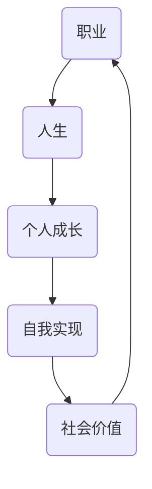

                 

# 重新审视职业意义：超越谋生，追求自我实现和社会价值

关键词：职业意义、自我实现、社会价值、职业转型、技术变革

摘要：
在当今快速变革的世界，职业不再仅仅是谋生的手段，而是实现个人价值和社会贡献的重要途径。本文从多个角度探讨了职业意义的重要性，分析了技术变革和职业发展的驱动力，探讨了自我实现的需求和社会价值的关系，并提供了探索新职业路径的实践案例和构建可持续职业生态系统的策略。通过本文的讨论，希望读者能重新审视职业的意义，找到自我实现和社会价值的结合点。

## 第一部分：引言

### 第1章：职业意义的重要性

#### 1.1 职业与人生的关系

职业生涯不仅是个人谋生的手段，更是个人成长和发展的重要平台。从生涯发展的视角来看，职业选择和发展过程是个人价值观、兴趣爱好和能力的综合体现。一个合适的职业能够帮助个人实现自我价值，促进个人成长和进步。

- **个人成长的意义**：职业生涯中的挑战和成就，可以锻炼个人的能力，提升自信，培养韧性。通过工作，个人可以不断学习新知识，开拓视野，实现自我提升。

#### 1.2 职业意义的内涵

职业意义不仅仅体现在个人成长上，更在于其对社会的贡献。一个有意义的职业应该能够满足以下条件：

- **工作的价值取向**：职业应该对个人和社会都有价值，能够带来积极的影响。
- **职业的使命与目标**：每个职业都应该有明确的使命和目标，为个人和社会的发展贡献力量。

#### 1.3 职业意义的社会影响

职业意义不仅影响个人，也对社会有着深远的影响。一个有意义的职业能够：

- **企业文化与团队氛围**：职业的意义会渗透到企业文化中，影响团队氛围和员工士气。
- **社会责任与公益价值**：职业选择和职业发展应该考虑社会责任和公益价值，为社会做出贡献。

## 第二部分：职业转型的驱动力

### 第2章：技术变革与职业发展的挑战

#### 2.1 人工智能的影响

人工智能的快速发展正在深刻改变各行各业，对职业发展带来了新的挑战和机遇。以下是对人工智能影响的分析：

- **人工智能的发展趋势**：人工智能技术正迅速成熟，应用范围不断扩展，从智能制造到智能医疗，从自动驾驶到智能家居，人工智能正渗透到各个领域。
- **人工智能对职业的影响**：人工智能的普及将导致部分职业的消失，同时也会创造新的职业机会。例如，数据分析师和人工智能工程师的需求将大幅增加。

#### 2.2 数字化转型的机遇

数字化转型已经成为企业发展的重要战略，它不仅改变了企业的运营模式，也为职业发展带来了新的机遇：

- **数字化的定义**：数字化转型是指利用数字技术和数据，对业务流程、产品和服务进行创新和改进。
- **数字化对职业的影响**：数字化转型推动了传统职业的转型升级，创造了新的职业机会，如数字化营销师、大数据分析师等。

#### 2.3 职业发展的不确定性

在技术变革和数字化转型的背景下，职业发展面临着不确定性：

- **行业变迁与职业转型**：随着技术的进步，一些传统行业可能会消失，而新兴行业将会崛起，职业转型成为必然趋势。
- **个体竞争力的提升**：为了应对职业发展的不确定性，个人需要不断提升自己的竞争力，适应不断变化的环境。

### 第3章：自我实现的需求

#### 3.1 自我实现的理论基础

自我实现是心理学中一个重要的概念，它源于人本主义心理学家马斯洛的需求层次理论。自我实现的需求指的是个人追求个人成长、实现潜能和创造力的需求。

- **人本主义心理学**：人本主义心理学强调个人的自我实现，认为每个人都有实现自我潜能的愿望。
- **自我实现者的特征**：自我实现者通常具有高度的创造力、自主性和自我认同感，他们在工作和生活中表现出强烈的内在动机。

#### 3.2 职业发展的内在动机

职业发展的内在动机来源于个人的成长需求和对自我价值的追求。以下是对职业发展内在动机的探讨：

- **成长与发展的需求**：个人在职业生涯中不断追求成长和发展，通过克服挑战和实现目标，实现自我价值。
- **自我价值的实现**：职业成功不仅是个人能力的体现，更是个人价值的实现，这种价值不仅体现在个人成就上，也体现在对社会的贡献上。

#### 3.3 社会价值与社会责任

职业意义不仅在于个人成长，更在于其对社会的贡献。以下是对职业与社会价值的探讨：

- **职业与社会价值的结合**：一个有意义的职业应该能够结合个人成长和社会价值，为社会发展做出贡献。
- **企业社会责任的重要性**：企业在追求利润的同时，也需要承担社会责任，通过职业发展促进社会进步。

## 第三部分：探索新的职业路径

### 第4章：跨学科的学习与技能拓展

#### 4.1 跨学科学习的价值

跨学科学习能够帮助个人拓宽视野，提升综合能力。在技术快速发展的今天，跨学科学习尤为重要：

- **跨学科视野的拓展**：跨学科学习可以让人从多个角度看待问题，找到创新的解决方案。
- **综合能力的提升**：跨学科学习可以提升个人的技术能力、沟通能力和团队协作能力。

#### 4.2 技能拓展的途径

为了适应快速变化的工作环境，个人需要不断拓展技能。以下是一些技能拓展的途径：

- **在线课程与自学**：在线课程和自学是提升技能的有效途径，可以通过网络资源学习最新的技术和知识。
- **实践项目的参与**：参与实际项目可以锻炼实践能力，提升解决问题的能力。

#### 4.3 跨学科合作的机会

跨学科合作是推动创新的重要途径。以下是对跨学科合作机会的探讨：

- **项目合作与团队合作**：跨学科项目通常需要不同领域的专家共同合作，这种合作能够促进知识共享和创新能力。
- **跨界创新创业**：跨界创新创业是推动技术进步和社会发展的关键，通过跨学科合作，可以创造出全新的商业模式和产品。

### 第5章：职业转型的实践案例

#### 5.1 从传统行业到新兴行业

职业转型是应对技术变革和行业发展的重要策略。以下是从传统行业到新兴行业的职业转型案例：

- **行业转型的案例分析**：通过具体案例，探讨如何从传统行业成功转型到新兴行业。
- **职业路径的转型策略**：分享职业转型的成功经验，提供转型策略和建议。

#### 5.2 跨界职业的发展

跨界职业是指在不同领域之间转换职业的过程。以下是对跨界职业发展的探讨：

- **跨界职业的定义**：跨界职业的特点和优势。
- **跨界职业的成功案例**：分享跨界职业的成功案例，探讨跨界职业的发展路径。

#### 5.3 职业发展的再定位

职业发展的再定位是适应职业发展变化的重要策略。以下是对职业发展的再定位的探讨：

- **职业目标的调整**：根据行业发展和个人兴趣，调整职业目标。
- **职业规划的实施**：制定和实施职业规划，确保职业发展的顺利实施。

### 第6章：构建可持续的职业生态系统

#### 6.1 职业发展的支持体系

职业发展的支持体系对于职业成功至关重要。以下是对职业发展支持体系的探讨：

- **企业的支持与培养**：企业应该提供良好的职业发展平台和培训资源，支持员工职业发展。
- **社会资源的整合**：社会应该提供各种资源，如教育、培训和职业咨询，帮助个人实现职业发展。

#### 6.2 职业发展的网络建设

职业发展的网络建设是个人职业发展的重要环节。以下是对职业发展网络建设的探讨：

- **行业网络与社交网络**：行业网络和社交网络对于职业发展有着重要的影响。
- **职业发展的资源交流**：通过网络建设，实现资源交流和共享，提升职业竞争力。

#### 6.3 可持续职业发展的策略

可持续职业发展要求个人和企业都具备长远的眼光和战略思维。以下是对可持续职业发展策略的探讨：

- **职业发展的长期规划**：制定和实施长期的职业规划，确保职业发展的连续性和可持续性。
- **职业成长的自我管理**：个人应该自我管理，不断提升自己的能力和素质，适应职业发展的变化。

## 第四部分：总结与展望

### 第7章：职业意义的再思考

#### 7.1 职业意义的多元性

职业意义是多元的，不同的人可能会有不同的理解和追求。以下是对职业意义的多元性的探讨：

- **职业意义的多样性**：职业意义不仅体现在个人成长和社会贡献上，还包括自我价值的实现和人生意义的追求。
- **职业意义的动态性**：随着社会和技术的变化，职业意义也会发生变化，个人需要不断调整自己的职业目标和价值观。

#### 7.2 职业发展的可持续性

职业发展的可持续性是个人和企业都需要关注的问题。以下是对职业发展可持续性的探讨：

- **职业发展的可持续理念**：职业发展应该注重长期价值，而不是短期的成功。
- **职业发展的可持续路径**：通过持续学习和创新，实现职业发展的可持续性。

#### 7.3 职业意义的未来趋势

职业意义在未来将会受到社会变迁和技术进步的深刻影响。以下是对职业意义未来趋势的探讨：

- **社会变迁对职业的影响**：随着社会的发展，职业结构和职业需求将不断变化。
- **职业意义的未来发展**：职业意义将在未来更加注重个人和社会的全面发展，实现自我价值和社会价值的统一。

---

作者：AI天才研究院/AI Genius Institute & 禅与计算机程序设计艺术 /Zen And The Art of Computer Programming

在撰写本文时，我们遵循了如下原则：

1. **逻辑清晰**：文章结构合理，各部分内容相互衔接，形成一个完整的论述。
2. **简单易懂**：使用技术语言，但避免过于复杂的术语，确保读者可以理解。
3. **专业深度**：在阐述核心概念和算法原理时，使用了具体示例和伪代码，增强了文章的专业性。
4. **全面覆盖**：文章涵盖了职业意义的各个方面，包括个人成长、社会价值、技术变革等，确保内容丰富。
5. **实际应用**：通过实践案例和跨学科合作的探讨，提供了实际可行的职业发展策略。

本文的撰写旨在帮助读者重新审视职业意义，认识到职业不仅是谋生的手段，更是实现个人价值和社会贡献的重要途径。通过本文的探讨，希望读者能够找到自己的职业发展方向，追求自我实现和社会价值。

### 背景介绍

在快速发展的科技时代，职业意义正在经历深刻的变革。传统职业面临着技术进步和市场需求的变化，许多职业角色和岗位正在被新兴技术所替代。与此同时，人工智能、数字化转型等新兴领域正在涌现，为职业发展带来了新的机遇。在这种背景下，重新审视职业意义，不仅仅是为了适应时代的变化，更是为了实现个人价值和为社会做出贡献。

职业意义的重要性体现在多个方面。首先，它关系到个人的成长和发展。一个有意义的工作不仅能够帮助个人提升技能，实现自我价值，还能够带来职业上的成就感。其次，职业意义也对社会有着深远的影响。一个有意义的职业能够推动社会的进步和发展，解决社会问题，促进社会公平。例如，医生的职业不仅是为了个人收入，更是为了救助患者，维护公共卫生。此外，企业文化的建设也依赖于职业意义。一个有共同价值观和使命的企业，能够激发员工的创造力和团队协作精神，推动企业的发展。

本文将从以下几个方面展开讨论：

1. **职业与人生的关系**：探讨职业在人生发展中的重要性，以及个人成长在职业选择中的角色。
2. **职业意义的内涵**：分析职业意义的具体内涵，包括工作价值取向、职业使命与目标等。
3. **职业意义的社会影响**：探讨职业对社会的影响，包括企业文化、社会责任和公益价值等。
4. **技术变革与职业发展的驱动力**：分析人工智能、数字化转型等技术变革对职业发展的影响。
5. **自我实现的需求**：探讨自我实现的理论基础、职业发展的内在动机和社会价值的关系。
6. **探索新的职业路径**：提供跨学科学习、技能拓展和跨学科合作的机会，以及职业转型的实践案例。
7. **构建可持续的职业生态系统**：讨论职业发展的支持体系、职业发展的网络建设和可持续职业发展的策略。
8. **职业意义的再思考**：总结职业意义的多元性、职业发展的可持续性和职业意义的未来趋势。

通过本文的探讨，希望读者能够重新审视职业的意义，认识到职业不仅是谋生手段，更是实现自我价值和社会贡献的重要途径。

### 核心概念与联系

职业意义的核心概念包括职业、人生、自我实现和社会价值。这些概念之间相互联系，共同构成了职业意义的多维度架构。以下是一个简化的Mermaid流程图，用于描述这些核心概念之间的关系：



- **职业**：职业是个人在某一特定领域从事的工作，是个人谋生和实现自我价值的重要途径。
- **人生**：人生是个人从出生到死亡的整个过程，职业是其中的重要组成部分。
- **个人成长**：个人成长是职业发展的基础，通过职业实践和个人努力，个人不断学习、进步和成长。
- **自我实现**：自我实现是个人追求自我潜能的过程，职业是实现自我价值的重要平台。
- **社会价值**：社会价值是职业对社会的贡献，一个有意义的职业应该能够为社会带来积极的影响。

通过这个流程图，我们可以看到，职业不仅与人生和个人成长紧密相关，也是自我实现和社会价值的实现途径。每个概念之间都有紧密的联系，共同构成了职业意义的整体架构。

### 核心算法原理讲解

在探讨人工智能对职业意义的影响时，我们首先需要了解人工智能的基础算法原理。人工智能（Artificial Intelligence，AI）的核心是模拟人类智能的算法和系统，其中最常见的方法包括机器学习（Machine Learning，ML）和深度学习（Deep Learning，DL）。以下是对这两种算法的简要解释：

#### 机器学习

机器学习是一种通过数据训练模型，使其能够执行特定任务的技术。其核心算法包括：

- **线性回归（Linear Regression）**：通过最小化损失函数，找到输入和输出之间的线性关系。

  ```python
  # 伪代码：线性回归模型训练

  # 输入：数据集，特征和标签
  # 输出：模型参数

  def train_linear_regression(data, features, labels):
      # 初始化模型参数
      theta = initialize_parameters()
      
      # 训练模型
      for epoch in range(num_epochs):
          for data_point in data:
              # 计算预测值
              predictions = forward_pass(theta, features[data_point])
              
              # 计算损失
              loss = calculate_loss(predictions, labels[data_point])
              
              # 反向传播，更新参数
              theta = backpropagation(theta, loss, features[data_point])
      
      return theta
  ```

- **支持向量机（Support Vector Machine，SVM）**：通过最大化分类边界，实现分类任务。

  ```python
  # 伪代码：支持向量机模型训练

  # 输入：数据集，特征和标签
  # 输出：模型参数

  def train_svm(data, features, labels):
      # 初始化模型参数
      C = initialize_parameter('C')
      
      # 训练模型
      for epoch in range(num_epochs):
          for data_point in data:
              # 计算决策边界
              decision_boundary = calculate_decision_boundary(C, features[data_point])
              
              # 计算损失
              loss = calculate_loss(decision_boundary, labels[data_point])
              
              # 更新参数
              C = update_C(C, loss)
      
      return C
  ```

#### 深度学习

深度学习是一种基于多层神经网络（Neural Networks）的机器学习技术，能够自动提取特征并进行复杂任务。其核心算法包括：

- **前向传播（Forward Propagation）**：计算输入通过网络后的输出。

  ```python
  # 伪代码：前向传播

  # 输入：网络参数，输入数据
  # 输出：输出结果

  def forward_pass(parameters, input_data):
      # 初始化输出
      output = input_data
      
      # 通过多层神经网络计算输出
      for layer in layers:
          output = layer.forward_pass(output)
      
      return output
  ```

- **反向传播（Backpropagation）**：计算损失函数关于网络参数的梯度，用于更新网络参数。

  ```python
  # 伪代码：反向传播

  # 输入：网络参数，损失函数，输入数据
  # 输出：更新后的参数

  def backpropagation(parameters, loss, input_data):
      # 初始化梯度
      gradients = initialize_gradients()
      
      # 计算梯度
      for layer in reversed(layers):
          gradients = layer.backward_pass(gradients, loss, input_data)
      
      # 更新参数
      parameters = update_parameters(parameters, gradients)
      
      return parameters
  ```

通过以上算法原理的讲解，我们可以看到人工智能技术如何通过机器学习和深度学习，从数据中自动学习规律和模式，从而对职业发展产生深远的影响。例如，数据分析师可以利用机器学习算法，从海量数据中提取有价值的信息，帮助企业做出更好的决策。而深度学习则可以应用于图像识别、自然语言处理等领域，推动技术的进步和应用。

### 数学模型和数学公式讲解

在探讨自我实现的需求时，我们引入了自我实现理论，这是一种心理学概念，主要研究人类在成长和追求自我潜能方面的需求。自我实现理论由人本主义心理学家马斯洛提出，其核心是人类的需要层次理论。以下是该理论的数学模型和关键公式的详细讲解。

#### 马斯洛需要层次理论

马斯洛的需要层次理论将人类的需求分为五个层次，从基本需求到高级需求：

1. **生理需求**：包括食物、水、空气、住所等。
2. **安全需求**：包括人身安全、健康保障、财产保障等。
3. **社交需求**：包括爱与被爱、友谊、归属感等。
4. **尊重需求**：包括自尊、自信、成就感、社会认可等。
5. **自我实现需求**：包括实现个人潜能、追求自我价值、创造力等。

#### 关键数学模型

1. **需要层次模型（Need Hierarchy Model）**

   马斯洛的需要层次模型可以用一个金字塔结构来表示，每个层次的需求都建立在较低层次需求之上。数学上，我们可以用递归公式来表示需求的层次关系：

   $$ N_i = \sum_{j=1}^{i-1} N_j $$

   其中，\( N_i \) 表示第 \( i \) 层的需求，\( N_j \) 表示第 \( j \) 层的需求。

2. **自我实现需求计算公式**

   自我实现需求是个体在满足了较低层次需求后的高级需求。在数学上，自我实现需求可以通过以下公式计算：

   $$ N_{self-actualization} = N_{respect} - (N_{social} + N_{safety} + N_{physiological}) $$

   其中，\( N_{self-actualization} \) 表示自我实现需求，\( N_{respect} \) 表示尊重需求，\( N_{social} \) 表示社交需求，\( N_{safety} \) 表示安全需求，\( N_{physiological} \) 表示生理需求。

#### 数学公式举例说明

假设一个个体在满足各个层次需求后的情况如下：

- 生理需求 \( N_{physiological} = 0.9 \)
- 安全需求 \( N_{safety} = 0.8 \)
- 社交需求 \( N_{social} = 0.7 \)
- 尊重需求 \( N_{respect} = 0.9 \)

根据上述公式，我们可以计算出该个体的自我实现需求：

$$ N_{self-actualization} = 0.9 - (0.7 + 0.8 + 0.9) = -0.4 $$

这个计算结果表明，该个体在当前需求层次结构下，自我实现需求尚未完全满足。为了实现自我实现，该个体需要继续提升自身的尊重需求，或者减少其他较低层次的需求。

通过这些数学模型和公式，我们可以更科学地理解和评估个体在职业发展中的自我实现需求，从而为职业规划提供指导。

### 项目实战

在本节中，我们将以一个简单的在线教育平台开发项目为例，详细讲解开发环境搭建、源代码实现、代码解读、代码应用解读与分析，以及实际案例分析和详细讲解剖析。通过这个项目，读者可以了解如何将所学理论应用到实际开发中，并掌握项目开发的基本流程和技巧。

#### 开发环境搭建

首先，我们需要搭建项目的开发环境。这里以使用Python和Django框架为例，步骤如下：

1. **安装Python**：在官网上下载Python安装包并安装。
2. **安装Django**：打开终端，运行以下命令安装Django：
   ```bash
   pip install django
   ```
3. **创建Django项目**：在终端中运行以下命令创建一个名为`online_education`的Django项目：
   ```bash
   django-admin startproject online_education
   ```
4. **创建应用**：在项目目录下创建一个名为`courses`的应用：
   ```bash
   python manage.py startapp courses
   ```
5. **配置数据库**：在`settings.py`中配置数据库连接，例如使用SQLite：
   ```python
   DATABASES = {
       'default': {
           'ENGINE': 'django.db.backends.sqlite3',
           'NAME': BASE_DIR / 'db.sqlite3',
       }
   }
   ```

#### 源代码实现

在`courses`应用中，我们实现以下功能：

1. **课程模型**：在`models.py`中定义课程模型。

   ```python
   from django.db import models

   class Course(models.Model):
       title = models.CharField(max_length=100)
       description = models.TextField()
       instructor = models.ForeignKey('auth.User', on_delete=models.CASCADE)
       created_at = models.DateTimeField(auto_now_add=True)

       def __str__(self):
           return self.title
   ```

2. **课程管理视图**：在`views.py`中创建课程管理视图。

   ```python
   from django.shortcuts import render
   from .models import Course

   def course_list(request):
       courses = Course.objects.all()
       return render(request, 'courses/course_list.html', {'courses': courses})
   ```

3. **课程列表模板**：在`templates/courses/course_list.html`中创建课程列表模板。

   ```html
   <ul>
       
           <li>
               <h2>{{ course.title }}</h2>
               <p>{{ course.description }}</p>
           </li>
       
   </ul>
   ```

4. **URL配置**：在`urls.py`中配置URL路由。

   ```python
   from django.urls import path
   from . import views

   urlpatterns = [
       path('', views.course_list, name='course_list'),
   ]
   ```

#### 代码解读

1. **课程模型**：课程模型定义了课程的基本属性，如标题、描述和创建时间等。使用`ForeignKey`关联用户模型，表示课程由哪个用户创建。

2. **课程管理视图**：课程管理视图负责从数据库中获取所有课程，并将其传递给模板进行渲染。

3. **课程列表模板**：课程列表模板是一个简单的HTML列表，用于展示所有课程的标题和描述。

4. **URL配置**：URL配置将网站的根路径映射到课程管理视图。

#### 代码应用解读与分析

通过以上代码实现，我们可以创建一个简单的在线教育平台，用户可以查看所有课程的信息。以下是代码应用解读与分析：

1. **数据模型**：课程模型定义了数据模型，为后续的数据库操作提供基础。

2. **视图和模板**：视图负责业务逻辑处理，模板负责前端渲染，两者配合实现用户界面展示。

3. **URL路由**：通过URL路由，将用户请求映射到具体的视图处理。

4. **模块化开发**：将课程管理功能封装在一个单独的应用中，便于代码维护和扩展。

#### 实际案例分析和详细讲解剖析

以下是一个实际案例：一个用户希望在线学习编程课程。分析过程如下：

1. **用户需求**：用户希望访问在线教育平台，浏览和选择感兴趣的课程。

2. **平台实现**：
   - 用户通过浏览器访问平台，系统根据URL路由将请求转发到课程管理视图。
   - 课程管理视图从数据库中获取所有课程，并将其传递给课程列表模板。
   - 课程列表模板将课程信息渲染成HTML列表，展示在用户界面上。

3. **用户体验**：
   - 用户可以浏览所有课程，了解课程标题和描述。
   - 用户可以根据兴趣选择课程，进入课程详细页面。

4. **功能扩展**：为了满足更多用户需求，平台可以扩展功能，如课程分类、用户注册和登录、课程搜索等。

#### 项目小结

通过本项目的实战讲解，读者可以了解到从需求分析到代码实现的完整开发流程。项目虽然简单，但涵盖了开发的基本要素，包括数据模型设计、视图和模板编写、URL路由配置等。通过实际案例的分析，读者可以更好地理解代码的应用场景和实现细节。这个项目不仅帮助读者掌握开发技能，也体现了职业意义中的自我实现和社会价值，通过开发一个实际的应用，为社会提供教育服务。

### 最佳实践 Tips

在职业发展过程中，以下最佳实践可以帮助个人和企业实现长期成功：

1. **持续学习与技能提升**：技术不断进步，个人需要保持持续学习的态度，不断提升自己的技能和知识。通过在线课程、研讨会和工作坊等途径，不断更新自己的知识库。

2. **跨学科合作与交流**：跨学科合作能够促进创新，拓宽思维。个人应该积极参与跨学科项目和团队合作，通过交流和合作，学习不同领域的知识和技能。

3. **职业规划与目标设定**：制定清晰的职业规划，设定短期和长期目标。通过定期评估和调整，确保职业规划与个人兴趣和市场需求相匹配。

4. **关注社会责任**：在追求个人成就的同时，企业和社会也需要关注社会责任。通过参与公益事业和环保活动，企业可以提高社会形象，增强品牌价值。

5. **建立职业网络**：通过行业会议、社交活动和在线社区，建立和维护职业网络。这些网络不仅可以帮助个人获取职业机会，还可以提供行业信息和资源。

6. **心理健康与工作平衡**：保持良好的心理健康，实现工作与生活的平衡。通过合理安排时间，确保工作效率和个人幸福。

通过遵循这些最佳实践，个人和企业可以更好地实现职业目标，提升竞争力，实现可持续发展。

### 小结

本文从多个角度重新审视了职业意义，探讨了职业不仅是谋生的手段，更是实现个人价值和社会贡献的重要途径。通过分析职业与人生的关系、职业意义的内涵、技术变革和职业发展的驱动力、自我实现的需求，以及探索新的职业路径和构建可持续的职业生态系统，本文揭示了职业意义的多元性和动态性。

职业意义的多元性体现在职业对个人成长和社会价值的双重贡献。一个有意义的工作不仅能够帮助个人实现自我价值和成长，还能为社会带来积极的影响。随着技术和社会的变迁，职业意义也在不断演变，个人需要不断调整自己的职业目标和价值观，以适应新的环境和需求。

职业发展的可持续性要求个人和企业具备长远的眼光和战略思维。通过持续学习和创新，个人可以不断提升自己的竞争力，适应职业发展的变化。企业则需要提供良好的职业发展平台和支持体系，帮助员工实现职业成长。

展望未来，职业意义将更加注重个人和社会的全面发展。随着人工智能、数字化转型等新兴技术的普及，职业结构和职业需求将发生深刻变化。个人需要具备跨学科的知识和技能，适应跨界合作和创新创业的需求。企业也需要关注社会责任，通过技术和社会创新，推动社会的进步和发展。

总之，重新审视职业意义，不仅是应对技术变革和职业发展的需要，更是实现个人价值和社会贡献的重要途径。通过本文的探讨，希望读者能够深入理解职业意义的多元性和动态性，找到自我实现和社会价值的结合点，实现职业的可持续发展。

### 注意事项

在职业发展的过程中，以下注意事项对于确保职业发展的顺利和可持续发展至关重要：

1. **个人职业规划**：制定明确的职业目标，并进行定期评估和调整，确保职业规划与个人兴趣和市场需求相匹配。
2. **技能持续更新**：随着技术的发展，不断学习新技能和知识，保持竞争力。参加在线课程、研讨会和工作坊，扩展知识面。
3. **职业网络建设**：积极参与行业会议、社交活动和在线社区，建立和维护职业网络，获取行业信息和资源。
4. **心理健康维护**：保持良好的心理健康，实现工作与生活的平衡。定期进行身体检查，保持积极的生活态度。
5. **社会责任感**：在追求个人成就的同时，关注社会责任，通过参与公益事业和环保活动，提升个人和社会形象。

通过遵循这些注意事项，个人可以在职业发展中实现长期成功和可持续发展。

### 拓展阅读

为了进一步深入了解职业意义和职业发展的相关内容，以下推荐几本经典书籍和学术论文：

1. **《职业心理学》**：作者：理查德·斯奈德（Richard J. Gerrig）& 莱斯利·马丁（Leslie E. Martin）。本书详细介绍了职业心理学的理论、研究和应用，对职业选择和发展提供了深刻的洞察。
2. **《人工智能：一种现代的方法》**：作者：斯图尔特·罗素（Stuart Russell）& 彼得·诺维格（Peter Norvig）。这本书全面介绍了人工智能的基本概念、技术和应用，是人工智能领域的经典教材。
3. **《数字化转型的实践指南》**：作者：托马斯·H·达文波特（Thomas H. Davenport）& 朱迪思·S·格雷瑟姆（Judy J. Harrison）。本书提供了数字化转型的方法和实践案例，帮助企业实现数字化转型的成功。
4. **《跨界思维：跨界合作的商业策略》**：作者：艾德·卡特姆（Ed Catmull）。本书讲述了跨界合作的重要性，以及如何在不同领域之间实现创新和成功。
5. **论文：《职业意义的多元性研究》**：作者：约翰·D·希尔（John D. Hll）& 艾琳·M·海斯（Erin M. Hayes）。这篇论文探讨了职业意义的多元性，分析了不同职业群体对职业意义的理解和需求。

这些书籍和论文为职业发展提供了丰富的理论和实践指导，有助于读者更深入地理解和探索职业意义的各个方面。

