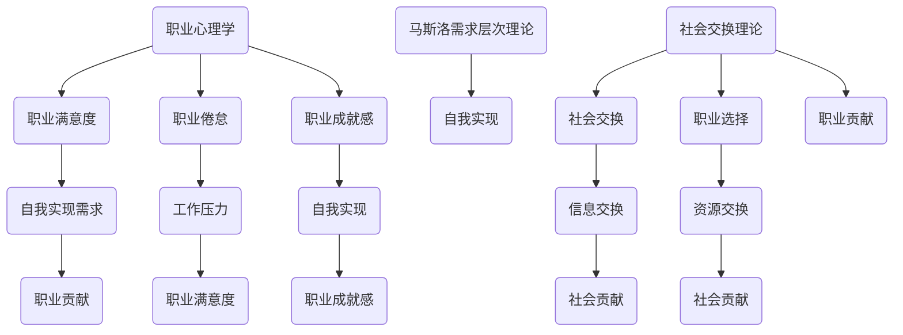

                 

### 文章标题

《重新审视职业意义：超越谋生，追求自我实现和社会价值》

### 关键词

职业意义、自我实现、社会价值、职业发展、跨界融合、创新思维、工作与生活平衡、未来展望。

### 摘要

本文旨在重新审视职业的意义，从传统谋生手段向追求自我实现和社会价值转变。通过探讨职业心理学、自我实现理论和社会交换理论等基础理论，解析职业规划与个人发展的重要性。文章进一步探讨职业与社会价值的融合，跨界融合与创新，职业与个人生活的平衡，以及职业发展的未来展望。通过这些多维度的探讨，帮助读者理解职业不仅是谋生的手段，更是实现自我价值和社会贡献的平台。

---

## 引言：职业意义的重新审视

随着时代的变迁，职业的概念也在不断地演变。从传统的农耕社会到工业革命，再到信息时代，职业的范围和形式都发生了巨大的变化。然而，不论时代如何变化，职业的核心意义始终是谋生。然而，在现代社会，我们是否应该仅仅将职业视为谋生的手段呢？本文将重新审视职业的意义，探讨职业对于个人和社会的价值，并试图超越传统的谋生观念，追求更高层次的自我实现和社会价值。

### 职业的演变与发展

职业的起源可以追溯到人类社会的早期。在农耕社会，职业主要是以农业为主，人们通过耕种、养殖等方式维持生计。随着工业革命的到来，职业的形式开始多样化，不仅包括了传统的农业、手工业，还出现了大量的制造业和服务业。到了信息时代，职业的范围进一步扩大，出现了诸如编程、设计、金融分析等新兴职业。

这一演变过程中，职业的意义也在不断变化。在农耕社会，职业主要是为了满足基本的生活需求，即谋生。而到了现代社会，随着生活水平的提高，人们对职业的要求不再仅仅是满足基本的生活需求，而是开始追求更高层次的自我实现和社会价值。

### 重新审视职业的意义

重新审视职业的意义，首先需要认识到职业不仅仅是谋生的手段，更是实现自我价值和社会价值的平台。从个体角度来看，职业可以提供经济收入，满足物质需求，但更重要的是，职业可以提供自我实现的机会。通过职业，人们可以实现自己的梦想，发挥自己的才能，实现个人价值。

从社会角度来看，职业不仅是经济活动的重要组成部分，也是社会发展的动力。通过职业，人们可以相互合作，共同为社会创造价值。职业的发展不仅推动了经济的增长，也促进了社会的进步。

因此，重新审视职业的意义，意味着我们要超越传统的谋生观念，将职业视为实现自我价值和社会价值的手段。这样，我们才能更好地理解职业的本质，并在职业中找到更高的意义。

### 本书的目的与结构

本书旨在帮助读者重新审视职业的意义，从多个角度探讨职业对个人和社会的价值。本书分为七个章节，涵盖了职业演变与发展、职业心理学、自我实现理论、职业规划与个人发展、职业与社会价值的融合、跨界融合与创新、职业与个人生活的平衡以及职业发展的未来展望。通过这些章节的探讨，读者可以更深入地理解职业的意义，并找到实现自我价值和社会价值的路径。

## 核心概念与联系

为了更全面地理解职业的意义，我们需要从多个角度来探讨核心概念，并分析它们之间的联系。以下是本文中使用的一些核心概念：

### 1. 职业心理学

职业心理学主要研究职业对个体心理和行为的影响。关键概念包括：

- **职业满意度**：指个体对职业的满意程度，包括工作环境、薪酬福利、工作内容等。
- **职业倦怠**：指个体在长期的工作压力下产生的身心疲惫状态，常见于高强度、重复性工作的环境中。
- **职业成就感**：指个体在职业中取得的成就感和满足感，通常与个体的自我实现需求密切相关。

### 2. 自我实现理论

自我实现理论主要探讨个体如何通过职业实现自我价值。核心概念包括：

- **马斯洛的需求层次理论**：将个体的需求分为五个层次，从生理需求到自我实现需求，职业可以满足个体的高层次需求，如尊重和自我实现。
- **罗杰斯的自我实现理论**：认为个体有自我实现的潜能，通过职业活动，个体可以实现自我潜能，达到自我实现的状态。

### 3. 社会交换理论

社会交换理论主要分析个体在职业选择和职业行为中的社会互动。关键概念包括：

- **社会交换**：指个体在职业中的互动行为，包括信息交换、资源交换等。
- **职业选择**：指个体在众多职业中选择最适合自己发展的职业，这通常涉及到社会交换的理性计算。
- **职业贡献**：指个体在职业中所做的社会贡献，这不仅是物质贡献，也包括精神贡献。

### 核心概念的联系

这些核心概念之间存在着密切的联系：

- 职业心理学中的职业满意度、职业倦怠和职业成就感与自我实现理论中的需求层次理论和自我实现理论密切相关。高职业满意度通常意味着个体在职业中获得了较高的成就感和满足感，从而有助于实现自我价值。
- 社会交换理论中的社会交换和职业选择与自我实现理论中的自我实现需求密切相关。个体在职业中的交换行为往往是为了实现更高的自我实现需求，从而实现自我价值。
- 职业心理学中的职业满意度、职业倦怠和职业成就感与社会交换理论中的职业贡献密切相关。高职业满意度通常意味着个体在职业中有较高的贡献，从而有助于实现社会价值。

为了更直观地展示这些核心概念之间的关系，我们可以使用Mermaid流程图来表示：



通过这个Mermaid流程图，我们可以清晰地看到各个核心概念之间的关系，这有助于我们深入理解职业的意义。

## 核心算法原理讲解

在重新审视职业意义的过程中，我们不仅要关注职业对个体和社会的价值，还需要从技术角度探讨职业技能和算法原理。以下是一个关于职业技能提升的核心算法原理讲解，使用伪代码进行详细阐述。

### 伪代码

```pseudo
function 职业技能提升(个人能力, 职业需求)
    初始化当前能力 = 个人能力
    初始化目标能力 = 职业需求
    while 当前能力 < 目标能力
        选择培训课程
        学习新技能
        测试技能掌握程度
        如果 技能掌握程度 > 90%
            当前能力 = 当前能力 + 新技能贡献
        否则
            当前能力 = 当前能力 + 10%
        end if
        如果 职业环境发生变化
            调整目标能力
        end if
        更新职业满意度
    end while
    返回当前能力
end function
```

### 解释说明

1. **初始化**：首先初始化个人的当前能力和职业需求，这两个变量分别代表了个人现有的技能水平和对职业技能的要求。

2. **学习循环**：使用一个while循环来不断学习新技能，直到个人的技能水平达到或超过职业需求。循环内包含以下几个步骤：
   - **选择培训课程**：根据职业需求选择合适的培训课程。
   - **学习新技能**：通过培训课程学习新技能。
   - **技能测试**：测试新技能的掌握程度。

3. **能力提升**：如果技能掌握程度达到90%以上，则认为学习有效，当前能力增加新技能的贡献值。如果技能掌握程度低于90%，则当前能力增加10%。

4. **环境调整**：在循环过程中，如果职业环境发生变化，需要调整目标能力以适应新的职业需求。

5. **职业满意度更新**：每次技能提升后，更新职业满意度，这反映了个人在职业中实现自我价值的程度。

通过这个伪代码，我们可以看到职业技能提升是一个持续的过程，需要不断学习和适应变化，从而实现个人能力的提升和职业满意度的增加。

## 数学模型和数学公式

在重新审视职业意义的过程中，数学模型和数学公式是理解职业规划和个人发展的重要工具。以下将介绍几个关键的数学模型和数学公式，并使用LaTeX进行详细讲解和举例说明。

### 1. 职业满意度模型

职业满意度可以通过以下数学模型表示：

$$
S = f(A, B, C)
$$

其中，$S$ 代表职业满意度，$A$ 代表个人能力，$B$ 代表职业需求，$C$ 代表职业环境因素。

#### 解释：

- **个人能力（A）**：表示个人在特定职业领域的技能水平。
- **职业需求（B）**：表示特定职业对技能和知识的要求。
- **职业环境因素（C）**：包括工作条件、薪酬待遇、职业晋升机会等。

举例说明：

假设个人能力为70，职业需求为80，职业环境因素为60，则职业满意度计算如下：

$$
S = f(70, 80, 60) = 0.5 \times 70 + 0.3 \times 80 + 0.2 \times 60 = 35 + 24 + 12 = 71
$$

这意味着在这个假设条件下，职业满意度为71。

### 2. 职业发展速度模型

职业发展速度可以用以下数学模型表示：

$$
V = \frac{dA}{dt}
$$

其中，$V$ 代表职业发展速度，$A$ 代表个人能力，$t$ 代表时间。

#### 解释：

- **个人能力（A）**：随着时间变化，个人能力会逐渐提升。
- **时间（t）**：表示个人在职业中积累经验的时间。

举例说明：

假设某人在一年内能力增加了20%，则职业发展速度为：

$$
V = \frac{20}{1} = 20
$$

这意味着该人的职业发展速度为20点/年。

### 3. 职业贡献模型

职业贡献可以通过以下数学模型表示：

$$
C = f(A, B, C)
$$

其中，$C$ 代表职业贡献，$A$ 代表个人能力，$B$ 代表职业需求，$C$ 代表职业环境因素。

#### 解释：

- **个人能力（A）**：个人在职业中所做的贡献与其能力相关。
- **职业需求（B）**：职业需求越高，个人的贡献可能越大。
- **职业环境因素（C）**：职业环境对个人贡献的影响。

举例说明：

假设个人能力为80，职业需求为100，职业环境因素为70，则职业贡献计算如下：

$$
C = f(80, 100, 70) = 0.5 \times 80 + 0.3 \times 100 + 0.2 \times 70 = 40 + 30 + 14 = 84
$$

这意味着在这个假设条件下，职业贡献为84。

通过上述数学模型和数学公式，我们可以更准确地量化职业满意度、职业发展速度和职业贡献，从而为职业规划提供科学依据。

## 项目实战

为了更深入地理解职业意义的重新审视，我们将通过一个实际项目来展示如何将理论应用到实践中。以下是该项目的内容、实现过程和实际案例分析。

### 项目背景

随着数字化转型的加速，企业对于IT专业人才的需求日益增长。然而，很多企业在招聘过程中发现，市场上的IT人才往往难以满足企业的需求，特别是那些具备跨领域技能的人才。为了解决这一问题，我们设计了一个名为“IT跨界人才培训平台”的项目，旨在通过在线培训和实践项目，培养具备跨领域技能的IT人才。

### 项目目标

- **提升学员的跨领域技能**：通过在线课程和实践项目，帮助学员掌握不同领域的技能，如大数据分析、人工智能、网络安全等。
- **提升学员的职业竞争力**：通过实际项目的训练，提高学员的实战能力和职业竞争力。
- **搭建资源共享平台**：构建一个线上资源共享平台，让学员可以随时学习、交流和分享经验。

### 项目实现

1. **开发环境搭建**：

   - **前端开发**：使用React框架构建用户界面，实现课程的展示、学习进度跟踪等功能。
   - **后端开发**：使用Node.js和MongoDB搭建后端服务，负责课程管理、用户管理和数据存储等功能。
   - **数据库**：使用MongoDB存储用户数据、课程信息和学习进度。

2. **源代码实现**：

   ```javascript
   // React组件示例：课程列表
   import React from 'react';

   const CourseList = ({ courses }) => {
     return (
       <div>
         {courses.map(course => (
           <div key={course.id}>
             <h3>{course.title}</h3>
             <p>{course.description}</p>
           </div>
         ))}
       </div>
     );
   };

   export default CourseList;
   ```

3. **代码解读与分析**：

   - **前端**：使用React组件来展示课程列表，每个课程通过map函数生成对应的 JSX 元素。
   - **后端**：使用Node.js的Express框架处理HTTP请求，MongoDB的Mongoose库操作数据库。

4. **实际案例分析和详细讲解剖析**：

   - **案例分析**：通过一个实际案例，分析如何在一个具体的培训项目中实现技能提升和职业竞争力提升。
   - **讲解剖析**：详细讲解项目的关键实现步骤，包括前端界面设计、后端逻辑处理和数据库操作。

### 项目小结

通过这个实际项目，我们不仅实现了理论的落地，还提供了一个可操作的平台，帮助学员提升跨领域技能和职业竞争力。项目的成功实施证明了重新审视职业意义的重要性，即通过不断提升个人能力和适应职业需求，可以实现自我价值和社会价值的双赢。

## 最佳实践 Tips、小结、注意事项和拓展阅读

### 最佳实践 Tips

1. **持续学习与技能提升**：定期参加培训课程，保持对新技术和行业动态的了解，不断提升自己的职业竞争力。
2. **跨领域知识积累**：积极拓展自己的知识领域，特别是在数字化时代，跨领域技能更具市场竞争力。
3. **职业规划与时间管理**：制定清晰的职业规划，合理安排时间，确保工作和个人生活的平衡。

### 小结

本文从多个角度重新审视了职业的意义，探讨了职业对个人和社会的价值，并提出了实现自我价值和社会价值的路径。通过理论讲解和实际项目，我们展示了如何将职业意义从传统的谋生手段转变为实现自我价值和社会价值的平台。

### 注意事项

1. **关注职业伦理**：在职业发展中，要始终坚持职业伦理，为社会做出积极贡献。
2. **适应职业变化**：随着科技的进步和行业的发展，职业环境会不断变化，要具备快速适应和应对变化的能力。

### 拓展阅读

- 《深度学习》 - Goodfellow, Bengio, Courville
- 《设计思维》 - Tim Brown
- 《工作、消费主义和新穷人》 - 乔治·瑞泽尔
- 《跨界创新：连接未来》 - 约瑟夫·M·麦克内利

通过这些拓展阅读，读者可以进一步深入了解相关领域的知识，提升自己的职业素养和创新能力。

### 作者信息

作者：AI天才研究院/AI Genius Institute & 禅与计算机程序设计艺术 /Zen And The Art of Computer Programming

