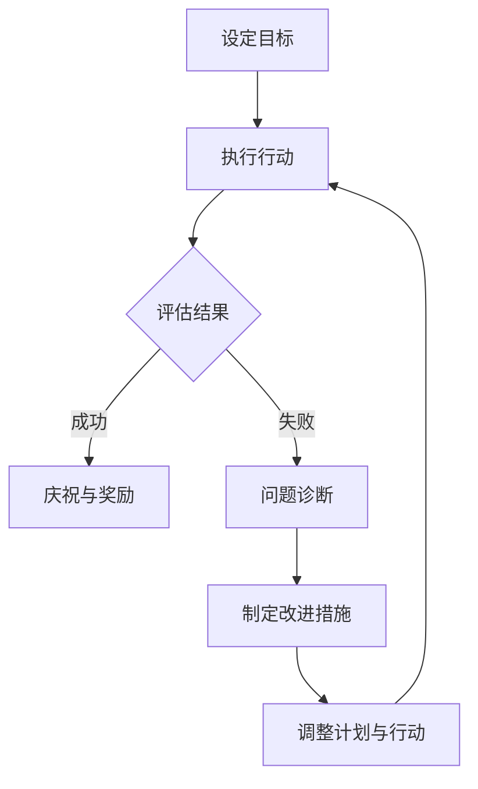

                 


### 背景介绍

在现代社会，个人成长已经成为每个人不可忽视的重要议题。无论是在职业生涯的起伏，还是日常生活的琐碎，成长都扮演着至关重要的角色。然而，传统观念中，成长往往被定义为外在成就的积累，例如财富、地位、知识技能的提升等。这种追求外在成就的观念在一定程度上推动了社会的进步和个人发展，但同时也带来了一系列负面影响。人们可能陷入了追求短期效益的困境，忽视了个人内在的成长和精神的满足。这种现象引发了人们对于个人成长的新一轮思考：何谓真正的成长？我们应该追求什么样的成长？

本文旨在重新思考个人成长的意义，探讨从外在成就到内在成熟的转变。外在成就虽然能够带来一时的满足感，但内在成熟才是长期可持续发展的基石。本文将从以下几个方面进行阐述：

1. **自我认知与成长的关系**：通过深入理解自我认知的重要性，认识到自我认知在成长过程中的核心作用。
2. **外在成就的驱动因素**：分析外在成就的来源，探讨其优缺点，以及如何正确地看待外在成就。
3. **内在成熟的核心要素**：详细探讨内在成熟的概念及其核心要素，包括自我意识、情感智慧、人际关系和自我实现。
4. **从外在成就到内在成熟的转型**：探讨转型的必要性、挑战和实际操作策略。
5. **终身学习的态度与技巧**：探讨终身学习在个人成长中的价值和方法。
6. **个人成长计划的制定与执行**：介绍如何制定和执行有效的个人成长计划。

通过这些方面的深入探讨，我们希望能够为读者提供一个全面、系统的个人成长思考框架，帮助大家从更深的层次理解和追求个人成长。

### 核心概念与联系

在重新思考个人成长的过程中，有几个核心概念需要我们深入探讨，这些概念不仅相互独立，更彼此交织，共同构成了个人成长的复杂图景。以下是这些核心概念及其相互关系的详细探讨：

**1. 自我认知**：自我认知是指个体对自己心理状态、行为动机以及个人特点的认知。它是个人成长的基础，因为只有深入了解自己，才能更好地设定目标、制定计划并实现自我提升。自我认知不仅包括对个人优势的认识，还包括对自身弱点和不足的理解。这种全面的自我认知有助于个体更好地把握自己的成长方向。

**2. 外在成就**：外在成就通常指的是个体在事业、学业、社会地位等方面所取得的成绩。这些成就可能通过金钱、荣誉、地位等外在指标来衡量。外在成就往往与社会认可和自我价值感的提升密切相关，但也容易导致个体过度依赖外部评价，忽视了内在的成长需求。

**3. 内在成熟**：内在成熟则是指个体在情感智慧、人际关系、自我实现等方面的全面成长。它不仅仅关注外在成就，更强调内在的平衡和精神的满足。内在成熟的核心包括自我意识、情感智慧、人际关系和自我实现，这些方面共同构成了个体精神世界的丰富性和深度。

**4. 成长阶段**：个人成长可以划分为不同的阶段，从基础成长阶段到中间成长阶段，再到成熟期和持续成长阶段。每个阶段都有其独特的特点和要求。基础成长阶段主要是个体积累知识和技能的时期，而中间成长阶段则更侧重于提升能力和建立人际关系。成熟期是个体在各个领域达到一定高度，开始思考和反思自己的成长过程。持续成长阶段则强调个体终身学习和自我提升的态度。

**相互关系**：

- **自我认知与外在成就**：自我认知决定了个体如何追求外在成就。一个自我认知清晰的个体能够明确自己的目标，合理规划自己的行动，从而更有可能取得成功。同时，外在成就也反过来影响自我认知，成功的外在成就可能增强个体的自信和自我价值感。

- **外在成就与内在成熟**：外在成就和内在成熟之间存在一定的矛盾。过度追求外在成就可能导致个体忽视内在的成长，而内在成熟则可能削弱对外在成就的渴望。然而，一个内在成熟的个体能够平衡这两者，使外在成就成为内在成熟的体现，而不是唯一目标。

- **内在成熟与成长阶段**：内在成熟贯穿于整个成长阶段，但不同阶段的内在成熟侧重点不同。在基础成长阶段，内在成熟可能更多体现在自我意识和情感智慧的培养上；而在成熟期，内在成熟则可能更强调人际关系和自我实现。

通过上述核心概念及其相互关系的探讨，我们可以更全面地理解个人成长的复杂性，从而在追求外在成就的同时，不忽视内在的成熟和精神的满足。

#### 伪代码：成长阶段识别与成长策略推荐

为了更好地理解和指导个人成长，我们可以设计一个伪代码模型，用于识别个体所处的成长阶段并推荐相应的成长策略。这个模型将基于自我认知、外在成就和内在成熟三个核心概念，通过一系列判断和计算，为个体提供定制化的成长路径。

```python
class PersonalGrowthModel:
    def __init__(self, self_awareness, external_achievement, inner_maturity):
        self.self_awareness = self_awareness
        self.external_achievement = external_achievement
        self.inner_maturity = inner_maturity
    
    def identify_growth_stage(self):
        if self.self_awareness < 5 and self.external_achievement < 5 and self.inner_maturity < 5:
            return "基础成长阶段"
        elif self.self_awareness > 7 and self.external_achievement > 7 and self.inner_maturity > 7:
            return "成熟期"
        else:
            return "中间成长阶段"
    
    def recommend_growth_strategy(self, stage):
        if stage == "基础成长阶段":
            strategy = "专注于技能提升和基础知识积累，增强自我认知和情感智慧"
        elif stage == "成熟期":
            strategy = "保持终身学习，关注内在成熟，特别是人际关系和自我实现"
        else:
            strategy = "平衡外在成就和内在成熟，寻找个人成长的最佳平衡点"
        return strategy

# 示例使用
model = PersonalGrowthModel(self_awareness=6, external_achievement=7, inner_maturity=4)
growth_stage = model.identify_growth_stage()
growth_strategy = model.recommend_growth_strategy(growth_stage)

print(f"当前成长阶段：{growth_stage}")
print(f"推荐成长策略：{growth_strategy}")
```

在这个模型中，我们通过三个参数（自我认知、外在成就和内在成熟）的值，判断个体所处的成长阶段，并给出相应的成长策略建议。这个模型不仅帮助我们识别个人成长的状态，还为制定具体的成长计划提供了指导。

### 外在成就的驱动因素

在探讨个人成长时，外在成就往往是一个不容忽视的重要方面。外在成就不仅反映了个体在某一领域或多个领域中的表现，还与个人的社会地位、经济状况和心理满足感密切相关。因此，理解外在成就的驱动因素，有助于我们更有效地追求和实现这些成就。

**定义**：外在成就通常指的是通过外部的标准和评价体系所认可的成绩，包括但不限于职位晋升、薪资增长、荣誉称号、科研成果、市场表现等。这些成就往往以具体的数字和指标来衡量，具有明显的可见性和可量化性。

**驱动因素分析**：

**1. 努力程度**：努力程度是外在成就取得的基础。个体的勤奋程度、工作时间、学习时长以及持续的努力精神都是决定成就高低的关键因素。高努力程度意味着更高的投入和更积极的行动，从而为外在成就的获得提供坚实的基础。

**伪代码示例**：我们可以通过一个简单的伪代码模型来表示努力程度对成就的影响。
```python
def effort_achievement(effort):
    # 假设努力程度与成就成正比
    achievement = effort * 0.1
    return achievement
```

**2. 技能水平**：技能水平是衡量外在成就的另一重要因素。高技能水平的个体能够更高效地完成工作任务，解决复杂问题，从而在竞争中获得优势。技能水平的提升通常需要通过专业培训、实践经验和个人学习来实现。

**伪代码示例**：以下是一个用于表示技能水平对成就影响的模型。
```python
def skill_achievement(skill_level):
    # 假设技能水平与成就呈二次关系
    achievement = skill_level ** 2
    return achievement
```

**3. 机遇**：机遇在个人成长过程中扮演着不可忽视的角色。适当的机遇能够为个体提供展示才能的平台，加速成就的实现。机遇可以是意外的机会，如一个关键项目的启动，也可以是良好的社会环境，如技术创新浪潮。

**伪代码示例**：一个简单的机遇评估模型。
```python
def opportunity_achievement(opportunity_score):
    # 假设机遇与成就成正比
    achievement = opportunity_score * 10
    return achievement
```

**综合公式**：将上述三个因素结合起来，我们可以得出一个综合公式来衡量外在成就。
$$ 成就 = 努力程度 \times 技能水平 \times 机遇 $$

**示例计算**：假设一个个体在某一领域的努力程度为8，技能水平为9，机遇得分为7，那么他的外在成就可以通过以下公式计算：
$$ 成就 = 8 \times 9 \times 7 = 504 $$

通过这一公式，我们可以清晰地看到努力程度、技能水平和机遇三个因素对外在成就的影响，从而为个人成长提供具体的指导。

**优点与缺点**：

**优点**：

1. **激励作用**：外在成就的驱动因素能够激发个体的积极性和进取心，促使他们不断努力，追求更高的目标。
2. **社会认可**：外在成就能够获得社会和他人的认可，提升个体的自信心和自尊感。
3. **资源获取**：高外在成就有助于个体获取更多的资源和机会，如晋升空间、资金支持、项目机会等。

**缺点**：

1. **短期导向**：过度追求外在成就可能导致个体忽视长期内在成长，导致成长的不均衡。
2. **依赖外部评价**：过分依赖外在成就的评价标准，可能导致个体忽视自身内在的感受和需求，陷入焦虑和压力。
3. **机遇不均**：外在成就的获取在很大程度上依赖于机遇，而机遇往往是不可控的，这可能导致个体感到无助和挫败。

综上所述，外在成就的驱动因素虽然对个人成长有着重要的促进作用，但我们也需要警惕其可能带来的负面影响，寻求外在成就与内在成熟的平衡。

### 内在成熟的核心要素

在追求外在成就的同时，内在成熟同样至关重要。内在成熟不仅关乎个体的心理健康和精神满足，也是长期可持续发展的基石。内在成熟的核心要素包括自我意识、情感智慧、人际关系和自我实现。以下将分别探讨这些要素及其重要性。

**自我意识**：自我意识是指个体对自己内心世界和外在行为的深刻认知和理解。它包括对自身优点和缺点的认识、对情感和动机的觉察以及对自己行为后果的反思。自我意识是内在成熟的基础，因为它帮助个体更好地了解自己，从而能够更有针对性地进行自我提升。一个高自我意识的个体能够更加自信，不容易受到外界负面评价的影响，也能够更好地应对生活中的各种挑战。

**情感智慧**：情感智慧是指个体识别、理解和管理自己和他人的情感的能力。它包括情感知觉、情感管理和情感表达等方面。情感智慧不仅影响个人的心理健康，还直接影响人际关系。一个高情感智慧的人能够更好地处理压力和冲突，建立和维护健康的人际关系，从而在工作和生活中获得更多的支持和帮助。

**人际关系**：人际关系是指个体与周围人建立和维护的关系。它包括家庭关系、友谊、社交网络等。良好的人际关系是内在成熟的重要标志，因为它能够为个体提供情感支持和实际帮助，增强个体的社会归属感和安全感。一个高人际关系能力的人能够有效地沟通和协调，建立和谐的人际关系，从而在社交环境中更加得心应手。

**自我实现**：自我实现是指个体在认知、情感、行为等方面达到其潜能的最高水平。它包括实现个人目标、追求个人价值以及实现个人潜能等方面。自我实现是内在成熟的最终目标，因为它使个体能够充分地发挥自己的能力和才华，实现个人的价值和意义。一个自我实现的人通常具有高度的满足感和成就感，能够在工作和生活中找到真正的快乐和幸福。

**相互关系**：这些核心要素相互交织，共同构成了个体内在成熟的全貌。自我意识为个体提供了清晰的自我认知，情感智慧帮助个体更好地管理自己的情绪，人际关系为个体提供了情感支持和社会资源，自我实现则使个体能够充分发挥自己的潜能。这些要素相互促进，相互依赖，共同推动个体的内在成熟。

- **自我意识与情感智慧**：自我意识帮助个体更好地理解自己的情感和动机，从而在情感管理上更加自如。情感智慧则进一步深化了这种理解，使个体能够更准确地识别和表达自己的情感。

- **情感智慧与人际关系**：情感智慧使个体能够更好地理解和处理他人的情感，从而在人际交往中更加得体和有效。良好的人际关系则为个体提供了更多的情感支持和实践机会，进一步提升了情感智慧。

- **人际关系与自我实现**：良好的人际关系为个体提供了实现个人目标和追求个人价值的社会支持，从而有助于自我实现。自我实现则使个体更加清晰地认识到自己在人际关系中的价值和作用，进一步促进人际关系的和谐。

通过深入理解和培养这些核心要素，个体可以在追求外在成就的同时，实现内在的成熟和精神的满足，从而实现全面、可持续的个人成长。

#### 伪代码：情感智慧评估模型

为了更好地评估和培养个体的情感智慧，我们可以设计一个情感智慧评估模型。这个模型将基于情感知觉、情感管理和情感表达三个核心指标，通过一系列计算和评估，为个体提供具体的情感智慧评分和改进建议。

```python
class EmotionalWisdomAssessment:
    def __init__(self, emotional_perception, emotional_management, emotional_expression):
        self.emotional_perception = emotional_perception
        self.emotional_management = emotional_management
        self.emotional_expression = emotional_expression
    
    def calculate_score(self):
        # 假设情感智慧评分与三个指标的加权平均值成正比
        score = (self.emotional_perception * 0.3 + self.emotional_management * 0.4 + self.emotional_expression * 0.3)
        return score

    def provide_suggestions(self, score):
        if score < 5:
            suggestions = "加强情感知觉和表达，尝试情感管理的练习"
        elif score < 8:
            suggestions = "保持现有水平，进一步发展情感管理能力"
        else:
            suggestions = "情感智慧处于较高水平，关注自我提升和持续学习"
        return suggestions

# 示例使用
assessment = EmotionalWisdomAssessment(emotional_perception=6, emotional_management=7, emotional_expression=5)
score = assessment.calculate_score()
suggestions = assessment.provide_suggestions(score)

print(f"情感智慧评分：{score}")
print(f"改进建议：{suggestions}")
```

通过这个模型，我们可以量化评估个体的情感智慧水平，并根据评估结果提供个性化的改进建议，从而帮助个体更好地提升情感智慧，实现内在成熟。

### 从外在成就到内在成熟的转型

在追求外在成就的过程中，许多人往往会发现，尽管他们取得了显赫的成就，内心的满足感和幸福感却并未随之增加。相反，可能会感到焦虑、孤独和空虚。这种情况下，个体可能需要从外在成就转向追求内在成熟，实现从外在成就到内在成熟的转型。这一转型不仅关乎个体的心理健康，也关系到个人成长的长远发展。

**转型的必要性**：

1. **内在需求的满足**：外在成就虽然能够带来短暂的满足感，但长期依赖外在评价会导致个体内在需求的忽视。内在成熟关注个体的情感智慧、自我意识和人际关系，能够带来更持久的心灵满足。

2. **可持续发展的基础**：外在成就容易受到外部环境变化的影响，而内在成熟则是长期可持续发展的基础。一个内在成熟的个体能够更好地应对各种挑战，实现个人价值的持续提升。

3. **综合成长的追求**：外在成就和内在成熟并非孤立存在，而是相辅相成的。一个平衡发展的个体能够在实现外在成就的同时，实现内在的成长和满足。

**转型的挑战**：

1. **习惯性思维模式**：长期依赖外在成就的个体可能会形成习惯性思维模式，忽视内在的成长需求。这种思维模式需要通过自我反思和调整来克服。

2. **时间和精力分配**：转型意味着个体需要重新分配时间和精力，从追求外在成就转向培养内在成熟。这需要个体有意识地调整生活方式和价值观。

3. **情感上的困扰**：转型过程中，个体可能会经历情感上的困扰，如焦虑、恐惧和不安。这需要个体具备较强的情感调节能力，以顺利度过转型期。

**实际操作策略**：

1. **自我反思**：定期进行自我反思，了解自己的内在需求和成长方向。通过写日记、冥想等方式，深入挖掘自己的情感和思想，找到内在成长的动力。

2. **培养情感智慧**：通过阅读、课程学习、心理咨询等方式，提升情感知觉、情感管理和情感表达能力。情感智慧的提升将有助于个体更好地理解和管理自己的情绪，实现内心的平衡。

3. **建立支持系统**：与家人、朋友和专业人士建立良好的支持系统，分享自己的成长经历和困惑。这个支持系统可以为个体提供情感支持和实际帮助，加速转型过程。

4. **终身学习**：保持终身学习的态度，不断拓展知识和技能。通过学习新事物，个体能够保持对生活的热情和好奇心，实现个人潜能的持续开发。

5. **实践和反思**：将内在成熟的理念付诸实践，如通过参与社区活动、志愿服务等方式，培养人际关系和自我实现的能力。在实践过程中，不断反思和调整，逐步实现从外在成就到内在成熟的转型。

通过上述策略，个体可以逐步实现从外在成就到内在成熟的转型，实现更全面、更持久的心灵成长。

### 终身学习的态度与技巧

在快速变化的现代社会，终身学习已经成为了个人成长和职业发展的关键因素。终身学习不仅意味着不断获取新知识和技能，更重要的是培养一种积极的学习态度和有效的学习技巧。以下将探讨终身学习的价值、提升学习效果的方法，以及具体的学习技巧和策略。

**终身学习的价值**：

1. **适应能力**：随着科技和产业的快速变革，具备持续学习的能力是适应社会变化、抓住机遇的重要前提。终身学习帮助个体保持对新技术和趋势的敏感度，从而在职业竞争中保持优势。

2. **个人成长**：终身学习不仅能够提升个体的知识水平，还能促进个人心智的成熟和情感智慧的发展。通过不断学习，个体能够更好地理解世界，提高自我意识和自我实现的能力。

3. **职业发展**：在许多行业，专业技能的不断更新和深化是职业晋升的必要条件。终身学习帮助个体不断更新和提升自己的技能，从而在职业生涯中获得更多的机会。

**提升学习效果的方法**：

1. **明确学习目标**：设定明确、具体的学习目标，有助于集中注意力和资源，提高学习效率。目标应具有可衡量性、可实现性和时限性，以驱动个体持续学习和进步。

2. **合理安排时间**：合理分配学习和休息时间，避免过度疲劳。制定详细的学习计划，确保每天有固定的时间用于学习，从而建立良好的学习习惯。

3. **多样化学习方式**：结合不同的学习方式，如阅读书籍、观看视频教程、参加线上课程、参与研讨会等，可以更全面地吸收知识。多样化的学习方式能够激发学习兴趣，提高学习效果。

**具体的学习技巧和策略**：

1. **主动学习**：主动学习是指通过提问、思考、讨论和实践等方式，积极参与学习过程。主动学习不仅能够提高知识的理解和记忆，还能培养解决问题的能力。

   - **提问技巧**：在学习过程中，不断提问有助于深入思考和理解。提问可以从不同角度探讨问题，促进深度学习。
   - **案例分析**：通过分析具体案例，将理论知识应用于实际情境，提高解决问题的能力。

2. **互动学习**：与他人互动是终身学习的重要方式。通过与同学、同事或专业人士交流，可以获取不同的观点和经验，拓宽视野。

   - **学习小组**：组建学习小组，共同探讨学习内容，互相分享心得和体会，提高学习效果。
   - **网络社区**：加入专业网络社区，参与讨论和分享，获取行业最新动态和前沿知识。

3. **反思和总结**：学习不仅是获取知识的过程，更是反思和总结的过程。通过反思和总结，个体能够不断调整学习策略，优化学习效果。

   - **反思日志**：定期记录学习过程中的心得体会和收获，反思学习方法和效果，及时调整学习计划。
   - **经验分享**：将学习经验分享给他人，通过教学相长的方式，巩固所学知识，提升自己的理解深度。

**举例说明**：

假设一个软件工程师想要提升编程技能，他可以采取以下策略：

1. **明确目标**：设定具体的学习目标，如掌握某项新技术或提高代码质量。

2. **多样化学习方式**：阅读相关技术书籍、观看在线教程、参加技术研讨会。

3. **主动学习**：通过实际项目练习新技术，参与开源项目，与同事讨论编程技巧。

4. **互动学习**：加入专业论坛，参与技术交流，获取业界最新动态。

5. **反思和总结**：定期记录编程过程中遇到的问题和解决方案，总结学习经验。

通过这些策略，这位工程师不仅能够提升编程技能，还能培养积极的学习态度和有效的学习技巧，从而实现个人的持续成长。

### 个人成长计划的制定与执行

制定和执行个人成长计划是实现内在成熟和可持续发展的关键步骤。一个有效的成长计划不仅需要明确的目标和具体的行动计划，还需要包含有效的反馈机制，以便及时调整和优化。以下将详细探讨如何制定和执行个人成长计划，并提供相关的伪代码示例。

**成长计划的基本要素**：

1. **明确目标**：成长计划的第一步是设定明确、具体的目标。这些目标应该是可衡量的，具有可实现性和时限性。例如，“在接下来的六个月内，提升情感智慧，使情感管理评分达到8分”。

2. **行动计划**：为实现目标，需要制定详细的行动计划。这些行动计划应包括具体的行动步骤、执行时间和负责人。例如，“每周进行一次自我反思，记录情感变化和应对策略；每月参加一次情感智慧相关的课程或研讨会”。

3. **时间表**：为每个行动计划设定具体的时间表，有助于确保计划的有序推进。时间表应明确每个行动的具体执行时间，如“每周一和三晚上8点到9点进行自我反思”。

4. **评估标准**：为每个目标设定评估标准，以便在执行过程中进行监控和评估。例如，情感智慧的提升可以通过情感知觉、情感管理和情感表达三个维度的评分来衡量。

5. **支持系统**：建立支持系统，包括家人、朋友、导师或同事的支持，有助于计划的顺利执行。支持系统可以提供情感支持和实际帮助，增强执行的动力。

**伪代码示例**：以下是一个简单的成长计划模型，用于制定和执行个人成长计划。
```python
class PersonalGrowthPlan:
    def __init__(self, goals, actions, timeline, evaluation_criteria):
        self.goals = goals
        self.actions = actions
        self.timeline = timeline
        self.evaluation_criteria = evaluation_criteria
    
    def execute_plan(self):
        for action in self.actions:
            action.execute()
    
    def evaluate_progress(self):
        progress = {}
        for goal in self.goals:
            current_score = calculate_score(goal, self.evaluation_criteria)
            progress[goal] = current_score
        return progress
    
    def adjust_plan(self, progress):
        for goal, current_score in progress.items():
            if current_score < target_score:
                additional_actions = generate_actions_for_goal(goal)
                self.actions.extend(additional_actions)
```

**执行成长计划的步骤**：

1. **目标设定**：首先，明确个人成长的目标。这些目标应具有明确性、可衡量性、可实现性和时限性。例如，提高自我意识、增强情感智慧、改善人际关系等。

2. **制定行动计划**：根据目标，制定具体的行动计划。这些行动计划应包括具体的行动步骤、执行时间和负责人。例如，每天进行自我反思、每周参加一次社交活动、每月阅读一本情感智慧相关的书籍等。

3. **时间表制定**：为每个行动计划设定具体的时间表，确保计划有序推进。例如，每天晚上9点进行自我反思、每周六下午参加社交活动等。

4. **执行计划**：按照制定的行动计划，逐步执行每个任务。确保按时完成每项任务，并在执行过程中保持积极的态度。

5. **监控与评估**：定期监控计划的执行情况，根据设定的评估标准，评估目标的达成情况。通过记录和反馈，了解自己的进步和不足。

6. **调整与优化**：根据监控和评估的结果，及时调整和优化计划。如果目标未达成，可以增加额外的行动步骤或调整目标设定。

7. **反馈与支持**：建立反馈机制，与家人、朋友、导师或同事分享成长过程中的心得和困惑，获取支持和建议。

**注意事项**：

- **保持灵活性**：成长计划应根据实际情况灵活调整，避免过于 rigid 的执行方式。
- **持续激励**：设定奖励机制，以激励自己持续执行计划。例如，每达成一个小目标，就给自己一个奖励。
- **心理准备**：成长过程可能会遇到挫折和困难，保持积极的心态和坚定的信念至关重要。

通过以上步骤和伪代码示例，个体可以更有效地制定和执行个人成长计划，实现内在成熟和长期可持续发展。

### 反馈循环流程图

为了确保个人成长计划的顺利执行和持续优化，建立有效的反馈循环机制至关重要。以下是反馈循环流程图的详细说明和构建方法：



**流程解释**：

1. **设定目标**（A）：在成长计划的初始阶段，明确设定具体的个人目标，确保这些目标具有可衡量性和可实现性。

2. **执行行动**（B）：按照计划，逐步执行各项行动，实现目标。

3. **评估结果**（C）：定期对行动结果进行评估，检查目标是否达成。这一步可以通过自我评估、他人反馈或数据指标等方式进行。

4. **庆祝与奖励**（D）：如果目标达成，进行庆祝和奖励，增强执行的动力和信心。

5. **问题诊断**（E）：如果目标未达成，进入问题诊断阶段，分析原因，找出不足。

6. **制定改进措施**（F）：根据问题诊断的结果，制定具体的改进措施，包括调整策略、增加资源或重新设定目标。

7. **调整计划与行动**（G）：将改进措施纳入成长计划，调整计划中的行动步骤和时间表，确保下一次执行更加有效。

通过这个反馈循环流程图，个体可以不断优化个人成长计划，逐步实现目标的达成和内在成熟。

### 总结与拓展

在本文中，我们深入探讨了从外在成就到内在成熟的转变，分析了个人成长的核心概念及其相互关系，并提出了具体的操作策略和评估模型。通过这些讨论，我们得出以下结论：

1. **自我认知是成长的基础**：自我认知帮助我们了解自己的优势和不足，从而更有针对性地设定目标和制定计划。
2. **外在成就与内在成熟相辅相成**：外在成就虽然能够带来短暂的满足感，但内在成熟才是长期可持续发展的基石。
3. **情感智慧是内在成熟的关键**：提升情感智慧有助于更好地管理自己和他人的情感，建立和谐的人际关系。
4. **终身学习是实现内在成熟的有效途径**：通过不断学习和实践，个体能够提升自己的知识和技能，实现内在的持续成长。

为了进一步拓展这一主题，以下是几个推荐的方向和拓展内容：

1. **情感智慧的深入探讨**：可以研究具体的情感智慧模型，如戈尔曼（Daniel Goleman）提出的情感智慧五要素模型，探讨其在个人成长中的应用。
2. **实践案例分享**：收集和分析实际案例，探讨在不同背景下如何有效地实现从外在成就到内在成熟的转变。
3. **跨学科研究**：结合心理学、管理学、教育学等多学科的理论和方法，探讨个人成长的多维度模型。
4. **技术创新与个人成长**：探讨新技术，如人工智能、虚拟现实等，如何促进个人成长和内在成熟。

通过这些拓展，我们可以更全面、深入地理解个人成长的本质，为实践提供更有力的理论支持。

### 最佳实践 tips、小结、注意事项、拓展阅读

**最佳实践 tips**：

1. **定期自我反思**：每天或每周花时间进行自我反思，了解自己的情感状态和行为模式，有助于提升自我认知。
2. **建立学习小组**：与志同道合的人一起学习，可以相互激励，分享经验和见解，提升学习效果。
3. **设定具体可衡量目标**：确保目标具有明确性和可实现性，以便更好地评估和调整成长计划。
4. **保持好奇心和开放心态**：对新事物保持好奇和开放心态，有助于不断拓展知识和视野。

**小结**：

本文重新思考了个人成长的意义，探讨了从外在成就到内在成熟的转变，分析了自我认知、情感智慧、人际关系和自我实现等核心要素，并提出了具体的操作策略和评估模型。内在成熟是长期可持续发展的关键，需要我们持续关注和实践。

**注意事项**：

1. **避免过分追求外在成就**：内在成长同样重要，不应忽视情感和精神层面的满足。
2. **平衡工作与生活**：合理安排时间，保持身心健康，确保内在成熟与外在成就的平衡。
3. **积极应对挑战**：在成长过程中遇到困难和挫折是正常的，保持积极的心态，寻求支持和帮助。

**拓展阅读**：

1. 《情感智慧：为什么情商比智商更重要》（Daniel Goleman）
2. 《高效能人士的七个习惯》（Stephen R. Covey）
3. 《终身学习：如何成为一个终身学习者》（Seth Godin）
4. 《心智探奇：意识、心智和大脑如何工作》（Stephen Pinker）

通过这些拓展阅读，读者可以进一步深化对个人成长的理解和实践。

