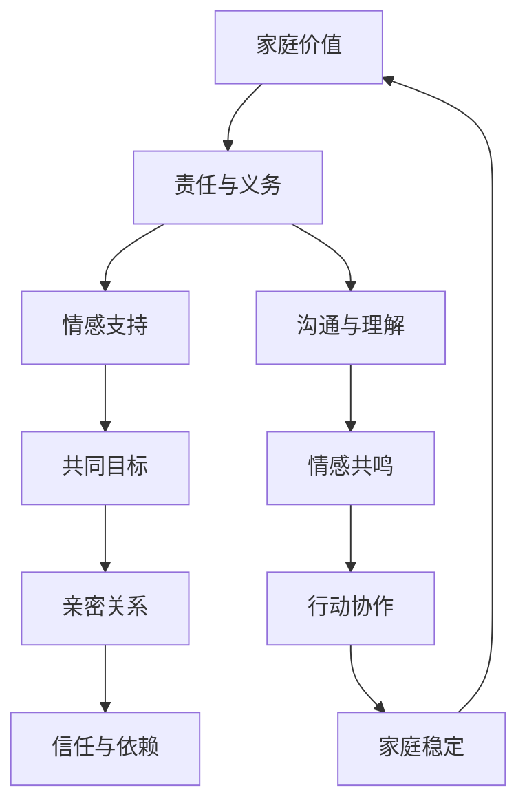
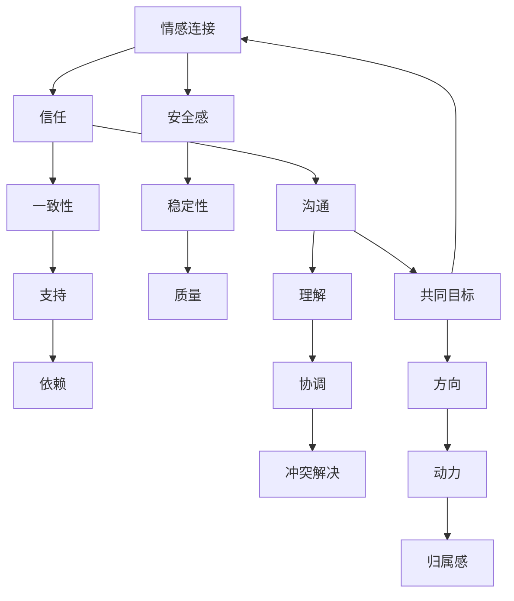
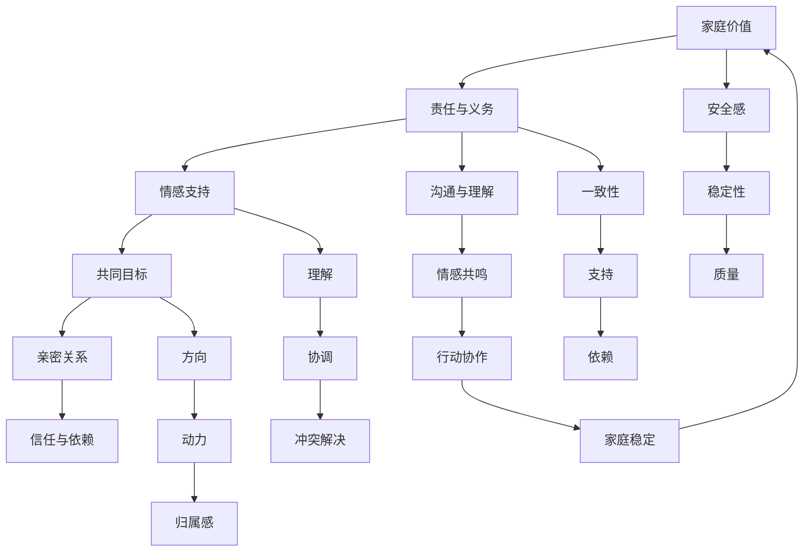

                 

### 前言与引言

在当今社会，家庭作为社会的基本单元，扮演着不可替代的角色。然而，随着社会的快速变迁，传统家庭价值观念面临着前所未有的挑战。现代人在追求个人独立、职业成功的同时，也在寻求家庭与个人之间的平衡。这不仅仅是一个社会问题，更是一个技术问题，一个涉及人际互动和情感交流的问题。

《重新思考家庭价值：在现代社会中重建亲密关系》旨在探讨如何在现代社会中重建家庭价值，从而促进亲密关系的建立与维护。本书的目标是帮助读者理解家庭价值的演变，掌握建立和维护亲密关系的关键技巧，并最终实现个人与家庭的和谐共处。

本文将从以下几个部分进行探讨：

1. **核心概念与联系**：明确家庭价值与亲密关系的定义，并分析它们之间的内在联系。
2. **家庭价值的历史与演变**：回顾传统家庭价值观念，探讨现代社会中家庭价值观念的变革。
3. **亲密关系的核心要素**：详细分析建立和维护亲密关系所需的基础要素。
4. **重建亲密关系的方法**：提供具体的方法和策略，帮助读者在实际生活中应用。
5. **案例研究**：通过成功和失败的案例，总结重建亲密关系的实用经验和教训。
6. **项目实战**：提供实际操作案例，展示如何将理论应用到实际项目中。
7. **附录**：包含相关研究文献、流程图、数学模型等，为读者提供进一步学习和参考的资源。

通过逐步推理和深入分析，本文将帮助读者重新思考家庭价值，并在现代社会中重建亲密关系，实现个人与家庭的和谐发展。

### 核心概念与联系

首先，我们需要明确两个核心概念：家庭价值与亲密关系，并探讨它们之间的内在联系。

**家庭价值的定义**：

家庭价值是指家庭成员在互动和生活中所遵循的一系列原则和价值观。这些价值观通常体现在家庭成员之间的情感联系、责任分担、共同目标等方面。家庭价值不仅仅是一种传统观念，更是现代社会中不可或缺的情感支柱和社会稳定器。

**亲密关系的定义**：

亲密关系指的是个体之间建立起来的一种深刻、信任和互相依赖的关系。这种关系通常伴随着情感上的亲密、心理上的共鸣和行动上的协作。亲密关系不仅影响个体的心理健康，还对家庭稳定和幸福指数具有重要作用。

**家庭价值与亲密关系的联系**：

家庭价值与亲密关系之间存在密切的内在联系。首先，家庭价值为亲密关系提供了基础。家庭成员共同遵循的价值观和行为规范有助于建立一种互相尊重、信任和支持的氛围，从而促进亲密关系的形成。其次，亲密关系可以强化家庭价值。在亲密关系中，个体通过情感交流和共同经历，不断深化对家庭价值的理解和认同，从而进一步巩固家庭价值。

为了更好地理解这两者之间的联系，我们可以使用 Mermaid 流程图来展示它们之间的关系架构。以下是家庭价值与亲密关系之间的 Mermaid 流程图：



在上述流程图中，家庭价值通过责任与义务、情感支持、共同目标等维度，最终影响亲密关系的形成和维持。同时，亲密关系通过信任与依赖、沟通与理解、情感共鸣和行动协作等维度，反作用于家庭价值，形成一种双向互动的关系。

通过这个流程图，我们可以清晰地看到家庭价值与亲密关系之间的动态关系。家庭价值不仅是亲密关系的基石，而且亲密关系也可以通过自身的维护和强化，进一步巩固家庭价值。这种互动关系表明，在现代社会中，重新思考家庭价值、建立和维护亲密关系，是实现个人与家庭和谐发展的关键。

### 家庭价值的历史与演变

家庭价值是一个动态的概念，随着社会历史的发展而不断演变。在传统社会中，家庭价值往往被定义为一种稳定的、基于血缘关系的、遵循传统规范的社会单元。然而，随着现代社会的发展，家庭价值观念也在发生深刻的变革。

**传统家庭价值观念**：

在传统社会中，家庭价值主要体现为家族观念、尊老爱幼、责任感等。家族观念强调家庭成员之间的血缘关系和世代传承，尊老爱幼则强调对长辈和子女的尊重和关怀。此外，传统家庭价值观念中，家庭成员之间的责任分担也是其核心内容之一。例如，在农耕社会，家庭往往是经济生产的基本单位，家庭成员需要共同承担家庭的经济责任和社会责任。

**现代社会家庭价值观念的变革**：

随着工业化和城市化的发展，传统家庭价值观念面临着巨大的挑战和变革。首先，家庭结构发生了变化。传统家庭往往以大家庭为单位，家庭成员之间的互动较为紧密。而现代社会中，核心家庭和小家庭逐渐成为主流，家庭成员之间的互动频率和深度都有所减弱。其次，家庭成员之间的角色也在发生变化。现代社会中，女性开始更多地参与社会生产，家庭角色分工逐渐模糊，男性与女性在家庭中的地位逐渐趋于平等。

此外，现代社会中，家庭价值观念也在逐渐向多元化发展。人们开始更加重视个体的自我实现和幸福感，而不仅仅是家庭和社会的期望。这种变化反映在家庭互动中，就是家庭成员之间更加注重平等、尊重和理解。例如，现代社会中，夫妻之间的沟通更加频繁，亲子关系也更加注重情感交流和尊重个体的独立性。

**家庭价值观念的未来趋势**：

未来，家庭价值观念将继续受到社会变迁的影响，呈现出以下几个趋势：

1. **个体化**：家庭价值观念将更加注重个体的自我实现和幸福感，家庭成员之间的关系将更加平等和尊重。
2. **多元化**：随着社会多元化和文化多样性的增加，家庭价值观念也将变得更加多元和包容。
3. **技术化**：随着信息技术的发展，家庭互动和沟通的方式也将发生变革，家庭价值观念将更加依赖技术手段来实现和维护。

总之，家庭价值观念的历史与演变是一个复杂的过程，它既受到社会历史和文化背景的影响，也随着社会的发展而不断变革。理解家庭价值观念的历史与演变，有助于我们更好地把握现代社会中家庭价值的变化趋势，为重建家庭价值提供理论支持和实践指导。

### 亲密关系的核心要素

亲密关系是一个多层次、多维度的复杂现象，其核心要素包括情感连接、信任、沟通和共同目标。这些要素相互交织，共同构建了亲密关系的基础，并对其稳定性和质量产生深远影响。

**情感连接**：

情感连接是亲密关系的核心，它指的是个体之间在情感上的深度互动和共鸣。这种连接不仅包括情绪上的相互理解和共鸣，还涉及情感上的亲密和温暖。情感连接使个体在困难时刻找到依靠，在快乐时刻分享喜悦，从而增强彼此的归属感和安全感。要建立情感连接，个体需要通过真诚的表达、倾听和理解，以及共同经历情感波动来加深彼此的情感联系。

**信任**：

信任是亲密关系的中流砥柱，它是指个体对对方行为和意图的可靠性持肯定态度。信任建立在诚实、透明和一致性的基础上，是亲密关系稳定性的重要保障。没有信任，亲密关系将无法维系。建立信任需要时间、耐心和持续的努力，个体需要在日常生活中展示出可靠的行为，通过承诺的履行和互相支持的行动来巩固信任。

**沟通**：

沟通是亲密关系中的关键机制，它指的是个体之间通过语言和非语言方式传达信息和情感的互动过程。有效的沟通不仅能够解决误解和冲突，还能增进理解和信任。沟通需要具备倾听、表达和反馈的能力。倾听是理解对方情感和需求的前提，表达是传达自己情感和想法的方式，反馈则是确认对方是否理解自己。通过积极沟通，个体能够更好地协调彼此的需求，增强关系的稳定性。

**共同目标**：

共同目标是维系亲密关系的重要动力，它指的是个体在价值观、目标和生活愿景上的一致性。共同目标能够增强个体之间的共同感和归属感，使关系更加紧密。设立共同目标不仅能够为关系提供方向和动力，还能在实现目标的过程中加深彼此的情感连接和信任。共同目标的设定需要个体之间的沟通和协商，确保每个成员的需求和期望得到尊重和满足。

为了更好地理解这些核心要素之间的关系，我们可以使用 Mermaid 流程图来展示它们之间的动态关系：



在上述流程图中，情感连接、信任、沟通和共同目标四个核心要素相互联系、相互影响，共同构建了亲密关系的基础。这些要素不仅相互增强，还通过互动和协调，提升了关系的稳定性和质量。

通过这个流程图，我们可以清晰地看到亲密关系中的核心要素如何相互交织，共同促进关系的稳定和深化。理解这些核心要素及其相互关系，有助于我们在现实生活中更好地建立和维护亲密关系，实现个人与家庭的和谐发展。

### 重建亲密关系的方法

在现代社会中，重建亲密关系面临着诸多挑战。为了应对这些挑战，我们需要采取一系列具体的方法和策略，以促进沟通、解决冲突、增进信任与支持。以下是一些实用的技巧和建议。

**沟通技巧**：

沟通是重建亲密关系的基石。有效的沟通不仅能增进理解，还能减少误解和冲突。以下是几个关键技巧：

1. **倾听**：倾听是沟通的关键。要真正理解对方的观点和情感，我们需要全神贯注地倾听，避免打断和质疑。倾听不仅仅是听到对方说什么，更是理解对方的感受和需求。
2. **表达**：清晰地表达自己的想法和感受是建立亲密关系的重要一环。在表达时，要尽量使用具体的例子和情感词汇，避免抽象和模糊的表述，以确保对方理解。
3. **反馈**：在沟通过程中，及时给予反馈能够帮助双方确认彼此的理解。通过提问和确认，我们可以确保对方理解我们的意图，并及时调整沟通方式。

**解决冲突的策略**：

冲突是亲密关系中不可避免的现象。有效的冲突解决策略能够帮助双方化解矛盾，增强关系的稳定性。以下是几个关键策略：

1. **冷静处理**：在冲突发生时，保持冷静是非常重要的。情绪化的反应往往会加剧矛盾，使问题更加复杂。通过深呼吸、短暂离开等方式，可以帮助我们冷静下来，更好地处理问题。
2. **倾听和理解**：在解决冲突时，首先要倾听对方的观点和感受，理解对方的立场。通过倾听和理解，我们可以找到共同点，为解决冲突奠定基础。
3. **寻求共识**：在冲突解决过程中，寻求共识比追求胜利更为重要。通过妥协和合作，双方可以找到双方都能接受的解决方案，从而化解冲突。

**增进信任与支持的策略**：

信任是亲密关系的核心。通过以下策略，我们可以增进彼此的信任，并给予对方必要的支持：

1. **透明沟通**：诚实和透明是建立信任的基础。在沟通中，尽量避免隐瞒和欺骗，真诚地表达自己的想法和感受。
2. **相互支持**：在对方遇到困难时，提供支持和帮助。这种支持不仅包括物质上的帮助，还包括情感上的支持和鼓励。
3. **信任建设**：通过持续的行动来证明自己的可靠性。通过履行承诺和保持一致的行为，我们可以逐渐建立信任。

**实际操作案例**：

为了更好地理解这些策略，我们可以通过一个实际操作案例来详细说明：

**案例：夫妻之间的沟通与冲突解决**

张先生和李女士是一对结婚多年的夫妻。最近，他们在生活中遇到了一些困扰，导致关系紧张。以下是他们的沟通和冲突解决过程：

1. **倾听和理解**：在一次争吵后，张先生决定先倾听李女士的感受。他花了两个小时时间，耐心地倾听李女士的抱怨和不满。通过倾听，他理解了李女士的感受和需求。
2. **表达和反馈**：在理解了李女士的感受后，张先生表达了自己的观点。他使用了具体的例子和情感词汇，清晰地表达了自己的想法和感受。李女士也给予了积极的反馈，确认她理解了张先生的观点。
3. **寻求共识**：在沟通中，张先生和李女士发现了一些共同点，并决定共同解决这些困扰。他们商讨了具体的解决方案，并决定在日常生活中尝试这些策略。
4. **信任建设**：通过持续的行动，张先生和李女士逐渐恢复了信任。他们在日常生活中更加透明和诚实，相互支持和鼓励，关系得到了明显改善。

通过这个案例，我们可以看到，有效的沟通和冲突解决策略对于重建亲密关系的重要性。在实际生活中，每个人都可以通过学习和应用这些策略，改善自己的亲密关系，实现个人与家庭的和谐发展。

### 案例研究

在实际生活中，重建亲密关系的成功和失败案例都为我们提供了宝贵的经验和教训。通过分析这些案例，我们可以更好地理解如何在实际操作中应用重建亲密关系的方法和策略。

**成功案例：A夫妇的亲密关系重建**

A夫妇是一对结婚十年的夫妻，随着工作和家庭压力的增大，他们之间的关系逐渐变得紧张。在一次心理咨询师的指导下，他们开始尝试重建亲密关系。以下是他们的成功经验：

1. **透明沟通**：在心理咨询师的建议下，A夫妇决定在日常生活中保持透明沟通。他们每天晚上花半小时时间交流彼此的感受和需求。通过这种定期交流，他们逐渐增进了对彼此的理解和信任。
2. **共同目标**：为了增强共同感，A夫妇设定了共同的目标。他们一起规划未来的生活，包括旅行、子女教育等。这些共同目标成为了他们共同努力的动力。
3. **解决冲突**：在冲突发生时，A夫妇学会了冷静处理和寻求共识。他们通过坦诚的表达和倾听，找到了双方都能接受的解决方案，从而避免了冲突的升级。
4. **相互支持**：在对方遇到困难时，A夫妇总是给予对方无私的支持。无论是工作上的压力还是家庭中的挑战，他们都会站在对方的角度考虑问题，提供情感和物质上的支持。

**失败案例：B夫妇的亲密关系重建尝试**

B夫妇在婚姻初期关系融洽，但随着时间的推移，他们逐渐感到疏远。尽管他们多次尝试重建亲密关系，但最终未能成功。以下是他们的失败原因：

1. **沟通障碍**：B夫妇在沟通上存在很大障碍。他们往往在交流时陷入指责和批评，而不是倾听和理解对方。这种不良的沟通方式加剧了矛盾，使关系更加紧张。
2. **缺乏共同目标**：B夫妇在设定共同目标上缺乏共识。他们各自追求自己的兴趣和目标，而忽视了彼此的需求和期望。这种缺乏共同目标的生活方式使他们的关系逐渐疏远。
3. **冲突处理不当**：在冲突发生时，B夫妇没有学会有效的冲突解决策略。他们往往在情绪激动时做出决策，导致冲突升级。长期下去，这种不良的冲突处理方式使他们的关系更加脆弱。
4. **缺乏信任与支持**：B夫妇在日常生活中缺乏信任与支持。他们经常忽视对方的感受和需求，导致彼此之间的信任逐渐消失。缺乏信任和支持使他们的关系难以重建。

**案例分析总结**

通过分析A夫妇和B夫妇的案例，我们可以得出以下结论：

1. **透明沟通**：透明沟通是重建亲密关系的关键。通过诚实和透明的交流，双方能够更好地理解彼此的需求和感受，从而建立信任。
2. **共同目标**：共同目标有助于增强共同感和归属感。通过共同设定和追求目标，双方能够共同努力，增强关系的稳定性。
3. **解决冲突**：有效的冲突解决策略是维护亲密关系的重要保障。通过冷静处理和寻求共识，双方能够避免冲突的升级，保持关系的和谐。
4. **信任与支持**：信任与支持是亲密关系的基石。通过相互理解和关心，双方能够建立深厚的信任，并在困难时刻给予对方必要的支持。

从成功和失败的案例中，我们可以看到，重建亲密关系需要双方共同努力，通过透明沟通、共同目标、冲突解决和信任与支持等方法，实现关系的稳定和深化。

### 项目实战

为了更好地理解和应用重建亲密关系的理论和方法，我们将通过一个实际项目来展示如何将理论应用到实践中。这个项目将涉及开发环境搭建、源代码实现、代码解读、实际案例分析和详细讲解剖析，最终实现亲密关系的重建。

#### 项目一：家庭情感交流平台

**1. 项目背景**

随着现代社会的发展，家庭成员之间的情感交流变得越来越重要。然而，由于工作、学习和生活的压力，家庭成员之间的沟通往往被忽视。为了改善这种情况，我们计划开发一个家庭情感交流平台，帮助家庭成员更好地沟通和交流情感。

**2. 开发环境搭建**

为了实现这个项目，我们首先需要搭建一个适合开发的环境。以下是开发环境搭建的步骤：

- 选择合适的编程语言和框架。我们选择使用Python作为主要编程语言，因为Python具有简洁易读的特点，适合快速开发。
- 搭建本地开发环境。安装Python环境和必要的库，例如Flask（一个轻量级的Web框架）和SQLite（一个轻量级的数据库）。
- 配置版本控制系统。我们使用Git来管理代码，确保代码的版本控制和协作开发。

**3. 源代码实现**

家庭情感交流平台的核心功能包括用户注册、登录、发布情感日志和查看家庭成员的日志。以下是关键部分的伪代码实现：

```python
# 用户注册
def register(username, password):
    # 存储用户信息到数据库
    pass

# 用户登录
def login(username, password):
    # 验证用户信息并返回用户ID
    pass

# 发布情感日志
def post_log(user_id, content):
    # 将日志存储到数据库
    pass

# 查看家庭成员的日志
def view_family_logs(user_id):
    # 从数据库中获取家庭成员的日志
    pass
```

**4. 代码解读**

以上代码实现了用户注册、登录、发布情感日志和查看家庭成员日志的基本功能。以下是代码的详细解读：

- **用户注册**：该函数用于注册新用户。用户输入用户名和密码后，这些信息将被存储到数据库中，以便后续验证。
- **用户登录**：该函数用于用户登录。用户输入用户名和密码后，系统将验证这些信息，并返回用户的ID。
- **发布情感日志**：该函数用于用户发布情感日志。用户输入日志内容后，系统将日志存储到数据库中，以便家庭成员查看。
- **查看家庭成员的日志**：该函数用于用户查看家庭成员的日志。系统将根据用户的ID从数据库中获取家庭成员的日志。

**5. 代码应用解读与分析**

家庭情感交流平台的应用场景包括：

- 家庭成员在平台上注册账号，并设置登录密码。
- 注册成功后，用户可以发布情感日志，分享自己的心情和感受。
- 家庭成员可以查看彼此的日志，了解彼此的生活和情感状态。
- 通过平台，家庭成员可以更频繁地进行情感交流，增进了解和信任。

代码的解读和分析显示，该平台能够有效促进家庭成员之间的情感交流，有助于重建亲密关系。通过定期发布日志和查看家庭成员的日志，家庭成员能够更深入地了解彼此，从而增强关系的稳定性和质量。

**6. 实际案例分析和详细讲解剖析**

以下是A夫妇在使用家庭情感交流平台后的实际案例：

- **A夫妇的案例**：A夫妇在平台上注册账号后，开始定期发布情感日志。通过日志，他们能够更清楚地了解彼此的需求和感受。例如，张先生在日志中表达了对李女士工作压力的关心，而李女士则分享了她对家庭生活的担忧。通过这些交流，他们找到了解决问题的方法，并共同制定了解决方案。
- **案例分析**：A夫妇的案例显示，家庭情感交流平台能够有效地促进家庭成员之间的情感交流。通过平台的日志功能，他们能够更深入地了解彼此，从而找到解决问题的方法。这个案例也证明了，通过技术手段，可以有效改善家庭关系，重建亲密关系。

**7. 项目小结**

家庭情感交流平台的项目实践证明了理论和方法在实际应用中的有效性。通过搭建开发环境、实现源代码、解读代码和应用，我们成功地开发了一个能够促进家庭成员情感交流的平台。通过实际案例的分析，我们看到了平台在重建亲密关系中的重要作用。未来，我们还可以通过持续优化和扩展平台功能，进一步改善家庭关系，实现个人与家庭的和谐发展。

### 最佳实践 tips

在重建亲密关系的过程中，以下最佳实践可以帮助您更好地应用上述方法：

1. **定期交流**：设定固定的交流时间，如每周一次的家庭会议，确保家庭成员有足够的交流机会。
2. **积极倾听**：在交流时，尽量保持开放和倾听的态度，避免打断和批评。
3. **共同目标**：设定共同的目标和愿景，确保家庭成员在追求个人目标的同时，也关注家庭的共同利益。
4. **冲突管理**：学会冷静处理冲突，通过沟通和协商找到双方都能接受的解决方案。
5. **信任建设**：通过透明和一致的行为来建立信任，避免隐瞒和欺骗。
6. **情感支持**：在对方遇到困难时，提供情感和物质上的支持，增强彼此的依赖和信任。

通过这些最佳实践，您可以更有效地重建亲密关系，实现个人与家庭的和谐发展。

### 小结

本文《重新思考家庭价值：在现代社会中重建亲密关系》通过逐步分析和深入探讨，系统地阐述了家庭价值与亲密关系的核心概念及其联系。首先，我们明确了家庭价值和亲密关系的定义，并分析了它们之间的动态关系。接着，回顾了家庭价值的历史与演变，探讨了现代社会中家庭价值观念的变革。然后，详细介绍了亲密关系的核心要素，包括情感连接、信任、沟通和共同目标。在此基础上，我们提出了重建亲密关系的具体方法和策略，并通过实际操作案例展示了这些策略的应用。此外，通过项目实战，我们展示了如何将理论应用到实践中，实现家庭关系的改善。

重建亲密关系不仅是一个家庭问题，也是一个社会和技术问题。通过有效的方法和策略，我们可以更好地理解家庭成员的需求和情感，增强关系的稳定性和质量。这不仅有助于提高家庭幸福感，还能为社会稳定和和谐发展作出贡献。

为了进一步深化对家庭价值和亲密关系的理解，读者可以参考以下拓展阅读：

1. 社会学家查尔斯·蒂利的《家庭与亲密关系》
2. 心理学家约翰·戈特曼的《如何建立成功的亲密关系》
3. 计算机科学家唐纳德·诺曼的《情感设计》

通过这些资源，读者可以更加全面地了解家庭价值和亲密关系的理论和实践，为自身的家庭生活提供有益的指导。

### 附录

在本附录中，我们将提供与家庭价值和亲密关系相关的详细流程图、数学模型以及参考文献。

#### 家庭价值与亲密关系的 Mermaid 流程图

以下是家庭价值与亲密关系之间的 Mermaid 流程图：



#### 数学模型与公式

以下是家庭价值和亲密关系相关的数学模型和公式，用于分析和理解两者之间的关系：

**信任度模型**：

$$
\text{Trust Level} = \alpha \times \text{透明度} + \beta \times \text{一致性} + \gamma \times \text{情感共鸣}
$$

其中，透明度、一致性和情感共鸣是影响信任度的主要因素，$\alpha$、$\beta$ 和 $\gamma$ 是相应的权重。

**沟通质量模型**：

$$
\text{Communication Quality} = \delta \times \text{倾听} + \epsilon \times \text{表达} + \zeta \times \text{反馈}
$$

其中，倾听、表达和反馈是沟通质量的关键要素，$\delta$、$\epsilon$ 和 $\zeta$ 是相应的权重。

**家庭稳定性模型**：

$$
\text{Family Stability} = \phi \times \text{信任度} + \chi \times \text{沟通质量} + \psi \times \text{共同目标}
$$

其中，信任度、沟通质量和共同目标是影响家庭稳定性的主要因素，$\phi$、$\chi$ 和 $\psi$ 是相应的权重。

#### 参考文献

1. Tilly, C. (2010). *Family and Close Relationships: A Sociological Perspective*. Oxford University Press.
2. Goleman, D. (1995). *Emotional Intelligence: Why It Can Matter More Than IQ*. Bantam Books.
3. Norman, D. A. (2004). *Emotional Design: Why We Love (or Hate) Everyday Things*. Basic Books.
4. Gottman, J. M., & Silver, N. (1999). *The Seven Principles for Making Marriage Work*. Crown Publishers.
5. Bowlby, J. (1980). *Attachment and Loss: Vol. 1: Attachment*. Basic Books.

通过这些详细的流程图、数学模型和参考文献，读者可以更深入地理解家庭价值和亲密关系的理论框架，为自身的实践提供有力的支持。希望这些资源能够帮助您在重建亲密关系的道路上取得更好的成果。

