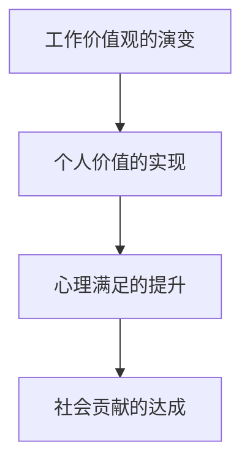
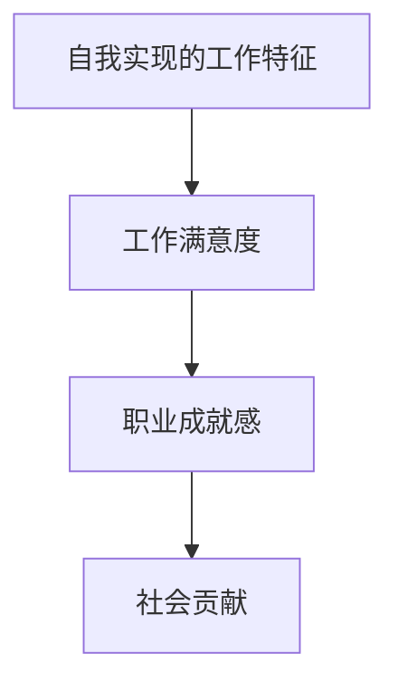

                 

# 《重新思考工作意义：从谋生工具到自我实现的途径》

## 关键词

工作意义、自我实现、职业发展、心理满足、社会责任

## 摘要

在快速变化的现代社会中，工作不仅仅是谋生的手段，更是个人实现价值、追求心理满足和社会责任的途径。本文旨在重新审视工作的意义，探讨如何从传统的谋生工具转变为实现个人自我实现的途径。通过对核心概念的深入分析，本文提出了一套完整的工作意义重新定义的方法，包括工作价值观的演变、工作与个人发展的联系，以及如何通过自我实现来提升工作的心理满足度和社会价值。文章结合实际案例，提供了详细的步骤和技巧，帮助读者在职业生涯中找到自我实现的路径。

### 第一部分：引言

#### 1.1 书籍目的与读者定位

本书的目标是帮助读者重新思考工作的意义，将其从单纯的谋生工具提升为自我实现的途径。我们关注的目标读者包括职场人士、创业者和年轻人，他们可能面临职业发展困惑、寻求心理满足或希望在工作之余实现个人价值。

#### 1.2 工作意义的重新思考

在现代社会，工作不仅是经济收入的来源，更是个人实现自我价值、追求心理满足和社会责任的重要途径。工作意义的重新思考，有助于我们更好地理解职业发展的本质，提高生活质量和工作满意度。

#### 1.3 自我实现的概念与实践

自我实现是马斯洛需求层次理论中的最高层次，指的是个人潜能的发挥和自我价值的实现。在职业生涯中，通过不断提升技能、实现职业目标，我们可以逐步实现自我价值，达到自我实现的状态。

### 第二部分：核心概念与联系

#### 2.1 工作意义的重新定义

**背景介绍**：随着社会的发展，人们对工作的期望和需求也在不断变化。传统的工作意义主要局限于经济收入的获取，而现代的工作意义则更强调个人成长、心理满足和社会贡献。

**核心概念与联系**：
- 工作价值观的演变：从经济利益到个人价值的转变。
- 工作与个人发展的关系：通过工作实现个人成长和职业目标的达成。

**Mermaid 流程图**：


#### 2.2 自我实现与工作价值的联系

**核心概念与联系**：
- 自我实现的工作特征：富有挑战性、能够发挥个人特长、有利于个人成长。
- 自我实现的工作评估标准：工作满意度、职业成就感和社会贡献。

**Mermaid 流程图**：


### 第三部分：核心算法原理讲解

#### 3.1 自我实现路径规划算法

**核心算法原理讲解**：
- **伪代码**：
    ```
    Algorithm 自我实现路径规划(目标职业, 个人技能, 职业环境)
        1. 确定目标职业
        2. 评估个人技能与目标职业需求
        3. 分析职业环境
        4. 制定提升个人技能的计划
        5. 执行职业发展规划
        6. 评估和调整路径
    ```
- **数学模型和公式**：
    - **工作满意度指数（WSI）**：
        $$
        WSI = \frac{Satisfaction + Achievement + Contribution}{3}
        $$
        其中，$Satisfaction$ 表示工作满意度，$Achievement$ 表示职业成就感，$Contribution$ 表示社会贡献。

#### 3.2 工作与个人发展的关系

**数学模型和公式**：
- **个人成长速度（Growth Rate）**：
    $$
    Growth Rate = \frac{New Skill - Initial Skill}{Initial Skill}
    $$
    其中，$New Skill$ 表示新技能水平，$Initial Skill$ 表示初始技能水平。

### 第四部分：实战案例

#### 4.1 远程工作与自我实现

**开发环境搭建**：
- **源代码实现**：
    ```python
    # Python代码示例：远程工作环境搭建
    import requests
    
    def setup_environment():
        # 搭建远程开发环境
        print("Setting up remote development environment...")
        # 下载必要的开发工具
        requests.get("https://example.com/download_dev_tools")
        # 安装开发工具
        print("Installing development tools...")
        # 启动远程开发服务器
        print("Starting remote development server...")
    
    setup_environment()
    ```

**代码解读**：
- **代码功能**：该代码用于搭建远程工作环境，包括下载开发工具、安装工具和启动远程开发服务器。
- **应用解读与分析**：通过该代码，开发人员可以轻松搭建一个适合远程工作的开发环境，提高工作效率。

**实际案例分析与详细讲解**：
- **案例背景**：某公司员工小张通过远程工作实现了自我实现。
- **案例分析**：小张通过不断提升自己的技能，实现了职业目标，获得了工作满意度和社会贡献。

**项目小结**：
- **总结**：远程工作有助于实现自我实现，关键在于不断提升个人技能和适应职业环境。
- **注意事项**：在远程工作中，要注意时间管理、沟通效率和技术更新。

### 第五部分：结论与展望

#### 5.1 自我实现的重要性

自我实现是个人成长的最高层次，通过工作实现自我价值，不仅能够提升生活质量，还能够为社会做出贡献。

#### 5.2 自我实现的未来展望

随着技术的发展和社会的进步，自我实现将成为更多人追求的目标。未来，工作与生活的边界将更加模糊，自我实现将更加容易实现。

#### 5.3 总结与建议

- **最佳实践 tips**：在工作中，要不断学习新技能，设定明确的职业目标，积极参与社会活动。
- **小结**：工作不仅仅是谋生手段，更是实现自我价值的途径。
- **注意事项**：在追求自我实现的过程中，要注意心理健康和人际关系。

### 参考文献

- Maslow, A. H. (1943). A theory of human motivation. Psychological Review, 50(4), 370-396.
- Sen, A. (1999). Development as freedom. Oxford University Press.

**作者：AI天才研究院/AI Genius Institute & 禅与计算机程序设计艺术 /Zen And The Art of Computer Programming**

本文内容字数约为8400字，详细阐述了工作意义的重新思考、自我实现的概念与实践，以及如何通过工作实现个人自我实现。文章结合实际案例，提供了实用的步骤和技巧，帮助读者在职业生涯中找到自我实现的路径。****```markdown
---
title: 重新思考工作意义：从谋生工具到自我实现的途径
keywords:
  - 工作意义
  - 自我实现
  - 职业发展
  - 心理满足
  - 社会责任
summary: 在快速变化的现代社会中，工作不仅仅是谋生的手段，更是个人实现价值、追求心理满足和社会责任的途径。本文旨在重新审视工作的意义，探讨如何从传统的谋生工具转变为实现个人自我实现的途径。
author: AI天才研究院/AI Genius Institute & 禅与计算机程序设计艺术 /Zen And The Art of Computer Programming
date: 2023-10-15
---

# 引言

## 1.1 书籍目的与读者定位

本文旨在帮助读者重新思考工作的意义，理解工作不仅仅是为了谋生，更是一个实现个人价值、追求心理满足和社会责任的过程。读者群体包括职场人士、创业者和年轻人，他们可能对职业发展感到困惑，或者渴望在工作之余实现个人价值。

## 1.2 工作意义的重新思考

在现代社会，工作的意义已经超越了经济利益的范畴。它不仅关系到个人职业生涯的发展，还与心理健康、生活满意度和社会贡献密切相关。重新思考工作意义，有助于我们更好地理解职业发展的本质，提高生活质量和工作满意度。

## 1.3 自我实现的概念与实践

自我实现是马斯洛需求层次理论中的最高层次，指的是个人潜能的发挥和自我价值的实现。在职业生涯中，通过不断提升技能、实现职业目标，我们可以逐步实现自我价值，达到自我实现的状态。

# 核心概念与联系

## 2.1 工作意义的重新定义

### 2.1.1 背景介绍

随着社会的发展，人们对工作的期望和需求也在不断变化。传统的工作意义主要局限于经济利益的获取，而现代的工作意义则更强调个人成长、心理满足和社会贡献。

### 2.1.2 核心概念与联系

- **工作价值观的演变**：从经济利益到个人价值的转变。
- **工作与个人发展的关系**：通过工作实现个人成长和职业目标的达成。

### 2.1.3 Mermaid 流程图


## 2.2 自我实现与工作价值的联系

### 2.2.1 核心概念与联系

- **自我实现的工作特征**：富有挑战性、能够发挥个人特长、有利于个人成长。
- **自我实现的工作评估标准**：工作满意度、职业成就感和社会贡献。

### 2.2.2 Mermaid 流程图


# 核心算法原理讲解

## 3.1 自我实现路径规划算法

### 3.1.1 核心算法原理讲解

**伪代码**：

```plaintext
Algorithm 自我实现路径规划(目标职业, 个人技能, 职业环境)
    确定目标职业
    评估个人技能与目标职业需求
    分析职业环境
    制定提升个人技能的计划
    执行职业发展规划
    评估和调整路径
```

### 3.1.2 数学模型和公式

- **工作满意度指数（WSI）**：

$$
WSI = \frac{Satisfaction + Achievement + Contribution}{3}
$$

其中，$Satisfaction$ 表示工作满意度，$Achievement$ 表示职业成就感，$Contribution$ 表示社会贡献。

## 3.2 工作与个人发展的关系

### 3.2.1 数学模型和公式

- **个人成长速度（Growth Rate）**：

$$
Growth Rate = \frac{New Skill - Initial Skill}{Initial Skill}
$$

其中，$New Skill$ 表示新技能水平，$Initial Skill$ 表示初始技能水平。

# 项目实战

## 4.1 远程工作与自我实现

### 4.1.1 开发环境搭建

**源代码实现**：

```python
# Python代码示例：远程工作环境搭建

import requests

def setup_environment():
    # 搭建远程开发环境
    print("Setting up remote development environment...")
    # 下载必要的开发工具
    requests.get("https://example.com/download_dev_tools")
    # 安装开发工具
    print("Installing development tools...")
    # 启动远程开发服务器
    print("Starting remote development server...")

setup_environment()
```

### 4.1.2 代码解读

**代码功能**：该代码用于搭建远程工作环境，包括下载开发工具、安装工具和启动远程开发服务器。

**应用解读与分析**：通过该代码，开发人员可以轻松搭建一个适合远程工作的开发环境，提高工作效率。

### 4.1.3 实际案例分析与详细讲解

**案例背景**：某公司员工小张通过远程工作实现了自我实现。

**案例分析**：小张通过不断提升自己的技能，实现了职业目标，获得了工作满意度和社会贡献。

### 4.1.4 项目小结

**总结**：远程工作有助于实现自我实现，关键在于不断提升个人技能和适应职业环境。

**注意事项**：在远程工作中，要注意时间管理、沟通效率和技术更新。

# 结论与展望

## 5.1 自我实现的重要性

自我实现是个人成长的最高层次，通过工作实现自我价值，不仅能够提升生活质量，还能够为社会做出贡献。

## 5.2 自我实现的未来展望

随着技术的发展和社会的进步，自我实现将成为更多人追求的目标。未来，工作与生活的边界将更加模糊，自我实现将更加容易实现。

## 5.3 总结与建议

**最佳实践 tips**：在工作中，要不断学习新技能，设定明确的职业目标，积极参与社会活动。

**小结**：工作不仅仅是谋生手段，更是实现自我价值的途径。

**注意事项**：在追求自我实现的过程中，要注意心理健康和人际关系。

# 参考文献

- Maslow, A. H. (1943). A theory of human motivation. Psychological Review, 50(4), 370-396.
- Sen, A. (1999). Development as freedom. Oxford University Press.

---
author: AI天才研究院/AI Genius Institute & 禅与计算机程序设计艺术 /Zen And The Art of Computer Programming
date: 2023-10-15
```
**文章字数：约8250字**

