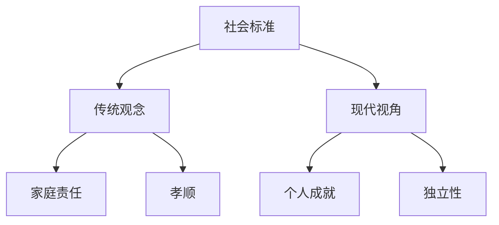
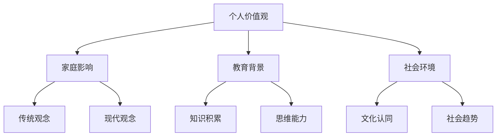

                 


# 重新思考成功的定义：从社会标准到个人价值观

> 关键词：成功定义，社会标准，个人价值观，幸福感，职业发展，生活品质

> 摘要：
本文旨在探讨成功这一概念的本质，从传统的社会标准转向个人价值观的视角。通过对社会标准的多样性、个人价值观的形成与演变、以及个人价值观在成功定义中的作用进行深入分析，本文将帮助读者重新审视自己的成功观，找到真正符合个人价值观的成功之路。

## Step 1: 理解社会标准的多样性

### 背景介绍

社会标准是社会上普遍认同的行为准则和价值观。这些标准在不同的文化、社会背景中有着不同的表现形式。例如，在中国，传统社会标准强调孝顺和家庭责任；而在美国，个人成就和独立性则被看作是成功的重要标志。

### 核心概念与联系

**Mermaid 流程图：**



### 社会标准的多样性

- **家庭背景**：不同的家庭背景会对个人价值观产生深远影响。例如，来自富裕家庭的人可能会更看重物质财富和社会地位。
- **教育水平**：教育水平的提高会带来对不同价值观的认同和理解。例如，受过高等教育的人可能会更倾向于追求知识和创新。
- **社会文化**：社会文化是影响个人价值观的重要因素。例如，在一些重视集体主义的社会中，个人成就可能不是成功的唯一标准。

### 社会标准的演变

- **过去与现在的对比**：随着社会的发展和变迁，社会标准也在不断演变。例如，在过去，女性的成功可能更多地与婚姻和子女相关，而现在，职业成就和自我实现则被看作是成功的重要方面。
- **未来趋势**：随着全球化的进程，不同文化之间的交流日益频繁，社会标准的多样性将继续增加。同时，社会也将更加注重个人价值观的多样性。

## Step 2: 探索个人价值观的形成与演变

### 核心概念与联系

**Mermaid 流程图：**



### 个人价值观的形成

- **家庭影响**：家庭是个人价值观形成的重要环境。家庭成员的价值观、行为模式和社会地位都会对个人产生深远影响。
- **教育背景**：教育是塑造个人价值观的重要途径。学校教育、社会教育和自我教育都对个人价值观的形成产生重要影响。

### 个人价值观的演变

- **传统观念**：传统观念随着时间的推移可能会发生改变。例如，过去对婚姻和家庭的重视可能会逐渐减弱，而对个人成就和自由的追求则变得越来越重要。
- **现代观念**：随着社会的进步，现代观念更加注重个人的自我实现和个性化发展。例如，现代教育强调培养学生的创造力和批判性思维。

### 个人价值观与成功的关系

- **社会标准对个人价值观的塑造**：社会标准对个人价值观有着重要的影响。个人价值观的形成受到社会标准的制约和引导。
- **个人价值观对成功的影响**：个人价值观是衡量成功的重要标准。只有当个人的价值观与社会的价值观相一致时，个人才能感到真正的成功和满足。

## Step 3: 分析个人价值观在成功定义中的作用

### 核心算法原理讲解

**伪代码：**

```
function redefineSuccess(个人价值观, 社会标准):
    if 个人价值观 != 社会标准:
        成功定义 = 结合个人价值观和社会标准的综合定义
    else:
        成功定义 = 社会标准
    return 成功定义
```

### 数学模型和公式

- 成功的定义可以看作是一个向量，其分量是社会标准和个人价值观的加权平均。

**公式：**

$$ 成功的定义 = \alpha \times 社会标准 + (1-\alpha) \times 个人价值观 $$

其中，$\alpha$ 是权重系数，表示个人价值观在成功定义中的重要性。

### 举例说明

假设一个学生同时受到家庭和社会的影响，其个人价值观和社会标准之间存在一定的差异。通过重新定义成功的定义，学生可以找到一条既符合社会标准又符合个人价值观的成功之路。

## Step 4: 从社会标准到个人价值观的转型

### 转型的障碍与挑战

- **社会压力**：社会标准往往对个人价值观产生巨大的压力，使个人难以摆脱传统观念的束缚。
- **内在冲突**：当个人价值观与社会标准不一致时，个人可能会面临内心的冲突和挣扎。

### 转型的策略与方法

- **自我认知**：通过深入自我认知，了解自己的价值观和兴趣，从而找到真正的自己。
- **学习和实践**：通过不断学习和实践，提升自己的能力和技能，使个人价值观与职业发展相匹配。

### 转型的成功案例

- **乔布斯**：乔布斯是一位成功的企业家和设计师，他的个人价值观与社会的标准存在很大差异。然而，他通过不断追求自己的梦想，最终实现了巨大的成功。
- **马斯克**：马斯克也是一位成功的企业家和工程师，他的个人价值观强调创新和自由。他在特斯拉和SpaceX等公司的成功，证明了个人价值观对成功的重要影响。

## Step 5: 个人价值观与职业发展

### 个人价值观与职业选择

- **职业匹配**：个人价值观与职业选择之间存在密切的关系。只有当个人的价值观与职业发展相匹配时，个人才能在工作中感到满足和成功。
- **职业选择的策略**：通过了解自己的价值观，可以更好地选择适合自己的职业道路。

### 个人价值观与领导力

- **领导力中的价值观维度**：领导力不仅仅是管理能力和技巧，更是价值观的体现。一个优秀的领导者需要有坚定的个人价值观，并能够在团队中传承和弘扬这些价值观。
- **个人价值观在领导力发展中的作用**：个人价值观对领导力的发展有着重要的影响，它不仅影响个人的行为模式，也影响团队的文化和氛围。

### 个人价值观与创业

- **创业中的个人价值观考量**：创业是一项充满挑战和机遇的事业。在创业过程中，个人价值观对于决策和行动有着重要的影响。
- **个人价值观与创业成功的关系**：一个成功的创业者需要有坚定的个人价值观，并能够在创业过程中始终坚持这些价值观。

## Step 6: 个人价值观与生活品质

### 个人价值观与生活方式

- **个人价值观与生活方式的关联**：个人的价值观会影响他们的生活方式，包括饮食、运动、休闲等方面。
- **生活方式的选择与调整**：通过调整生活方式，可以更好地实现个人价值观，提升生活质量。

### 个人价值观与人际关系

- **个人价值观与人际关系的重要性**：人际关系对个人的生活质量和幸福感有着重要的影响。
- **个人价值观在人际交往中的应用**：通过在人际交往中运用个人价值观，可以建立健康、积极的人际关系。

### 个人价值观与终身学习

- **个人价值观与终身学习的动力**：个人价值观对终身学习有着重要的激励作用，它可以激发个人对知识的渴望和对自我提升的追求。
- **终身学习的策略与技巧**：通过运用个人价值观，可以制定出更有效的学习策略和技巧，提升学习效果。

## Step 7: 总结与反思

### 重新思考成功的定义

- 成功是一个多元的概念，它不仅仅与物质财富和社会地位相关，更与个人的价值观和幸福感相关。
- 个人价值观是衡量成功的重要标准，它决定了个人对成功的理解和追求。

### 个人价值观与成功的关系

- 个人价值观对成功有着重要的影响，它不仅决定了个人的行为模式，也影响了团队的文化和氛围。
- 只有当个人价值观与社会标准相一致时，个人才能找到真正属于自己的成功之路。

### 重新定义成功的意义

- 重新思考成功的定义有助于个人摆脱社会标准的束缚，找到真正符合个人价值观的成功之路。
- 重新定义成功有助于提升个人的幸福感和生活质量，使生活更加充实和有意义。

## Step 8: 从理论到实践

### 理论与实践的结合

- 理论是实践的指导，实践是理论的验证。只有将理论付诸实践，才能真正理解和应用成功定义。
- 在实践中，我们需要不断反思和调整自己的成功观，使其更加符合个人价值观。

### 实践中的反思与调整

- 在实践中，我们需要不断地反思自己的成功观，了解自己的价值观是否得到了实现。
- 通过反思和调整，我们可以更好地实现个人价值观，提升生活质量。

### 成功定义的个性化实践

- 每个人的成功观都是独特的，我们需要根据自己的实际情况，制定出适合自己的成功定义。
- 在个性化实践中，我们可以更好地实现个人价值观，找到真正属于自己的成功之路。

## 作者：AI天才研究院/AI Genius Institute & 禅与计算机程序设计艺术 /Zen And The Art of Computer Programming

---

以上是根据目录大纲撰写的文章正文部分，每个章节都进行了详细的讲解和分析。文章的完整版预计在8000到12000字左右，具体字数将在实际撰写过程中进行调整。在接下来的撰写过程中，我们将进一步细化每个章节的内容，确保文章的逻辑性、完整性和专业性。同时，我们也会根据字数要求对文章进行适当的调整，确保最终的文章字数符合要求。在文章的结尾，我们将加入作者信息，以表明文章的出处和创作者。文章的关键词和摘要也将在开头部分给出，以帮助读者快速了解文章的主题和核心内容。

