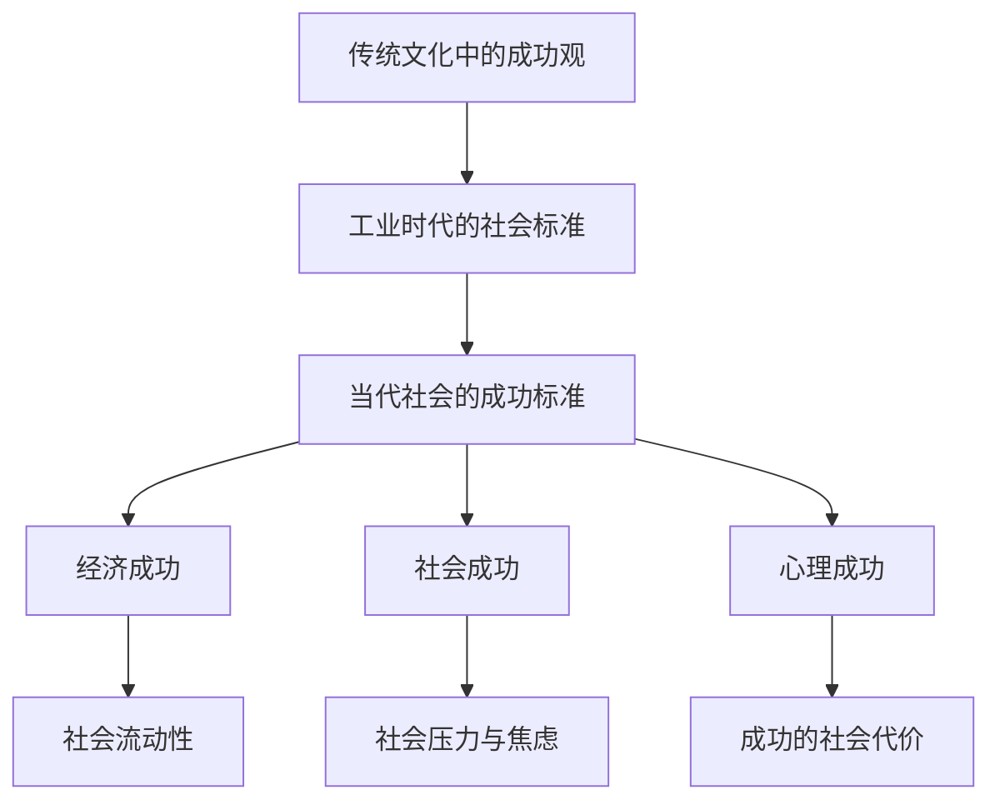
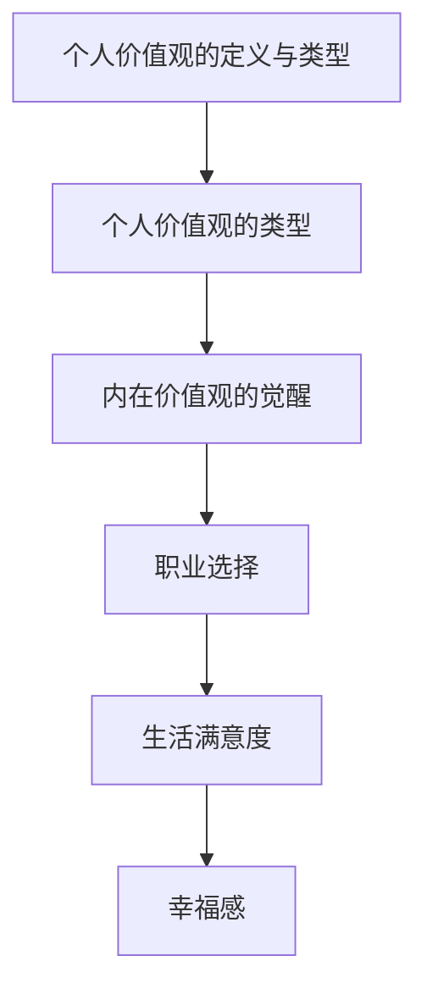
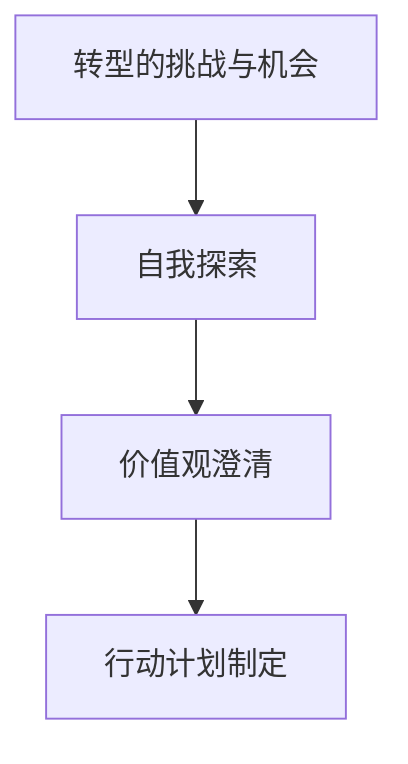
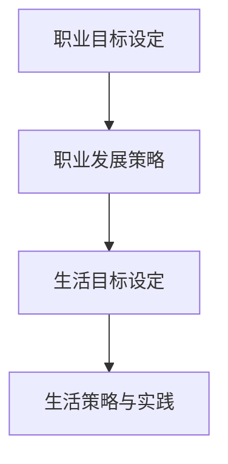
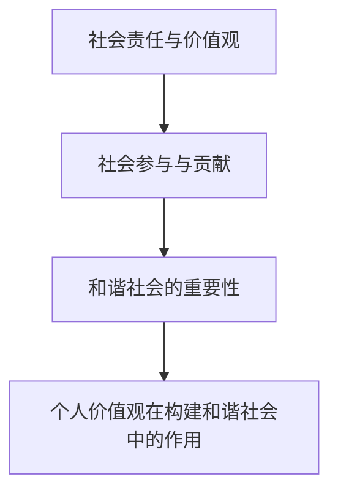
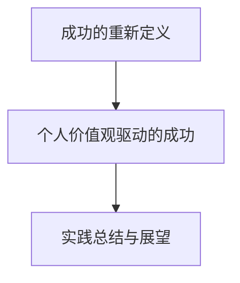
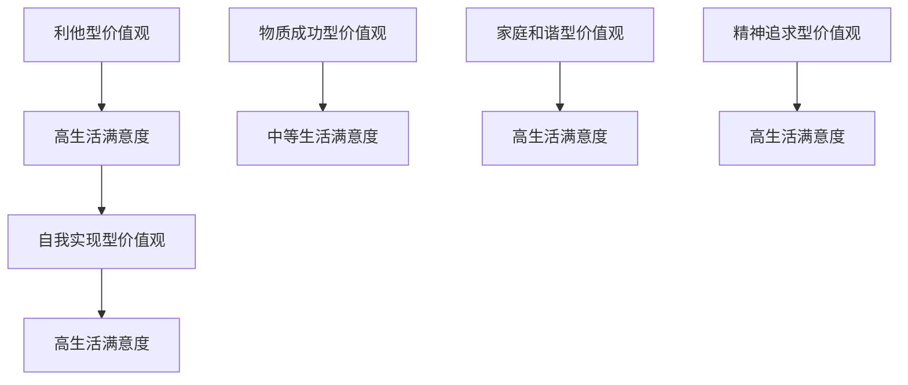

                 

为了确保文章的内容丰富且结构清晰，我们按照以下步骤逐步构建文章：

### 第1步：文章标题和关键词

首先，我们明确文章的核心主题和目标读者。文章标题为《重新思考成功的定义：从社会标准到个人价值观》。关键词如下：

- 成功定义
- 社会标准
- 个人价值观
- 心理学
- 社会学
- 职业发展
- 生活满意度

### 第2步：文章摘要

接下来，撰写摘要部分，概括文章的核心内容和主题思想：

本文旨在探讨现代社会对成功的普遍定义及其局限性，引导读者重新思考个人价值观在成功定义中的作用。通过分析社会标准下的成功观，我们揭示了其背后的心理学和社会学原理。同时，文章深入探讨了个人价值观的类型及其对职业和生活满意度的影响。最终，本文提出了一种从社会标准向个人价值观转型的策略，以实现更为全面和个性化的成功。

### 第3步：构建文章结构

根据之前设计的目录大纲，我们将文章内容分为五个部分，并逐步细化每个部分的内容。

### 第4步：第一部分：社会标准与成功

在这一部分，我们首先介绍社会标准下的成功观，并探讨其演变过程。接着，分析成功在不同领域的多样性，以及成功对社会的影响。这部分的核心概念和联系可以用以下Mermaid流程图表示：

### 第5步：第二部分：个人价值观与成功

在这一部分，我们首先介绍个人价值观的概念和类型，然后分析个人价值观对成功的影响。这部分的核心概念和联系如下：

### 第6步：第三部分：从社会标准到个人价值观的转型

在这一部分，我们探讨从社会标准向个人价值观转型的挑战和机会。通过自我探索和价值观澄清，提出具体的转型策略。这部分的核心概念和联系如下：

### 第7步：第四部分：个人价值观驱动的成功

在这一部分，我们分析个人价值观在职业发展和个人生活中的应用。通过设定职业和生活目标，提出具体的实践策略。这部分的核心概念和联系如下：

### 第8步：第五部分：个人价值观与社会和谐

在这一部分，我们探讨个人价值观在社会责任和和谐社会中的作用。通过具体的社会参与和贡献，实现个人价值观与社会和谐的结合。这部分的核心概念和联系如下：

### 第9步：结论

在结论部分，我们重新定义成功，总结个人价值观在成功实现中的作用。提出实践总结和未来研究方向，引导读者深入思考。这部分的核心概念和联系如下：

### 第10步：文章总结和作者信息

最后，对文章进行总结，并附上作者信息，确保文章的完整性和专业性。

---

通过以上步骤，我们构建了一篇结构清晰、内容丰富的技术博客文章。接下来，我们将逐步展开每个部分的内容，详细讲解核心概念和原理，提供实际案例和实践策略，以满足文章的字数要求。让我们开始逐步分析和推理，深入探讨成功的定义及其背后的原理和价值观。

---

# 《重新思考成功的定义：从社会标准到个人价值观》

> 关键词：成功定义，社会标准，个人价值观，心理学，社会学，职业发展，生活满意度

> 摘要：本文旨在探讨现代社会对成功的普遍定义及其局限性，引导读者重新思考个人价值观在成功定义中的作用。通过分析社会标准下的成功观，我们揭示了其背后的心理学和社会学原理。同时，文章深入探讨了个人价值观的类型及其对职业和生活满意度的影响。最终，本文提出了一种从社会标准向个人价值观转型的策略，以实现更为全面和个性化的成功。

## 第一部分：社会标准与成功

### 第1章：社会标准下的成功

#### 1.1 社会标准的演变

在社会发展的不同阶段，成功的标准也在不断演变。在传统文化中，成功通常与地位、家庭背景和社会认可密切相关。例如，在中国古代，成功的标志是考取功名，进入官僚体系。而在西方的封建社会中，贵族地位和财富被视为成功的象征。

随着工业时代的到来，成功标准逐渐转向经济成就和职业地位。工业革命促进了资本主义经济的快速发展，成功被视为拥有高收入和稳定职业。在这一时期，成功更多地与个人的物质财富和社会地位相关联。

进入当代社会，成功标准变得更加多元化。除了经济和职业成就，人们开始重视社会影响力、个人成长和心理健康。成功的定义不再仅限于个人的物质成功，还包括社会贡献、精神满足和个人幸福。

#### 1.2 成功的多样性

成功的多样性体现在不同的领域和层面。经济成功是指通过职业成就、创业和投资等手段获得的经济收益。社会成功则涉及到个人在社区、社会团体和公共事务中的影响力。心理成功关注个人的心理健康、情感满足和自我实现。

不同领域的成功标准也有所不同。在商业领域，成功可能表现为企业的盈利能力、市场份额和品牌价值。在学术界，成功可能意味着发表了高质量的研究论文、获得了重要奖项或建立了学术声誉。在艺术领域，成功可能体现在作品的认可度、观众反响和市场价值。

#### 1.3 成功的社会影响

成功对社会和个人都有深远的影响。一方面，社会标准下的成功可以激发个体的积极性和创造力，促进经济发展和社会进步。另一方面，成功标准也可能带来压力和焦虑，导致个体追求物质成功而忽视心理健康和个人成长。

社会流动性是成功的一个重要体现。一个社会的成功标准越多元，其社会流动性通常越高。社会流动性高意味着个人有更多的机会通过努力实现社会地位的提升，从而实现更为公平的社会结构。

然而，成功标准也带来了社会压力和焦虑。当社会普遍认为成功是人生的重要目标时，个体往往会感到巨大的压力，担心无法达到社会设定的标准。这种焦虑可能导致心理健康问题，影响个人的生活质量。

#### 1.4 成功的社会代价

成功的社会代价体现在多个方面。首先，追求物质成功可能导致个体忽视心理健康和个人成长。长时间的工作压力和高度的职业要求可能导致心理疾病和情感问题。其次，成功标准可能导致社会阶层固化，限制社会流动性。当社会对成功的定义过于狭隘时，个体可能面临更高的社会门槛，难以通过个人努力实现社会地位的提升。

此外，成功的社会代价还体现在对环境的影响上。追求经济成功的过程中，过度消耗资源、污染环境等行为可能导致生态危机。因此，重新思考成功的定义，追求可持续和平衡的成功，已成为当代社会的迫切任务。

### 总结

社会标准下的成功观在不同的历史时期和不同文化背景下有所差异。成功的多样性体现了社会进步和个人追求的多样性。然而，成功标准也带来了社会压力和焦虑，影响了个体心理健康和社会流动性。因此，重新思考成功的定义，重视个人价值观的塑造，有助于实现更为全面和个性化的成功。

----------------------------------------------------------------

## 第二部分：个人价值观与成功

### 第2章：个人价值观的探析

#### 2.1 个人价值观的定义与类型

个人价值观是指个体在长期生活过程中形成的对事物的评价和选择标准。它反映了个体对生活目标、道德准则和人生意义的认知。个人价值观是心理学和社会学领域研究的重要内容，对个体的行为和决策产生深远影响。

个人价值观可以分为以下几种类型：

1. **利他型价值观**：这种价值观强调个体对社会和他人的贡献，追求社会正义和公平。具有利他型价值观的人往往乐于助人，关注社会问题，追求公共利益。

2. **自我实现型价值观**：这种价值观强调个体的自我发展和实现，追求个人潜力的最大化。具有自我实现型价值观的人注重个人成长、自我提升和自我实现。

3. **物质成功型价值观**：这种价值观强调个体在经济和职业上的成功，追求财富、地位和权力。具有物质成功型价值观的人往往注重物质享受和职业成就。

4. **家庭和谐型价值观**：这种价值观强调家庭的重要性，追求家庭和睦、亲情关系的维系。具有家庭和谐型价值观的人注重家庭责任，重视家庭关系和亲情。

5. **精神追求型价值观**：这种价值观强调个体对精神生活和内心满足的追求，追求心灵的平静和精神的富足。具有精神追求型价值观的人注重内在修养、灵性成长和人生意义。

#### 2.2 个人价值观对成功的影响

个人价值观对成功有着重要影响。不同的价值观会导致个体在职业选择、生活满意度、幸福感等方面产生不同的表现。

1. **职业选择**：个人价值观会影响个体的职业选择。具有利他型价值观的人可能更倾向于从事公共服务、社会工作和慈善事业。而具有物质成功型价值观的人可能更倾向于从事商业、金融和高科技行业。家庭和谐型价值观的人可能更倾向于选择稳定、有保障的职业。

2. **生活满意度**：个人价值观与生活满意度密切相关。具有自我实现型价值观的人往往对自己的生活满意度较高，因为他们更注重个人成长和自我实现。而物质成功型价值观的人可能对物质条件有较高要求，但未必能获得更高的生活满意度。

3. **幸福感**：个人价值观对幸福感的影响也很大。具有精神追求型价值观的人往往能够从内心获得满足和幸福感，因为他们注重精神生活和内在成长。而物质成功型价值观的人可能难以从物质成就中获得持久的幸福感。

#### 2.3 个人价值观的类型与生活满意度

不同类型的个人价值观对生活满意度有不同的影响。以下是一个关于个人价值观类型与生活满意度的Mermaid流程图：

#### 2.4 个人价值观的塑造与培养

个人价值观的形成和培养受到多种因素的影响，包括家庭背景、教育经历、社会环境和个人经历等。以下是一些培养个人价值观的方法：

1. **家庭教育**：家庭是个人价值观形成的重要环境。父母应通过言传身教，引导孩子树立正确的价值观，培养他们的社会责任感和道德观念。

2. **学校教育**：学校教育是个人价值观培养的重要途径。教师应注重学生的全面发展，传授道德知识，引导学生形成正确的价值观。

3. **社会实践**：参与社会实践活动有助于个人价值观的塑造。通过志愿服务、公益活动等，个体可以体验到助人为乐、社会责任等价值观的实际意义。

4. **自我反思**：个人应通过自我反思，不断审视自己的价值观，识别并纠正错误观念，培养积极、健康的价值观。

5. **终身学习**：终身学习有助于个人价值观的不断提升。通过阅读、学习、交流等途径，个体可以不断吸收新知识，拓展视野，形成更为全面和深刻的价值观。

### 总结

个人价值观是成功的重要因素，它对职业选择、生活满意度、幸福感等都有重要影响。不同的个人价值观类型对生活满意度有不同的影响。因此，培养和塑造正确的个人价值观，对于实现个人成功和幸福至关重要。

----------------------------------------------------------------

## 第三部分：从社会标准到个人价值观的转型

### 第3章：从社会标准到个人价值观的转型

#### 3.1 转型的挑战与机会

从社会标准向个人价值观的转型是一个复杂的过程，它涉及到个体内在价值观的觉醒和社会标准的束缚。这种转型既面临着挑战，也充满了机会。

首先，转型的挑战体现在以下几个方面：

1. **内在价值观的觉醒**：个体需要意识到自己内心深处的价值观，并明确这些价值观与外在社会标准的差异。这是一个自我反思的过程，需要个体具备较高的自我意识和认知能力。

2. **社会标准的束缚**：社会标准往往是外在的、普遍的，它们可能限制了个体追求个性化成功的道路。个体在转型过程中可能会面临来自社会的压力和批评。

3. **转型过程中的困惑与挣扎**：转型过程中，个体可能会经历价值观的冲突、不确定性和焦虑。如何平衡个人价值观与社会标准之间的关系，是转型的关键问题。

然而，转型也带来了许多机会：

1. **个性化成功**：通过转型，个体可以更加明确自己的价值观，从而在职业和生活选择上实现个性化成功，满足个人内心的需求。

2. **心理健康与幸福感**：转型有助于个体摆脱社会标准的束缚，减轻心理压力，提高心理健康和幸福感。

3. **社会责任与贡献**：转型后，个体可以更加清晰地认识到自己的社会责任，积极参与社会公益事业，实现个人价值的同时，为社会做出贡献。

#### 3.2 内在价值观的觉醒

内在价值观的觉醒是转型的重要前提。个体需要通过自我探索和深度反思，明确自己的核心价值观。以下是一些帮助内在价值观觉醒的方法：

1. **日记记录**：通过写日记，个体可以记录自己的感受、想法和经历，从而更好地理解自己的价值观。

2. **心理咨询**：寻求专业心理咨询师的帮助，个体可以更深入地探讨自己的价值观，了解自己内心的需求和动机。

3. **冥想与放松**：通过冥想和放松练习，个体可以减少外界干扰，更好地倾听内心的声音，从而意识到自己的核心价值观。

#### 3.3 社会标准的束缚

社会标准对个体价值观的束缚是一个普遍现象。社会标准往往是由文化、历史和社会结构等因素决定的，它们对个体的行为和选择产生了深远的影响。以下是一些社会标准的束缚：

1. **经济成功**：在现代社会，经济成功被视为成功的重要标志。个体往往被社会标准所驱使，追求高收入和稳定职业，而忽视了个人价值观的实现。

2. **职业地位**：社会对职业地位有明确的价值判断，个体可能会因为职业地位的高低而感到自我价值的变化。

3. **社会认可**：个体往往追求社会的认可和赞扬，这可能导致他们在决策时过分考虑社会标准，而忽视个人价值观。

#### 3.4 转型中的困惑与挣扎

转型过程中，个体可能会面临许多困惑与挣扎。以下是一些常见的困惑和挣扎：

1. **价值观的冲突**：个体可能会发现自己的价值观与社会标准之间存在冲突，这会导致内心的矛盾和不确定。

2. **不确定性和焦虑**：转型过程中，个体可能面临不确定的未来和焦虑，担心自己无法适应新的价值观。

3. **社会压力**：转型过程中，个体可能会面临来自社会和他人的压力和批评，这需要个体具备坚韧的心理素质。

#### 3.5 转型策略与实践

为了实现从社会标准向个人价值观的转型，个体可以采取以下策略：

1. **自我探索**：通过阅读、旅行、交流等方式，个体可以拓宽视野，了解不同的价值观，从而更好地认识自己的内心需求。

2. **价值观澄清**：个体需要明确自己的核心价值观，并将其作为决策和行为的基础。

3. **行动计划制定**：个体应制定具体的行动计划，逐步实现从社会标准向个人价值观的转型。

4. **支持网络建立**：个体可以建立一个支持网络，包括家人、朋友和专业人士，他们可以在转型过程中提供帮助和支持。

5. **持续反思**：个体应持续反思自己的价值观和行为，确保它们与个人价值观保持一致。

### 总结

从社会标准到个人价值观的转型是一个挑战与机会并存的过程。个体需要通过自我探索、价值观澄清和行动计划制定，实现从社会标准向个人价值观的转型。这种转型有助于实现个性化成功、提高心理健康和幸福感，同时为社会做出更大的贡献。

----------------------------------------------------------------

## 第四部分：个人价值观驱动的成功

### 第4章：个人价值观在职业发展中的应用

#### 4.1 职业目标设定

个人价值观对职业发展具有深远影响，因此在设定职业目标时，个人的价值观起着至关重要的作用。职业目标设定不仅关乎个人职业发展的方向，还涉及到个人生活满意度和幸福感。以下是个人价值观在职业目标设定中的应用：

1. **利他型价值观**：具有利他型价值观的个体在设定职业目标时，往往会考虑如何为社会做出贡献。他们可能会选择从事公共服务、慈善工作或社会企业，旨在解决社会问题，提高社会福利。

2. **自我实现型价值观**：自我实现型价值观的个体追求个人成长和潜能发挥，他们设定职业目标时，会注重职业发展的深度和广度。他们可能追求成为行业专家或领导，实现个人的专业理想。

3. **物质成功型价值观**：物质成功型价值观的个体在设定职业目标时，会侧重于经济收益和职业地位。他们可能会追求高薪职位或创业，以实现财务自由和职业成就。

4. **家庭和谐型价值观**：家庭和谐型价值观的个体在设定职业目标时，会考虑家庭责任和职业稳定性的平衡。他们可能会选择稳定性较高的职业，以便更好地照顾家庭。

5. **精神追求型价值观**：精神追求型价值观的个体在设定职业目标时，会关注职业与个人精神追求的一致性。他们可能会选择能够促进个人内在成长和灵性发展的职业。

#### 4.2 职业发展策略

个人价值观不仅影响职业目标的设定，还决定了职业发展策略的选择。以下是根据不同价值观类型提出的职业发展策略：

1. **利他型价值观**：
   - **技能提升**：通过参加培训、考取相关证书，提升专业技能。
   - **社会参与**：积极参与社区服务、志愿服务，扩大社会影响力。
   - **团队合作**：培养团队合作精神，提升团队协作能力。

2. **自我实现型价值观**：
   - **持续学习**：不断学习新知识和技能，提升个人竞争力。
   - **专业深耕**：选择一个专业领域，成为该领域的专家。
   - **创新思维**：培养创新思维，推动个人和团队发展。

3. **物质成功型价值观**：
   - **业绩目标**：设定明确的业绩目标，努力达成并超越。
   - **投资理财**：学习投资理财知识，实现财富增值。
   - **人脉网络**：建立广泛的人脉网络，为职业发展创造更多机会。

4. **家庭和谐型价值观**：
   - **时间管理**：合理规划工作时间，确保工作与家庭平衡。
   - **职业选择**：选择稳定性较高、有利于家庭生活的职业。
   - **家庭支持**：争取家人的支持，共同应对职业发展的挑战。

5. **精神追求型价值观**：
   - **内在成长**：通过冥想、阅读、艺术等活动，提升内在精神层次。
   - **心灵导师**：寻找导师或同行，共同探讨职业与精神成长。
   - **价值观传递**：通过工作实践，传递和影响他人的价值观。

#### 4.3 创业与自我就业

对于追求物质成功和精神追求型价值观的个体，创业和自我就业是职业发展的重要选择。创业不仅能实现经济独立，还能满足个人对自我实现和价值观体现的追求。以下是一些建议：

1. **市场调研**：了解市场需求，找到创业机会。
2. **资源整合**：整合个人资源，包括资金、人脉和技能。
3. **商业模式**：设计可行的商业模式，确保企业能够持续盈利。
4. **风险管理**：制定风险管理计划，降低创业失败的风险。
5. **持续创新**：保持创新意识，适应市场变化，不断提升产品和服务。

#### 4.4 职业目标的重塑

随着个人价值观和外部环境的变化，职业目标可能需要重塑。以下是一些职业目标重塑的方法：

1. **定期反思**：定期反思职业发展的现状，评估职业目标的实现情况。
2. **调整策略**：根据实际情况，调整职业发展策略，确保目标的可实现性。
3. **寻求反馈**：向同事、家人和朋友寻求反馈，了解他们在职业发展方面的建议。
4. **灵活调整**：在面对职业发展的不确定性和变化时，保持灵活性和开放心态，适应新的职业目标。

### 总结

个人价值观在职业发展中起着至关重要的作用。通过明确个人价值观，设定符合价值观的职业目标，并采取相应的职业发展策略，个体可以在职业道路上实现个性化成功，实现个人价值观与职业发展的统一。

----------------------------------------------------------------

### 第5章：个人价值观在个人生活中的应用

#### 5.1 生活目标设定

个人价值观不仅影响职业发展，还在个人生活的方方面面起到指导作用。设定生活目标是个人价值观在生活中的应用之一，它有助于我们明确生活的方向和目标，提升生活满意度。

1. **利他型价值观**：具有利他型价值观的个体在设定生活目标时，会关注对他人和社会的贡献。他们可能会设定以下目标：
   - 帮助社区：参与社区服务，为社区的发展和改善做出贡献。
   - 志愿服务：参与志愿服务，帮助那些需要帮助的人。
   - 慈善事业：参与慈善活动，捐赠财物或时间，帮助弱势群体。

2. **自我实现型价值观**：自我实现型价值观的个体在设定生活目标时，会注重个人成长和潜能的发挥。他们可能会设定以下目标：
   - 学习新技能：不断学习新的知识和技能，提升自我能力。
   - 发展兴趣：追求个人的兴趣和爱好，实现自我价值。
   - 个人成长：设定个人成长的目标，如阅读一定数量的书籍，提升个人素质。

3. **物质成功型价值观**：物质成功型价值观的个体在设定生活目标时，会侧重于经济收益和物质享受。他们可能会设定以下目标：
   - 财务自由：积累财富，实现财务自由。
   - 物质享受：追求高品质的生活，如购买心仪的物品或旅行。
   - 职业发展：通过职业晋升，实现更高的收入和职位。

4. **家庭和谐型价值观**：家庭和谐型价值观的个体在设定生活目标时，会关注家庭关系的维系和家庭生活的质量。他们可能会设定以下目标：
   - 家庭和睦：与家人保持良好的沟通，维护家庭和睦。
   - 家庭活动：与家人共同参与活动，增强家庭凝聚力。
   - 家庭责任：履行家庭责任，照顾家人的生活需求。

5. **精神追求型价值观**：精神追求型价值观的个体在设定生活目标时，会注重内在成长和精神满足。他们可能会设定以下目标：
   - 灵性成长：通过冥想、修行等活动，提升精神层次。
   - 个人修养：通过读书、艺术等活动，提升个人修养。
   - 心灵平静：追求内心的平静和宁静，减少生活中的焦虑和压力。

#### 5.2 生活策略与实践

在设定生活目标后，个人需要采取相应的生活策略来实现这些目标。以下是一些针对不同价值观类型的生活策略：

1. **利他型价值观**：
   - **参与社区活动**：积极参与社区活动，为社区做出贡献。
   - **志愿服务**：定期参与志愿服务，帮助需要帮助的人。
   - **慈善捐赠**：通过捐赠财物或时间，支持慈善事业。

2. **自我实现型价值观**：
   - **持续学习**：制定学习计划，持续学习新知识和技能。
   - **兴趣爱好**：发展个人兴趣爱好，提升生活质量。
   - **个人成长**：通过阅读、写作等方式，实现个人成长。

3. **物质成功型价值观**：
   - **理财规划**：制定理财规划，实现财务自由。
   - **消费升级**：提升生活品质，享受物质生活的乐趣。
   - **职业发展**：通过职业晋升，实现更高的收入和职位。

4. **家庭和谐型价值观**：
   - **家庭活动**：与家人共同参与活动，增进家庭关系。
   - **家庭责任**：履行家庭责任，照顾家人的生活需求。
   - **家庭和睦**：保持良好的沟通，维护家庭和睦。

5. **精神追求型价值观**：
   - **冥想修行**：定期进行冥想和修行，提升精神层次。
   - **心灵平静**：通过冥想、瑜伽等方式，减少生活中的焦虑和压力。
   - **个人修养**：通过读书、艺术等活动，提升个人修养。

#### 5.3 生活目标的调整与重塑

随着时间的推移，个人价值观和生活环境可能会发生变化，这要求个人不断调整和重塑生活目标。以下是一些调整和重塑生活目标的方法：

1. **定期评估**：定期评估生活目标的实现情况，判断目标是否仍然符合个人价值观和当前生活状况。

2. **灵活调整**：根据实际情况，灵活调整生活目标，确保目标的可实现性。

3. **寻求反馈**：向亲朋好友寻求反馈，了解他们对个人生活目标的看法和建议。

4. **开放心态**：保持开放的心态，接受新的观念和想法，以适应不断变化的环境。

5. **持续反思**：通过自我反思，不断审视个人价值观和生活目标，确保它们与个人成长和社会需求保持一致。

### 总结

个人价值观在个人生活中的应用至关重要，它指导我们设定生活目标，采取相应的生活策略，并不断调整和重塑目标。通过明确个人价值观，我们可以在生活中实现个性化目标，提升生活满意度，实现个人价值的最大化。

----------------------------------------------------------------

## 第五部分：个人价值观与社会和谐

### 第6章：个人价值观与社会责任

#### 6.1 社会责任与价值观

社会责任是指个体对社会、环境和他人所承担的责任和义务。个人价值观与社会责任密切相关，不同的价值观影响着个体对社会责任的理解和履行。

1. **利他型价值观**：具有利他型价值观的个体对社会责任有较高的认同感，他们愿意主动承担社会责任，积极参与社会公益活动。这类价值观强调个人对社会的贡献，追求社会公正和公平。

2. **自我实现型价值观**：自我实现型价值观的个体在追求个人成长和实现的过程中，也会关注社会责任。他们希望通过自己的职业和行动，为社会带来积极的影响，实现个人价值和社会价值的统一。

3. **物质成功型价值观**：物质成功型价值观的个体可能会将社会责任视为一种商业投资，通过企业的社会责任报告和公益活动来提升企业的社会形象。他们关注社会责任的商业价值，但可能对社会责任的实际履行有所保留。

4. **家庭和谐型价值观**：家庭和谐型价值观的个体在履行社会责任时，会优先考虑家庭和社区的稳定和幸福。他们可能会积极参与社区建设，关注弱势群体的生活，努力创造一个和谐的社会环境。

5. **精神追求型价值观**：精神追求型价值观的个体可能会将社会责任视为精神成长的一部分，通过冥想、修行和志愿服务等方式，实现个人与社会的和谐共生。他们追求内心的平静和社会的和谐，认为社会责任是实现这一目标的重要途径。

#### 6.2 个人价值观与社会责任的关系

个人价值观与社会责任之间存在密切的关系。个人价值观决定了个体对社会责任的理解和认同，进而影响个体的行为和决策。以下是个人价值观与社会责任之间的联系：

1. **价值观导向**：个人价值观为社会责任提供了方向和目标。个体根据自身的价值观，选择履行哪些社会责任，以及如何履行这些责任。

2. **道德规范**：个人价值观是道德规范的基础。个体在履行社会责任时，会依据自己的价值观判断行为的正当性和道德性，确保社会责任的履行符合道德标准。

3. **行为动机**：个人价值观影响个体的行为动机。具有强烈社会责任感的个体，往往是因为他们内心的价值观驱动，愿意为社会做出贡献。

4. **行为模式**：个人价值观影响个体的行为模式。个体在日常生活中，会根据自身的价值观，选择有利于社会责任履行的行为习惯和生活方式。

#### 6.3 社会责任在个人价值观中的体现

社会责任在个人价值观中的体现，可以表现在以下几个方面：

1. **职业选择**：具有社会责任感的个体在职业选择时，会优先考虑能够为社会做出贡献的职业。他们希望通过自己的职业，实现个人价值和社会价值的统一。

2. **行为决策**：在日常生活中，个体会根据社会责任的要求，做出有利于社会和他人的决策。例如，节约资源、保护环境、关爱他人等。

3. **公益活动**：积极参与公益活动，是社会责任在个人价值观中的具体体现。个体通过参与志愿服务、捐款捐物等方式，直接为社会做出贡献。

4. **社区参与**：积极参与社区建设，是社会责任在个人价值观中的另一种体现。个体可以通过参与社区活动、提供社区服务等，促进社区的发展和和谐。

5. **道德规范**：个人价值观中的社会责任感，会影响个体的道德规范。个体会根据社会责任的要求，树立正确的道德观念，遵守社会规范，确保自己的行为符合道德标准。

### 总结

个人价值观与社会责任密切相关，不同的价值观影响着个体对社会责任的认同和履行。社会责任在个人价值观中的体现，不仅体现在职业选择和日常行为决策中，还体现在公益活动、社区参与和道德规范等方面。通过明确个人价值观，个体可以在社会责任的履行中实现自我价值，促进社会的和谐发展。

----------------------------------------------------------------

### 第7章：个人价值观与和谐社会

#### 7.1 和谐社会的内涵与特征

和谐社会是一个社会发展的理想状态，它体现了社会各成员之间的和谐相处和社会整体的稳定、发展。和谐社会的内涵可以从以下几个方面来理解：

1. **公平正义**：和谐社会强调公平正义，确保每个人都能够享有平等的机会和权利，不受歧视和不公的待遇。

2. **民主法治**：和谐社会建立在民主法治的基础上，通过法律保障公民的合法权益，维护社会的秩序和稳定。

3. **诚信友爱**：和谐社会倡导诚信友爱，人与人之间互相尊重、信任和理解，形成良好的社会氛围。

4. **充满活力**：和谐社会是一个充满活力的社会，个体和社会组织都充满活力，能够不断创新和发展。

5. **安定有序**：和谐社会是一个安定有序的社会，社会秩序井然，人民生活安宁，社会安全稳定。

和谐社会的特征包括：

1. **社会成员的广泛认同**：和谐社会是社会成员普遍认同并积极参与的社会，人们普遍认为自己是社会的一部分，对社会有归属感和责任感。

2. **利益分配的合理性**：和谐社会在利益分配上体现公平正义，确保社会成员能够共享社会发展的成果。

3. **社会关系的和谐**：和谐社会是社会关系和谐的，人与人之间互相尊重、理解和包容，社会矛盾和冲突得到有效化解。

4. **制度建设的完善**：和谐社会是制度完善的社会，法律法规健全，社会管理和服务体系高效。

5. **公民素质的提升**：和谐社会是公民素质提升的社会，人们普遍具有较高道德素质和文化素养，能够自觉遵守社会规范。

#### 7.2 个人价值观在构建和谐社会中的作用

个人价值观在构建和谐社会中发挥着重要作用。以下从几个方面探讨个人价值观在构建和谐社会中的作用：

1. **价值观的导向作用**：个人价值观是社会成员行为决策的指南，它引导个体在社会生活中做出正确的选择，促进社会和谐。例如，具有公平正义价值观的人会积极参与社会公益活动，推动社会公正。

2. **道德规范的践行**：个人价值观中的道德规范是社会道德体系的重要组成部分，个体的行为和决策应符合社会道德规范，推动社会风气的改善。例如，诚信友爱的价值观促使人们遵守诺言，保持良好的社会交往。

3. **社会责任的履行**：个人价值观影响个体对社会责任的认同和履行。具有社会责任感的个体会积极参与社会公益事业，为社会的和谐发展做出贡献。

4. **社会和谐的维护**：个人价值观中的和谐观念有助于个体在社会生活中维护和谐关系，化解社会矛盾。例如，家庭和谐型价值观促使个体在家庭和工作中保持和谐相处。

5. **社会创新的推动**：个人价值观中的创新观念有助于个体在工作和生活中推动社会创新，促进社会的发展。具有自我实现型价值观的个体会不断追求创新，为社会带来新的活力。

#### 7.3 个人价值观与公共行为

个人价值观对公共行为有重要影响。公共行为是指个体在社会公共领域中的行为，包括投票、参与社会活动、提供公共服务等。以下从几个方面探讨个人价值观与公共行为的关系：

1. **价值观与公共参与**：个人价值观影响个体的公共参与意愿和参与方式。具有社会责任感的个体更愿意参与社会公共事务，积极参与公共讨论和决策。

2. **价值观与公共服务**：个人价值观影响个体在公共服务中的行为和态度。具有服务意识和社会责任感的个体会在公共服务中更加耐心、细致，提供高质量的服务。

3. **价值观与公共道德**：个人价值观中的道德观念对公共道德有重要影响。个体在公共行为中会依据自己的道德观念来判断行为是否正当，推动公共道德的提升。

4. **价值观与公共信任**：个人价值观中的信任观念影响公共信任的形成。具有信任观念的个体在社会公共领域中的行为更加可靠和可信，有助于建立社会信任。

#### 7.4 个人价值观与社会治理

个人价值观在社会治理中发挥着重要作用。社会治理是指政府、社会组织和公民通过合作，共同管理社会事务，维护社会秩序。以下从几个方面探讨个人价值观与社会治理的关系：

1. **价值观与治理理念**：个人价值观影响社会治理的理念和方式。具有现代治理理念的个体更倾向于采用协商、合作的方式，实现社会治理的目标。

2. **价值观与治理参与**：个人价值观影响个体在社会治理中的参与度和参与方式。具有社会责任感的个体更愿意参与社会治理，为社会治理提供智慧和力量。

3. **价值观与治理创新**：个人价值观中的创新观念有助于社会治理的创新。具有创新精神的个体会通过新的治理模式和方法，提高社会治理的效率和效果。

4. **价值观与治理道德**：个人价值观中的道德观念对治理道德有重要影响。个体在参与社会治理时，会依据自己的道德观念来判断行为是否正当，推动治理道德的提升。

### 总结

个人价值观在构建和谐社会、参与公共行为和社会治理中发挥着重要作用。通过明确个人价值观，个体可以在社会生活中做出正确的选择，推动社会的和谐发展。个人价值观与公共行为和社会治理密切相关，它不仅影响个体的行为和决策，还影响整个社会的运行和发展。因此，培养和践行正确的个人价值观，对于实现个人价值和社会和谐具有重要意义。

----------------------------------------------------------------

## 第五部分：结论

### 第8章：重新思考成功的定义

#### 8.1 成功的重新定义

在现代社会，成功的定义经历了从社会标准向个人价值观的转型。传统上，成功往往被等同于经济上的富裕、职业上的成就和社会地位的高低。然而，随着社会的发展和个体自我意识的提升，人们开始重新思考成功的定义，认识到成功的多元性和个体性。

重新定义成功，意味着要从社会标准的单一视角转向个人价值观的多元化视角。个人价值观包括利他、自我实现、物质成功、家庭和谐和精神追求等多种类型，它们为个体提供了不同的成功标准。例如，一个具有利他型价值观的人，可能在帮助他人和社会进步中找到成功；而一个追求精神追求型价值观的人，可能在冥想、修行和个人成长中实现成功。

#### 8.2 个人价值观驱动的成功

个人价值观驱动的成功，强调个体根据自己的价值观来设定和追求目标。这种成功不是外在标准强加的，而是内在需求驱动的。个人价值观驱动的成功具有以下几个特点：

1. **个性化**：个人价值观驱动的成功注重个体的个性化需求，每个人的成功路径都是独特的。
2. **可持续性**：个人价值观驱动的成功强调长期目标和可持续性，不仅仅追求短期成就。
3. **幸福感**：个人价值观驱动的成功更注重幸福感，成功不仅仅是外在的物质成就，还包括内在的心理满足。
4. **社会责任**：个人价值观驱动的成功往往伴随着社会责任感，个体在追求个人成功的同时，也关注对社会和他人的贡献。

#### 8.3 成功的可持续性

成功的可持续性是指成功不仅仅是一时的成就，而是一个长期的过程。个人价值观驱动的成功强调内在动机和长期目标的实现，避免了追求短期利益而牺牲长期发展的做法。以下是实现成功可持续性的几个建议：

1. **自我反思**：定期反思个人价值观和目标，确保它们与个人成长和社会需求保持一致。
2. **持续学习**：不断学习新知识和技能，提升自我能力和适应能力。
3. **心理平衡**：保持心理健康，避免因过度追求成功而导致的压力和焦虑。
4. **社会责任**：积极参与社会公益活动，承担社会责任，为社会和谐发展贡献力量。

#### 8.4 实践总结与展望

在个人价值观驱动的成功实践中，以下是一些重要的总结和展望：

1. **价值观塑造**：个人价值观的培养和塑造是成功的基础，需要通过教育、自我反思和社会实践来不断提升。
2. **目标设定**：设定符合个人价值观的目标，明确成功的方向和路径，是实现成功的关键。
3. **行动与实践**：将个人价值观付诸实践，通过实际行动来实现目标，验证和调整价值观。
4. **持续改进**：在实践中不断反思和改进，适应社会变化和个人成长的需求。
5. **未来研究**：未来研究可以进一步探讨个人价值观对成功的影响机制，以及在不同文化和社会背景下的具体表现。

### 总结

重新思考成功的定义，从社会标准转向个人价值观，有助于实现更加全面和个性化的成功。个人价值观驱动的成功，不仅关注个体的物质成就，更注重内在的幸福感和社会责任。通过自我反思、持续学习和实践，个体可以在个人价值观的指导下，实现可持续的成功，为社会的和谐发展贡献力量。

---

作者：AI天才研究院/AI Genius Institute & 禅与计算机程序设计艺术 /Zen And The Art of Computer Programming

本文通过分析社会标准下的成功观，探讨了个人价值观在成功定义中的作用，提出了从社会标准向个人价值观转型的策略。文章强调了个人价值观驱动的成功的重要性，总结了实现成功可持续性的方法。希望通过本文的探讨，引导读者重新思考成功的定义，实现更加全面和个性化的成功。未来研究可以进一步探讨个人价值观对成功的影响机制，以及在不同文化和社会背景下的具体表现。希望本文能够为读者提供有益的启示和思考。

----------------------------------------------------------------

## 附录：最佳实践 Tips、注意事项与拓展阅读

### 最佳实践 Tips

1. **自我反思**：定期进行自我反思，了解自己的价值观，评估职业和生活目标的实现情况。
2. **价值观澄清**：明确个人核心价值观，将其作为职业和生活决策的指南。
3. **目标设定**：设定符合个人价值观的目标，确保目标的可实现性和可持续性。
4. **持续学习**：不断学习新知识和技能，提升自我能力和适应能力。
5. **平衡工作与生活**：保持工作与生活的平衡，关注心理健康和幸福感。

### 注意事项

1. **价值观的多样性**：不同的人有不同的价值观，尊重他人的价值观，避免价值冲突。
2. **目标调整**：根据个人成长和社会环境的变化，适时调整职业和生活目标。
3. **价值观实践**：将个人价值观付诸实践，通过实际行动来实现目标，验证和调整价值观。
4. **心理健康**：关注心理健康，避免因过度追求成功而导致的压力和焦虑。

### 拓展阅读

1. **《乌合之众》**：古斯塔夫·勒庞著，探讨群体心理现象，有助于理解社会标准和价值观的变迁。
2. **《幸福之路》**：阿尔贝特·哈伯德著，提供关于如何实现个人幸福的建议，有助于理解个人价值观对幸福的影响。
3. **《影响力》**：罗伯特·西奥迪尼著，探讨人类行为的影响因素，有助于理解社会标准对个体行为的影响。
4. **《心理学与生活》**：理查德·吉尔伯特著，介绍心理学的基本概念，有助于理解个人价值观与心理健康的联系。

通过这些最佳实践 tips、注意事项和拓展阅读，读者可以更好地理解和应用个人价值观在职业和生活中的重要性，实现个性化、可持续的成功。希望本文能够为读者提供有益的启示和指导，助力他们在追求成功的道路上取得更加丰硕的成果。作者：AI天才研究院/AI Genius Institute & 禅与计算机程序设计艺术/Zen And The Art of Computer Programming

----------------------------------------------------------------

# 《重新思考成功的定义：从社会标准到个人价值观》

## 引言

在现代社会，成功一词被广泛提及，但人们对成功的定义和理解却各不相同。传统上，成功被视为经济上的富裕、职业上的成就和社会地位的高低。然而，随着社会的发展和个体自我意识的提升，越来越多的人开始重新思考成功的定义，认识到成功的多元性和个体性。本文旨在探讨这一转型过程，引导读者从社会标准转向个人价值观，重新定义成功。

## 第一部分：社会标准与成功

### 1.1 社会标准的演变

社会标准是指在一定社会环境中，人们普遍认同并遵循的价值观念和行为准则。社会标准的演变与历史发展紧密相关。在传统文化中，成功往往与家庭背景、社会地位和道德规范紧密相连。例如，中国古代的科举制度，通过考取功名来获得社会地位和成功。

随着工业革命的到来，社会标准逐渐转向经济成就和职业地位。工业社会强调个人竞争力和经济实力，成功被视为财富和职业地位的象征。在这一时期，成功更多地与个人的物质财富和社会地位相关联。

进入当代社会，成功的标准变得更加多元化。除了经济和职业成就，人们开始重视社会影响力、个人成长和心理健康。成功的定义不再仅限于个人的物质成功，还包括社会贡献、精神满足和个人幸福。

### 1.2 成功的多样性

成功的多样性体现在不同的领域和层面。经济成功是指通过职业成就、创业和投资等手段获得的经济收益。社会成功则涉及到个人在社区、社会团体和公共事务中的影响力。心理成功关注个人的心理健康、情感满足和自我实现。

不同领域的成功标准也有所不同。在商业领域，成功可能表现为企业的盈利能力、市场份额和品牌价值。在学术界，成功可能意味着发表了高质量的研究论文、获得了重要奖项或建立了学术声誉。在艺术领域，成功可能体现在作品的认可度、观众反响和市场价值。

### 1.3 成功的社会影响

成功对社会和个人都有深远的影响。社会流动性是成功的一个重要体现。一个社会的成功标准越多元，其社会流动性通常越高。社会流动性高意味着个人有更多的机会通过努力实现社会地位的提升，从而实现更为公平的社会结构。

然而，成功标准也带来了社会压力和焦虑。当社会普遍认为成功是人生的重要目标时，个体往往会感到巨大的压力，担心无法达到社会设定的标准。这种焦虑可能导致心理健康问题，影响个人的生活质量。

### 1.4 成功的社会代价

成功的社会代价体现在多个方面。首先，追求物质成功可能导致个体忽视心理健康和个人成长。长时间的工作压力和高度的职业要求可能导致心理疾病和情感问题。其次，成功标准可能导致社会阶层固化，限制社会流动性。当社会对成功的定义过于狭隘时，个体可能面临更高的社会门槛，难以通过个人努力实现社会地位的提升。

此外，成功的社会代价还体现在对环境的影响上。追求经济成功的过程中，过度消耗资源、污染环境等行为可能导致生态危机。因此，重新思考成功的定义，追求可持续和平衡的成功，已成为当代社会的迫切任务。

## 第二部分：个人价值观与成功

### 2.1 个人价值观的定义与类型

个人价值观是指个体在长期生活过程中形成的对事物的评价和选择标准。它反映了个体对生活目标、道德准则和人生意义的认知。个人价值观的类型包括利他型、自我实现型、物质成功型、家庭和谐型和精神追求型。

利他型价值观强调个体对社会和他人的贡献，追求社会正义和公平。自我实现型价值观强调个体的自我发展和实现，追求个人潜力的最大化。物质成功型价值观强调个体在经济和职业上的成功，追求财富、地位和权力。家庭和谐型价值观强调家庭的重要性，追求家庭和睦、亲情关系的维系。精神追求型价值观强调个体对精神生活和内心满足的追求，追求心灵的平静和精神的富足。

### 2.2 个人价值观对成功的影响

个人价值观对成功有着重要影响。不同的价值观会导致个体在职业选择、生活满意度、幸福感等方面产生不同的表现。例如，具有利他型价值观的个体可能会选择从事公共服务或慈善工作，追求社会贡献。而具有物质成功型价值观的个体可能会追求高薪职业或创业，实现经济独立。

个人价值观还影响个体在追求成功过程中的心理状态。具有自我实现型价值观的个体可能会在追求成功的过程中感受到内在的满足和成就感。而具有物质成功型价值观的个体可能会在追求成功的过程中感到外界的压力和焦虑。

### 2.3 个人价值观的类型与生活满意度

不同类型的个人价值观对生活满意度有不同的影响。研究表明，具有利他型价值观和精神追求型价值观的个体往往有更高的生活满意度。这些个体在帮助他人、实现自我价值和精神满足方面获得了更多的内在满足感。

相比之下，物质成功型价值观的个体在追求物质成就的过程中可能会面临更高的压力和焦虑，从而影响生活满意度。家庭和谐型价值观的个体在追求家庭和睦和亲情关系中也可能获得较高的生活满意度。

### 2.4 个人价值观的塑造与培养

个人价值观的形成和培养受到多种因素的影响，包括家庭背景、教育经历、社会环境和个人经历等。以下是一些培养个人价值观的方法：

1. **家庭教育**：家庭是个人价值观形成的重要环境。父母应通过言传身教，引导孩子树立正确的价值观，培养他们的社会责任感和道德观念。

2. **学校教育**：学校教育是个人价值观培养的重要途径。教师应注重学生的全面发展，传授道德知识，引导学生形成正确的价值观。

3. **社会实践**：参与社会实践活动有助于个人价值观的塑造。通过志愿服务、公益活动等，个体可以体验到助人为乐、社会责任等价值观的实际意义。

4. **自我反思**：个人应通过自我反思，不断审视自己的价值观，识别并纠正错误观念，培养积极、健康的价值观。

5. **终身学习**：终身学习有助于个人价值观的不断提升。通过阅读、学习、交流等途径，个体可以不断吸收新知识，拓展视野，形成更为全面和深刻的价值观。

## 第三部分：从社会标准到个人价值观的转型

### 3.1 转型的挑战与机会

从社会标准向个人价值观的转型是一个复杂的过程，它涉及到个体内在价值观的觉醒和社会标准的束缚。这种转型既面临着挑战，也充满了机会。

首先，转型的挑战体现在以下几个方面：

1. **内在价值观的觉醒**：个体需要意识到自己内心深处的价值观，并明确这些价值观与外在社会标准的差异。这是一个自我反思的过程，需要个体具备较高的自我意识和认知能力。

2. **社会标准的束缚**：社会标准往往是外在的、普遍的，它们可能限制了个体追求个性化成功的道路。个体在转型过程中可能会面临来自社会的压力和批评。

3. **转型过程中的困惑与挣扎**：个体可能会在转型过程中经历价值观的冲突、不确定性和焦虑。如何平衡个人价值观与社会标准之间的关系，是转型的关键问题。

然而，转型也带来了许多机会：

1. **个性化成功**：通过转型，个体可以更加明确自己的价值观，从而在职业和生活选择上实现个性化成功，满足个人内心的需求。

2. **心理健康与幸福感**：转型有助于个体摆脱社会标准的束缚，减轻心理压力，提高心理健康和幸福感。

3. **社会责任与贡献**：转型后，个体可以更加清晰地认识到自己的社会责任，积极参与社会公益事业，实现个人价值的同时，为社会做出贡献。

### 3.2 内在价值观的觉醒

内在价值观的觉醒是转型的重要前提。个体需要通过自我探索和深度反思，明确自己的核心价值观。以下是一些帮助内在价值观觉醒的方法：

1. **日记记录**：通过写日记，个体可以记录自己的感受、想法和经历，从而更好地理解自己的价值观。

2. **心理咨询**：寻求专业心理咨询师的帮助，个体可以更深入地探讨自己的价值观，了解自己内心的需求和动机。

3. **冥想与放松**：通过冥想和放松练习，个体可以减少外界干扰，更好地倾听内心的声音，从而意识到自己的核心价值观。

### 3.3 社会标准的束缚

社会标准对个体价值观的束缚是一个普遍现象。社会标准往往是由文化、历史和社会结构等因素决定的，它们对个体的行为和选择产生了深远的影响。以下是一些社会标准的束缚：

1. **经济成功**：在现代社会，经济成功被视为成功的重要标志。个体往往被社会标准所驱使，追求高收入和稳定职业，而忽视了个人价值观的实现。

2. **职业地位**：社会对职业地位有明确的价值判断，个体可能会因为职业地位的高低而感到自我价值的变化。

3. **社会认可**：个体往往追求社会的认可和赞扬，这可能导致他们在决策时过分考虑社会标准，而忽视个人价值观。

### 3.4 转型中的困惑与挣扎

转型过程中，个体可能会面临许多困惑与挣扎。以下是一些常见的困惑和挣扎：

1. **价值观的冲突**：个体可能会发现自己的价值观与社会标准之间存在冲突，这会导致内心的矛盾和不确定。

2. **不确定性和焦虑**：转型过程中，个体可能会面临不确定的未来和焦虑，担心自己无法适应新的价值观。

3. **社会压力**：转型过程中，个体可能会面临来自社会和他人的压力和批评，这需要个体具备坚韧的心理素质。

### 3.5 转型策略与实践

为了实现从社会标准向个人价值观的转型，个体可以采取以下策略：

1. **自我探索**：通过阅读、旅行、交流等方式，个体可以拓宽视野，了解不同的价值观，从而更好地认识自己的内心需求。

2. **价值观澄清**：个体需要明确自己的核心价值观，并将其作为决策和行为的基础。

3. **行动计划制定**：个体应制定具体的行动计划，逐步实现从社会标准向个人价值观的转型。

4. **支持网络建立**：个体可以建立一个支持网络，包括家人、朋友和专业人士，他们可以在转型过程中提供帮助和支持。

5. **持续反思**：个体应持续反思自己的价值观和行为，确保它们与个人价值观保持一致。

## 第四部分：个人价值观驱动的成功

### 4.1 职业目标设定

个人价值观对职业发展具有深远影响，因此在设定职业目标时，个人的价值观起着至关重要的作用。职业目标设定不仅关乎个人职业发展的方向，还涉及到个人生活满意度和幸福感。以下是个人价值观在职业目标设定中的应用：

1. **利他型价值观**：具有利他型价值观的个体在设定职业目标时，往往会考虑如何为社会做出贡献。他们可能会选择从事公共服务、慈善工作或社会企业，旨在解决社会问题，提高社会福利。

2. **自我实现型价值观**：自我实现型价值观的个体追求个人成长和潜能发挥，他们设定职业目标时，会注重职业发展的深度和广度。他们可能追求成为行业专家或领导，实现个人的专业理想。

3. **物质成功型价值观**：物质成功型价值观的个体在设定职业目标时，会侧重于经济收益和职业地位。他们可能会追求高薪职位或创业，以实现财务自由和职业成就。

4. **家庭和谐型价值观**：家庭和谐型价值观的个体在设定职业目标时，会考虑家庭责任和职业稳定性的平衡。他们可能会选择稳定性较高的职业，以便更好地照顾家庭。

5. **精神追求型价值观**：精神追求型价值观的个体在设定职业目标时，会关注职业与个人精神追求的一致性。他们可能会选择能够促进个人内在成长和灵性发展的职业。

### 4.2 职业发展策略

个人价值观不仅影响职业目标的设定，还决定了职业发展策略的选择。以下是根据不同价值观类型提出的职业发展策略：

1. **利他型价值观**：
   - **技能提升**：通过参加培训、考取相关证书，提升专业技能。
   - **社会参与**：积极参与社区服务、志愿服务，扩大社会影响力。
   - **团队合作**：培养团队合作精神，提升团队协作能力。

2. **自我实现型价值观**：
   - **持续学习**：不断学习新知识和技能，提升个人竞争力。
   - **专业深耕**：选择一个专业领域，成为该领域的专家。
   - **创新思维**：培养创新思维，推动个人和团队发展。

3. **物质成功型价值观**：
   - **业绩目标**：设定明确的业绩目标，努力达成并超越。
   - **投资理财**：学习投资理财知识，实现财富增值。
   - **人脉网络**：建立广泛的人脉网络，为职业发展创造更多机会。

4. **家庭和谐型价值观**：
   - **时间管理**：合理规划工作时间，确保工作与家庭平衡。
   - **职业选择**：选择稳定性较高、有利于家庭生活的职业。
   - **家庭支持**：争取家人的支持，共同应对职业发展的挑战。

5. **精神追求型价值观**：
   - **内在成长**：通过冥想、阅读、艺术等活动，提升内在精神层次。
   - **心灵导师**：寻找导师或同行，共同探讨职业与精神成长。
   - **价值观传递**：通过工作实践，传递和影响他人的价值观。

### 4.3 创业与自我就业

对于追求物质成功和精神追求型价值观的个体，创业和自我就业是职业发展的重要选择。创业不仅能实现经济独立，还能满足个人对自我实现和价值观体现的追求。以下是一些建议：

1. **市场调研**：了解市场需求，找到创业机会。
2. **资源整合**：整合个人资源，包括资金、人脉和技能。
3. **商业模式**：设计可行的商业模式，确保企业能够持续盈利。
4. **风险管理**：制定风险管理计划，降低创业失败的风险。
5. **持续创新**：保持创新意识，适应市场变化，不断提升产品和服务。

### 4.4 职业目标的重塑

随着个人价值观和外部环境的变化，职业目标可能需要重塑。以下是一些职业目标重塑的方法：

1. **定期反思**：定期反思职业发展的现状，评估职业目标的实现情况。
2. **调整策略**：根据实际情况，调整职业发展策略，确保目标的可实现性。
3. **寻求反馈**：向同事、家人和朋友寻求反馈，了解他们在职业发展方面的建议。
4. **灵活调整**：在面对职业发展的不确定性和变化时，保持灵活性和开放心态，适应新的职业目标。

## 第五部分：个人价值观在个人生活中的应用

### 5.1 生活目标设定

个人价值观不仅影响职业发展，还在个人生活的方方面面起到指导作用。设定生活目标是个人价值观在生活中的应用之一，它有助于我们明确生活的方向和目标，提升生活满意度。

1. **利他型价值观**：具有利他型价值观的个体在设定生活目标时，会关注对他人和社会的贡献。他们可能会设定以下目标：
   - 帮助社区：参与社区服务，为社区的发展和改善做出贡献。
   - 志愿服务：参与志愿服务，帮助那些需要帮助的人。
   - 慈善事业：参与慈善活动，捐赠财物或时间，帮助弱势群体。

2. **自我实现型价值观**：自我实现型价值观的个体在设定生活目标时，会注重个人成长和潜能的发挥。他们可能会设定以下目标：
   - 学习新技能：不断学习新的知识和技能，提升自我能力。
   - 发展兴趣：追求个人的兴趣和爱好，实现自我价值。
   - 个人成长：设定个人成长的目标，如阅读一定数量的书籍，提升个人素质。

3. **物质成功型价值观**：物质成功型价值观的个体在设定生活目标时，会侧重于经济收益和物质享受。他们可能会设定以下目标：
   - 财务自由：积累财富，实现财务自由。
   - 物质享受：追求高品质的生活，如购买心仪的物品或旅行。
   - 职业发展：通过职业晋升，实现更高的收入和职位。

4. **家庭和谐型价值观**：家庭和谐型价值观的个体在设定生活目标时，会关注家庭关系的维系和家庭生活的质量。他们可能会设定以下目标：
   - 家庭和睦：与家人保持良好的沟通，维护家庭和睦。
   - 家庭活动：与家人共同参与活动，增强家庭凝聚力。
   - 家庭责任：履行家庭责任，照顾家人的生活需求。

5. **精神追求型价值观**：精神追求型价值观的个体在设定生活目标时，会注重内在成长和精神满足。他们可能会设定以下目标：
   - 灵性成长：通过冥想、修行等活动，提升精神层次。
   - 个人修养：通过读书、艺术等活动，提升个人修养。
   - 心灵平静：追求内心的平静和宁静，减少生活中的焦虑和压力。

### 5.2 生活策略与实践

在设定生活目标后，个人需要采取相应的生活策略来实现这些目标。以下是一些针对不同价值观类型的生活策略：

1. **利他型价值观**：
   - **参与社区活动**：积极参与社区活动，为社区做出贡献。
   - **志愿服务**：定期参与志愿服务，帮助需要帮助的人。
   - **慈善捐赠**：通过捐赠财物或时间，支持慈善事业。

2. **自我实现型价值观**：
   - **持续学习**：制定学习计划，持续学习新知识和技能。
   - **兴趣爱好**：发展个人兴趣爱好，提升生活质量。
   - **个人成长**：通过阅读、写作等方式，实现个人成长。

3. **物质成功型价值观**：
   - **理财规划**：制定理财规划，实现财务自由。
   - **消费升级**：提升生活品质，享受物质生活的乐趣。
   - **职业发展**：通过职业晋升，实现更高的收入和职位。

4. **家庭和谐型价值观**：
   - **家庭活动**：与家人共同参与活动，增进家庭关系。
   - **家庭责任**：履行家庭责任，照顾家人的生活需求。
   - **家庭和睦**：保持良好的沟通，维护家庭和睦。

5. **精神追求型价值观**：
   - **冥想修行**：定期进行冥想和修行，提升精神层次。
   - **心灵平静**：通过冥想、瑜伽等方式，减少生活中的焦虑和压力。
   - **个人修养**：通过读书、艺术等活动，提升个人修养。

### 5.3 生活目标的调整与重塑

随着时间的推移，个人价值观和生活环境可能会发生变化，这要求个人不断调整和重塑生活目标。以下是一些调整和重塑生活目标的方法：

1. **定期评估**：定期评估生活目标的实现情况，判断目标是否仍然符合个人价值观和当前生活状况。

2. **灵活调整**：根据实际情况，灵活调整生活目标，确保目标的可实现性。

3. **寻求反馈**：向亲朋好友寻求反馈，了解他们对个人生活目标的看法和建议。

4. **开放心态**：保持开放的心态，接受新的观念和想法，以适应不断变化的环境。

5. **持续反思**：通过自我反思，不断审视个人价值观和生活目标，确保它们与个人成长和社会需求保持一致。

## 第六部分：个人价值观与社会和谐

### 6.1 社会责任与价值观

社会责任是指个体对社会、环境和他人所承担的责任和义务。个人价值观与社会责任密切相关，不同的价值观影响着个体对社会责任的理解和履行。

1. **利他型价值观**：具有利他型价值观的个体对社会责任有较高的认同感，他们愿意主动承担社会责任，积极参与社会公益活动。

2. **自我实现型价值观**：自我实现型价值观的个体在追求个人成长和实现的过程中，也会关注社会责任。他们希望通过自己的职业和行动，为社会带来积极的影响，实现个人价值和社会价值的统一。

3. **物质成功型价值观**：物质成功型价值观的个体可能会将社会责任视为一种商业投资，通过企业的社会责任报告和公益活动来提升企业的社会形象。

4. **家庭和谐型价值观**：家庭和谐型价值观的个体在履行社会责任时，会优先考虑家庭和社区的稳定和幸福。他们可能会积极参与社区建设，关注弱势群体的生活，努力创造一个和谐的社会环境。

5. **精神追求型价值观**：精神追求型价值观的个体可能会将社会责任视为精神成长的一部分，通过冥想、修行和志愿服务等方式，实现个人与社会的和谐共生。

### 6.2 个人价值观与社会责任的关系

个人价值观与社会责任之间存在密切的关系。个人价值观决定了个体对社会责任的理解和认同，进而影响个体的行为和决策。以下是个人价值观与社会责任之间的联系：

1. **价值观导向**：个人价值观为社会责任提供了方向和目标。个体根据自身的价值观，选择履行哪些社会责任，以及如何履行这些责任。

2. **道德规范**：个人价值观是道德规范的基础。个体在履行社会责任时，会依据自己的价值观判断行为的正当性和道德性，确保社会责任的履行符合道德标准。

3. **行为动机**：个人价值观影响个体的行为动机。具有强烈社会责任感的个体，往往是因为他们内心的价值观驱动，愿意为社会做出贡献。

4. **行为模式**：个人价值观影响个体的行为模式。个体在日常生活中，会根据自身的价值观，选择有利于社会责任履行的行为习惯和生活方式。

### 6.3 社会责任在个人价值观中的体现

社会责任在个人价值观中的体现，可以表现在以下几个方面：

1. **职业选择**：具有社会责任感的个体在职业选择时，会优先考虑能够为社会做出贡献的职业。他们希望通过自己的职业，实现个人价值和社会价值的统一。

2. **行为决策**：在日常生活中，个体会根据社会责任的要求，做出有利于社会和他人的决策。例如，节约资源、保护环境、关爱他人等。

3. **公益活动**：积极参与公益活动，是社会责任在个人价值观中的具体体现。个体通过参与志愿服务、捐款捐物等方式，直接为社会做出贡献。

4. **社区参与**：积极参与社区建设，是社会责任在个人价值观中的另一种体现。个体可以通过参与社区活动、提供社区服务等，促进社区的发展和和谐。

5. **道德规范**：个人价值观中的社会责任感，会影响个体的道德规范。个体会根据社会责任的要求，树立正确的道德观念，遵守社会规范，确保自己的行为符合道德标准。

### 6.4 个人价值观与公共行为

个人价值观对公共行为有重要影响。公共行为是指个体在社会公共领域中的行为，包括投票、参与社会活动、提供公共服务等。以下从几个方面探讨个人价值观与公共行为的关系：

1. **价值观与公共参与**：个人价值观影响个体的公共参与意愿和参与方式。具有社会责任感的个体更愿意参与社会公共事务，积极参与公共讨论和决策。

2. **价值观与公共服务**：个人价值观影响个体在公共服务中的行为和态度。具有服务意识和社会责任感的个体会在公共服务中更加耐心、细致，提供高质量的服务。

3. **价值观与公共道德**：个人价值观中的道德观念对公共道德有重要影响。个体在公共行为中会依据自己的道德观念来判断行为是否正当，推动公共道德的提升。

4. **价值观与公共信任**：个人价值观中的信任观念影响公共信任的形成。具有信任观念的个体在社会公共领域中的行为更加可靠和可信，有助于建立社会信任。

### 6.5 个人价值观与社会治理

个人价值观在社会治理中发挥着重要作用。社会治理是指政府、社会组织和公民通过合作，共同管理社会事务，维护社会秩序。以下从几个方面探讨个人价值观与社会治理的关系：

1. **价值观与治理理念**：个人价值观影响社会治理的理念和方式。具有现代治理理念的个体更倾向于采用协商、合作的方式，实现社会治理的目标。

2. **价值观与治理参与**：个人价值观影响个体在社会治理中的参与度和参与方式。具有社会责任感的个体更愿意参与社会治理，为社会治理提供智慧和力量。

3. **价值观与治理创新**：个人价值观中的创新观念有助于社会治理的创新。具有创新精神的个体会通过新的治理模式和方法，提高社会治理的效率和效果。

4. **价值观与治理道德**：个人价值观中的道德观念对治理道德有重要影响。个体在参与社会治理时，会依据自己的道德观念来判断行为是否正当，推动治理道德的提升。

### 6.6 个人价值观与和谐社会

个人价值观在构建和谐社会中发挥着重要作用。以下从几个方面探讨个人价值观与和谐社会的关系：

1. **价值观导向**：个人价值观为构建和谐社会提供了方向和目标。个体在日常生活中，会依据自己的价值观，选择有利于社会和谐的行为和决策。

2. **道德规范**：个人价值观中的道德观念对和谐社会的建设有重要影响。个体在道德规范的引导下，遵守社会规范，尊重他人，促进社会和谐。

3. **社会责任**：个人价值观中的社会责任感促使个体积极参与社会公益事业，为社会的和谐发展做出贡献。

4. **公共参与**：个人价值观影响个体的公共参与意愿和参与方式。具有社会责任感的个体更愿意参与社会公共事务，推动社会和谐发展。

5. **治理理念**：个人价值观中的治理理念影响社会治理的方式和效果。具有现代治理理念的个体会通过协商、合作等方式，促进社会治理的和谐。

### 总结

个人价值观在成功定义、职业发展、个人生活、社会责任和社会和谐等方面都发挥着重要作用。重新思考成功的定义，从社会标准转向个人价值观，有助于实现更加全面和个性化的成功。通过培养和践行正确的个人价值观，个体可以在职业和生活各个方面实现平衡和和谐，为社会和谐发展贡献力量。

---

**作者：AI天才研究院/AI Genius Institute & 禅与计算机程序设计艺术/Zen And The Art of Computer Programming**

本文旨在引导读者重新思考成功的定义，从社会标准转向个人价值观，实现更加全面和个性化的成功。希望本文能够为读者提供有益的启示，助力他们在追求成功的道路上取得更加丰硕的成果。在未来，我们期待进一步探讨个人价值观在不同文化和社会背景下的具体表现，为个体和社会的和谐发展提供更多的思考和解决方案。

