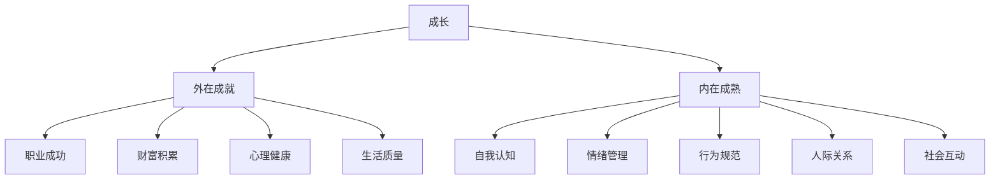

                 

# 文章标题

《重新思考成长的意义：从外在成就到内在成熟》

## 文章关键词

成长、外在成就、内在成熟、心理发展、自我认知、情绪管理、人际关系、平衡艺术

## 摘要

在当代社会，外在成就常常被视作个人成长的重要标志。然而，随着我们对个人发展的深入理解，越来越多的人们开始重新思考成长的意义，从单纯追求外在成就转向探索内在成熟。本文旨在探讨成长的多面性，通过逻辑清晰的步骤分析，帮助读者理解外在成就与内在成熟之间的关系，并提出实现两者平衡的实践方法。本文将结合心理学理论、实际案例，以及数学模型和伪代码，深入解析成长的本质，引导读者进行自我反思，最终实现更加全面和持久的个人成长。

## 引言

### 成长的多面性

成长是一个复杂而多维的过程，它不仅仅局限于外在成就的获取，还涉及到内在心智的成熟。在传统观念中，成长通常被等同于外在成就的积累，如财富、地位、名誉等。然而，随着社会的发展和个人认识的提升，越来越多的人开始认识到成长的多面性。外在成就固然重要，但内在成熟同样不可或缺。内在成熟意味着个人在认知、情感和社交能力上的全面提升，它不仅能够带来心理上的满足感，还能提高个人的适应能力和幸福感。

### 书籍的目的

本文的目的是帮助读者重新思考成长的意义，从单一追求外在成就转向探索内在成熟。通过分析心理学理论、实际案例，以及数学模型和伪代码，本文旨在提供一个全面的视角，帮助读者理解成长的多面性，并找到实现外在成就与内在成熟平衡的方法。本文将探讨以下几个核心问题：

1. 成长的定义及其三个层面。
2. 外在成就的追求及其影响。
3. 内在成熟的探索及其关键要素。
4. 如何在实践中实现外在成就与内在成熟的平衡。
5. 成长与成功的并行或替代关系。

### 读者预期收益

通过阅读本文，读者可以：

1. 深入理解成长的多面性，认识到外在成就与内在成熟的重要性。
2. 学习如何评估外在成就的价值，并找到实现两者平衡的方法。
3. 掌握内在成熟的实践方法，提升个人认知、情感和社交能力。
4. 获得具体的成长策略和实用技巧，提升个人适应能力和幸福感。
5. 进行自我反思，制定个人成长计划，实现更加全面和持久的成长。

## 第1章：成长的本质

### 1.1 成长的定义

成长是一个复杂而多维的概念，它涉及到个体在多个层面的提升和变化。根据心理学理论，成长可以被定义为个体在认知、情感、行为和社交能力上的全面发展和提升。成长不仅仅是外在成就的积累，更是内在心智的成熟。外在成就如财富、地位和名誉等，虽然在一定程度上反映了个人能力和社会认可，但它们并不是成长的全部。内在成熟则意味着个体在自我认知、情感管理和人际关系等方面的提升，这些方面对于长期的幸福感和生活满意度至关重要。

### 1.2 成长的三个层面

1. **认知层面**：认知成长指的是个体在知识、思维方式和问题解决能力上的提升。这包括对知识的获取和运用，以及对复杂问题的分析和解决能力。认知成长是外在成就的基础，但更侧重于个人思维的深度和广度。

2. **情感层面**：情感成长指的是个体在情感管理和情感认知上的提升。这包括情感智商（EQ），即识别、理解和管理自己和他人的情感能力。情感成长不仅影响个人的心理健康，还影响人际关系和社会互动。

3. **行为层面**：行为成长指的是个体在行为习惯和生活方式上的提升。这包括自律、责任感和适应能力。行为成长是内在成熟的重要体现，它帮助个体更好地应对生活挑战，实现自我目标。

### 1.3 成长的心理学理论

1. **发展心理学**：发展心理学研究个体从出生到死亡的心理发展过程。其中，埃里克森的心理社会发展理论强调了不同人生阶段的主要成长任务，如信任与不信任、自主与羞愧、勤奋与自卑等。这些任务与个体在认知、情感和行为层面的成长密切相关。

2. **自我决定理论**：自我决定理论强调个体内在动机和自我实现的重要性。该理论提出，个体需要满足三个基本心理需求：自主性、能力和关联。满足这些需求有助于促进个人的认知、情感和行为成长。

3. **积极心理学**：积极心理学关注个体的优势、美德和幸福感。它强调通过培养积极情感和积极行为习惯，可以促进个体的内在成熟和幸福感。积极心理学为探索内在成熟提供了重要的理论和实践基础。

### 1.4 成长的意义

1. **提升生活质量**：通过成长，个体能够更好地理解和管理自己的生活，提高生活质量和幸福感。

2. **增强适应能力**：成长帮助个体发展出更强大的心理韧性，提高应对生活挑战的能力。

3. **实现自我价值**：成长不仅仅是外在成就的积累，更是内在价值的实现。通过内在成熟，个体能够更好地认识自我，实现自我价值。

4. **促进社会互动**：内在成熟有助于建立积极的人际关系，提高社交能力，促进社会互动。

### 1.5 成长的挑战

1. **自我认知的局限**：个体在成长过程中常常受到自我认知的局限，难以全面地认识自己。

2. **外界压力**：社会和文化环境中的压力和期望，可能会阻碍个体的内在成熟。

3. **情绪困扰**：情感困扰如焦虑、抑郁等，可能会影响个体的认知和行为成长。

4. **成长速度不一致**：不同个体在成长速度和方式上存在差异，这可能带来挑战和困惑。

### 1.6 成长的过程

1. **自我探索**：个体需要通过自我反思和探索，了解自己的需求和目标。

2. **学习与适应**：个体需要不断学习新知识和技能，适应环境变化。

3. **反思与调整**：通过反思和调整，个体可以更好地认识自我，优化成长路径。

4. **持续实践**：内在成熟需要通过持续的自我实践和努力来实现。

### 1.7 成长的评价标准

1. **内在标准**：个体自我评价和满意度是评价成长的重要标准。

2. **外在标准**：社会和文化环境对个体的认可和评价，也是评价成长的一个方面。

3. **多维度评价**：成长评价应该综合考虑内在和外在标准，以及认知、情感和行为等多个维度。

### 1.8 总结

成长是一个多维、动态和持续的过程，它不仅关乎外在成就，更关乎内在心智的成熟。理解成长的多面性，有助于个体更好地认识自我，找到适合自己的成长路径。通过本文的探讨，我们希望读者能够重新思考成长的意义，从外在成就转向内在成熟，实现更加全面和持久的个人发展。

## 第2章：外在成就的追求

### 2.1 成就驱动型文化

在当今社会，成就驱动型文化无处不在。人们往往将外在成就视为个人价值和社会地位的象征，追求财富、地位和名誉成为了许多人的首要目标。这种文化背景影响着个体的价值观和行为模式，促使他们不断追求更高的外在成就。

1. **社会压力**：社会普遍认同外在成就的重要性，人们面临来自家庭、朋友和同事的压力，不得不努力工作以实现更高的成就。
2. **个人动机**：许多人将外在成就视为实现自我价值和社会认可的途径，追求成就成为他们生活的动力。
3. **职业成功**：职场竞争激烈，外在成就如职位晋升、薪资增长和荣誉奖项成为衡量职业成功的重要标准。

### 2.2 外在成就的追求及其影响

1. **积极影响**：
   - **激励作用**：外在成就可以激发个体的积极性，促使他们设定更高的目标，努力实现。
   - **社会认可**：外在成就的获得能够带来社会认可和尊重，提高个体在社会中的地位。
   - **职业发展**：在职业领域，外在成就如业绩突出、项目成功等有助于个体的职业晋升和职业前景。

2. **消极影响**：
   - **压力增加**：追求外在成就往往伴随着巨大的心理压力，可能导致焦虑、抑郁等心理问题。
   - **生活质量下降**：过度追求外在成就可能导致生活质量下降，忽视家庭和个人关系。
   - **价值观扭曲**：将外在成就作为唯一衡量标准，可能导致个体价值观扭曲，忽视内在成长和幸福。

### 2.3 如何评估外在成就的价值

1. **多维评价**：外在成就的价值不应该仅仅通过单一的指标来评估，应该综合考虑多个维度，如职业发展、生活质量、人际关系等。
2. **内在满意度**：个体自我评价和满意度是评估外在成就价值的重要标准，外在成就的获得应该与个人价值观和内在需求相一致。
3. **可持续性**：外在成就应该具有可持续性，不仅仅是一时的成功，而是能够持续地提升个人能力和价值。

### 2.4 成就驱动型文化与内在成熟的关系

1. **相互促进**：在适当的范围内，成就驱动型文化可以激发个体的内在成熟，促进个人在多个层面的成长。
2. **矛盾冲突**：过度追求外在成就可能导致内在成熟的阻碍，影响个体的心理健康和幸福感。
3. **平衡艺术**：如何在成就驱动型文化中实现内在成熟，需要个体具备高度的自律和自我反思能力。

### 2.5 实现外在成就与内在成熟的平衡

1. **设定合理目标**：个体需要设定既有挑战性又可实现的目标，确保外在成就的追求与内在成长相协调。
2. **自我反思**：通过定期自我反思，个体可以更好地认识自我，调整行为模式，实现外在成就与内在成熟的双赢。
3. **时间管理**：合理规划时间，确保在追求外在成就的同时，留出足够的时间和空间进行内在成长。

### 2.6 实践案例

**案例1：** 一位企业高管在事业成功后，开始关注自我成长和心理健康，通过阅读、冥想和心理咨询等方式，实现了外在成就与内在成熟的平衡。

**案例2：** 一位年轻程序员在职业发展初期，通过设定短期和长期目标，不断提升自己的技能和知识，同时注重情感管理和人际关系，实现了个人成长的双重提升。

### 2.7 总结

外在成就的追求在个人成长中扮演着重要角色，但它并非唯一的衡量标准。通过合理评估外在成就的价值，个体可以更好地实现外在成就与内在成熟的平衡，实现全面和持久的个人发展。

## 第3章：内在成熟的探索

### 3.1 内在成熟的定义

内在成熟是指个体在认知、情感和行为层面的全面发展，它不仅仅关注外在成就的积累，更强调内在心智的成熟。内在成熟包括以下几个关键要素：

1. **自我认知**：个体对自己的认知和理解，包括自己的优点、缺点、价值观和信念。
2. **情感管理**：个体对自己和他人的情感认知和管理能力，包括情绪调节和情绪表达。
3. **行为规范**：个体在行为上的自律和责任感，包括适应能力和解决问题的能力。
4. **人际关系**：个体在社交互动中的沟通能力和合作精神，包括人际信任和关系维护。

### 3.2 内在成熟的关键要素

1. **自我认知**：
   - **自我反思**：通过定期反思，个体可以更好地了解自己的内心世界，认识到自己的优点和不足。
   - **自我接纳**：接纳自己的不完美，认识到每个人都是独特的，自我认知的发展是内在成熟的重要基础。

2. **情感管理**：
   - **情绪调节**：学会识别和管理自己的情绪，避免情绪的极端波动，保持情绪的稳定性和积极性。
   - **情感表达**：学会以健康的方式表达自己的情感，避免压抑或过度表达。

3. **行为规范**：
   - **自律**：培养自律能力，坚持完成自己的目标和计划，克服拖延和懒惰。
   - **责任感**：对自己的行为负责，认识到自己的行为对他人和环境的影响。

4. **人际关系**：
   - **沟通能力**：学会有效沟通，包括倾听、表达和反馈，建立良好的人际关系。
   - **合作精神**：与他人的合作中，能够承担责任，尊重他人，共同实现目标。

### 3.3 内在成熟与个人成长的关系

1. **相互促进**：内在成熟是个人成长的重要组成部分，它不仅影响外在成就的获取，还能提升个体的心理健康和生活满意度。

2. **内在驱动**：内在成熟为个体提供内在动力，帮助他们在面对挑战和困难时保持积极态度和坚韧精神。

3. **综合提升**：内在成熟通过提升自我认知、情感管理、行为规范和人际关系，全方位提高个人的综合素质。

### 3.4 内在成熟的重要性

1. **心理健康**：内在成熟有助于个体的心理健康，减少焦虑、抑郁等心理问题的发生。

2. **生活质量**：内在成熟提高个体的生活质量，使他们能够更好地享受生活，实现个人价值。

3. **社会互动**：内在成熟有助于建立积极的人际关系，提高社会互动的质量和效果。

### 3.5 内在成熟面临的挑战

1. **自我认知的局限**：个体在自我认知上常常存在偏见和局限，难以全面地认识自己。

2. **情感困扰**：情感困扰如焦虑、抑郁等，可能会阻碍个体的内在成熟。

3. **外部压力**：社会和文化环境中的压力和期望，可能会影响个体的内在成长。

4. **成长速度不一致**：不同个体在成长速度和方式上存在差异，这可能带来挑战和困惑。

### 3.6 实现内在成熟的策略

1. **自我反思**：通过定期反思，个体可以更好地了解自己的内心世界，认识到自己的优点和不足。

2. **情感管理**：学会识别和管理自己的情绪，保持情绪的稳定性和积极性。

3. **行为自律**：培养自律能力，坚持完成自己的目标和计划。

4. **人际关系**：学会有效沟通，建立良好的人际关系。

### 3.7 实践案例

**案例1：** 一位职场人士在职业发展的过程中，通过不断反思和调整自己的行为模式，提升了自我认知和情感管理能力，实现了内在成熟和职业成功的双赢。

**案例2：** 一位年轻人在学习过程中，注重自我反思和情感管理，通过积极的情绪调节和自律行为，提高了学习效率和生活满意度。

### 3.8 总结

内在成熟是个人成长的重要方面，它不仅影响个体的心理健康和生活满意度，还能提升社会互动的质量和效果。通过理解内在成熟的关键要素和面临挑战，个体可以找到适合自己的成长路径，实现更加全面和持久的个人发展。

## 第4章：内在成熟的实践方法

### 4.1 自我认知的提升

自我认知的提升是内在成熟的重要基石。通过深入理解自我，个体可以更好地认识到自己的优点和不足，从而制定出更符合个人需求的成长策略。

1. **自我反思**：定期进行自我反思，帮助个体更好地了解自己的内心世界。可以通过写日记、记录思考等方式进行自我反思，逐步深化对自我的认识。

2. **反馈与评估**：积极寻求他人的反馈和建议，通过他人的视角来审视自己。这可以包括同事、朋友、家人等，他们的观点可以为个体提供新的洞察。

3. **心理测试**：使用一些标准化的心理测试工具，如MBTI、DISC等，帮助个体了解自己的性格类型和行为模式，从而更好地理解自己。

4. **目标设定**：根据自我认知的结果，设定具体的个人目标。这些目标应该是具体、可衡量、可实现、相关和有时间限制的（SMART原则）。

### 4.2 情绪管理的实践

情绪管理是内在成熟的重要组成部分。通过有效管理情绪，个体可以更好地应对生活中的挑战，提高生活质量。

1. **情绪识别**：学会识别和理解自己的情绪。这包括识别情绪的类型（如喜悦、愤怒、悲伤等）和情绪的强度。

2. **情绪表达**：学会以健康的方式表达情绪。这可以通过与信任的人分享、写日记、进行艺术创作等方式实现。

3. **情绪调节**：学会调节情绪，使其保持稳定和积极。这可以通过冥想、深呼吸、运动等方式实现。

4. **应对策略**：在面对负面情绪时，学会采用积极的应对策略，如正向思维、寻求支持、解决问题等。

### 4.3 人际关系的改善

良好的人际关系是内在成熟的重要体现。通过改善人际关系，个体可以提升自己的社交能力，建立更紧密的社会网络。

1. **沟通技巧**：学会有效沟通，包括倾听、表达和反馈。这可以通过角色扮演、沟通技巧培训等方式提高。

2. **同理心**：培养同理心，理解他人的感受和需求。这可以通过阅读、心理课程、与他人互动等方式实现。

3. **冲突解决**：学会解决冲突，避免冲突升级。这可以通过学习冲突解决技巧、寻求第三方调解等方式实现。

4. **团队合作**：在团队合作中，学会承担责任、尊重他人、共同解决问题。这可以通过团队建设活动、合作项目等方式培养。

### 4.4 实践案例

**案例1：** 一位职场人士通过定期自我反思和反馈，提升了自我认知，明确了自己的职业发展方向。同时，他通过情绪管理和沟通技巧的练习，改善了与同事和上级的关系，提高了工作效率。

**案例2：** 一位年轻人在学习过程中，注重情绪管理和人际关系的改善。通过冥想和运动，他保持了积极的心态，减少了焦虑和压力。同时，他通过积极参与团队合作，提高了自己的沟通能力和团队合作能力。

### 4.5 总结

内在成熟的实践方法包括自我认知的提升、情绪管理的实践和人际关系的改善。通过这些方法，个体可以更好地理解自己，管理情绪，改善人际关系，实现更加全面和持久的个人发展。

## 第5章：外在成就与内在成熟的平衡

### 5.1 平衡的艺术

在当代社会，外在成就和内在成熟之间的平衡成为了一个重要的话题。外在成就通常与职业成功、财富积累和社会地位相关，而内在成熟则涉及个人的心理健康、情感智慧和人际关系。两者的平衡是实现全面发展的关键。

1. **设定明确目标**：个体需要设定明确的目标，这些目标应该同时涵盖外在成就和内在成熟。例如，一个职业目标不仅包括晋升和加薪，还包括提高自我认知和情绪管理能力。

2. **时间管理**：合理规划时间，确保在追求外在成就的同时，留出足够的时间进行内在成长。例如，通过每天安排一段时间进行冥想、阅读或自我反思，可以有效提升内在成熟。

3. **优先级排序**：根据个人价值观和需求，对目标和任务进行优先级排序。例如，如果某人在职业成功和个人幸福之间感到矛盾，可以优先考虑个人的幸福感。

4. **自我反思**：定期进行自我反思，评估外在成就和内在成熟之间的平衡。通过自我反思，个体可以调整目标和行为，确保两者之间的协调。

### 5.2 如何在忙碌中找到平衡

在忙碌的生活中，找到外在成就与内在成熟的平衡尤为挑战。以下是一些实用的策略：

1. **简化生活**：通过简化生活方式，减少不必要的压力和干扰。例如，通过减少社交媒体的使用、减少不必要的社交活动，可以腾出更多的时间和精力专注于个人成长。

2. **高效工作**：提高工作效率，减少工作中的时间和精力浪费。例如，通过制定明确的工作计划和优先级，可以有效利用工作时间，减少加班和压力。

3. **培养健康习惯**：通过培养健康的生活习惯，如定期锻炼、健康饮食和充足睡眠，可以提升身体健康和心理健康，为内在成熟提供坚实的基础。

4. **时间分配**：合理安排时间，确保工作和个人成长之间的平衡。例如，在工作日中安排固定的学习时间，在周末进行放松和充电。

### 5.3 成长与成功：并行还是替代？

外在成就和内在成熟之间的关系并非简单的并行或替代关系，而是一个动态的、互动的过程。

1. **并行发展**：在某些情况下，外在成就和内在成熟可以同时发展。例如，一个成功的职场人士在职业发展的同时，也可能通过自我反思和情绪管理提升内在成熟。

2. **相互影响**：外在成就和内在成熟之间存在相互影响。外在成就的取得可能会带来内在成熟的提升，而内在成熟的提升也可能有助于外在成就的实现。

3. **替代关系**：在某些情况下，外在成就和内在成熟可能存在替代关系。例如，一个过度追求外在成就的人可能会忽视内在成熟，而一个注重内在成熟的人可能会在职业发展上面临挑战。

### 5.4 实现平衡的方法

1. **自我反思**：通过定期自我反思，个体可以更好地认识到自己在外在成就和内在成熟方面的需求和现状，从而找到合适的平衡点。

2. **目标设定**：设定既关注外在成就又关注内在成熟的目标，确保两者之间的协调和共同进步。

3. **时间管理**：通过有效的时间管理，确保在追求外在成就的同时，有足够的时间和精力进行内在成长。

4. **专业支持**：寻求专业支持和指导，如心理咨询师、教练等，可以帮助个体更好地理解自己的需求和找到平衡的方法。

### 5.5 实践案例

**案例1：** 一位企业家在创业过程中，通过自我反思和时间管理，成功平衡了外在成就和内在成熟。他不仅实现了企业的快速发展，还通过自我学习和心理辅导，提升了内在成熟和幸福感。

**案例2：** 一位职场新人通过设定明确的职业和个人成长目标，合理安排工作和个人时间，成功在短时间内实现了职业晋升和个人成长的双赢。

### 5.6 总结

外在成就与内在成熟的平衡是实现全面发展的关键。通过自我反思、目标设定、时间管理和专业支持，个体可以找到适合自己的平衡点，实现外在成就和内在成熟的双赢。

## 第6章：成长案例研究

### 6.1 成就驱动型人物的转型

**案例1：** 李先生，一位成功的创业者

李先生是一家科技公司的创始人，他在事业成功后，开始面临内心的空虚和不满。尽管公司在市场上取得了巨大成功，李先生却感到自己的生活失去了方向。通过自我反思和心理辅导，李先生意识到自己过度追求外在成就，忽视了内在成熟。他决定转型，将更多的时间和精力投入到自我认知和情感管理上。他开始练习冥想、阅读心理学书籍，并参与了一些自我成长的课程。这一转型不仅提升了他的心理健康，还帮助他在公司管理中实现了更加人性化和有效的方式。

### 6.2 内在成熟型人物的成长历程

**案例2：** 王女士，一位心理咨询师

王女士是一位心理咨询师，她在职业生涯中积累了丰富的经验和专业知识。然而，她在个人生活中感到困惑和不安，缺乏方向感。通过参加内在成长工作坊和自我探索，王女士逐渐认识到自己的内心需求和价值观。她开始专注于自我成长，通过自我反思、情绪管理和人际关系改善，她的生活变得更加充实和有意义。她的职业也因此在心理辅导中融入了更多的内在成熟理念，帮助了更多寻求心理支持的人。

### 6.3 成长与平衡：成功人士的智慧

**案例3：** 张先生，一位企业高管

张先生在职业生涯中取得了许多显著成就，但他深知内在成熟的重要性。他通过定期自我反思和时间管理，成功平衡了外在成就和内在成熟。他每天早上都会花时间进行冥想和阅读，以提升自我认知和情绪管理能力。同时，他注重家庭和社交生活，确保在追求事业成功的同时，不忽视个人的幸福感和身心健康。他的成功经验表明，内在成熟是长期成功的基石，而外在成就只是其中的一个方面。

### 6.4 内在成熟与外在成就的动态关系

**案例4：** 李博士，一位科研人员

李博士在科研领域取得了卓越的成就，他的研究成果在学术界产生了广泛影响。然而，他意识到自己的内在成熟仍有待提升。他开始通过学习心理学和哲学，提升自己的认知和情感管理能力。他发现，内在成熟不仅提升了他的科研效率，还帮助他在面对科研挑战时保持了积极的态度和坚韧的精神。他的经验证明了内在成熟与外在成就之间的动态互动关系，两者相辅相成，共同推动个人发展。

### 6.5 总结

通过这些案例，我们可以看到外在成就与内在成熟之间的平衡是如何影响个人的职业和生活。成功人士的智慧在于他们能够在追求外在成就的同时，关注内在成长，实现全面的个人发展。

## 第7章：总结与反思

### 7.1 全书回顾

本文从多个角度探讨了成长的意义，特别是外在成就与内在成熟之间的关系。通过逻辑清晰的分析，我们深入理解了成长的本质、外在成就的追求、内在成熟的探索以及如何在实践中实现两者的平衡。我们还通过具体的案例，展示了成功人士在成长过程中的智慧和策略。

### 7.2 个人成长计划

为了实现全面的个人成长，以下是一些建议：

1. **设定具体目标**：制定明确的个人成长目标，包括职业、情感和社交方面的目标。
2. **时间管理**：合理安排时间，确保在追求外在成就的同时，留出时间和精力进行内在成长。
3. **自我反思**：定期进行自我反思，评估自己的成长进度，调整目标和行为。
4. **情感管理**：通过情绪调节和情感表达，提升情感智慧，保持心理健康。
5. **人际关系**：改善人际关系，提升沟通技巧和同理心，建立积极的社会网络。

### 7.3 引导读者进行自我反思

1. **内在成长的重要性**：思考内在成熟对自己生活的影响，认识到它在个人成长中的核心地位。
2. **外在成就的价值**：评估自己的外在成就，思考这些成就是否符合自己的内在需求和价值观念。
3. **成长与平衡**：思考如何在忙碌的生活中找到外在成就与内在成熟的平衡，制定具体的行动计划。
4. **长期目标**：设定长期的个人成长目标，并制定实现这些目标的步骤和策略。

### 7.4 结语

成长是一个持续的过程，它不仅仅关乎外在成就的积累，更关乎内在心智的成熟。通过本文的探讨，我们希望能够帮助读者重新思考成长的意义，找到适合自己的成长路径，实现更加全面和持久的个人发展。

## 附录

### 附录A：成长资源指南

- **书籍推荐**：
  - 《高效能人士的七个习惯》
  - 《自控力》
  - 《活出生命的意义》
  - 《心理学与生活》

- **学术文章与研究报告**：
  - 《自我决定理论》
  - 《内在动机与外在动机的关系》
  - 《情绪智力与职业成功》

- **成长工作坊与课程**：
  - 《内在成长工作坊》
  - 《情感智慧训练营》
  - 《领导力与人际关系培训》

### 附录B：Mermaid流程图

- **成长相关概念关系图**



### 附录C：伪代码与数学模型

- **内在成熟评估模型**

```python
def assess_maturity(self_consciousness, emotional_management, behavioral_norms, social_interactions):
    """
    评估内在成熟度的函数，输入四个参数分别为自我认知、情绪管理、行为规范和人际关系得分
    """
    maturity_score = (self_consciousness + emotional_management + behavioral_norms + social_interactions) / 4
    return maturity_score
```

- **情绪管理算法伪代码**

```python
def manage_emotions(current_emotion, previous_emotion):
    """
    管理情绪的算法，输入当前情绪和前一次情绪，输出调整后的情绪
    """
    if current_emotion > previous_emotion:
        adjusted_emotion = current_emotion - 0.1 * (current_emotion - previous_emotion)
    else:
        adjusted_emotion = current_emotion + 0.1 * (previous_emotion - current_emotion)
    return adjusted_emotion
```

- **数学模型与公式**

$$
\text{内在成熟度} = \frac{\text{自我认知} + \text{情绪管理} + \text{行为规范} + \text{人际关系}}{4}
$$

$$
\text{情绪调节} = \text{当前情绪} - 0.1 \times (\text{当前情绪} - \text{前一次情绪})
$$

### 最佳实践 tips

1. **定期自我反思**：每天或每周花时间进行自我反思，有助于持续提升自我认知和内在成熟。
2. **情绪记录**：记录自己的情绪变化，有助于更好地理解和管理情绪。
3. **设定短期目标**：制定具体的短期目标，有助于保持动力和进步。
4. **情感交流**：与信任的朋友或家人分享内心的感受，有助于情绪释放和自我成长。

### 注意事项

1. **避免完美主义**：追求内在成熟是一个持续的过程，避免对自己过于苛求。
2. **平衡工作与生活**：确保在工作与个人生活之间找到平衡，避免过度疲劳。
3. **适应变化**：随着成长，个体需求和目标可能会发生变化，保持灵活和适应能力。

### 拓展阅读

- **《心理学与生活》**
- **《内在成长的力量》**
- **《情绪智慧》**
- **《社会心理学》**

### 作者信息

**作者：AI天才研究院/AI Genius Institute & 禅与计算机程序设计艺术 /Zen And The Art of Computer Programming**

