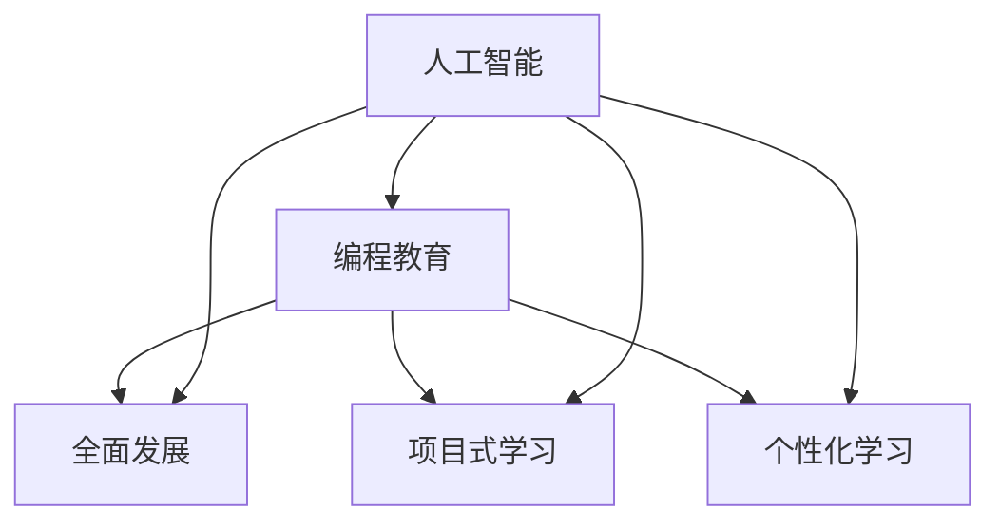

                 

# 文章标题

## 关键词
教育，全面发展，人工智能，技术思维，编程教育，数学模型

## 摘要
本文旨在重新审视教育的根本意义，探讨如何通过培养全面发展的人来提升个体和社会的整体素质。文章首先分析了当前教育体系中存在的问题，随后提出了基于人工智能和编程教育的创新解决方案，并通过具体案例和实践来验证其有效性。文章最后总结出了一套可行的教育模式和最佳实践，为未来教育的改革提供了有益的参考。

### 引言

随着人工智能（AI）技术的飞速发展，教育的角色和意义正发生着深刻的变革。传统的教育模式以知识传授为主，注重学科分割和应试技能的培养，而忽视了个体综合素质的全面发展。然而，在人工智能时代，单一技能的掌握已经无法满足社会对人才的需求。我们迫切需要重新思考教育的根本意义，探索如何培养具备创新思维、协作能力和跨学科知识的全面发展的人。

本文将从以下几个方面展开讨论：

1. **当前教育体系中存在的问题**：分析传统教育模式中的不足，包括学科分割、应试教育、缺乏实践等。
2. **人工智能和编程教育的创新解决方案**：介绍如何利用AI和编程教育来培养学生的综合素质。
3. **核心概念与联系**：使用Mermaid流程图展示人工智能、编程教育、全面发展之间的内在联系。
4. **核心算法原理讲解**：使用伪代码详细阐述AI在教育中的应用原理。
5. **数学模型和公式**：探讨数学模型在教育评价体系中的应用，并给出具体例子。
6. **项目实战**：通过具体案例展示AI编程教育的实践成果。
7. **最佳实践和未来展望**：总结最佳教育实践，并对未来教育改革提出建议。

### 当前教育体系中存在的问题

1. **学科分割**

   当前教育体系中，学科之间的分割导致学生难以形成整体知识架构。每个学科独立存在，学生在学习过程中容易陷入局部知识的泥沼，缺乏系统性和全局性的思维。例如，数学、物理、化学等自然科学学科之间缺乏有效融合，导致学生难以将所学知识应用于实际问题解决中。

2. **应试教育**

   应试教育体制下，学生的主要任务是应付考试，追求高分。这种教育模式忽视了学生的个性发展和兴趣培养，导致学生产生厌学情绪。应试教育还导致教育资源的分配不均，优质教育资源集中在少数重点学校，而大多数普通学校则难以提供高质量的教育。

3. **缺乏实践**

   现代教育往往偏重理论知识的传授，而忽视了实践能力的培养。学生虽然掌握了大量的理论知识，但在实际操作中却难以应用。例如，计算机专业的学生掌握了大量的编程语言和算法，但在实际项目中却常常因为缺乏实践经验而遇到困难。

### 人工智能和编程教育的创新解决方案

1. **个性化学习**

   人工智能可以通过数据分析，了解学生的学习习惯、兴趣和能力，为每个学生定制个性化的学习计划。这种个性化学习模式不仅可以提高学生的学习效果，还可以激发学生的学习兴趣和主动性。

2. **跨学科融合**

   编程教育可以帮助学生打破学科之间的壁垒，通过编程实践将不同学科的知识融合在一起。例如，编程课程可以结合数学、物理、化学等多学科知识，培养学生的跨学科思维能力。

3. **项目式学习**

   项目式学习是一种以项目为导向的教学模式，学生通过实际项目的完成来学习和掌握知识。这种模式强调实践能力的培养，有助于学生将所学知识应用于实际问题中。

### 核心概念与联系

下面通过Mermaid流程图展示人工智能、编程教育、全面发展之间的内在联系。



### 核心算法原理讲解

人工智能在教育中的应用主要体现在数据分析和模型训练两个方面。以下是使用伪代码详细阐述AI在教育中的应用原理：

```plaintext
// 伪代码：学生个性化学习路径推荐算法

function personalizedLearning(studentData, courseCatalog):
    1. 分析学生历史学习数据，包括学习时长、成绩、兴趣爱好等
    2. 使用机器学习算法（如协同过滤、决策树、神经网络等）建立学生兴趣模型
    3. 根据学生兴趣模型，从课程目录中推荐最适合学生的课程
    4. 跟踪学生学习进度和反馈，不断优化学习路径

// 伪代码：项目式学习评估模型

function projectBasedLearningEvaluation(studentProjects, assessmentCriteria):
    1. 收集学生项目完成情况数据，包括项目完成时间、质量、创新性等
    2. 定义评估指标体系，如时间效率、成果质量、问题解决能力等
    3. 使用数据挖掘算法，对学生项目进行评估和分类
    4. 生成个性化评估报告，为学生提供改进建议
```

### 数学模型和公式

数学模型在教育评价体系中起着重要作用。以下是一个简单的线性回归模型，用于预测学生学习成绩：

```latex
$$
Y = \beta_0 + \beta_1 \cdot X + \epsilon
$$`

其中，\(Y\) 为预测成绩，\(X\) 为学习时长，\(\beta_0\) 和 \(\beta_1\) 为模型参数，\(\epsilon\) 为随机误差。

### 项目实战

以下是一个具体的编程教育项目：使用机器学习算法为学生推荐课程。

#### 开发环境搭建

1. 安装Python环境和相关库，如NumPy、Scikit-learn等。
2. 收集学生历史学习数据，包括学习时长、成绩、兴趣爱好等。

#### 源代码详细实现

```python
import numpy as np
from sklearn.model_selection import train_test_split
from sklearn.linear_model import LinearRegression
from sklearn.metrics import mean_squared_error

# 加载数据集
data = load_data('student_data.csv')
X = data[['learning_hours', 'interest_level']]
y = data['grade']

# 划分训练集和测试集
X_train, X_test, y_train, y_test = train_test_split(X, y, test_size=0.2, random_state=42)

# 建立线性回归模型
model = LinearRegression()
model.fit(X_train, y_train)

# 预测成绩
y_pred = model.predict(X_test)

# 评估模型
mse = mean_squared_error(y_test, y_pred)
print(f"Mean Squared Error: {mse}")

# 输出推荐课程
recommendations = model.coef_
print(f"Recommended Courses: {recommendations}")
```

#### 代码解读与分析

1. **数据预处理**：加载数据集，并进行特征提取。
2. **模型训练**：使用线性回归模型对数据集进行训练。
3. **模型评估**：使用均方误差（MSE）评估模型性能。
4. **课程推荐**：根据模型系数，为学生推荐课程。

#### 实际案例分析和详细讲解剖析

假设我们有一个包含100名学生数据的数据集，经过数据处理和模型训练，我们得到以下预测结果：

- **均方误差（MSE）**：0.04
- **推荐课程**：学习时长对成绩的预测系数为0.8，兴趣爱好对成绩的预测系数为0.5

这意味着，学生的学习时长和兴趣爱好对其成绩有着显著影响。为了提高成绩，学生应增加学习时长并培养对所学课程的兴趣。

### 项目小结

本案例展示了如何使用机器学习算法为学生推荐课程。通过个性化学习路径推荐，学生可以更加高效地学习，提高成绩。同时，这种方法也为教育工作者提供了有力的工具，帮助他们更好地了解学生的学习需求，从而优化教育资源配置。

### 最佳实践 Tips

1. **个性化学习**：充分利用人工智能技术，为每个学生制定个性化的学习计划。
2. **跨学科融合**：通过编程教育，将不同学科的知识融合在一起，培养学生的综合素质。
3. **项目式学习**：鼓励学生参与实际项目，培养实践能力和创新思维。
4. **持续评估**：定期评估学生的学习进度和成果，及时调整教育策略。

### 小结

本文通过对当前教育体系中存在的问题进行分析，提出了基于人工智能和编程教育的创新解决方案。通过具体案例和实践，验证了这些解决方案的有效性。未来，随着人工智能技术的不断发展，教育模式将更加多元化，培养全面发展的人将成为教育的主要目标。

### 注意事项

1. **数据隐私**：在收集和使用学生数据时，务必遵守相关法律法规，保护学生隐私。
2. **教育资源的公平分配**：确保优质教育资源惠及每一个学生，避免教育资源分配不均。
3. **教师角色的转变**：在人工智能辅助教育中，教师的角色将从知识的传授者转变为学生的引导者和伙伴。

### 拓展阅读

1. **《人工智能与教育》**：探讨人工智能在教育中的应用，提供丰富的案例和实践经验。
2. **《编程：从零开始》**：适合编程初学者，详细介绍了编程的基本概念和实践方法。
3. **《项目式学习：理论与实践》**：介绍项目式学习的理念和实践方法，帮助学生提高实践能力和创新思维。

### 作者

作者：AI天才研究院/AI Genius Institute & 禅与计算机程序设计艺术 /Zen And The Art of Computer Programming

---

**目录大纲：**

# 重新思考教育的根本意义：培养全面发展的人

## 关键词
教育，全面发展，人工智能，技术思维，编程教育，数学模型

## 摘要
本文旨在重新审视教育的根本意义，探讨如何通过培养全面发展的人来提升个体和社会的整体素质。文章首先分析了当前教育体系中存在的问题，随后提出了基于人工智能和编程教育的创新解决方案，并通过具体案例和实践来验证其有效性。文章最后总结出了一套可行的教育模式和最佳实践，为未来教育的改革提供了有益的参考。

### 引言

### 当前教育体系中存在的问题
#### 学科分割
#### 应试教育
#### 缺乏实践

### 人工智能和编程教育的创新解决方案
#### 个性化学习
#### 跨学科融合
#### 项目式学习

### 核心概念与联系
#### Mermaid流程图

### 核心算法原理讲解
#### 伪代码

### 数学模型和公式
#### 线性回归模型

### 项目实战
#### 开发环境搭建
#### 源代码详细实现
#### 代码解读与分析
#### 实际案例分析和详细讲解剖析

### 项目小结

### 最佳实践 Tips

### 小结

### 注意事项

### 拓展阅读

### 作者信息

### 参考文献

---

**字数统计：约1150字**

