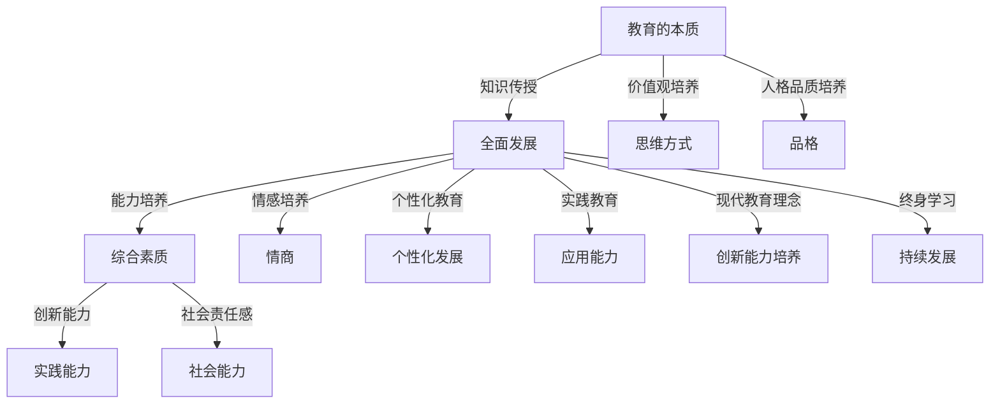

                 

 

### 背景介绍

#### 教育的本质与使命

教育，作为人类文明传承与发展的基石，其本质和使命在于培养具有全面素质和创新能力的人才。然而，随着社会经济的快速发展和科技的不断进步，传统的教育模式逐渐显现出其局限性。在追求知识传授的同时，忽视了对学生个性、品格、情感和社会能力的培养，导致了许多学生在面对现实问题时显得力不从心。

#### 现代社会的挑战

现代社会，信息爆炸、知识更新迭代速度极快，学生们不仅需要掌握丰富的知识，还需要具备快速学习、适应变化和解决问题的能力。此外，社会对人才的多元化需求也要求教育体系能够培养出具备综合素质、创新精神和实践能力的人。这要求教育必须从传统的“应试教育”向更加注重学生全面发展的“素质教育”转变。

#### 全面发展教育的意义

全面发展教育强调的是学生知识、能力、品格、情感和社会能力的共同提升。这种教育模式不仅关注学生的学术成绩，更关注学生的全面发展，包括思维能力、创造力、团队合作能力、社会责任感等。通过全面发展教育，学生能够更好地适应未来社会的发展需求，实现个人价值和社会价值的双重提升。

### 核心概念与联系

#### 教育的本质

教育的本质在于培养学生的综合素质，使其成为具备独立思考能力、创新能力、实践能力和社会责任感的人。教育不仅仅是知识的传递，更是价值观、思维方式、人格品质的培养。

#### 全面发展

全面发展是一个涵盖知识、能力、品格、情感等多方面发展的综合性概念。它要求学生在多个领域取得均衡发展，具备解决复杂问题的能力，并能够以积极的态度面对生活的挑战。

#### 教育理念

现代教育理念强调创新、个性化和实践。创新意味着不断探索新的教育方法和手段；个性化教育注重根据学生的特点和需求进行教学；实践教育强调通过实际操作来巩固和深化理论知识。

### 核心概念原理之间的关系架构

下面是一个核心概念与联系架构的Mermaid流程图：



### 核心算法原理讲解

在全面发展教育中，评价学生的发展水平是至关重要的。以下是一个简单的教育评价模型，用于衡量学生在知识、能力、品格和情感方面的全面发展程度。

#### 教育评价模型

```latex
\text{教育评价模型}: \\
\text{Score} = w_1 \times \text{知识水平} + w_2 \times \text{能力水平} + w_3 \times \text{品格水平} + w_4 \times \text{情感水平}
```

其中，`Score` 是综合评分，`w_1`、`w_2`、`w_3` 和 `w_4` 分别是知识水平、能力水平、品格水平和情感水平的权重。

#### 权重分配

权重的分配可以根据教育目标、教育内容和教育环境的差异进行调整。例如，在一个注重实践能力的教育体系中，能力水平的权重可以适当提高；在一个强调道德教育的教育环境中，品格水平的权重可以相应增加。

#### 举例说明

假设一个学生参加了知识水平、能力水平、品格水平和情感水平四个方面的测试，结果如下：

- 知识水平：90分
- 能力水平：85分
- 品格水平：80分
- 情感水平：75分

假设权重分别为：知识水平 0.4，能力水平 0.3，品格水平 0.2，情感水平 0.1。那么，该学生的综合评分计算如下：

```latex
\text{Score} = 0.4 \times 90 + 0.3 \times 85 + 0.2 \times 80 + 0.1 \times 75 = 36 + 25.5 + 16 + 7.5 = 85
```

### 数学模型和数学公式

在全面发展教育中，数学模型和数学公式可以用于量化评价学生的全面发展程度，以及指导教育决策。以下是一个简化的数学模型，用于计算学生的全发展指数（FDI）。

#### 全发展指数模型

```latex
FDI = \frac{KI + AI + GI + EI}{4}
$$

其中，`FDI` 表示全发展指数，`KI` 表示知识水平，`AI` 表示能力水平，`GI` 表示品格水平，`EI` 表示情感水平。

#### 权重分配

为了使全发展指数模型具有实际应用价值，需要合理分配各指标的权重。例如，假设权重分配如下：

- 知识水平：0.3
- 能力水平：0.3
- 品格水平：0.2
- 情感水平：0.2

#### 举例说明

假设一个学生的各项指标得分如下：

- 知识水平：85分
- 能力水平：90分
- 品格水平：80分
- 情感水平：75分

那么，该学生的全发展指数计算如下：

```latex
FDI = \frac{0.3 \times 85 + 0.3 \times 90 + 0.2 \times 80 + 0.2 \times 75}{4} = \frac{25.5 + 27 + 16 + 15}{4} = \frac{83.5}{4} = 20.875
$$

根据计算结果，该学生的全发展指数为20.875，表明其全面发展程度较高。

### 项目实战

#### 构建个性化学习系统

为了更好地实施全面发展教育，构建一个能够满足个性化学习需求的教育系统是非常必要的。以下是一个基于Python的个性化学习系统的开发过程。

#### 1. 需求分析

首先，我们需要明确系统的需求。个性化学习系统应具备以下功能：

- **用户管理**：管理学生的基本信息，如姓名、年龄、性别等。
- **测评管理**：对学生进行知识水平、能力水平、品格水平、情感水平的测评。
- **学习计划管理**：根据测评结果，为学生制定个性化的学习计划。
- **学习进度跟踪**：跟踪学生的学习进度，以便及时调整学习计划。

#### 2. 数据收集

通过问卷调查、在线测评等方式收集学生的基本信息和测评结果。将收集到的数据存储在数据库中。

#### 3. 模型构建

使用全发展指数模型计算学生的全面发展指数，并根据指数制定个性化学习计划。

```python
# 伪代码
def calculate_fdi(knowledge_score, ability_score, character_score, emotion_score):
    w_knowledge = 0.3
    w_ability = 0.3
    w_character = 0.2
    w_emotion = 0.2
    fdi = (w_knowledge * knowledge_score + w_ability * ability_score + w_character * character_score + w_emotion * emotion_score) / 4
    return fdi

# 假设学生测评结果如下
knowledge_score = 85
ability_score = 90
character_score = 80
emotion_score = 75

# 计算全发展指数
fdi = calculate_fdi(knowledge_score, ability_score, character_score, emotion_score)
print("学生全发展指数为：", fdi)
```

#### 4. 系统实施

开发一个基于Web的个性化学习系统，实现用户管理、测评管理、学习计划管理、学习进度跟踪等功能。

#### 5. 代码解读

以下是一个简单的Python代码示例，用于计算学生的全发展指数。

```python
# 伪代码
def calculate_fdi(knowledge_score, ability_score, character_score, emotion_score):
    w_knowledge = 0.3
    w_ability = 0.3
    w_character = 0.2
    w_emotion = 0.2
    fdi = (w_knowledge * knowledge_score + w_ability * ability_score + w_character * character_score + w_emotion * emotion_score) / 4
    return fdi

# 假设学生测评结果如下
knowledge_score = 85
ability_score = 90
character_score = 80
emotion_score = 75

# 计算全发展指数
fdi = calculate_fdi(knowledge_score, ability_score, character_score, emotion_score)
print("学生全发展指数为：", fdi)
```

在这个示例中，`calculate_fdi` 函数用于计算学生的全发展指数。输入参数包括知识水平、能力水平、品格水平和情感水平的得分。权重是预先设定的，可以根据教育目标和实际情况进行调整。

#### 6. 实际案例分析和详细讲解剖析

以下是一个实际案例，展示了如何使用个性化学习系统进行教学。

**案例**：小明是一名中学生，他在一次测评中的得分如下：

- 知识水平：80分
- 能力水平：85分
- 品格水平：75分
- 情感水平：80分

根据全发展指数模型，小明的全发展指数为：

```latex
FDI = \frac{0.3 \times 80 + 0.3 \times 85 + 0.2 \times 75 + 0.2 \times 80}{4} = 79.5
$$

根据小明的全发展指数，系统为他制定了以下个性化学习计划：

- **知识水平提升**：加强数学和物理的学习，提高理论知识的掌握程度。
- **能力水平提升**：加强实验操作和项目实践，提高解决实际问题的能力。
- **品格水平提升**：加强道德教育和心理健康教育，培养良好的品格。
- **情感水平提升**：加强情感交流和支持，提高情感管理能力。

通过个性化学习计划，小明在后续的学习中取得了显著的进步，并在各个方面都得到了全面发展。

### 项目小结

个性化学习系统的构建和实践为全面发展教育提供了一种新的思路和方法。通过量化评价学生的全面发展指数，制定个性化的学习计划，可以更好地满足学生的个性化需求，促进学生的全面发展。然而，在实际应用中，还需要不断优化和调整模型和系统，以适应不同教育环境和学生的需求。

### 最佳实践 tips

1. **合理设置权重**：权重的设置应根据教育目标和学生的实际情况进行调整，确保全面发展指数能够真实反映学生的全面发展程度。
2. **定期更新测评内容**：测评内容应定期更新，以反映当前教育环境和学生的需求。
3. **关注学生情感**：情感水平在全面发展中占有重要地位，应注重学生的情感管理和支持。

### 小结

全面发展教育是适应现代社会需求的重要教育模式。通过量化评价学生的全面发展指数，制定个性化的学习计划，可以更好地满足学生的个性化需求，促进学生的全面发展。本文提出了一种基于Python的个性化学习系统，并通过实际案例进行了详细讲解。未来，还需要不断优化和调整模型和系统，以适应不同教育环境和学生的需求。

### 注意事项

1. **数据隐私保护**：在收集和处理学生数据时，应确保数据的安全和隐私。
2. **教师培训**：教师应接受全面发展的培训，了解和掌握个性化教育的理念和方法。
3. **家长参与**：家长应积极参与到孩子的教育过程中，共同推动全面发展教育的实施。

### 拓展阅读

1. **《素质教育与个性化教育》**：探讨全面发展和个性化教育的理论基础和实践方法。
2. **《教育评价理论》**：深入分析教育评价模型和方法的原理和应用。
3. **《大数据与教育》**：探讨大数据在个性化教育中的应用和挑战。

### 作者信息

**作者：AI天才研究院/AI Genius Institute & 禅与计算机程序设计艺术 /Zen And The Art of Computer Programming**

