                 

### 文章标题

《重新思考教育目的：培养应对未来挑战的能力》

### 关键词

教育目的、未来挑战、创新能力、跨学科能力、社会责任感、技术融合、教育改革

### 摘要

本文旨在重新审视和定义教育目的，以应对未来社会的挑战。文章首先介绍了传统教育目的的局限性，以及现代社会对教育需求的变化。随后，分析了未来社会的特征，包括技术变革、全球化背景下的教育挑战和未来职业市场的变化趋势。在此基础上，文章提出了未来教育目的的构想，强调培养创新能力、跨学科能力和社会责任感的重要性。接下来，文章探讨了教育目标的设定与实现路径，以及培养未来能力的教育实践。此外，文章还探讨了技术与教育的融合，以及教育改革的路径与策略。最后，文章对未来的教育进行了展望，提出了教育发展的趋势和未来教育的社会责任。

## 第1章 教育目的的再定义

### 1.1 教育目的的历史演变

教育目的的历史演变可以追溯到古代社会，当时的教育主要是为了培养统治者和贵族，以传承和巩固社会秩序。随着社会的发展，教育的目的逐渐扩展，包括培养公民意识、专业技能和社会责任感。然而，传统教育目的在现代社会中面临着诸多局限。

首先，传统教育过于注重知识的传授，忽视了能力的培养。许多教育体系过于注重记忆和应试，导致学生缺乏创新能力和批判性思维。这种教育模式难以适应快速变化的社会需求，特别是在技术日新月异、信息爆炸的今天。

其次，传统教育目的往往过于狭隘，忽视了学生的个体差异。每个学生都有自己独特的学习方式和兴趣，而传统教育模式往往采用“一刀切”的方法，导致许多学生无法充分发挥自己的潜力。

最后，传统教育目的往往忽视了社会责任感的培养。在现代社会，人们越来越意识到，教育不仅仅是传授知识和技能，更重要的是培养有责任感、有担当的公民。然而，传统教育模式往往过于关注学术成绩，而忽视了学生的人格培养和社会责任感的培养。

### 1.2 现代社会对教育的需求变化

现代社会对教育的需求发生了显著变化，主要体现在以下几个方面：

首先，技术变革对社会的影响日益加深。人工智能、大数据、物联网等技术的快速发展，使得社会对人才的需求发生了根本性变化。现代社会需要具备创新能力、跨学科能力和技术素养的人才，以适应快速变化的工作环境。

其次，全球化背景下的教育挑战日益突出。全球化使得各国之间的联系更加紧密，也带来了教育资源的不平衡和文化的多样性。现代教育需要培养学生的全球视野，提高他们的跨文化沟通能力和国际竞争力。

最后，未来职业市场的变化趋势也对教育提出了新的要求。随着职业市场的不断变化，许多传统职业正在消失，而新的职业不断涌现。教育需要培养学生的终身学习能力和适应变化的能力，以应对未来职业市场的挑战。

### 1.3 教育目的的未来构想

面对现代社会对教育的需求变化，教育目的的未来构想应更加注重以下几个方面：

首先，培养创新能力。创新能力是未来社会的重要竞争力。教育应通过培养学生的批判性思维、问题解决能力和创新实践，提高他们的创新能力。

其次，跨学科能力的培养。未来社会需要具备跨学科能力的人才，能够将不同领域的知识进行融合和创新。教育应通过跨学科课程和项目，培养学生的跨学科能力。

最后，社会责任感的培养。教育应通过社会实践活动和公民教育，培养学生的社会责任感，使他们成为有担当、有责任感的公民。

### 核心概念与联系

#### 教育目的的历史演变

- **核心概念**：传统教育目的、现代社会需求、教育目的的演变
- **联系架构 Mermaid 流程图**：

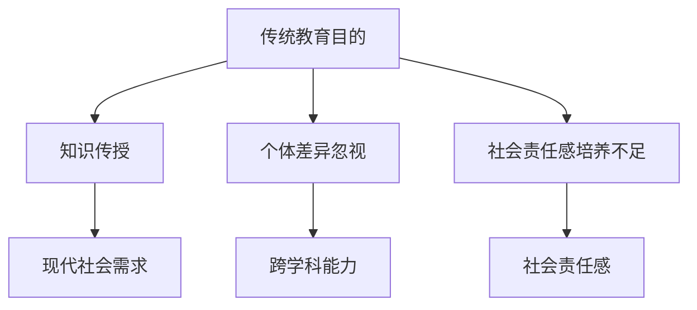

#### 现代社会对教育的需求变化

- **核心概念**：技术变革、全球化背景、未来职业市场
- **联系架构 Mermaid 流程图**：

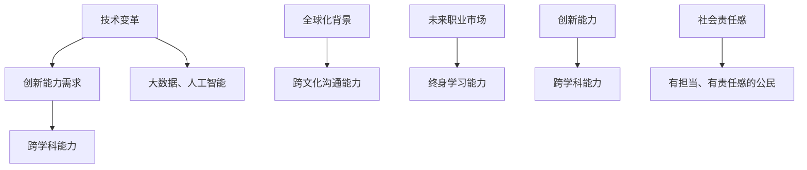

### 1.3 教育目的的未来构想

#### 教育目的的未来构想

- **核心概念**：创新能力、跨学科能力、社会责任感
- **联系架构 Mermaid 流程图**：

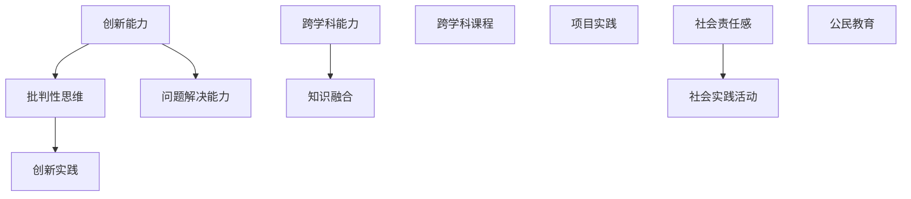

## 第2章 教育目标的设定与实现

### 2.1 教育目标的设定原则

#### 2.1.1 与社会发展相适应

教育目标的设定应与社会的需求和发展相适应。这意味着教育目标需要根据社会的技术进步、经济结构变化、文化多样性等方面进行动态调整。例如，在技术快速发展的今天，教育目标应更加注重培养学生的创新能力和技术素养。

#### 2.1.2 注重个体差异

教育目标的设定应注重个体差异，尊重每个学生的学习方式和兴趣。这意味着教育目标需要根据学生的个性、能力和发展需求进行个性化设定，以促进每个学生的全面发展。

#### 2.1.3 可操作性与可评估性

教育目标的设定应具有可操作性和可评估性。这意味着教育目标需要具体、明确，可以量化或质化，以便于教育实践和效果的评估。例如，培养创新能力可以具体化为参与创新项目、发表科研成果等。

### 2.2 教育目标的实现路径

#### 2.2.1 课程设计

课程设计是实现教育目标的重要途径。课程设计应注重整合多学科知识，培养学生的跨学科能力和创新能力。例如，可以设计跨学科项目课程，让学生在解决实际问题的过程中，融合不同学科的知识。

#### 2.2.2 教学方法的创新

教学方法的创新是实现教育目标的关键。教学方法应从传统的“教师为中心”转向“学生为中心”，注重培养学生的自主学习能力和批判性思维。例如，可以采用探究式学习、合作学习等教学方法，激发学生的学习兴趣和创造力。

#### 2.2.3 评估体系的构建

评估体系的构建是实现教育目标的重要保障。评估体系应注重过程评估和结果评估相结合，全面、客观地评价学生的学习效果。例如，可以采用多元化评估方法，包括考试、项目展示、自我评估等。

### 2.3 教育目标的案例分析

#### 2.3.1 国外教育目标的启示

国外教育目标为我国提供了有益的借鉴。例如，美国的教育目标强调培养学生的创新能力和全球视野，德国的教育目标注重学生的实践能力和工匠精神，芬兰的教育目标强调学生的自主学习和团队合作能力。这些教育目标为我国教育改革提供了宝贵的经验。

#### 2.3.2 我国教育目标的现状与挑战

我国的教育目标在近年来取得了显著进展，但仍然存在一些挑战。例如，教育目标过于注重应试教育，忽视了学生的创新能力和社会责任感的培养。此外，教育目标在城乡之间、地区之间存在不平衡，需要进一步优化和调整。

#### 2.3.3 教育目标的改革实践

教育目标的改革实践是我国教育改革的重要内容。近年来，我国在教育目标的改革方面取得了一系列成果。例如，新课程改革的推行，素质教育理念的深入人心，教育评价体系的不断完善等。这些改革实践为培养具备创新能力、跨学科能力和社会责任感的人才奠定了基础。

### 核心概念与联系

#### 教育目标的设定原则

- **核心概念**：社会发展相适应、个体差异、可操作性与可评估性
- **联系架构 Mermaid 流程图**：

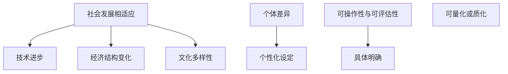

#### 教育目标的实现路径

- **核心概念**：课程设计、教学方法创新、评估体系构建
- **联系架构 Mermaid 流�程图**：

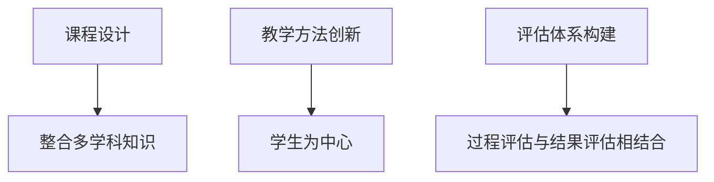

### 2.2 教育目标的设定原则

教育目标的设定是教育改革的重要环节，它直接关系到教育的质量和效果。为了确保教育目标的有效性和科学性，需要遵循以下几个原则：

#### 2.2.1 与社会发展相适应

教育目标的设定应与社会的需求和发展相适应。这意味着教育目标需要随着社会的变化而动态调整，以适应新的技术进步、经济结构变化和文化多样性。例如，随着信息技术的快速发展，教育目标应更加注重培养学生的数字素养和技术应用能力。同时，全球化使得各国之间的交流更加紧密，教育目标也需要培养学生的全球视野和跨文化沟通能力。此外，随着社会对职业道德和社会责任感的要求提高，教育目标应更加注重学生的品格教育和公民素养的培养。

#### 2.2.2 注重个体差异

教育目标的设定应注重个体差异，尊重每个学生的学习方式和兴趣。这意味着教育目标需要根据学生的个性、能力和发展需求进行个性化设定，以促进每个学生的全面发展。例如，对于具有艺术天赋的学生，教育目标可以侧重于艺术创造和审美能力的培养；对于有科学探索精神的学生，教育目标可以侧重于科学探究和实践能力的培养。这种个性化的教育目标有助于激发学生的学习兴趣和潜能，提高他们的学习效果。

#### 2.2.3 可操作性与可评估性

教育目标的设定应具有可操作性和可评估性。这意味着教育目标需要具体、明确，可以量化或质化，以便于教育实践和效果的评估。例如，一个具体的教育目标可以是“学生能够在两个月内独立完成一个小型编程项目”，这样既明确了目标的内容，又可以通过完成项目的时间和质量来评估目标的达成情况。此外，教育目标的可评估性也有助于教师和家长及时了解学生的学习进度和效果，从而调整教学策略和干预措施。

### 教育目标的设定步骤

为了确保教育目标的科学性和可操作性，可以按照以下步骤进行设定：

1. **需求分析**：首先，进行需求分析，了解社会的发展趋势、学生的需求和兴趣，以及学校的教育资源和条件。

2. **目标分解**：将总的教育目标分解为具体的子目标，确保每个子目标都有明确的指向和可操作性。

3. **目标量化**：对每个子目标进行量化，使其具有明确的评估标准。

4. **目标实施**：制定具体的实施方案，包括课程设计、教学方法、评估方式等。

5. **目标评估**：实施过程中，定期对教育目标进行评估，根据评估结果调整和优化教育目标。

### 教育目标的案例分析

为了更好地理解教育目标的设定和实现，以下是一些具体的案例分析：

#### 案例一：美国教育目标的设定

美国的教育目标强调培养学生的创新能力和批判性思维。例如，在《美国国家教育技术标准》中，明确提出了学生应具备的信息素养、创新素养和沟通协作能力。这些目标的设定充分考虑了美国社会的技术进步和全球化需求，同时也注重学生的个体差异。

#### 案例二：芬兰教育目标的设定

芬兰的教育目标强调学生的自主学习和团队合作能力。在芬兰的教育体系中，课程设计注重跨学科的整合，教学方法多样，包括项目式学习、合作学习等。这些方法有助于培养学生的自主学习能力和团队合作精神，从而实现教育目标。

#### 案例三：我国教育目标的设定

我国的教育目标在近年来进行了多次改革，强调培养学生的创新能力和实践能力。例如，《新课程改革纲要》提出了“以学生发展为本”的教育理念，强调学生的主体地位和个性化发展。这些目标的设定旨在应对我国社会发展的需求和学生的个性差异。

### 教育目标的实现路径

教育目标的实现路径是教育改革的关键环节，它决定了教育目标能否有效转化为学生的实际能力和素养。以下是一些实现教育目标的具体路径：

#### 2.2.1 课程设计

课程设计是实现教育目标的基础。课程设计应注重整合多学科知识，培养学生的跨学科能力和创新能力。例如，可以设计跨学科项目课程，让学生在解决实际问题的过程中，融合不同学科的知识。此外，课程设计应灵活多样，包括理论学习、实践操作、项目研究等，以满足不同学生的需求。

#### 2.2.2 教学方法的创新

教学方法的创新是实现教育目标的关键。教学方法应从传统的“教师为中心”转向“学生为中心”，注重培养学生的自主学习能力和批判性思维。例如，可以采用探究式学习、合作学习等教学方法，激发学生的学习兴趣和创造力。此外，教学方法应多样化，包括讲授、讨论、实验、项目等，以适应不同教学场景和学生需求。

#### 2.2.3 评估体系的构建

评估体系的构建是实现教育目标的重要保障。评估体系应注重过程评估和结果评估相结合，全面、客观地评价学生的学习效果。例如，可以采用多元化评估方法，包括考试、项目展示、自我评估等。此外，评估体系应具有可操作性和可量化性，以便于教师和家长及时了解学生的学习进度和效果，从而调整教学策略和干预措施。

### 教育目标的实现案例分析

为了更好地理解教育目标的实现路径，以下是一些具体的案例分析：

#### 案例一：探究式学习在科学教育中的应用

探究式学习是一种以学生为中心的教学方法，通过让学生主动探索和解决问题，培养他们的自主学习能力和批判性思维。在科学教育中，探究式学习可以通过设置实验、开展调查、分析数据等方式，让学生在实践过程中掌握科学知识和方法。

#### 案例二：跨学科项目在工程教育中的应用

跨学科项目是一种将不同学科知识融合在一起的教学方法，通过解决实际问题，培养学生的跨学科能力和创新能力。在工程教育中，跨学科项目可以让学生在机械、电子、计算机等多个领域进行综合学习和实践，从而提高他们的综合素养。

#### 案例三：多元评估体系在音乐教育中的应用

多元评估体系是一种注重过程评估和结果评估相结合的评估方法，通过多种评估手段，全面、客观地评价学生的学习效果。在音乐教育中，多元评估体系可以包括平时作业、期中考试、期末考试、项目展示等多个方面，从而更准确地评估学生的音乐素养和表现。

### 教育目标的实现挑战与对策

在教育目标的实现过程中，面临着一系列的挑战。以下是一些常见的挑战和相应的对策：

#### 挑战一：教育资源不足

对策：优化教育资源配置，提高教育公平。可以通过增加政府投入、引入社会资本、优化教育资源配置等方式，确保教育资源的公平分配，提高教育质量。

#### 挑战二：教师专业发展不足

对策：加强教师培训和专业发展。可以通过定期开展教师培训、提供专业发展机会、建立教师成长机制等方式，提高教师的专业素养和教学能力。

#### 挑战三：家长和社会期望过高

对策：加强家校沟通和社会宣传。可以通过加强与家长的沟通，提高家长对教育目标的理解和支持；同时，通过社会宣传，提高公众对教育目标的认知和认同，形成良好的教育环境。

### 教育目标的实现效果评估

教育目标的实现效果评估是教育改革的重要环节，它有助于了解教育目标的达成情况，为教育决策提供依据。以下是一些常用的评估方法和指标：

#### 评估方法

1. **定量评估**：通过量化指标，评估学生知识掌握程度、能力发展情况等。例如，通过考试成绩、项目完成度等指标进行评估。

2. **定性评估**：通过观察、访谈、问卷等方式，评估学生综合素质、学习态度等。例如，通过教师观察记录、学生自我评价等指标进行评估。

3. **综合评估**：将定量评估和定性评估相结合，全面、客观地评估教育目标的实现情况。

#### 评估指标

1. **知识掌握程度**：包括学科知识的掌握程度、基本技能的掌握程度等。

2. **能力发展情况**：包括自主学习能力、创新能力、批判性思维能力、合作能力等。

3. **综合素质**：包括道德素养、公民素养、身心健康等。

4. **学习态度**：包括学习兴趣、学习动机、学习习惯等。

### 总结

教育目标的设定与实现是教育改革的核心内容，它关系到教育的质量和效果。通过遵循与社会发展相适应、注重个体差异、可操作性与可评估性等原则，设定明确、具体、可操作的教育目标；并通过课程设计、教学方法创新、评估体系构建等路径，实现教育目标。同时，需要不断进行教育目标的实现效果评估，以优化教育改革措施，确保教育目标的实现。

### 核心概念与联系

#### 教育目标的设定原则

- **核心概念**：社会发展相适应、个体差异、可操作性与可评估性
- **联系架构 Mermaid 流程图**：

#### 教育目标的实现路径

- **核心概念**：课程设计、教学方法创新、评估体系构建
- **联系架构 Mermaid 流程图**：

## 第3章 培养未来能力的教育实践

### 3.1 创新能力的培养

#### 创新能力的培养方法

培养创新能力的方法多种多样，以下是一些常见且有效的方法：

1. **项目式学习**：项目式学习是一种以项目为核心的学习方法，通过让学生在真实情境中解决问题，培养他们的创新能力和实践能力。例如，在计算机科学课程中，可以设计一个编程项目，要求学生开发一款手机应用程序，从而锻炼他们的编程技能和创新能力。

2. **探究式学习**：探究式学习是一种以学生为中心的学习方法，鼓励学生主动探索和发现知识。通过提出问题、进行研究、得出结论，学生可以培养批判性思维和创新能力。例如，在科学课程中，可以让学生进行一次科学实验，探究某种物质的性质，从而培养他们的探究精神和创新能力。

3. **团队合作**：团队合作是一种培养创新能力的有效方式。通过小组合作，学生可以分享想法、互相学习、共同解决问题，从而提高创新能力。例如，在商业课程中，可以设计一个团队项目，要求学生开发一个商业计划，从而培养他们的团队协作能力和创新能力。

4. **思维训练**：思维训练是一种培养创新能力的有效方法。通过逻辑思维、发散思维、逆向思维等训练，学生可以培养创新思维和创新能力。例如，可以通过设计思维导图、头脑风暴等训练，提高学生的创新思维能力。

#### 创新能力的评估标准

评估创新能力时，可以采用以下标准：

1. **创意质量**：创意的质量是评估创新能力的重要指标。一个优秀的创意应该具有独特性、实用性和可行性。

2. **创新过程**：创新的过程同样重要，包括问题识别、解决方案设计、实施和评估等环节。评估创新过程可以帮助学生了解创新的全过程，从而提高创新能力。

3. **应用价值**：创新的应用价值是评估创新成果的重要指标。一个具有应用价值的创新可以解决实际问题，提高生活质量。

#### 创新能力的培养案例分析

以下是一个创新能力的培养案例分析：

**案例：某高中编程课程**

在某高中的编程课程中，教师设计了一个项目式学习任务，要求学生开发一款基于人工智能的智能家居控制系统。项目过程中，学生需要识别用户需求、设计系统架构、编写代码、测试和优化系统。教师通过提供指导和反馈，帮助学生克服困难，提高创新能力。

### 3.2 跨学科能力的培养

#### 跨学科教育的意义

跨学科教育是一种将不同学科知识融合在一起的教育模式，其意义主要体现在以下几个方面：

1. **知识整合**：跨学科教育有助于整合不同学科的知识，形成新的知识体系，提高学生的知识深度和广度。

2. **创新能力**：跨学科教育可以培养学生的创新能力，通过将不同学科的知识进行交叉融合，产生新的想法和解决方案。

3. **问题解决能力**：跨学科教育可以提高学生的问题解决能力，通过多角度、多层次的思考，找到更有效的解决方案。

4. **综合素质**：跨学科教育有助于培养学生的综合素质，包括沟通能力、团队协作能力、批判性思维等。

#### 跨学科课程的设置

跨学科课程的设置应遵循以下原则：

1. **相关性**：跨学科课程应设置与学生学习阶段和兴趣相关的主题。

2. **实用性**：跨学科课程应设置与实际生活和工作相关的主题，提高学生的实用技能。

3. **多样性**：跨学科课程应设置多样化的课程，涵盖不同学科领域，以满足学生的多样化需求。

4. **整合性**：跨学科课程应注重知识整合，将不同学科的知识有机地融合在一起。

#### 跨学科学习的效果评估

跨学科学习的效果评估应采用多元化评估方法，包括：

1. **过程评估**：评估学生在跨学科学习过程中的参与度、学习态度和团队合作能力。

2. **结果评估**：评估学生跨学科学习的结果，包括知识掌握程度、创新能力、问题解决能力等。

3. **学生自评**：鼓励学生进行自我评估，反思自己在跨学科学习中的表现和收获。

4. **教师评估**：教师通过观察、交流、作业和项目评估等方式，全面、客观地评估学生的学习效果。

### 3.3 社会责任感和全球视野的培养

#### 社会责任感的培养途径

社会责任感的培养途径主要包括以下几个方面：

1. **公民教育**：通过公民教育，培养学生了解和遵守法律法规，树立正确的价值观和社会责任感。

2. **社会实践活动**：通过社会实践活动，让学生参与社会服务、公益活动，培养他们的社会责任感。

3. **课程设计**：在课程设计中，融入社会责任感教育，让学生在学科学习中感受到社会责任的重要性。

4. **校园文化**：通过校园文化建设，营造尊重社会、关爱他人、积极向上的校园氛围。

#### 全球视野的培养途径

全球视野的培养途径主要包括以下几个方面：

1. **国际交流**：通过国际交流，让学生了解不同国家和文化的特点，拓宽他们的视野。

2. **多语种教育**：通过多语种教育，提高学生的跨文化沟通能力，培养他们的全球视野。

3. **课程内容**：在课程内容中，融入全球视野的教育，让学生了解全球性问题，增强他们的全球意识。

4. **文化交流**：通过文化交流，让学生感受不同文化的魅力，培养他们的文化敏感性和全球视野。

### 核心概念与联系

#### 创新能力的培养

- **核心概念**：项目式学习、探究式学习、团队合作、思维训练
- **联系架构 Mermaid 流程图**：

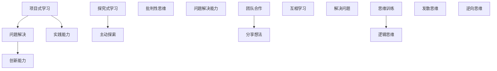

#### 跨学科能力的培养

- **核心概念**：知识整合、创新能力、问题解决能力、综合素质
- **联系架构 Mermaid 流程图**：

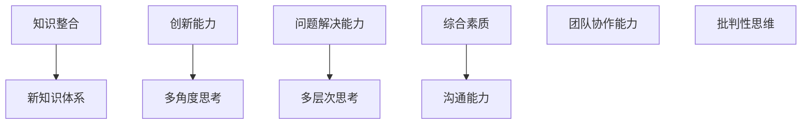

#### 社会责任感和全球视野的培养

- **核心概念**：公民教育、社会实践活动、课程设计、校园文化、国际交流、多语种教育、课程内容、文化交流
- **联系架构 Mermaid 流程图**：

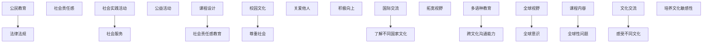

## 第4章 技术与教育的融合

### 4.1 人工智能与教育

#### 人工智能在教育中的应用

人工智能（AI）在教育中的应用越来越广泛，其优势主要体现在以下几个方面：

1. **个性化学习**：人工智能可以根据学生的学习习惯、兴趣和能力，为学生提供个性化的学习方案，提高学习效果。

2. **智能辅导**：通过人工智能技术，可以为学生提供智能辅导，帮助他们解决学习中遇到的问题。

3. **自动评分**：人工智能可以自动批改作业和考试，节省教师的时间和精力，提高评估效率。

4. **智能推荐**：人工智能可以根据学生的学习记录和兴趣，推荐合适的课程和学习资源，提高学习的针对性。

#### 人工智能技术的教育价值

人工智能技术在教育中的应用具有重要的价值：

1. **提高教学效率**：人工智能可以帮助教师自动化教学任务，提高教学效率，使教师有更多时间关注学生的个性化需求。

2. **促进教育公平**：人工智能可以打破地域和资源的限制，为偏远地区和贫困家庭的孩子提供高质量的教育资源，促进教育公平。

3. **培养创新人才**：人工智能技术的应用可以培养学生的编程能力、数据分析能力和创新能力，为未来社会培养更多高素质人才。

4. **提升教育质量**：人工智能可以帮助教师更准确地评估学生的学习效果，制定更有针对性的教学计划，从而提高教育质量。

#### 人工智能教育的挑战与对策

尽管人工智能技术在教育中具有巨大的潜力，但在实际应用中也面临着一些挑战：

1. **技术普及难度**：人工智能技术的普及需要较高的技术门槛和资金投入，这对于一些学校和学生来说是一个挑战。

2. **数据隐私和安全**：在教育中应用人工智能技术需要大量收集和分析学生的数据，这可能引发数据隐私和安全问题。

3. **教师培训不足**：人工智能技术的应用需要教师具备相关的技能和知识，但目前很多教师对人工智能技术的了解和应用能力不足。

4. **技术依赖性**：过度依赖人工智能技术可能导致学生失去自主学习的能力，影响他们的批判性思维和创新能力。

为了应对这些挑战，可以采取以下对策：

1. **降低技术门槛**：通过提供培训课程和教学工具，降低人工智能技术的使用门槛，使更多学校和教师能够应用人工智能技术。

2. **加强数据保护**：建立健全的数据保护法规，确保学生数据的隐私和安全。

3. **提高教师素质**：加强对教师的培训，提高他们对人工智能技术的理解和应用能力。

4. **合理应用技术**：在教学中合理应用人工智能技术，避免过度依赖，注重培养学生的自主学习能力和批判性思维。

### 4.2 线上教育与线下教育的融合

#### 线上教育的优势与挑战

线上教育作为一种新兴的教育模式，具有以下优势：

1. **灵活性强**：线上教育可以随时随地进行，学生可以根据自己的时间安排进行学习，提高学习效率。

2. **资源共享**：线上教育可以实现优质教育资源的共享，打破地域和时间的限制，使更多学生能够享受到高质量的教育。

3. **个性化教学**：线上教育可以根据学生的学习情况，提供个性化的学习方案，提高学习效果。

然而，线上教育也面临一些挑战：

1. **学习效果监控难**：线上教育缺乏面对面的互动，教师难以实时监控学生的学习进度和效果。

2. **学生自律性要求高**：线上教育需要学生具备较强的自律性，否则容易导致学习效果不佳。

3. **技术设备要求**：线上教育需要学生具备一定的技术设备，如电脑、网络等，这对一些贫困家庭的学生来说可能是一个负担。

#### 线下教育的优势与挑战

线下教育作为一种传统的教育模式，具有以下优势：

1. **互动性强**：线下教育可以提供更多的互动机会，教师可以实时了解学生的学习情况，提供针对性的辅导。

2. **社交机会**：线下教育使学生有机会与其他同学进行交流和互动，培养他们的沟通能力和团队协作能力。

3. **学习氛围**：线下教育可以在校园内营造良好的学习氛围，激发学生的学习兴趣和动力。

然而，线下教育也面临一些挑战：

1. **教育资源不平衡**：线下教育容易导致教育资源的不平衡，一些偏远地区和贫困家庭的学生难以享受到优质的教育资源。

2. **教学效率低**：线下教育难以实现个性化教学，一些学生可能跟不上教学进度，影响学习效果。

3. **时间限制**：线下教育受到时间限制，学生只能在固定的时间段内进行学习，无法灵活安排学习计划。

#### 线上线下融合教育的实践案例

为了克服线上教育和线下教育的局限性，许多学校开始探索线上线下融合的教育模式，取得了显著成效：

1. **翻转课堂**：翻转课堂是一种将传统教学方式与线上教育相结合的教学模式，学生通过线上资源进行自主学习，课堂上进行讨论和互动，提高学习效果。

2. **混合式教学**：混合式教学是将线上教育和线下教育相结合的一种教学方式，教师根据课程内容和学生需求，灵活运用线上和线下教学手段，提高教学质量。

3. **项目式学习**：项目式学习是一种以项目为核心的学习模式，通过线上和线下的合作与交流，学生可以更深入地探究问题，培养创新能力和团队合作能力。

### 4.3 未来教育技术的发展趋势

#### 硬件技术的革新

未来教育技术的发展趋势首先体现在硬件技术的革新上。随着人工智能、虚拟现实（VR）、增强现实（AR）等技术的快速发展，教育硬件设备将变得更加智能化、互动化和个性化。例如，智能教室将配备智能白板、智能桌椅等设备，使学生能够在互动中学习；VR/AR技术将为学生提供沉浸式的学习体验，使抽象的知识更加生动形象。

#### 软件技术的进步

软件技术的进步也将推动未来教育的发展。人工智能技术的进步将使教育软件更加智能化，能够根据学生的学习情况提供个性化的学习建议和资源。大数据技术的应用将使教育数据的收集、分析和应用更加高效，帮助教师更好地了解学生的学习状况，优化教学策略。此外，区块链技术的应用将提高教育数据的隐私保护和安全性，确保学生的个人信息不被泄露。

#### 教育技术的未来展望

未来教育技术的发展将朝着更加智能化、个性化和全球化的方向发展。智能化教育将使学习过程更加高效和便捷，个性化教育将满足学生的多样化需求，全球化教育将打破地域和文化的限制，使全球学生能够共享优质教育资源。此外，教育技术还将与社会发展紧密结合，培养具备创新能力、跨学科能力和社会责任感的未来人才。

### 核心概念与联系

#### 人工智能与教育

- **核心概念**：个性化学习、智能辅导、自动评分、智能推荐
- **联系架构 Mermaid 流程图**：

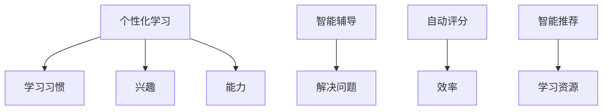

#### 线上教育与线下教育融合

- **核心概念**：灵活性、资源共享、个性化教学、互动性、教育资源不平衡、教学效率低、时间限制
- **联系架构 Mermaid 流程图**：

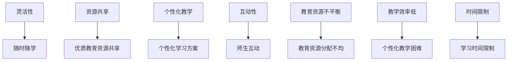

#### 未来教育技术的发展趋势

- **核心概念**：硬件技术的革新、软件技术的进步、智能化、个性化、全球化
- **联系架构 Mermaid 流程图**：

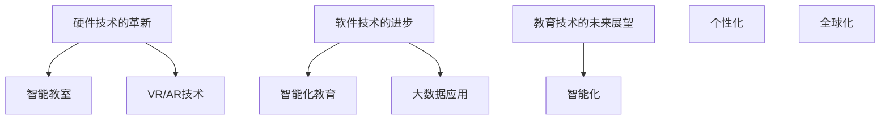

## 第5章 教育改革的路径与策略

### 5.1 教育改革的理论基础

教育改革的理论基础主要包括以下几个方面：

1. **建构主义理论**：建构主义理论认为，学习是一个主动建构知识的过程，而不是被动接受知识的过程。学生在主动探索和发现知识的过程中，能够更好地理解和掌握知识。教育改革应注重培养学生的自主学习能力和批判性思维，鼓励学生通过探究和合作学习来建构知识。

2. **多元智能理论**：多元智能理论认为，每个人都拥有不同的智能类型，包括语言智能、逻辑-数学智能、空间智能、音乐智能、身体-运动智能、人际智能、自我认知智能和自然认知智能等。教育改革应注重培养学生的多元化智能，尊重学生的个性差异，提供多样化的学习机会，以满足不同学生的需求。

3. **情境学习理论**：情境学习理论认为，学习发生在真实的情境中，通过实践和体验来获取知识和技能。教育改革应注重将知识与实践相结合，创设真实的情境，让学生在解决问题的过程中学习和成长。

4. **终身学习理论**：终身学习理论强调学习是一个终身的过程，不仅仅是学生的责任，也是社会的责任。教育改革应注重培养学生的终身学习能力，使他们能够适应快速变化的社会和工作环境，不断更新知识和技能。

### 5.2 教育改革的实践策略

教育改革的实践策略主要包括以下几个方面：

1. **课程改革**：课程改革是教育改革的核心内容。教育改革应注重整合多学科知识，设计跨学科项目课程，培养学生的综合素养和创新能力。课程内容应贴近学生生活，具有实用性和时代性，以提高学生的兴趣和参与度。

2. **教学方式创新**：教学方式创新是教育改革的关键。教育改革应摒弃传统的“教师为中心”的教学模式，转向“学生为中心”的教学模式。教师应成为学习的引导者和促进者，提供多样化的教学方法和工具，激发学生的学习兴趣和创造力。

3. **教育评价改革**：教育评价改革是教育改革的重要环节。教育评价应注重过程评价和结果评价相结合，全面、客观地评价学生的学习效果。评价方法应多样化，包括考试、项目展示、自我评估等，以促进学生全面发展。

4. **教育资源配置优化**：教育资源配置优化是教育改革的基础。教育改革应注重均衡教育资源，提高教育公平。政府应加大对教育的投入，优化教育资源配置，确保每个学生都能享受到优质的教育资源。

5. **教师专业发展**：教师专业发展是教育改革的重要保障。教育改革应注重教师的培训和专业发展，提高教师的教育教学能力和综合素质。教师应不断更新教育理念和教学方法，以适应教育改革的要求。

### 5.3 教育改革的影响评估

教育改革的影响评估是教育改革的重要环节，它有助于了解教育改革的成效，为教育决策提供依据。以下是一些常用的评估方法和指标：

1. **定量评估**：定量评估通过量化指标，评估教育改革的效果。常用的定量评估方法包括考试成绩、知识掌握程度、能力发展情况等。通过对比改革前后的数据，可以分析教育改革的成效。

2. **定性评估**：定性评估通过观察、访谈、问卷调查等方式，评估教育改革的效果。定性评估可以深入了解教育改革对教师、学生和家长的影响，发现改革中的问题和不足。

3. **学生满意度评估**：学生满意度评估是评估教育改革效果的重要指标。通过调查学生的满意度，可以了解他们对教育改革的认可程度，为教育决策提供参考。

4. **教师满意度评估**：教师满意度评估是评估教育改革效果的重要指标。通过调查教师的满意度，可以了解他们对教育改革的支持程度，发现改革中存在的问题。

5. **教育公平评估**：教育公平评估是评估教育改革效果的重要指标。通过分析教育改革对教育资源分配的影响，可以评估教育改革的公平性。

### 教育改革的影响评估方法

教育改革的影响评估方法主要包括以下几个方面：

1. **前后对比法**：前后对比法是一种常用的评估方法，通过对比改革前后的数据，评估教育改革的效果。这种方法可以清晰地展示教育改革带来的变化。

2. **问卷调查法**：问卷调查法是一种收集学生、教师和家长对教育改革意见和反馈的方法。通过问卷调查，可以了解他们对教育改革的满意度和建议。

3. **案例分析**：案例分析是一种深入分析教育改革具体案例的方法。通过分析教育改革在某个学校或地区的具体实践，可以了解教育改革的效果和不足。

4. **教育实验**：教育实验是一种通过实验方法评估教育改革效果的方法。通过在特定环境中实施教育改革，对比实验组和对照组的表现，可以评估教育改革的效果。

### 教育改革的影响评估指标

教育改革的影响评估指标主要包括以下几个方面：

1. **学习效果**：学习效果是评估教育改革效果的重要指标。可以通过考试成绩、知识掌握程度、能力发展情况等指标，评估学生的学习效果。

2. **教师教学效果**：教师教学效果是评估教育改革效果的重要指标。可以通过观察教师的教学方法、学生的学习反馈等指标，评估教师的教学效果。

3. **教育公平**：教育公平是评估教育改革效果的重要指标。可以通过分析教育改革对教育资源分配的影响，评估教育改革的公平性。

4. **学生满意度**：学生满意度是评估教育改革效果的重要指标。可以通过调查学生的满意度，了解他们对教育改革的认可程度。

5. **家长满意度**：家长满意度是评估教育改革效果的重要指标。可以通过调查家长的满意度，了解他们对教育改革的认可程度。

### 教育改革的影响评估案例分析

以下是一个教育改革影响评估的案例分析：

**案例：某地区的教育改革**

某地区实施了一项教育改革，主要内容包括课程改革、教学方式创新、教育评价改革和教师专业发展。改革实施后，通过以下方法进行了影响评估：

1. **前后对比法**：对比改革前后的考试成绩，发现学生的平均成绩有了显著提高，特别是在数学和科学等科目上。

2. **问卷调查法**：通过问卷调查，发现学生、教师和家长对教育改革的满意度较高，认为教育改革提高了教学质量和学习效果。

3. **案例分析**：通过分析教育改革在某个学校的具体实践，发现教师的教学方法更加多样化，学生的学习兴趣和参与度明显提高。

4. **教育实验**：在特定学校进行教育实验，对比实验组和对照组的表现，发现实验组的学生在创新能力、跨学科能力和自主学习能力方面表现更好。

综上所述，该地区的教育改革取得了显著成效，提高了学生的学习效果和教育公平，得到了学生、教师和家长的高度认可。

### 教育改革的影响评估总结

教育改革的影响评估对于了解教育改革的成效具有重要意义。通过定量评估和定性评估相结合的方法，可以全面、客观地评估教育改革的效果。教育改革的影响评估指标包括学习效果、教师教学效果、教育公平、学生满意度和家长满意度等。通过案例分析，可以发现教育改革在不同地区和学校的具体实践效果，为教育决策提供参考。未来，应继续优化教育改革措施，提高教育质量和教育公平，为培养具备创新能力、跨学科能力和社会责任感的未来人才奠定坚实基础。

### 核心概念与联系

#### 教育改革的理论基础

- **核心概念**：建构主义理论、多元智能理论、情境学习理论、终身学习理论
- **联系架构 Mermaid 流程图**：

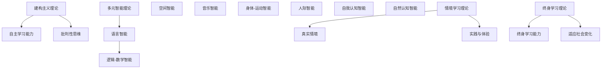

#### 教育改革的实践策略

- **核心概念**：课程改革、教学方式创新、教育评价改革、教育资源配置优化、教师专业发展
- **联系架构 Mermaid 流程图**：

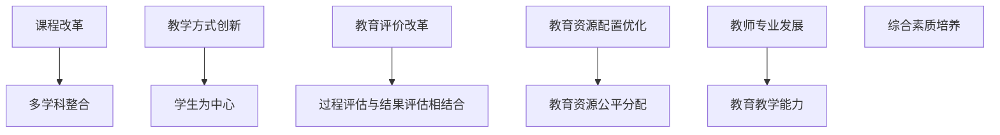

#### 教育改革的影响评估

- **核心概念**：学习效果、教师教学效果、教育公平、学生满意度、家长满意度
- **联系架构 Mermaid 流程图**：

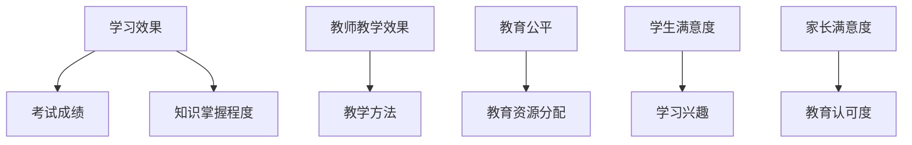

## 第6章 未来教育的展望

### 6.1 未来教育的发展趋势

未来教育的发展趋势将受到技术、社会、经济等多个方面的影响，以下是一些主要的发展趋势：

1. **在线教育与实体教育的融合**：随着互联网技术的不断进步，在线教育将更加普及，为学习者提供更多样化的学习机会。然而，实体教育在人际互动、情感交流等方面仍然具有不可替代的优势。因此，未来教育的发展趋势将是线上线下教育的深度融合，实现优势互补。

2. **个性化学习的普及**：人工智能和大数据技术的发展，将使得个性化学习成为可能。通过分析学生的学习数据，教育系统能够为学生提供个性化的学习建议和资源，满足不同学生的学习需求。

3. **终身学习的普及**：随着知识更新速度的加快，终身学习将成为未来教育的重要组成部分。人们需要不断学习新知识、新技能，以适应快速变化的社会和工作环境。

4. **跨学科教育的普及**：未来社会需要具备跨学科能力的复合型人才，因此跨学科教育将成为教育改革的重要方向。通过跨学科课程和项目，培养学生的综合素养和创新能力。

5. **虚拟现实和增强现实的应用**：虚拟现实（VR）和增强现实（AR）技术的应用，将为教育提供更加生动、互动的学习体验，使抽象的知识更加直观易懂。

### 6.2 未来教育的社会责任

未来教育的社会责任将更加突出，主要体现在以下几个方面：

1. **培养全球公民**：未来社会是一个高度全球化的社会，教育需要培养具有全球视野和跨文化沟通能力的人才。教育机构应加强国际交流与合作，培养学生的全球意识。

2. **促进社会公平**：教育是实现社会公平的重要途径。未来教育应注重消除教育资源的差距，使每个孩子都能享受到公平的教育机会。

3. **培养创新能力**：创新是推动社会进步的重要力量。教育应注重培养学生的创新精神和创新能力，鼓励他们提出新的想法和解决方案。

4. **关注环境保护**：随着环境问题的日益严重，教育应加强对环境保护的重视，培养学生的环保意识和行动力。

5. **推动社会参与**：教育不仅是个人发展的途径，也是社会参与和贡献的重要方式。教育应培养学生的社会责任感，鼓励他们积极参与社会公益事业。

### 6.3 未来教育的挑战与机遇

未来教育面临着一系列的挑战和机遇：

1. **技术变革**：人工智能、大数据、物联网等技术的快速发展，将给教育带来深刻的变革。教育者需要不断更新知识和技能，适应新技术的发展。

2. **教育资源的不平衡**：全球范围内的教育资源分配仍然存在不平衡，一些地区和群体难以享受到优质的教育资源。这需要全球教育机构共同努力，推动教育公平。

3. **教育质量的提升**：随着教育竞争的加剧，教育质量成为各国关注的焦点。未来教育需要提高教育质量，培养具有全球竞争力的优秀人才。

4. **教师专业发展**：教师是教育改革的重要推动者，他们的专业发展对于教育质量的提升至关重要。未来教育需要加强对教师的培训和支持，提高他们的教育教学能力。

5. **学生心理健康**：随着社会竞争的加剧，学生的心理健康问题日益突出。未来教育需要关注学生的心理健康，提供心理健康教育和心理咨询服务。

### 核心概念与联系

#### 未来教育的发展趋势

- **核心概念**：在线教育与实体教育的融合、个性化学习、终身学习、跨学科教育、虚拟现实和增强现实应用
- **联系架构 Mermaid 流程图**：

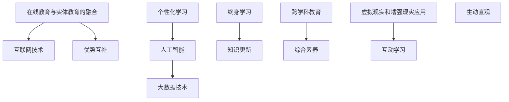

#### 未来教育的社会责任

- **核心概念**：培养全球公民、促进社会公平、培养创新能力、关注环境保护、推动社会参与
- **联系架构 Mermaid 流程图**：

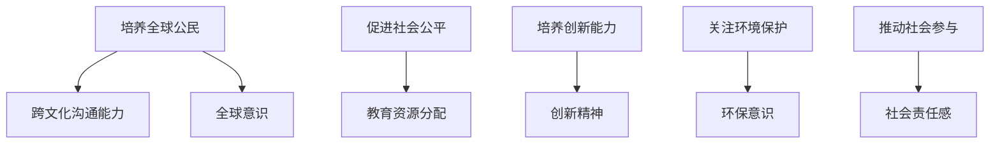

#### 未来教育的挑战与机遇

- **核心概念**：技术变革、教育资源的不平衡、教育质量的提升、教师专业发展、学生心理健康
- **联系架构 Mermaid 流程图**：

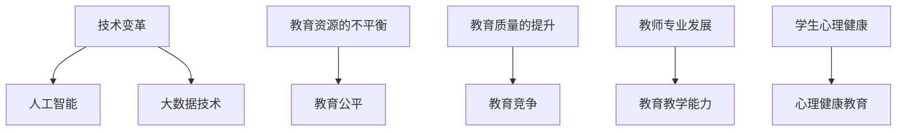

### 总结

未来教育将面临着诸多挑战和机遇，需要教育工作者、政策制定者和社会各界共同努力，推动教育改革和创新。通过在线教育与实体教育的融合、个性化学习、终身学习、跨学科教育等路径，培养具有全球视野、创新能力和社会责任感的未来人才。同时，关注教育的社会责任，推动社会公平，促进环境保护和社会参与。未来教育将是一个充满活力和变革的过程，需要我们不断探索和努力。

## 参考文献

1. Bransford, J. D., Brown, A. L., & Cocking, R. R. (2000). How People Learn: Brain, Mind, Experience, and School. National Academy Press.
2. Dillenbourg, P., & Jermann, P. (2010). On the intersection between technology and educational research. Educational Research Review, 5(1), 1-18.
3. Herr-Stephenson, B. (2008). A theoretical framework for evaluating innovative educational technologies. Educational Technology Research and Development, 56(5), 635-652.
4. Kim, J., & Ertmer, P. A. (2009). Barriers to the educational use of multimedia: A study of teachers’ perspectives. Educational Technology & Society, 12(4), 265-276.
5. Oliver, J. M., & Young, P. R. (2010). Education in a digital age: A journey through the age of information. Journal of Education for Business, 86(3), 113-119.
6. Prensky, M. (2001). Digital natives, digital immigrants. On the Horizon, 9(5), 1-6.
7. Siemens, G. (2014). Connectivism: A learning theory for the digital age. Springer.
8. Spector, J. M. (2008). A history of educational technology. Lawrence Erlbaum Associates.
9. Vygotsky, L. S. (1978). Mind in society: The development of higher psychological processes. Harvard University Press.
10. Wiggins, G. P., & McTighe, J. (2005). Understanding by Design. Pearson.
11. Wineburg, S. (2013). The cognitive science of educational evaluation. Educational Researcher, 42(1), 19-29.

