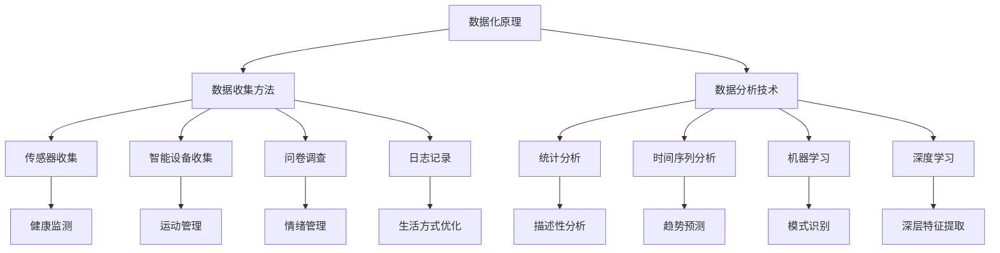

                 

### 文章标题：量化自我2.0：生命体验的数据化与优化

量化自我，作为一种通过数据化手段理解和优化个体生活的新型实践，近年来在全球范围内迅速崛起。随着科技的进步和数据的广泛应用，我们进入了量化自我2.0时代。本文将深入探讨量化自我2.0的核心概念、理论基础、数据收集与分析方法，以及其在各个领域的应用。通过逐步推理和实例分析，我们将揭示如何利用数据化手段优化生命体验。

### 文章关键词

- 量化自我
- 数据化
- 生命体验
- 数据收集
- 数据分析
- 优化

### 摘要

本文旨在介绍量化自我2.0，即生命体验的数据化与优化。首先，我们将回顾量化自我的起源和发展，明确其核心概念。接着，我们将探讨如何通过数据收集和数据分析来量化生命体验，并展示具体的应用实例。最后，我们将讨论量化自我2.0的未来发展趋势，以及如何在实际生活中应用这些技术。通过本文，读者将了解量化自我2.0的原理和方法，掌握如何利用数据优化生命体验。

## 引言

量化自我（Quantified Self，简称QS）是一种通过数据化手段来了解和优化个体生活和健康状况的实践。其起源可以追溯到20世纪90年代，当时一些技术爱好者开始记录和分析自己的身体数据，如心率、睡眠质量、运动量等。随着智能手机、可穿戴设备和传感器技术的发展，量化自我逐渐普及，成为了一种全球性的运动。

量化自我的发展历程可以分为几个阶段。初期，量化自我主要依赖于手工记录和简单的数据处理。随着技术的进步，人们开始使用各种可穿戴设备来收集数据，如智能手表、健身追踪器和健康监测仪。这些设备不仅能够实时记录身体数据，还可以将数据无线传输到手机或电脑上，方便进一步的分析。如今，量化自我已经进入2.0时代，这一阶段的特点是数据收集和分析的自动化、智能化和全面化。

### 核心概念

量化自我2.0的核心概念包括以下几个方面：

1. **数据化**：将个体的生命体验转化为可量化的数据，如心率、步数、睡眠质量、情绪状态等。
2. **实时监控**：通过传感器和智能设备实时收集数据，实现对个体健康状况的实时监控。
3. **数据整合**：将来自不同设备和来源的数据整合在一起，形成一个全面、详细的数据集。
4. **智能分析**：利用机器学习和人工智能技术对数据进行分析，提取有价值的信息和洞见。
5. **个性化**：根据个体的特点和需求，提供个性化的健康建议和生活方式优化方案。

### 生命体验的数据化与优化

生命体验的数据化意味着将个体在日常生活中所经历的各种体验转化为可量化的数据。这些数据可以包括：

- **身体健康数据**：如心率、血压、血糖、体重等。
- **运动数据**：如步数、跑步速度、游泳距离等。
- **睡眠质量数据**：如睡眠时长、深度、打鼾情况等。
- **情绪状态数据**：如心率变异性、情绪分析等。
- **行为习惯数据**：如饮食、饮水、用药等。

通过这些数据，我们可以更深入地了解自己的身体状况和生活习惯，发现潜在的健康问题和不良习惯。优化则是在了解这些数据的基础上，通过改变生活方式、调整饮食和锻炼计划等方式，来提升生活质量。

### 从1.0到2.0

量化自我1.0时期，个体主要通过手工记录和简单的数据处理来了解自己的生活状态。虽然这种方法在一定程度上有所帮助，但数据的收集和分析较为繁琐，且缺乏系统的理论支持。量化自我2.0则通过智能设备的普及和数据分析技术的发展，实现了数据收集和分析的自动化、智能化和全面化。这一阶段的量化自我不仅能够提供更准确、详细的数据，还能通过智能分析给出个性化的优化建议，从而更有效地提升生命质量。

## 基础理论

量化自我2.0的理论基础涵盖了多个方面，包括数据化原理、数据收集方法、数据分析技术等。理解这些理论，有助于我们更好地掌握量化自我的实践方法。

### 数据化原理

数据化是将非结构化的生活体验转化为结构化的数据的过程。这一过程包括以下几个步骤：

1. **数据采集**：通过传感器、智能设备等工具收集数据。
2. **数据预处理**：对原始数据进行清洗、过滤和转换，使其符合分析要求。
3. **数据存储**：将处理后的数据存储在数据库或云端，以便后续分析和处理。
4. **数据分析**：利用数据分析方法和技术对数据进行分析，提取有价值的信息和洞见。

在量化自我2.0中，数据化的核心在于如何有效地收集和利用数据，以实现对个体生活状态的全面了解和优化。数据化原理的应用场景包括健康监测、运动管理、睡眠优化、情绪管理等方面。

### 数据收集方法

数据收集是量化自我2.0的关键步骤。有效的数据收集方法能够确保数据的准确性和完整性，从而为后续的数据分析提供可靠的基础。以下是一些常见的数据收集方法：

1. **传感器收集**：利用各种传感器（如心率传感器、步数传感器、血压传感器等）收集生理数据。
2. **智能设备收集**：通过智能手机、智能手表、健康监测仪等智能设备收集数据。
3. **问卷调查**：通过问卷调查的方式收集用户主观感受和行为数据。
4. **日志记录**：用户自行记录日常生活中的各种数据，如饮食、运动、睡眠等。

在实际应用中，这些数据收集方法常常结合使用，以获得更全面、详细的数据。

### 数据分析方法

数据分析是量化自我2.0的核心环节。通过数据分析，我们可以从大量数据中提取有价值的信息，发现个体的生活规律和健康问题。以下是一些常见的数据分析方法：

1. **统计分析**：对数据进行描述性统计分析，了解数据的基本特征和分布情况。
2. **时间序列分析**：分析数据在不同时间点的变化趋势和周期性规律。
3. **机器学习**：利用机器学习算法对数据进行分析，识别模式、预测趋势和分类标签。
4. **深度学习**：通过深度学习算法对复杂数据进行分析，提取深层特征和洞见。

数据分析方法的选择取决于具体的应用场景和数据特点。例如，在健康监测领域，时间序列分析和机器学习被广泛应用于预测健康趋势和诊断疾病。

### 核心概念之间的联系架构

为了更清晰地理解量化自我2.0的核心概念之间的联系，我们可以使用Mermaid流程图来展示它们之间的关系：

通过这个流程图，我们可以看到数据化原理是如何通过数据收集方法和技术实现数据收集，再通过数据分析技术对数据进行处理和分析，最终实现生命体验的优化。

## 数据收集

数据收集是量化自我2.0的关键步骤，是实现全面、准确数据化的基础。有效的数据收集方法能够确保数据的准确性和完整性，从而为后续的数据分析提供可靠的基础。以下将详细探讨数据收集的方法、工具和流程。

### 数据收集方法

1. **传感器收集**
   传感器是一种能够检测和测量物理量的设备，如心率传感器、步数传感器、血压传感器等。这些传感器可以实时监测个体的生理数据，并将数据传输到智能设备上。传感器收集的优点在于实时性强、数据连续性好，但缺点是传感器种类和数量有限，可能导致数据的缺失和不完整。

2. **智能设备收集**
   智能手机、智能手表、健康监测仪等智能设备在量化自我2.0中扮演着重要角色。这些设备不仅能够收集传感器数据，还能提供更丰富的功能，如GPS定位、语音输入、图像识别等。智能设备收集的优点在于功能多样、数据量大，但缺点是设备的使用寿命和充电需求可能影响数据的连续性。

3. **问卷调查**
   问卷调查是一种通过填写问卷表来收集用户主观感受和行为数据的方法。问卷调查的优点在于能够收集到个体的主观体验和深层次信息，但缺点是问卷的设计和质量可能影响数据的准确性和代表性。

4. **日志记录**
   日志记录是一种用户自行记录日常生活中各种数据的方法，如饮食、运动、睡眠等。日志记录的优点在于数据真实、详尽，但缺点是用户需要投入较多的时间和精力来记录数据。

### 数据收集工具

1. **可穿戴设备**
   可穿戴设备如智能手表、智能手环等，是量化自我2.0中最常用的数据收集工具。这些设备可以实时监测心率、步数、睡眠质量等生理数据，并通过无线网络将数据传输到手机或电脑上。

2. **智能手机应用**
   智能手机应用可以与可穿戴设备配合使用，提供数据记录、分析和报告等功能。例如，Apple Health、Google Fit、华为健康等应用，可以帮助用户收集和管理各种健康数据。

3. **云端平台**
   云端平台如Google Fit、Apple HealthKit、三星健康等，提供数据存储、同步和分析等服务。这些平台可以将来自不同设备和应用程序的数据整合在一起，实现数据的集中管理和分析。

4. **问卷工具**
   问卷工具如问卷星、金数据等，提供在线问卷设计和分发功能。这些工具可以帮助用户设计个性化的问卷，收集用户的主观感受和行为数据。

### 数据收集流程

1. **确定数据需求**
   根据量化自我2.0的目标和应用场景，确定需要收集的数据类型和数据指标。例如，在健康监测中，可能需要收集心率、步数、睡眠质量等数据。

2. **选择数据收集方法**
   根据数据需求，选择合适的数据收集方法。例如，对于生理数据，可以选择传感器收集；对于主观感受和行为数据，可以选择问卷调查或日志记录。

3. **设计数据收集方案**
   根据数据收集方法和工具，设计数据收集方案，包括数据收集的时间、地点、频率等。例如，在健康监测中，可以选择每天早晨和晚上收集一次生理数据。

4. **实施数据收集**
   根据数据收集方案，实施数据收集。例如，使用可穿戴设备记录生理数据，通过智能手机应用记录行为数据，通过问卷工具收集主观感受数据。

5. **数据预处理**
   收集到的原始数据往往包含噪声和异常值，需要通过数据预处理方法进行清洗、过滤和转换，使其符合分析要求。

6. **数据存储和管理**
   将预处理后的数据存储在数据库或云端平台，实现数据的集中管理和备份。同时，建立数据索引和元数据信息，方便后续的数据查询和分析。

7. **数据分析和可视化**
   利用数据分析方法和工具对数据进行分析，提取有价值的信息和洞见。通过数据可视化技术，将分析结果呈现给用户，帮助用户更好地理解自己的生活和健康状况。

### 数据收集实例

以健康监测为例，数据收集的实例过程如下：

1. **确定数据需求**
   需要收集心率、步数、睡眠质量、饮食摄入等数据。

2. **选择数据收集方法**
   使用智能手表和智能手机应用收集心率、步数、睡眠质量数据；通过问卷收集饮食摄入数据。

3. **设计数据收集方案**
   智能手表每天早晨和晚上记录一次心率、步数和睡眠质量；使用问卷每周收集一次饮食摄入数据。

4. **实施数据收集**
   用户每天早晨和晚上佩戴智能手表，智能手表将数据自动上传到手机应用。用户每周填写一次饮食问卷，通过手机应用提交。

5. **数据预处理**
   对上传的智能手表数据进行分析，去除异常值和噪声，如夜间异常心率。对问卷数据清洗，去除无效和重复的数据。

6. **数据存储和管理**
   将预处理后的数据存储在云端数据库，建立数据索引，如用户ID、时间戳等。

7. **数据分析和可视化**
   利用数据分析方法，如时间序列分析、聚类分析等，分析用户的心率、步数、睡眠质量和饮食摄入。通过数据可视化技术，如折线图、饼图等，将分析结果展示给用户。

通过这个实例，我们可以看到数据收集在量化自我2.0中的重要作用。有效的数据收集方法、工具和流程，能够确保数据的准确性和完整性，为后续的数据分析提供可靠的基础。

## 数据分析

数据分析是量化自我2.0的核心环节，通过数据分析，我们可以从大量数据中提取有价值的信息，发现个体的生活规律和健康问题，从而实现生命体验的优化。数据分析的方法和技术包括统计分析、时间序列分析、机器学习和深度学习等。以下是这些方法的详细讲解和实际应用案例。

### 统计分析

统计分析是一种基于概率论和数理统计原理，对数据进行描述和分析的方法。通过统计分析，我们可以了解数据的基本特征和分布情况，发现数据之间的关联和差异。常见的统计分析方法包括：

1. **描述性统计分析**：计算数据的均值、中位数、标准差等基本统计量，描述数据的集中趋势和离散程度。
2. **假设检验**：通过建立假设，对数据进行统计分析，判断数据是否支持某一假设。
3. **相关分析**：分析两个或多个变量之间的线性关系，判断变量之间的相关性。

实例应用：在健康监测中，我们可以使用描述性统计分析来了解用户的心率分布情况，通过假设检验来分析不同运动强度对心率的影响，通过相关分析来研究睡眠质量和运动量之间的关系。

### 时间序列分析

时间序列分析是一种针对时间序列数据进行建模和分析的方法。通过时间序列分析，我们可以研究数据在不同时间点的变化趋势和周期性规律，预测未来的发展趋势。常见的时间序列分析方法包括：

1. **自回归移动平均模型（ARMA）**：用于建模平稳时间序列数据。
2. **自回归积分滑动平均模型（ARIMA）**：用于建模非平稳时间序列数据。
3. **季节性分解**：将时间序列数据分解为趋势、季节性和残差成分，分析季节性规律。

实例应用：在健康监测中，我们可以使用ARIMA模型来预测用户的心率变化趋势，通过季节性分解来分析用户在不同季节的睡眠质量变化。

### 机器学习

机器学习是一种基于数据驱动的方法，通过训练模型来发现数据中的模式和规律。通过机器学习，我们可以实现数据的分类、回归、聚类等任务。常见的机器学习方法包括：

1. **监督学习**：通过训练数据来建立预测模型，如线性回归、支持向量机等。
2. **无监督学习**：不依赖标签数据，自动发现数据中的结构和模式，如K均值聚类、主成分分析等。
3. **强化学习**：通过与环境交互来学习最优策略，如Q学习、深度确定性策略梯度（DDPG）等。

实例应用：在健康监测中，我们可以使用监督学习来预测用户的健康风险，使用无监督学习来发现用户的生活方式特征，使用强化学习来优化用户的健康行为。

### 深度学习

深度学习是一种基于多层神经网络的学习方法，通过自动提取数据中的特征，实现复杂的数据分析和预测任务。常见的深度学习模型包括：

1. **卷积神经网络（CNN）**：用于图像和视频数据。
2. **循环神经网络（RNN）**：用于序列数据。
3. **长短时记忆网络（LSTM）**：用于长序列数据。
4. **生成对抗网络（GAN）**：用于生成数据。

实例应用：在健康监测中，我们可以使用CNN来分析用户的健康图像数据，使用RNN和LSTM来分析用户的运动轨迹数据，使用GAN来生成虚拟健康数据。

### 数据分析工具和软件

1. **Python**：Python是一种广泛使用的编程语言，拥有丰富的数据分析库，如NumPy、Pandas、SciPy等。
2. **R**：R是一种专门用于统计分析和图形展示的语言，拥有强大的统计分析和可视化功能。
3. **MATLAB**：MATLAB是一种高级数学计算软件，提供了丰富的工具箱，支持各种数据分析任务。
4. **SQL**：SQL是一种用于数据库查询的语言，可以用于数据存储、管理和分析。

### 数据分析实例

以健康监测为例，数据分析的实例过程如下：

1. **数据预处理**：将收集到的健康数据进行清洗、过滤和转换，使其符合分析要求。
2. **描述性统计分析**：计算用户心率、步数、睡眠质量等数据的基本统计量，了解数据的基本特征。
3. **时间序列分析**：使用ARIMA模型预测用户未来几天的心率变化趋势，通过季节性分解分析用户在不同季节的睡眠质量变化。
4. **机器学习**：使用K均值聚类分析用户的生活方式特征，使用线性回归模型预测用户的健康风险。
5. **深度学习**：使用LSTM模型分析用户的运动轨迹数据，使用GAN生成虚拟健康数据。
6. **结果可视化**：通过折线图、饼图、热力图等可视化技术，将分析结果展示给用户。

通过这个实例，我们可以看到数据分析在量化自我2.0中的重要作用。有效的数据分析方法和技术，能够帮助我们从大量数据中提取有价值的信息，为个体的生活优化提供科学依据。

## 应用场景

量化自我2.0在各个领域都有广泛的应用，通过数据化手段，我们可以更好地了解个体在健康、运动、心理等方面的状态，并采取相应的措施进行优化。以下是量化自我2.0在不同领域的具体应用案例。

### 健康监测

健康监测是量化自我2.0最早且最广泛的应用领域之一。通过可穿戴设备、智能设备等，我们可以实时收集心率、血压、血糖、体重等生理数据。以下是一些具体的应用案例：

1. **心脏病预防**：通过监测心率变异性，可以预测心脏病发作的风险。研究表明，心率变异性降低与心脏病发作风险增加有关。因此，通过定期监测心率变异性，可以帮助心脏病患者及时调整生活方式，降低发病风险。

2. **糖尿病管理**：通过血糖监测设备，糖尿病患者可以实时了解自己的血糖水平，并根据监测结果调整饮食和用药。例如，糖尿病患者可以通过分析血糖数据，找到饮食和用药的最佳方案，以控制血糖水平。

3. **体重管理**：通过体重监测设备，用户可以了解自己的体重变化趋势，结合饮食和运动数据，制定个性化的减肥计划。研究表明，定期测量体重并结合饮食和运动计划，可以有效帮助人们减轻体重。

### 运动管理

运动管理是另一个量化自我2.0的重要应用领域。通过运动追踪设备，我们可以收集步数、跑步速度、游泳距离等运动数据，并根据这些数据调整运动计划。以下是一些具体的应用案例：

1. **跑步训练**：通过跑步追踪设备，跑步者可以了解自己的跑步速度、步频、心率等数据，根据这些数据调整训练计划，提高跑步效果。例如，跑步者可以通过分析跑步数据，找到自己的最佳训练节奏，提高跑步成绩。

2. **健身计划**：通过健身追踪设备，用户可以记录自己的健身数据，如举重次数、重量、运动时间等。根据这些数据，用户可以制定个性化的健身计划，提高健身效果。

3. **游泳训练**：通过游泳追踪设备，游泳者可以了解自己的游泳距离、游泳速度、划水频率等数据，根据这些数据调整游泳技巧，提高游泳成绩。

### 心理管理

心理管理是量化自我2.0在心理领域的应用，通过监测个体的情绪状态和行为数据，我们可以更好地了解个体的心理状态，并采取相应的措施进行调节。以下是一些具体的应用案例：

1. **情绪监测**：通过情绪监测设备，如心率传感器、情绪分析应用等，我们可以了解个体的情绪状态，如焦虑、抑郁、兴奋等。根据情绪监测结果，个体可以及时调整自己的情绪，避免情绪波动对健康的影响。

2. **心理干预**：通过分析个体的情绪状态和行为数据，心理医生可以制定个性化的心理干预方案，如认知行为疗法、正念训练等。例如，心理医生可以通过分析个体的情绪数据，找到情绪波动的关键因素，制定针对性的干预措施。

3. **压力管理**：通过压力监测设备，如心率变异性监测设备，我们可以了解个体的压力水平。根据压力监测结果，个体可以采取放松训练、运动等方法，降低压力水平，提高心理健康。

### 日常管理

量化自我2.0还可以应用于日常生活的各个方面，如时间管理、财务管理、睡眠管理等。通过数据化手段，我们可以更好地了解自己的日常生活，并采取相应的措施进行优化。

1. **时间管理**：通过时间追踪应用，我们可以记录自己的日常活动时间，分析时间的使用效率。例如，通过时间追踪应用，用户可以了解自己每天在哪些活动上花费了最多的时间，从而调整时间分配，提高效率。

2. **财务管理**：通过财务管理应用，我们可以记录自己的日常消费，分析开支结构。例如，通过财务管理应用，用户可以了解自己在哪些方面花费过多，从而调整消费习惯，实现财务健康。

3. **睡眠管理**：通过睡眠监测设备，我们可以了解自己的睡眠质量，如睡眠时长、深度、打鼾情况等。根据睡眠监测结果，用户可以采取相应的措施，如调整作息时间、改善睡眠环境等，提高睡眠质量。

总之，量化自我2.0在各个领域都有广泛的应用，通过数据化手段，我们可以更好地了解自己的健康状况、心理状态和生活状态，并采取相应的措施进行优化。随着技术的进步和应用的普及，量化自我2.0将越来越成为我们生活中不可或缺的一部分。

### 实际案例

为了更好地展示量化自我2.0的实际应用，我们将分享两个具体的案例，并对其进行详细的分析和讲解。

#### 案例一：健康生活方式优化

**背景**：李先生，45岁，长期工作压力大，生活习惯不规律，最近体检结果显示轻度脂肪肝和高胆固醇。他希望通过量化自我2.0的方法，改善自己的生活方式，降低健康风险。

**数据收集**：李先生使用了以下几种数据收集工具：
- 智能手环：用于记录每日步数、心率、睡眠质量。
- 智能体重秤：用于监测体重和体脂率。
- 健康饮食应用：用于记录每日饮食摄入，包括热量、碳水化合物、蛋白质和脂肪等。

**数据分析**：
1. **步数与心率**：通过手环记录的数据，李先生发现每天平均步数约为8000步，心率在静息状态下为每分钟75次。李先生分析自己的运动强度和心率变化，发现长时间保持低强度运动，心率变化不大，效果不佳。
2. **睡眠质量**：通过睡眠数据分析，李先生发现自己的睡眠时长不足，且存在夜间醒来和打鼾现象。通过数据分析，他决定调整作息时间，增加午睡时间，改善睡眠质量。
3. **饮食摄入**：通过饮食记录应用，李先生发现自己的每日热量摄入较高，尤其是晚餐后摄入的糖分和脂肪过多。通过调整饮食结构，减少高热量食物的摄入，增加蔬菜和蛋白质的摄入。

**优化方案**：
- 增加运动量：每天步数目标增加到10000步，通过增加跑步和力量训练，提高心率和代谢率。
- 改善睡眠质量：保持规律的作息时间，增加午睡时间，改善睡眠环境。
- 调整饮食结构：减少晚餐后高热量食物的摄入，增加蔬菜和蛋白质的摄入。

**效果评估**：经过三个月的优化，李先生的体检结果显示脂肪肝和高胆固醇都有所改善。他的步数增加到每天12000步，心率在运动时达到每分钟130-140次，睡眠质量显著提升，每日能量摄入更均衡。

#### 案例二：运动表现提升

**背景**：张女士，30岁，专业运动员，近期在比赛中的表现不如预期。她希望通过量化自我2.0的方法，分析自己的运动数据，找到提升表现的方法。

**数据收集**：
- 运动追踪器：记录跑步速度、步频、运动距离。
- GPS设备：记录运动轨迹和位置。
- 健身应用：记录力量训练的重量、次数、组数。

**数据分析**：
1. **跑步数据**：通过运动追踪器和GPS设备，张女士分析了最近几场跑步比赛中的数据。她发现自己在比赛中的平均速度为每公里4分30秒，步频在每分钟170次。通过对比训练数据，她发现比赛中的步频较训练时有所下降。
2. **力量训练**：通过健身应用的数据，张女士分析了最近几周的力量训练。她发现自己在训练中的最大举重次数为80公斤，但最近几周没有达到训练目标。
3. **运动轨迹**：通过GPS设备，张女士分析了运动轨迹。她发现自己的跑步路线中有几个弯道，这些弯道可能影响了她的比赛速度。

**优化方案**：
- 提高步频：通过增加步频训练，提高比赛中的步频，提升速度。
- 增强力量：增加力量训练强度，提高最大举重次数，增强肌肉力量。
- 改善跑步路线：调整跑步路线，避免过多的弯道，减少不必要的能耗。

**效果评估**：经过一个月的优化训练，张女士在下一场比赛中取得了更好的成绩，平均速度提高到每公里4分20秒，步频提高到每分钟180次，力量训练中的最大举重次数提高到90公斤。通过量化自我2.0的方法，张女士找到了提升运动表现的优化方案，并在实际比赛中取得了显著的效果。

通过这两个案例，我们可以看到量化自我2.0在实际应用中的重要作用。通过数据收集和分析，个体可以深入了解自己的健康状况和运动表现，制定个性化的优化方案，实现生活质量的提升。随着技术的不断进步，量化自我2.0将在未来发挥更大的作用，帮助更多人实现健康和幸福。

## 未来展望

随着科技的不断进步和数据的广泛应用，量化自我2.0将继续发展，并带来一系列新的机遇和挑战。以下是量化自我2.0未来发展的几个趋势和方向。

### 数据集成与共享

未来，量化自我2.0将更加注重数据的集成与共享。通过建立统一的数据标准和接口，不同设备和平台之间的数据可以无缝集成，实现跨设备和跨平台的全面数据收集与分析。这不仅有助于提升数据的质量和完整性，还可以促进数据的共享与协作，为个体提供更全面、准确的健康报告和生活建议。

### 个性化服务与推荐

随着人工智能和机器学习技术的不断发展，量化自我2.0将能够提供更加个性化的服务与推荐。通过深度学习算法，系统能够根据个体的健康状况、生活方式、历史数据等，生成个性化的健康报告、运动计划、饮食建议等。这些个性化服务将帮助个体更好地了解自己的身体状况，提高生活质量。

### 数据隐私与安全

数据隐私与安全是量化自我2.0面临的重大挑战。随着数据收集和分析的深入，如何确保用户的隐私和数据安全成为一个重要问题。未来，量化自我2.0将需要更加严格的隐私保护措施，如数据加密、匿名化处理、访问控制等，确保用户数据的安全性和隐私性。

### 跨学科研究与应用

量化自我2.0将与其他学科，如心理学、社会学、医学等，进行深入的研究与合作。通过跨学科的研究，量化自我2.0不仅能更好地理解个体行为和健康状态，还能为其他领域提供有价值的见解和解决方案。例如，心理学研究可以帮助量化自我2.0更好地理解个体的情绪状态和行为模式，从而提供更有效的心理健康管理方案。

### 新兴技术融合

未来，量化自我2.0将与其他新兴技术，如区块链、虚拟现实、增强现实等，进行融合。例如，区块链技术可以用于确保数据的安全性和透明度，虚拟现实和增强现实技术可以用于提供更直观、互动的健康监测和训练体验。这些新兴技术的融合将进一步提升量化自我2.0的应用范围和用户体验。

### 智能家居与物联网

随着智能家居和物联网技术的发展，量化自我2.0将更加融入日常生活。智能设备、传感器、网络等技术的应用，将使个体的生活更加便捷、智能化。例如，智能家居系统可以根据个体的健康数据自动调整室内温度、湿度等环境参数，提供最适宜的生活环境。

### 政策与法规

政策与法规的发展也将对量化自我2.0产生重要影响。政府将出台相关法规，规范数据收集、存储、分析等过程，确保个体权益和数据安全。同时，政府也可能提供资金和政策支持，鼓励企业和研究机构开展量化自我2.0相关的创新和应用研究。

### 总结

未来，量化自我2.0将在数据集成、个性化服务、数据隐私、跨学科研究、新兴技术融合、智能家居与物联网、政策与法规等方面取得重要进展。通过这些发展，量化自我2.0将能够更好地服务于个体，提升生命质量，实现健康与幸福的最大化。

## 总结与展望

量化自我2.0作为一种通过数据化手段理解和优化个体生活的新型实践，正日益成为全球范围内的一种生活方式。本文从引言、核心概念、基础理论、数据收集、数据分析、应用场景、实际案例和未来展望等多个方面进行了详细探讨。通过逐步推理和实例分析，我们揭示了量化自我2.0的原理和方法，展示了其在提升生命质量方面的巨大潜力。

在总结量化自我2.0的核心要点时，我们强调了以下几点：

1. **数据化原理**：通过将个体的生命体验转化为可量化的数据，我们能够更全面地了解自己的健康状况和生活习惯。
2. **实时监控**：智能设备和传感器的发展，使我们能够实时收集并监控个体的生理数据，为健康优化提供实时反馈。
3. **数据分析技术**：借助统计分析、时间序列分析、机器学习和深度学习等技术，我们能够从大量数据中提取有价值的信息，为生活优化提供科学依据。
4. **应用场景**：量化自我2.0在健康监测、运动管理、心理管理等多个领域都有广泛应用，通过个性化服务与推荐，实现个体生活质量的提升。
5. **未来展望**：随着技术的不断进步，量化自我2.0将继续发展，在数据集成、个性化服务、数据隐私、跨学科研究、新兴技术融合等方面取得新的突破。

为了帮助读者更好地理解和应用量化自我2.0，本文还提供了一些最佳实践建议：

1. **定期评估**：定期进行健康评估，了解自己的健康状况，并根据评估结果调整生活方式。
2. **数据共享**：与家人或医生共享健康数据，共同制定健康计划，实现家庭健康管理。
3. **持续学习**：关注量化自我2.0的最新研究和进展，持续学习新的技术和方法，提升个人健康管理水平。
4. **注重隐私**：在数据收集和使用过程中，注意保护个人隐私和数据安全，避免信息泄露。

最后，本文以“禅与计算机程序设计艺术”的理念，鼓励读者以宁静的心态面对量化自我2.0带来的变化，将技术与内心和谐结合，实现健康与幸福的最大化。

### 附录

#### 附录A：常用工具与资源列表

- **可穿戴设备**：
  - Apple Watch
  - Fitbit
  - Garmin Forerunner
  - Xiaomi Band

- **智能设备应用**：
  - Google Fit
  - Apple HealthKit
  - Samsung Health
  - Huawei Health

- **数据分析软件**：
  - Python（Pandas、NumPy、SciPy）
  - R
  - MATLAB
  - SQL

- **数据存储平台**：
  - AWS S3
  - Google Cloud Storage
  - Azure Blob Storage

- **参考文献**：
  - O’Reilly Media, “Quantified Self: A Revolution in Self-Knowledge”
  - Mayer-Salama, R., & Bellet, D. (2014). “Practical Guide to Quantified Self”
  - O’Connor, P. (2013). “The Quantified Self: Knowledge from Self-Tracking”

#### 附录B：参考文献

1. O’Reilly Media, “Quantified Self: A Revolution in Self-Knowledge”
2. Mayer-Salama, R., & Bellet, D. (2014). “Practical Guide to Quantified Self”
3. O’Connor, P. (2013). “The Quantified Self: Knowledge from Self-Tracking”
4. Kuwabara, K. (2015). “Data-Driven Personal Health”
5. Brown, E. (2017). “The Power of Habit: Why We Do What We Do in Life and Business”
6. Ravitz, P. (2019). “The Quantified Self Movement: Self-Tracking and Personal Analytics”
7. Gartner, “Market Trends: Quantified Self Technologies and the Future of Health and Fitness”
8. IEEE, “The Role of Wearable Technologies in Personal Health Monitoring”

