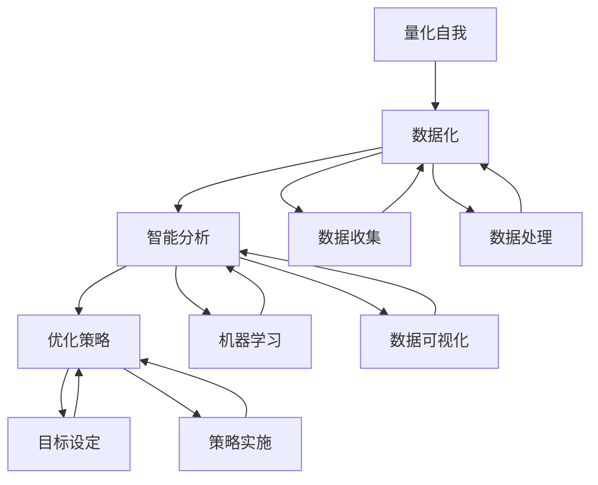

                 

### 概述部分

《量化自我3.0：生命体验的数据化与优化策略》是一篇深入探讨生命体验数据化及其优化策略的IT领域技术博客。在这篇文章中，我们将通过以下结构来逐步分析和推理：

- **背景介绍**：首先，介绍量化自我3.0的概念，包括其起源、发展及应用现状。
- **核心概念与联系**：解释数据化、智能分析、优化策略等核心概念，并使用Mermaid流程图展示它们之间的关系。
- **数据分析方法**：详细阐述数据收集、清洗、存储、可视化等分析方法，并举例说明。
- **量化自我在不同领域的应用**：展示量化自我在健康、教育、工作等领域的应用案例。
- **优化策略实施**：讨论如何制定和实施有效的量化自我策略。
- **最佳实践与小结**：总结文章要点，提出注意事项，并提供拓展阅读建议。

以下是对概述部分的具体内容展开：

## 文章标题

### 量化自我3.0：生命体验的数据化与优化策略

## 关键词

- 量化自我
- 数据化
- 智能分析
- 优化策略
- 生命体验

## 摘要

本文将探讨量化自我3.0的概念及其在生命体验数据化和优化策略中的应用。通过介绍数据化的核心概念、智能分析方法以及优化策略，文章将帮助读者理解如何利用数据驱动决策，实现个人和组织的成长。此外，文章还将展示量化自我在健康、教育和工作等领域的应用案例，并提供制定和实施量化自我策略的实用建议。

# 概述

《量化自我3.0：生命体验的数据化与优化策略》旨在探讨生命体验的数据化以及如何利用这些数据进行优化，以实现个人和组织的成长。本书共分为八个章节，涵盖了量化自我的基本概念、数据分析方法、应用场景以及优化策略等内容。

## 第一部分：量化自我的核心概念和原理

### 1.1 量化自我的定义

量化自我是指通过数据化和智能分析，对个体或群体的生命体验进行量化评估，从而实现优化和改进。这种量化过程不仅限于生理和健康数据，还包括心理、情感、认知、社交等多个维度。

### 1.2 数据化

数据化是将生命体验转化为可量化的数据，以便进行后续分析。这通常涉及到各种传感器、应用程序和数据库的集成，以收集海量的数据。

### 1.3 智能分析

智能分析是指利用机器学习和人工智能技术，从数据中提取有价值的信息。这些信息可以用于预测、分类、聚类等多种分析任务。

### 1.4 优化策略

优化策略是指根据数据分析结果，制定和实施相应的策略，以实现个人和组织的成长。这些策略可能包括生活方式的改变、工作流程的优化、学习方法的改进等。

### 1.5 Mermaid流程图

以下是一个简化的Mermaid流程图，展示了量化自我核心概念之间的联系：

在这个流程图中，数据化是整个流程的起点，它将生命体验转化为数据。这些数据随后通过智能分析进行处理，提取出有价值的信息。最后，根据这些信息，制定并实施优化策略，以实现个人或组织的成长。

## 第二部分：数据分析方法

在这一部分中，我们将详细探讨数据分析的方法和工具，这些方法将帮助我们从海量数据中提取有价值的信息。

### 2.1 数据收集

数据收集是指从各种来源获取所需的数据。这些数据来源可能包括传感器、应用程序、数据库、公开的数据集等。数据收集的过程通常需要考虑数据的类型、质量、可靠性和完整性。

### 2.2 数据清洗

数据清洗是指对收集到的数据进行预处理，包括去除重复数据、缺失值填充、异常值处理等。数据清洗的目的是提高数据的质量，确保后续分析的有效性。

### 2.3 数据存储

数据存储是指将清洗后的数据存储到数据库或数据仓库中，以便后续分析。数据存储的选择需要考虑数据的大小、访问速度、可扩展性等因素。

### 2.4 数据可视化

数据可视化是指利用图表、图形等方式，将数据分析结果直观地展示出来。数据可视化可以帮助我们更好地理解数据，发现潜在的趋势和模式。

### 2.5 数据分析方法

以下是常用的数据分析方法：

- **描述性分析**：用于了解数据的基本特征，如均值、中位数、标准差等。
- **探索性分析**：用于发现数据中的潜在规律和关系。
- **预测性分析**：用于根据历史数据预测未来的趋势。
- **聚类分析**：用于将数据分成不同的类别或群体。
- **决策树**：用于建立分类或回归模型。
- **神经网络**：用于处理复杂的数据和模式。

### 2.6 数据分析方法应用案例

以下是数据分析方法在实际应用中的案例：

- **健康数据**：通过收集个体的健康数据，如心率、血压等，进行分析和预测，帮助个体管理健康。
- **教育数据**：通过收集学生的学习数据，如成绩、出勤率等，进行分析和评估，帮助教师和学生改进教学方法。
- **工作数据**：通过收集员工的工作数据，如工作效率、出勤率等，进行分析和评估，帮助企业优化人力资源策略。

## 第三部分：量化自我在不同领域的应用

在这一部分中，我们将探讨量化自我在健康、教育、工作等领域的应用案例，展示如何利用数据化与智能分析实现个人和组织的成长。

### 3.1 健康领域的应用

健康领域的量化自我应用包括心率监测、睡眠质量分析、饮食记录等。通过智能设备收集的数据，利用数据分析方法，个体可以更好地了解自己的健康状况，制定个性化的健康计划。

### 3.2 教育领域的应用

教育领域的量化自我应用包括学习数据分析、教学效果评估等。通过收集学生的学习行为数据，教育者可以更好地了解学生的学习情况，优化教学方法和策略。

### 3.3 工作领域的应用

工作领域的量化自我应用包括工作效率分析、员工满意度调查等。通过数据分析，企业可以优化工作流程，提高员工的工作效率和满意度。

## 第四部分：优化策略的实施

在这一部分中，我们将讨论如何制定和实施有效的量化自我策略，以实现个人和组织的优化。

### 4.1 目标设定

制定量化自我策略的第一步是设定明确的目标。这些目标应该是可量化、可实现和有时限的。

### 4.2 策略实施

策略实施包括数据收集、数据分析和决策制定。在实施过程中，需要确保数据的准确性、及时性和可靠性。

### 4.3 持续优化

量化自我策略不是一次性的活动，而是一个持续优化的过程。通过定期评估和调整策略，个体和组织可以不断改进，实现长期成长。

## 第五部分：最佳实践与小结

在这一部分中，我们将总结文章的要点，提出注意事项，并提供拓展阅读建议。

### 5.1 最佳实践

- **数据隐私保护**：在量化自我过程中，确保数据的安全和隐私是非常重要的。
- **数据分析的准确性**：确保数据收集、清洗和分析的准确性，避免误判和误导。
- **持续学习与改进**：量化自我是一个不断学习和改进的过程，个体和组织需要保持开放和灵活的态度。

### 5.2 小结

本文介绍了量化自我3.0的概念、数据分析方法、应用场景以及优化策略。通过数据化与智能分析，个体和组织可以更好地了解自身，实现优化和成长。

### 5.3 拓展阅读

- 《数据科学入门》
- 《深度学习》
- 《人工智能：一种现代方法》
- 《Python数据分析》

## 结论

量化自我3.0为个体和组织提供了一个全新的视角和方法，通过数据化与智能分析，我们可以更深入地了解自身，实现优化和成长。希望本文能够为读者提供有益的启示和指导。作者：AI天才研究院/AI Genius Institute & 禅与计算机程序设计艺术/Zen And The Art of Computer Programming。

