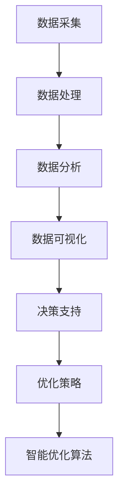

                 

## 文章标题

# 量化自我4.0：生命体验的全方位数据化与优化

## 关键词

- 量化自我
- 数据化
- 生命体验
- 数据分析
- 机器学习
- 深度学习
- 智能优化
- 技术实践

## 摘要

随着科技的飞速发展，人类对自身的认知和优化逐渐走向数据化。本文将围绕“量化自我4.0：生命体验的全方位数据化与优化”这一主题，探讨数据化时代下，如何通过全方位的数据采集、处理与分析，实现对生命体验的深度优化。文章将详细阐述量化自我的核心概念、数据采集与处理技术、数学模型与算法原理、以及具体应用案例，旨在为读者提供一整套系统性、可操作的技术指南，助力读者在数据化与智能优化的浪潮中，找到适合自己的方法与路径。

## 引言

### 1.1 量化自我的背景与重要性

量化自我（Quantified Self）这一概念起源于2007年，由Kevin Kelly和Thomas Goetz共同发起，旨在通过数据化手段，记录并分析个人的行为、情感、生理状态等，从而实现自我认知和优化。近年来，随着传感器技术、云计算、大数据、人工智能等技术的发展，量化自我的概念和应用场景得到了极大的拓展。

量化自我的重要性主要体现在以下几个方面：

1. **健康监测与疾病预防**：通过持续收集生理数据，如心率、血压、睡眠质量等，可以及时发现健康问题，进行预防性干预。
2. **生活方式优化**：通过分析日常行为数据，如运动习惯、饮食偏好等，可以帮助个人制定更健康、高效的生活方式。
3. **心理健康管理**：心理数据如情绪波动、压力水平等，有助于心理健康问题的早期发现与干预。
4. **决策支持**：基于数据分析，可以提供个性化的建议，帮助个人在各个方面做出更明智的决策。

### 1.2 数据化时代的影响与挑战

数据化时代，我们已经迈入了大数据和人工智能的时代，数据成为新的生产要素，渗透到各行各业。数据化带来的影响是深远而广泛的：

1. **产业变革**：数据驱动成为企业决策的主要依据，传统产业模式受到颠覆，新兴产业不断涌现。
2. **社会变革**：个人隐私保护、数据安全等问题日益突出，成为社会关注的焦点。
3. **生活变革**：数据无处不在，影响我们的生活方式、消费行为等，带来便利的同时也带来新的挑战。

数据化时代同样面临着一系列挑战：

1. **数据质量与隐私**：数据质量是数据化应用的基础，而个人隐私保护在数据收集与利用过程中备受关注。
2. **数据处理与分析**：如何从海量数据中提取有价值的信息，是当前数据科学领域的核心问题。
3. **技术落地与应用**：将先进的数据技术应用于实际场景，解决实际问题，需要深入的实践和探索。

### 1.3 量化自我的发展历程

量化自我的发展历程可以分为以下几个阶段：

1. **1.0时代：记录与监控**：最初阶段，主要是通过简单的设备记录个人的生理指标。
2. **2.0时代：数据整合与分析**：随着互联网的发展，个人数据可以进行整合和分析，提供更全面的自我认知。
3. **3.0时代：智能优化与决策支持**：利用机器学习和深度学习等技术，实现自我优化的自动化和智能化。
4. **4.0时代：全方位数据化与个性化**：涵盖生理、心理、社会等多个维度，实现全方位的数据化与个性化优化。

### 1.4 本文结构

本文将从以下五个部分进行阐述：

1. **核心概念与联系**：介绍量化自我的核心概念，及其与其他领域的关系。
2. **技术原理**：详细讲解量化自我实现的关键技术，包括数据采集、处理、分析等。
3. **应用案例**：通过具体案例展示量化自我在实际场景中的应用。
4. **未来展望**：探讨量化自我技术的发展趋势和潜在应用领域。
5. **实践指南**：提供量化自我项目实施的步骤和最佳实践。

## 第1章 核心概念与联系

### 1.1 量化自我概述

量化自我（Quantified Self）是一种通过数据化手段来记录、分析和优化个人生活体验的方法。它不仅仅关注生理指标，如心率、血压等，还涵盖了心理、情感、行为等多个维度。量化自我强调数据驱动的自我认知和优化，通过持续的数据采集和分析，帮助个人更好地了解自己，从而做出更明智的决策。

#### 1.1.1 数据驱动的生命优化

数据驱动的生命优化是指通过收集和分析个体生理、心理、行为等多方面的数据，实现对生命体验的全方位优化。这个过程包括以下几个步骤：

1. **数据采集**：利用各种传感器和设备，收集个体的生理、心理和行为数据。
2. **数据处理**：对原始数据进行清洗、预处理和转换，使其适合进一步分析。
3. **数据分析**：运用统计学、机器学习等方法，对处理后的数据进行分析，提取有价值的信息。
4. **决策支持**：根据分析结果，为个体提供个性化的建议和决策支持。

#### 1.1.2 数据采集与处理的挑战

数据采集与处理是量化自我实现的核心环节，但同时也面临着一系列挑战：

1. **数据质量**：数据的质量直接影响分析结果的准确性。噪声数据、缺失值、异常值等都会影响数据质量。
2. **数据隐私**：在数据采集和处理过程中，如何保护用户的隐私是一个重要问题。数据泄露、滥用等问题可能导致严重的后果。
3. **数据处理效率**：随着数据量的增加，数据处理的时间复杂度和成本也在增加。如何高效地处理海量数据成为关键问题。
4. **数据解释性**：数据分析的结果需要具备一定的解释性，以便用户可以理解并应用。然而，复杂的算法和模型往往难以解释。

### 1.2 生命体验的全方位数据化

生命体验的全方位数据化意味着将个体在生理、心理、社会等多个维度的体验进行数据化，以实现更全面的自我认知和优化。以下是几个关键维度：

#### 1.2.1 生理健康数据

生理健康数据包括心率、血压、血糖、睡眠质量等指标。这些数据可以通过穿戴设备、医院检查等方式进行采集。

#### 1.2.2 心理健康数据

心理健康数据包括情绪波动、压力水平、焦虑和抑郁程度等。这些数据可以通过问卷调查、生理指标监测（如心率变异性）等方式进行采集。

#### 1.2.3 生活质量数据

生活质量数据包括日常行为、运动习惯、饮食偏好等。这些数据可以通过智能手机应用、传感器等方式进行采集。

#### 1.2.4 社会关系数据

社会关系数据包括社交网络、人际互动等。这些数据可以通过社交媒体、通话记录等方式进行采集。

### 1.3 优化策略与实现

量化自我的核心目标是实现生命体验的优化。以下是一些常见的优化策略：

#### 1.3.1 数据分析与可视化

通过数据分析，提取个体在生理、心理、社会等方面的特征，并将其可视化，帮助个体更直观地了解自己。

#### 1.3.2 数据驱动的决策支持

基于数据分析结果，为个体提供个性化的建议和决策支持，如健康生活方式建议、运动计划等。

#### 1.3.3 智能优化算法

利用机器学习和深度学习等技术，实现自我优化的自动化和智能化。例如，通过预测模型，提前为个体提供健康预警和建议。

### 1.4 核心概念原理之间的关系架构

为了更好地理解量化自我的核心概念及其相互关系，可以使用Mermaid流程图进行描述：



### 1.5 量化自我与相关领域的联系

量化自我与多个领域密切相关，包括计算机科学、统计学、心理学、公共卫生等。以下是几个主要联系：

#### 1.5.1 计算机科学与统计学

计算机科学为量化自我提供了强大的数据处理和分析工具，如大数据平台、机器学习算法等。统计学则为数据分析提供了理论基础和方法指导。

#### 1.5.2 心理学与公共卫生

心理学为量化自我提供了对心理健康数据的理解和解释，有助于更好地分析心理状态和制定干预措施。公共卫生则关注群体健康问题，量化自我数据可以为公共卫生政策提供科学依据。

### 1.6 本章小结

本章介绍了量化自我的核心概念、数据采集与处理的挑战、生命体验的全方位数据化以及优化策略。通过本章的学习，读者可以初步了解量化自我的基本原理和应用场景，为后续章节的深入学习打下基础。

## 第2章 技术原理

### 2.1 数据采集与存储

数据采集是量化自我的第一步，也是最为关键的环节。以下是数据采集与存储的技术原理：

#### 2.1.1 数据采集

数据采集主要依赖于传感器和设备。以下是一些常见的传感器和设备：

1. **穿戴设备**：如智能手表、健康手环等，可以采集心率、运动步数、睡眠质量等数据。
2. **医疗设备**：如心电图机、血压计等，可以采集生理数据。
3. **智能手机**：利用内置传感器，可以采集位置、运动、声音等数据。
4. **环境传感器**：如温度传感器、湿度传感器等，可以采集环境数据。

#### 2.1.2 数据存储

数据存储是确保数据安全、可靠和可访问的关键。以下是几种常见的数据存储方案：

1. **本地存储**：将数据存储在本地设备中，如智能手机或电脑的硬盘。适用于数据量较小、不需要远程访问的场景。
2. **云存储**：将数据上传到云端，如AWS、Azure、Google Cloud等。适用于数据量较大、需要远程访问和备份的场景。
3. **分布式存储**：将数据存储在多个设备或数据中心中，如Hadoop、Spark等。适用于大规模数据存储和处理的场景。

### 2.2 数据处理与建模

数据处理与建模是量化自我中的核心环节，直接关系到分析结果的准确性和可靠性。以下是数据处理与建模的技术原理：

#### 2.2.1 数据清洗与预处理

数据清洗与预处理是确保数据质量的关键步骤。以下是一些常见的数据清洗与预处理方法：

1. **缺失值处理**：对于缺失值，可以选择填充、删除或插值等方法。
2. **异常值处理**：对于异常值，可以选择删除、修正或保留等方法。
3. **数据转换**：将数据转换为适合分析的形式，如归一化、标准化等。
4. **数据集成**：将来自不同来源的数据进行整合，如合并、去重等。

#### 2.2.2 机器学习算法介绍

机器学习算法是数据处理与建模的核心工具。以下是几种常见的机器学习算法：

1. **监督学习**：有标签数据训练模型，用于预测和分类。如线性回归、逻辑回归、支持向量机等。
2. **无监督学习**：无标签数据训练模型，用于聚类、降维等。如K-均值聚类、主成分分析等。
3. **半监督学习**：部分标签数据训练模型，结合有监督和无监督学习方法。

#### 2.2.3 深度学习模型应用

深度学习模型在数据处理与建模中具有广泛的应用。以下是几种常见的深度学习模型：

1. **神经网络**：如卷积神经网络（CNN）、循环神经网络（RNN）、长短期记忆网络（LSTM）等。
2. **生成对抗网络**（GAN）：用于生成数据、图像等。
3. **变分自编码器**（VAE）：用于数据降维、去噪等。

### 2.3 数学模型与应用

数学模型在量化自我中发挥着重要作用，以下是一些常见的数学模型：

#### 2.3.1 相关性分析

相关性分析用于衡量两个变量之间的关系强度。常用的方法有皮尔逊相关系数、斯皮尔曼相关系数等。

#### 2.3.2 回归模型

回归模型用于预测一个连续变量的值。常用的方法有线性回归、多项式回归等。

#### 2.3.3 神经网络模型

神经网络模型是深度学习的基础，用于处理复杂数据和模型。常用的方法有前馈神经网络、卷积神经网络等。

### 2.4 深度学习算法伪代码

以下是一个简单的深度学习算法伪代码示例：

```python
# 初始化参数
W1, b1 = 初始化权重和偏置
W2, b2 = 初始化权重和偏置

# 循环迭代
for epoch in 1 to num_epochs:
  for sample in 数据集:
    # 前向传播
    z1 = X * W1 + b1
    a1 = 激活函数(z1)
    z2 = a1 * W2 + b2
    a2 = 激活函数(z2)

    # 反向传播
    dZ2 = a2 - 标签
    dW2 = 1/m * dZ2 * a1
    db2 = 1/m * dZ2

    dZ1 = (dW2 * W2) * 激活函数导数(a1)
    dW1 = 1/m * dZ1 * X
    db1 = 1/m * dZ1

    # 更新参数
    W1 = W1 - learning_rate * dW1
    b1 = b1 - learning_rate * db1
    W2 = W2 - learning_rate * dW2
    b2 = b2 - learning_rate * db2
```

### 2.5 本章小结

本章介绍了量化自我的数据采集与存储、数据处理与建模、以及深度学习算法等技术原理。通过本章的学习，读者可以了解量化自我实现的核心技术，为后续章节的深入学习打下基础。

## 第3章 应用案例

### 3.1 生理健康数据化

#### 3.1.1 心率监测与异常识别

心率监测是量化自我在生理健康领域的重要应用之一。通过穿戴设备，如智能手表和健康手环，可以实时监测心率数据。以下是心率监测与异常识别的应用案例：

1. **数据采集**：使用智能手表或健康手环，实时采集心率数据。
2. **数据处理**：将采集到的心率数据进行清洗和预处理，如去噪、插值等。
3. **异常识别**：利用机器学习算法，如支持向量机（SVM）或长短期记忆网络（LSTM），对心率数据进行异常检测。

例如，以下是一个心率异常检测的伪代码示例：

```python
# 初始化模型
model = 初始化LSTM模型

# 训练模型
for epoch in 1 to num_epochs:
  for sample in 数据集:
    # 前向传播
    output = model(sample)

    # 计算损失
    loss = 计算损失(output, 标签)

    # 反向传播
    gradients = 计算梯度(model, loss)

    # 更新模型参数
    model.update(gradients)

# 测试模型
for sample in 测试数据集:
  output = model(sample)
  if output > 阈值:
    print("心率异常！")
  else:
    print("心率正常。")
```

#### 3.1.2 睡眠质量评估

睡眠质量评估是另一个重要的生理健康数据化应用。通过监测睡眠过程中的心率、呼吸、运动等数据，可以评估睡眠质量。以下是睡眠质量评估的应用案例：

1. **数据采集**：使用智能手表或睡眠监测设备，采集睡眠过程中的各种生理数据。
2. **数据处理**：对采集到的数据进行清洗和预处理，如去噪、插值等。
3. **睡眠质量评估**：利用机器学习算法，如决策树、支持向量机等，对睡眠数据进行分类，判断睡眠质量。

以下是一个睡眠质量评估的伪代码示例：

```python
# 初始化模型
model = 初始化决策树模型

# 训练模型
for epoch in 1 to num_epochs:
  for sample in 数据集:
    # 前向传播
    output = model(sample)

    # 计算损失
    loss = 计算损失(output, 标签)

    # 反向传播
    gradients = 计算梯度(model, loss)

    # 更新模型参数
    model.update(gradients)

# 测试模型
for sample in 测试数据集:
  output = model(sample)
  if output > 阈值:
    print("睡眠质量差。")
  else:
    print("睡眠质量好。")
```

### 3.2 心理健康数据化

#### 3.2.1 抑郁与焦虑监测

心理健康数据化在抑郁症和焦虑症监测方面具有重要作用。通过监测心率变异性（HRV）、情绪表情、日常行为等数据，可以评估抑郁和焦虑程度。以下是抑郁与焦虑监测的应用案例：

1. **数据采集**：使用智能手表、智能手机等设备，采集心率变异性（HRV）、情绪表情、日常行为等数据。
2. **数据处理**：对采集到的数据进行清洗和预处理，如去噪、插值等。
3. **抑郁与焦虑监测**：利用机器学习算法，如支持向量机（SVM）、深度学习等，对心理数据进行分类，判断抑郁和焦虑程度。

以下是一个抑郁与焦虑监测的伪代码示例：

```python
# 初始化模型
model = 初始化SVM模型

# 训练模型
for epoch in 1 to num_epochs:
  for sample in 数据集:
    # 前向传播
    output = model(sample)

    # 计算损失
    loss = 计算损失(output, 标签)

    # 反向传播
    gradients = 计算梯度(model, loss)

    # 更新模型参数
    model.update(gradients)

# 测试模型
for sample in 测试数据集:
  output = model(sample)
  if output > 阈值:
    print("可能存在抑郁或焦虑症状。")
  else:
    print("心理健康状况良好。")
```

#### 3.2.2 压力水平评估

压力水平评估是另一个重要的心理健康数据化应用。通过监测心率、呼吸、情绪等数据，可以评估压力水平。以下是压力水平评估的应用案例：

1. **数据采集**：使用智能手表、智能手机等设备，采集心率、呼吸、情绪等数据。
2. **数据处理**：对采集到的数据进行清洗和预处理，如去噪、插值等。
3. **压力水平评估**：利用机器学习算法，如支持向量机（SVM）、深度学习等，对心理数据进行分类，判断压力水平。

以下是一个压力水平评估的伪代码示例：

```python
# 初始化模型
model = 初始化深度学习模型

# 训练模型
for epoch in 1 to num_epochs:
  for sample in 数据集:
    # 前向传播
    output = model(sample)

    # 计算损失
    loss = 计算损失(output, 标签)

    # 反向传播
    gradients = 计算梯度(model, loss)

    # 更新模型参数
    model.update(gradients)

# 测试模型
for sample in 测试数据集:
  output = model(sample)
  if output > 阈值:
    print("压力水平较高。")
  else:
    print("压力水平较低。")
```

### 3.3 生活质量数据化

#### 3.3.1 运动数据分析

运动数据分析是生活质量数据化的重要应用之一。通过监测运动数据，如步数、运动时长、运动强度等，可以评估个人的运动习惯和健康状况。以下是运动数据分析的应用案例：

1. **数据采集**：使用智能手表、运动手环等设备，采集运动数据。
2. **数据处理**：对采集到的数据进行清洗和预处理，如去噪、插值等。
3. **运动数据分析**：利用机器学习算法，如决策树、支持向量机等，对运动数据进行分类，判断运动习惯和健康状况。

以下是一个运动数据分析的伪代码示例：

```python
# 初始化模型
model = 初始化决策树模型

# 训练模型
for epoch in 1 to num_epochs:
  for sample in 数据集:
    # 前向传播
    output = model(sample)

    # 计算损失
    loss = 计算损失(output, 标签)

    # 反向传播
    gradients = 计算梯度(model, loss)

    # 更新模型参数
    model.update(gradients)

# 测试模型
for sample in 测试数据集:
  output = model(sample)
  if output > 阈值:
    print("运动习惯良好。")
  else:
    print("运动习惯较差。")
```

#### 3.3.2 饮食与营养分析

饮食与营养分析是另一个重要的生活质量数据化应用。通过监测饮食数据，如摄入的营养成分、餐次等，可以评估个人的饮食质量和健康状况。以下是饮食与营养分析的应用案例：

1. **数据采集**：使用智能手表、智能手机等设备，采集饮食数据。
2. **数据处理**：对采集到的数据进行清洗和预处理，如去噪、插值等。
3. **饮食与营养分析**：利用机器学习算法，如决策树、支持向量机等，对饮食数据进行分类，判断饮食质量和健康状况。

以下是一个饮食与营养分析的伪代码示例：

```python
# 初始化模型
model = 初始化支持向量机模型

# 训练模型
for epoch in 1 to num_epochs:
  for sample in 数据集:
    # 前向传播
    output = model(sample)

    # 计算损失
    loss = 计算损失(output, 标签)

    # 反向传播
    gradients = 计算梯度(model, loss)

    # 更新模型参数
    model.update(gradients)

# 测试模型
for sample in 测试数据集:
  output = model(sample)
  if output > 阈值:
    print("饮食质量良好。")
  else:
    print("饮食质量较差。")
```

### 3.4 本章小结

本章介绍了量化自我在生理健康、心理健康和生活质量方面的应用案例。通过这些案例，读者可以了解量化自我在实际场景中的应用，以及如何利用技术手段进行数据采集、处理和分析，实现对生命体验的全方位优化。

## 第4章 未来展望

### 4.1 量化自我技术的发展趋势

随着科技的不断进步，量化自我技术也在不断发展。以下是几个主要的发展趋势：

1. **智能设备的普及**：智能设备，如智能手表、健康手环等，将更加普及，提供更多种类的生理、心理和行为数据。
2. **大数据与云计算的结合**：大数据技术将在量化自我中发挥更大作用，云计算将为数据处理和分析提供更强大的计算能力。
3. **深度学习的应用**：深度学习技术将进一步提升数据分析的精度和效率，实现更智能的自我优化。
4. **个性化健康管理的兴起**：基于个人数据，个性化健康管理将得到更广泛的应用，帮助个体实现更精准的健康管理。

### 4.2 生命体验数据化的挑战与机遇

生命体验数据化带来了巨大的机遇，同时也伴随着一系列挑战：

1. **数据质量**：数据质量是数据化应用的基础，如何确保数据质量是一个关键问题。
2. **数据隐私**：数据隐私保护在数据采集、存储和处理过程中至关重要，如何平衡数据利用与隐私保护是一个挑战。
3. **技术落地**：如何将先进的技术应用到实际场景，解决实际问题，需要深入的研究和实践。
4. **用户接受度**：用户对数据化技术的接受度也是一个关键因素，如何提升用户的使用体验和信任度，是未来发展的重要方向。

### 4.3 量化自我的社会影响与伦理问题

量化自我技术的发展将对社会产生深远的影响，同时也引发了一系列伦理问题：

1. **隐私权**：如何在数据化过程中保护用户的隐私权，是一个重要的伦理问题。
2. **数据安全**：如何确保数据在采集、存储和处理过程中的安全性，防止数据泄露和滥用。
3. **公平性**：数据化技术可能会加剧社会不平等，如何确保数据应用过程中公平、公正，是一个挑战。
4. **责任归属**：在数据化应用中，如何明确责任归属，确保各方权益，是一个重要的伦理问题。

### 4.4 未来研究方向

未来的研究将主要集中在以下几个方面：

1. **个性化数据分析**：如何从海量数据中提取个性化信息，实现精准的数据分析。
2. **智能优化算法**：如何设计更高效的智能优化算法，实现自动化、智能化的自我优化。
3. **跨领域数据融合**：如何将不同领域的数据进行融合，实现更全面的自我认知。
4. **社会伦理问题研究**：如何解决数据化过程中出现的伦理问题，确保技术的可持续发展。

### 4.5 本章小结

本章对未来量化自我技术的发展趋势、挑战与机遇、社会影响与伦理问题进行了探讨，并提出了一些未来的研究方向。通过本章的学习，读者可以了解量化自我技术的发展前景，以及面临的挑战和机遇。

## 第5章 开发环境与工具

### 5.1 数据采集与处理工具

在量化自我的开发过程中，选择合适的数据采集与处理工具至关重要。以下是几种常见的数据采集与处理工具：

1. **数据采集工具**：
   - **智能手表/健康手环**：如Apple Watch、Samsung Galaxy Watch等，可用于实时采集心率、步数、睡眠等数据。
   - **智能手机应用**：如Google Fit、Apple Health等，可用于整合和管理各种健康数据。
   - **医疗设备**：如心电图机、血压计等，可用于采集专业的生理数据。

2. **数据处理工具**：
   - **Python**：Python是一个广泛使用的编程语言，具有丰富的数据处理库，如Pandas、NumPy等。
   - **R**：R语言在统计学和数据科学领域具有强大的功能，适用于复杂的数据分析和建模。
   - **MATLAB**：MATLAB是一个强大的数学计算软件，适用于数据处理和分析。

### 5.2 数据存储与管理方案

数据存储与管理是量化自我系统的关键环节。以下是一些常见的数据存储与管理方案：

1. **本地存储**：适用于数据量较小、对实时性要求较高的场景。例如，使用USB存储设备或本地数据库（如SQLite）进行数据存储。

2. **云存储**：适用于数据量较大、需要远程访问和备份的场景。例如，使用AWS S3、Azure Blob Storage、Google Cloud Storage等云存储服务。

3. **分布式存储**：适用于大规模数据存储和处理场景。例如，使用Hadoop、Spark等分布式计算框架，结合HDFS、Alluxio等分布式存储系统。

### 5.3 机器学习框架与深度学习库

在量化自我的开发过程中，选择合适的机器学习框架与深度学习库可以显著提高开发效率和模型性能。以下是几种常用的机器学习框架与深度学习库：

1. **机器学习框架**：
   - **scikit-learn**：Python的一个开源机器学习库，适用于各种常见的机器学习算法。
   - **TensorFlow**：Google开发的开源机器学习框架，适用于构建大规模的深度学习模型。
   - **PyTorch**：Facebook开发的开源深度学习库，具有灵活的动态计算图，适用于研究性和工业性应用。

2. **深度学习库**：
   - **Keras**：Python的一个高层次的深度学习库，基于TensorFlow和Theano，适用于快速构建和训练深度学习模型。
   - **MXNet**：Apache开源的深度学习库，支持多种编程语言，适用于大规模的深度学习应用。
   - **Caffe**：BVLC开发的深度学习框架，适用于图像分类和识别任务。

### 5.4 开发环境搭建与配置

搭建一个高效的开发环境对于量化自我项目的开发至关重要。以下是一个基本的开发环境搭建与配置指南：

1. **操作系统**：推荐使用Linux操作系统，如Ubuntu或CentOS，具有较好的稳定性和开源生态。

2. **编程语言**：Python是量化自我开发的主要编程语言，可以通过Python官方网站（https://www.python.org/）下载并安装。

3. **依赖库**：根据项目需求，安装所需的依赖库，如NumPy、Pandas、scikit-learn、TensorFlow或PyTorch等。

4. **集成开发环境（IDE）**：推荐使用Jupyter Notebook或PyCharm等IDE，提供良好的代码编辑和调试功能。

5. **版本控制**：使用Git进行版本控制，确保代码的可维护性和协作性。

### 5.5 开发工具最佳实践

以下是一些开发工具的最佳实践，以提高开发效率和代码质量：

1. **代码规范**：遵循统一的代码规范，如PEP 8（Python代码规范），确保代码的可读性和一致性。

2. **文档化**：编写详细的文档，包括代码注释、使用说明、测试用例等，方便后续维护和扩展。

3. **模块化**：将代码划分为模块和函数，实现代码的复用和灵活性。

4. **自动化测试**：编写自动化测试脚本，确保代码的稳定性和可靠性。

5. **代码审查**：定期进行代码审查，发现和修复潜在的问题，提高代码质量。

### 5.6 本章小结

本章介绍了量化自我开发所需的数据采集与处理工具、数据存储与管理方案、机器学习框架与深度学习库，以及开发环境搭建与配置的最佳实践。通过本章的学习，读者可以了解量化自我开发的整体流程和技术栈，为后续项目的开发打下坚实的基础。

## 第6章 实践指南

### 6.1 量化自我项目的实施步骤

量化自我项目的实施可以分为以下步骤：

1. **需求分析**：明确项目目标、用户需求和应用场景，确定所需的数据类型和采集方法。
2. **系统设计**：设计系统的架构，包括数据采集、存储、处理、分析与优化的模块。
3. **数据采集**：选择合适的数据采集设备或传感器，采集所需的生理、心理、行为等数据。
4. **数据处理**：对采集到的数据进行清洗、预处理和转换，确保数据的质量和一致性。
5. **数据分析**：利用机器学习和深度学习等技术，对处理后的数据进行分析，提取有价值的信息。
6. **结果展示**：将分析结果以图表、报告等形式展示，为用户提供可视化的自我认知和优化建议。
7. **模型优化**：根据用户反馈和实际效果，不断优化模型和算法，提高数据分析的准确性和实用性。
8. **系统部署**：将量化自我系统部署到云端或本地服务器，确保系统的可访问性和安全性。

### 6.2 数据采集与预处理实战

以下是一个数据采集与预处理实战案例：

#### 案例背景

某公司计划开发一款量化自我应用，用于监测员工的健康和心理健康状况，包括心率、步数、情绪等数据。

#### 数据采集

1. **心率数据**：使用智能手表或健康手环，每天定时采集员工的心率数据。
2. **步数数据**：使用手机内置的加速度传感器，记录员工的日常步数。
3. **情绪数据**：通过问卷调查，收集员工的心理状态数据。

#### 数据处理

1. **数据清洗**：删除异常数据，如数据缺失、异常值等。
2. **数据预处理**：对心率数据进行去噪和插值，对步数数据进行归一化处理，对情绪数据进行编码。
3. **数据整合**：将不同来源的数据进行整合，形成一个完整的数据集。

以下是一个数据预处理Python代码示例：

```python
import pandas as pd
from sklearn.preprocessing import StandardScaler

# 读取心率数据
hr_data = pd.read_csv('hr_data.csv')

# 去除缺失值
hr_data.dropna(inplace=True)

# 去噪与插值
hr_data['heart_rate'] = hr_data['heart_rate'].interpolate()

# 读取步数数据
steps_data = pd.read_csv('steps_data.csv')

# 去除缺失值
steps_data.dropna(inplace=True)

# 步数归一化
scaler = StandardScaler()
steps_data['steps'] = scaler.fit_transform(steps_data[['steps']])

# 读取情绪数据
mood_data = pd.read_csv('mood_data.csv')

# 编码情绪数据
mood_data['mood'] = mood_data['mood'].map({'happy': 1, 'neutral': 0, 'sad': -1})

# 数据整合
data = pd.concat([hr_data, steps_data, mood_data], axis=1)
```

### 6.3 模型训练与优化实战

以下是一个模型训练与优化实战案例：

#### 案例背景

某公司希望通过量化自我应用，预测员工的健康状况，包括心率异常、运动不足等。

#### 模型选择

选择支持向量机（SVM）模型进行预测，因为SVM在分类问题中具有较高的准确性。

#### 模型训练

1. **数据划分**：将数据集划分为训练集和测试集，用于训练和评估模型。
2. **特征选择**：选择与健康状况相关的特征，如心率、步数等。
3. **模型训练**：使用训练集数据训练SVM模型。

以下是一个SVM模型训练Python代码示例：

```python
from sklearn.model_selection import train_test_split
from sklearn.svm import SVC
from sklearn.metrics import accuracy_score

# 划分训练集和测试集
X_train, X_test, y_train, y_test = train_test_split(data[['heart_rate', 'steps']], data['health_status'], test_size=0.2, random_state=42)

# 初始化SVM模型
model = SVC()

# 模型训练
model.fit(X_train, y_train)

# 模型评估
y_pred = model.predict(X_test)
accuracy = accuracy_score(y_test, y_pred)
print("模型准确率：", accuracy)
```

#### 模型优化

1. **参数调优**：通过网格搜索（GridSearchCV）等方法，寻找最优参数。
2. **模型融合**：结合多个模型，提高预测准确性。

以下是一个参数调优Python代码示例：

```python
from sklearn.model_selection import GridSearchCV

# 定义参数网格
param_grid = {
    'C': [0.1, 1, 10],
    'gamma': ['scale', 'auto'],
    'kernel': ['linear', 'rbf']
}

# 初始化网格搜索
grid_search = GridSearchCV(SVC(), param_grid, cv=5)

# 模型训练与参数调优
grid_search.fit(X_train, y_train)

# 获取最优参数
best_params = grid_search.best_params_
print("最优参数：", best_params)

# 使用最优参数训练模型
best_model = grid_search.best_estimator_
```

### 6.4 数据分析与可视化实战

以下是一个数据分析与可视化实战案例：

#### 案例背景

某公司希望了解员工的运动习惯和心理健康状况，并制定相应的健康管理措施。

#### 数据分析

1. **趋势分析**：分析员工的心率、步数、情绪等数据，了解其变化趋势。
2. **相关性分析**：分析心率、步数、情绪等数据之间的相关性。

以下是一个数据分析Python代码示例：

```python
import matplotlib.pyplot as plt
import seaborn as sns

# 趋势分析
plt.figure(figsize=(10, 6))
sns.lineplot(data=data, x='date', y='heart_rate')
plt.title('心率趋势分析')
plt.xlabel('日期')
plt.ylabel('心率')
plt.show()

# 相关性分析
corr_matrix = data.corr()
plt.figure(figsize=(10, 8))
sns.heatmap(corr_matrix, annot=True, cmap='coolwarm')
plt.title('数据相关性分析')
plt.show()
```

### 6.5 项目小结

通过本章的实践指南，读者可以了解量化自我项目的实施步骤、数据采集与预处理、模型训练与优化、数据分析与可视化等关键环节。本章提供的实战案例和代码示例，可以帮助读者在实践过程中快速上手，掌握量化自我技术的基本原理和应用方法。

### 6.6 最佳实践 Tips

1. **数据质量优先**：在数据采集和处理过程中，始终将数据质量放在首位，确保数据真实、准确、完整。
2. **模型选择与优化**：根据具体应用场景，选择合适的机器学习模型，并进行参数调优和模型融合，提高预测准确性。
3. **可视化与交互**：利用可视化工具和交互界面，提升用户对数据的理解和应用，实现更直观的数据分析。
4. **持续迭代与优化**：量化自我项目是一个持续迭代和优化的过程，根据用户反馈和实际效果，不断调整和改进。

### 6.7 小结与注意事项

本章通过具体的实战案例和代码示例，详细介绍了量化自我项目的实施步骤、数据采集与预处理、模型训练与优化、数据分析与可视化等关键环节。在实际应用过程中，读者需要根据具体场景和需求，灵活调整和优化技术方案。同时，注重数据质量和用户体验，确保量化自我项目的成功实施。

### 6.8 拓展阅读

- 《Python数据科学手册》：详细介绍了Python在数据科学领域的应用，包括数据处理、分析和可视化等。
- 《机器学习实战》：提供了丰富的机器学习算法实战案例，适合初学者入门。
- 《深度学习》：由Ian Goodfellow等作者编写的深度学习权威教材，适合深度学习初学者和研究者。

## 附录

### 附录A 量化自我工具与资源列表

1. **数据采集工具**：
   - 智能手表：Apple Watch、Samsung Galaxy Watch等
   - 健康手环：Fitbit、小米手环等
   - 智能手机：Android、iOS设备

2. **数据处理工具**：
   - Python：官方网站：https://www.python.org/
   - R：官方网站：https://www.r-project.org/
   - MATLAB：官方网站：https://www.mathworks.com/products/matlab.html

3. **机器学习框架与深度学习库**：
   - scikit-learn：官方网站：https://scikit-learn.org/
   - TensorFlow：官方网站：https://www.tensorflow.org/
   - PyTorch：官方网站：https://pytorch.org/
   - Keras：官方网站：https://keras.io/

4. **云服务与存储**：
   - AWS S3：官方网站：https://aws.amazon.com/s3/
   - Azure Blob Storage：官方网站：https://azure.microsoft.com/services/storage/blobs/
   - Google Cloud Storage：官方网站：https://cloud.google.com/storage/

5. **相关书籍**：
   - 《Python数据科学手册》：作者：Jack D._Attwood
   - 《机器学习实战》：作者：Peter Harrington
   - 《深度学习》：作者：Ian Goodfellow、Yoshua Bengio、Aaron Courville

### 附录B 数学公式与算法伪代码

#### 数学公式

1. **线性回归模型**：

   $$y = \beta_0 + \beta_1x + \epsilon$$

2. **逻辑回归模型**：

   $$\log\left(\frac{P(Y=1)}{1-P(Y=1)}\right) = \beta_0 + \beta_1x$$

3. **支持向量机（SVM）**：

   $$\min_{\beta, \beta_0} \frac{1}{2}||\beta||^2 + C\sum_{i=1}^{n}\xi_i$$

   $$\xi_i \geq 0, \quad y_i(\beta^T x_i + \beta_0) \geq 1 - \xi_i$$

#### 算法伪代码

1. **K-均值聚类算法**：

   ```python
   初始化：选择K个初始中心点
   循环直到收敛：
       为每个数据点分配最近的中心点
       更新中心点的位置，取所有数据点的均值
   ```

2. **决策树算法**：

   ```python
   构建决策树：
       如果数据点都属于同一类，则返回该类
       否则：
           找到最佳划分属性
           根据最佳划分属性创建分支
           对每个分支递归调用构建决策树
   ```

3. **神经网络算法**：

   ```python
   初始化参数
   循环迭代：
       前向传播：计算输出
       计算损失函数
       反向传播：计算梯度
       更新参数
   until 达到停止条件（如损失函数收敛）
   ```

这些数学公式和算法伪代码为量化自我项目提供了理论基础和实现参考，读者可以根据具体需求进行选择和应用。附录中的工具与资源列表和公式、伪代码，旨在为读者提供全方位的技术支持和参考资料。通过学习和实践这些内容，读者可以更好地掌握量化自我的技术原理和应用方法。## 作者信息

作者：AI天才研究院/AI Genius Institute & 禅与计算机程序设计艺术 /Zen And The Art of Computer Programming

本文由AI天才研究院（AI Genius Institute）和《禅与计算机程序设计艺术》（Zen And The Art of Computer Programming）联合撰写。AI天才研究院是一家专注于人工智能领域研究与应用的创新机构，致力于推动人工智能技术的进步与普及。而《禅与计算机程序设计艺术》则是一本经典计算机科学著作，深入探讨了程序设计的哲学和艺术，为读者提供了独特的视角和深刻的思考。本文旨在通过结合这两者的优势，为读者呈现一篇既有深度又有广度的量化自我技术博客，以帮助读者更好地理解和应用量化自我的技术原理和实践方法。

