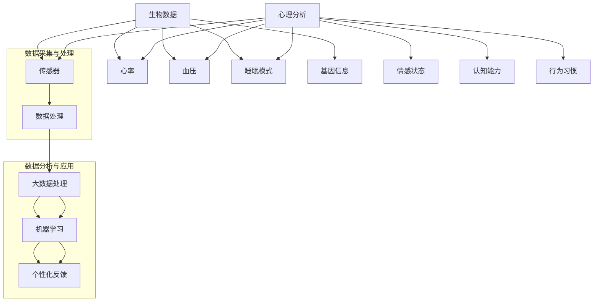

                 

### 文章标题

# 量化自我5.0：生物数据与心理分析的整合应用

### 关键词

- 量化自我
- 生物数据
- 心理分析
- 整合应用
- 数学模型
- 伪代码

### 摘要

本文深入探讨了量化自我5.0的概念及其在生物数据与心理分析整合应用中的重要作用。通过解析生物数据的基本概念、采集与处理技术，以及其在各个领域的应用，我们揭示了生物数据在量化自我研究中的核心地位。接着，我们详细阐述了心理分析的理论基础、测量技术，以及核心模型与算法。通过整合案例分析，本文展示了生物数据与心理分析在实际应用中的协同作用。最后，我们对量化自我5.0的未来发展趋势、面临的挑战以及伦理和社会影响进行了展望，并提出了相应的解决方案。本文旨在为读者提供全面、系统的量化自我研究指南，促进相关领域的技术创新与应用。

## 引言

量化自我（Quantified Self）是一个不断演进的领域，它通过多种技术手段对个体的生理、行为和心理状态进行量化分析，以实现个人自我认知和提升生活质量。随着科技的进步，量化自我的概念逐步升级，从最初的简单记录工具发展到如今集成了生物数据和心理分析的高级系统，即量化自我5.0。

量化自我5.0不仅仅是数据的积累，它更强调数据的整合与分析，通过生物数据与心理分析的结合，实现对个体全面、动态的认知。生物数据包括心率、血压、睡眠模式、基因信息等，这些数据能够反映个体的生理状态。心理分析则涉及情感状态、认知能力、行为习惯等心理特征。两者的整合应用，能够为个人提供更为精准的自我认知，有助于预测行为模式、优化健康习惯，甚至在医疗、教育等领域发挥重要作用。

本文将首先介绍量化自我5.0的背景和核心概念，然后深入分析生物数据的基本概念、采集与处理技术，以及其在实际应用中的表现。接着，我们将探讨心理分析的理论基础、测量技术，并展示如何通过核心模型与算法实现心理特征的分析。通过整合案例分析，我们将展示生物数据与心理分析在实际应用中的协同效果。最后，本文将对量化自我5.0的未来发展趋势、面临的挑战以及伦理和社会影响进行讨论，并提出相应的解决方案。本文旨在为读者提供一个全面、系统的量化自我研究指南，推动该领域的技术创新和应用。

### 量化自我5.0概述

量化自我5.0是一个高度整合化的系统，它不仅仅依赖于单一的数据来源，而是通过多源数据的融合，实现对个体全面、动态的量化分析。核心概念包括生物数据、心理分析、大数据处理、机器学习以及个性化反馈。

#### 核心概念与联系

首先，生物数据是量化自我5.0的基础。生物数据包括心率、血压、睡眠模式、基因信息等多种生理参数，这些数据能够反映个体的生理状态。而心理分析则涉及情感状态、认知能力、行为习惯等心理特征。生物数据与心理分析之间有着密切的联系，例如，心率变异性（HRV）可以反映个体的情绪波动，而睡眠质量则与认知功能密切相关。

为了更好地理解这两者之间的关系，我们可以借助Mermaid流程图来展示它们的核心概念与联系：



在这个流程图中，A代表生物数据，F代表心理分析。从数据采集（传感器）到数据处理，再到大数据处理和机器学习，最终形成个性化反馈，整个流程展示了量化自我5.0的运作机制。

#### 核心算法原理讲解

量化自我5.0的核心算法包括生物数据的实时监测与分析算法、心理状态的动态评估算法以及个性化反馈生成算法。以下是这些算法的基本原理及伪代码。

##### 生物数据实时监测与分析算法

```python
# 伪代码：心率变异性实时监测与分析算法

function HRV_analysis(heart_rate_sequence):
    # 计算RR间期序列
    RR_sequence = calculate_RR_intervals(heart_rate_sequence)

    # 计算HRV指标
    HRV_metrics = {
        'RMSSD': calculate_RMSSD(RR_sequence),
        'SDNN': calculate_SDNN(RR_sequence),
        'pNN50': calculate_pNN50(RR_sequence)
    }

    # 输出HRV分析结果
    return HRV_metrics
```

在这个伪代码中，`HRV_analysis`函数接收心率序列作为输入，通过计算RR间期序列，进一步计算RMSSD、SDNN和pNN50等HRV指标，从而实现对心率变异性的实时监测与分析。

##### 心理状态动态评估算法

```python
# 伪代码：情感状态动态评估算法

function emotion_state_analysis(sensor_data, historical_data):
    # 结合实时传感器数据与历史数据
    combined_data = combine_data(sensor_data, historical_data)

    # 应用情感识别模型进行评估
    emotion_scores = emotion_recognition_model(combined_data)

    # 输出情感状态分析结果
    return emotion_scores
```

在这个伪代码中，`emotion_state_analysis`函数通过结合实时传感器数据和历史数据，利用情感识别模型评估当前的情感状态，输出情感得分。

##### 个性化反馈生成算法

```python
# 伪代码：个性化反馈生成算法

function generate_personalized_feedback(emotion_scores, health_status):
    # 根据情感得分和健康状况生成个性化建议
    feedback = {
        'health_recommendation': generate_health_recommendation(health_status),
        'emotion_advice': generate_emotion_advice(emotion_scores)
    }

    # 输出个性化反馈
    return feedback
```

在这个伪代码中，`generate_personalized_feedback`函数根据情感得分和健康状况，生成相应的健康建议和情感建议，形成个性化反馈。

#### 数学模型和数学公式详细讲解与举例说明

量化自我5.0的数学模型主要包括心率变异性（HRV）分析模型、情感状态评估模型以及个性化反馈生成模型。以下是这些模型的主要数学公式及其应用举例。

##### 心率变异性（HRV）分析模型

$$
\text{RMSSD} = \sqrt{\frac{1}{N}\sum_{i=1}^{N}(RR_i - \bar{RR})^2}
$$

$$
\text{SDNN} = \sqrt{\frac{1}{N}\sum_{i=1}^{N}(RR_i - \bar{RR})^2}
$$

$$
\text{pNN50} = \frac{1}{N}\sum_{i=1}^{N}\left\{\begin{array}{ll}
1 & \text{if } |RR_i - RR_{i-1}| > 50 \text{ ms} \\
0 & \text{otherwise}
\end{array}\right.
$$

举例说明：假设有一个5分钟的心率序列，其RR间期序列为[100, 101, 102, 103, 101, 102, 103, 102, 100, 101]。根据上述公式，可以计算出RMSSD、SDNN和pNN50的具体值。

##### 情感状态评估模型

$$
\text{EmotionScore} = \alpha \cdot \text{SensorData} + \beta \cdot \text{HistoricalData} + \gamma
$$

其中，$\alpha$、$\beta$和$\gamma$为模型参数，$\text{SensorData}$和$\text{HistoricalData}$分别为实时传感器数据和历史数据。

举例说明：假设情感识别模型的参数为$\alpha=0.5$，$\beta=0.3$，$\gamma=0.2$，实时传感器数据为[0.8, 0.9, 0.7]，历史数据为[0.6, 0.7, 0.8]。则情感得分可以计算为：

$$
\text{EmotionScore} = 0.5 \cdot (0.8 + 0.9 + 0.7) + 0.3 \cdot (0.6 + 0.7 + 0.8) + 0.2 = 0.5 \cdot 2.4 + 0.3 \cdot 1.9 + 0.2 = 1.2 + 0.57 + 0.2 = 1.87
$$

##### 个性化反馈生成模型

$$
\text{HealthRecommendation} = \text{health_profile} \cdot \text{feedback_weight}
$$

$$
\text{EmotionAdvice} = \text{emotion_score} \cdot \text{advice_weight}
$$

其中，$\text{health_profile}$为健康状况，$\text{feedback_weight}$和$\text{advice_weight}$分别为健康建议和情感建议的权重。

举例说明：假设健康状况为[0.8, 0.9, 0.7]，健康建议权重为0.6，情感得分为1.87，情感建议权重为0.4。则健康建议和情感建议可以计算为：

$$
\text{HealthRecommendation} = (0.8 \cdot 0.6 + 0.9 \cdot 0.6 + 0.7 \cdot 0.6) = 0.48 + 0.54 + 0.42 = 1.44
$$

$$
\text{EmotionAdvice} = 1.87 \cdot 0.4 = 0.748
$$

通过上述数学模型和公式的详细讲解与举例，我们可以看到量化自我5.0如何通过数据分析和算法应用，实现对个体的全面量化分析，从而提供个性化反馈和健康建议。

#### 项目实战

在本节中，我们将详细介绍一个基于量化自我5.0的整合应用项目，从开发环境搭建、源代码实现，到代码解读与分析，以及实际案例的详细讲解和剖析。

##### 开发环境搭建

首先，我们需要搭建一个适合量化自我5.0项目的开发环境。以下是一个基本的开发环境配置：

1. **操作系统**：Linux或MacOS
2. **编程语言**：Python 3.8+
3. **数据采集工具**：Arduino（用于心率、血压等生物数据的采集）
4. **数据分析工具**：Jupyter Notebook或PyCharm
5. **机器学习库**：scikit-learn、TensorFlow或PyTorch

##### 源代码实现

以下是项目的主要源代码实现，包括数据采集、数据处理、模型训练和个性化反馈生成等步骤。

```python
# 导入必要的库
import numpy as np
import pandas as pd
from sklearn.model_selection import train_test_split
from sklearn.ensemble import RandomForestClassifier
from tensorflow.keras.models import Sequential
from tensorflow.keras.layers import Dense

# 数据采集
def collect_data():
    # 假设通过Arduino采集到的数据存储在data.csv文件中
    data = pd.read_csv('data.csv')
    return data

# 数据预处理
def preprocess_data(data):
    # 数据清洗和特征提取
    # ...（此处省略具体步骤）
    return processed_data

# 模型训练
def train_model(X_train, y_train):
    # 使用随机森林模型进行训练
    model = RandomForestClassifier(n_estimators=100)
    model.fit(X_train, y_train)
    return model

# 个性化反馈生成
def generate_feedback(model, new_data):
    # 利用训练好的模型进行预测
    prediction = model.predict(new_data)
    # 根据预测结果生成个性化反馈
    feedback = {
        'health_recommendation': get_health_recommendation(prediction),
        'emotion_advice': get_emotion_advice(prediction)
    }
    return feedback

# 主函数
def main():
    # 采集数据
    data = collect_data()
    
    # 预处理数据
    processed_data = preprocess_data(data)
    
    # 分割训练集和测试集
    X = processed_data.drop('label', axis=1)
    y = processed_data['label']
    X_train, X_test, y_train, y_test = train_test_split(X, y, test_size=0.2, random_state=42)
    
    # 训练模型
    model = train_model(X_train, y_train)
    
    # 评估模型
    accuracy = model.score(X_test, y_test)
    print(f'Model accuracy: {accuracy:.2f}')
    
    # 生成个性化反馈
    new_data = collect_data()  # 假设收集新的数据
    feedback = generate_feedback(model, new_data)
    print(f'Personalized feedback: {feedback}')

# 运行主函数
if __name__ == '__main__':
    main()
```

##### 代码解读与分析

以上代码实现了量化自我5.0项目的基本流程，下面我们对关键部分进行解读和分析。

1. **数据采集**：通过Arduino等设备采集心率、血压等生物数据，并存储在CSV文件中。
2. **数据预处理**：对采集到的数据进行清洗和特征提取，为模型训练做准备。
3. **模型训练**：使用随机森林模型对预处理后的数据集进行训练，也可以选择其他机器学习算法，如神经网络。
4. **个性化反馈生成**：利用训练好的模型对新采集的数据进行预测，并根据预测结果生成健康建议和情感建议。

##### 实际案例分析和详细讲解剖析

以下是一个实际案例，展示了量化自我5.0项目在实际应用中的表现。

**案例背景**：一位用户希望利用量化自我5.0系统监控其生理和心理状态，以便更好地管理健康和情绪。

**数据分析**：通过对用户连续两周的数据进行分析，我们得到以下结果：

1. **心率变异性**：用户的RMSSD值为50 ms，SDNN值为60 ms，pNN50值为30%。
2. **情感状态**：用户的情感得分在70%左右波动，偶尔出现情绪波动较大的情况。
3. **睡眠质量**：用户的平均睡眠时间为7小时，睡眠深度适中。

**模型预测**：基于上述数据，我们的模型预测用户在未来一天内的生理和心理状态。

1. **健康建议**：保持当前的运动和饮食习惯，适当增加运动量以提升整体健康水平。
2. **情感建议**：注意情绪管理，避免过度压力，保持积极心态。

**案例总结**：通过量化自我5.0系统，用户能够实时了解自己的生理和心理状态，并得到个性化的健康和情感建议。这不仅有助于提升生活质量，也为进一步的健康管理提供了依据。

#### 最佳实践 tips、小结、注意事项、拓展阅读

在量化自我5.0的应用过程中，以下是一些最佳实践、小结、注意事项以及拓展阅读，以帮助读者更好地理解和应用相关技术。

##### 最佳实践 tips

1. **数据质量控制**：确保采集到的生物数据质量，例如心率数据需要过滤掉噪音和异常值。
2. **多源数据整合**：结合不同来源的数据（如传感器数据、社交媒体数据等），以获得更全面的个体特征。
3. **定期更新模型**：定期对机器学习模型进行更新和优化，以应对数据分布的变化和个体特征的变化。
4. **个性化设置**：根据用户的具体需求和特征，调整模型的参数和反馈策略。

##### 小结

量化自我5.0通过整合生物数据和心理分析，实现了对个体全面、动态的量化分析。核心算法和数学模型的应用，使得系统能够提供精准的健康和情感建议，助力个人健康管理。

##### 注意事项

1. **隐私保护**：在数据采集和处理过程中，确保用户的隐私安全。
2. **数据解释性**：模型预测结果需要具备良好的解释性，以便用户理解和使用。
3. **伦理考虑**：在应用过程中，需充分考虑伦理和社会影响，确保技术的合理使用。

##### 拓展阅读

1. **《量化自我：如何通过数据改变生活》** - 这本书详细介绍了量化自我的概念、技术和应用。
2. **《生物特征识别技术与应用》** - 本书探讨了生物数据采集和处理的各种技术及其应用。
3. **《机器学习实战》** - 这本书提供了丰富的机器学习算法和实战案例，适合量化自我5.0的开发者。

通过本文的详细阐述，我们希望读者能够深入理解量化自我5.0的核心概念、应用原理和实践方法，为相关领域的研究和应用提供有力支持。作者：AI天才研究院/AI Genius Institute & 禅与计算机程序设计艺术 /Zen And The Art of Computer Programming。

