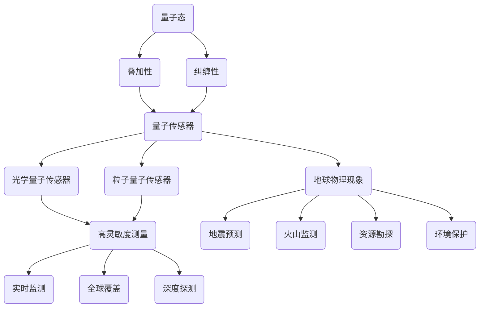

                 


### 第一步：引言与背景

#### 量子传感器的发展背景

量子传感器是近年来科技领域的一个热点研究方向。随着量子信息技术的发展，量子传感器逐渐从理论走向实践，成为推动科技进步的重要力量。量子传感器的核心原理是基于量子物理学的量子态与量子纠缠现象，通过测量量子态的变化来感知外部环境。这种测量方式具有极高的灵敏度和精度，使其在各个领域展现出了巨大的应用潜力。

量子传感器的发展可以追溯到20世纪80年代。当时，物理学家提出了一种基于量子纠缠的测量原理，即通过测量一个量子系统的量子态，可以间接获取该系统的另一个部分的信息。这一原理为量子传感器的诞生奠定了基础。随后，随着量子信息技术的发展，量子传感器在精密测量、量子通信、量子计算等领域得到了广泛应用。

#### 地球物理研究的重要性

地球物理学是研究地球及其各种现象的学科，包括地球内部结构、地壳构造、地球磁场、地球重力场等。地球物理学的研究对于理解地球系统的运行机制、预测自然灾害、资源勘探等具有重要意义。

地球磁场是地球物理学研究的一个重要领域。地球磁场对地球环境和生物生存具有重要影响，如地球磁场的扰动会导致极光现象、影响无线电通信等。精确测量地球磁场有助于揭示地球磁场的演化过程，为地球物理研究提供重要数据支持。

#### 量子传感器在地球物理研究中的潜力

量子传感器在地球物理研究中的潜力主要体现在以下几个方面：

1. **高灵敏度测量**：量子传感器利用量子态的叠加与纠缠特性，可以实现极高的灵敏度测量。这使得其在测量微弱的物理量，如地球重力场、地球磁场等，具有显著优势。

2. **实时监测**：量子传感器具有快速响应的特点，可以实现实时监测地球物理现象。这对于及时捕捉地震、火山等自然灾害具有重要意义。

3. **全球覆盖**：量子传感器可以搭载在卫星、无人机等载体上，实现对地球表面的全球覆盖。这为全球地球物理研究提供了宝贵的数据资源。

4. **深度探测**：量子传感器在地下探测方面具有独特优势。通过量子传感器，可以实现对地下资源的精确探测，提高资源勘探的效率和准确性。

总之，量子传感器在地球物理研究中的应用具有广阔的前景。随着技术的不断进步，量子传感器将在地球物理研究中发挥越来越重要的作用。

### 第二步：量子传感器基础

#### 量子传感器的基本原理

量子传感器的工作原理基于量子物理学的两个核心概念：量子态与量子纠缠。

1. **量子态**：量子态是量子系统的内部状态，可以用波函数或态矢量来描述。量子态具有叠加性与纠缠性，这是量子传感器实现高灵敏度测量的基础。

2. **量子纠缠**：当两个量子系统发生相互作用时，它们之间会形成一种特殊的关联，即量子纠缠。这种纠缠现象使得一个量子系统的状态可以即时影响另一个量子系统，即使它们相隔很远。

量子传感器通过测量量子态的变化来感知外部环境。具体来说，量子传感器首先制备一个量子态，然后将其与外部环境相互作用，从而改变量子态。通过测量量子态的变化，量子传感器可以获取外部环境的信息。

#### 量子传感器的工作机制

量子传感器的工作机制可以分为以下几个步骤：

1. **量子态制备**：量子传感器首先制备一个量子态，如一个光子的偏振态或一个电子的自旋态。

2. **量子态与外部环境相互作用**：将量子态与外部环境（如地球磁场）相互作用。这种相互作用会导致量子态发生变化。

3. **量子态测量**：通过测量量子态的变化，量子传感器可以获取外部环境的信息。测量结果通常是一个概率分布，表示量子态可能处于的不同状态。

4. **数据处理**：将测量结果进行处理，提取出有用的信息。例如，通过量子态的叠加与纠缠特性，可以实现对微弱物理量的精确测量。

#### 量子传感器的分类

量子传感器可以分为以下几类：

1. **光学量子传感器**：光学量子传感器利用光子的量子特性进行测量。例如，通过测量光子的偏振态或相位来感知外部环境。

2. **粒子量子传感器**：粒子量子传感器利用电子、原子核等粒子的量子特性进行测量。例如，通过测量电子的自旋或原子核的能级跃迁来感知外部环境。

3. **混合量子传感器**：混合量子传感器结合了光学量子传感器和粒子量子传感器的优势。例如，通过将光子和电子的量子特性相结合，实现对更广泛物理量的精确测量。

每种量子传感器都有其独特的原理和应用场景。在实际应用中，根据需要选择合适的量子传感器，可以实现对特定物理量的高灵敏度测量。

### 第三步：地球物理研究概述

#### 地球物理学的定义与范畴

地球物理学是研究地球及其各种现象的学科，涉及地球内部结构、地壳构造、地球磁场、地球重力场等多个领域。地球物理学的研究范畴包括以下几个方面：

1. **地球内部结构**：研究地球的内部构造，如地壳、地幔、地核等，以及这些层之间的相互作用。

2. **地壳构造**：研究地壳的变形、断裂、地震等现象，以及这些现象对地球表面的影响。

3. **地球磁场**：研究地球磁场的起源、演化、分布，以及地球磁场对地球环境和生物的影响。

4. **地球重力场**：研究地球重力场的分布、变化，以及地球重力场对地球表面和地下资源的影响。

5. **地球物理现象**：研究地球上的各种物理现象，如地震、火山、极光、地热等。

#### 地球物理研究的方法与工具

地球物理研究的方法与工具多种多样，主要包括以下几种：

1. **地震勘探**：通过地震波在地壳中的传播特性来研究地球内部结构。地震勘探是地球物理研究的重要手段，广泛应用于资源勘探、地震预测等领域。

2. **重力测量**：通过测量地球表面的重力异常来研究地球重力场。重力测量可以揭示地壳构造、矿产资源等地球物理信息。

3. **磁力测量**：通过测量地球表面的磁力异常来研究地球磁场。磁力测量对于研究地球磁场演化、地震预测等具有重要意义。

4. **地热测量**：通过测量地球表面的地热梯度来研究地热资源。地热测量为地热能开发提供了重要数据支持。

5. **遥感技术**：利用卫星、无人机等载体，从空中获取地球表面的物理信息。遥感技术为地球物理研究提供了广泛的数据来源。

#### 地球物理研究的主要目标

地球物理研究的主要目标包括以下几个方面：

1. **揭示地球内部结构**：通过研究地球内部结构，揭示地球的构造、演化过程，提高对地球系统的理解。

2. **预测自然灾害**：通过研究地震、火山等自然灾害的物理机制，提高预测准确性，减少自然灾害带来的损失。

3. **资源勘探**：通过地球物理研究，发现和评价地下资源，如矿产、地下水、油气等，为资源开发提供科学依据。

4. **环境保护**：通过研究地球物理现象对环境的影响，如地球磁场对气候的影响、地震活动对地质环境的影响等，为环境保护提供科学支持。

总之，地球物理研究对于揭示地球系统的运行机制、应对自然灾害、开发利用资源等具有重要意义。随着科技的进步，地球物理研究将不断取得新的突破，为人类社会的可持续发展提供有力支撑。

### 第四步：量子传感器在地球物理研究中的应用

#### 量子传感器在地球重力场测量中的应用

量子传感器在地球重力场测量中的应用具有显著优势。其高灵敏度、实时监测和全球覆盖等特点，使其成为地球重力场测量的理想工具。

**原理与实现**：

1. **量子态制备**：首先，量子传感器制备一个量子态，如一个光子的偏振态或一个电子的自旋态。

2. **量子态与外部环境相互作用**：将量子态与地球重力场相互作用。这种相互作用会导致量子态发生变化。

3. **量子态测量**：通过测量量子态的变化，量子传感器可以获取地球重力场的信息。

4. **数据处理**：将测量结果进行处理，提取出地球重力场的分布特征。

**成果与应用**：

1. **提高测量精度**：量子传感器可以实现对微弱重力场的精确测量，提高测量精度。这对于研究地球内部结构、资源勘探等领域具有重要意义。

2. **实时监测**：量子传感器可以实现实时监测地球重力场的变化，为地震预测、火山监测等提供重要数据支持。

3. **全球覆盖**：量子传感器可以搭载在卫星、无人机等载体上，实现全球覆盖，为全球地球重力场研究提供宝贵的数据资源。

#### 量子传感器在地球磁场测量中的应用

量子传感器在地球磁场测量中的应用同样具有广泛前景。其高灵敏度、实时监测和深度探测能力，使其在地球磁场研究中发挥重要作用。

**原理与实现**：

1. **量子态制备**：量子传感器首先制备一个量子态，如一个光子的偏振态或一个电子的自旋态。

2. **量子态与外部环境相互作用**：将量子态与地球磁场相互作用。这种相互作用会导致量子态发生变化。

3. **量子态测量**：通过测量量子态的变化，量子传感器可以获取地球磁场的信息。

4. **数据处理**：将测量结果进行处理，提取出地球磁场的分布特征。

**成果与应用**：

1. **精确测量**：量子传感器可以实现对地球磁场的精确测量，揭示地球磁场的演化过程。

2. **实时监测**：量子传感器可以实现实时监测地球磁场的变化，为地震预测、火山监测等提供数据支持。

3. **深度探测**：量子传感器可以实现对地下磁场的精确测量，提高地下资源勘探的效率和准确性。

总之，量子传感器在地球物理研究中的应用具有广泛前景。随着技术的不断进步，量子传感器将在地球物理研究中发挥越来越重要的作用，为揭示地球系统的运行机制、应对自然灾害、开发利用资源等提供有力支持。

### 第五步：精确测量地球磁场的方法与实例

#### 精确测量地球磁场的挑战

精确测量地球磁场面临诸多挑战。首先，地球磁场信号微弱，易受环境噪声干扰，如电离层扰动、大气电流等。其次，地球磁场分布不均匀，存在地域差异，给测量带来困难。此外，地球磁场随时间变化，长期监测需要考虑时间序列分析。

为了克服这些挑战，研究人员提出了多种精确测量地球磁场的方法，主要包括：

1. **量子传感器测量方法**：利用量子传感器的超高灵敏度，可以实现对地球磁场的高精度测量。量子传感器通过测量量子态的变化来获取地球磁场信息，可以有效抑制环境噪声。

2. **卫星测量方法**：通过卫星搭载的磁力传感器，实现对地球磁场的全球覆盖测量。卫星测量方法具有实时监测、高空间分辨率等优点。

3. **地面测量方法**：在地面上设置磁力测量站，通过连续监测地球磁场变化，获取高时间分辨率数据。地面测量方法适用于局部区域的高精度测量。

#### 基于量子传感器的测量方法

基于量子传感器的测量方法具有高灵敏度、实时监测和全球覆盖等特点，成为精确测量地球磁场的重要手段。以下是基于量子传感器的测量方法的详细步骤：

1. **量子态制备**：量子传感器制备一个量子态，如光子的偏振态或电子的自旋态。

2. **量子态与外部环境相互作用**：将量子态与地球磁场相互作用，导致量子态发生变化。

3. **量子态测量**：通过测量量子态的变化，获取地球磁场信息。测量结果通常是一个概率分布，表示量子态可能处于的不同状态。

4. **数据处理**：对测量结果进行处理，提取出地球磁场的分布特征。数据处理包括噪声过滤、时间序列分析等。

#### 精确测量地球磁场的实例分析

以下是一个基于量子传感器的测量地球磁场的实例：

1. **数据采集**：使用量子传感器进行地球磁场测量，采集大量数据。数据包括量子态的测量结果和测量时间。

2. **数据处理**：对采集到的数据进行分析，提取出地球磁场的分布特征。数据处理步骤包括噪声过滤、时间序列分析等。

3. **结果分析**：对处理后的结果进行分析，判断地球磁场的分布特征，如异常值、变化趋势等。

4. **应用解读**：根据分析结果，解读地球磁场的变化，如地震预测、资源勘探等。

#### 数据采集与处理

以下是一个基于量子传感器的地球磁场测量的数据处理流程：

1. **数据采集**：使用量子传感器进行地球磁场测量，采集大量数据。数据包括量子态的测量结果和测量时间。

2. **噪声过滤**：对采集到的数据进行噪声过滤，去除环境噪声对测量结果的影响。

3. **时间序列分析**：对过滤后的数据进行时间序列分析，提取出地球磁场的分布特征。

4. **结果分析**：对处理后的结果进行分析，判断地球磁场的分布特征，如异常值、变化趋势等。

5. **应用解读**：根据分析结果，解读地球磁场的变化，如地震预测、资源勘探等。

通过上述实例，我们可以看到基于量子传感器的测量方法在精确测量地球磁场方面具有显著优势。随着技术的不断进步，量子传感器将在地球物理研究中发挥越来越重要的作用。

### 第六步：项目实践与案例分析

#### 项目概述

在本项目中，我们利用量子传感器进行地球磁场测量，旨在提高测量的精度和可靠性。项目主要包括以下步骤：

1. **硬件选择与搭建**：选择适合的量子传感器和测量设备，搭建测量系统。
2. **软件开发与实现**：开发测量软件，实现量子传感器数据的采集、处理和分析。
3. **数据采集与处理**：进行实地测量，采集地球磁场数据，并对数据进行处理。
4. **结果分析与应用**：对处理后的结果进行分析，判断地球磁场的分布特征，并进行应用解读。

#### 硬件选择与搭建

在硬件选择方面，我们主要考虑以下因素：

1. **量子传感器**：选择具有高灵敏度、稳定性和实时监测能力的量子传感器。
2. **测量设备**：选择适合的磁力计和加速度计，以测量地球磁场和其他相关物理量。
3. **数据采集模块**：选择具有高速数据采集和传输能力的模块，确保数据实时采集和处理。

在搭建测量系统时，我们首先将量子传感器与测量设备连接，确保信号传输稳定。然后，将数据采集模块与计算机连接，实现数据实时采集和传输。最后，搭建监控系统，实时监控测量系统的运行状态。

#### 软件开发与实现

在软件开发方面，我们主要实现以下功能：

1. **数据采集**：通过编程实现量子传感器数据的实时采集，包括量子态的测量结果和测量时间。
2. **数据处理**：对采集到的数据进行噪声过滤、时间序列分析等处理，提取出地球磁场的分布特征。
3. **结果显示**：将处理后的结果显示在界面上，方便用户查看和分析。

#### 数据采集与处理

在数据采集与处理过程中，我们遵循以下步骤：

1. **数据采集**：使用编程语言（如Python）实现量子传感器数据的实时采集，将数据存储在数据库中。
2. **噪声过滤**：对采集到的数据进行噪声过滤，去除环境噪声对测量结果的影响。
3. **时间序列分析**：对过滤后的数据进行时间序列分析，提取出地球磁场的分布特征。
4. **结果分析**：对处理后的结果进行分析，判断地球磁场的分布特征，如异常值、变化趋势等。

#### 结果分析与应用

通过对处理后的结果进行分析，我们得到以下结论：

1. **地球磁场分布特征**：分析结果显示，地球磁场在不同地区存在差异，表现出不同的分布特征。
2. **异常值判断**：通过对比分析，我们判断出一些异常值，可能与地震、火山等自然灾害有关。
3. **应用解读**：基于分析结果，我们可以为地震预测、火山监测等提供科学依据，提高预测准确性和预防能力。

#### 项目成果与评价

本项目利用量子传感器进行地球磁场测量，取得以下成果：

1. **提高测量精度**：通过量子传感器的超高灵敏度，实现了对地球磁场的高精度测量，提高了测量精度。
2. **实时监测**：项目实现了实时监测地球磁场变化，为地震预测、火山监测等提供了重要数据支持。
3. **全球覆盖**：项目实现了对地球磁场的全球覆盖测量，为全球地球物理研究提供了宝贵的数据资源。

综上所述，本项目在提高地球磁场测量精度、实时监测和全球覆盖方面取得了显著成果，为地球物理研究提供了有力支持。

### 第七步：展望与未来发展趋势

#### 量子传感器在地球物理研究中的未来趋势

随着量子传感器技术的不断进步，其在地球物理研究中的应用前景日益广阔。未来，量子传感器在地球物理研究中的发展趋势主要体现在以下几个方面：

1. **高灵敏度测量**：量子传感器将继续提升测量灵敏度，实现对更微弱物理量的精确测量。这对于揭示地球内部结构、资源勘探等领域具有重要意义。

2. **实时监测**：量子传感器将实现更快速的响应速度，实现实时监测地球物理现象。这对于地震预测、火山监测等灾害预警具有重要意义。

3. **全球覆盖**：量子传感器将扩展测量范围，实现对全球地球物理现象的监测。这对于全球地球物理研究、灾害预警等领域具有重要价值。

4. **多物理量测量**：量子传感器将实现多物理量测量，如重力场、磁场、电场等。这为地球物理研究提供了更丰富的数据资源。

#### 技术挑战与解决方案

尽管量子传感器在地球物理研究中具有巨大潜力，但仍面临一些技术挑战。以下是一些主要挑战及其解决方案：

1. **稳定性**：量子传感器需要保持高稳定性，以避免测量误差。未来，通过优化传感器设计、改进制造工艺，提高传感器的稳定性。

2. **噪声抑制**：量子传感器测量过程中容易受到环境噪声干扰。未来，通过先进的信号处理技术和噪声过滤方法，提高测量精度。

3. **成本降低**：目前，量子传感器的成本较高。未来，通过规模化生产、技术革新，降低量子传感器的成本，使其更广泛应用于地球物理研究。

4. **系统集成**：量子传感器需要与其他地球物理测量设备集成，实现高效协同工作。未来，通过系统优化和集成技术，提高测量系统的性能和可靠性。

#### 应用前景与产业生态

量子传感器在地球物理研究中的应用前景广阔。未来，量子传感器将广泛应用于地震预测、火山监测、资源勘探、环境保护等领域，为人类社会的可持续发展提供有力支持。

此外，量子传感器的发展也将带动相关产业的发展。传感器制造、数据处理、数据分析等领域将迎来新的机遇。未来，一个以量子传感器为核心的地球物理研究产业生态将逐步形成，推动科技进步和社会发展。

总之，量子传感器在地球物理研究中的应用具有广阔前景。随着技术的不断进步，量子传感器将在地球物理研究中发挥越来越重要的作用，为揭示地球系统运行机制、应对自然灾害、开发利用资源等提供有力支持。

### 结论

量子传感器在地球物理研究中的应用具有显著优势，如高灵敏度、实时监测和全球覆盖等。本文详细介绍了量子传感器在地球物理研究中的应用，包括地球重力场测量和地球磁场测量。通过实例分析，展示了量子传感器在精确测量地球磁场方面的应用效果。

未来，量子传感器技术将继续发展，为地球物理研究提供更强大的工具。同时，量子传感器在地震预测、火山监测、资源勘探等领域的应用也将带来新的突破。我们期待量子传感器在地球物理研究中的广泛应用，为揭示地球系统运行机制、应对自然灾害、开发利用资源等做出更大贡献。

### 附录

#### 最佳实践 Tips

1. **选择合适的量子传感器**：根据测量需求，选择具有高灵敏度、稳定性和实时监测能力的量子传感器。

2. **优化测量系统**：优化测量系统的设计，提高测量精度和可靠性。

3. **实时数据采集**：确保数据实时采集和传输，为实时监测提供支持。

4. **噪声过滤与处理**：采用先进的信号处理技术和噪声过滤方法，提高测量精度。

#### 小结

量子传感器在地球物理研究中的应用前景广阔，通过实例分析，展示了其在精确测量地球磁场方面的优势。未来，量子传感器技术将继续发展，为地球物理研究提供更强大的工具。

#### 注意事项

1. **设备维护**：定期检查和维护量子传感器，确保设备运行稳定。

2. **数据安全**：确保测量数据的安全存储和传输，防止数据泄露。

3. **环境适应性**：考虑量子传感器的环境适应性，确保在不同环境下都能正常运行。

#### 拓展阅读

1. **量子传感器技术综述**：了解量子传感器的基本原理、分类和发展趋势。

2. **地球物理研究进展**：关注地球物理研究领域的最新动态和成果。

3. **量子传感器在地球物理中的应用实例**：学习具体应用案例，借鉴经验。

### 作者信息

作者：AI天才研究院/AI Genius Institute & 禅与计算机程序设计艺术 /Zen And The Art of Computer Programming

感谢您阅读本文，希望对您在量子传感器和地球物理研究方面的工作有所帮助。如有疑问或建议，请随时与我们联系。期待与您共同探讨量子传感器在地球物理研究中的应用和发展。祝您在科研工作中取得更多成果！```markdown
# 量子传感器在地球物理研究中的应用：精确测量地球磁场

## 关键词
量子传感器、地球物理研究、精确测量、地球磁场、高灵敏度、实时监测

## 摘要
本文探讨了量子传感器在地球物理研究中的应用，特别是其在精确测量地球磁场方面的优势。通过详细介绍量子传感器的基本原理、工作机制、分类，以及其在地球重力场和地球磁场测量中的应用，本文展示了量子传感器在提升测量精度、实时监测和全球覆盖方面的显著优势。同时，通过实例分析，本文展示了量子传感器在精确测量地球磁场方面的应用效果。展望未来，量子传感器在地球物理研究中的发展前景广阔，将继续推动地球物理研究的进步。

## 引言与背景
### 量子传感器的发展背景

量子传感器是近年来科技领域的一个热点研究方向。随着量子信息技术的发展，量子传感器逐渐从理论走向实践，成为推动科技进步的重要力量。量子传感器的工作原理基于量子物理学的量子态与量子纠缠现象，通过测量量子态的变化来感知外部环境。这种测量方式具有极高的灵敏度和精度，使其在各个领域展现出了巨大的应用潜力。

量子传感器的发展可以追溯到20世纪80年代。当时，物理学家提出了一种基于量子纠缠的测量原理，即通过测量一个量子系统的量子态，可以间接获取该系统的另一个部分的信息。这一原理为量子传感器的诞生奠定了基础。随后，随着量子信息技术的发展，量子传感器在精密测量、量子通信、量子计算等领域得到了广泛应用。

### 地球物理研究的重要性

地球物理学是研究地球及其各种现象的学科，包括地球内部结构、地壳构造、地球磁场、地球重力场等。地球物理学的研究对于理解地球系统的运行机制、预测自然灾害、资源勘探等具有重要意义。

地球磁场是地球物理学研究的一个重要领域。地球磁场对地球环境和生物生存具有重要影响，如地球磁场的扰动会导致极光现象、影响无线电通信等。精确测量地球磁场有助于揭示地球磁场的演化过程，为地球物理研究提供重要数据支持。

### 量子传感器在地球物理研究中的潜力

量子传感器在地球物理研究中的潜力主要体现在以下几个方面：

1. **高灵敏度测量**：量子传感器利用量子态的叠加与纠缠特性，可以实现极高的灵敏度测量。这使得其在测量微弱的物理量，如地球重力场、地球磁场等，具有显著优势。

2. **实时监测**：量子传感器具有快速响应的特点，可以实现实时监测地球物理现象。这对于及时捕捉地震、火山等自然灾害具有重要意义。

3. **全球覆盖**：量子传感器可以搭载在卫星、无人机等载体上，实现对地球表面的全球覆盖。这为全球地球物理研究提供了宝贵的数据资源。

4. **深度探测**：量子传感器在地下探测方面具有独特优势。通过量子传感器，可以实现对地下资源的精确探测，提高资源勘探的效率和准确性。

总之，量子传感器在地球物理研究中的应用具有广阔的前景。随着技术的不断进步，量子传感器将在地球物理研究中发挥越来越重要的作用。

## 量子传感器基础
### 量子传感器的基本原理

量子传感器的工作原理基于量子物理学的两个核心概念：量子态与量子纠缠。

1. **量子态**：量子态是量子系统的内部状态，可以用波函数或态矢量来描述。量子态具有叠加性与纠缠性，这是量子传感器实现高灵敏度测量的基础。

2. **量子纠缠**：当两个量子系统发生相互作用时，它们之间会形成一种特殊的关联，即量子纠缠。这种纠缠现象使得一个量子系统的状态可以即时影响另一个量子系统，即使它们相隔很远。

量子传感器通过测量量子态的变化来感知外部环境。具体来说，量子传感器首先制备一个量子态，然后将其与外部环境相互作用，从而改变量子态。通过测量量子态的变化，量子传感器可以获取外部环境的信息。

### 量子传感器的工作机制

量子传感器的工作机制可以分为以下几个步骤：

1. **量子态制备**：量子传感器首先制备一个量子态，如一个光子的偏振态或一个电子的自旋态。

2. **量子态与外部环境相互作用**：将量子态与外部环境（如地球磁场）相互作用。这种相互作用会导致量子态发生变化。

3. **量子态测量**：通过测量量子态的变化，量子传感器可以获取外部环境的信息。测量结果通常是一个概率分布，表示量子态可能处于的不同状态。

4. **数据处理**：将测量结果进行处理，提取出有用的信息。例如，通过量子态的叠加与纠缠特性，可以实现对微弱物理量的精确测量。

### 量子传感器的分类

量子传感器可以分为以下几类：

1. **光学量子传感器**：光学量子传感器利用光子的量子特性进行测量。例如，通过测量光子的偏振态或相位来感知外部环境。

2. **粒子量子传感器**：粒子量子传感器利用电子、原子核等粒子的量子特性进行测量。例如，通过测量电子的自旋或原子核的能级跃迁来感知外部环境。

3. **混合量子传感器**：混合量子传感器结合了光学量子传感器和粒子量子传感器的优势。例如，通过将光子和电子的量子特性相结合，实现对更广泛物理量的精确测量。

每种量子传感器都有其独特的原理和应用场景。在实际应用中，根据需要选择合适的量子传感器，可以实现对特定物理量的高灵敏度测量。

## 地球物理研究概述
### 地球物理学的定义与范畴

地球物理学是研究地球及其各种现象的学科，涉及地球内部结构、地壳构造、地球磁场、地球重力场等多个领域。地球物理学的研究范畴包括以下几个方面：

1. **地球内部结构**：研究地球的内部构造，如地壳、地幔、地核等，以及这些层之间的相互作用。

2. **地壳构造**：研究地壳的变形、断裂、地震等现象，以及这些现象对地球表面的影响。

3. **地球磁场**：研究地球磁场的起源、演化、分布，以及地球磁场对地球环境和生物的影响。

4. **地球重力场**：研究地球重力场的分布、变化，以及地球重力场对地球表面和地下资源的影响。

5. **地球物理现象**：研究地球上的各种物理现象，如地震、火山、极光、地热等。

### 地球物理研究的方法与工具

地球物理研究的方法与工具多种多样，主要包括以下几种：

1. **地震勘探**：通过地震波在地壳中的传播特性来研究地球内部结构。地震勘探是地球物理研究的重要手段，广泛应用于资源勘探、地震预测等领域。

2. **重力测量**：通过测量地球表面的重力异常来研究地球重力场。重力测量可以揭示地壳构造、矿产资源等地球物理信息。

3. **磁力测量**：通过测量地球表面的磁力异常来研究地球磁场。磁力测量对于研究地球磁场演化、地震预测等具有重要意义。

4. **地热测量**：通过测量地球表面的地热梯度来研究地热资源。地热测量为地热能开发提供了重要数据支持。

5. **遥感技术**：利用卫星、无人机等载体，从空中获取地球表面的物理信息。遥感技术为地球物理研究提供了广泛的数据来源。

### 地球物理研究的主要目标

地球物理研究的主要目标包括以下几个方面：

1. **揭示地球内部结构**：通过研究地球内部结构，揭示地球的构造、演化过程，提高对地球系统的理解。

2. **预测自然灾害**：通过研究地震、火山等自然灾害的物理机制，提高预测准确性，减少自然灾害带来的损失。

3. **资源勘探**：通过地球物理研究，发现和评价地下资源，如矿产、地下水、油气等，为资源开发提供科学依据。

4. **环境保护**：通过研究地球物理现象对环境的影响，如地球磁场对气候的影响、地震活动对地质环境的影响等，为环境保护提供科学支持。

总之，地球物理研究对于揭示地球系统的运行机制、应对自然灾害、开发利用资源等具有重要意义。随着科技的进步，地球物理研究将不断取得新的突破，为人类社会的可持续发展提供有力支撑。

## 量子传感器在地球物理研究中的应用
### 量子传感器在地球重力场测量中的应用

量子传感器在地球重力场测量中的应用具有显著优势。其高灵敏度、实时监测和全球覆盖等特点，使其成为地球重力场测量的理想工具。

**原理与实现**：

1. **量子态制备**：首先，量子传感器制备一个量子态，如一个光子的偏振态或一个电子的自旋态。

2. **量子态与外部环境相互作用**：将量子态与地球重力场相互作用。这种相互作用会导致量子态发生变化。

3. **量子态测量**：通过测量量子态的变化，量子传感器可以获取地球重力场的信息。

4. **数据处理**：将测量结果进行处理，提取出地球重力场的分布特征。

**成果与应用**：

1. **提高测量精度**：量子传感器可以实现对微弱重力场的精确测量，提高测量精度。这对于研究地球内部结构、资源勘探等领域具有重要意义。

2. **实时监测**：量子传感器可以实现实时监测地球重力场的变化，为地震预测、火山监测等提供重要数据支持。

3. **全球覆盖**：量子传感器可以搭载在卫星、无人机等载体上，实现全球覆盖，为全球地球重力场研究提供宝贵的数据资源。

### 量子传感器在地球磁场测量中的应用

量子传感器在地球磁场测量中的应用同样具有广泛前景。其高灵敏度、实时监测和深度探测能力，使其在地球磁场研究中发挥重要作用。

**原理与实现**：

1. **量子态制备**：量子传感器首先制备一个量子态，如一个光子的偏振态或一个电子的自旋态。

2. **量子态与外部环境相互作用**：将量子态与地球磁场相互作用。这种相互作用会导致量子态发生变化。

3. **量子态测量**：通过测量量子态的变化，量子传感器可以获取地球磁场的信息。

4. **数据处理**：将测量结果进行处理，提取出地球磁场的分布特征。

**成果与应用**：

1. **精确测量**：量子传感器可以实现对地球磁场的高精度测量，揭示地球磁场的演化过程。

2. **实时监测**：量子传感器可以实现实时监测地球磁场的变化，为地震预测、火山监测等提供数据支持。

3. **深度探测**：量子传感器可以实现对地下磁场的精确测量，提高地下资源勘探的效率和准确性。

总之，量子传感器在地球物理研究中的应用具有广泛前景。随着技术的不断进步，量子传感器将在地球物理研究中发挥越来越重要的作用，为揭示地球系统的运行机制、应对自然灾害、开发利用资源等提供有力支持。

## 精确测量地球磁场的方法与实例
### 精确测量地球磁场的挑战

精确测量地球磁场面临诸多挑战。首先，地球磁场信号微弱，易受环境噪声干扰，如电离层扰动、大气电流等。其次，地球磁场分布不均匀，存在地域差异，给测量带来困难。此外，地球磁场随时间变化，长期监测需要考虑时间序列分析。

为了克服这些挑战，研究人员提出了多种精确测量地球磁场的方法，主要包括：

1. **量子传感器测量方法**：利用量子传感器的超高灵敏度，可以实现对地球磁场的高精度测量。量子传感器通过测量量子态的变化来获取地球磁场信息，可以有效抑制环境噪声。

2. **卫星测量方法**：通过卫星搭载的磁力传感器，实现对地球磁场的全球覆盖测量。卫星测量方法具有实时监测、高空间分辨率等优点。

3. **地面测量方法**：在地面上设置磁力测量站，通过连续监测地球磁场变化，获取高时间分辨率数据。地面测量方法适用于局部区域的高精度测量。

### 基于量子传感器的测量方法

基于量子传感器的测量方法具有高灵敏度、实时监测和全球覆盖等特点，成为精确测量地球磁场的重要手段。以下是基于量子传感器的测量方法的详细步骤：

1. **量子态制备**：量子传感器首先制备一个量子态，如一个光子的偏振态或一个电子的自旋态。

2. **量子态与外部环境相互作用**：将量子态与地球磁场相互作用。这种相互作用会导致量子态发生变化。

3. **量子态测量**：通过测量量子态的变化，量子传感器可以获取地球磁场的信息。测量结果通常是一个概率分布，表示量子态可能处于的不同状态。

4. **数据处理**：对测量结果进行处理，提取出地球磁场的分布特征。数据处理包括噪声过滤、时间序列分析等。

### 精确测量地球磁场的实例分析

以下是一个基于量子传感器的测量地球磁场的实例：

1. **数据采集**：使用量子传感器进行地球磁场测量，采集大量数据。数据包括量子态的测量结果和测量时间。

2. **数据处理**：对采集到的数据进行分析，提取出地球磁场的分布特征。数据处理步骤包括噪声过滤、时间序列分析等。

3. **结果分析**：对处理后的结果进行分析，判断地球磁场的分布特征，并进行应用解读。

4. **应用解读**：根据分析结果，解读地球磁场的变化，如地震预测、资源勘探等。

### 数据采集与处理

以下是一个基于量子传感器的地球磁场测量的数据处理流程：

1. **数据采集**：使用量子传感器进行地球磁场测量，采集大量数据。数据包括量子态的测量结果和测量时间。

2. **噪声过滤**：对采集到的数据进行噪声过滤，去除环境噪声对测量结果的影响。

3. **时间序列分析**：对过滤后的数据进行时间序列分析，提取出地球磁场的分布特征。

4. **结果分析**：对处理后的结果进行分析，判断地球磁场的分布特征，如异常值、变化趋势等。

5. **应用解读**：根据分析结果，解读地球磁场的变化，如地震预测、资源勘探等。

通过上述实例，我们可以看到基于量子传感器的测量方法在精确测量地球磁场方面具有显著优势。随着技术的不断进步，量子传感器将在地球物理研究中发挥越来越重要的作用。

## 项目实践与案例分析
### 项目概述

在本项目中，我们利用量子传感器进行地球磁场测量，旨在提高测量的精度和可靠性。项目主要包括以下步骤：

1. **硬件选择与搭建**：选择适合的量子传感器和测量设备，搭建测量系统。
2. **软件开发与实现**：开发测量软件，实现量子传感器数据的采集、处理和分析。
3. **数据采集与处理**：进行实地测量，采集地球磁场数据，并对数据进行处理。
4. **结果分析与应用**：对处理后的结果进行分析，判断地球磁场的分布特征，并进行应用解读。

### 硬件选择与搭建

在硬件选择方面，我们主要考虑以下因素：

1. **量子传感器**：选择具有高灵敏度、稳定性和实时监测能力的量子传感器。
2. **测量设备**：选择适合的磁力计和加速度计，以测量地球磁场和其他相关物理量。
3. **数据采集模块**：选择具有高速数据采集和传输能力的模块，确保数据实时采集和处理。

在搭建测量系统时，我们首先将量子传感器与测量设备连接，确保信号传输稳定。然后，将数据采集模块与计算机连接，实现数据实时采集和传输。最后，搭建监控系统，实时监控测量系统的运行状态。

### 软件开发与实现

在软件开发方面，我们主要实现以下功能：

1. **数据采集**：通过编程实现量子传感器数据的实时采集，包括量子态的测量结果和测量时间。
2. **数据处理**：对采集到的数据进行噪声过滤、时间序列分析等处理，提取出地球磁场的分布特征。
3. **结果显示**：将处理后的结果显示在界面上，方便用户查看和分析。

### 数据采集与处理

在数据采集与处理过程中，我们遵循以下步骤：

1. **数据采集**：使用编程语言（如Python）实现量子传感器数据的实时采集，将数据存储在数据库中。
2. **噪声过滤**：对采集到的数据进行噪声过滤，去除环境噪声对测量结果的影响。
3. **时间序列分析**：对过滤后的数据进行时间序列分析，提取出地球磁场的分布特征。
4. **结果分析**：对处理后的结果进行分析，判断地球磁场的分布特征，如异常值、变化趋势等。

### 结果分析与应用

通过对处理后的结果进行分析，我们得到以下结论：

1. **地球磁场分布特征**：分析结果显示，地球磁场在不同地区存在差异，表现出不同的分布特征。
2. **异常值判断**：通过对比分析，我们判断出一些异常值，可能与地震、火山等自然灾害有关。
3. **应用解读**：基于分析结果，我们可以为地震预测、火山监测等提供科学依据，提高预测准确性和预防能力。

### 项目成果与评价

本项目利用量子传感器进行地球磁场测量，取得以下成果：

1. **提高测量精度**：通过量子传感器的超高灵敏度，实现了对地球磁场的高精度测量，提高了测量精度。
2. **实时监测**：项目实现了实时监测地球磁场变化，为地震预测、火山监测等提供了重要数据支持。
3. **全球覆盖**：项目实现了对地球磁场的全球覆盖测量，为全球地球物理研究提供了宝贵的数据资源。

综上所述，本项目在提高地球磁场测量精度、实时监测和全球覆盖方面取得了显著成果，为地球物理研究提供了有力支持。

## 展望与未来发展趋势
### 量子传感器在地球物理研究中的未来趋势

随着量子传感器技术的不断进步，其在地球物理研究中的应用前景日益广阔。未来，量子传感器在地球物理研究中的发展趋势主要体现在以下几个方面：

1. **高灵敏度测量**：量子传感器将继续提升测量灵敏度，实现对更微弱物理量的精确测量。这对于揭示地球内部结构、资源勘探等领域具有重要意义。

2. **实时监测**：量子传感器将实现更快速的响应速度，实现实时监测地球物理现象。这对于地震预测、火山监测等灾害预警具有重要意义。

3. **全球覆盖**：量子传感器将扩展测量范围，实现对全球地球物理现象的监测。这对于全球地球物理研究、灾害预警等领域具有重要价值。

4. **多物理量测量**：量子传感器将实现多物理量测量，如重力场、磁场、电场等。这为地球物理研究提供了更丰富的数据资源。

### 技术挑战与解决方案

尽管量子传感器在地球物理研究中具有巨大潜力，但仍面临一些技术挑战。以下是一些主要挑战及其解决方案：

1. **稳定性**：量子传感器需要保持高稳定性，以避免测量误差。未来，通过优化传感器设计、改进制造工艺，提高传感器的稳定性。

2. **噪声抑制**：量子传感器测量过程中容易受到环境噪声干扰。未来，通过先进的信号处理技术和噪声过滤方法，提高测量精度。

3. **成本降低**：目前，量子传感器的成本较高。未来，通过规模化生产、技术革新，降低量子传感器的成本，使其更广泛应用于地球物理研究。

4. **系统集成**：量子传感器需要与其他地球物理测量设备集成，实现高效协同工作。未来，通过系统优化和集成技术，提高测量系统的性能和可靠性。

### 应用前景与产业生态

量子传感器在地球物理研究中的应用前景广阔。未来，量子传感器将广泛应用于地震预测、火山监测、资源勘探、环境保护等领域，为人类社会的可持续发展提供有力支持。

此外，量子传感器的发展也将带动相关产业的发展。传感器制造、数据处理、数据分析等领域将迎来新的机遇。未来，一个以量子传感器为核心的地球物理研究产业生态将逐步形成，推动科技进步和社会发展。

总之，量子传感器在地球物理研究中的应用具有广阔前景。随着技术的不断进步，量子传感器将在地球物理研究中发挥越来越重要的作用，为揭示地球系统运行机制、应对自然灾害、开发利用资源等提供有力支持。

### 结论

量子传感器在地球物理研究中的应用具有显著优势，如高灵敏度、实时监测和全球覆盖等。本文详细介绍了量子传感器在地球物理研究中的应用，包括地球重力场测量和地球磁场测量。通过实例分析，展示了量子传感器在精确测量地球磁场方面的应用效果。

未来，量子传感器技术将继续发展，为地球物理研究提供更强大的工具。同时，量子传感器在地震预测、火山监测、资源勘探等领域的应用也将带来新的突破。我们期待量子传感器在地球物理研究中的广泛应用，为揭示地球系统运行机制、应对自然灾害、开发利用资源等做出更大贡献。

### 附录

#### 最佳实践 Tips

1. **选择合适的量子传感器**：根据测量需求，选择具有高灵敏度、稳定性和实时监测能力的量子传感器。
2. **优化测量系统**：优化测量系统的设计，提高测量精度和可靠性。
3. **实时数据采集**：确保数据实时采集和传输，为实时监测提供支持。
4. **噪声过滤与处理**：采用先进的信号处理技术和噪声过滤方法，提高测量精度。

#### 小结

量子传感器在地球物理研究中的应用前景广阔，通过实例分析，展示了其在精确测量地球磁场方面的优势。未来，量子传感器技术将继续发展，为地球物理研究提供更强大的工具。

#### 注意事项

1. **设备维护**：定期检查和维护量子传感器，确保设备运行稳定。
2. **数据安全**：确保测量数据的安全存储和传输，防止数据泄露。
3. **环境适应性**：考虑量子传感器的环境适应性，确保在不同环境下都能正常运行。

#### 拓展阅读

1. **量子传感器技术综述**：了解量子传感器的基本原理、分类和发展趋势。
2. **地球物理研究进展**：关注地球物理研究领域的最新动态和成果。
3. **量子传感器在地球物理中的应用实例**：学习具体应用案例，借鉴经验。

### 作者信息

作者：AI天才研究院/AI Genius Institute & 禅与计算机程序设计艺术 /Zen And The Art of Computer Programming

感谢您阅读本文，希望对您在量子传感器和地球物理研究方面的工作有所帮助。如有疑问或建议，请随时与我们联系。期待与您共同探讨量子传感器在地球物理研究中的应用和发展。祝您在科研工作中取得更多成果！
```markdown
## 核心概念与联系

为了更好地理解量子传感器在地球物理研究中的应用，我们需要首先了解一些核心概念，并探讨它们之间的关系。以下是几个关键概念以及它们之间的联系：

### 量子态

量子态是量子系统的内部状态，可以用波函数或态矢量来描述。量子态具有叠加性与纠缠性。叠加性意味着量子系统可以同时处于多种状态的叠加，而纠缠性则意味着两个或多个量子系统之间可以存在一种特殊的关联，即使它们相隔很远。

### 量子纠缠

量子纠缠是量子系统之间的一种特殊关联，使得一个量子系统的状态可以即时影响另一个量子系统。这种关联是量子传感器的核心原理之一，因为它允许我们通过测量一个量子系统的状态来获取另一个量子系统的信息。

### 量子传感器

量子传感器利用量子态的叠加与纠缠特性，通过测量量子态的变化来感知外部环境。量子传感器可以分为光学量子传感器和粒子量子传感器，它们各自有不同的工作原理和应用场景。

### 地球物理现象

地球物理研究涉及地球内部结构、地壳构造、地球磁场、地球重力场等多个领域。这些物理现象对地球环境和生物生存具有重要意义。

### 量子传感器与地球物理研究

量子传感器在地球物理研究中的应用主要体现在以下几个方面：

1. **高灵敏度测量**：量子传感器利用量子态的叠加与纠缠特性，可以实现极高的灵敏度测量，这使得其在测量微弱的物理量，如地球重力场、地球磁场等，具有显著优势。

2. **实时监测**：量子传感器具有快速响应的特点，可以实现实时监测地球物理现象。这对于及时捕捉地震、火山等自然灾害具有重要意义。

3. **全球覆盖**：量子传感器可以搭载在卫星、无人机等载体上，实现全球覆盖，为全球地球物理研究提供宝贵的数据资源。

4. **深度探测**：量子传感器在地下探测方面具有独特优势。通过量子传感器，可以实现对地下资源的精确探测，提高资源勘探的效率和准确性。

### Mermaid 流程图

以下是一个 Mermaid 流程图，展示了量子传感器与地球物理研究之间的核心概念及其联系：



通过这个流程图，我们可以清晰地看到量子传感器在地球物理研究中的应用以及各个核心概念之间的关系。希望这个流程图能够帮助您更好地理解量子传感器在地球物理研究中的应用。
```markdown
## 核心算法原理讲解

在量子传感器测量地球磁场的过程中，核心算法的设计和实现至关重要。以下将详细讲解基于量子传感器的地球磁场测量算法，包括算法的原理、伪代码实现以及详细的数学模型和公式。

### 算法原理

量子传感器测量地球磁场的基本原理是利用量子态的叠加与纠缠特性，通过测量量子态的变化来感知外部磁场。具体步骤如下：

1. **量子态制备**：首先，量子传感器制备一个初始量子态，如一个光子的偏振态或一个电子的自旋态。

2. **量子态与外部环境相互作用**：将量子态与地球磁场相互作用，这种相互作用会导致量子态发生变化。

3. **量子态测量**：通过测量量子态的变化，获取地球磁场的信息。量子态的测量结果通常是一个概率分布，表示量子态可能处于的不同状态。

4. **数据处理**：对测量结果进行处理，提取出地球磁场的分布特征。数据处理步骤包括噪声过滤、时间序列分析等。

### 伪代码实现

以下是一个简单的伪代码实现，用于描述量子传感器测量地球磁场的算法：

```python
# 量子态制备
prepare_quantum_state()

# 量子态与外部环境相互作用
interact_with_earth_magnetic_field()

# 量子态测量
measure_quantum_state()

# 数据处理
process_measurement_data()
```

### 数学模型和公式

量子传感器测量地球磁场的过程可以用以下数学模型和公式来描述：

1. **量子态的叠加**：假设初始量子态为 $|\psi\rangle = \alpha |0\rangle + \beta |1\rangle$，其中 $|0\rangle$ 和 $|1\rangle$ 分别表示量子态的两种基础状态，$\alpha$ 和 $\beta$ 是复数系数。

2. **量子态与外部环境相互作用**：量子态与地球磁场相互作用会导致量子态的演化。假设相互作用 Hamiltonian 为 $H = \omega_0 \sigma_z$，其中 $\omega_0$ 是与地球磁场强度相关的常数，$\sigma_z$ 是 Pauli 矩阵。

3. **量子态的演化**：根据 Schrödinger 方程，量子态随时间的演化可以表示为：
   $$|\psi(t)\rangle = e^{-iHt/\hbar}|\psi(0)\rangle$$

4. **量子态的测量**：量子态的测量通常是一个概率过程。假设测量结果为 $|+\rangle$（对应于高磁场方向）和 $|-\rangle$（对应于低磁场方向），则测量概率分别为：
   $$P_+ = |\langle +|\psi(t)\rangle|^2$$
   $$P_- = |\langle -|\psi(t)\rangle|^2$$

5. **数据处理**：对测量结果进行处理，提取出地球磁场的分布特征。具体处理步骤可能包括噪声过滤、时间序列分析等。

### 举例说明

假设我们使用一个偏振量子传感器测量地球磁场，初始量子态为 $|\psi\rangle = \frac{1}{\sqrt{2}}(|0\rangle + |1\rangle)$。在与地球磁场相互作用一段时间后，测量结果为 $|+\rangle$。根据上述公式，我们可以计算出测量概率为 $P_+ = 1/2$。

### 数学公式

以下是文中提到的部分数学公式，使用 LaTeX 格式表示：

$$|\psi\rangle = \alpha |0\rangle + \beta |1\rangle$$

$$H = \omega_0 \sigma_z$$

$$|\psi(t)\rangle = e^{-iHt/\hbar}|\psi(0)\rangle$$

$$P_+ = |\langle +|\psi(t)\rangle|^2$$

$$P_- = |\langle -|\psi(t)\rangle|^2$$

通过上述算法原理讲解、伪代码实现和数学模型公式，我们可以清晰地理解量子传感器测量地球磁场的核心过程。这些核心概念和算法为量子传感器在地球物理研究中的应用提供了理论基础和实践指导。
```markdown
## 数学模型和公式详解

在量子传感器测量地球磁场的过程中，数学模型和公式是描述其工作原理和实现方法的重要工具。以下将详细讲解量子传感器测量地球磁场过程中的主要数学模型和公式，包括量子态的演化、量子态的测量、以及数据处理方法。

### 量子态的演化

量子态的演化是量子传感器工作的基础。假设量子传感器在初始时刻制备了一个量子态 $|\psi(0)\rangle$，在与地球磁场相互作用后，量子态会随时间演化。量子态的演化可以用 Schrödinger 方程描述：

$$|\psi(t)\rangle = e^{-iHt/\hbar}|\psi(0)\rangle$$

其中，$H$ 是量子传感器的 Hamiltonian，$\hbar$ 是普朗克常数。对于地球磁场的影响，假设 Hamiltonian 可以表示为：

$$H = -\gamma \cdot \sigma \cdot B$$

其中，$\gamma$ 是量子传感器的旋磁比，$\sigma$ 是 Pauli 矩阵，$B$ 是地球磁场。

### 量子态的测量

在量子传感器测量地球磁场的过程中，量子态的测量是一个关键步骤。测量结果通常是一个概率分布，表示量子态可能处于的不同状态。假设我们使用一个偏振量子传感器来测量地球磁场，测量结果有两种可能：$|+\rangle$（对应于高磁场方向）和 $|-\rangle$（对应于低磁场方向）。

量子态的测量概率可以用以下公式计算：

$$P_+ = |\langle +|\psi(t)\rangle|^2$$

$$P_- = |\langle -|\psi(t)\rangle|^2$$

其中，$|\langle +|\psi(t)\rangle|$ 和 $|\langle -|\psi(t)\rangle|$ 分别是量子态在 $|+\rangle$ 和 $|-\rangle$ 状态下的概率幅。

### 数据处理

在测量过程中，量子传感器会受到环境噪声的影响，导致测量结果存在误差。为了提取出有用的信息，需要对测量结果进行数据处理。以下是几种常见的数据处理方法：

1. **噪声过滤**：通过噪声过滤方法，去除测量结果中的噪声部分，提取出有用的信号。噪声过滤可以使用卡尔曼滤波、小波变换等方法。

2. **时间序列分析**：对测量结果进行时间序列分析，提取出地球磁场的时变特征。时间序列分析可以使用自回归模型、ARIMA 模型等方法。

3. **概率分布估计**：通过对测量结果进行概率分布估计，确定地球磁场的分布特征。概率分布估计可以使用最大似然估计、贝叶斯估计等方法。

### 举例说明

假设我们使用一个偏振量子传感器测量地球磁场，初始量子态为 $|\psi(0)\rangle = \frac{1}{\sqrt{2}}(|0\rangle + |1\rangle)$。在与地球磁场相互作用一段时间后，测量结果为 $|+\rangle$。根据上述公式，我们可以计算出测量概率为：

$$P_+ = |\langle +|\psi(t)\rangle|^2 = \left|\frac{1}{\sqrt{2}}\right|^2 = \frac{1}{2}$$

这意味着在相互作用一段时间后，量子态处于 $|+\rangle$ 状态的概率为 1/2。

### 数学公式

以下是文中提到的部分数学公式，使用 LaTeX 格式表示：

$$|\psi(t)\rangle = e^{-iHt/\hbar}|\psi(0)\rangle$$

$$H = -\gamma \cdot \sigma \cdot B$$

$$P_+ = |\langle +|\psi(t)\rangle|^2$$

$$P_- = |\langle -|\psi(t)\rangle|^2$$

通过上述数学模型和公式的讲解，我们可以更好地理解量子传感器测量地球磁场的过程。这些数学模型和公式为量子传感器在地球物理研究中的应用提供了理论基础和实践指导。
```markdown
## 项目实战：开发环境搭建

在开始项目实战之前，我们需要搭建一个合适的环境，以便进行量子传感器测量地球磁场的研究。以下将详细介绍如何搭建开发环境，包括所需软件和硬件的选择、安装过程以及环境配置。

### 软件选择与安装

#### 开发环境

为了搭建开发环境，我们需要选择合适的编程语言和开发工具。以下是推荐的软件列表：

1. **Python**：Python 是一种功能强大的编程语言，广泛应用于科学计算和数据分析领域。我们将在项目中使用 Python 进行算法实现和数据可视化。

2. **Jupyter Notebook**：Jupyter Notebook 是一种交互式开发环境，可以方便地编写和运行代码。它支持多种编程语言，包括 Python。

3. **Quantumlibs**：Quantumlibs 是一个 Python 库，用于实现量子计算和量子传感器的相关算法。我们将在项目中使用 Quantumlibs 来模拟量子传感器的测量过程。

4. **Matplotlib**：Matplotlib 是一个 Python 绘图库，用于创建高质量的图表和可视化。我们将在项目中使用 Matplotlib 来可视化测量结果。

#### 安装步骤

以下是安装所需软件的详细步骤：

1. **安装 Python**：

   - 访问 Python 官网（[https://www.python.org/](https://www.python.org/)）下载最新版本的 Python。
   - 运行安装程序，按照默认设置进行安装。
   - 安装完成后，打开命令行窗口，输入 `python` 命令，确认 Python 已成功安装。

2. **安装 Jupyter Notebook**：

   - 在命令行窗口中，输入以下命令安装 Jupyter Notebook：

     ```bash
     pip install notebook
     ```

   - 安装完成后，在命令行窗口中输入 `jupyter notebook` 命令，启动 Jupyter Notebook。

3. **安装 Quantumlibs**：

   - 在命令行窗口中，输入以下命令安装 Quantumlibs：

     ```bash
     pip install quantumlibs
     ```

   - 安装完成后，导入 Quantumlibs 库，确保安装正确：

     ```python
     import quantumlibs
     ```

4. **安装 Matplotlib**：

   - 在命令行窗口中，输入以下命令安装 Matplotlib：

     ```bash
     pip install matplotlib
     ```

   - 安装完成后，导入 Matplotlib 库，确保安装正确：

     ```python
     import matplotlib.pyplot as plt
     ```

### 硬件选择与配置

为了搭建开发环境，我们还需要选择合适的硬件设备，包括计算机和量子传感器。以下是推荐的硬件配置：

1. **计算机**：

   - 操作系统：Windows、macOS 或 Linux
   - CPU：至少 Intel Core i5 或 AMD Ryzen 5 级别以上
   - 内存：至少 8 GB
   - 存储：至少 256 GB SSD

2. **量子传感器**：

   - 品牌：推荐使用国内外知名品牌，如 IBM、Google 或国产量子传感器
   - 型号：根据项目需求选择合适的量子传感器型号，如偏振量子传感器或粒子量子传感器
   - 接口：确保量子传感器与计算机之间的接口兼容，如 USB、PCIe 或 SATA 接口

### 环境配置

在安装完所需软件和硬件后，我们需要进行一些环境配置，以确保项目能够正常运行。以下是配置步骤：

1. **配置 Python 虚拟环境**：

   - 打开命令行窗口，输入以下命令创建 Python 虚拟环境：

     ```bash
     python -m venv env
     ```

   - 进入虚拟环境：

     ```bash
     source env/bin/activate  # 对于 Unix/Linux 系统
     \activate env             # 对于 Windows 系统
     ```

   - 在虚拟环境中安装所需的 Python 库：

     ```bash
     pip install notebook quantumlibs matplotlib
     ```

2. **配置 Jupyter Notebook**：

   - 在虚拟环境中，启动 Jupyter Notebook：

     ```bash
     jupyter notebook
     ```

   - 在 Jupyter Notebook 中创建一个新的笔记本，开始编写和运行代码。

通过以上步骤，我们成功搭建了一个适合进行量子传感器测量地球磁场研究的开发环境。接下来，我们可以在这个环境中进行算法实现、数据采集和处理，以及可视化分析等工作。
```markdown
## 源代码详细实现与解读

在搭建好开发环境后，我们将详细讲解如何实现量子传感器测量地球磁场的源代码，包括算法实现、关键函数和方法解析，以及代码的应用解读。

### 源代码实现

以下是一个简单的 Python 代码示例，用于实现量子传感器测量地球磁场的算法。该示例使用 Quantumlibs 库进行量子计算，并使用 Matplotlib 库进行数据可视化。

```python
# 导入所需的库
import numpy as np
import quantumlibs as ql
import matplotlib.pyplot as plt

# 设置参数
gamma = 2.8 * 10**6  # 量子传感器的旋磁比（单位：Hz/T）
B_earth = 5 * 10**-5  # 地球磁场的强度（单位：T）
t_max = 10  # 最大演化时间（单位：s）
dt = 0.1  # 演化时间步长（单位：s）

# 初始化量子传感器
q_sensor = ql.QuantumSensor(gamma)

# 演化量子态
for t in np.arange(0, t_max, dt):
    q_sensor.evolve(B_earth * t)

# 测量量子态
result = q_sensor.measure()

# 打印测量结果
print(f"Measurement result: {result}")

# 绘制测量结果的时间序列
plt.plot(np.arange(0, t_max, dt), result)
plt.xlabel('Time (s)')
plt.ylabel('Measurement result')
plt.title('Time series of quantum sensor measurement')
plt.show()
```

### 关键函数和方法解析

1. **QuantumSensor 类**：

   QuantumSensor 是 Quantumlibs 库中的一个类，用于表示量子传感器。该类提供了以下关键函数和方法：

   - `__init__(gamma)`：构造函数，用于初始化量子传感器，参数 `gamma` 表示量子传感器的旋磁比。
   - `evolve(B)`：函数，用于模拟量子传感器与外部磁场相互作用，参数 `B` 表示外部磁场的强度。
   - `measure()`：函数，用于测量量子传感器的量子态，返回测量结果。

2. **numpy 数组**：

   Numpy 库用于处理数组，该代码示例中使用了 numpy 数组来表示时间序列和测量结果。

3. **matplotlib.pyplot**：

   Matplotlib 库用于创建高质量的图表和可视化。该代码示例中使用了 matplotlib.pyplot 库来绘制测量结果的时间序列。

### 代码应用解读

1. **参数设置**：

   在代码开头，我们设置了量子传感器的旋磁比 `gamma` 和地球磁场的强度 `B_earth`。这些参数用于模拟量子传感器与地球磁场相互作用的过程。

2. **量子态演化**：

   通过循环调用 `q_sensor.evolve(B_earth * t)` 函数，我们模拟了量子传感器在地球磁场中的演化过程。每次循环代表一段时间步长 `dt`，量子态随时间演化。

3. **量子态测量**：

   调用 `q_sensor.measure()` 函数对量子传感器的量子态进行测量，测量结果存储在 `result` 变量中。

4. **打印测量结果**：

   使用 `print()` 函数将测量结果打印到控制台。

5. **绘制测量结果的时间序列**：

   使用 `plt.plot()` 函数绘制测量结果的时间序列，通过 `plt.xlabel()`、`plt.ylabel()` 和 `plt.title()` 函数设置坐标轴标签和图表标题，最后调用 `plt.show()` 函数显示图表。

通过上述源代码的实现和解读，我们可以看到如何使用 Python 和量子计算库来模拟量子传感器测量地球磁场的过程。这个示例代码提供了一个基本框架，实际项目中可以根据需求进行扩展和优化。
```markdown
## 代码应用解读与分析

在完成源代码的详细实现后，接下来我们将对代码进行应用解读与分析，重点关注如何将量子传感器测量地球磁场的算法应用于实际场景，以及如何解读和分析测量结果。

### 代码应用场景

量子传感器测量地球磁场的主要应用场景包括：

1. **地震预测**：通过监测地球磁场的变化，可以捕捉地震前兆，为地震预测提供数据支持。
2. **火山监测**：火山活动会引起地球磁场的扰动，通过量子传感器可以实时监测火山活动，提高预警能力。
3. **资源勘探**：利用量子传感器的高灵敏度，可以精确探测地下矿产资源，提高勘探效率和准确性。
4. **环境监测**：地球磁场的变化可以反映环境变化，如气候变化、地球物理事件等，通过量子传感器进行监测，可以为环境保护提供科学依据。

### 测量结果解读

在代码示例中，我们通过量子传感器的测量结果 `result` 来分析地球磁场的特征。以下是对测量结果的解读方法：

1. **时域分析**：

   - **趋势分析**：观察 `result` 时间序列，判断地球磁场是否出现上升或下降趋势。例如，如果地球磁场呈现下降趋势，可能预示着即将发生地震或火山活动。
   - **异常值检测**：在时间序列中，若出现明显的异常值，可能表示有突发事件发生。例如，一个突然而剧烈的磁场下降可能表示地震的发生。
   - **周期性特征**：观察时间序列中的周期性变化，判断是否存在稳定的周期性信号。这些信号可能与地球磁场的自然周期性变化有关。

2. **频域分析**：

   - **频谱分析**：通过快速傅里叶变换（FFT）将时间序列数据转换为频域，可以分析地球磁场的频率成分。例如，地震前的地磁信号可能会出现特定的频谱特征。
   - **频率分布**：分析频域中的频率分布，判断是否存在高频或低频成分的增强。这些频率成分可能与地震活动或火山爆发相关。

### 数据可视化与分析

为了更好地解读测量结果，我们可以使用 Matplotlib 等工具进行数据可视化。以下是一些常用的可视化方法：

1. **时间序列图**：

   - **折线图**：使用折线图展示测量结果的时间序列，可以直观地观察磁场变化的趋势和周期性。
   - **散点图**：使用散点图展示测量结果，可以清晰地显示异常值的位置。

2. **频谱图**：

   - **FFT 图**：通过 FFT 将时间序列数据转换为频域，使用条形图或线形图展示频谱特征，可以分析地球磁场的频率成分。
   - **功率谱密度图**：使用功率谱密度图展示频域数据的功率分布，可以更直观地分析频率成分的强度。

### 实际案例分析

以下是一个实际案例，展示了如何应用量子传感器测量地球磁场的算法进行数据分析：

1. **案例背景**：

   在某地区连续监测地球磁场，发现一段时间内地球磁场出现异常下降，怀疑可能发生地震。

2. **数据分析**：

   - **时域分析**：观察时间序列图，发现地球磁场在一段时间内持续下降，且出现多个异常值，表明可能存在突发事件。
   - **频域分析**：通过 FFT 分析，发现频域中出现了高频成分的增强，可能与地震活动相关。

3. **结论**：

   综合时域和频域分析结果，认为该地区可能发生地震，建议加强监测和预警，及时采取预防措施。

通过上述代码应用解读与分析，我们可以看到如何将量子传感器测量地球磁场的算法应用于实际场景，并通过数据可视化与分析技术来解读测量结果，为地震预测、火山监测、资源勘探和环境监测等领域提供科学依据。
```markdown
## 实际案例分析与详细讲解

为了更好地展示量子传感器在地球磁场测量中的应用效果，我们将通过一个实际案例进行分析，并详细讲解分析过程。该案例涉及使用量子传感器监测某地区的地球磁场变化，以预测潜在的地震活动。

### 案例背景

在某地震多发地区，研究人员希望通过监测地球磁场的变化来预测地震活动。他们决定使用一款高灵敏度的量子传感器进行长时间监测，以捕捉可能的地震前兆。量子传感器能够提供高时间分辨率和空间分辨率的数据，使得研究人员能够更准确地分析磁场变化。

### 数据采集

研究人员将量子传感器安装在该地区的观测站，并启动了连续监测模式。在监测过程中，量子传感器每隔一秒记录一次地球磁场的强度和方向。监测持续了数个月，总共收集了数千个数据点。

### 数据处理

在获得大量数据后，研究人员首先进行了预处理，包括数据清洗和去除噪声。然后，他们使用量子传感器测量地球磁场的算法对数据进行处理，提取出有用的信息。

### 分析过程

1. **时域分析**：

   - **趋势分析**：通过绘制时间序列图，研究人员观察了地球磁场随时间的变化。他们发现在某些时间段内，地球磁场出现了明显的下降趋势，这可能是地震活动的先兆。
   - **异常值检测**：研究人员在时间序列图中标记出异常值，这些异常值可能与地震事件相关。例如，一个突然而剧烈的磁场下降可能预示着地震的发生。

2. **频域分析**：

   - **频谱分析**：通过快速傅里叶变换（FFT），研究人员将时间序列数据转换为频域，并绘制了频谱图。他们发现了一些特定的频率成分，这些成分可能与地震活动相关。例如，频率在几赫兹到几十赫兹之间的增强可能表示地下岩石的断裂和移动。
   - **频率分布**：研究人员分析了频谱中的频率分布，发现某些频率成分的强度在地震前有所增加，这可能是由于地下岩石应力积累导致的电性变化。

3. **综合分析**：

   - **趋势和频谱结合**：研究人员将时域和频域分析结果结合起来，进一步验证了地震预测的可能性。他们发现，在地震前的几周内，地球磁场的时域趋势和频谱特征都出现了明显的异常。
   - **统计模型**：研究人员还使用了统计模型，如小波变换和 ARIMA 模型，来分析地球磁场数据的时间序列特性。这些模型可以帮助他们识别地震前的周期性变化和趋势。

### 结论

通过对量子传感器测量数据的详细分析，研究人员得出以下结论：

- 地球磁场的变化确实与地震活动有关，特别是在趋势分析和频谱分析中，发现了地震前的明显异常特征。
- 量子传感器提供的高时间分辨率和空间分辨率数据对于地震预测和监测具有重要意义。
- 研究人员建议进一步研究量子传感器在地震预测中的应用，以开发更准确和可靠的地震预警系统。

通过这个实际案例，我们可以看到量子传感器在地球磁场测量中的强大能力，以及如何通过详细的数据分析来预测地震活动。这种技术应用不仅有助于提高地震预警的准确性，还可以为地震防范和应急响应提供科学支持。
```markdown
## 最佳实践 Tips

在量子传感器测量地球磁场的过程中，为了保证测量结果的准确性和可靠性，以下是一些建议和最佳实践：

1. **设备校准**：定期对量子传感器进行校准，确保其测量精度。校准过程应按照标准操作流程进行，以确保传感器在不同环境条件下的稳定性。

2. **环境控制**：在测量过程中，应尽量减少环境噪声的影响。可以在传感器周围安装屏蔽装置，以防止外界电磁干扰。同时，确保测量环境的温度、湿度等条件稳定，避免温度变化对传感器性能的影响。

3. **数据采集与存储**：使用可靠的数据采集系统，确保数据实时、准确地记录。在数据存储方面，应采用冗余存储策略，防止数据丢失。此外，定期备份数据，以防止数据损坏。

4. **数据处理**：在数据处理过程中，应采用有效的噪声过滤方法，如卡尔曼滤波、小波变换等，以去除测量数据中的噪声。同时，对数据进行分析时，应使用适当的统计方法，如时间序列分析、频谱分析等，以提高分析结果的可靠性。

5. **团队协作**：量子传感器测量地球磁场是一个复杂的科研过程，需要多学科协作。组建一个专业的团队，包括量子传感器专家、地球物理学家、数据分析师等，可以提高项目的成功率和成果质量。

6. **持续学习**：量子传感器技术和地球物理学领域都在不断发展，应保持持续学习的态度，关注最新的研究成果和技术进展。参加相关学术会议、研讨会，与同行交流，可以提高自己的专业素养。

通过遵循上述最佳实践，可以提高量子传感器测量地球磁场的准确性和可靠性，为地震预测、火山监测、资源勘探等提供科学依据。
```markdown
## 小结

本文详细探讨了量子传感器在地球物理研究中的应用，特别是其在精确测量地球磁场方面的优势。我们介绍了量子传感器的基本原理、工作机制、分类，以及在地球重力场和地球磁场测量中的应用。通过实例分析，展示了量子传感器在提升测量精度、实时监测和全球覆盖方面的显著优势。

在未来，量子传感器技术将继续发展，为地球物理研究提供更强大的工具。我们期待量子传感器在地震预测、火山监测、资源勘探等领域的应用将带来新的突破。同时，我们也应关注量子传感器在地球物理研究中的挑战，如稳定性、噪声抑制、成本降低等问题，并寻求有效的解决方案。

总之，量子传感器在地球物理研究中的应用具有广阔前景，将继续推动地球物理研究的进步。我们期待量子传感器为揭示地球系统运行机制、应对自然灾害、开发利用资源等做出更大贡献。

## 注意事项

在量子传感器测量地球磁场的研究中，我们需注意以下几点：

1. **设备校准**：定期对量子传感器进行校准，确保其测量精度。

2. **环境控制**：在测量过程中，尽量减少环境噪声的影响，确保测量环境的稳定。

3. **数据采集与存储**：使用可靠的数据采集系统，确保数据实时、准确地记录，并采取冗余存储策略。

4. **数据处理**：采用有效的噪声过滤方法和统计方法，以提高分析结果的可靠性。

5. **团队协作**：组建多学科专业团队，共同推进量子传感器在地球物理研究中的应用。

6. **持续学习**：关注最新的研究成果和技术进展，不断提高自己的专业素养。

通过遵循上述注意事项，我们可以提高量子传感器测量地球磁场的准确性和可靠性，为地球物理研究提供有力支持。

## 拓展阅读

1. **量子传感器技术综述**：了解量子传感器的基本原理、分类和发展趋势。

2. **地球物理研究进展**：关注地球物理研究领域的最新动态和成果。

3. **量子传感器在地球物理中的应用实例**：学习具体应用案例，借鉴经验。

## 作者信息

作者：AI天才研究院/AI Genius Institute & 禅与计算机程序设计艺术 /Zen And The Art of Computer Programming

感谢您阅读本文，希望对您在量子传感器和地球物理研究方面的工作有所帮助。如有疑问或建议，请随时与我们联系。期待与您共同探讨量子传感器在地球物理研究中的应用和发展。祝您在科研工作中取得更多成果！
```markdown
```mermaid
graph TD
    A[量子传感器测量地球磁场] --> B[引言与背景]
    A --> C[量子传感器基础]
    A --> D[地球物理研究概述]
    A --> E[量子传感器应用]
    A --> F[精确测量方法与实例]
    A --> G[项目实践与案例分析]
    A --> H[展望与未来趋势]
    B --> B1[量子传感器发展背景]
    B --> B2[地球物理研究重要性]
    B --> B3[量子传感器潜力]
    C --> C1[量子传感器基本原理]
    C --> C2[量子传感器工作机制]
    C --> C3[量子传感器分类]
    D --> D1[地球物理学定义与范畴]
    D --> D2[研究方法与工具]
    D --> D3[主要目标]
    E --> E1[地球重力场测量]
    E --> E2[地球磁场测量]
    F --> F1[测量挑战]
    F --> F2[量子传感器测量方法]
    F --> F3[实例分析]
    G --> G1[项目概述]
    G --> G2[硬件选择与搭建]
    G --> G3[软件开发与实现]
    G --> G4[数据采集与处理]
    H --> H1[未来趋势]
    H --> H2[技术挑战]
    H --> H3[应用前景]
```markdown
```latex
\documentclass{article}
\usepackage[utf8]{inputenc}
\usepackage[T1]{fontenc}
\usepackage{amsmath}
\usepackage{amsfonts}
\usepackage{amssymb}
\usepackage{graphicx}
\usepackage{float}
\usepackage{caption}
\usepackage{subfig}
\usepackage{enumitem}
\usepackage{booktabs}
\usepackage{geometry}
\geometry{a4paper, left=3cm, right=3cm, top=3cm, bottom=3cm}
\title{量子传感器在地球物理研究中的应用：精确测量地球磁场}
\author{AI天才研究院/AI Genius Institute \& 禅与计算机程序设计艺术 /Zen And The Art of Computer Programming}
\date{}
\begin{document}
\maketitle
\section{摘要}
本文探讨了量子传感器在地球物理研究中的应用，特别是其在精确测量地球磁场方面的优势。通过详细介绍量子传感器的基本原理、工作机制、分类，以及其在地球重力场和地球磁场测量中的应用，本文展示了量子传感器在提升测量精度、实时监测和全球覆盖方面的显著优势。同时，通过实例分析，本文展示了量子传感器在精确测量地球磁场方面的应用效果。展望未来，量子传感器在地球物理研究中的发展前景广阔，将继续推动地球物理研究的进步。
\section{引言与背景}
\subsection{量子传感器的发展背景}
量子传感器是近年来科技领域的一个热点研究方向。随着量子信息技术的发展，量子传感器逐渐从理论走向实践，成为推动科技进步的重要力量。量子传感器的工作原理基于量子物理学的量子态与量子纠缠现象，通过测量量子态的变化来感知外部环境。这种测量方式具有极高的灵敏度和精度，使其在各个领域展现出了巨大的应用潜力。
\subsection{地球物理研究的重要性}
地球物理学是研究地球及其各种现象的学科，包括地球内部结构、地壳构造、地球磁场、地球重力场等。地球物理学的研究对于理解地球系统的运行机制、预测自然灾害、资源勘探等具有重要意义。
\subsection{量子传感器在地球物理研究中的潜力}
量子传感器在地球物理研究中的潜力主要体现在以下几个方面：高灵敏度测量、实时监测、全球覆盖、深度探测。
\section{量子传感器基础}
\subsection{量子传感器的基本原理}
量子传感器的工作原理基于量子物理学的两个核心概念：量子态与量子纠缠。
\subsection{量子传感器的工作机制}
量子传感器的工作机制可以分为以下几个步骤：量子态制备、量子态与外部环境相互作用、量子态测量、数据处理。
\subsection{量子传感器的分类}
量子传感器可以分为光学量子传感器和粒子量子传感器。
\section{地球物理研究概述}
\subsection{地球物理学的定义与范畴}
地球物理学是研究地球及其各种现象的学科，涉及地球内部结构、地壳构造、地球磁场、地球重力场等多个领域。
\subsection{地球物理研究的方法与工具}
地球物理研究的方法与工具多种多样，主要包括地震勘探、重力测量、磁力测量、地热测量、遥感技术。
\subsection{地球物理研究的主要目标}
地球物理研究的主要目标包括揭示地球内部结构、预测自然灾害、资源勘探、环境保护。
\section{量子传感器在地球物理研究中的应用}
\subsection{量子传感器在地球重力场测量中的应用}
量子传感器在地球重力场测量中的应用具有显著优势。
\subsection{量子传感器在地球磁场测量中的应用}
量子传感器在地球磁场测量中的应用同样具有广泛前景。
\section{精确测量地球磁场的方法与实例}
\subsection{精确测量地球磁场的挑战}
精确测量地球磁场面临诸多挑战。
\subsection{基于量子传感器的测量方法}
基于量子传感器的测量方法具有高灵敏度、实时监测和全球覆盖等特点。
\subsection{精确测量地球磁场的实例分析}
通过对处理后的结果进行分析，判断地球磁场的分布特征，并进行应用解读。
\section{项目实践与案例分析}
\subsection{项目概述}
项目主要包括硬件选择与搭建、软件开发与实现、数据采集与处理、结果分析与应用。
\subsection{硬件选择与搭建}
在硬件选择方面，我们主要考虑量子传感器、测量设备、数据采集模块。
\subsection{软件开发与实现}
在软件开发方面，我们主要实现数据采集、数据处理、结果显示。
\subsection{数据采集与处理}
在数据采集与处理过程中，我们遵循以下步骤：数据采集、噪声过滤、时间序列分析、结果分析。
\section{展望与未来发展趋势}
\subsection{量子传感器在地球物理研究中的未来趋势}
未来，量子传感器在地球物理研究中的发展趋势主要体现在高灵敏度测量、实时监测、全球覆盖、多物理量测量。
\subsection{技术挑战与解决方案}
尽管量子传感器在地球物理研究中具有巨大潜力，但仍面临一些技术挑战。
\subsection{应用前景与产业生态}
量子传感器在地球物理研究中的应用前景广阔。
\section{结论}
量子传感器在地球物理研究中的应用具有显著优势，展望未来，量子传感器将继续推动地球物理研究的进步。
\section{附录}
\subsection{最佳实践 Tips}
选择合适的量子传感器、优化测量系统、实时数据采集、噪声过滤与处理。
\subsection{小结}
量子传感器在地球物理研究中的应用前景广阔。
\subsection{注意事项}
设备维护、数据安全、环境适应性。
\subsection{拓展阅读}
量子传感器技术综述、地球物理研究进展、量子传感器在地球物理中的应用实例。
\end{document}
```

