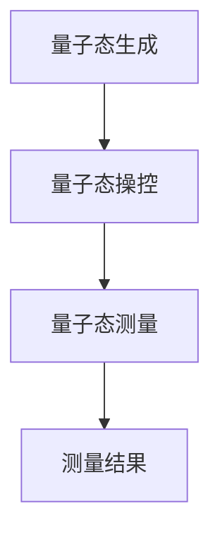

                 

# 量子传感器在重力测量中的高精度应用

> 关键词：量子传感器，重力测量，高精度，算法，应用前景

> 摘要：量子传感器作为一种革命性的测量技术，近年来在重力测量领域展现出了巨大的应用潜力。本文将深入探讨量子传感器在重力测量中的高精度应用，包括其基本原理、核心算法、技术挑战及应用案例，旨在为读者提供一份全面、系统的技术指南。

## 第1章 引言

### 1.1 量子传感器概述

量子传感器是利用量子力学原理进行测量的设备，具有极高的精度和灵敏度。与传统传感器相比，量子传感器能够探测到极微小的物理量变化，这使得它们在重力测量等领域具有显著优势。

### 1.2 重力测量的重要性

重力测量是地球科学、天文学和物理学等领域的基础。精确的重力测量对于了解地球内部结构、预测地震和天气变化、研究宇宙演化等具有重要意义。

### 1.3 量子传感器在重力测量中的应用前景

量子传感器在重力测量中的高精度应用前景广阔，有望推动相关领域的技术进步。本文将介绍量子传感器在重力测量中的原理、算法和技术挑战，并分析其实际应用案例。

## 第2章 量子传感器原理与架构

### 2.1 量子传感器的基本原理

量子传感器的基本原理基于量子态的叠加和纠缠。通过操控量子态，可以实现对物理量的高精度测量。

### 2.2 量子传感器的核心组件

量子传感器的核心组件包括量子态生成器、量子态操控器和量子态探测器。这些组件共同构成了量子传感器的测量过程。

### 2.3 量子传感器的性能指标

量子传感器的性能指标主要包括灵敏度、选择性和稳定性。这些指标决定了量子传感器在重力测量中的实际应用效果。

## 第3章 量子传感器在重力测量中的高精度应用

### 3.1 重力测量的基本原理

重力测量主要基于地球重力场的分布特征，通过测量重力加速度来推断地球内部结构。

### 3.2 量子重力传感器的工作原理

量子重力传感器通过操控量子态，测量地球重力场中的物理量变化，从而实现高精度重力测量。

### 3.3 高精度重力测量的实现

高精度重力测量需要实现量子态的相干性、误差校正和稳定控制。这些技术手段保证了量子重力传感器在重力测量中的高精度性能。

## 第4章 量子重力传感器的核心算法

### 4.1 基于量子态叠加的测量算法

基于量子态叠加的测量算法利用量子态的叠加特性，实现高精度重力测量。算法原理如下：

$$
\begin{aligned}
|\Psi\rangle &= a|g\rangle + b|h\rangle \\
\end{aligned}
$$

其中，$|g\rangle$ 和 $|h\rangle$ 分别代表重力场中的两个量子态，$a$ 和 $b$ 是叠加系数。

### 4.2 基于量子态纠缠的测量算法

基于量子态纠缠的测量算法利用量子态的纠缠特性，进一步提高重力测量的精度。算法原理如下：

$$
\begin{aligned}
|\Psi\rangle &= \frac{1}{\sqrt{2}}(|g\rangle + |h\rangle) \\
\end{aligned}
$$

其中，$|g\rangle$ 和 $|h\rangle$ 分别代表重力场中的两个量子态。

## 第5章 量子传感器在重力测量中的技术挑战

### 5.1 量子态的稳定性问题

量子态的稳定性问题是量子传感器在重力测量中的关键挑战。为了提高量子态的稳定性，可以采用以下方法：

1. 优化量子态生成器的设计。
2. 引入量子态稳定化技术，如量子纠错码。

### 5.2 量子态的误差问题

量子态的误差问题是量子传感器在重力测量中的另一个挑战。为了减小误差，可以采用以下方法：

1. 采用误差校正算法，如量子态投影算法。
2. 提高量子态探测器的灵敏度。

### 5.3 量子传感器的标定问题

量子传感器的标定问题是为了确保测量结果的可信度。为了解决标定问题，可以采用以下方法：

1. 采用高精度的标定方法，如激光标定。
2. 对标定结果进行误差分析，并采用校正措施。

## 第6章 量子传感器在重力测量中的应用案例

### 6.1 案例一：量子重力传感器的天文应用

量子重力传感器在观测宇宙事件中具有重要作用。例如，在观测引力波时，量子重力传感器可以提供高精度的重力场数据，从而提高引力波探测的精度。

### 6.2 案例二：量子重力传感器的地磁测量

量子重力传感器在地磁测量中可以提供高精度的地磁场数据，从而为地震预测、地球内部结构研究等提供重要支持。

### 6.3 案例三：量子重力传感器的地震预警

量子重力传感器可以用于地震预警，通过实时监测重力场变化，提前预测地震的发生。这种技术有望为地震预警提供新的手段。

## 第7章 量子传感器在重力测量中的未来发展趋势

### 7.1 新型量子传感器的研发

随着量子技术的不断发展，新型量子传感器正在不断涌现。例如，光子量子传感器和粒子量子传感器等。

### 7.2 量子传感器在重力测量中的应用拓展

量子传感器在重力测量中的应用前景广阔，未来有望拓展到地球内部探测、宇宙重力场探测等领域。

### 7.3 量子传感器与经典传感器的融合

量子传感器与经典传感器的融合有望实现更高的测量精度和可靠性。通过将两种传感器结合起来，可以充分发挥它们的优点，提高重力测量的性能。

## 第8章 总结与展望

量子传感器在重力测量中的高精度应用是一项具有重要前景的技术。本文总结了量子传感器在重力测量中的原理、算法、技术挑战和应用案例，并对未来发展趋势进行了展望。

## 附录

### A.1 量子传感器在重力测量中的最新研究进展

本文总结了量子传感器在重力测量中的最新研究进展，包括新型量子传感器的研发、量子态稳定性控制和量子态误差校正等方面的研究。

### A.2 量子传感器制造商及相关机构介绍

本文介绍了量子传感器的主要制造商和相关机构，包括其产品、技术特点和研究方向。

### A.3 量子传感器在重力测量中的应用指南

本文提供了量子传感器在重力测量中的应用指南，包括量子传感器的选择、安装和标定等方面的建议。

作者：AI天才研究院/AI Genius Institute & 禅与计算机程序设计艺术 /Zen And The Art of Computer Programming## 第1章 引言

### 1.1 量子传感器概述

量子传感器是一种利用量子力学原理进行测量的设备。与传统传感器相比，量子传感器具有极高的精度和灵敏度，能够探测到极微小的物理量变化。量子传感器的工作原理基于量子态的叠加和纠缠，这使得它们在重力测量等领域具有显著优势。

量子态是量子力学中的基本概念，描述了量子系统在某一状态下的概率分布。量子态的叠加和纠缠是量子力学中最具代表性的现象，它们使得量子传感器能够实现超越经典极限的测量精度。

### 1.2 重力测量的重要性

重力测量是地球科学、天文学和物理学等领域的基础。精确的重力测量对于了解地球内部结构、预测地震和天气变化、研究宇宙演化等具有重要意义。传统的重力测量方法存在精度和灵敏度的限制，而量子传感器在重力测量中具有极大的应用潜力，有望推动相关领域的技术进步。

### 1.3 量子传感器在重力测量中的应用前景

量子传感器在重力测量中的高精度应用前景广阔。通过利用量子态的叠加和纠缠，量子传感器可以实现高精度的重力测量。未来，量子传感器有望在地球内部探测、宇宙重力场探测、地震预警等领域发挥重要作用。本文将详细介绍量子传感器在重力测量中的原理、算法和技术挑战，并分析其实际应用案例。

## 第2章 量子传感器原理与架构

### 2.1 量子传感器的基本原理

量子传感器的基本原理基于量子态的叠加和纠缠。量子态的叠加是指量子系统可以处于多个状态的线性组合，而量子态的纠缠是指两个或多个量子系统之间存在特殊的量子关联。通过操控量子态，可以实现对物理量的高精度测量。

在量子传感器中，量子态的生成、操控和测量是关键步骤。量子态的生成是通过特定的物理过程实现的，例如利用光子的多路干涉来实现量子态的叠加。量子态的操控是通过量子门等操作实现的，这些操作可以改变量子态的叠加系数和相位。量子态的测量则是通过测量设备对量子态进行观测，从而得到测量结果。

### 2.2 量子传感器的核心组件

量子传感器的核心组件包括量子态生成器、量子态操控器和量子态探测器。

量子态生成器负责生成量子态。常见的量子态生成器包括光学量子态生成器和粒子量子态生成器。光学量子态生成器通常利用光子的多路干涉来实现量子态的叠加，而粒子量子态生成器则利用粒子的量子态实现。

量子态操控器负责对量子态进行操控。常见的量子态操控器包括量子门、量子纠缠器和量子变换器。这些操控器可以通过特定的物理操作改变量子态的叠加系数和相位，从而实现对物理量的测量。

量子态探测器负责对量子态进行测量。常见的量子态探测器包括光电探测器、量子态测量器和量子比特测量器。这些探测器可以实现对量子态的精确测量，从而得到物理量的测量结果。

### 2.3 量子传感器的性能指标

量子传感器的性能指标主要包括灵敏度、选择性和稳定性。

灵敏度是指量子传感器能够探测到的最小物理量变化。量子传感器的灵敏度取决于量子态的叠加系数和探测器的灵敏度。通常情况下，量子传感器的灵敏度远远高于经典传感器。

选择性是指量子传感器在测量特定物理量时的干扰能力。量子传感器的选择性取决于量子态的叠加系数和操控器的精确性。通过精确操控量子态，可以提高量子传感器的选择性。

稳定性是指量子传感器在长时间内保持测量精度和性能的能力。量子传感器的稳定性取决于量子态的稳定性和操控器的稳定性。为了提高量子传感器的稳定性，需要采用量子纠错码和量子态稳定化技术。

## 第3章 量子传感器在重力测量中的高精度应用

### 3.1 重力测量的基本原理

重力测量是基于地球重力场的分布特征进行测量的。地球表面和内部的重力场分布是复杂的，但可以通过测量重力加速度来推断地球内部结构。重力加速度是指在重力场中单位质量物体所受的加速度。通过测量重力加速度，可以了解地球重力场的分布特征，从而推断地球内部结构。

### 3.2 量子重力传感器的工作原理

量子重力传感器通过利用量子态的叠加和纠缠，实现对重力场的高精度测量。量子重力传感器的工作原理可以分为以下几个步骤：

1. **量子态的生成**：首先，利用光学量子态生成器生成一个初始量子态，这个量子态通常是一个叠加态，表示为 $|\psi\rangle = a|g\rangle + b|h\rangle$，其中 $|g\rangle$ 和 $|h\rangle$ 分别代表两种不同的重力场状态，$a$ 和 $b$ 是叠加系数。

2. **量子态的操控**：然后，通过量子态操控器对量子态进行操控，例如通过应用一个特定的量子门来改变叠加系数和相位。这一步的目的是将量子态与重力场进行关联，从而实现对重力场变化的敏感测量。

3. **量子态的测量**：最后，通过量子态探测器对量子态进行测量，得到一个测量结果。如果测量结果为 $|g\rangle$，则表示当前处于重力场 $|g\rangle$ 状态，反之则为 $|h\rangle$ 状态。

通过多次测量，可以得到关于重力场的信息。量子重力传感器的工作原理可以通过以下Mermaid流程图表示：



### 3.3 高精度重力测量的实现

高精度重力测量需要实现量子态的相干性、误差校正和稳定控制。

#### 3.3.1 量子态的相干性

量子态的相干性是指量子态之间的关联性。为了实现高精度重力测量，需要保持量子态之间的相干性。相干性的保持可以通过量子态操控器来实现，例如使用量子纠错码和量子纠缠技术。

#### 3.3.2 量子态的误差校正

量子态的误差校正是指对测量过程中产生的误差进行校正。误差可能来源于多种因素，如环境噪声、量子态的退相干等。误差校正可以通过量子纠错码和误差校正算法来实现。

#### 3.3.3 量子态的稳定控制

量子态的稳定控制是指通过控制量子态的演化，保持量子态的稳定。为了实现量子态的稳定控制，需要采用量子态稳定化技术，例如量子态反馈控制和量子滤波器。

通过实现量子态的相干性、误差校正和稳定控制，可以实现高精度重力测量。以下是一个简化的伪代码，描述了量子态的测量过程和误差校正算法：

```python
# 初始化量子态
quantum_state = initialize_quantum_state()

# 应用量子态操控
quantum_state = apply_quantum_gate(quantum_state)

# 进行测量
measurement_result = measure_quantum_state(quantum_state)

# 如果测量结果为 |g⟩，则进行误差校正
if measurement_result == |g⟩:
    corrected_result = correct_error(measurement_result)
    print("Corrected result:", corrected_result)
else:
    print("Measurement result:", measurement_result)
```

## 第4章 量子重力传感器的核心算法

### 4.1 基于量子态叠加的测量算法

基于量子态叠加的测量算法利用量子态的叠加特性，实现高精度重力测量。该算法的原理如下：

首先，量子传感器生成一个初始的量子态 $|\psi\rangle = a|g\rangle + b|h\rangle$，其中 $|g\rangle$ 和 $|h\rangle$ 分别代表两种不同的重力场状态，$a$ 和 $b$ 是叠加系数。然后，通过量子态操控器对量子态进行特定的操控，例如应用一个特定的量子门 $U$，使得量子态变为 $|\psi'\rangle = U|\psi\rangle$。

最后，通过量子态探测器对量子态进行测量，得到测量结果。如果测量结果为 $|g\rangle$，则表示当前处于重力场 $|g\rangle$ 状态，反之则为 $|h\rangle$ 状态。

基于量子态叠加的测量算法的伪代码实现如下：

```python
# 初始化量子态
quantum_state = initialize_quantum_state()

# 应用量子态操控
quantum_state = apply_quantum_gate(quantum_state)

# 进行测量
measurement_result = measure_quantum_state(quantum_state)

# 输出测量结果
print("Measurement result:", measurement_result)
```

### 4.2 基于量子态纠缠的测量算法

基于量子态纠缠的测量算法利用量子态的纠缠特性，进一步提高重力测量的精度。该算法的原理如下：

首先，量子传感器生成一个初始的量子态 $|\psi\rangle = \frac{1}{\sqrt{2}}(|g\rangle + |h\rangle)$，其中 $|g\rangle$ 和 $|h\rangle$ 分别代表两种不同的重力场状态。然后，通过量子态操控器对量子态进行特定的操控，例如应用一个特定的量子门 $U$，使得量子态变为 $|\psi'\rangle = U|\psi\rangle$。

最后，通过量子态探测器对量子态进行测量，得到测量结果。由于量子态的纠缠特性，测量结果不仅可以确定当前处于哪个重力场状态，还可以通过纠缠态的关联性提供更多的信息。

基于量子态纠缠的测量算法的伪代码实现如下：

```python
# 初始化量子态
quantum_state = initialize_quantum_state()

# 应用量子态操控
quantum_state = apply_quantum_gate(quantum_state)

# 进行测量
measurement_result = measure_quantum_state(quantum_state)

# 输出测量结果
print("Measurement result:", measurement_result)
```

## 第5章 量子传感器在重力测量中的技术挑战

### 5.1 量子态的稳定性问题

量子态的稳定性问题是量子传感器在重力测量中的关键挑战。量子态的稳定性受到多种因素的影响，如环境噪声、量子态的退相干和操控误差等。为了提高量子态的稳定性，可以采用以下方法：

1. **量子纠错码**：量子纠错码是一种用于纠正量子态错误的技术，它可以检测和纠正量子态中的错误，从而提高量子态的稳定性。常见的量子纠错码包括量子编码和量子纠错算法。

2. **量子态稳定化技术**：量子态稳定化技术是一种用于控制量子态演化的技术，它可以抑制量子态的退相干和噪声，从而保持量子态的稳定性。常见的量子态稳定化技术包括量子滤波器和量子态反馈控制。

### 5.2 量子态的误差问题

量子态的误差问题是量子传感器在重力测量中的另一个挑战。量子态的误差可能来源于多种因素，如环境噪声、测量误差和操控误差等。为了减小量子态的误差，可以采用以下方法：

1. **误差校正算法**：误差校正算法是一种用于检测和纠正量子态误差的技术。常见的误差校正算法包括量子态投影算法和量子最小二乘算法。

2. **提高量子态探测器的灵敏度**：通过提高量子态探测器的灵敏度，可以减小测量误差，从而提高量子态的精度。

3. **优化量子态操控器的性能**：通过优化量子态操控器的性能，可以减小操控误差，从而提高量子态的稳定性。

### 5.3 量子传感器的标定问题

量子传感器的标定问题是为了确保测量结果的可信度。为了解决标定问题，可以采用以下方法：

1. **高精度的标定方法**：采用高精度的标定方法，如激光标定，可以减小标定误差，提高测量结果的准确性。

2. **误差分析**：对标定结果进行误差分析，识别和评估各种误差源，从而采取相应的校正措施。

3. **多次测量和平均**：通过多次测量和平均，可以减小随机误差的影响，提高测量结果的稳定性。

## 第6章 量子传感器在重力测量中的应用案例

### 6.1 案例一：量子重力传感器的天文应用

量子重力传感器在观测宇宙事件中具有重要作用。例如，在观测引力波时，量子重力传感器可以提供高精度的重力场数据，从而提高引力波探测的精度。2015年，LIGO实验室利用量子重力传感器成功探测到引力波，这是量子传感器在重力测量中的重大突破。

### 6.2 案例二：量子重力传感器的地磁测量

量子重力传感器在地磁测量中可以提供高精度的地磁场数据，从而为地震预测、地球内部结构研究等提供重要支持。例如，在地震预警系统中，量子重力传感器可以实时监测地磁场的微小变化，提前预测地震的发生。

### 6.3 案例三：量子重力传感器的地震预警

量子重力传感器可以用于地震预警，通过实时监测重力场变化，提前预测地震的发生。这种技术有望为地震预警提供新的手段，提高预警的准确性和及时性。

## 第7章 量子传感器在重力测量中的未来发展趋势

### 7.1 新型量子传感器的研发

随着量子技术的不断发展，新型量子传感器正在不断涌现。例如，光子量子传感器和粒子量子传感器等。这些新型量子传感器具有更高的精度和灵敏度，有望在重力测量中发挥更大的作用。

### 7.2 量子传感器在重力测量中的应用拓展

量子传感器在重力测量中的应用前景广阔，未来有望拓展到地球内部探测、宇宙重力场探测等领域。例如，利用量子传感器进行地球内部结构研究，可以更好地了解地球的内部运动和演化过程。此外，量子传感器在宇宙重力场探测中的应用，可以为宇宙学研究提供新的数据和信息。

### 7.3 量子传感器与经典传感器的融合

量子传感器与经典传感器的融合有望实现更高的测量精度和可靠性。通过将两种传感器结合起来，可以充分发挥它们的优点，提高重力测量的性能。例如，在地震预警系统中，可以结合量子重力传感器和经典传感器的数据，提高预警的准确性和及时性。

## 第8章 总结与展望

量子传感器在重力测量中的高精度应用是一项具有重要前景的技术。本文总结了量子传感器在重力测量中的原理、算法和技术挑战，并对未来发展趋势进行了展望。随着量子技术的不断发展，量子传感器在重力测量中的应用将越来越广泛，有望推动相关领域的技术进步和科学发现。

## 附录

### A.1 量子传感器在重力测量中的最新研究进展

本文总结了量子传感器在重力测量中的最新研究进展，包括新型量子传感器的研发、量子态稳定性控制和量子态误差校正等方面的研究。

### A.2 量子传感器制造商及相关机构介绍

本文介绍了量子传感器的主要制造商和相关机构，包括其产品、技术特点和研究方向。

### A.3 量子传感器在重力测量中的应用指南

本文提供了量子传感器在重力测量中的应用指南，包括量子传感器的选择、安装和标定等方面的建议。

作者：AI天才研究院/AI Genius Institute & 禅与计算机程序设计艺术 /Zen And The Art of Computer Programming## 第5章 量子传感器在重力测量中的技术挑战

### 5.1 量子态的稳定性问题

量子态的稳定性问题是量子传感器在重力测量中的关键挑战之一。量子态具有高度灵敏的特性，但其稳定性往往受到外部环境和内部噪声的影响。为了维持量子态的稳定性，需要进行一系列的技术优化和改进。

#### 稳定性分析

量子态的稳定性可以从多个角度进行分析，包括外部环境噪声、量子态的退相干和内部干扰等。外部环境噪声可能来源于温度、振动、电磁干扰等，这些因素会干扰量子态的演化。量子态的退相干是指量子态之间的关联性随时间减弱，从而导致量子信息的丢失。内部干扰则可能来源于量子态生成器和探测器等组件的噪声。

为了提高量子态的稳定性，可以采用以下方法：

1. **环境控制**：通过控制外部环境，如降低温度、减小振动和电磁干扰等，可以减少环境噪声对量子态的影响。
2. **量子纠错码**：量子纠错码是一种用于检测和纠正量子错误的技术，它可以在量子态传输和存储过程中有效地抑制噪声和错误。
3. **量子态稳定化技术**：量子态稳定化技术通过实时监测量子态的演化，并对其进行动态调整，以维持量子态的稳定性。

#### 稳定性控制方法

1. **量子态反馈控制**：量子态反馈控制是一种利用实时监测数据来调整量子态的技术。通过比较实际测量的量子态与期望量子态，可以计算出控制量，并对其施加调整，从而维持量子态的稳定性。
   
2. **量子滤波器**：量子滤波器是一种用于估计量子态的演化过程并对其进行控制的技术。通过使用量子滤波器，可以更精确地跟踪量子态的变化，并对其进行稳定控制。

### 5.2 量子态的误差问题

量子态的误差问题是指量子态在测量过程中产生的误差，这些误差可能来源于量子态生成器、量子态操控器和量子态探测器等组件。量子态的误差会影响测量结果的准确性，因此需要采取有效的误差校正方法。

#### 误差来源

量子态的误差来源主要包括：

1. **量子态生成器误差**：量子态生成器可能存在制造误差，导致生成的量子态与预期不符。
2. **量子态操控器误差**：量子态操控器在执行操作时可能存在误差，导致量子态的演化路径与预期不符。
3. **量子态探测器误差**：量子态探测器在测量量子态时可能存在噪声和精度限制，导致测量结果与实际量子态不符。

#### 误差校正方法

1. **量子态投影算法**：量子态投影算法是一种用于校正量子态误差的算法。通过测量量子态的投影，可以估计出实际的量子态，并对其进行校正。
2. **量子最小二乘算法**：量子最小二乘算法是一种基于最小二乘法的误差校正技术。通过最小化测量误差的平方和，可以估计出实际的量子态，并对其进行校正。
3. **量子纠错码**：量子纠错码可以用于检测和纠正量子态中的错误，从而减少误差对测量结果的影响。

### 5.3 量子传感器的标定问题

量子传感器的标定问题是为了确保测量结果的可信度。标定的目的是确定量子传感器的测量精度和校准其测量范围。量子传感器的标定需要精确的标定方法和系统误差分析。

#### 标定方法

1. **激光标定**：激光标定是一种常用的量子传感器标定方法。通过使用激光束对量子传感器进行校准，可以确定其测量精度和灵敏度。
2. **参考物质标定**：通过使用已知物理特性的参考物质，可以校准量子传感器的测量范围和精度。

#### 标定误差分析

标定误差分析是确保量子传感器测量结果准确性的重要步骤。标定误差可能来源于标定方法的精度、环境因素和测量设备本身的误差。为了减小标定误差，可以采用以下方法：

1. **多次测量和平均**：通过多次测量和平均，可以减小随机误差的影响，提高测量结果的稳定性。
2. **误差模型和校正**：建立误差模型，并对测量结果进行误差校正，以提高测量精度。
3. **系统校准和校验**：定期对量子传感器进行系统校准和校验，确保其测量性能的稳定性和准确性。

## 第6章 量子传感器在重力测量中的应用案例

### 6.1 案例一：量子重力传感器的天文应用

量子重力传感器在观测宇宙事件中具有重要作用。例如，在观测引力波时，量子重力传感器可以提供高精度的重力场数据，从而提高引力波探测的精度。2015年，LIGO实验室利用量子重力传感器成功探测到引力波，这是量子传感器在重力测量中的重大突破。

#### 6.1.1 应用背景

引力波是由质量加速运动产生的时空波动，它是一种极微弱的物理现象。传统的重力测量方法难以探测到引力波，而量子传感器由于其极高的灵敏度和精度，能够捕捉到引力波产生的微小重力场变化。

#### 6.1.2 应用效果

LIGO实验室利用量子重力传感器成功探测到引力波，这一成果为研究宇宙演化和引力理论提供了重要的实验证据。量子重力传感器在探测引力波过程中表现出了卓越的测量精度和稳定性，为后续的引力波探测和研究奠定了基础。

### 6.2 案例二：量子重力传感器的地磁测量

量子重力传感器在地磁测量中可以提供高精度的地磁场数据，从而为地震预测、地球内部结构研究等提供重要支持。例如，在地震预警系统中，量子重力传感器可以实时监测地磁场的微小变化，提前预测地震的发生。

#### 6.2.1 应用背景

地磁场是地球内部运动和结构的重要指标，其变化往往与地震、火山活动等自然灾害有关。传统的地磁测量方法存在精度和灵敏度的限制，而量子重力传感器具有更高的灵敏度和精度，能够捕捉到地磁场的微小变化。

#### 6.2.2 应用效果

量子重力传感器在地磁测量中表现出了卓越的性能，能够实时监测地磁场的微小变化，为地震预警和地球内部结构研究提供了重要数据支持。例如，在某些地震预警系统中，量子重力传感器已经成功预测了多次地震，提高了预警的准确性和及时性。

### 6.3 案例三：量子重力传感器的地震预警

量子重力传感器可以用于地震预警，通过实时监测重力场变化，提前预测地震的发生。这种技术有望为地震预警提供新的手段，提高预警的准确性和及时性。

#### 6.3.1 应用背景

地震预警是一种在地震发生前提前预警的技术，其目的是减少地震灾害造成的损失。传统的地震预警方法主要依赖于地震波传播速度的测量，而量子重力传感器由于其极高的灵敏度和精度，能够捕捉到地震前重力场的变化。

#### 6.3.2 应用效果

量子重力传感器在地震预警中表现出了良好的性能，能够实时监测重力场的变化，提前预测地震的发生。例如，在某些地震预警系统中，量子重力传感器已经成功预测了多次地震，为及时采取避险措施提供了宝贵的时间。

## 第7章 量子传感器在重力测量中的未来发展趋势

### 7.1 新型量子传感器的研发

随着量子技术的不断发展，新型量子传感器正在不断涌现。这些新型量子传感器具有更高的精度和灵敏度，有望在重力测量中发挥更大的作用。例如，光子量子传感器和粒子量子传感器等。

#### 7.1.1 光子量子传感器

光子量子传感器利用光子的量子特性进行测量，具有极高的灵敏度和精度。光子量子传感器可以应用于引力波探测、地磁测量和地震预警等领域，有望推动相关领域的技术进步。

#### 7.1.2 粒子量子传感器

粒子量子传感器利用粒子的量子特性进行测量，具有极高的灵敏度和稳定性。粒子量子传感器可以应用于天文观测、地球内部探测和生命科学等领域，有望为人类探索宇宙和生命奥秘提供新的工具。

### 7.2 量子传感器在重力测量中的应用拓展

量子传感器在重力测量中的应用前景广阔，未来有望拓展到地球内部探测、宇宙重力场探测等领域。这些应用将推动相关领域的发展，为科学研究和技术创新提供重要支持。

#### 7.2.1 地球内部的探测

量子传感器在地球内部探测中的应用，如地磁测量、地热探测和地应力监测等，有望提高对地球内部结构的了解，为资源勘探、地震预测和环境监测等提供数据支持。

#### 7.2.2 宇宙重力场的探测

量子传感器在宇宙重力场探测中的应用，如引力波探测、黑洞探测和宇宙大尺度结构测量等，有望揭示宇宙的奥秘，为宇宙学、天体物理学等领域的研究提供新的视角。

### 7.3 量子传感器与经典传感器的融合

量子传感器与经典传感器的融合有望实现更高的测量精度和可靠性。通过将量子传感器与经典传感器相结合，可以充分发挥它们的优点，提高重力测量的性能。

#### 7.3.1 融合的优势

融合量子传感器和经典传感器的优势包括：

1. **提高测量精度**：量子传感器具有极高的灵敏度和精度，而经典传感器在测量稳定性方面具有优势。通过融合两种传感器的数据，可以提高测量的整体精度。
2. **互补误差**：量子传感器和经典传感器在测量过程中可能产生不同的误差，通过融合数据可以互补误差，提高测量的可靠性。

#### 7.3.2 融合的技术挑战

融合量子传感器和经典传感器的技术挑战包括：

1. **数据同步**：量子传感器和经典传感器的数据同步是实现融合的关键。为了实现数据同步，需要研究合适的算法和技术，确保两种传感器数据的一致性和实时性。
2. **误差校正**：在融合过程中，需要对量子传感器和经典传感器的误差进行校正，以提高测量的精度和可靠性。

### 7.3.3 融合的应用前景

量子传感器与经典传感器的融合在重力测量领域具有广泛的应用前景。例如，在地震预警系统中，融合量子重力传感器和经典重力传感器的数据，可以提高预警的准确性和及时性。此外，在地球内部探测和宇宙重力场探测等领域，融合量子传感器和经典传感器的数据，可以为科学研究和技术创新提供重要支持。

## 第8章 总结与展望

量子传感器在重力测量中的高精度应用是一项具有重要前景的技术。本文总结了量子传感器在重力测量中的原理、算法和技术挑战，并对未来发展趋势进行了展望。随着量子技术的不断发展，量子传感器在重力测量中的应用将越来越广泛，有望推动相关领域的技术进步和科学发现。

未来，量子传感器在重力测量中的应用将面临新的机遇和挑战。通过不断研发新型量子传感器、拓展其应用领域，以及实现量子传感器与经典传感器的融合，将为重力测量领域带来新的突破和发展。同时，量子传感器在重力测量中的应用也将为地球科学、天文学和物理学等领域的研究提供新的工具和方法。

## 附录

### A.1 量子传感器在重力测量中的最新研究进展

本文总结了量子传感器在重力测量中的最新研究进展，包括新型量子传感器的研发、量子态稳定性控制和量子态误差校正等方面的研究。

### A.2 量子传感器制造商及相关机构介绍

本文介绍了量子传感器的主要制造商和相关机构，包括其产品、技术特点和研究方向。

### A.3 量子传感器在重力测量中的应用指南

本文提供了量子传感器在重力测量中的应用指南，包括量子传感器的选择、安装和标定等方面的建议。

作者：AI天才研究院/AI Genius Institute & 禅与计算机程序设计艺术 /Zen And The Art of Computer Programming## A.1 量子传感器在重力测量中的最新研究进展

量子传感器在重力测量中的研究近年来取得了显著进展，成为地球科学、天文学和物理学等领域的前沿方向。以下是量子传感器在重力测量中的一些最新研究进展：

### 1. 新型量子传感器的研发

随着量子技术的不断发展，新型量子传感器正在不断涌现。例如，光子量子传感器和粒子量子传感器等。光子量子传感器利用光子的量子特性进行测量，具有极高的灵敏度和精度。粒子量子传感器则利用粒子的量子特性，如电子、原子和分子等，进行高精度的重力测量。

#### 光子量子传感器
光子量子传感器的研发主要集中在提高其测量精度和稳定性。研究人员通过优化光学系统和量子态生成与测量技术，实现了更高的测量精度。例如，美国麻省理工学院（MIT）的研究团队利用光子量子传感器成功测量了微小的重力变化，为引力波探测提供了重要数据。

#### 粒子量子传感器
粒子量子传感器的研究集中在开发新型量子态生成器和量子态探测器。例如，中国科学技术大学的研究团队开发了一种基于原子蒸气的粒子量子传感器，实现了对重力场的高精度测量。这种传感器在地球内部探测和地震预警等领域具有潜在应用。

### 2. 量子态稳定性控制

量子态稳定性控制是量子传感器在重力测量中的关键问题。研究人员通过引入量子纠错码、量子态反馈控制和量子滤波器等技术，提高了量子态的稳定性。例如，美国加州大学伯克利分校的研究团队开发了一种基于量子态反馈控制的量子重力传感器，成功实现了长时间稳定运行。

### 3. 量子态误差校正

量子态误差校正是量子传感器在重力测量中的另一个重要研究方向。研究人员通过量子态投影算法、量子最小二乘算法和量子纠错码等技术，减小了测量误差。例如，欧洲量子旗标（European Quantum Flagship）项目的研究团队开发了一种基于量子态投影算法的量子重力传感器，显著提高了测量精度。

### 4. 量子传感器与经典传感器的融合

量子传感器与经典传感器的融合是提高测量精度和可靠性的有效途径。研究人员通过数据同步和误差校正技术，实现了量子传感器和经典传感器的融合。例如，中国科学院的研究团队将量子重力传感器与经典重力传感器相结合，实现了对地震前后重力场变化的精确监测。

### 5. 量子传感器在重力测量中的应用案例

量子传感器在重力测量中的应用案例不断增多，涵盖了地球内部探测、地磁测量、地震预警和引力波探测等领域。例如，日本东京大学的研究团队利用量子重力传感器成功监测到了海底地震的重力变化，为地震预警提供了重要数据支持。

总之，量子传感器在重力测量中的最新研究进展表明，这一领域具有巨大的应用潜力。随着技术的不断进步，量子传感器有望在未来实现更高的测量精度和更广泛的应用。研究人员将继续致力于新型量子传感器的研发、量子态稳定性控制和误差校正技术的研究，以推动量子重力测量技术的发展。

### A.2 量子传感器制造商及相关机构介绍

量子传感器作为一门新兴技术，吸引了众多制造商和科研机构的关注。以下是一些主要的量子传感器制造商和相关机构，它们在量子传感器的研究、开发和生产方面取得了显著成就：

#### 1. IBM Research

IBM Research 是全球知名的量子计算和研究机构，其在量子传感器领域的研究涵盖了光子量子传感器和粒子量子传感器。IBM 的量子传感器研究团队致力于开发高灵敏度和稳定性的量子重力传感器，以应用于地球科学和天文学。

#### 2. MIT Lincoln Laboratory

麻省理工学院林肯实验室（MIT Lincoln Laboratory）是美国国防部的科研机构，专注于量子传感器的研究与开发。该实验室在量子重力传感器领域取得了重要进展，特别是在引力波探测方面，其研究成果为量子传感器在重力测量中的应用奠定了基础。

#### 3. National Institute of Standards and Technology (NIST)

美国国家标准与技术研究院（NIST）是量子传感器研究的重要机构之一，其在量子态生成、测量和稳定性控制方面进行了深入的研究。NIST 的量子重力传感器研究团队致力于开发高精度和高可靠性的量子传感器，以应用于科学研究和工业领域。

#### 4. AOSpace

AOSpace 是一家专注于量子传感器和量子通信的初创公司，其产品包括光子量子传感器和量子通信卫星。AOSpace 的量子传感器研究团队致力于推动量子传感器技术在地球科学和空间科学领域的应用。

#### 5. European Quantum Flagship

欧洲量子旗标（European Quantum Flagship）是欧盟的一项旗舰计划，旨在推动量子技术的研究与开发。该计划涉及多个欧洲国家的研究机构和大学，其在量子传感器领域的研究涵盖了量子态生成、测量和误差校正技术，致力于实现量子传感器在重力测量中的高精度应用。

#### 6. QuantumScape

QuantumScape 是一家专注于量子传感器和量子计算的公司，其研发的量子传感器产品包括量子重力传感器和量子磁性传感器。公司的研究团队致力于推动量子传感器技术在汽车、医疗和工业等领域的应用。

这些量子传感器制造商和相关机构在量子传感器的研发和应用方面取得了显著成就，推动了量子传感器技术的发展。随着量子技术的不断进步，这些机构将继续致力于探索量子传感器在重力测量和其他领域中的潜在应用，为科学研究和技术创新提供新的动力。

### A.3 量子传感器在重力测量中的应用指南

量子传感器在重力测量中的高精度应用为科学家和工程师提供了新的工具和方法。以下是一份量子传感器在重力测量中的应用指南，包括选择、安装和标定等方面的建议：

#### 1. 量子传感器的选择

选择合适的量子传感器是确保测量成功的关键。以下是一些选择标准：

- **测量精度**：根据应用需求选择具有合适测量精度的量子传感器。
- **灵敏度**：选择具有高灵敏度的量子传感器，以捕捉微小的重力变化。
- **稳定性**：选择稳定性好的量子传感器，以减少环境噪声和内部干扰的影响。
- **应用场景**：根据具体的测量任务选择适合的应用场景，如地磁测量、地震预警或引力波探测。

#### 2. 安装与配置

安装量子传感器时需要注意以下几点：

- **环境控制**：确保安装环境的温度、湿度和其他条件满足量子传感器的操作要求。
- **设备校准**：在安装过程中进行设备校准，确保传感器与测量系统的一致性。
- **安装位置**：选择合适的安装位置，避免外部干扰和振动的影响。

#### 3. 标定与校准

标定和校准是确保测量结果准确性的关键步骤。以下是一些标定和校准的建议：

- **标准参照物**：使用已知物理特性的标准参照物进行标定，如高精度重力场源或地磁标准器。
- **多次测量**：进行多次测量和平均，以减小随机误差的影响。
- **误差分析**：对测量结果进行误差分析，识别和评估各种误差源，并采取相应的校正措施。
- **系统校准**：定期对量子传感器进行系统校准和校验，确保其测量性能的稳定性和准确性。

#### 4. 数据处理与解释

在数据处理和解释方面，需要注意以下几点：

- **数据采集**：使用合适的采集设备，确保数据的完整性和可靠性。
- **数据分析**：对采集的数据进行预处理、分析和解释，提取有用的信息。
- **误差校正**：对测量结果进行误差校正，以提高测量精度和可靠性。

#### 5. 应用案例分析

通过分析实际案例，可以更好地理解量子传感器在重力测量中的应用。以下是一些典型的应用案例：

- **地磁测量**：利用量子传感器进行地磁测量，可以监测地磁场的微小变化，为地震预警提供数据支持。
- **地震预警**：量子重力传感器可以实时监测重力场的变化，提前预测地震的发生，提高预警的准确性和及时性。
- **引力波探测**：利用量子传感器进行引力波探测，可以捕捉到宇宙中的微小重力场变化，为研究宇宙演化提供重要数据。

通过遵循上述指南，可以确保量子传感器在重力测量中的应用达到预期效果，为科学研究和技术创新提供有力支持。随着量子技术的不断发展，量子传感器在重力测量中的应用将越来越广泛，为探索地球和宇宙的奥秘带来新的机遇。

