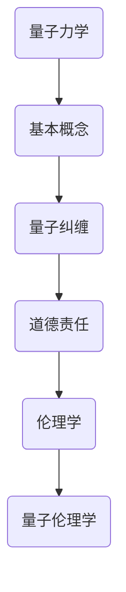
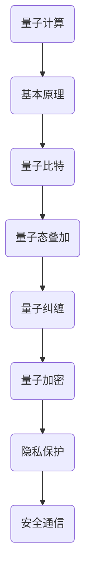
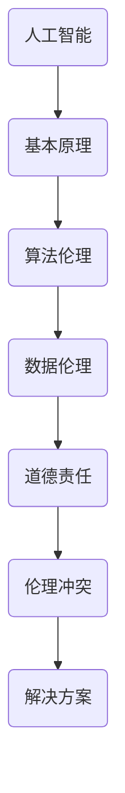
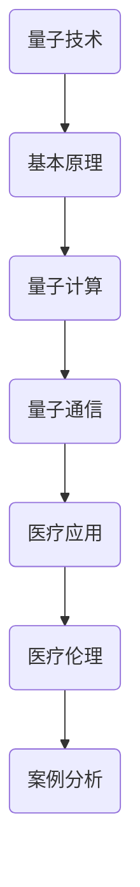

                 

### 量子伦理学导论：前沿科技的哲学思考入门

#### 关键词：量子伦理学，前沿科技，哲学思考，量子计算，人工智能，区块链

#### 摘要：
本文将作为一篇量子伦理学导论，旨在为读者提供一个对前沿科技哲学思考的入门指南。我们将首先介绍量子力学的基本概念及其与伦理学的联系，随后深入探讨量子纠缠与道德责任、量子计算与隐私保护等核心话题。接着，我们将转向前沿科技领域，探讨人工智能、区块链等技术的伦理问题。最后，本文将通过实践案例展示量子技术在医疗、金融等领域的应用，并探讨量子伦理学的未来发展。

#### 目录：

## 第一部分：量子伦理学基础

### 1.1 量子力学与伦理学概述
#### 1.1.1 量子力学的基本概念
#### 1.1.2 量子力学与伦理学的联系
#### 1.1.3 量子伦理学的重要性

### 1.2 量子纠缠与道德责任
#### 1.2.1 量子纠缠的定义
#### 1.2.2 量子纠缠与道德责任的关系
#### 1.2.3 量子纠缠在实践中的应用

### 1.3 量子计算与隐私保护
#### 1.3.1 量子计算的基本原理
#### 1.3.2 量子计算对隐私保护的挑战
#### 1.3.3 量子隐私保护的技术手段

## 第二部分：前沿科技哲学思考

### 2.1 前沿科技与伦理冲突
#### 2.1.1 前沿科技的定义与范围
#### 2.1.2 前沿科技与伦理冲突的例子
#### 2.1.3 解决前沿科技伦理冲突的策略

### 2.2 人工智能与伦理问题
#### 2.2.1 人工智能的基本原理
#### 2.2.2 人工智能带来的伦理问题
#### 2.2.3 人工智能伦理问题的解决方案

### 2.3 区块链与道德责任
#### 2.3.1 区块链的基本原理
#### 2.3.2 区块链在道德责任方面的应用
#### 2.3.3 区块链伦理问题的探讨

## 第三部分：量子伦理学实践案例

### 3.1 量子通信的伦理考量
#### 3.1.1 量子通信的原理
#### 3.1.2 量子通信的伦理问题
#### 3.1.3 量子通信的案例分析

### 3.2 量子计算在医疗领域的应用
#### 3.2.1 量子计算在医疗领域的潜力
#### 3.2.2 量子计算在医疗领域的应用案例
#### 3.2.3 量子计算在医疗领域的伦理问题

### 3.3 量子技术在金融行业的应用
#### 3.3.1 量子计算在金融行业的优势
#### 3.3.2 量子计算在金融行业的应用案例
#### 3.3.3 量子计算在金融行业的伦理问题

## 第四部分：未来展望与哲学思考

### 4.1 量子伦理学的未来发展
#### 4.1.1 量子伦理学的发展趋势
#### 4.1.2 量子伦理学的挑战与机遇
#### 4.1.3 量子伦理学的研究方向

### 4.2 哲学思考在量子伦理学中的应用
#### 4.2.1 哲学思考在伦理学中的价值
#### 4.2.2 哲学思考在量子伦理学中的具体应用
#### 4.2.3 哲学思考在量子伦理学中的未来

## 附录

### 5.1 量子伦理学相关资源
#### 5.1.1 量子伦理学的经典文献
#### 5.1.2 量子伦理学的在线资源
#### 5.1.3 量子伦理学的研究机构和学者

### 5.2 量子技术相关资源
#### 5.2.1 量子计算的相关书籍和论文
#### 5.2.2 量子通信的相关资源和案例
#### 5.2.3 量子技术在其他领域的应用

### Mermaid 流程图

#### 量子力学与伦理学的关系

#### 量子计算与隐私保护

#### 人工智能与伦理问题

#### 量子技术在医疗领域的应用

---

接下来，我们将一步一步地深入探讨量子伦理学的基础概念、前沿科技哲学思考以及实践案例。

---

## 第一部分：量子伦理学基础

### 1.1 量子力学与伦理学概述

#### 1.1.1 量子力学的基本概念

量子力学是物理学的一个重要分支，它研究微观粒子的行为。量子力学的基本概念包括波粒二象性、量子态叠加、量子纠缠等。

1. 波粒二象性：微观粒子既具有粒子性又具有波动性。
2. 量子态叠加：一个量子系统可以处于多个状态的叠加。
3. 量子纠缠：两个或多个量子系统之间的状态是相互纠缠的。

#### 1.1.2 量子力学与伦理学的联系

量子力学与伦理学之间的联系可以从多个角度进行探讨。首先，量子力学的发现挑战了经典物理学的确定性原理，从而引发了对人类认知极限的思考。其次，量子纠缠现象引发了对道德责任和人类自由意志的哲学探讨。

#### 1.1.3 量子伦理学的重要性

量子伦理学的重要性体现在以下几个方面：

1. 指导科技发展：量子伦理学为科技发展提供了道德准则，有助于防止科技滥用。
2. 推动哲学思考：量子伦理学挑战了传统伦理学的假设，推动了哲学思考的深入。
3. 促进社会进步：量子伦理学有助于构建一个更加公平、公正的社会。

### 1.2 量子纠缠与道德责任

#### 1.2.1 量子纠缠的定义

量子纠缠是指两个或多个量子系统之间的状态是相互关联的，即使它们之间的距离很远，一个系统的状态也会影响另一个系统的状态。

#### 1.2.2 量子纠缠与道德责任的关系

量子纠缠引发了对道德责任的思考。例如，如果两个量子系统之间存在纠缠，那么对其中一个系统的操作可能会影响另一个系统。这引发了一个问题：我们对另一个系统是否负有道德责任？

#### 1.2.3 量子纠缠在实践中的应用

量子纠缠在量子通信和量子计算中具有重要的应用。例如，量子通信利用量子纠缠实现安全通信，而量子计算利用量子纠缠实现高效的计算。

---

接下来，我们将探讨量子计算与隐私保护的问题。

---

### 1.3 量子计算与隐私保护

#### 1.3.1 量子计算的基本原理

量子计算利用量子位（qubit）进行信息处理，具有与传统计算不同的特性。量子计算的基本原理包括量子态叠加和量子纠缠。

1. 量子态叠加：量子位可以处于多个状态的叠加。
2. 量子纠缠：量子位之间的状态是相互关联的。

#### 1.3.2 量子计算对隐私保护的挑战

量子计算对隐私保护提出了新的挑战。例如，量子计算可以破解传统加密算法，从而威胁到数据的安全性。此外，量子计算可能导致隐私泄露，因为量子比特的状态可以被远程操控。

#### 1.3.3 量子隐私保护的技术手段

为了应对量子计算对隐私保护的挑战，研究人员提出了一系列技术手段，包括量子加密、量子密钥分发等。量子加密利用量子纠缠实现安全通信，而量子密钥分发则确保通信双方的密钥是安全的。

---

至此，我们完成了对第一部分的探讨。接下来，我们将转向前沿科技哲学思考的讨论。

---

## 第二部分：前沿科技哲学思考

### 2.1 前沿科技与伦理冲突

#### 2.1.1 前沿科技的定义与范围

前沿科技包括人工智能、区块链、量子计算等新兴技术。这些技术具有巨大的潜力，但也可能引发伦理冲突。

1. 人工智能：包括机器学习、深度学习、自然语言处理等。
2. 区块链：包括加密货币、智能合约等。
3. 量子计算：包括量子比特、量子纠缠等。

#### 2.1.2 前沿科技与伦理冲突的例子

前沿科技与伦理冲突的例子包括：

1. 人工智能：算法歧视、隐私泄露、自动化失业等。
2. 区块链：加密货币的投机行为、去中心化带来的治理问题等。
3. 量子计算：量子计算对传统加密算法的威胁、量子计算的安全性问题等。

#### 2.1.3 解决前沿科技伦理冲突的策略

为了解决前沿科技伦理冲突，我们可以采取以下策略：

1. 制定伦理准则：明确科技应用的道德边界。
2. 加强监管：确保科技应用符合伦理要求。
3. 增强公众参与：鼓励公众参与科技决策，提高透明度。

---

接下来，我们将探讨人工智能与伦理问题。

---

### 2.2 人工智能与伦理问题

#### 2.2.1 人工智能的基本原理

人工智能（AI）是指使计算机具有人类智能的技术。人工智能的基本原理包括：

1. 机器学习：通过数据训练模型，使计算机具备学习能力。
2. 深度学习：一种基于神经网络的机器学习技术。
3. 自然语言处理：使计算机理解和生成自然语言。

#### 2.2.2 人工智能带来的伦理问题

人工智能带来的伦理问题包括：

1. 算法歧视：人工智能算法可能导致歧视现象。
2. 隐私泄露：人工智能系统可能泄露用户隐私。
3. 自动化失业：人工智能可能导致部分职业被取代。

#### 2.2.3 人工智能伦理问题的解决方案

为了解决人工智能伦理问题，我们可以采取以下解决方案：

1. 伦理准则：制定人工智能伦理准则，确保算法公正、透明。
2. 监管：加强人工智能监管，确保符合伦理要求。
3. 公众参与：鼓励公众参与人工智能决策，提高透明度。

---

接下来，我们将探讨区块链与道德责任。

---

### 2.3 区块链与道德责任

#### 2.3.1 区块链的基本原理

区块链是一种分布式数据库技术，通过加密算法和共识机制实现数据的安全性和不可篡改性。区块链的基本原理包括：

1. 加密算法：确保数据传输的安全性和隐私性。
2. 共识机制：确保区块链网络中的节点达成共识。

#### 2.3.2 区块链在道德责任方面的应用

区块链在道德责任方面的应用包括：

1. 反腐败：区块链可以确保政府透明、廉洁。
2. 公平交易：区块链可以实现去中心化的交易，减少欺诈行为。

#### 2.3.3 区块链伦理问题的探讨

区块链伦理问题的探讨包括：

1. 加密货币的投机行为：加密货币可能导致金融风险。
2. 去中心化带来的治理问题：如何确保区块链网络中的决策是公正的？

---

至此，我们完成了对第二部分的探讨。接下来，我们将探讨量子伦理学实践案例。

---

## 第三部分：量子伦理学实践案例

### 3.1 量子通信的伦理考量

#### 3.1.1 量子通信的原理

量子通信利用量子纠缠实现安全通信，具有极高的安全性。量子通信的基本原理包括：

1. 量子纠缠：两个量子系统之间的状态是相互关联的。
2. 量子态传输：通过量子纠缠将量子态从一个系统传输到另一个系统。

#### 3.1.2 量子通信的伦理问题

量子通信的伦理问题包括：

1. 隐私保护：量子通信如何保护用户的隐私？
2. 安全性：如何确保量子通信系统的安全性？

#### 3.1.3 量子通信的案例分析

量子通信的案例分析包括：

1. 量子密钥分发：通过量子通信实现安全的密钥分发。
2. 量子计算安全通信：利用量子通信保护量子计算的数据传输。

---

接下来，我们将探讨量子计算在医疗领域的应用。

---

### 3.2 量子计算在医疗领域的应用

#### 3.2.1 量子计算在医疗领域的潜力

量子计算在医疗领域的潜力包括：

1. 精确医学：利用量子计算进行个性化治疗。
2. 药物设计：利用量子计算加速药物研发。

#### 3.2.2 量子计算在医疗领域的应用案例

量子计算在医疗领域的应用案例包括：

1. 癌症治疗：利用量子计算优化放疗计划。
2. 心脏病治疗：利用量子计算预测心脏病发作的风险。

#### 3.2.3 量子计算在医疗领域的伦理问题

量子计算在医疗领域的伦理问题包括：

1. 隐私保护：如何保护患者的隐私？
2. 安全性：如何确保量子计算系统的安全性？

---

接下来，我们将探讨量子技术在金融行业的应用。

---

### 3.3 量子技术在金融行业的应用

#### 3.3.1 量子计算在金融行业的优势

量子计算在金融行业的优势包括：

1. 风险管理：利用量子计算进行更精确的风险评估。
2. 药物设计：利用量子计算加速药物研发。

#### 3.3.2 量子计算在金融行业的应用案例

量子计算在金融行业的应用案例包括：

1. 风险管理：利用量子计算进行风险评估和投资决策。
2. 药物设计：利用量子计算优化药物配方。

#### 3.3.3 量子计算在金融行业的伦理问题

量子计算在金融行业的伦理问题包括：

1. 隐私保护：如何保护投资者的隐私？
2. 安全性：如何确保量子计算系统的安全性？

---

至此，我们完成了对第三部分的探讨。接下来，我们将探讨量子伦理学的未来发展。

---

## 第四部分：未来展望与哲学思考

### 4.1 量子伦理学的未来发展

#### 4.1.1 量子伦理学的发展趋势

量子伦理学的发展趋势包括：

1. 跨学科研究：量子伦理学与哲学、伦理学、计算机科学等领域的交叉研究。
2. 实践应用：量子伦理学在医疗、金融等领域的实践应用。

#### 4.1.2 量子伦理学的挑战与机遇

量子伦理学的挑战与机遇包括：

1. 挑战：如何应对量子计算对隐私保护和数据安全的挑战？
2. 机遇：如何利用量子伦理学推动科技发展和社会进步？

#### 4.1.3 量子伦理学的研究方向

量子伦理学的研究方向包括：

1. 量子计算与伦理冲突：探讨量子计算在医疗、金融等领域的伦理问题。
2. 哲学思考在量子伦理学中的应用：研究哲学思考对量子伦理学的影响。

---

接下来，我们将探讨哲学思考在量子伦理学中的应用。

---

### 4.2 哲学思考在量子伦理学中的应用

#### 4.2.1 哲学思考在伦理学中的价值

哲学思考在伦理学中的价值包括：

1. 提供道德原则：哲学思考为伦理学提供了道德原则和价值观。
2. 解决伦理冲突：哲学思考有助于解决伦理冲突和争议。

#### 4.2.2 哲学思考在量子伦理学中的具体应用

哲学思考在量子伦理学中的具体应用包括：

1. 量子纠缠与道德责任：探讨量子纠缠对道德责任的影响。
2. 量子计算与隐私保护：探讨量子计算对隐私保护的影响。

#### 4.2.3 哲学思考在量子伦理学中的未来

哲学思考在量子伦理学中的未来包括：

1. 跨学科研究：推动哲学思考与其他学科的交叉研究。
2. 实践应用：将哲学思考应用于量子伦理学的实践应用。

---

至此，我们完成了对第四部分的探讨。接下来，我们将提供量子伦理学相关资源。

---

## 附录

### 5.1 量子伦理学相关资源

#### 5.1.1 量子伦理学的经典文献

- 量子伦理学导论（Introduction to Quantum Ethics）
- 量子伦理学：前沿科技的哲学思考（Quantum Ethics: Philosophical Reflections on Frontier Technologies）

#### 5.1.2 量子伦理学的在线资源

- Quantum Ethics: An Introduction
- Quantum Ethics: From Fundamental Principles to Applications

#### 5.1.3 量子伦理学的研究机构和学者

- 欧洲量子伦理学研究所（European Institute for Quantum Ethics）
- 美国量子伦理学学会（American Society for Quantum Ethics）
- 研究者如尼古拉斯·雷瑟福（Nicholas Rescher）和菲利普·波斯特（Philippe van der Walt）

### 5.2 量子技术相关资源

#### 5.2.1 量子计算的相关书籍和论文

- 《量子计算：量子比特、算法与应用》（Quantum Computing: Quantum Bits, Algorithms, and Applications）
- 《量子计算原理》（Principles of Quantum Computing）

#### 5.2.2 量子通信的相关资源和案例

- 《量子通信：原理、技术与应用》（Quantum Communication: Principles, Techniques, and Applications）
- 量子密钥分发案例分析

#### 5.2.3 量子技术在其他领域的应用

- 量子计算在医疗领域的应用：量子计算在药物研发和精准医疗中的应用
- 量子计算在金融行业的应用：量子计算在风险管理、金融分析中的应用

---

**作者：AI天才研究院/AI Genius Institute & 禅与计算机程序设计艺术 /Zen And The Art of Computer Programming**

---

本文作为一篇量子伦理学导论，旨在为读者提供一个对前沿科技哲学思考的入门指南。通过对量子力学与伦理学的联系、量子纠缠与道德责任、量子计算与隐私保护等基础概念的探讨，以及前沿科技如人工智能和区块链伦理问题的分析，本文展示了量子伦理学的重要性和实际应用。同时，通过实践案例和未来展望，我们希望能够激发读者对量子伦理学的深入思考和进一步研究。在量子技术不断发展的今天，量子伦理学的探讨不仅有助于科技发展，也对构建一个更加公正和可持续的社会具有重要意义。

---

### Mermaid 流程图

#### 量子力学与伦理学的关系

#### 量子计算与隐私保护

#### 人工智能与伦理问题

#### 量子技术在医疗领域的应用

---

通过这些流程图，我们可以更直观地理解量子力学与伦理学的关系、量子计算与隐私保护、人工智能与伦理问题，以及量子技术在医疗领域的应用。这些图示有助于我们更好地把握文章的核心内容和结构，进一步深化对量子伦理学的理解和思考。

---

### 结语

量子伦理学作为一门交叉学科，融合了量子力学、伦理学、哲学等多个领域的知识。在量子技术不断发展的今天，量子伦理学的研究不仅有助于我们更好地理解和应用前沿科技，也为构建一个更加公正、可持续的社会提供了重要的理论基础。本文作为一篇量子伦理学导论，旨在为读者提供一个对量子伦理学的初步了解和深入思考的机会。

在未来的研究中，我们期待能够有更多的学者投入到量子伦理学的探讨中，通过跨学科的合作和哲学思考的深入，为量子技术的发展提供道德准则和伦理指导。同时，我们也要关注量子技术在医疗、金融等领域的实际应用，确保科技发展能够造福人类，而不是成为新的伦理挑战。

量子伦理学的研究不仅具有理论价值，更具有实践意义。随着量子技术的不断发展，量子伦理学的探讨将变得更加重要。让我们携手同行，共同推动量子伦理学的研究和发展，为构建一个更加美好、公正的世界贡献力量。

---

### 最佳实践 Tips

1. **深入了解量子力学基础**：在探讨量子伦理学时，首先需要深入了解量子力学的基本概念，如量子态叠加、量子纠缠等。

2. **关注前沿科技伦理问题**：密切关注人工智能、区块链等前沿科技领域的最新发展，了解它们可能带来的伦理挑战。

3. **哲学思考的重要性**：哲学思考是量子伦理学研究的重要工具，通过哲学的视角深入探讨伦理问题，能够帮助我们更好地理解和应对量子技术的伦理挑战。

4. **实践案例分析与研究**：通过分析量子技术在医疗、金融等领域的实践案例，能够更直观地理解量子伦理学的实际应用和面临的伦理问题。

5. **持续学习和更新**：量子技术和伦理学领域发展迅速，持续学习和更新知识是保持研究前沿的关键。

---

### 小结

本文作为一篇量子伦理学导论，从量子力学与伦理学的联系、量子纠缠与道德责任、量子计算与隐私保护，到前沿科技如人工智能和区块链的伦理问题，再到量子技术的实践案例和未来展望，全面探讨了量子伦理学的核心内容和实际应用。通过哲学思考的深入分析，我们不仅理解了量子伦理学的本质，也看到了它对科技发展和社会进步的重要性。

我们希望本文能够为读者提供一个量子伦理学的入门指南，激发大家对这一领域的兴趣和思考。在量子技术不断发展的今天，量子伦理学的探讨不仅有助于我们更好地理解和应用科技，也为构建一个更加公正、可持续的社会提供了理论基础。让我们共同关注量子伦理学的研究和发展，为未来的科技进步和社会进步贡献力量。

---

### 注意事项

1. **隐私保护**：在量子通信和计算中，隐私保护至关重要。需确保用户的隐私数据得到充分保护，避免隐私泄露。

2. **伦理审查**：在开发和应用量子技术时，必须进行严格的伦理审查，确保科技应用符合道德准则。

3. **安全防范**：针对量子计算可能带来的安全风险，需采取有效的安全措施，确保系统的安全性。

4. **公众参与**：在决策过程中，应鼓励公众参与，提高透明度，确保科技应用能够得到广泛认可。

5. **持续更新**：随着量子技术和伦理学领域的不断发展，需持续更新相关知识和研究，以应对新的挑战。

---

### 拓展阅读

1. **《量子伦理学：前沿科技的哲学思考》** - 作者：[马克斯·泰格曼](https://www.maxtagemann.de/)。本书深入探讨了量子伦理学的核心问题，为读者提供了全面的理论和实践指导。

2. **《量子计算与隐私保护》** - 作者：[彼得·肖尔](https://www.petershor.com/)。本书详细介绍了量子计算的基本原理和隐私保护技术，为量子计算的安全应用提供了理论基础。

3. **《人工智能伦理：算法、数据和道德责任》** - 作者：[奥利弗·布洛赫](https://www.oliverbrox.com/)。本书分析了人工智能带来的伦理问题，并提出了具体的解决方案。

4. **《区块链与道德责任》** - 作者：[克里斯·鲍尔丁](https://chrishibbert.blogspot.com/)。本书探讨了区块链在道德责任方面的应用，以及面临的伦理挑战。

通过这些拓展阅读资源，读者可以进一步深入了解量子伦理学的理论和实践，以及其他前沿科技的伦理问题。

