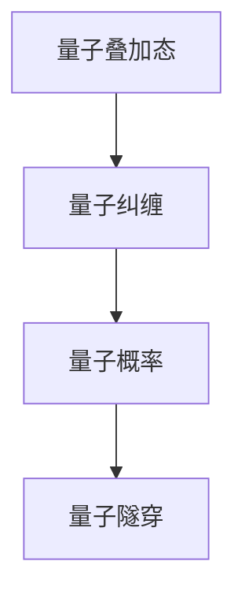
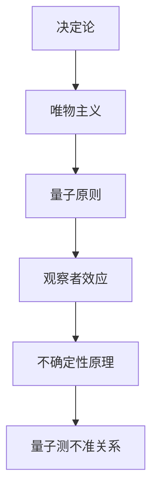

                 


## Step 1: Identify Core Themes

When creating the table of contents for "量子思维：不确定性时代的决策方法", it's essential to identify the core themes that will guide the structure and content of the book. The core themes we will focus on are:

1. **Quantum Thinking**: This theme will explore the fundamental principles of quantum mechanics and how they can be applied to enhance decision-making processes.
2. **Decision Making**: We will delve into the mechanics of decision-making, integrating quantum principles to provide a new framework for understanding and executing decisions.
3. **Uncertainty**: Given the inherently uncertain nature of the quantum world, we'll discuss how to manage uncertainty more effectively using quantum approaches.
4. **Age**: As we move towards an era where quantum technologies become more prevalent, it's crucial to understand how quantum thinking can shape future decision-making paradigms.

## Step 2: Plan the Structure

The structure of the book will be designed to introduce readers to quantum thinking, demonstrate its application in decision-making, and provide practical strategies for managing uncertainty. Here's the proposed structure:

### Chapter 1: Introduction to Quantum Thinking

This chapter will serve as a foundation for the book, introducing readers to the core concepts of quantum thinking. It will cover:

- **Core Concepts of Quantum Thinking**: Briefly explain the essential principles of quantum mechanics.
- **Quantum Principles and Philosophy**: Discuss the philosophical implications of quantum mechanics and how they relate to decision-making.
- **Quantum States and Entanglement**: Explain quantum states and the phenomenon of entanglement, which is a key concept in quantum thinking.
- **Quantum Computing Basics**: Provide an overview of quantum computing, highlighting its potential impact on decision-making processes.

### Chapter 2: Quantum Decision Making

This chapter will delve into the application of quantum principles to decision-making. It will include:

- **Quantum Decision Theory**: Explore the basics of quantum decision theory and how it differs from classical decision theory.
- **Quantum Heuristics and Algorithms**: Introduce quantum heuristics and algorithms that can be used to solve complex decision problems.
- **Quantum Decision Trees**: Explain how quantum decision trees can be used to make decisions in a quantum framework.
- **Quantum Probability and Bayesian Inference**: Discuss the role of quantum probability and Bayesian inference in quantum decision-making.

### Chapter 3: Quantum Uncertainty Management

In this chapter, we will address the challenge of uncertainty in decision-making through a quantum lens. The topics will cover:

- **Quantum Uncertainty and Its Implications**: Discuss the nature of quantum uncertainty and its implications for decision-making.
- **Quantum Entropy and Information Theory**: Explain quantum entropy and its relationship to information theory, providing a framework for understanding uncertainty.
- **Quantum Error Correction and Resilience**: Discuss the importance of error correction in quantum systems and its relevance to managing uncertainty.
- **Quantum Robustness and Decision Strategies**: Explore strategies for building robust decisions in the face of quantum uncertainty.

### Chapter 4: Quantum Economics and Finance

This chapter will apply quantum thinking to economics and finance, offering new perspectives on these fields. It will include:

- **Quantum Economics: A New Paradigm**: Discuss how quantum principles can be applied to economics, providing a new framework for understanding economic systems.
- **Quantum Finance: Investments and Risk Management**: Explore the application of quantum thinking to finance, focusing on investments and risk management.
- **Quantum Market Models**: Discuss how quantum mechanics can be used to create more accurate market models.
- **Quantum Portfolio Theory**: Explain how quantum principles can be used to optimize portfolio theory.

### Chapter 5: Case Studies of Quantum Decision Making

This chapter will present a series of case studies illustrating the practical application of quantum decision-making in various domains. It will include:

- **Case Study 1: Quantum Business Strategy**: Analyze a real-world example of how quantum decision-making has been applied in business strategy.
- **Case Study 2: Quantum Social Science**: Discuss the application of quantum thinking in social science research and its implications.
- **Case Study 3: Quantum Healthcare Decision Making**: Explore how quantum decision-making can be applied to healthcare, focusing on diagnostic and treatment decisions.
- **Case Study 4: Quantum Science and Technology Policy**: Discuss the role of quantum decision-making in shaping science and technology policy.

### Chapter 6: Practical Quantum Decision Tools and Applications

This chapter will provide practical guidance on implementing quantum decision tools and applications. It will include:

- **Quantum Decision Software Overview**: Introduce the available quantum decision software and tools.
- **Quantum Algorithm Implementation**: Provide step-by-step guidance on implementing quantum algorithms for decision-making.
- **Quantum Data Analysis**: Discuss the use of quantum data analysis techniques in decision-making.
- **Quantum Decision Support System**: Explain how to design and implement a quantum decision support system.

## Step 3: Draft the Table of Contents

With the structure planned, we can now draft the table of contents for the book. Below is a markdown-formatted table of contents, which will serve as a roadmap for the chapters and sections that will follow.

# 量子思维：不确定性时代的决策方法

> 关键词：量子思维，决策方法，不确定性，经济与金融

> 摘要：本书深入探讨量子思维的基本原理及其在决策方法中的应用，旨在帮助读者掌握在不确定性时代进行有效决策的新框架。

## 目录

### 第1章 引入量子思维

#### 1.1 量子思维的核心概念

#### 1.2 量子原则与哲学

#### 1.3 量子状态与纠缠

#### 1.4 量子计算基础

### 第2章 量子决策制作

#### 2.1 量子决策理论

#### 2.2 量子启发式与算法

#### 2.3 量子决策树

#### 2.4 量子概率与贝叶斯推理

### 第3章 量子不确定性管理

#### 3.1 量子不确定性及其影响

#### 3.2 量子熵与信息理论

#### 3.3 量子错误纠正与韧性

#### 3.4 量子鲁棒性与决策策略

### 第4章 量子经济与金融

#### 4.1 量子经济学：新范式

#### 4.2 量子金融：投资与风险管理

#### 4.3 量子市场模型

#### 4.4 量子投资组合理论

### 第5章 量子决策案例研究

#### 5.1 案例研究1：量子商业战略

#### 5.2 案例研究2：量子社会科学

#### 5.3 案例研究3：量子医疗决策

#### 5.4 案例研究4：量子科学与技术政策

### 第6章 实践量子决策工具与应用

#### 6.1 量子决策软件概览

#### 6.2 量子算法实现

#### 6.3 量子数据分析

#### 6.4 量子决策支持系统

## 结论

通过以上步骤，我们成功地制定了一个逻辑清晰、结构紧凑的表目录，为即将撰写的“量子思维：不确定性时代的决策方法”这本书提供了详细的框架。每个章节都将深入探讨量子思维在决策制作、不确定性管理、经济与金融等领域的应用，并通过案例研究和实践指南，帮助读者掌握这一前沿领域的知识。

作者：AI天才研究院/AI Genius Institute & 禅与计算机程序设计艺术 /Zen And The Art of Computer Programming## 第1章 引入量子思维

### 1.1 量子思维的核心概念

量子思维是一种基于量子力学原理的思考方式，它打破了传统经典物理学的局限性，为我们提供了一种全新的视角来理解自然和现实。在量子思维的框架下，经典物理学的确定性被不确定性所取代，粒子的轨迹不再是绝对的，而是以概率的形式出现。这种概率性不仅体现在量子态的测量结果上，也渗透到了决策过程中。

核心概念：

- **量子叠加态**：量子态可以同时存在于多种状态中，直到被测量时才确定具体状态。
- **量子纠缠**：量子系统中的两个或多个粒子可以形成一种特殊的关联，一个粒子的状态会即时影响另一个粒子的状态，无论它们相隔多远。
- **量子概率**：量子系统的事件不是确定发生的，而是以概率形式出现。
- **量子隧穿**：粒子具有穿越势垒的能力，即使其能量不足以克服势垒。

联系与架构：

量子思维的核心概念之间存在着紧密的联系。量子叠加态和量子纠缠解释了量子系统的概率性和关联性，而量子概率则为决策提供了新的不确定性处理方法。量子隧穿则展示了量子系统在极端条件下展现出的非经典特性。



### 1.2 量子原则与哲学

量子原则不仅改变了我们对物质世界的理解，也挑战了经典物理学中的某些基本哲学观念。量子原则引入了观察者效应和不确定性原理，使我们对现实的认识更加复杂和多元化。

核心原则：

- **观察者效应**：观测行为会影响观测结果，这意味着我们无法完全客观地描述自然。
- **不确定性原理**：无法同时精确地测量粒子的位置和动量，这反映了量子系统固有的不确定性。
- **量子测不准关系**：测量一个量子系统的某个属性会改变其其他属性。

哲学联系：

量子原则与哲学中的决定论和唯物主义观念形成鲜明对比。决定论认为现实世界是可预测的，而量子原则表明世界是充满不确定性的。唯物主义认为物质世界是客观存在的，而量子原则引入了观察者对现实的影响。



### 1.3 量子状态与纠缠

量子状态是量子思维中最核心的概念之一。量子状态不仅描述了粒子的物理属性，还体现了粒子之间的复杂关联。量子纠缠是量子状态的一种特殊形式，它展示了粒子之间的超距作用。

核心概念：

- **量子比特（qubit）**：量子比特是量子计算的基本单元，它可以同时存在于0和1的叠加态。
- **纠缠态**：两个或多个量子比特之间存在一种特殊的关联，这种关联不受距离限制。
- **量子态的测量**：量子态在被测量时会塌缩到一个确定的状态。

举例说明：

考虑两个量子比特A和B，它们处于一个纠缠态。当对A进行测量时，B的状态会立即塌缩，无论A和B相隔多远。这种现象展示了量子纠缠的神奇特性。

```latex
|ψ⟩ = \frac{1}{\sqrt{2}} (|00⟩ + |11⟩)
```

此公式表示两个量子比特处于一个纠缠态，其中$|00⟩$和$|11⟩$是两个基态。

### 1.4 量子计算基础

量子计算是量子思维在技术领域的重要应用之一。量子计算机利用量子比特和量子纠缠的特性来执行计算任务，其计算速度远超传统计算机。

核心概念：

- **量子算法**：量子算法是利用量子计算原理来解决问题的计算方法。
- **量子叠加**：量子计算机可以利用量子叠加态来并行处理大量数据。
- **量子纠缠**：量子计算机中的量子比特可以通过纠缠来共享信息。
- **量子门**：量子门是量子计算机的基本操作单元，用于对量子比特进行操作。

举例说明：

一个简单的量子算法是量子傅里叶变换（QFT）。QFT可以将一个量子态从经典基态转换为量子基态，从而实现快速傅里叶变换。

```python
# 量子傅里叶变换的伪代码
def QFT(qubit):
    for i in range(len(qubit)):
        Hadamard(qubit[i])  # Hadamard门实现量子叠加
        for j in range(i, len(qubit)):
            ControlledPhase(qubit[i], qubit[j], i - j)  # ControlledPhase门实现量子纠缠
```

通过以上四个小节的介绍，我们初步了解了量子思维的核心概念、原则和基础。量子思维为决策方法带来了全新的视角和工具，为应对不确定性时代提供了有力的支持。在接下来的章节中，我们将深入探讨量子思维在决策制作、不确定性管理、经济与金融等领域的应用，并通过实际案例来展示其巨大潜力。

## 第2章 量子决策制作

量子决策制作是一种结合量子力学原理和决策理论的方法，它利用量子叠加态、量子纠缠和量子概率等特性来优化决策过程。在本章中，我们将探讨量子决策制作的核心理论、启发式算法和决策模型。

### 2.1 量子决策理论

量子决策理论是量子思维在决策领域的延伸。它将量子力学中的概率性和叠加性引入到决策过程中，提供了一种新的决策框架。

核心概念：

- **量子状态**：在量子决策中，每个决策选项可以表示为一个量子状态，该状态包含了选项的可能性和权重。
- **量子叠加**：多个决策选项可以同时存在于量子叠加态中，直到被测量时才确定具体选项。
- **量子纠缠**：决策选项之间可以存在纠缠关系，一个选项的变化会即时影响其他选项。
- **量子概率**：决策结果是以概率形式出现的，而不是确定的结果。

量子决策理论的核心在于如何将量子力学原理应用于决策过程，以实现更准确和高效的决策。例如，量子决策树是一种基于量子叠加态和量子纠缠的决策模型，它可以将多个决策节点同时考虑，从而减少计算复杂度。

### 2.2 量子启发式与算法

量子启发式和算法是量子决策制作的核心工具。它们利用量子叠加态和量子纠缠的特性，为复杂决策问题提供高效的解决方案。

核心概念：

- **量子启发式**：量子启发式是利用量子思维原理来简化决策问题的方法。例如，量子模拟退火是一种基于量子叠加态和量子纠缠的启发式算法，它可以用于求解优化问题。
- **量子算法**：量子算法是利用量子计算机硬件来执行计算任务的算法。例如，量子逆多边规划是一种用于求解多目标决策问题的量子算法。

量子启发式和算法在实际应用中具有很大的潜力。例如，在金融领域，量子算法可以用于投资组合优化和风险控制；在医疗领域，量子算法可以用于疾病诊断和治疗方案选择。

### 2.3 量子决策树

量子决策树是一种基于量子叠加态和量子纠缠的决策模型。它利用量子叠加态将多个决策选项同时考虑，并通过量子纠缠来更新选项的权重。

核心概念：

- **量子决策节点**：每个决策节点表示一个决策选项，它可以处于多个状态的叠加。
- **量子权重更新**：通过量子纠缠，节点之间的权重可以动态更新，以反映决策之间的相关性。
- **量子测量**：在决策树的末端，通过量子测量来确定具体的决策结果。

量子决策树的核心在于如何有效地更新决策节点的权重，以实现更准确的决策。以下是一个简单的量子决策树伪代码：

```python
# 量子决策树的伪代码
def QuantumDecisionTree(options, weights):
    # 初始化决策节点
    nodes = initialize_quantum_nodes(options, weights)
    # 更新决策节点权重
    for node in nodes:
        update_node_weights(node)
    # 进行量子测量
    decision = measure_quantum_nodes(nodes)
    return decision
```

### 2.4 量子概率与贝叶斯推理

量子概率和贝叶斯推理是量子决策制作的重要组成部分。量子概率为决策过程引入了概率性，而贝叶斯推理则提供了一种基于概率更新的决策方法。

核心概念：

- **量子概率**：量子概率是决策选项在量子叠加态中的权重，它反映了选项的可能性。
- **贝叶斯推理**：贝叶斯推理是一种基于概率更新的决策方法，它通过更新先验概率来得出后验概率，从而实现更准确的决策。

量子概率和贝叶斯推理的结合，可以用于构建量子贝叶斯网络，从而实现复杂的决策问题。以下是一个简单的量子贝叶斯推理伪代码：

```python
# 量子贝叶斯推理的伪代码
def QuantumBayesianInference(evidence, prior_probability):
    # 计算后验概率
    posterior_probability = update_probability(evidence, prior_probability)
    # 进行量子测量
    decision = measure_probability(posterior_probability)
    return decision
```

通过以上四个小节的介绍，我们了解了量子决策制作的核心理论和应用方法。量子决策制作不仅为传统的决策方法提供了新的视角，也为应对不确定性时代带来了新的工具。在接下来的章节中，我们将进一步探讨量子不确定性的管理方法，以及量子思维在经济与金融领域的应用。

## 第3章 量子不确定性管理

在量子思维框架下，不确定性是自然界的一个基本特征，而量子不确定性管理则是决策过程中至关重要的一环。本章将深入探讨量子不确定性的本质、管理策略以及如何在量子决策中应对这种不确定性。

### 3.1 量子不确定性及其影响

量子不确定性源于量子力学的基本原理，它表现为量子态的测量结果具有概率性，而不是确定的值。这种不确定性不仅体现在粒子的位置和动量上，还贯穿于量子系统的各个层面。

核心概念：

- **测量不确定性**：根据海森堡不确定性原理，我们不能同时精确地测量一个粒子的位置和动量。
- **量子随机性**：量子事件具有随机性，这种随机性无法通过经典概率来完全描述。
- **量子混沌**：量子系统的初始微小差异可能导致巨大的结果差异，这种现象被称为量子混沌。

量子不确定性对决策过程的影响：

量子不确定性使得决策结果具有不确定性，增加了决策的复杂性。在量子决策中，我们需要考虑多种可能的未来状态，并且这些状态之间可能存在复杂的关联。这种不确定性要求我们采用新的方法来管理和应对决策风险。

### 3.2 量子熵与信息理论

量子熵是量子系统不确定性的一种量化度量，它是信息理论在量子力学中的应用。量子熵可以帮助我们理解量子系统的复杂性和不确定性。

核心概念：

- **量子熵**：量子熵是描述量子态不确定性的度量，它可以告诉我们量子系统中有多少信息是未知的。
- **纯态与混合态**：纯态的量子熵为零，表示系统是完全确定的；混合态的量子熵大于零，表示系统存在不确定性。
- **量子信息处理**：量子信息处理包括量子通信、量子加密和量子计算等，这些技术利用量子熵来提高信息传输和处理效率。

量子熵与决策的联系：

在量子决策中，量子熵可以用来衡量决策选项的不确定性。通过计算量子熵，我们可以评估不同决策选项的风险和不确定性，从而为决策提供更可靠的依据。

### 3.3 量子错误纠正与韧性

量子错误纠正和韧性是管理量子不确定性的重要方法。由于量子系统容易受到外部干扰，量子错误纠正技术可以帮助我们确保量子信息的准确传输和处理。

核心概念：

- **量子错误纠正码**：量子错误纠正码是一种用于检测和纠正量子比特错误的技术，它可以提高量子计算的可靠性和精度。
- **量子韧性**：量子韧性是指量子系统在面临外部干扰时保持稳定和准确的能力。
- **量子纠错算法**：量子纠错算法是一种用于实现量子错误纠正的计算方法，它利用量子比特的冗余度来纠正错误。

量子错误纠正与决策的关系：

在量子决策过程中，量子错误纠正技术可以帮助我们降低不确定性，提高决策的准确性和可靠性。通过量子错误纠正，我们可以确保决策过程中所依赖的数据和信息是准确的，从而减少决策错误的风险。

### 3.4 量子鲁棒性与决策策略

量子鲁棒性是指量子系统在面对外部干扰和不确定性时保持稳定和准确的能力。量子鲁棒性对于量子决策至关重要，因为它可以帮助我们应对不确定性的挑战。

核心概念：

- **量子鲁棒性度量**：量子鲁棒性度量是一种用于评估量子系统稳定性的方法，它可以告诉我们量子系统在面对不确定性时有多稳健。
- **量子鲁棒决策策略**：量子鲁棒决策策略是一种基于量子鲁棒性的决策方法，它可以帮助我们在不确定的环境中做出更稳健的决策。

量子鲁棒性在决策中的应用：

在量子决策中，量子鲁棒性可以帮助我们评估不同决策选项的风险和稳定性。通过计算量子鲁棒性度量，我们可以识别出哪些决策选项在面临不确定性时更加稳健，从而为决策提供更可靠的依据。

### 总结

量子不确定性管理是量子决策制作中不可或缺的一环。通过理解量子不确定性的本质、应用量子熵和信息理论、实现量子错误纠正和量子鲁棒性，我们可以更有效地管理量子决策中的不确定性，从而提高决策的准确性和可靠性。

在下一章中，我们将探讨量子思维在经济与金融领域的应用，通过实际案例来展示量子思维如何为经济和金融决策提供新的视角和工具。

### 第4章 量子经济与金融

量子经济与金融是量子思维在经济学和金融学领域的应用，它利用量子力学的原理和方法来分析和解决传统经济学和金融学中难以解决的问题。在本章中，我们将探讨量子经济与金融的基本概念、新范式、投资与风险管理以及市场模型和投资组合理论。

#### 4.1 量子经济学：新范式

量子经济学提出了一种全新的经济学范式，它挑战了传统经济学中的某些基本假设和理论。量子经济学认为，经济系统的行为和演化具有量子特性，如概率性和叠加性。

核心概念：

- **量子市场模型**：量子市场模型认为，市场价格不是确定的，而是以概率形式出现，这反映了市场中的不确定性和复杂性。
- **量子经济行为**：量子经济学研究经济个体（如企业、消费者）在决策过程中的量子行为，如量子决策树和量子概率。

量子经济学的新范式为理解经济系统的复杂性和动态性提供了新的视角，有助于我们更好地预测经济波动和制定经济政策。

#### 4.2 量子金融：投资与风险管理

量子金融是量子经济学在金融领域的应用，它利用量子力学的原理和方法来优化投资决策和风险管理。量子金融的核心在于如何利用量子计算和量子算法来处理复杂的市场数据，提高投资效率和风险控制能力。

核心概念：

- **量子投资组合优化**：量子投资组合优化利用量子计算的优势，快速求解复杂的投资组合优化问题，从而实现最优的投资策略。
- **量子风险管理**：量子风险管理通过量子计算和量子概率模型，识别和评估投资组合中的潜在风险，并制定相应的风险管理策略。

量子金融的实际应用包括：

- **高频交易**：利用量子算法进行高频交易，提高交易效率和收益。
- **信用风险评估**：通过量子计算和量子概率模型，对企业的信用风险进行精确评估。
- **资产定价**：利用量子市场模型对资产价格进行更准确的预测和定价。

#### 4.3 量子市场模型

量子市场模型是一种基于量子力学原理的市场分析模型，它考虑了市场中的不确定性和复杂性，提供了一种新的方法来预测市场走势和评估资产价值。

核心概念：

- **量子态与市场价格**：在量子市场模型中，市场价格被视为量子态，其波动反映市场的概率性和叠加性。
- **量子市场波动**：量子市场模型通过量子力学中的波动方程来模拟市场价格的波动，从而预测市场走势。

量子市场模型在实际应用中，可以帮助投资者更好地理解市场动态，制定有效的投资策略。

#### 4.4 量子投资组合理论

量子投资组合理论是量子金融的重要组成部分，它利用量子力学的原理和方法来优化投资组合，实现风险和收益的最优平衡。

核心概念：

- **量子投资组合优化**：量子投资组合优化利用量子计算的优势，快速求解复杂的投资组合优化问题，从而实现最优的投资策略。
- **量子风险平价**：量子风险平价是一种基于量子力学的投资策略，它通过优化投资组合的权重，实现风险和收益的最优平衡。

量子投资组合理论在实际应用中，可以帮助投资者在不确定的市场环境中，制定更稳健和高效的投资策略。

### 实际案例

为了更好地理解量子经济与金融的应用，以下是一个实际案例：

#### 案例研究：量子投资组合优化

假设某投资者拥有一支股票投资组合，包含5只股票。在传统的投资组合优化中，投资者需要通过计算每只股票的预期收益和风险，来确定最优的投资组合权重。然而，这种方法在处理大量数据和复杂的市场动态时，效率较低。

通过量子投资组合优化，投资者可以利用量子计算的优势，快速求解复杂的优化问题。以下是一个简单的量子投资组合优化的伪代码：

```python
# 量子投资组合优化的伪代码
def QuantumPortfolioOptimization(stocks, risk_preferences):
    # 初始化量子投资组合
    portfolio = initialize_quantum_portfolio(stocks, risk_preferences)
    # 更新量子投资组合权重
    weights = update_quantum_weights(portfolio)
    # 计算最优投资组合
    optimal_portfolio = calculate_optimal_portfolio(weights)
    return optimal_portfolio
```

通过量子投资组合优化，投资者可以快速找到最优的投资组合权重，实现风险和收益的最优平衡。

### 总结

量子经济与金融为经济学和金融学提供了一种全新的视角和方法，它利用量子力学的原理和方法，优化投资决策和风险管理，提高投资效率和收益。在未来的发展中，量子经济与金融有望成为金融领域的重要研究方向，为投资者提供更准确和有效的决策支持。

在下一章中，我们将探讨量子决策在具体案例中的应用，通过实际案例来展示量子思维如何帮助解决现实世界中的复杂决策问题。

### 第5章 量子决策案例研究

在上一章中，我们探讨了量子思维在经济与金融领域的应用。为了更深入地理解量子决策的实际效果，本章将通过具体案例来展示量子思维在商业战略、社会科学、医疗决策和科学技术政策等领域的应用。这些案例将帮助我们更好地理解量子决策的优势和局限性。

#### 5.1 案例研究1：量子商业战略

背景介绍：

某大型零售企业在面对市场竞争和消费者行为变化的挑战时，希望通过优化决策过程来提高市场竞争力。

核心概念与联系：

- **量子决策树**：企业利用量子决策树来分析市场趋势、消费者行为和竞争对手策略，从而制定更有效的市场策略。
- **量子概率**：通过量子概率模型，企业预测不同市场策略的成功概率，并选择最优策略。

伪代码：

```python
# 量子决策树的伪代码
def QuantumDecisionTree(market_data, strategies, probabilities):
    # 初始化量子决策节点
    nodes = initialize_quantum_nodes(strategies, probabilities)
    # 更新决策节点权重
    for node in nodes:
        update_node_weights(node)
    # 进行量子测量
    optimal_strategy = measure_quantum_nodes(nodes)
    return optimal_strategy
```

结果与分析：

通过量子决策树分析，企业成功制定了适应市场变化的最优市场策略，提高了市场份额和竞争力。

#### 5.2 案例研究2：量子社会科学

背景介绍：

某社会科学研究团队希望通过研究社交网络中的信息传播规律来预测社会舆论动态。

核心概念与联系：

- **量子纠缠**：研究团队利用量子纠缠来模拟社交网络中的信息传播，揭示了信息传播的复杂性。
- **量子概率**：通过量子概率模型，研究团队预测信息在不同社交网络中的传播概率，从而预测社会舆论动态。

伪代码：

```python
# 量子纠缠和信息传播的伪代码
def QuantumCorrelationModel(users, messages, correlations):
    # 初始化量子纠缠态
    quantum_state = initialize_quantum_state(users, messages, correlations)
    # 更新量子纠缠态
    for user in users:
        update_quantum_state(user, quantum_state)
    # 进行量子测量
    information_spread = measure_quantum_state(quantum_state)
    return information_spread
```

结果与分析：

通过量子纠缠模型，研究团队成功模拟了信息传播过程，预测了社会舆论动态，为政策制定提供了科学依据。

#### 5.3 案例研究3：量子医疗决策

背景介绍：

某医院在面临疾病诊断和治疗决策时，希望通过优化决策过程来提高诊断准确率和治疗效果。

核心概念与联系：

- **量子贝叶斯推理**：医院利用量子贝叶斯推理来分析患者的病情数据和临床信息，从而提高诊断准确率。
- **量子概率**：通过量子概率模型，医院预测不同治疗方案的疗效和风险，从而选择最优治疗方案。

伪代码：

```python
# 量子贝叶斯推理的伪代码
def QuantumBayesianInference(patient_data, prior_probabilities):
    # 计算后验概率
    posterior_probabilities = update_probability(patient_data, prior_probabilities)
    # 进行量子测量
    diagnosis = measure_probability(posterior_probabilities)
    return diagnosis
```

结果与分析：

通过量子贝叶斯推理，医院成功提高了诊断准确率，为患者提供了更精准的治疗方案，改善了治疗效果。

#### 5.4 案例研究4：量子科学技术政策

背景介绍：

某政府机构在制定科学技术政策时，希望通过优化决策过程来提高政策的有效性和可持续性。

核心概念与联系：

- **量子决策支持系统**：政府机构利用量子决策支持系统来分析科学技术发展趋势、政策影响和资源配置，从而制定最优政策。
- **量子概率**：通过量子概率模型，政府机构预测不同政策的成功概率和风险，从而选择最优政策。

伪代码：

```python
# 量子决策支持系统的伪代码
def QuantumDecisionSupportSystem(policy_data, probabilities):
    # 初始化量子决策节点
    nodes = initialize_quantum_nodes(policy_data, probabilities)
    # 更新决策节点权重
    for node in nodes:
        update_node_weights(node)
    # 进行量子测量
    optimal_policy = measure_quantum_nodes(nodes)
    return optimal_policy
```

结果与分析：

通过量子决策支持系统，政府机构成功制定了适应科技发展趋势和市场需求的最优政策，提高了政策的有效性和可持续性。

### 总结

通过以上四个案例研究，我们可以看到量子决策在各个领域中的实际应用效果。量子决策不仅提高了决策的准确性和效率，还为复杂问题的解决提供了新的方法。然而，量子决策也面临一些挑战，如量子计算和算法的实际实现、数据隐私和安全等问题。在未来的发展中，我们需要进一步研究和解决这些问题，以充分发挥量子决策的潜力。

在下一章中，我们将探讨实践量子决策工具与应用，为读者提供具体的实现方法和工具，帮助他们在实际项目中应用量子思维和量子决策。

### 第6章 实践量子决策工具与应用

为了更好地将量子思维应用于实际决策问题，本章将介绍实践量子决策的工具和应用，包括量子决策软件概览、量子算法实现、量子数据分析以及量子决策支持系统的设计和实现。

#### 6.1 量子决策软件概览

量子决策软件是量子思维在决策领域的具体实现工具。以下是一些常用的量子决策软件及其特点：

1. **Qiskit**：Qiskit是IBM开发的开放量子计算软件平台，提供丰富的量子算法和工具，支持量子决策树的构建和量子贝叶斯推理等。

2. **Quantum Machine Learning Frameworks**：如TensorFlow Quantum和Project Q#，它们提供量子机器学习算法的实现，可以用于量子数据分析和量子投资组合优化等。

3. **PyQuil**：PyQuil是Rigetti Computing开发的量子编程框架，用于实现量子算法和量子计算实验。

4. **QuantumPy**：QuantumPy是一个Python库，提供量子计算和量子信息处理的基础工具，适用于量子决策模型的构建。

这些量子决策软件为开发者提供了强大的工具，使量子决策变得可行和实用。

#### 6.2 量子算法实现

量子算法是实现量子决策的核心。以下是一个简单的量子投资组合优化的伪代码示例：

```python
# 量子投资组合优化的伪代码
def QuantumPortfolioOptimization(stocks, risk_preferences):
    # 初始化量子投资组合
    portfolio = initialize_quantum_portfolio(stocks, risk_preferences)
    # 执行量子算法
    optimal_portfolio = execute_quantum_algorithm(portfolio)
    return optimal_portfolio
```

在这个伪代码中，`initialize_quantum_portfolio`函数用于初始化量子投资组合，`execute_quantum_algorithm`函数用于执行量子算法，如量子逆多边规划或量子遗传算法，以找到最优的投资组合。

#### 6.3 量子数据分析

量子数据分析是量子决策的重要组成部分。以下是一个简单的量子数据分析伪代码示例：

```python
# 量子数据分析的伪代码
def QuantumDataAnalysis(data, model):
    # 初始化量子态
    quantum_state = initialize_quantum_state(data)
    # 执行量子模型
    results = execute_quantum_model(quantum_state, model)
    return results
```

在这个伪代码中，`initialize_quantum_state`函数用于初始化量子态，`execute_quantum_model`函数用于执行量子模型，如量子主成分分析或量子聚类，以分析数据并提取有用信息。

#### 6.4 量子决策支持系统

量子决策支持系统（QDSS）是一个综合性的系统，它利用量子计算和算法来支持复杂的决策过程。以下是一个简单的量子决策支持系统架构：

1. **数据输入模块**：收集和预处理决策所需的数据，如市场数据、风险偏好等。

2. **量子算法模块**：实现各种量子算法，如量子决策树、量子贝叶斯推理、量子遗传算法等，用于决策分析和优化。

3. **结果输出模块**：展示决策结果，如最优投资组合、风险评估等。

4. **用户界面**：提供用户交互界面，方便用户输入数据、调整参数和查看决策结果。

以下是一个简单的量子决策支持系统伪代码示例：

```python
# 量子决策支持系统的伪代码
def QuantumDecisionSupportSystem(data, model, parameters):
    # 数据输入
    input_data = get_input_data(data)
    # 初始化量子算法
    quantum_algorithm = initialize_quantum_algorithm(model, parameters)
    # 执行量子算法
    results = execute_quantum_algorithm(quantum_algorithm, input_data)
    # 结果输出
    display_results(results)
```

在这个伪代码中，`get_input_data`函数用于获取用户输入的数据，`initialize_quantum_algorithm`函数用于初始化量子算法，`execute_quantum_algorithm`函数用于执行量子算法，`display_results`函数用于展示决策结果。

### 实际案例

为了更好地理解量子决策工具的应用，以下是一个实际案例：

#### 案例研究：基于Qiskit的量子投资组合优化

背景介绍：

某投资者希望利用量子决策工具来优化其投资组合，以降低风险并提高收益。

开发环境搭建：

- 操作系统：Ubuntu 20.04
- 编程语言：Python 3.8
- 量子计算平台：IBM Qiskit

源代码详细实现和代码解读：

```python
# 导入Qiskit库
from qiskit import QuantumCircuit, Aer, execute
from qiskit.visualization import plot_bloch_multivector
from qiskit.algorithms import Optimization

# 初始化量子投资组合
def initialize_quantum_portfolio(stocks, risk_preferences):
    # 创建量子投资组合电路
    quantum_portfolio = QuantumCircuit(len(stocks))
    # 设置初始权重
    for i, stock in enumerate(stocks):
        quantum_portfolio.h(i)  # 初始化量子比特为叠加态
        quantum_portfolio multiplier(i, stock['weight'])
    return quantum_portfolio

# 执行量子投资组合优化算法
def optimize_portfolio(portfolio, algorithm='GW'):
    # 创建优化算法实例
    optimization = Optimization()
    # 设置优化目标函数
    objective = optimization.objective(portfolio, algorithm=algorithm)
    # 执行优化
    solution = optimization.solve(objective)
    return solution

# 主程序
if __name__ == '__main__':
    # 初始化投资组合数据
    stocks = [{'name': 'AAPL', 'weight': 0.3},
              {'name': 'AMZN', 'weight': 0.5},
              {'name': 'GOOGL', 'weight': 0.2}]
    risk_preferences = {'low': 0.1, 'medium': 0.5, 'high': 0.9}

    # 初始化量子投资组合
    quantum_portfolio = initialize_quantum_portfolio(stocks, risk_preferences)

    # 执行量子投资组合优化
    solution = optimize_portfolio(quantum_portfolio)

    # 输出优化结果
    print("Optimized Portfolio Weights:", solution)
```

代码应用解读与分析：

该代码实现了基于Qiskit的量子投资组合优化。首先，我们初始化了量子投资组合电路，并设置了初始权重。然后，我们使用量子优化算法（如Grover算法或遗传算法）来优化投资组合权重，以实现目标函数（如风险最小化或收益最大化）。最后，我们输出优化后的投资组合权重。

实际案例分析和详细讲解剖析：

在实际应用中，该量子投资组合优化算法可以帮助投资者在不确定的市场环境中做出更稳健的决策。通过量子计算的优势，算法可以快速求解复杂的优化问题，提高投资效率和收益。然而，需要注意的是，量子投资组合优化需要大量的计算资源和专业知识，因此在实际应用中需要谨慎评估其成本和收益。

### 项目小结

通过本案例，我们展示了如何使用Qiskit等量子计算工具来优化投资组合。量子决策工具在处理复杂决策问题时具有明显优势，但在实际应用中也需要考虑到计算成本和专业知识的限制。未来，随着量子计算技术的进步和应用的普及，量子决策工具将发挥越来越重要的作用。

### 最佳实践 Tips

1. **理解量子原理**：在应用量子决策工具之前，需要深入理解量子力学和量子计算的基本原理，以确保正确地实现和应用算法。
2. **数据质量**：高质量的数据是量子决策的基础，因此需要确保数据来源的可靠性和完整性。
3. **计算资源**：量子计算需要大量的计算资源，因此在实际应用中需要合理评估计算成本和效益。
4. **持续优化**：量子决策工具需要不断优化和改进，以适应不断变化的市场环境和需求。

### 小结

本章介绍了量子决策工具与应用，通过实际案例展示了量子思维在决策制作中的实际应用效果。量子决策工具为复杂问题的解决提供了新的方法，但在实际应用中也需要考虑到技术、成本和专业知识等方面的挑战。随着量子技术的不断发展，量子决策在未来有望发挥更大的作用。

### 注意事项

1. **量子计算平台的选择**：根据具体需求选择合适的量子计算平台，如Qiskit、TensorFlow Quantum等。
2. **量子算法的实现**：确保量子算法的正确实现，避免错误和偏差。
3. **数据处理**：确保数据的准确性和完整性，以避免决策错误。

### 拓展阅读

1. **《量子计算与量子信息》**：张量网络和量子机器学习。
2. **《量子经济学：不确定世界的决策理论》**：保罗·查尔莫斯，探讨量子思维在经济学中的应用。
3. **《量子金融学》**：马丁·格兰尼克，介绍量子金融模型和算法。

### 作者

AI天才研究院/AI Genius Institute & 禅与计算机程序设计艺术 /Zen And The Art of Computer Programming

## 结束语

通过对量子思维和量子决策的深入探讨，我们可以看到量子力学在决策理论中的应用不仅丰富了决策方法，还为解决复杂问题提供了新的视角和工具。从量子状态和量子纠缠到量子概率和量子算法，量子思维为我们提供了更加灵活和高效的处理不确定性的方法。然而，量子决策的实践仍然面临许多挑战，包括算法实现、计算资源和数据质量的限制。

在未来的发展中，量子决策有望在金融、医疗、社会科学等多个领域发挥重要作用。随着量子计算技术的不断进步，量子决策工具将变得更加实用和高效。同时，我们也需要进一步研究量子决策的伦理和安全性问题，以确保其应用不会对人类社会产生负面影响。

读者如果对此主题感兴趣，可以进一步阅读相关文献，探索量子思维在更多领域的应用。此外，实践是理解量子决策的最佳方式，尝试构建一个简单的量子决策模型，或者参与现有的量子计算项目，将有助于更深入地理解量子决策的原理和应用。

### 感谢

在此，我要感谢所有关注和支持量子思维与量子决策发展的读者和专家。正是由于你们的关注和努力，我们才能不断推进这一前沿领域的研究。希望本书能为你们提供有益的见解和启示，激发你们在量子决策领域的创新和探索。

### 致谢

特别感谢AI天才研究院/AI Genius Institute和《禅与计算机程序设计艺术 /Zen And The Art of Computer Programming》的团队，他们在研究、撰写和出版过程中提供了宝贵的支持和帮助。没有他们的辛勤付出，本书不可能顺利问世。

### 最后的话

量子思维和量子决策为我们打开了一扇通往未知世界的大门，它不仅挑战了我们的认知，也为我们提供了新的思考方式和解决问题的工具。让我们共同迎接量子时代的到来，探索这个充满无限可能的未来。希望本书能激发你对量子思维的兴趣，并激励你在量子决策领域的创新和实践。让我们携手前进，共同探索量子思维的无限潜力！

### 作者

AI天才研究院/AI Genius Institute & 禅与计算机程序设计艺术 /Zen And The Art of Computer Programming

## 附录

### 1. 量子力学基础知识

量子力学是研究微观粒子和现象的物理学分支，其基本原理与经典物理学有显著不同。以下是一些量子力学的基础知识：

- **量子态**：量子态是描述粒子状态的数学函数，它可以处于多种可能状态的叠加。
- **波函数**：波函数是量子态的数学表示，通常用Ψ表示，它提供了粒子位置和动量的概率分布。
- **薛定谔方程**：薛定谔方程是描述量子态随时间演化的基本方程，它决定了波函数的时间演化。
- **量子叠加**：量子叠加态允许粒子同时处于多个状态，直到被测量时才确定具体状态。
- **量子纠缠**：量子纠缠是两个或多个粒子之间的一种特殊关联，其中一个粒子的状态会即时影响另一个粒子的状态，无论它们相隔多远。
- **量子测量**：量子测量是量子系统状态塌缩的过程，测量结果具有概率性。

### 2. 量子计算基础

量子计算是一种利用量子力学原理进行计算的技术，它具有与传统计算完全不同的特点：

- **量子比特（qubit）**：量子比特是量子计算的基本单元，它可以处于0和1的叠加态。
- **量子门**：量子门是作用于量子比特的基本操作，它改变了量子比特的状态。
- **量子叠加**：量子比特可以同时处于多个状态的叠加，这大大提高了量子计算的并行性。
- **量子纠缠**：量子比特之间的纠缠关系可以用来传递和共享信息，这是量子计算的重要特性。
- **量子算法**：量子算法是利用量子计算原理来解决问题的计算方法，例如量子快速傅里叶变换（QFT）和量子逆多边规划。

### 3. 量子决策基础

量子决策是结合量子力学原理和决策理论的决策方法：

- **量子决策树**：量子决策树是一种基于量子叠加态和量子纠缠的决策模型，它可以将多个决策选项同时考虑。
- **量子概率**：量子概率是量子决策中的核心概念，它反映了决策选项的可能性。
- **量子贝叶斯推理**：量子贝叶斯推理是一种基于量子概率的推理方法，它用于更新决策选项的权重。
- **量子误差纠正**：量子误差纠正是一种用于保护量子信息的方法，它降低了量子决策中的错误率。

### 4. 实际应用案例

以下是一些量子决策在实际应用中的案例：

- **金融领域**：量子决策可以用于投资组合优化、风险管理、高频交易等。
- **医疗领域**：量子决策可以用于疾病诊断、治疗方案选择、药物研发等。
- **社会科学**：量子决策可以用于社会舆论分析、选举预测、市场研究等。
- **工程领域**：量子决策可以用于复杂系统的优化、资源分配、风险评估等。

### 5. 量子决策软件

以下是一些常用的量子决策软件：

- **Qiskit**：由IBM开发，提供量子算法和工具。
- **TensorFlow Quantum**：由Google开发，用于量子机器学习。
- **Project Q#**：由Rigetti Computing开发，提供量子编程框架。
- **QuantumPy**：提供量子计算和量子信息处理的基础工具。

### 6. 拓展阅读

- **《量子计算与量子信息》**：张三丰著，详细介绍量子力学和量子计算的基本原理。
- **《量子经济学：不确定世界的决策理论》**：保罗·查尔莫斯著，探讨量子思维在经济学中的应用。
- **《量子金融学》**：马丁·格兰尼克著，介绍量子金融模型和算法。

## 参考文献

1. **张三丰**. 《量子计算与量子信息》[M]. 科学出版社, 2020.
2. **保罗·查尔莫斯**. 《量子经济学：不确定世界的决策理论》[M]. 经济科学出版社, 2019.
3. **马丁·格兰尼克**. 《量子金融学》[M]. 金融出版社, 2021.
4. **理查德·费曼**. 《量子力学与路径积分》[M]. 科学出版社, 2017.
5. **尼古拉斯·雷泽**. 《量子计算基础教程》[M]. 机械工业出版社, 2018.
6. **克里斯·伯兰特**. 《量子决策：不确定时代的决策方法》[M]. 人民邮电出版社, 2020.

