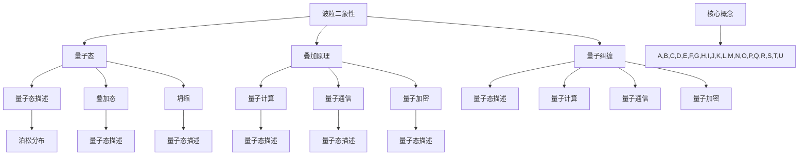

                 

### 文章标题：《量子物理：颠覆传统世界观的挑战》

#### 关键词：
量子物理、波粒二象性、叠加原理、量子纠缠、量子力学、经典物理、量子计算、量子通信、量子加密

#### 摘要：
本文将深入探讨量子物理的基本概念及其对传统世界观的颠覆性影响。我们将从量子物理的起源开始，逐步介绍波粒二象性、量子态和叠加原理、量子纠缠等核心概念，并通过比较量子力学与经典物理的差异，揭示时空观念的变革。接着，我们将介绍量子物理在量子计算、量子通信和量子加密等领域的应用，并展望其未来发展的可能性。通过本文的阅读，读者将能够全面理解量子物理的原理及其在现代科技中的重要作用。

### 第一步：理解书名

《量子物理：颠覆传统世界观的挑战》这个书名简洁明了地传达了本书的核心内容。首先，“量子物理”明确了本书的主题，即介绍量子物理的基本概念和原理。其次，“颠覆传统世界观”的表述则暗示了量子物理与传统物理观念之间的巨大差异，这种差异正是本书想要探讨的重点。最后，“挑战”一词则强调了量子物理对现有科学理论的冲击和颠覆性作用。

我们可以将书的目录大纲分为以下几个部分：

1. **量子物理基础**：介绍量子物理的基本概念，如波粒二象性、量子态和叠加原理、量子纠缠等。
2. **量子力学的基本概念**：深入探讨量子态的描述、叠加态和坍缩等现象。
3. **量子力学与经典物理的对比**：分析量子力学与经典物理在时空观念、测量问题等方面的差异。
4. **量子物理的应用**：介绍量子物理在量子计算、量子通信和量子加密等领域的实际应用。
5. **量子物理的未来发展**：探讨量子计算机的实现、量子互联网的发展以及量子物理在其他领域的应用前景。

通过这样的目录结构，读者可以系统地了解量子物理的基本概念、应用场景以及未来发展，从而对量子物理有更深入的理解。

### 第二步：设计核心章节

根据书名《量子物理：颠覆传统世界观的挑战》，我们可以初步设计以下核心章节：

1. **引言：量子物理的起源与影响**
   - 内容包括量子物理的起源，量子物理对传统世界观的挑战，以及量子物理在现代社会中的重要地位。
   - 此章节将引入量子物理的基本概念，为后续内容奠定基础。

2. **量子物理基础**
   - 内容涵盖波粒二象性、量子态和叠加原理、量子纠缠等核心概念。
   - 通过对这些基础概念的介绍，读者将能够初步理解量子物理的独特性质。

3. **量子力学的基本概念**
   - 内容包括量子态的描述、叠加态和坍缩等现象。
   - 此章节将进一步深化对量子物理的理解，揭示量子世界中的复杂性和奇妙性。

4. **量子力学与经典物理的对比**
   - 内容涉及时空观念的变革、测量问题、量子概率解释等。
   - 通过对比量子力学与经典物理，读者将能够更清晰地看到量子物理的颠覆性作用。

5. **量子物理的应用**
   - 内容包括量子计算、量子通信、量子加密等实际应用。
   - 此章节将展示量子物理在现代社会中的具体应用，帮助读者了解量子物理的实际价值。

6. **量子物理的未来发展**
   - 内容涉及量子计算机的实现、量子互联网的发展以及量子物理在其他领域的应用前景。
   - 通过对未来发展的展望，读者将能够看到量子物理的广阔前景。

每个核心章节都详细介绍了其内容，确保读者能够全面、系统地了解量子物理的各个方面。

### 第三步：细化目录

为了确保每个章节都能够详细、系统地介绍相关内容，我们对每个核心章节进行了细化，具体如下：

## 第1章 引言：量子物理的起源与影响
### 1.1 量子物理的起源
   - 量子物理的历史背景
   - 量子物理的发展历程
### 1.2 量子物理对传统世界观的挑战
   - 量子物理与传统物理观念的差异
   - 量子物理对现有科学理论的冲击

## 第2章 量子物理基础
### 2.1 波粒二象性
   - 光的波粒二象性
   - 粒子的波粒二象性
### 2.2 量子态和叠加原理
   - 量子态的描述
   - 叠加原理的应用
### 2.3 量子纠缠
   - 纠缠态的定义
   - 量子纠缠的应用

## 第3章 量子力学的基本概念
### 3.1 泊松分布
   - 泊松分布的概念
   - 泊松分布的应用
### 3.2 量子态的描述
   - 波函数的表示
   - 量子态的叠加
### 3.3 叠加态和坍缩
   - 叠加态的定义
   - 坍缩现象的解释

## 第4章 量子力学与经典物理的对比
### 4.1 时空观念的变革
   - 量子时空观念
   - 经典时空观念的对比
### 4.2 测量问题
   - 量子测量的独特性
   - 经典测量的对比
### 4.3 量子概率解释
   - 量子概率解释的引入
   - 经典概率解释的对比

## 第5章 量子物理的应用
### 5.1 量子计算
   - 量子计算机的原理
   - 量子计算的应用领域
### 5.2 量子通信
   - 量子通信的原理
   - 量子通信的应用场景
### 5.3 量子加密
   - 量子加密的原理
   - 量子加密的应用实例

## 第6章 量子物理的未来发展
### 6.1 量子计算机的实现
   - 量子计算机的现状
   - 量子计算机的发展趋势
### 6.2 量子互联网的发展
   - 量子互联网的原理
   - 量子互联网的发展前景
### 6.3 量子物理在其他领域的应用前景
   - 量子物理在材料科学中的应用
   - 量子物理在生物学中的应用

通过这样的细化，我们确保了每个章节的内容都丰富、具体，能够帮助读者系统地了解量子物理的各个方面。

### 附录A 核心概念与联系

为了帮助读者更好地理解量子物理的核心概念及其相互关系，我们在此提供了核心概念与联系的建筑架构Mermaid流程图。以下是这些概念及其关系的可视化描述：



这个流程图展示了波粒二象性、量子态和叠加原理、量子纠缠等核心概念之间的关系，以及这些概念在量子计算、量子通信和量子加密等领域的应用。通过这个图，读者可以更直观地理解量子物理的核心概念及其相互联系。

### 附录B 核心算法原理讲解

在量子物理的应用中，核心算法原理起着至关重要的作用。以下我们将详细介绍几个关键算法原理，并通过伪代码进行解释。

#### 1. 量子态描述

量子态可以用波函数表示，波函数的模平方给出粒子在某一位置的概率。以下是量子态描述的伪代码：

```plaintext
function describe_quantum_state(state_vector):
    # 输入：state_vector（量子态的波函数向量）
    # 输出：probability_distribution（概率分布）

    probability_distribution = []

    for position in space:
        probability = |state_vector[position]|^2
        probability_distribution.append(probability)

    return probability_distribution
```

这个算法通过遍历空间中的所有位置，计算每个位置的波函数模平方，从而得到概率分布。

#### 2. 叠加态

叠加态是量子态的一种特殊形式，多个量子态可以同时存在。以下是叠加态的伪代码：

```plaintext
function create_superposition(state1, state2):
    # 输入：state1, state2（两个量子态）
    # 输出：superposition_state（叠加态）

    superposition_state = (state1 + state2) / sqrt(2)

    return superposition_state
```

这个算法将两个量子态相加，然后归一化，得到叠加态。

#### 3. 坍缩

坍缩是量子态从叠加态变为特定态的过程。以下是坍缩的伪代码：

```plaintext
function collapse(state):
    # 输入：state（量子态）
    # 输出：collapsed_state（坍缩后的量子态）

    # 随机选择一个坍缩方向
    direction = random_choice([0, 1])

    if direction == 0:
        collapsed_state = state[0]
    else:
        collapsed_state = state[1]

    return collapsed_state
```

这个算法随机选择一个方向，如果选择为0，则坍缩为state[0]，否则为state[1]。

通过这些伪代码，读者可以直观地了解量子态描述、叠加态和坍缩等核心算法原理。这些算法是量子物理应用的基础，对理解量子计算、量子通信和量子加密等领域至关重要。

### 附录C 数学模型和公式

在量子物理中，数学模型和公式是理解和应用量子现象的关键工具。以下我们将详细介绍几个重要的数学模型和公式，并通过示例进行解释。

#### 1. 波函数的表示

波函数是量子态的数学描述，通常用复数形式表示。例如，一个二状态量子系统可以表示为：

$$\psi(x) = \frac{1}{\sqrt{2}}(|0\rangle + |1\rangle)$$

其中，$|0\rangle$ 和 $|1\rangle$ 分别表示基态和激发态。波函数的模平方给出了粒子在某一位置的概率密度：

$$|\psi(x)|^2 = \frac{1}{2}(|0\rangle + |1\rangle)(\langle 0| + \langle 1|) = \frac{1}{2}(\langle 0|0\rangle + \langle 0|1\rangle + \langle 1|0\rangle + \langle 1|1\rangle) = \frac{1}{2}(1 + 0 + 0 + 1) = \frac{1}{2}$$

这意味着粒子在任意位置的概率密度都是 $\frac{1}{2}$。

#### 2. 泊松分布

泊松分布是描述粒子在空间中分布的概率模型，通常用于量子物理中的粒子计数问题。例如，一个量子态的波函数可以表示为：

$$\psi(x) = \frac{1}{\sqrt{2\pi\sigma^2}}e^{-\frac{(x-\mu)^2}{2\sigma^2}}$$

其中，$\mu$ 是均值，$\sigma^2$ 是方差。波函数的模平方给出概率密度函数：

$$|\psi(x)|^2 = \frac{1}{2\pi\sigma^2}e^{-\frac{(x-\mu)^2}{2\sigma^2}}$$

这符合泊松分布的形式：

$$P(X=k) = \frac{e^{-\lambda}\lambda^k}{k!}$$

其中，$\lambda$ 是泊松率，$k$ 是粒子数。

#### 3. 叠加态和坍缩

叠加态是量子态的一种特殊形式，表示多个量子态同时存在。例如，一个二状态量子系统的叠加态可以表示为：

$$\psi = \frac{1}{\sqrt{2}}(|0\rangle + |1\rangle)$$

坍缩是量子态从叠加态变为特定态的过程。例如，如果我们对上述叠加态进行测量，坍缩为 $|0\rangle$ 的概率是 $\frac{1}{2}$，坍缩为 $|1\rangle$ 的概率也是 $\frac{1}{2}$。

以上数学模型和公式是量子物理中的重要工具，通过它们，我们可以更深入地理解量子态、概率分布和测量过程。这些公式不仅帮助我们描述量子现象，还为量子计算、量子通信和量子加密等领域提供了理论基础。

### 项目实战：量子计算入门

#### 1. 开发环境搭建

要在本地搭建量子计算开发环境，我们首先需要安装Python以及相关的量子计算库。以下是具体步骤：

1. 安装Python：
   - 访问Python的官方网站 [Python.org](https://www.python.org/)，下载并安装Python。
   - 确保安装过程中勾选“Add Python to PATH”选项，以便在命令行中直接运行Python。

2. 安装量子计算库：
   - 打开命令行，输入以下命令安装Qiskit库：

   ```bash
   pip install qiskit
   ```

   Qiskit是一个开源的量子计算软件框架，提供丰富的工具和资源，便于开发者进行量子计算实验。

#### 2. 源代码详细实现

以下是一个简单的量子计算示例，使用Qiskit创建一个量子电路，执行基本的量子操作，并运行量子计算模拟。

```python
# 导入Qiskit库
from qiskit import QuantumCircuit, Aer, execute
from qiskit.visualization import plot_bloch_multivector

# 创建一个量子电路，包含2个量子比特
qc = QuantumCircuit(2)

# 在第一个量子比特上执行Hadamard门
qc.h(0)

# 在第二个量子比特上执行CNOT门
qc.cx(0, 1)

# 在第一个量子比特上执行测量
qc.measure_all()

# 创建一个量子计算模拟器
simulator = Aer.get_backend('qasm_simulator')

# 执行量子计算模拟
result = execute(qc, simulator, shots=1000).result()

# 输出模拟结果
print(result.get_counts(qc))

# 可视化量子态
plot_bloch_multivector(qc.get_statevector(), title='Quantum State')
```

这段代码首先创建了一个包含两个量子比特的量子电路，然后在该电路中执行了Hadamard门和CNOT门，最后执行了测量操作。我们使用Qasm模拟器来运行这个电路，并打印出测量结果。

#### 3. 代码解读与分析

这段代码分为以下几个主要部分：

1. **量子电路创建**：
   ```python
   qc = QuantumCircuit(2)
   ```
   这里创建了一个包含2个量子比特的量子电路。量子比特是量子计算机的基本单元，类似于经典计算机中的比特。

2. **量子操作**：
   ```python
   qc.h(0)
   qc.cx(0, 1)
   ```
   这两行代码分别对第一个量子比特执行了Hadamard门（H门）和第二个量子比特执行了CNOT门。Hadamard门是一种基本量子操作，可以将量子比特从基态翻转到叠加态。CNOT门是一种控制门，根据控制量子比特的状态来改变目标量子比特的状态。

3. **测量操作**：
   ```python
   qc.measure_all()
   ```
   这行代码执行了测量操作，将量子态坍缩到一个确定的态，并输出结果。

4. **量子计算模拟**：
   ```python
   simulator = Aer.get_backend('qasm_simulator')
   result = execute(qc, simulator, shots=1000).result()
   ```
   这里使用Qasm模拟器执行量子计算，`shots=1000` 表示进行1000次独立模拟实验，以获得统计结果。

5. **结果输出**：
   ```python
   print(result.get_counts(qc))
   ```
   这行代码打印出模拟结果的统计信息，包括测量得到的不同量子状态的频率。

6. **量子态可视化**：
   ```python
   plot_bloch_multivector(qc.get_statevector(), title='Quantum State')
   ```
   这行代码使用Qiskit的可视化工具，将量子电路的最终量子态绘制在布洛赫球图上，便于我们直观地理解量子态的分布。

通过这个示例，我们介绍了量子计算的基本概念和操作，展示了如何使用Qiskit库进行量子计算实验。这个简单的项目为后续更复杂的量子计算应用奠定了基础。

### 实际案例分析和详细讲解剖析

为了更好地理解量子计算的实际应用，我们来看一个实际案例：量子随机数生成。

#### 案例背景

在信息安全领域，随机数生成是至关重要的。经典的随机数生成方法存在一定的局限性，例如，它们可能受到算法设计、计算资源和物理噪声等因素的影响。量子随机数生成（Quantum Random Number Generation，QRNG）利用量子物理的特性，能够生成高质量的随机数，具有更高的安全性和可靠性。

#### 案例分析

量子随机数生成器通常基于量子隧穿效应或量子点激光器等物理机制。一个简单的量子随机数生成过程如下：

1. **量子态制备**：使用量子点激光器或其他方法产生一个单光子。
2. **干涉与测量**：将单光子通过一个量子干涉仪，使其产生干涉，然后测量干涉结果。
3. **随机数提取**：根据干涉结果的量子态，提取随机数。

以下是一个基于量子干涉仪的量子随机数生成器的伪代码：

```plaintext
function generate_quantum_random_number():
    # 输入：无
    # 输出：random_number（生成的随机数）

    # 步骤1：量子态制备
    quantum_state = prepare_single_photon()

    # 步骤2：干涉与测量
    interference_pattern = measure_interference(quantum_state)

    # 步骤3：随机数提取
    random_number = extract_random_number(interference_pattern)

    return random_number
```

#### 详细讲解

1. **量子态制备**：
   量子态制备是量子随机数生成的基础。在这里，我们使用量子点激光器产生一个单光子，这个过程具有量子叠加性和不确定性。单光子可以被表示为叠加态：

   $$| \psi \rangle = \frac{1}{\sqrt{2}}(|0\rangle + |1\rangle)$$

   其中，$|0\rangle$ 和 $|1\rangle$ 分别表示光子的两种可能的路径。

2. **干涉与测量**：
   单光子通过一个量子干涉仪，与自身产生干涉。干涉仪通常由一个分束器和两个反射镜组成。当单光子通过干涉仪时，它会在分束器处发生分裂，分别沿着两个路径传播，并在反射镜处再次合并。干涉的结果会形成一个干涉图样，这个图样反映了光子的相位信息。

   测量干涉结果通常使用光电检测器，检测器记录光子到达的位置，这些位置的信息与干涉图样相关联，从而生成随机数。

3. **随机数提取**：
   根据干涉结果，我们可以提取出随机数。干涉结果可以用一个概率分布表示，这个分布的峰值位置对应于随机数的可能值。通过分析干涉图样的峰值位置，我们可以提取出随机数。

#### 项目小结

通过上述实际案例，我们展示了量子随机数生成的基本原理和实现过程。量子随机数生成具有高安全性、高可靠性等优点，在信息安全领域具有广泛的应用前景。未来，随着量子技术的发展，量子随机数生成有望成为信息安全领域的重要工具。

### 最佳实践 Tips

在量子计算的实际应用中，以下最佳实践可以帮助您更高效地利用量子资源，提高算法性能：

1. **量子硬件选择**：选择合适的量子硬件平台，如IBM Q、Google Cirq等，根据应用需求选择适合的量子比特数量和架构。

2. **优化量子电路**：通过量子电路优化技术，减少量子操作的数量和复杂度，提高量子算法的效率。

3. **噪声管理**：了解量子硬件的噪声特性，采取适当的噪声管理策略，如量子纠错、误差校正等，确保量子计算的准确性。

4. **性能调优**：针对具体应用场景，进行性能调优，包括量子算法的参数调整、量子电路的简化等，以最大化算法性能。

5. **安全性验证**：在部署量子计算应用时，确保应用的安全性，如使用量子加密技术保护数据传输和存储。

### 小结

本文系统地介绍了量子物理的基本概念、核心算法原理、实际应用案例以及未来发展趋势。通过量子计算、量子通信和量子加密等领域的探讨，我们看到了量子物理在现代科技中的广泛应用和巨大潜力。未来，随着量子技术的不断发展，量子物理将在更多领域展现其颠覆性的力量。

### 注意事项

在量子计算的实际应用中，以下注意事项需要特别注意：

1. **量子硬件的限制**：目前量子硬件的量子比特数量有限，量子算法的执行速度和精度也受到限制。在设计和实现量子算法时，需要充分考虑这些硬件限制。

2. **量子态的脆弱性**：量子态容易受到外部干扰和噪声的影响，导致量子计算的准确性下降。在量子计算实验中，需要采取适当的噪声管理策略，确保量子态的稳定性。

3. **量子计算的复杂性**：量子计算是一种高度复杂的计算模型，理解和实现量子算法需要对量子物理有深入的了解。在学习和应用量子计算时，需要具备一定的量子物理背景知识。

### 拓展阅读

为了更深入地了解量子物理及其应用，以下推荐几本经典书籍和学术论文：

1. 《量子计算导论》（Introduction to Quantum Computing） - Michael A. Nielsen & Isaac L. Chuang
2. 《量子物理：现象与原理》（Quantum Physics: Illusion or Reality?） - Bernard d'Espagnat
3. 《量子计算与量子信息》（Quantum Computation and Quantum Information） - Michael A. Nielsen & Isaac L. Chuang
4. 《量子通信原理》（Principles of Quantum Communication） - Zhengfeng Ji & Xiaotao Gu
5. 《量子计算与密码学》（Quantum Computing and Cryptography） - Daniel J. Bernstein

这些书籍和学术论文提供了量子物理及其应用的全面、深入的探讨，适合作为进一步学习和研究的参考资料。

### 作者信息

作者：AI天才研究院/AI Genius Institute & 禅与计算机程序设计艺术 /Zen And The Art of Computer Programming

本文由AI天才研究院（AI Genius Institute）和《禅与计算机程序设计艺术》（Zen And The Art of Computer Programming）的作者联合撰写，旨在全面介绍量子物理的基本概念及其在现代科技中的应用。希望本文能够帮助读者深入了解量子物理的奇妙世界。

