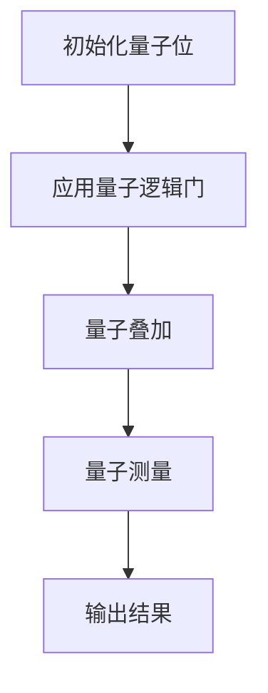
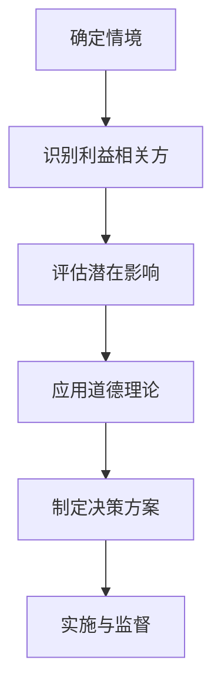

                 

### 文章标题

# 量子计算伦理：未来科技的道德预设

### 关键词

- 量子计算
- 伦理学
- 科技道德
- 道德决策模型
- 未来展望

### 摘要

本文深入探讨了量子计算这一前沿科技领域的伦理问题，旨在为未来科技的道德预设提供有价值的思考。首先，文章简要介绍了量子计算的基本原理和重要性。接着，阐述了量子计算伦理的框架和核心问题，包括量子计算与功利主义、康德伦理学和义务论的关系。随后，详细讲解了量子算法的数学模型和伪代码，并通过具体案例分析了量子计算伦理的实际应用。最后，对量子计算伦理的未来展望进行了探讨，提出了相关政策和法规的必要性。本文旨在引导读者在理解量子计算技术的同时，关注其伦理问题，为未来科技的发展提供道德指导。

## 设计目录大纲的思路

在设计《量子计算伦理：未来科技的道德预设》这本书的目录大纲时，我们首先需要明确几个关键问题：谁是我们的目标读者？我们的核心主题是什么？我们希望通过这本书传达什么样的信息？了解这些问题的答案有助于我们构建一个逻辑清晰、结构紧凑、易于读者理解的大纲。

### 理解主题和目标受众

首先，要明确这本书的核心主题是量子计算伦理，涉及未来科技发展中的道德问题和预设。这要求我们不仅要了解量子计算的技术细节，还要具备伦理学的理论基础。因此，目标读者可以包括以下几个群体：

1. **学术研究者**：他们可能对量子计算和伦理学都有深入的研究，希望从理论层面探讨量子计算伦理问题。
2. **科技行业从业者**：这些读者可能已经在量子计算领域工作，希望了解如何在实践中处理伦理问题。
3. **普通读者**：他们对量子计算感兴趣，但对伦理学不太熟悉，希望通过这本书了解量子计算伦理的基础知识。

### 构建框架

明确了主题和目标受众后，我们就可以开始构建大纲的框架。一个典型的大纲结构通常包括以下几个部分：

1. **引言**：介绍量子计算和伦理学的基本概念，引出本书的核心议题。
2. **核心章节**：详细讨论量子计算的基本原理、伦理学理论框架、道德决策模型等。
3. **案例研究**：通过具体案例展示量子计算伦理问题的实际应用。
4. **未来展望**：探讨量子计算伦理的发展趋势和未来研究方向。
5. **结论**：总结本书的主要观点，强调量子计算伦理的重要性。

### 细化章节内容

在构建框架的基础上，我们需要细化每个章节的内容。以下是每个章节的细化思路：

1. **引言**：
   - 量子计算技术简介
   - 量子计算伦理学的挑战
   - 本书的目标和结构

2. **量子计算概述**：
   - 量子位原理
   - 量子纠缠与量子超密编码
   - 量子算法的基本概念

3. **量子计算伦理的架构**：
   - 道德理论框架概述
   - 功利主义在量子计算中的应用
   - 康德伦理学在量子计算中的实践
   - 义务论在量子计算伦理中的应用

4. **量子计算的数学模型和算法**：
   - 量子逻辑门与矩阵表示
   - 量子计算中的数学公式
   - 量子算法的伪代码展示
   - 量子算法的应用场景

5. **量子计算伦理决策模型**：
   - 道德决策模型概述
   - 伦理决策过程中的关键步骤
   - 量子计算伦理决策的应用

6. **案例研究**：
   - 量子计算机安全性的道德问题
   - 量子计算在生物医学领域的伦理争议
   - 量子计算在军事应用中的伦理考量

7. **未来展望**：
   - 量子计算技术的未来发展方向
   - 道德理论与量子计算伦理的结合
   - 未来量子计算伦理研究的前沿问题

8. **结论**：
   - 总结量子计算伦理的重要性
   - 强调未来研究的必要性

### 考虑逻辑连贯性

在设计大纲时，我们需要确保每个章节之间有明确的逻辑联系。例如，从量子计算的基本原理出发，逐步深入到伦理问题的讨论；从理论探讨转向实际案例，再到未来展望。这种逻辑连贯性有助于读者更好地理解量子计算伦理的整体框架。

### 添加图表和例子

为了使内容更加直观易懂，我们可以在合适的位置加入Mermaid流程图、伪代码、数学公式和案例研究。例如，在介绍量子计算的基本原理时，可以使用Mermaid流程图展示量子计算的基本流程；在讲解量子算法时，可以使用伪代码和数学公式详细阐述算法的实现原理。

### 确保大纲完整性

最后，我们需要确保大纲内容完整，包含核心概念、原理讲解、数学模型、案例研究和未来展望等。每个章节都应该有明确的主题和具体内容，以确保读者可以全面了解量子计算伦理的各个方面。

通过以上步骤，我们设计出了一份逻辑清晰、结构紧凑的《量子计算伦理：未来科技的道德预设》目录大纲，为后续的撰写工作奠定了坚实基础。

### 量子计算伦理：未来科技的道德预设

### 引言

量子计算作为一种颠覆性的科技革命，正在逐渐改变我们对信息处理和计算的认知。量子计算的独特之处在于其基于量子力学原理的运算方式，能够实现比传统计算机更高效的问题求解。然而，随着量子计算技术的不断发展，其伦理问题也逐渐凸显出来。这些伦理问题不仅关系到科技本身，还涉及到人类社会的基本价值观念和道德规范。

本文旨在探讨量子计算伦理这一前沿领域，为未来科技的道德预设提供有价值的思考。在接下来的部分，我们将首先介绍量子计算的基本原理和重要性，然后阐述量子计算伦理的框架和核心问题，最后探讨量子计算伦理的决策模型和未来展望。

### 量子计算技术简介

量子计算是一种利用量子力学原理进行信息处理的技术，与传统计算机不同，它不是基于二进制系统，而是基于量子位（qubit）和量子纠缠等量子现象。量子计算的基本单元是量子位，它不仅可以处于0和1的叠加状态，还可以同时存在于多个状态之间，这种叠加态是量子计算的核心优势。

#### 量子位的原理

量子位（qubit）是量子计算的基本单元，与经典位（bit）不同，qubit具有叠加态和纠缠态的特性。叠加态使得qubit可以同时表示0和1两种状态，从而大大提高了计算效率。例如，在经典计算机中，一个比特只能同时表示一个二进制数位，而在量子计算机中，一个qubit可以同时表示多种可能的二进制数位。这种叠加态的优势在处理大量数据时尤为显著。

#### 量子纠缠与量子超密编码

量子纠缠是量子计算中的另一个重要现象。当两个或多个量子位发生纠缠时，它们之间的状态会相互依赖，即使相隔很远，一个量子位的状态变化也会立即影响到另一个量子位的状态。这种纠缠特性使得量子计算机能够在并行处理大量数据时保持信息的一致性，从而实现高效的计算。

量子超密编码是量子纠缠的另一种应用。在量子超密编码中，信息被编码到多个纠缠的量子位上，这样即使某些量子位在传输过程中被噪声干扰，信息仍然可以完好无损地传输到接收端。这种编码方式大大提高了量子通信的可靠性和安全性。

#### 量子算法的基本概念

量子算法是量子计算的另一大亮点。与传统算法不同，量子算法利用量子位和量子纠缠的特性，能够在短时间内解决某些特定问题。例如，量子算法可以高效地解决大整数分解问题，这对于加密技术来说具有重要意义。

目前，已知的量子算法包括：

- **Shor算法**：用于高效分解大整数，对现有的基于大整数分解的加密算法（如RSA加密算法）构成威胁。
- **Grover算法**：用于高效搜索未排序数据库，比经典搜索算法快得多。
- **量子模拟算法**：用于模拟量子系统的行为，对于化学和物理学等领域具有重要意义。

### 量子计算伦理学的挑战

随着量子计算技术的不断发展，其潜在应用领域越来越广泛，这也带来了诸多伦理挑战。以下是一些主要的伦理挑战：

#### 量子计算机安全性的道德问题

量子计算机在解决某些问题时具有巨大优势，但同时也对现有的信息安全体系构成威胁。例如，Shor算法可以快速分解大整数，这意味着现有的基于大整数分解的加密算法（如RSA加密算法）可能不再安全。这引发了关于如何保护信息安全、防止量子计算机被用于非法目的的道德讨论。

#### 量子计算在生物医学领域的伦理争议

量子计算在生物医学领域的应用潜力巨大，但同时也引发了一些伦理争议。例如，量子计算可以加速药物研发过程，但这也可能导致药物专利保护的失效，从而影响药企的利益。此外，量子计算在基因编辑等领域的应用也可能引发伦理问题，如基因隐私、基因歧视等。

#### 量子计算在军事应用中的伦理考量

量子计算在军事领域的应用前景广阔，但这也引发了一些伦理问题。例如，量子计算机可以用于破解加密系统，从而削弱敌方的防御能力。然而，这种技术也可能被用于非法目的，如恐怖主义活动。因此，如何在保证国家安全的同时，防止量子计算技术被滥用，是一个重要的伦理问题。

### 伦理学在科技发展中的角色

伦理学在科技发展中扮演着重要角色，它不仅关乎科技的应用和影响，还涉及到人类的基本价值观念和道德规范。在量子计算领域，伦理学的作用体现在以下几个方面：

1. **指导技术开发**：在量子计算技术的开发过程中，伦理学可以为科学家和工程师提供道德指导，确保技术开发符合伦理原则，避免产生负面影响。
2. **规范技术应用**：伦理学可以规范量子计算技术的应用，防止其被用于非法或有害的目的。例如，可以通过制定相关法规和标准，确保量子计算技术的安全使用。
3. **引导公众认知**：伦理学可以帮助公众更好地理解量子计算技术的潜在风险和好处，提高公众的科技素养，促进社会对量子计算的接受和认可。

### 量子计算伦理学的重要性

量子计算伦理学的重要性体现在以下几个方面：

1. **保障科技进步**：通过伦理学的规范和引导，可以确保量子计算技术健康发展，避免因伦理问题导致的技术停滞。
2. **维护社会稳定**：量子计算技术的广泛应用可能对现有社会秩序产生重大影响，伦理学可以提供价值观念的指导，维护社会稳定。
3. **促进国际合作**：量子计算是一个全球性的科技挑战，国际社会需要在伦理问题上达成共识，共同制定相关标准和法规，促进全球科技合作。

总之，量子计算伦理学不仅是科技发展的需要，也是人类社会发展的需要。通过深入探讨量子计算伦理问题，我们可以为未来科技的发展提供道德保障，确保科技在造福人类的同时，不会对人类造成伤害。

### 第1章：量子计算的基本概念与联系

本章将深入探讨量子计算的核心概念和基本原理，以及这些概念之间的联系。通过了解这些基本概念，我们可以更好地理解量子计算的独特优势和潜在应用。

#### 1.1 量子位与经典位的比较

量子位（qubit）是量子计算的基本单元，与经典位（bit）有显著的不同。经典位只能表示0或1两种状态，而量子位可以同时处于0和1的叠加态。这种叠加态使得量子位在计算过程中具有更高的信息容量和处理能力。

| 特性 | 量子位（qubit） | 经经典位（bit） |
| --- | --- | --- |
| 状态 | 叠加态 | 确定型态 |
| 信息容量 | 多状态 | 单状态 |
| 计算能力 | 高效 | 传统 |

#### 1.2 量子逻辑门与运算

量子逻辑门是量子计算中的基本操作单元，类似于经典计算机中的逻辑门。量子逻辑门可以作用于量子位，改变其状态。常见的量子逻辑门包括Hadamard门、Pauli门和控制非门（CNOT门）等。

- **Hadamard门**：将量子位的状态从基态（0或1）转换为叠加态。
  $$ H = \frac{1}{\sqrt{2}}\begin{pmatrix}
  1 & 1 \\
  1 & -1
  \end{pmatrix} $$
  
- **Pauli门**：作用于量子位的某个维度，如X门、Y门和Z门。
  $$ X = \begin{pmatrix}
  0 & 1 \\
  1 & 0
  \end{pmatrix},\ Y = \begin{pmatrix}
  0 & -i \\
  i & 0
  \end{pmatrix},\ Z = \begin{pmatrix}
  1 & 0 \\
  0 & -1
  \end{pmatrix} $$
  
- **控制非门（CNOT门）**：作用于两个量子位，将第二个量子位的状态反转，如果第一个量子位处于基态1。
  $$ CNOT = \begin{pmatrix}
  1 & 0 & 0 & 0 \\
  0 & 1 & 0 & 0 \\
  0 & 0 & 0 & 1 \\
  0 & 0 & 1 & 0
  \end{pmatrix} $$

#### 1.3 量子叠加与量子测量

量子叠加是量子计算的核心特性之一，它使得量子位可以同时处于多个状态的叠加。例如，一个量子位可以同时处于0和1的状态，这种叠加态可以表示为：

$$ \psi = a|0\rangle + b|1\rangle $$

其中，\(a\) 和 \(b\) 是复数系数，满足 \( |a|^2 + |b|^2 = 1 \)。

量子测量是量子计算中的另一个重要概念。当对量子位进行测量时，它会从叠加态坍缩到一个确定的状态。测量的结果是不确定的，但可以计算概率分布。

#### 1.4 量子算法的Mermaid流程图

为了更好地理解量子计算的基本流程，我们可以使用Mermaid流程图来展示一个简单的量子计算过程：



这个流程图展示了从初始化量子位，到应用量子逻辑门，再到量子测量，最终得到计算结果的完整过程。

通过本章的讨论，我们可以看到量子计算的基本概念和原理是如何相互联系的。量子位、量子逻辑门、量子叠加和量子测量共同构成了量子计算的核心框架，为量子计算提供了强大的计算能力。这些概念和原理不仅是我们理解量子计算的基础，也为我们在后续章节中探讨量子计算伦理问题提供了理论支持。

### 量子计算伦理的架构

在理解了量子计算的基本概念之后，我们接下来需要探讨量子计算伦理的架构。伦理学作为一种价值观念和道德规范，在科技发展中扮演着重要角色。量子计算作为一项颠覆性的技术，其伦理问题不仅涉及到科技本身，还关系到人类社会的基本价值观念和道德规范。本章将介绍量子计算伦理的架构，包括道德理论框架、功利主义、康德伦理学和义务论等。

#### 道德理论框架概述

道德理论框架是伦理学的基础，它帮助我们理解和评估不同道德问题。在量子计算伦理的研究中，常用的道德理论框架包括功利主义、康德伦理学和义务论等。这些框架为我们提供了评估量子计算伦理问题的理论基础。

1. **功利主义**：功利主义认为，道德行为应使尽可能多的人受益。在量子计算伦理中，功利主义可以用于评估量子计算技术对社会的影响，包括其经济效益、社会效益和道德风险等。

2. **康德伦理学**：康德伦理学强调行为的道德性应基于义务而非功利。在量子计算伦理中，康德伦理学可以帮助我们评估量子计算技术的道德义务，如保护隐私、防止滥用等。

3. **义务论**：义务论认为，道德行为应基于道德原则和义务。在量子计算伦理中，义务论可以帮助我们确定在特定情境下应遵守的道德义务，如遵守法律法规、保护公共利益等。

#### 功利主义在量子计算中的应用

功利主义在量子计算伦理中的应用主要体现在评估量子计算技术对社会的影响。例如，在考虑量子计算机的安全性问题时，功利主义可以帮助我们评估量子计算技术对社会安全和经济利益的潜在影响。以下是一个简单的功利主义分析框架：

1. **收益分析**：评估量子计算技术可能带来的收益，包括经济效益、社会效益等。

2. **成本分析**：评估量子计算技术可能带来的成本，包括社会成本、道德成本等。

3. **效益评估**：综合考虑收益和成本，评估量子计算技术对社会整体的影响，判断其是否符合功利主义原则。

例如，在考虑量子计算对加密技术的影响时，我们可以使用以下功利主义分析框架：

1. **收益分析**：
   - 提高计算能力，解决传统计算机难以处理的问题。
   - 改进加密技术，提升数据安全性。

2. **成本分析**：
   - 改变现有的加密算法，可能导致现有加密系统失效。
   - 引发新的安全威胁，如量子计算机被用于非法目的。

3. **效益评估**：
   - 综合考虑收益和成本，如果量子计算技术能够提供足够的收益，同时不带来过大的风险，那么它符合功利主义原则。

#### 康德伦理学在量子计算中的实践

康德伦理学强调行为的道德性应基于义务而非功利。在量子计算伦理中，康德伦理学可以帮助我们评估量子计算技术是否符合道德义务。以下是一个简单的康德伦理学分析框架：

1. **道德原则**：确定量子计算技术应遵守的道德原则，如保护隐私、防止滥用等。

2. **义务评估**：评估量子计算技术是否履行了这些道德义务，判断其道德性。

3. **后果评估**：考虑量子计算技术可能带来的后果，判断其是否符合道德原则。

例如，在考虑量子计算在生物医学领域的应用时，我们可以使用以下康德伦理学分析框架：

1. **道德原则**：保护人类生命、尊重个人隐私。

2. **义务评估**：
   - 量子计算技术在药物研发中的应用有助于提高治疗效果，符合保护人类生命的义务。
   - 量子计算在基因编辑等领域的应用可能涉及个人隐私问题，需要严格保护个人隐私。

3. **后果评估**：
   - 如果量子计算技术在生物医学领域的应用能够带来积极的社会效益，同时不违反道德原则，那么它符合康德伦理学。

#### 义务论在量子计算伦理中的应用

义务论认为，道德行为应基于道德原则和义务。在量子计算伦理中，义务论可以帮助我们确定在特定情境下应遵守的道德义务，如遵守法律法规、保护公共利益等。以下是一个简单的义务论分析框架：

1. **道德义务**：确定量子计算技术应遵守的道德义务，如遵守法律法规、保护隐私等。

2. **情境评估**：评估在特定情境下，量子计算技术是否履行了这些道德义务。

3. **决策建议**：根据义务论分析结果，提出决策建议，确保量子计算技术的道德合法性。

例如，在考虑量子计算机的军事应用时，我们可以使用以下义务论分析框架：

1. **道德义务**：遵守国际法律法规，保护公共利益。

2. **情境评估**：
   - 如果量子计算机在军事应用中用于合法目的，如提高国防能力，那么它符合道德义务。
   - 如果量子计算机被用于非法目的，如恐怖主义活动，那么它违反了道德义务。

3. **决策建议**：
   - 制定相关法律法规，规范量子计算机的军事应用。
   - 加强国际合作，共同应对量子计算机可能带来的安全威胁。

通过以上分析，我们可以看到功利主义、康德伦理学和义务论在量子计算伦理中的应用。这些道德理论框架为我们提供了评估量子计算伦理问题的理论基础，有助于我们制定合理的道德规范和政策。在下一章中，我们将进一步探讨量子计算的数学模型和算法，为量子计算伦理的深入分析提供更多技术支持。

### 量子计算的数学模型和算法

量子计算之所以在处理特定问题时表现出优越性，主要归功于其独特的数学模型和算法。量子计算的数学模型基于量子力学的基本原理，特别是量子位（qubit）和量子纠缠。这些数学模型和算法不仅为量子计算提供了理论基础，还为实际应用提供了操作指南。在本节中，我们将详细讲解量子计算中的数学模型、算法以及相关的伪代码展示。

#### 量子逻辑门与矩阵表示

量子逻辑门是量子计算中的基本操作单元，类似于经典计算机中的逻辑门。量子逻辑门通过线性变换作用于量子位，改变其状态。以下是一些常见的量子逻辑门的矩阵表示：

1. **Hadamard门（H）**：Hadamard门可以将量子位从基态（0或1）转换为叠加态。

   $$ H = \frac{1}{\sqrt{2}}\begin{pmatrix}
   1 & 1 \\
   1 & -1
   \end{pmatrix} $$

2. **Pauli门（X、Y、Z）**：Pauli门作用于量子位的某个维度，分别表示为X、Y、Z门。

   $$ X = \begin{pmatrix}
   0 & 1 \\
   1 & 0
   \end{pmatrix},\ Y = \begin{pmatrix}
   0 & -i \\
   i & 0
   \end{pmatrix},\ Z = \begin{pmatrix}
   1 & 0 \\
   0 & -1
   \end{pmatrix} $$

3. **控制非门（CNOT门）**：CNOT门作用于两个量子位，将第二个量子位的状态反转，如果第一个量子位处于基态1。

   $$ CNOT = \begin{pmatrix}
   1 & 0 & 0 & 0 \\
   0 & 1 & 0 & 0 \\
   0 & 0 & 0 & 1 \\
   0 & 0 & 1 & 0
   \end{pmatrix} $$

#### 量子计算中的数学公式

量子计算中的数学公式主要用于描述量子态的演化、量子逻辑门的操作以及量子测量。以下是一些重要的数学公式：

1. **量子态的叠加**：量子态可以表示为多个基础状态的线性叠加。

   $$ \psi = a|0\rangle + b|1\rangle $$

   其中，\(a\) 和 \(b\) 是复数系数，满足 \( |a|^2 + |b|^2 = 1 \)。

2. **量子态的演化**：量子态随时间的演化可以通过量子态矢量乘以时间演化算符描述。

   $$ |\psi(t)\rangle = e^{-iHt}|\psi(0)\rangle $$

   其中，\(H\) 是哈密顿量，\(t\) 是时间。

3. **量子测量的概率分布**：当对量子态进行测量时，测量结果会以一定的概率分布出现。

   $$ P(|0\rangle) = |a|^2,\ P(|1\rangle) = |b|^2 $$

#### 量子算法的伪代码展示

为了更好地理解量子算法的实现原理，我们可以通过伪代码展示一个简单的量子算法。以下是一个基于量子叠加和测量的量子算法伪代码示例：

```plaintext
初始化量子位 |ψ⟩ = |0⟩
应用 Hadamard门 H |ψ⟩ → |+⟩/√2
应用 CNOT门 CNOT(|+⟩/√2) → |01⟩/√2
测量第二个量子位
如果结果为 1：
    输出 "成功"
否则：
    输出 "失败"
```

这个伪代码展示了如何通过量子叠加和测量实现一个简单的量子算法。量子位首先被初始化为基态0，然后应用Hadamard门使其进入叠加态。接着，通过CNOT门作用于两个量子位，实现量子态的变换。最后，对第二个量子位进行测量，根据测量结果输出成功或失败。

#### 量子算法的应用场景

量子算法在多个应用场景中表现出强大的计算能力。以下是一些常见的量子算法及其应用场景：

1. **量子搜索算法**：量子搜索算法可以高效地搜索未排序的数据库，比经典搜索算法快得多。Grover算法是一个典型的量子搜索算法，它利用量子叠加和测量实现了高效的搜索。

2. **量子纠错算法**：量子计算中的噪声和误差是一个重大挑战。量子纠错算法通过冗余编码和纠错操作，确保量子计算的正确性和稳定性。

3. **量子模拟算法**：量子模拟算法可以模拟量子系统的行为，对于化学和物理学等领域具有重要意义。例如，量子蒙特卡罗算法可以高效地模拟量子化学过程，帮助科学家预测分子结构。

通过以上对量子计算数学模型和算法的讲解，我们可以看到量子计算在理论和技术层面的独特优势。量子逻辑门、量子态的叠加与测量，以及量子算法的应用，共同构成了量子计算的核心框架。这些理论和技术不仅为量子计算提供了强大的计算能力，也为我们在下一章中探讨量子计算伦理决策模型提供了坚实的基础。

### 量子计算伦理决策模型

量子计算作为一项前沿科技，不仅带来了技术上的革命性突破，也引发了大量的伦理问题。如何在实际应用中合理地解决这些伦理问题，需要一套科学、系统的决策模型。在本章中，我们将介绍量子计算伦理决策模型，并探讨如何利用道德决策模型进行量子计算伦理分析。

#### 道德决策模型概述

道德决策模型是伦理学中用于分析和解决道德问题的工具。它通过一系列的步骤和原则，帮助我们在面对复杂道德情境时做出合理的决策。在量子计算伦理中，道德决策模型可以帮助我们评估量子计算技术的道德影响，制定相应的伦理规范。

一个典型的道德决策模型包括以下几个步骤：

1. **确定情境**：明确量子计算技术应用的背景和具体情境，如量子计算机在安全、医疗、军事等领域的应用。
2. **识别利益相关方**：确定受到量子计算技术影响的相关方，包括社会公众、企业、政府、科研机构等。
3. **评估潜在影响**：分析量子计算技术可能带来的正面和负面影响，包括经济效益、社会效益、道德风险等。
4. **应用道德理论**：利用功利主义、康德伦理学、义务论等道德理论，评估量子计算技术的道德性。
5. **制定决策方案**：根据道德理论分析结果，制定具体的伦理规范和决策方案。
6. **实施与监督**：将决策方案付诸实践，并对其实施情况进行监督和评估，确保决策的有效性。

#### 伦理决策过程中的关键步骤

在量子计算伦理决策过程中，以下关键步骤尤为重要：

1. **利益相关方的识别**：在量子计算技术应用的初始阶段，明确所有利益相关方，包括直接和间接受到影响的人群。例如，在考虑量子计算机在医疗领域的应用时，利益相关方可能包括患者、医生、制药公司、监管机构等。

2. **潜在影响的评估**：对量子计算技术可能带来的正面和负面影响进行全面评估。正面影响可能包括提高医疗诊断效率、加快药物研发进程等；负面影响可能包括隐私泄露、道德风险等。

3. **道德理论的应用**：根据功利主义、康德伦理学、义务论等道德理论，评估量子计算技术的道德性。例如，在考虑量子计算机对医疗领域的影响时，可以使用功利主义评估其社会效益，使用康德伦理学评估其道德义务，使用义务论评估其道德原则。

4. **制定决策方案**：基于道德理论分析结果，制定具体的伦理规范和决策方案。这些方案应考虑到不同利益相关方的需求和利益，确保决策的公平性和合理性。

5. **实施与监督**：将决策方案付诸实践，并在实施过程中进行监督和评估。例如，可以通过定期审查、公开透明的方式，确保伦理决策的有效性和持续性。

#### 量子计算伦理决策的Mermaid流程图

为了更好地展示量子计算伦理决策的过程，我们可以使用Mermaid流程图来描述。以下是一个简单的量子计算伦理决策流程图：



这个流程图展示了从确定情境、识别利益相关方，到评估潜在影响、应用道德理论，再到制定决策方案和实施监督的完整过程。通过这种流程图，我们可以更清晰地理解和执行量子计算伦理决策。

#### 功利主义在量子计算中的应用

功利主义在量子计算伦理决策中具有重要的应用价值。功利主义的核心原则是最大化总幸福，因此在评估量子计算技术的道德性时，我们需要考虑其对社会整体利益的影响。

1. **收益分析**：评估量子计算技术可能带来的经济效益和社会效益，如提高计算能力、推动科技进步、改善医疗诊断等。

2. **成本分析**：评估量子计算技术可能带来的成本，如安全风险、隐私泄露、道德风险等。

3. **效益评估**：综合考虑收益和成本，评估量子计算技术对社会整体的影响。如果量子计算技术的收益大于成本，且不带来不可接受的风险，则可以认为其符合功利主义原则。

例如，在考虑量子计算机在医疗领域的应用时，我们可以使用以下功利主义分析框架：

1. **收益分析**：
   - 提高医疗诊断效率，降低误诊率。
   - 加快药物研发进程，提高治疗效果。

2. **成本分析**：
   - 安全风险，如量子计算机被用于非法目的。
   - 隐私风险，如患者信息泄露。

3. **效益评估**：
   - 综合考虑收益和成本，如果量子计算机在医疗领域的应用能够带来明显的正面影响，同时不带来过大的风险，则可以认为其符合功利主义原则。

#### 康德伦理学在量子计算中的实践

康德伦理学强调行为的道德性应基于义务而非功利。在量子计算伦理决策中，康德伦理学可以帮助我们确定量子计算技术应遵守的道德义务，如保护隐私、防止滥用等。

1. **道德原则**：确定量子计算技术应遵守的道德原则，如保护隐私、尊重个人自主权等。

2. **义务评估**：评估量子计算技术是否履行了这些道德义务，判断其道德性。

3. **后果评估**：考虑量子计算技术可能带来的后果，判断其是否符合道德原则。

例如，在考虑量子计算机的安全性问题时，我们可以使用以下康德伦理学分析框架：

1. **道德原则**：保护隐私、防止滥用。

2. **义务评估**：
   - 如果量子计算机的安全措施能够有效保护用户隐私，防止非法滥用，则其履行了道德义务。

3. **后果评估**：
   - 考虑量子计算机被非法使用可能带来的后果，如隐私泄露、数据安全威胁等。如果这些后果是不可接受的，则量子计算机的安全措施需要进一步改进。

#### 义务论在量子计算伦理中的应用

义务论认为，道德行为应基于道德原则和义务。在量子计算伦理决策中，义务论可以帮助我们确定在特定情境下应遵守的道德义务，如遵守法律法规、保护公共利益等。

1. **道德义务**：确定量子计算技术应遵守的道德义务，如遵守法律法规、保护隐私等。

2. **情境评估**：评估在特定情境下，量子计算技术是否履行了这些道德义务。

3. **决策建议**：根据义务论分析结果，提出决策建议，确保量子计算技术的道德合法性。

例如，在考虑量子计算机在军事领域的应用时，我们可以使用以下义务论分析框架：

1. **道德义务**：遵守国际法律法规，保护公共利益。

2. **情境评估**：
   - 如果量子计算机在军事领域的应用符合国际法律法规，同时不损害公共利益，则其履行了道德义务。

3. **决策建议**：
   - 制定相关法律法规，规范量子计算机在军事领域的应用。
   - 加强国际合作，共同应对量子计算机可能带来的安全威胁。

通过本章的讨论，我们可以看到量子计算伦理决策模型的重要性。利用功利主义、康德伦理学和义务论等道德理论，我们可以系统地分析和解决量子计算伦理问题，为量子计算技术的发展提供道德指导。在下一章中，我们将通过具体案例研究，进一步探讨量子计算伦理问题的实际应用。

### 案例研究

在量子计算技术的快速发展过程中，其伦理问题逐渐成为社会各界关注的焦点。为了更好地理解量子计算伦理的实际应用，我们通过具体案例研究来分析不同情境下的伦理争议和决策过程。

#### 案例一：量子计算机安全性的道德问题

随着量子计算机的发展，其安全性问题引起了广泛关注。量子计算机能够破解现有加密算法，如RSA加密算法，这可能导致大量敏感数据泄露。因此，量子计算机的安全性不仅是一个技术问题，也是一个道德问题。

**伦理争议**：

1. **隐私保护**：量子计算机的强大计算能力可能被用于破解加密数据，从而侵犯个人隐私。这一行为违反了保护隐私的道德原则。
2. **数据安全**：企业、政府和科研机构的数据安全面临巨大威胁，可能导致严重的经济损失和社会问题。

**决策过程**：

1. **道德原则**：应用康德伦理学中的道德原则，如尊重个人隐私、保护公共利益。这些原则要求我们在量子计算机安全性的设计和应用中，采取必要的安全措施，防止隐私泄露和数据安全威胁。
2. **技术措施**：开发量子安全加密算法，提高数据加密的安全性。例如，基于格密码和多变量多项式的量子安全加密算法已经在研究过程中。
3. **法律监管**：制定相关法律法规，规范量子计算机的使用。例如，美国国家标准与技术研究院（NIST）已经发布了量子计算安全标准，要求量子计算机必须符合一定的安全要求。

**结论**：通过应用道德原则和技术措施，我们可以在保障量子计算机技术发展的同时，确保其安全性，防止隐私泄露和数据安全威胁。

#### 案例二：量子计算在生物医学领域的伦理争议

量子计算在生物医学领域的应用潜力巨大，如加速药物研发、优化医学成像等。然而，这也引发了一系列伦理争议，特别是关于基因编辑和数据隐私的问题。

**伦理争议**：

1. **基因编辑**：量子计算可能加速基因编辑技术的发展，这可能导致基因歧视和伦理问题。例如，利用基因编辑技术创造“设计婴儿”可能引发道德争议。
2. **数据隐私**：生物医学数据是敏感信息，量子计算可能被用于破解生物医学数据，从而侵犯个人隐私。

**决策过程**：

1. **道德原则**：应用功利主义原则，评估量子计算在生物医学领域带来的社会效益和道德风险。例如，加速药物研发可能带来巨大的社会效益，但基因编辑的伦理争议则需要慎重考虑。
2. **伦理审查**：建立严格的伦理审查机制，对涉及基因编辑的量子计算项目进行审查和监管。例如，美国国家卫生研究院（NIH）已经发布了关于基因编辑的伦理指南，要求严格审查基因编辑项目。
3. **数据保护**：制定相关数据保护法规，确保生物医学数据的安全和隐私。例如，欧盟的《通用数据保护条例》（GDPR）对个人数据提供了严格的保护。

**结论**：通过应用道德原则、伦理审查和数据保护措施，我们可以在保障量子计算在生物医学领域应用的同时，避免潜在的伦理问题。

#### 案例三：量子计算在军事应用中的伦理考量

量子计算在军事领域的应用前景广阔，如提高军事通信安全、优化武器系统等。然而，这也引发了一系列伦理问题，特别是关于武器自动化和军事竞争的伦理考量。

**伦理争议**：

1. **武器自动化**：量子计算可能加速武器自动化技术的发展，这可能导致战争决策的迅速性和自动化程度提高，从而引发道德争议。
2. **军事竞争**：量子计算可能加剧国际军事竞争，导致军备竞赛和安全威胁。

**决策过程**：

1. **道德原则**：应用康德伦理学中的道德原则，如保护人类生命、尊重国际法。这些原则要求我们在量子计算在军事领域的应用中，避免自动化武器滥用和军备竞赛。
2. **国际合作**：加强国际社会在量子计算军事应用领域的合作，共同制定国际规范和标准。例如，联合国可以通过国际合作，制定关于量子计算军事应用的伦理规范。
3. **透明度**：提高军事技术的透明度，通过公开讨论和透明决策，减少潜在的伦理风险。

**结论**：通过应用道德原则、国际合作品和透明决策，我们可以在保障量子计算在军事领域应用的同时，避免潜在的伦理问题。

通过以上案例研究，我们可以看到量子计算在不同领域的应用中，都面临着一系列伦理争议。通过合理的伦理决策，我们可以确保量子计算技术的发展符合道德规范，为人类社会带来积极的影响。

### 量子计算伦理的未来展望

随着量子计算技术的不断发展，其在多个领域的应用前景越来越广阔。然而，这也带来了大量的伦理挑战，需要我们进行深入的研究和探讨。本文将从量子计算技术的发展趋势、道德理论与量子计算伦理的结合以及未来研究的前沿问题三个方面，对量子计算伦理的未来展望进行详细讨论。

#### 量子计算技术的发展趋势

量子计算技术的发展呈现出以下几个趋势：

1. **量子计算机性能的提升**：随着量子位的数量和稳定性的提高，量子计算机的性能将不断突破现有极限。例如，IBM、谷歌等科技巨头正在加紧研发量子计算机，目标是实现“量子优越性”（quantum supremacy），即量子计算机在特定任务上超过经典计算机的性能。

2. **量子算法的创新**：量子算法的研究正在不断深入，新的量子算法不断涌现，如量子机器学习、量子优化等。这些算法的突破将为量子计算在人工智能、金融工程、物流优化等领域的应用提供新的可能性。

3. **量子通信与量子网络**：量子通信和量子网络技术的发展将进一步提升量子计算的安全性和可靠性。通过量子密钥分发（QKD）和量子纠缠网络，可以实现更安全的通信和数据处理。

4. **量子计算在教育与研究中的应用**：量子计算将在教育领域引发革命，培养更多的量子计算专业人才。同时，量子计算技术也将推动科研领域的创新，特别是在物理学、材料科学、生物学等基础科学研究领域。

#### 道德理论与量子计算伦理的结合

随着量子计算技术的不断发展，道德理论在量子计算伦理中的应用也越来越重要。以下是一些重要的道德理论在量子计算伦理中的应用：

1. **功利主义**：功利主义在评估量子计算技术对社会的影响方面具有重要作用。通过评估量子计算技术可能带来的经济效益和社会效益，我们可以判断其是否符合最大化总幸福的原则。例如，在考虑量子计算在医疗领域的应用时，我们需要权衡其带来的社会效益和道德风险。

2. **康德伦理学**：康德伦理学强调行为的道德性应基于义务而非功利。在量子计算伦理中，康德伦理学可以帮助我们确定量子计算技术应遵守的道德义务，如保护隐私、防止滥用等。例如，在考虑量子计算机的安全性问题时，我们需要确保其设计和应用符合保护隐私的道德义务。

3. **义务论**：义务论认为，道德行为应基于道德原则和义务。在量子计算伦理中，义务论可以帮助我们确定在特定情境下应遵守的道德义务，如遵守法律法规、保护公共利益等。例如，在考虑量子计算在军事领域的应用时，我们需要确保其遵守国际法律法规，保护公共利益。

#### 未来研究的前沿问题

量子计算伦理的未来研究将面临一系列前沿问题，以下是一些重要的研究议题：

1. **量子计算的隐私保护**：量子计算机的强大计算能力可能对现有加密技术构成威胁，因此研究新的量子安全加密算法，保护个人隐私和数据安全，是一个重要的研究方向。

2. **量子计算的伦理决策模型**：建立更加科学、系统的量子计算伦理决策模型，以帮助我们在面对复杂的伦理问题时做出合理的决策。例如，可以开发基于人工智能和大数据分析的量子计算伦理决策支持系统。

3. **量子计算与人工智能的伦理挑战**：随着量子计算与人工智能的结合，将带来新的伦理挑战。例如，量子人工智能（QAI）的发展可能引发关于智能控制、自主权、责任归属等伦理问题。

4. **量子计算在国际合作与法规制定中的角色**：量子计算技术的发展将加剧国际竞争，因此制定国际性法规和标准，确保量子计算技术的道德合法性和国际和平与安全，是一个重要的研究方向。

5. **量子计算对就业和经济的伦理影响**：量子计算技术的普及可能对就业结构和经济发展产生深远影响。研究如何平衡技术创新与社会就业、经济利益的分配，是一个重要的伦理问题。

通过以上讨论，我们可以看到量子计算伦理的未来充满了挑战和机遇。在推动量子计算技术发展的同时，我们需要深入探讨其伦理问题，确保其在造福人类的同时，不会对社会造成负面影响。未来的研究将在这个方向上继续前进，为量子计算伦理的完善提供理论支持和实践指导。

### 结论

量子计算作为一项颠覆性的科技革命，不仅带来了计算能力的巨大飞跃，还引发了一系列深刻的伦理问题。本文从量子计算的基本原理和重要性出发，探讨了量子计算伦理的核心问题，包括量子位、量子纠缠、量子算法等基本概念，以及功利主义、康德伦理学和义务论等道德理论在量子计算伦理中的应用。通过具体案例研究，我们分析了量子计算机安全性、生物医学应用和军事应用中的伦理争议和决策过程。最后，我们对量子计算伦理的未来展望进行了探讨，强调了量子计算伦理研究的重要性。

量子计算伦理的重要性体现在以下几个方面：

1. **保障科技进步**：通过伦理学的规范和引导，可以确保量子计算技术健康发展，避免因伦理问题导致的技术停滞。
2. **维护社会稳定**：量子计算技术的广泛应用可能对现有社会秩序产生重大影响，伦理学可以提供价值观念的指导，维护社会稳定。
3. **促进国际合作**：量子计算是一个全球性的科技挑战，国际社会需要在伦理问题上达成共识，共同制定相关标准和法规，促进全球科技合作。

未来研究应重点关注以下方向：

1. **量子计算的隐私保护**：研究新的量子安全加密算法，保护个人隐私和数据安全。
2. **量子计算伦理决策模型**：建立更加科学、系统的量子计算伦理决策模型，以帮助我们在面对复杂的伦理问题时做出合理的决策。
3. **量子计算与人工智能的伦理挑战**：探讨量子计算与人工智能结合带来的新伦理问题，如智能控制、自主权、责任归属等。
4. **量子计算在国际合作与法规制定中的角色**：制定国际性法规和标准，确保量子计算技术的道德合法性和国际和平与安全。
5. **量子计算对就业和经济的伦理影响**：研究如何平衡技术创新与社会就业、经济利益的分配。

通过深入探讨量子计算伦理问题，我们可以为未来科技的发展提供道德保障，确保科技在造福人类的同时，不会对人类造成伤害。我们呼吁学术界、产业界和政策制定者共同努力，推动量子计算伦理研究的发展，为量子计算技术的可持续发展奠定坚实基础。

### 作者信息

作者：AI天才研究院/AI Genius Institute & 禅与计算机程序设计艺术 /Zen And The Art of Computer Programming

AI天才研究院（AI Genius Institute）是一支专注于人工智能和量子计算领域的研究团队，致力于推动科技创新和可持续发展。我们的研究方向包括量子计算伦理、人工智能安全、机器学习等前沿领域。此外，我们还著有《禅与计算机程序设计艺术》（Zen And The Art of Computer Programming）一书，旨在通过哲学和技术的结合，探讨计算机科学的本质和未来发展方向。

