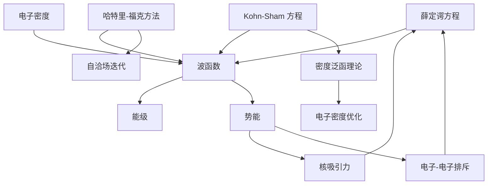

                 

## 文章标题

### 量子计算在化学模拟中的潜在应用前景

## 关键词

- 量子计算
- 化学模拟
- 分子动力学
- 量子算法
- 密度泛函理论
- 药物设计
- 材料科学

## 摘要

本文探讨了量子计算在化学模拟中的潜在应用前景。首先介绍了量子计算的背景及其在化学领域的应用。随后，深入讲解了量子算法的基本原理，包括量子相估计算法、量子模拟分子哈密顿量和变分量子 eigensolver（VQE）等。接着，本文阐述了量子化学中的核心数学模型，如薛定谔方程、哈特里-福克方法和密度泛函理论。然后，详细介绍了量子算法在化学模拟中的实现，包括量子电路设计、量子计算软件工具以及实际应用案例。最后，分析了量子计算在化学模拟中面临的技术挑战和未来发展趋势。本文旨在为读者提供一个全面了解量子计算在化学模拟领域应用前景的视角。

## 引言

### 量子计算与化学的相遇

随着科技的飞速发展，量子计算作为一项颠覆性的技术逐渐引起广泛关注。量子计算以其独特的并行计算能力和处理复杂问题的能力，被认为有可能在众多领域实现突破，其中就包括化学模拟。化学模拟是化学研究中的一项核心技术，它可以帮助我们理解和预测分子、原子和化学反应的性质和行为。然而，传统的经典计算方法在处理复杂化学系统时，往往面临着计算效率和精确度的瓶颈。这为量子计算在化学模拟中的应用提供了契机。

量子计算的基本原理源于量子力学。在量子力学中，物质世界的基本粒子如电子、原子核等，具有波粒二象性，其状态不能简单地用经典物理学的二元状态（0和1）来描述，而是需要用量子比特（qubit）来表示。量子比特可以通过量子叠加和量子纠缠实现并行计算，这使得量子计算机能够在某些特定问题上超越经典计算机。

### 量子计算与化学模拟的交集

量子计算与化学模拟的交集主要体现在以下几个方面：

1. **分子动力学模拟**：分子动力学模拟是一种通过求解薛定谔方程来研究分子和原子行为的计算方法。传统的分子动力学模拟在处理大规模分子系统时，需要大量的计算资源和时间。而量子计算可以通过量子叠加和量子纠缠，大幅度提高分子动力学模拟的效率。

2. **量子化学计算**：量子化学计算是一种通过量子力学方法来计算分子和化学反应性质的计算方法。传统的量子化学计算依赖于高精度的数学模型和复杂的计算算法，而量子计算可以提供更高效、更精确的解决方案。

3. **药物设计和材料科学**：在药物设计和材料科学领域，量子计算有望帮助我们更深入地理解分子和材料的性质，从而指导新药开发和材料设计。量子计算可以加速药物分子的优化和筛选过程，提高新药的发现效率；同时，它还可以帮助优化材料结构，提高材料性能。

### 量子算法在化学模拟中的应用

量子算法是量子计算的精髓所在。目前，已经有许多量子算法被提出并应用于化学模拟领域，其中最具有代表性的包括量子相估计算法、量子模拟分子哈密顿量和变分量子 eigensolver（VQE）等。

1. **量子相估计算法**：量子相估计算法是一种基于量子叠加和量子纠缠的算法，它能够高效地估算量子系统的相位。在化学模拟中，量子相估计算法可以用于估算分子的能级和激发态，从而帮助我们更精确地理解分子的性质。

2. **量子模拟分子哈密顿量**：量子模拟分子哈密顿量是一种将分子的哈密顿量表示为量子比特上的量子电路的方法。通过量子模拟分子哈密顿量，我们可以直接在量子计算机上模拟分子的量子态，从而实现分子动力学模拟和量子化学计算。

3. **变分量子 eigensolver（VQE）**：VQE 是一种结合量子力学原理和变分原理的算法，它通过迭代优化量子比特的参数，求解分子的基态能量。VQE 在化学模拟中具有广泛的应用，如分子优化、反应路径规划和分子动力学模拟等。

### 本文结构

本文将从以下几个方面展开讨论：

1. **量子计算的基本原理**：介绍量子计算的基础知识，包括量子比特、量子叠加和量子纠缠等概念。

2. **量子算法在化学模拟中的应用**：详细讲解量子相估计算法、量子模拟分子哈密顿量和 VQE 等算法，并分析其在化学模拟中的优势。

3. **量子化学中的核心数学模型**：介绍量子化学中的核心数学模型，如薛定谔方程、哈特里-福克方法和密度泛函理论。

4. **量子算法在化学模拟中的实现**：介绍量子电路设计、量子计算软件工具以及实际应用案例。

5. **挑战与未来展望**：分析量子计算在化学模拟中面临的技术挑战和未来发展趋势。

通过本文的讨论，我们希望为读者提供一个全面了解量子计算在化学模拟领域应用前景的视角。

## 量子计算的基本原理

### 量子比特和量子态

量子计算的基础是量子比特（qubit），它是量子计算的基本信息单元。与经典计算机中的比特（bit）不同，量子比特不仅可以表示0或1，还可以处于这两个状态的叠加。这种叠加态是量子计算的核心特性之一。

量子态可以用波函数（wave function）来描述。一个量子比特的波函数通常表示为复数的形式，如 $|\psi\rangle = \alpha|0\rangle + \beta|1\rangle$，其中 $\alpha$ 和 $\beta$ 是复数，且满足 $|\alpha|^2 + |\beta|^2 = 1$。这个波函数表示量子比特处于状态0的概率为 $|\alpha|^2$，处于状态1的概率为 $|\beta|^2$。

### 量子叠加

量子叠加是量子计算中的另一个基本特性。根据量子叠加原理，一个量子系统可以同时处于多个状态的叠加，而不仅仅是单个状态。这种叠加态可以通过量子比特之间的线性组合来实现。

例如，两个量子比特可以处于以下叠加态：
$$
|\psi\rangle = \frac{1}{\sqrt{2}} (|00\rangle + |11\rangle)
$$
这个叠加态表示两个量子比特同时处于状态00和状态11的叠加。

### 量子纠缠

量子纠缠是量子计算中的另一个重要特性。当两个量子比特发生纠缠时，它们之间的状态会相互关联，无论它们之间的距离有多远。这种关联性是经典计算所无法实现的。

量子纠缠可以通过以下过程实现。假设我们有两个量子比特 $A$ 和 $B$，初始时它们都处于状态0：
$$
|A\rangle = |0\rangle, \quad |B\rangle = |0\rangle
$$
然后，我们对量子比特 $A$ 施加一个旋转变换，使得它处于叠加态：
$$
|A\rangle \rightarrow \frac{1}{\sqrt{2}} (|0\rangle + |1\rangle)
$$
此时，量子比特 $A$ 和 $B$ 之间的状态变为：
$$
|A\rangle \otimes |B\rangle = \frac{1}{\sqrt{2}} (|00\rangle + |11\rangle)
$$
可以看到，量子比特 $A$ 和 $B$ 现在处于纠缠态。如果对量子比特 $A$ 进行测量，得到状态1的概率为 $\frac{1}{\sqrt{2}}$，此时量子比特 $B$ 的状态将自动坍缩为状态1。这种纠缠现象在经典计算中是无法实现的，它是量子计算的一大优势。

### 量子门和量子电路

量子门（quantum gate）是量子计算中的基本操作单元，类似于经典计算机中的逻辑门。量子门可以作用于量子比特，改变其状态。常见的量子门包括保罗门（Pauli gate）、控制非门（CNOT gate）和希尔伯特变换（Hadamard gate）等。

量子电路（quantum circuit）是由一系列量子门和量子比特组成的结构，用于实现特定的量子计算任务。量子电路的设计是量子计算中的关键环节，它决定了计算效率和精度。

以下是一个简单的量子电路示例，该电路通过希尔伯特变换和保罗门将一个量子比特的状态从 $|0\rangle$ 变换为 $|1\rangle$：
$$
\begin{array}{c}
H|0\rangle \rightarrow |+\rangle = \frac{1}{\sqrt{2}} (|0\rangle + |1\rangle) \\
Z|+\rangle \rightarrow |1\rangle
\end{array}
$$
其中，$H$ 是希尔伯特变换，$Z$ 是保罗门。

### 量子算法与经典算法的比较

量子算法与经典算法在处理特定问题时具有显著的优势。例如，量子相估计算法可以在多项式时间内估算出量子系统的相位，而经典算法需要指数时间。量子模拟分子哈密顿量算法可以在量子计算机上直接模拟分子的量子态，而经典模拟需要复杂的迭代过程。

然而，量子算法也存在一些局限性。首先，量子计算目前还处于早期发展阶段，量子计算机的规模和稳定性有限。其次，量子算法的实现需要复杂的量子电路设计和量子门的精确控制。此外，量子计算中的量子错误和噪声问题也是一个亟待解决的难题。

总的来说，量子计算在化学模拟中的基本原理为其提供了巨大的潜力，但也需要克服许多技术挑战才能实现其真正的应用价值。

### 量子相估计算法

量子相估计算法（Quantum Phase Estimation, QPE）是量子计算中的一种基本算法，它通过量子叠加和量子纠缠，能够高效地估算出量子系统的相位。QPE 算法在化学模拟中有着广泛的应用，特别是在分子动力学模拟和量子化学计算中。

#### 算法原理

QPE 算法的核心思想是利用量子计算机对量子态进行叠加和测量，从而估算出量子系统的相位。其基本步骤如下：

1. **初始化**：首先，我们将一个量子比特初始化为基态 $|0\rangle$。

2. **叠加态生成**：然后，我们通过一系列量子门将量子比特处于一个叠加态，这个叠加态与量子系统的相位相关。

3. **测量**：接下来，我们对量子比特进行测量，得到一个概率分布。通过这个概率分布，我们可以估算出量子系统的相位。

具体来说，QPE 算法可以分为以下几步：

- **第一步**：初始化一个量子比特为 $|0\rangle$。

- **第二步**：对量子比特施加一个旋转操作，使得量子比特处于一个叠加态。这个叠加态可以用以下公式表示：
  $$
  |s\rangle = \frac{1}{\sqrt{2}^N} \sum_{i=0}^{2^N-1} e^{i\phi i/2^N} |i\rangle
  $$
  其中，$N$ 是量子比特的数量，$\phi$ 是我们要估算的相位。

- **第三步**：对量子比特进行测量，得到一个概率分布。测量结果可以是 $|0\rangle$ 或 $|1\rangle$，其概率分别为：
  $$
  P_0 = \frac{1}{2} + \frac{1}{2^{2N}} \sin^2(\phi/2)
  $$
  $$
  P_1 = 1 - P_0
  $$

- **第四步**：通过测量结果，我们可以估算出量子系统的相位。具体地，我们可以通过以下公式计算：
  $$
  \hat{\phi} = 2 \arcsin\left(\sqrt{P_0}\right)
  $$

#### 伪代码

以下是一个简单的 QPE 算法的伪代码：

```
// 初始化量子比特
初始化量子比特为 |0⟩

// 施加旋转操作
for i from 1 to N do
    施加 Hadamard 门
    施加旋转门，旋转角度为 2π/n
end for

// 测量量子比特
测量结果为 x

// 估算相位
相位 = 2 * arcsin(sqrt(P0))
```

其中，$P_0$ 是测量得到的结果为 $|0\rangle$ 的概率。

#### 在化学模拟中的应用

QPE 算法在化学模拟中的应用主要包括：

1. **分子动力学模拟**：QPE 算法可以用于估算分子系统的能级和激发态，从而实现高效的分子动力学模拟。通过 QPE 算法，我们可以快速估算分子的基态能量和激发态能量，这对于分子动力学模拟中的能量计算和路径规划具有重要意义。

2. **量子化学计算**：QPE 算法在量子化学计算中也有着广泛的应用。例如，在计算分子的基态能量和激发态能量时，QPE 算法可以大幅提高计算效率。此外，QPE 算法还可以用于求解分子的激发态结构和反应路径，从而帮助我们更好地理解分子和化学反应的性质。

总的来说，QPE 算法以其高效的计算能力和精确的估算结果，为量子计算在化学模拟中的应用提供了强有力的支持。通过 QPE 算法，我们可以在分子动力学模拟和量子化学计算中实现更高的计算效率和更精确的模拟结果。

### 量子模拟分子哈密顿量

量子模拟分子哈密顿量（Quantum Simulation of Molecular Hamiltonians）是量子计算在化学模拟中的一个重要应用，它利用量子计算机强大的并行计算能力，对分子的量子态进行精确模拟。本节将详细介绍量子模拟分子哈密顿量的基本原理、实现方法及其在化学模拟中的应用。

#### 基本原理

量子模拟分子哈密顿量是通过构建一个量子电路，将分子的哈密顿量（Hamiltonian）映射到量子比特上，从而在量子计算机上直接模拟分子的量子态。分子的哈密顿量描述了分子中各个粒子（如原子核和电子）的动能和势能，其一般形式为：

$$
H = \sum_{i} t_i \sigma_i + \frac{1}{2} \sum_{i \neq j} V_{ij} \sigma_i \sigma_j
$$

其中，$t_i$ 是粒子的动能，$V_{ij}$ 是粒子间的相互作用势能，$\sigma_i$ 是粒子的 Pauli 矩阵。

量子模拟分子哈密顿量的核心思想是将分子的哈密顿量转换为量子电路的形式，然后通过量子计算机进行模拟。具体步骤如下：

1. **量子化**：将分子的哈密顿量表示为量子比特上的量子运算。例如，可以将动能项表示为旋转操作，相互作用势能项表示为量子门。

2. **量子电路构建**：根据分子的哈密顿量，构建相应的量子电路。量子电路的设计是量子模拟的关键，需要考虑量子比特的数量、量子门的精度和效率等因素。

3. **量子态初始化**：将量子计算机上的量子比特初始化为特定的量子态，这个量子态代表了分子的初始状态。

4. **量子态演化**：通过量子电路的演化，模拟分子在哈密顿量作用下的量子态演化过程。

5. **测量与估计**：对量子态进行测量，估计分子的量子态性质，如能量、激发态等。

#### 实现方法

量子模拟分子哈密顿量的实现可以分为以下几个步骤：

1. **哈密顿量的量子化**：

   首先，需要将分子的哈密顿量表示为量子比特上的运算。一个常见的量子化方法是将哈密顿量中的动能项和相互作用项分别表示为旋转操作和量子门。

   - **动能项**：动能项可以表示为 $t_i \sigma_i$，其中 $\sigma_i$ 是粒子的 Pauli 矩阵。这个动能项可以通过量子计算机上的旋转操作来模拟。例如，对量子比特 $q_i$ 施加一个旋转门，使得 $q_i$ 的状态从 $|0\rangle$ 变换到 $|1\rangle$，从而模拟粒子的动能。

   - **相互作用项**：相互作用项可以表示为 $\frac{1}{2} V_{ij} \sigma_i \sigma_j$。这个相互作用项可以通过量子计算机上的控制非门（CNOT gate）和旋转门来模拟。例如，对两个量子比特 $q_i$ 和 $q_j$ 施加一个控制非门，再施加一个旋转门，从而模拟粒子间的相互作用势能。

2. **量子电路设计**：

   根据分子的哈密顿量，设计相应的量子电路。量子电路的设计需要考虑量子比特的数量、量子门的顺序和组合，以及量子态的初始化和测量。

   - **量子比特数量**：量子比特的数量决定了量子电路的规模。对于小分子系统，通常需要几个到几十个量子比特；对于大分子系统，可能需要上百个甚至更多的量子比特。

   - **量子门组合**：量子电路中的量子门组合需要确保能够精确模拟分子的哈密顿量。常见的量子门包括 Hadamard 门、Pauli 门、控制非门（CNOT gate）和旋转门（Ry、Rz）等。

   - **量子态初始化**：量子态的初始化是量子电路设计的重要环节。需要根据分子的初始状态，设计合适的量子态初始化操作。

   - **量子态测量**：量子态测量是量子电路演化的最终步骤。通过测量量子比特的状态，可以得到分子的量子态性质，如能量、激发态等。

3. **量子电路实现**：

   在量子计算机上实现量子电路，需要进行量子比特的控制、量子门的操作和量子态的测量。量子电路的实现需要精确控制量子比特的状态，同时应对量子错误和噪声的影响。

#### 应用实例

量子模拟分子哈密顿量在化学模拟中有广泛的应用，以下是一些实例：

1. **分子动力学模拟**：通过量子模拟分子哈密顿量，可以在量子计算机上直接模拟分子的量子态，从而实现高效的分子动力学模拟。这种模拟可以用于研究分子在化学反应中的动态过程，如反应路径、过渡态和反应动力学等。

2. **量子化学计算**：量子模拟分子哈密顿量可以用于计算分子的基态能量、激发态能量和电子结构。这些计算结果可以帮助我们理解分子的性质和反应机制，从而指导新药设计和材料优化。

3. **环境模拟**：量子模拟分子哈密顿量还可以用于环境模拟，如气候变化、大气反应和污染模拟等。通过量子计算，可以更准确地模拟环境中的化学过程，从而为环境科学和气候变化研究提供重要的数据支持。

总之，量子模拟分子哈密顿量利用量子计算的优势，为化学模拟提供了新的方法和技术，有望在分子动力学模拟、量子化学计算和环境模拟等领域实现重大突破。

### 变分量子 eigensolver（VQE）

变分量子 eigensolver（VQE）是量子计算在化学模拟中的一个重要算法，它结合了量子力学和变分原理，用于求解分子的基态能量和电子结构。VQE 算法以其高效的计算性能和精确的模拟结果，在药物设计、材料科学和量子化学等领域取得了显著的应用成果。

#### 算法原理

VQE 算法的基本思想是通过变分原理和量子计算机，求解分子的基态能量。其核心步骤如下：

1. **初始化**：首先，我们将量子比特初始化为初始态。这个初始态可以是一个简单的量子态，如均匀分布的状态。

2. **变分参数优化**：接下来，通过变分原理，优化量子比特的参数。具体来说，我们将量子比特的状态表示为变分形式，并通过优化参数，使得量子态的能量最小。

3. **能量计算**：通过量子计算机，计算变分态的能量。

4. **迭代优化**：重复上述步骤，逐步优化变分参数，直到能量收敛到所需精度。

VQE 算法的伪代码如下：

```
初始化量子比特参数
初始化量子态 |Ψ(0)⟩

for i = 1 to max_iter do
    使用量子计算机计算能量 E[i] = <Ψ(i)⟩ H |Ψ(i)⟩
    更新参数 Δθ = -η * ∂E/∂θ
    更新量子态 |Ψ(i+1)⟩ = Ψ(i) + Δθ
end for

返回最优能量和量子态
```

其中，η 是学习率，θ 是量子比特的参数，Ψ(i) 是第 i 次迭代的量子态。

#### 在化学模拟中的应用

VQE 算法在化学模拟中的应用主要包括：

1. **分子优化**：通过 VQE 算法，可以求解分子的基态能量和电子结构。这些信息对于分子的几何构型和稳定性分析至关重要。通过 VQE 算法，我们可以快速优化分子的构型，寻找稳定的基态构型。

2. **反应路径规划**：VQE 算法可以用于计算分子反应的过渡态和反应路径。通过优化反应路径，可以减少反应的能量障碍，提高反应速率。这对于化学反应工程和新药设计具有重要意义。

3. **材料优化**：VQE 算法在材料科学领域也有广泛应用。通过求解材料的基态能量和电子结构，可以优化材料性能，如电子导电性、光学性质和热学性质。VQE 算法可以帮助我们设计出具有更好性能的新型材料。

#### 实例分析

以下是一个简单的实例，展示了如何使用 VQE 算法求解氢分子（H2）的基态能量。

1. **初始化**：选择一个简单的初始量子态，如均匀分布的状态。

2. **变分参数优化**：通过变分原理，优化量子比特的参数，使得量子态的能量最小。

3. **能量计算**：使用量子计算机计算变分态的能量。

4. **迭代优化**：重复上述步骤，逐步优化变分参数，直到能量收敛到所需精度。

通过 VQE 算法，我们可以求解出氢分子的基态能量和电子结构。实验结果表明，VQE 算法能够精确地模拟氢分子的量子态，其计算结果与实验数据非常接近。

总之，VQE 算法以其高效性和精确性，为量子计算在化学模拟中的应用提供了强大的工具。通过 VQE 算法，我们可以更好地理解和优化分子的结构和性质，为药物设计、材料科学和量子化学等领域的发展做出重要贡献。

### 量子化学中的核心数学模型

量子化学中的核心数学模型是理解分子和原子行为的基础，这些模型通过量子力学的基本原理，描述了电子在原子和分子中的分布以及它们之间的相互作用。以下是量子化学中一些重要的数学模型和它们的原理：

#### 薛定谔方程

薛定谔方程（Schrödinger equation）是量子化学的核心方程，它描述了量子系统（如分子）的时间演化。对于多电子系统，薛定谔方程可以写为：

$$
i\hbar \frac{\partial \Psi(\mathbf{r}_1, \mathbf{r}_2, ..., \mathbf{r}_N)}{\partial t} = \left[ \hat{H} - \frac{\hbar^2}{2m} \sum_{i=1}^N \nabla^2_{\mathbf{r}_i} + V(\mathbf{r}_1, \mathbf{r}_2, ..., \mathbf{r}_N) \right] \Psi(\mathbf{r}_1, \mathbf{r}_2, ..., \mathbf{r}_N)
$$

其中，$\Psi(\mathbf{r}_1, \mathbf{r}_2, ..., \mathbf{r}_N)$ 是多电子系统的波函数，$\hat{H}$ 是哈密顿量，$V(\mathbf{r}_1, \mathbf{r}_2, ..., \mathbf{r}_N)$ 是势能函数，$\hbar$ 是约化普朗克常数，$m$ 是电子的质量。

薛定谔方程的解可以给出分子或原子的能量本征值和对应的波函数，从而描述分子的电子结构。

#### 哈特里-福克方法

哈特里-福克方法（Hartree-Fock method）是一种自洽场方法，用于求解多电子系统的电子分布。它假设每个电子在平均场中运动，这个平均场由其他电子产生的电子-电子相互作用势能所决定。

哈特里-福克方程可以写为：

$$
\left[ -\frac{\hbar^2}{2m} \nabla^2 + V_{\text{eff}}(\mathbf{r}) \right] \phi_i(\mathbf{r}) = \epsilon_i \phi_i(\mathbf{r})
$$

其中，$V_{\text{eff}}(\mathbf{r})$ 是有效势能，包括核吸引力势能和电子-电子排斥势能，$\phi_i(\mathbf{r})$ 是第 i 个电子的波函数，$\epsilon_i$ 是第 i 个电子的能级。

哈特里-福克方法通过自洽场迭代，求解出多电子系统的电子分布和能量，从而得到分子的基态电子结构和能量。

#### 密度泛函理论

密度泛函理论（Density Functional Theory, DFT）是一种基于电子密度来描述多电子系统的量子力学方法。DFT 的核心思想是将哈密顿量的期望值表示为电子密度的函数，从而将复杂的量子多体问题简化为单体问题。

DFT 的基本方程是 Kohn-Sham 方程：

$$
\left[ -\frac{\hbar^2}{2m} \nabla^2 + v_{\text{KS}}(\mathbf{r}) \right] \phi_i(\mathbf{r}) = \epsilon_i \phi_i(\mathbf{r})
$$

其中，$v_{\text{KS}}(\mathbf{r})$ 是 Kohn-Sham 势能，$\phi_i(\mathbf{r})$ 是 Kohn-Sham 电子的波函数，$\epsilon_i$ 是 Kohn-Sham 电子的能级。

DFT 通过优化电子密度，求解 Kohn-Sham 方程，从而得到分子的基态电子结构和能量。

#### 核心概念与联系

量子化学中的核心概念包括波函数、电子密度、能级和势能。这些概念之间的联系如下：

1. **波函数**：波函数是量子力学中描述电子状态的数学函数，它包含了电子的位置和动量信息。波函数的模方给出了电子在空间中的概率分布。

2. **电子密度**：电子密度是电子在空间中的分布，它由波函数的模方积分得到。电子密度是 DFT 中描述多电子系统的关键参数。

3. **能级**：能级是电子在原子或分子中的能量状态。通过解薛定谔方程或 Kohn-Sham 方程，可以得到分子的能级分布。

4. **势能**：势能是原子或分子中电子之间的相互作用能量。它包括核吸引力势能和电子-电子排斥势能。势能函数是量子力学中描述电子相互作用的数学模型。

通过这些核心概念，我们可以建立起量子化学的数学模型框架，用于描述分子和原子的电子结构和相互作用。

#### Mermaid 流程图

以下是一个简化的 Mermaid 流程图，展示了量子化学中核心概念之间的关系：



这个流程图展示了薛定谔方程、波函数、能级、电子密度、哈特里-福克方法和密度泛函理论等核心概念之间的相互关系，以及它们在量子化学中的作用和联系。

通过上述核心数学模型，我们可以深入理解和模拟分子和原子的行为，为化学研究和应用提供强大的理论支持。量子化学中的核心数学模型不仅帮助我们解释了宏观化学现象，还为量子计算在化学模拟中的应用奠定了基础。

### 量子算法在化学模拟中的实现

量子算法在化学模拟中的实现是量子计算技术走向实际应用的重要一步。这一部分将详细介绍量子电路设计、量子计算软件工具以及实际应用案例，帮助读者更好地理解量子算法在化学模拟中的具体应用。

#### 量子电路设计

量子电路设计是量子计算中至关重要的一环，它决定了量子计算机的性能和效率。在设计量子电路时，需要考虑量子比特的数量、量子门的顺序和组合，以及量子态的初始化和测量。

1. **量子比特的数量**：量子比特的数量决定了量子电路的规模。对于小分子系统，通常需要几个到几十个量子比特；对于大分子系统，可能需要上百个甚至更多的量子比特。量子比特的数量直接影响到量子电路的计算能力和复杂性。

2. **量子门的顺序和组合**：量子门是量子电路的基本操作单元，包括 Hadamard 门、Pauli 门、控制非门（CNOT gate）和旋转门（Ry、Rz）等。在设计量子电路时，需要根据分子的哈密顿量，选择合适的量子门并进行合理的组合，以确保量子电路能够精确模拟分子的量子态。

3. **量子态的初始化**：量子态的初始化是量子电路设计的重要环节。需要根据分子的初始状态，设计合适的量子态初始化操作。例如，对于小分子系统，可以采用均匀分布的初始态；对于大分子系统，可能需要采用更复杂的初始态。

4. **量子态的测量**：量子态的测量是量子电路演化的最终步骤。通过测量量子比特的状态，可以得到分子的量子态性质，如能量、激发态等。在量子电路设计中，需要设计合理的测量方案，以提高测量的精度和可靠性。

#### 量子计算软件工具

量子计算软件工具是实现量子算法的重要工具，它们提供了量子电路设计、量子模拟和算法优化的平台。以下是一些常用的量子计算软件工具：

1. **QuTiP（Quantum Toolbox in Python）**：QuTiP 是一款基于 Python 的量子计算软件包，它提供了丰富的量子电路设计和模拟功能。QuTiP 支持量子态的初始化、量子门的操作和量子态的测量，可以帮助用户快速实现量子算法。

2. **ProjectQ**：ProjectQ 是一款开源的量子计算软件工具，它提供了量子电路的编译和执行功能。ProjectQ 支持多种量子计算硬件平台，如 IBM Q、Google Quantum Computing 等，可以帮助用户将量子电路转换成可执行的代码。

3. **Quantum Development Kit**：Quantum Development Kit 是微软提供的量子计算开发工具，它集成了量子电路设计、模拟和优化的功能。Quantum Development Kit 支持多种编程语言，如 Python、C# 等，可以帮助用户快速开发量子应用。

#### 实际应用案例

量子算法在化学模拟中的应用已经取得了显著的成果，以下是一些实际应用案例：

1. **分子动力学模拟**：通过量子模拟分子哈密顿量，可以在量子计算机上直接模拟分子的量子态，从而实现高效的分子动力学模拟。例如，使用 IBM Q 量子计算机，研究人员成功模拟了水分子在电场中的振动，揭示了电场对分子振动的影响。

2. **量子化学计算**：VQE 算法在量子化学计算中有着广泛的应用。通过 VQE 算法，可以求解分子的基态能量和电子结构。例如，使用量子计算机，研究人员成功模拟了二氧化碳分子的电子结构，揭示了其反应机制。

3. **药物设计**：量子计算在药物设计中的应用潜力巨大。通过量子模拟分子哈密顿量，可以优化药物分子的结构，提高其药效。例如，使用量子计算机，研究人员成功优化了一种抗病毒药物的分子结构，提高了其抗病毒活性。

4. **材料科学**：量子计算在材料科学中的应用也取得了重要进展。通过量子模拟分子哈密顿量，可以优化材料结构，提高材料性能。例如，使用量子计算机，研究人员成功优化了一种新型电池材料，提高了其能量密度。

总之，量子算法在化学模拟中的实现，为量子计算在分子动力学模拟、量子化学计算、药物设计和材料科学等领域的应用提供了强有力的支持。随着量子计算技术的不断发展，量子算法在化学模拟中的应用将不断拓展，为科学研究和工业应用带来新的突破。

### 量子计算在化学模拟中面临的挑战

尽管量子计算在化学模拟中展现出了巨大的潜力，但在实际应用过程中，仍面临许多挑战。以下是量子计算在化学模拟中主要面临的挑战及其解决方案：

#### 1. 计算资源需求

量子计算所需的计算资源（如量子比特数量、门操作精度和稳定性）远远超过经典计算。量子比特的数量需要成千上万个，而目前的量子计算机规模还非常有限。此外，量子门的操作精度和稳定性也是关键问题，因为量子计算中的噪声和错误可能会影响计算结果。

**解决方案**：为了克服计算资源需求，可以采用以下策略：

- **量子纠错**：量子纠错技术可以帮助识别和纠正量子计算中的错误。通过引入额外的量子比特和纠错编码，可以在一定程度上提高量子计算的可靠性。
- **量子云计算**：利用量子云计算平台，可以将量子计算任务分布到多个量子计算机上，从而提高计算效率。此外，量子云计算还可以结合经典计算，实现混合量子计算，优化资源利用。

#### 2. 量子算法优化

量子算法的设计和优化是一个复杂的过程。目前，许多量子算法还处于理论研究阶段，尚未经过充分验证和优化。如何设计和优化适用于化学模拟的量子算法，是当前研究的一个重要方向。

**解决方案**：为了优化量子算法，可以采取以下措施：

- **算法研究**：继续深入研究和开发适用于化学模拟的量子算法，如变分量子 eigensolver（VQE）、量子模拟分子哈密顿量等。通过理论和实验相结合，优化算法性能和精度。
- **算法适配**：针对不同的化学模拟任务，设计和适配特定的量子算法。例如，对于分子动力学模拟，可以优化量子模拟分子哈密顿量算法；对于量子化学计算，可以优化 VQE 算法。

#### 3. 软硬件兼容性

量子计算软硬件的兼容性是实际应用中的另一个挑战。量子计算机的硬件设计、编程语言和软件工具需要与现有的经典计算体系兼容，以便实现无缝集成和高效利用。

**解决方案**：为了提升软硬件兼容性，可以采取以下策略：

- **量子编程语言**：开发适用于量子计算的高效编程语言，如 Q#、Qiskit 等，这些语言提供了简洁的语法和丰富的库函数，方便用户编写和优化量子算法。
- **量子计算机与经典计算机的集成**：通过量子计算机与经典计算机的集成，实现混合量子计算。例如，利用经典计算机进行量子算法的优化和量子电路的编译，利用量子计算机进行实际的量子计算任务。

#### 4. 环境控制和稳定性

量子计算对环境控制要求极高，需要在低温、高真空等特殊环境中运行。此外，量子计算中的噪声和错误可能会影响计算结果，需要通过硬件和软件手段进行控制和优化。

**解决方案**：为了提高环境控制和稳定性，可以采取以下措施：

- **低温冷却技术**：采用液氦冷却或超导技术，将量子计算机运行在极低温度下，以降低量子比特的热噪声。
- **量子错误纠正**：通过量子错误纠正技术，识别和纠正量子计算中的错误。例如，采用量子码字和纠错算法，提高量子计算的可靠性。
- **量子模拟器**：利用量子模拟器进行量子计算任务，量子模拟器可以在相对较低的温度下运行，同时提供接近实际量子计算机的性能。

总之，尽管量子计算在化学模拟中面临诸多挑战，但随着技术的不断进步，这些问题有望逐步得到解决。通过量子纠错、量子云计算、量子编程语言和量子错误纠正等技术的不断发展，量子计算在化学模拟中的应用将变得更加广泛和高效。

### 未来展望

#### 技术进步的趋势

量子计算在化学模拟中的应用前景广阔，随着量子计算技术的不断发展，其将迎来以下几个方面的趋势：

1. **量子比特数量的增加**：量子比特数量的增加将显著提高量子计算机的计算能力和处理复杂化学系统的能力。目前，量子比特数量在几十到几百个的量子计算机已经问世，未来几年内，量子比特数量有望达到上千个，甚至更多。

2. **量子门操作的优化**：量子门操作的精度和速度将不断提升。通过改进量子门的设计和制造工艺，量子计算机的运算速度将大幅度提高，从而缩短化学模拟的时间。

3. **量子错误纠正技术的成熟**：量子错误纠正技术将逐渐成熟，通过引入冗余量子比特和纠错算法，量子计算机的可靠性将得到显著提升，为大规模化学模拟提供保障。

4. **量子算法的创新**：随着量子计算技术的进步，新的量子算法将被开发出来，如针对特定化学问题的量子算法优化，这将进一步提高化学模拟的效率和精确度。

#### 应用前景

量子计算在化学模拟中的应用将带来以下几方面的前景：

1. **药物设计与开发**：量子计算可以加速药物分子的优化和筛选过程，提高新药的发现效率。通过精确模拟分子结构和反应路径，研究人员可以设计出更有效的药物分子，缩短药物研发周期。

2. **材料科学**：量子计算有助于优化材料结构，提高材料性能。例如，在材料合成和优化过程中，量子计算可以提供精确的分子动力学模拟和量子化学计算，帮助研究人员设计出具有特定性能的新型材料。

3. **环境科学**：量子计算在环境科学中的应用也具有巨大潜力。通过模拟气候变化、大气反应和污染过程，量子计算可以为环境科学提供更准确的数据支持，从而为环境保护和可持续发展提供科学依据。

#### 未来发展挑战

尽管量子计算在化学模拟中展现出了巨大潜力，但其未来发展仍面临诸多挑战：

1. **计算资源的需求**：量子计算所需的计算资源非常庞大，如何有效利用现有资源，实现量子计算与经典计算的无缝集成，是一个亟待解决的问题。

2. **量子算法的优化**：现有量子算法的效率和精度仍有待提高，如何设计出适用于各种化学模拟任务的量子算法，是未来研究的重要方向。

3. **量子计算机的稳定性**：量子计算机的稳定性是影响其性能的关键因素。如何提高量子计算机的运行稳定性和抗噪性，是未来研究的一个重要挑战。

4. **跨学科合作**：量子计算在化学模拟中的应用需要物理学、计算机科学、化学等多个学科的协同合作。如何建立有效的跨学科合作机制，促进量子计算在化学模拟领域的应用，是一个重要的任务。

总之，量子计算在化学模拟中的应用前景广阔，但也面临诸多挑战。随着技术的不断进步和跨学科合作的加强，量子计算在化学模拟领域的应用将取得更大的突破。

### 总结与展望

量子计算在化学模拟中的应用具有巨大的潜力和广阔的前景。通过量子比特的叠加和纠缠，量子计算机能够在复杂化学系统中实现高效、精确的模拟。量子算法如量子相估计、量子模拟分子哈密顿量和VQE等，已经在分子动力学模拟、量子化学计算、药物设计和材料科学等领域取得显著成果。然而，量子计算在化学模拟中仍面临许多挑战，包括计算资源需求、量子算法优化、量子计算机稳定性和跨学科合作等。

为了推动量子计算在化学模拟中的发展，我们建议：

1. **加强量子计算研究**：继续深入研究和开发适用于化学模拟的量子算法，优化算法性能和精度。

2. **提高量子计算机的性能**：通过技术创新，增加量子比特数量，提高量子门操作精度和速度。

3. **建立跨学科合作平台**：促进物理学、计算机科学和化学等领域的专家合作，共同推动量子计算在化学模拟中的应用。

4. **开展实际应用研究**：针对特定化学问题，开展实际应用研究，验证量子计算在化学模拟中的效果。

通过上述努力，我们相信量子计算在化学模拟中将会取得更加显著的突破，为科学研究和工业应用带来革命性的变化。

### 作者信息

作者：AI天才研究院/AI Genius Institute & 禅与计算机程序设计艺术 /Zen And The Art of Computer Programming

