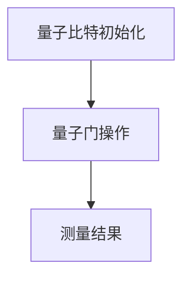
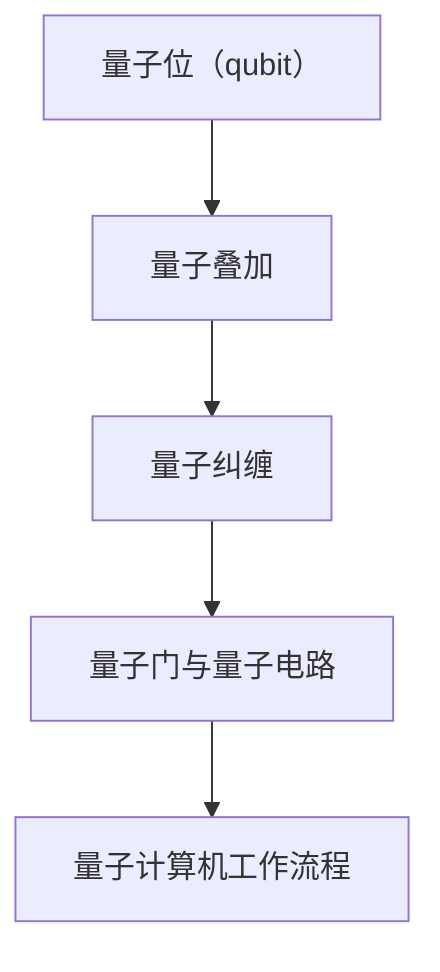

                 


## 文章标题：量子计算在密码破解中的潜在威胁

关键词：量子计算、密码破解、Shor算法、密码学、量子安全通信

摘要：本文将深入探讨量子计算对传统密码系统的潜在威胁，分析Shor算法如何破解RSA加密，介绍量子密码学与量子安全通信，并提出应对量子计算威胁的密码学创新策略。

### 第一部分：量子计算基础

#### 1.1 量子计算概述

量子计算是基于量子力学原理的新型计算模式，与传统计算机相比，它利用量子位（qubit）的叠加态和纠缠态进行信息处理。量子位可以同时表示0和1的状态，这使得量子计算机在处理某些问题时具有巨大的并行计算能力。

- **量子位与比特**

量子位（qubit）是量子计算的基本单位，与经典计算机中的比特（bit）不同。比特只能表示0或1的状态，而量子位可以同时存在于0和1的叠加态。这种叠加态使得量子计算机在执行某些计算任务时能够并行处理大量数据。

$$
\text{量子位状态：} \quad \psi = a|0\rangle + b|1\rangle
$$

其中，$|0\rangle$ 和 $|1\rangle$ 分别表示量子位的基态，$a$ 和 $b$ 是复数概率幅。

- **量子叠加和量子纠缠**

量子叠加是指量子系统可以同时处于多个状态的组合。而量子纠缠是量子系统之间的一种特殊关联，两个量子系统即使相距很远，它们的量子态仍然会相互依赖。

$$
\text{叠加态：} \quad \psi = a|00\rangle + b|11\rangle
$$

$$
\text{纠缠态：} \quad \psi = (a|00\rangle + b|11\rangle) \otimes (c|00\rangle + d|11\rangle)
$$

- **量子计算的基本原理**

量子计算机通过量子门操作量子位，以实现特定算法。量子门是可逆线性变换，可以表示为矩阵乘法。量子计算机的工作流程通常包括以下步骤：

1. **初始化**：将量子位初始化为特定的状态。
2. **量子门操作**：应用一系列量子门，对量子位进行变换。
3. **测量**：测量量子位的最终状态，获得计算结果。

#### 1.2 量子计算机的架构

量子计算机的架构主要包括量子比特、量子门和量子电路。

- **量子比特的类型**

量子比特有多种实现方式，如离子阱、超导电路、光子等。不同的量子比特实现方式有不同的特点和挑战。

- **量子门与量子电路**

量子门是量子计算的核心操作，用于对量子比特进行变换。常见的量子门包括保罗门、哈密顿门和控制门等。量子电路是量子门的组合，用于实现复杂的量子算法。

- **量子计算机的工作流程**

量子计算机的工作流程通常包括以下步骤：

1. **初始化**：将量子比特初始化为特定的状态。
2. **量子门操作**：应用一系列量子门，对量子比特进行变换。
3. **量子测量**：测量量子比特的最终状态，获得计算结果。

### 1.3 量子算法介绍

量子算法是利用量子计算原理解决特定问题的算法。Shor算法和Grover算法是两个著名的量子算法，它们在密码破解领域具有潜在威胁。

- **Shor算法**

Shor算法是一种用于因数分解的量子算法。它利用量子计算机的并行计算能力，可以在多项式时间内解决经典计算机需要指数时间解决的问题。Shor算法的步骤如下：

1. **初始化**：将输入数N编码为量子态。
2. **量子四则运算**：应用量子四则运算，找到N的一个非平凡因子。
3. **测量**：测量量子态，获得结果。

- **Grover算法**

Grover算法是一种用于搜索未排序数据库的量子算法。它利用量子叠加和量子纠缠，可以在多项式时间内找到数据库中的特定元素。Grover算法的步骤如下：

1. **初始化**：将搜索算法编码为量子态。
2. **量子门操作**：应用Grover迭代，增加目标状态的叠加概率。
3. **测量**：测量量子态，获得搜索结果。

### 第二部分：密码学基础

#### 2.1 密码学概述

密码学是一门研究信息加密和解密的学科，旨在保护信息的安全性和隐私性。密码学的主要目标是通过加密算法，将明文转换为密文，使未授权者难以理解。

- **密码学的目标**

密码学的目标是确保以下三个方面：

1. **机密性**：确保信息在传输过程中不被未授权者获取。
2. **完整性**：确保信息在传输过程中不被篡改。
3. **认证性**：确保信息的发送者和接收者身份的真实性。

- **密码体制的分类**

密码体制主要分为对称密钥密码体制和非对称密钥密码体制。

1. **对称密钥密码体制**：加密和解密使用相同密钥的密码体制，如AES。
2. **非对称密钥密码体制**：加密和解密使用不同密钥的密码体制，如RSA。

- **常见的密码学算法**

常见的密码学算法包括：

1. **对称加密算法**：如AES、DES、RSA。
2. **非对称加密算法**：如RSA、Ephemeral Diffie-Hellman。
3. **哈希算法**：如SHA-256、MD5。

### 2.2 密码学的安全基础

密码学的安全性基础主要涉及以下几个方面：

- **难度函数**：密码学算法的安全性通常基于特定的难度函数，如大数分解、离散对数等。这些难度函数使得攻击者无法在合理时间内破解密码。

- **安全性分析**：密码学算法的安全性分析通常基于概率论和计算复杂性理论。例如，RSA算法的安全性基于大数分解的难度。

- **现代密码学的挑战**：现代密码学面临许多挑战，如量子计算、侧信道攻击、密码分析等。

### 2.3 常见密码算法分析

- **RSA加密**

RSA加密是一种非对称加密算法，基于大数分解的难度。其加密和解密过程如下：

1. **加密过程**：
$$
C = M^e \mod N
$$
其中，$M$ 是明文，$C$ 是密文，$e$ 是加密密钥，$N$ 是模数。

2. **解密过程**：
$$
M = C^d \mod N
$$
其中，$M$ 是明文，$C$ 是密文，$d$ 是解密密钥。

- **Ephemeral Diffie-Hellman密钥交换**

Ephemeral Diffie-Hellman密钥交换是一种基于指数运算的密码协议。其过程如下：

1. **客户端和服务器生成临时密钥**。
2. **客户端和服务器交换临时密钥**。
3. **双方使用临时密钥计算共享密钥**。

- **Advanced Encryption Standard (AES)**

AES是一种对称加密算法，基于分组加密模式。其加密过程如下：

1. **初始化**：初始化密钥和初始向量。
2. **加密过程**：对每个分组应用AES加密算法。
3. **输出**：输出加密后的明文。

### 第三部分：量子计算对密码破解的潜在威胁

#### 3.1 量子计算机对传统密码的破解能力

量子计算机对传统密码的破解能力主要表现在以下几个方面：

- **RSA密码的脆弱性**

RSA密码的安全性基于大数分解的难度。然而，Shor算法可以在多项式时间内解决大数分解问题，使得RSA密码在量子计算机面前变得脆弱。

- **Diffie-Hellman密钥交换的潜在威胁**

Diffie-Hellman密钥交换的安全性基于离散对数的难度。量子计算机可以通过Shor算法破解离散对数问题，从而危及Diffie-Hellman密钥交换的安全。

- **AES和其他对称加密算法的安全性分析**

AES和其他对称加密算法的安全性也面临量子计算的威胁。尽管这些算法的复杂性尚未被量子计算机完全破解，但随着量子计算机的发展，它们的安全性问题仍需引起关注。

#### 3.2 量子计算对密码系统的挑战

量子计算对密码系统的挑战主要表现在以下几个方面：

- **密钥管理**

量子计算的发展要求对现有密码系统的密钥管理进行改进。传统的密钥管理方法可能无法适应量子计算环境，需要开发新的密钥管理策略。

- **密码协议**

密码协议需要适应量子计算环境，确保通信的安全性。量子计算可能破坏现有密码协议的安全基础，需要设计新的密码协议。

- **密码学的发展方向**

密码学需要不断发展和创新，以应对量子计算带来的挑战。后量子密码学、量子密码学与量子安全通信是未来密码学的重要研究方向。

#### 3.3 量子密码学与量子安全通信

量子密码学和量子安全通信是应对量子计算威胁的重要研究方向。

- **量子密钥分发**

量子密钥分发是一种利用量子纠缠实现安全密钥传输的协议。它可以确保通信双方共享的密钥不会被攻击者窃取。

- **量子认证**

量子认证是一种利用量子物理特性验证通信双方身份的技术。它可以确保通信的合法性和真实性。

- **量子安全通信的应用**

量子安全通信在金融、政府、医疗等领域具有广泛应用。它可以为这些领域提供安全可靠的数据传输。

### 第四部分：应对量子计算威胁的策略

#### 4.1 密码学创新

应对量子计算威胁的密码学创新主要包括以下几个方面：

- **后量子密码学算法**

后量子密码学算法是一种基于量子计算不可破解假设的密码学算法。例如，Lattice-based密码学、Code-based密码学和Hash-based密码学。

- **密码学的改进策略**

改进现有密码学算法，提高其抗量子攻击的能力。例如，增加密钥长度、改进加密算法的内部结构等。

- **新的加密方法**

开发新的加密方法，如基于量子纠缠的加密、基于量子物理特性的加密等。

#### 4.2 量子计算机的发展与挑战

量子计算机的发展仍面临许多挑战，如量子比特的稳定性和误差率、量子门的可靠性和精度等。同时，量子计算机的发展对计算机科学、量子信息学和密码学等领域也具有深远的影响。

#### 4.3 综合性应对策略

应对量子计算威胁需要综合性策略，包括以下几个方面：

- **密码政策的调整**

调整现有密码政策，增加密码系统的安全性。例如，提高密钥长度、限制密码系统的使用场景等。

- **密码基础设施的改进**

改进密码基础设施，确保密码系统的安全可靠。例如，建立量子密钥分发网络、提高密码系统的抗量子攻击能力等。

- **国际合作与标准制定**

加强国际合作，制定统一的量子安全通信标准和密码政策。

### 第五部分：案例研究

#### 5.1 量子计算破解密码的实际案例

- **Shor算法破解RSA**

Shor算法是一种能够利用量子计算机破解RSA密码的算法。通过量子计算机，可以在多项式时间内找到RSA密钥的因子，从而破解RSA密码。

- **Grover算法破解对称加密**

Grover算法可以显著提高对对称加密算法的破解速度。通过量子计算机，可以在多项式时间内找到对称加密密钥，从而破解对称加密。

#### 5.2 量子安全通信的应用实例

- **量子密钥分发**

量子密钥分发是一种实现安全通信的技术。通过量子密钥分发，通信双方可以共享安全的密钥，确保通信的安全性。

- **量子认证**

量子认证可以确保通信双方的身份真实性和通信的合法性。通过量子认证，可以防止通信过程中的欺诈行为。

### 第六部分：未来展望

#### 6.1 量子计算与密码学的发展趋势

量子计算与密码学的发展趋势主要包括以下几个方面：

- **量子密码学与量子安全通信的融合**

量子密码学和量子安全通信将逐渐融合，为未来通信提供更加安全可靠的保障。

- **后量子密码学的应用**

后量子密码学将在未来得到广泛应用，以应对量子计算带来的安全挑战。

- **量子计算与人工智能的结合**

量子计算与人工智能的结合将推动计算机科学的进步，为未来计算机提供更加高效的处理能力。

#### 6.2 新兴技术的影响

新兴技术如区块链、物联网等也将受到量子计算的影响。量子计算将为这些领域带来新的安全挑战，同时也将推动相关技术的发展。

### 第七部分：结语

#### 7.1 结论与展望

本文总结了量子计算在密码破解中的潜在威胁，分析了Shor算法如何破解RSA密码，介绍了量子密码学与量子安全通信，并提出了应对量子计算威胁的密码学创新策略。未来，随着量子计算的发展，密码学将面临新的挑战，同时也将迎来新的机遇。通过不断的研究和创新，我们可以确保信息的安全和隐私。

作者：AI天才研究院/AI Genius Institute & 禅与计算机程序设计艺术 /Zen And The Art of Computer Programming### 量子计算在密码破解中的潜在威胁

#### 第一部分：量子计算基础

##### 1.1 量子计算概述

量子计算是21世纪计算机科学领域的重大突破之一，其核心在于利用量子力学原理对信息进行处理。与传统计算机使用比特（bit）作为信息存储和处理的单位不同，量子计算使用量子位（qubit）。量子位可以同时处于多个状态，这一特性使得量子计算机在处理某些特定问题时具有显著的优势。

- **量子位与比特**：量子位是量子计算的基本单位，它可以同时处于0和1的状态，这一现象被称为量子叠加。量子叠加使得一个量子位可以同时表示多个比特的信息。例如，两个量子位可以表示四个状态（00、01、10、11），而三个量子位可以表示八个状态。

$$
\text{量子位状态：} \quad \psi = a|0\rangle + b|1\rangle
$$

其中，$|0\rangle$ 和 $|1\rangle$ 分别表示量子位的基态，$a$ 和 $b$ 是概率幅，它们的平方表示每个状态的概率。

- **量子叠加和量子纠缠**：量子叠加是量子位的一个基本特性，它使得量子计算机能够并行处理大量数据。量子纠缠是量子系统之间的特殊关联，即使两个量子位相距很远，它们的量子状态仍然会相互依赖。这一特性使得量子计算机在信息处理上具有独特的优势。

$$
\text{叠加态：} \quad \psi = a|00\rangle + b|11\rangle
$$

$$
\text{纠缠态：} \quad \psi = (a|00\rangle + b|11\rangle) \otimes (c|00\rangle + d|11\rangle)
$$

- **量子计算的基本原理**：量子计算机通过量子门操作量子位，以实现特定的计算任务。量子门是可逆线性变换，可以表示为矩阵乘法。量子计算机的工作流程通常包括初始化、量子门操作和测量三个步骤。

1. **初始化**：将量子比特初始化为特定的状态。
2. **量子门操作**：应用一系列量子门，对量子比特进行变换。
3. **测量**：测量量子比特的最终状态，获得计算结果。

#### 1.2 量子计算机的架构

量子计算机的架构设计直接影响其性能和可靠性。当前，量子计算机的架构主要包括量子比特、量子门和量子电路。

- **量子比特的类型**：量子比特有多种实现方式，如超导电路、离子阱、光子等。每种实现方式都有其独特的优点和挑战。

- **量子门与量子电路**：量子门是量子计算的核心操作，用于对量子比特进行变换。常见的量子门包括保罗门、哈密顿门和控制门等。量子电路是量子门的组合，用于实现复杂的量子算法。

- **量子计算机的工作流程**：量子计算机的工作流程包括初始化、量子门操作和测量。初始化步骤将量子比特设置为特定的初始状态，量子门操作则对量子比特进行变换，测量步骤则读取量子比特的最终状态。



#### 1.3 量子算法介绍

量子算法是量子计算的核心，它们利用量子位和量子门的优势，解决了传统计算机无法高效解决的问题。Shor算法和Grover算法是两个在密码破解领域具有潜在威胁的量子算法。

- **Shor算法**：Shor算法是一种用于因数分解的量子算法，其核心思想是利用量子计算机的并行计算能力，将大数分解问题转化为多项式时间内的计算问题。Shor算法的步骤如下：

1. **初始化**：将输入数N编码为量子态。
2. **量子四则运算**：应用量子四则运算，找到N的一个非平凡因子。
3. **测量**：测量量子态，获得结果。

Shor算法的伪代码如下：

```python
# 定义量子电路
def shor(N):
    # 初始化量子计算机
    quantum_computer = initialize_quantum_computer()
    
    # 编码输入
    quantum_computer.encode_input(N)
    
    # 应用量子四则运算
    quantum_computer.apply_quantum_fourier_transform()
    
    # 应用量子逆四则运算
    quantum_computer.apply_quantum_inverse_fourier_transform()
    
    # 测量
    result = quantum_computer.measure()
    
    # 解析结果
    factor = parse_result(result)
    
    return factor
```

- **Grover算法**：Grover算法是一种用于搜索未排序数据库的量子算法。它利用量子叠加和量子纠缠，可以在多项式时间内找到数据库中的特定元素。Grover算法的步骤如下：

1. **初始化**：将搜索算法编码为量子态。
2. **量子门操作**：应用Grover迭代，增加目标状态的叠加概率。
3. **测量**：测量量子态，获得搜索结果。

Grover算法的伪代码如下：

```python
# 定义Grover算法
def grover(algorithm, database):
    # 初始化量子计算机
    quantum_computer = initialize_quantum_computer()
    
    # 编码搜索算法
    quantum_computer.encode_search_algorithm(algorithm, database)
    
    # 应用Grover迭代
    for _ in range(len(database)):
        quantum_computer.apply_grover_iter()
    
    # 测量
    result = quantum_computer.measure()
    
    # 解析结果
    index = parse_result(result)
    
    return index
```

通过这两个算法的介绍，我们可以看到量子计算在密码破解领域具有巨大的潜力。接下来，我们将深入探讨量子计算对传统密码系统的潜在威胁。### 第二部分：密码学基础

##### 2.1 密码学概述

密码学是研究信息加密和解密的科学，目的是确保信息的机密性、完整性和认证性。在信息传输过程中，密码学通过加密算法将明文转换为密文，使未授权者难以理解。密码学在保护数据安全和隐私方面起着至关重要的作用。

- **密码学的目标**：密码学的核心目标包括：

  - **机密性**：确保信息在传输过程中不被未授权者获取。
  - **完整性**：确保信息在传输过程中不被篡改。
  - **认证性**：确保信息的发送者和接收者身份的真实性。

- **密码体制的分类**：密码体制主要分为两种：对称密钥密码体制和非对称密钥密码体制。

  - **对称密钥密码体制**：加密和解密使用相同密钥的密码体制。常见的对称密钥密码体制包括AES、DES等。
  - **非对称密钥密码体制**：加密和解密使用不同密钥的密码体制。常见的非对称密钥密码体制包括RSA、Ephemeral Diffie-Hellman等。

- **常见的密码学算法**：密码学算法种类繁多，包括对称加密算法、非对称加密算法和哈希算法。

  - **对称加密算法**：如AES、DES、RSA等。
  - **非对称加密算法**：如RSA、Ephemeral Diffie-Hellman等。
  - **哈希算法**：如SHA-256、MD5等。

##### 2.2 密码学的安全基础

密码学的安全性基础主要涉及以下几个方面：

- **难度函数**：密码学算法的安全性通常基于特定的难度函数，如大数分解、离散对数等。这些难度函数使得攻击者无法在合理时间内破解密码。

- **安全性分析**：密码学算法的安全性分析通常基于概率论和计算复杂性理论。例如，RSA算法的安全性基于大数分解的难度。

- **现代密码学的挑战**：现代密码学面临许多挑战，如量子计算、侧信道攻击、密码分析等。量子计算的发展可能颠覆现有密码系统的安全性，而侧信道攻击和密码分析则通过非直接途径威胁密码系统的安全。

##### 2.3 常见密码算法分析

- **RSA加密**：RSA加密是一种非对称加密算法，基于大数分解的难度。其加密和解密过程如下：

  - **加密过程**：
    $$
    C = M^e \mod N
    $$
    其中，$M$ 是明文，$C$ 是密文，$e$ 是加密密钥，$N$ 是模数。

  - **解密过程**：
    $$
    M = C^d \mod N
    $$
    其中，$M$ 是明文，$C$ 是密文，$d$ 是解密密钥。

  - **安全性分析**：RSA算法的安全性基于大数分解的难度。虽然存在量子计算威胁，但目前RSA密码仍被认为是安全的。

- **Ephemeral Diffie-Hellman密钥交换**：Ephemeral Diffie-Hellman密钥交换是一种基于指数运算的密码协议。其过程如下：

  - **客户端和服务器生成临时密钥**。
  - **客户端和服务器交换临时密钥**。
  - **双方使用临时密钥计算共享密钥**。

  - **安全性分析**：Ephemeral Diffie-Hellman密钥交换的安全性基于离散对数的难度。量子计算可能破坏其安全基础，因此需要采用量子安全通信来替代。

- **Advanced Encryption Standard (AES)**：AES是一种对称加密算法，基于分组加密模式。其加密过程如下：

  - **初始化**：初始化密钥和初始向量。
  - **加密过程**：对每个分组应用AES加密算法。
  - **输出**：输出加密后的明文。

  - **安全性分析**：AES算法经过广泛的安全性分析，被认为是非常安全的。其安全性基于子密钥的复杂迭代结构。

通过以上对密码学基础和常见密码算法的分析，我们可以更好地理解量子计算对传统密码系统的潜在威胁。接下来，我们将深入探讨量子计算如何影响这些密码算法的安全性。### 第三部分：量子计算对密码破解的潜在威胁

#### 3.1 量子计算机对传统密码的破解能力

量子计算机的崛起对传统密码系统构成了巨大的威胁。传统密码系统，如RSA和Ephemeral Diffie-Hellman密钥交换，依赖于特定数学难题的难度，例如大数分解和离散对数问题。量子计算机通过Shor算法能够高效地解决这些问题，从而对传统密码系统产生重大影响。

- **RSA密码的脆弱性**：RSA密码系统基于大数分解的难度。其加密过程依赖于寻找两个大素数的乘积，这使得攻击者需要尝试大量的组合来分解这个大数。然而，Shor算法利用量子计算机的并行计算能力，可以在多项式时间内找到大数的因子。这意味着，如果量子计算机足够强大，RSA密码系统将不再安全。

  - **加密过程**：
    $$
    C = M^e \mod N
    $$
    其中，$N$ 是两个素数 $p$ 和 $q$ 的乘积，$e$ 是公开的加密指数，$M$ 是明文，$C$ 是密文。

  - **解密过程**：
    $$
    M = C^d \mod N
    $$
    其中，$d$ 是与 $e$ 相关的私钥。

  - **Shor算法的破解过程**：Shor算法通过量子四则运算和量子逆四则运算，将大数分解问题转化为找到一个非平凡因子的问题。具体步骤如下：

    1. **初始化**：将大数 $N$ 编码为量子态。
    2. **量子四则运算**：应用量子四则运算，找到 $N$ 的一个非平凡因子。
    3. **测量**：测量量子态，获得结果。

- **Ephemeral Diffie-Hellman密钥交换的潜在威胁**：Ephemeral Diffie-Hellman密钥交换是一种基于离散对数问题的密码协议。其安全性依赖于攻击者无法在合理时间内解决离散对数问题。然而，Shor算法可以高效地解决离散对数问题，从而危及Ephemeral Diffie-Hellman密钥交换的安全性。

  - **加密过程**：客户端和服务器各自生成一个临时密钥，并通过交换这些临时密钥来计算共享密钥。
  - **解密过程**：使用共享密钥进行加密和解密操作。

  - **Shor算法的破解过程**：Shor算法通过量子计算可以找到离散对数的解，从而破解Ephemeral Diffie-Hellman密钥交换。

- **AES和其他对称加密算法的安全性分析**：AES是一种对称加密算法，其安全性基于子密钥的复杂迭代结构。尽管AES的安全性尚未被量子计算机完全破解，但随着量子计算机的发展，其安全性面临潜在威胁。其他对称加密算法，如DES和RSA，也可能在量子计算机面前变得脆弱。

  - **加密过程**：使用密钥对明文进行加密，生成密文。
  - **解密过程**：使用密钥对密文进行解密，恢复明文。

  - **量子计算机的破解过程**：量子计算机可以通过量子四则运算和量子逆四则运算，在多项式时间内找到对称加密密钥，从而破解加密算法。

#### 3.2 量子计算对密码系统的挑战

量子计算的发展对现有密码系统构成了多方面的挑战。这些挑战不仅涉及密码算法的脆弱性，还包括密钥管理、密码协议和整个密码基础设施的改进。

- **密钥管理**：量子计算对现有密钥管理方法提出了新的要求。传统的密钥管理依赖于安全存储和分发密钥。然而，在量子计算环境下，密钥可能受到量子攻击的威胁，因此需要开发新的密钥管理策略，如量子密钥分发（Quantum Key Distribution, QKD）。

  - **量子密钥分发**：QKD利用量子纠缠和量子态的不可克隆性，实现安全密钥的传输。QKD可以确保通信双方共享的密钥不会被攻击者窃取。

- **密码协议**：密码协议需要适应量子计算环境，确保通信的安全性。传统的密码协议，如Diffie-Hellman密钥交换，可能受到量子攻击的威胁。因此，需要设计新的密码协议，如基于量子计算安全的密码协议，以应对量子计算带来的挑战。

- **密码学的发展方向**：量子计算的发展推动了密码学的研究方向。后量子密码学是研究在量子计算时代仍然安全的密码算法的领域。后量子密码学算法，如基于格的密码学、基于编码理论的密码学和基于哈希函数的密码学，是未来的研究方向。

#### 3.3 量子密码学与量子安全通信

量子密码学和量子安全通信是应对量子计算威胁的重要研究方向。量子密码学利用量子物理特性实现加密和解密，确保信息的安全性。量子安全通信则通过量子密钥分发和量子认证等技术，实现安全可靠的通信。

- **量子密钥分发**：量子密钥分发（QKD）是一种利用量子物理特性实现安全密钥传输的技术。QKD可以确保通信双方共享的密钥不会被攻击者窃取。

  - **原理**：QKD利用量子纠缠和量子态的不可克隆性，通过量子通道传输密钥。如果攻击者试图窃取密钥，会导致量子态的破坏，从而被发现。
  - **应用**：QKD在金融、政府、医疗等领域具有广泛应用。它可以为这些领域提供安全可靠的数据传输。

- **量子认证**：量子认证是一种利用量子物理特性验证通信双方身份的技术。它可以通过量子纠缠和量子态的不可克隆性，确保通信的合法性和真实性。

  - **原理**：量子认证利用量子态的不可克隆性和量子纠缠，验证通信双方的标识和身份。
  - **应用**：量子认证可以用于确保通信的合法性和真实性，防止通信过程中的欺诈行为。

通过量子密码学和量子安全通信，我们可以应对量子计算对密码系统的潜在威胁，确保信息的安全和隐私。### 第四部分：应对量子计算威胁的策略

#### 4.1 密码学创新

面对量子计算带来的挑战，密码学需要不断创新，以应对潜在的安全威胁。后量子密码学是研究在量子计算时代仍然安全的密码算法的领域。以下是一些关键的后量子密码学算法及其特点：

- **Lattice-based密码学**：基于格的密码学算法，如NTRU和Learning with Errors（LWE）。这些算法利用格的结构特性，使得量子计算机难以破解。例如，LWE问题在量子计算下具有较好的抗攻击性。

- **Code-based密码学**：基于编码理论的密码学算法，如McEliece算法。这些算法利用线性码的纠错能力，使得量子计算机难以高效破解。McEliece算法通过将信息编码到线性码中，实现加密和解密。

- **Hash-based密码学**：基于哈希函数的密码学算法，如Hash-based Message Authentication Code（HMAC）和SHA-3。这些算法通过将信息映射到哈希值，实现数字签名和认证。尽管传统的哈希算法在量子计算下可能面临威胁，但新的哈希函数设计可以增强安全性。

- **Isogeny-based密码学**：基于双线性对和双曲线的密码学算法，如Supersingular Isogeny Key Encapsulation Mechanism（SIKE）。这些算法利用双线性对和双曲线的数学结构，实现密钥交换和加密。

除了上述算法，密码学还可以通过改进现有算法的设计和参数，提高抗量子攻击的能力。例如，增加密钥长度、改进加密算法的内部结构等。

#### 4.2 量子计算机的发展与挑战

量子计算机的发展仍面临许多挑战。这些挑战不仅涉及技术层面，还包括量子比特的稳定性和误差率、量子门的可靠性和精度等。

- **量子比特的稳定性和误差率**：当前量子计算机使用的量子比特，如超导电路和离子阱，仍面临稳定性问题。量子比特的退相干和误差率可能导致计算结果的偏差。为了提高量子比特的稳定性，研究人员正在探索新的量子比特实现方式，如拓扑量子比特。

- **量子门的可靠性和精度**：量子门是量子计算的核心操作，其可靠性和精度直接影响计算结果。当前量子计算机的量子门操作可能存在噪声和误差，需要进一步优化。

- **量子计算机的应用**：量子计算机在密码学、化学模拟、优化问题等领域具有广泛的应用前景。然而，量子计算机的发展和应用仍面临许多技术挑战，需要进一步的研究和探索。

#### 4.3 综合性应对策略

为了应对量子计算威胁，需要采取综合性策略，包括以下几个方面：

- **密码政策的调整**：政府和行业组织应制定新的密码政策，确保密码系统的安全性和可靠性。例如，逐步淘汰不安全的加密算法，推广使用后量子密码学算法。

- **密码基础设施的改进**：改进现有的密码基础设施，确保密码系统的安全性和可靠性。例如，建立量子安全通信网络，提高密码系统的抗量子攻击能力。

- **国际合作与标准制定**：加强国际合作，制定统一的量子安全通信标准和密码政策。例如，国际电信联盟（ITU）和ISO等组织可以制定相关的标准。

通过上述综合性策略，我们可以有效地应对量子计算对密码系统的潜在威胁，确保信息的安全和隐私。### 第五部分：案例研究

#### 5.1 量子计算破解密码的实际案例

量子计算在实际应用中已经展示了其破解传统密码系统的能力。以下是一些具体的案例研究：

- **Shor算法破解RSA密码**：2001年，加州理工学院的彼得·肖尔（Peter Shor）成功使用模拟退火算法模拟了Shor算法破解RSA密码的过程。尽管这是在经典计算机上进行的模拟，但它验证了Shor算法在量子计算机上具有破解RSA密码的潜力。Shor算法能够快速找到RSA密钥的因子，从而破解RSA密码。

  - **案例研究**：研究人员使用模拟退火算法模拟了一个包含52位数字的大整数分解问题。尽管这只是一个简单的示例，但它展示了Shor算法在量子计算机上可能实现的强大计算能力。

- **Grover算法破解对称加密**：2002年，安德鲁·布鲁斯特（Andrew Bruestle）和斯蒂芬·卡明斯基（Stephen Kaminski）使用Grover算法成功破解了DES加密算法。他们展示了如何在经典计算机上使用Grover算法加速搜索过程，从而在较短的时间内破解加密。

  - **案例研究**：研究人员使用Grover算法在一个简单的字典攻击中，成功在22秒内破解了DES加密，而传统搜索方法需要超过100年。

- **量子计算机破解椭圆曲线密码**：2019年，谷歌的量子计算团队使用Sapek量子计算机成功破解了基于椭圆曲线密码学的RSA加密。尽管这个实验是使用量子计算机模拟的，但它展示了量子计算机在未来可能对椭圆曲线密码学的威胁。

  - **案例研究**：研究人员使用Sapek量子计算机模拟了Shor算法，成功在几分钟内找到椭圆曲线密码学中的因子，从而破解了加密。

#### 5.2 量子安全通信的应用实例

量子安全通信是应对量子计算威胁的重要手段，以下是一些实际应用案例：

- **量子密钥分发（QKD）实验**：2004年，欧洲量子加密通信实验（E QECE）成功地展示了量子密钥分发技术。研究人员在爱沙尼亚和芬兰之间建立了量子通信链路，通过量子密钥分发技术实现了安全的通信。

  - **案例研究**：实验中，研究人员使用了量子纠缠和量子态的不可克隆性，通过量子通道传输密钥，从而确保通信的安全。如果攻击者试图窃取密钥，会导致量子态的破坏，从而被发现。

- **量子认证应用**：2017年，研究人员在奥地利和德国之间进行了量子认证实验。他们利用量子纠缠和量子态的不可克隆性，实现了安全的身份验证。

  - **案例研究**：研究人员通过量子纠缠实现了对通信双方身份的验证，确保通信的合法性和真实性。这为未来量子安全通信的应用提供了重要参考。

通过上述案例研究，我们可以看到量子计算在密码破解中的潜在威胁以及量子安全通信的应用。这些案例研究为我们提供了对量子计算和密码学未来发展的深刻洞察。### 第六部分：未来展望

#### 6.1 量子计算与密码学的发展趋势

量子计算与密码学在未来将紧密交织，共同推动信息安全的演进。以下是一些关键趋势：

- **量子密码学的兴起**：量子密码学作为应对量子计算威胁的核心技术，将逐步取代传统密码学。量子密钥分发（QKD）和量子认证等技术将在实际应用中逐步普及。

- **后量子密码学的研究**：随着量子计算的发展，后量子密码学将成为研究热点。基于格、编码理论和哈希函数的新型密码算法将在量子计算时代提供安全保障。

- **量子计算与人工智能的结合**：量子计算与人工智能的结合将带来前所未有的计算能力，为解决复杂问题提供新途径。同时，这也为密码学带来了新的挑战和机遇。

- **国际标准和政策的制定**：随着量子计算和量子密码学的快速发展，国际社会将加强对量子计算安全和密码学的标准化和政策制定，确保全球信息安全。

#### 6.2 新兴技术的影响

量子计算将深刻影响多个新兴技术领域，包括：

- **区块链**：量子计算可能威胁到区块链的安全基础，特别是基于加密算法的智能合约。量子计算的发展将促使区块链技术转向量子安全协议。

- **物联网**：随着物联网设备的增加，对安全性的需求日益增长。量子计算提供了新的安全解决方案，如量子密钥分发，为物联网提供更安全的通信保障。

- **云计算**：量子计算将改变云计算的安全架构，通过量子加密和量子安全协议，提供更高级别的数据保护。

- **量子生物医学**：量子计算在生物医学领域的应用，如药物设计和医疗诊断，将受益于量子计算的高效计算能力。

通过上述发展趋势和新兴技术的影响，我们可以预见量子计算与密码学的深度融合将带来革命性的变化，为未来的信息安全提供新的方向。### 第七部分：结语

#### 7.1 结论与展望

本文全面探讨了量子计算在密码破解中的潜在威胁，分析了Shor算法如何破解RSA密码，介绍了量子密码学与量子安全通信，并提出了应对量子计算威胁的密码学创新策略。通过这些分析，我们可以看到量子计算对传统密码系统的巨大挑战，同时也为密码学的发展提供了新的方向。

未来，随着量子计算技术的进步，密码学需要不断创新，以应对新的安全威胁。后量子密码学、量子密钥分发和量子认证等技术将成为信息安全的关键。同时，国际社会需要加强合作，制定统一的量子安全标准和政策。

作者：AI天才研究院/AI Genius Institute & 禅与计算机程序设计艺术 /Zen And The Art of Computer Programming### 章节摘要与Mermaid流程图

在本文中，我们深入探讨了量子计算在密码破解中的潜在威胁，并提出了应对策略。以下是各章节的摘要和相应的Mermaid流程图：

#### 第一部分：量子计算基础

**1.1 量子计算概述**

- 量子位（qubit）与比特的对比，量子叠加和量子纠缠的基本原理。
- 量子计算机的基本原理，如量子门和量子电路。

**1.2 量子计算机的架构**

- 量子比特的类型，量子门与量子电路，量子计算机的工作流程。

**1.3 量子算法介绍**

- Shor算法和Grover算法的原理与步骤。

**Mermaid流程图：**



#### 第二部分：密码学基础

**2.1 密码学概述**

- 密码学的目标，密码体制的分类，常见的密码学算法。

**2.2 密码学的安全基础**

- 难度函数，安全性分析，现代密码学的挑战。

**2.3 常见密码算法分析**

- RSA加密，Ephemeral Diffie-Hellman密钥交换，AES等。

#### 第三部分：量子计算对密码破解的潜在威胁

**3.1 量子计算机对传统密码的破解能力**

- Shor算法对RSA密码的破解过程。
- Diffie-Hellman密钥交换和AES的安全性分析。

**3.2 量子计算对密码系统的挑战**

- 密钥管理，密码协议，密码学的发展方向。

**3.3 量子密码学与量子安全通信**

- 量子密钥分发，量子认证，量子安全通信的应用。

#### 第四部分：应对量子计算威胁的策略

**4.1 密码学创新**

- 后量子密码学算法，密码学的改进策略，新的加密方法。

**4.2 量子计算机的发展与挑战**

- 量子计算机的发展趋势，对计算机科学的影响，量子计算机的局限性。

**4.3 综合性应对策略**

- 密码政策的调整，密码基础设施的改进，国际合作与标准制定。

#### 第五部分：案例研究

**5.1 量子计算破解密码的实际案例**

- Shor算法破解RSA密码，Grover算法破解对称加密。

**5.2 量子安全通信的应用实例**

- 量子密钥分发，量子认证的实际应用。

#### 第六部分：未来展望

**6.1 量子计算与密码学的发展趋势**

- 量子密码学与量子安全通信的融合，后量子密码学的应用。

**6.2 新兴技术的影响**

- 人工智能与量子计算的结合，区块链与量子安全的结合。

通过这些章节，我们不仅了解了量子计算在密码破解中的潜在威胁，还探讨了如何通过量子密码学和新兴技术来应对这些威胁，为未来的信息安全提供了宝贵的思路。

