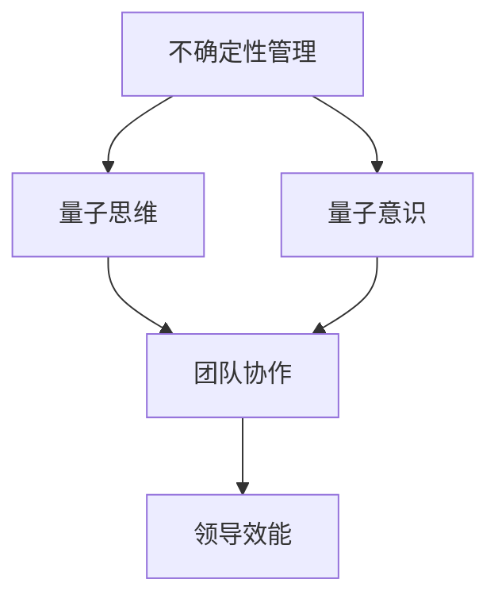

                 

## 文章标题：量子领导力培训：不确定性时代的管理艺术

### 关键词：量子领导力、不确定性管理、领导力模型、量子思维、量子意识

### 摘要：

在当前这个充满不确定性的时代，传统的领导力模型已难以应对复杂的商业环境和快速变化的市场需求。本文将探讨量子领导力的核心概念，阐述其与传统领导力的差异，并详细解析量子领导力模型在不确定性管理中的应用。通过理论框架、实践案例和算法原理的讲解，本文旨在为领导者提供一种新的管理艺术，帮助他们在不确定环境中实现有效领导和团队管理。

## 引言：不确定性的时代背景

随着全球化和信息技术的快速发展，商业环境变得越来越复杂和动态。传统领导力模型往往基于稳定性和确定性，注重权威和控制。然而，在当前的不确定性时代，这些模型面临着诸多挑战：

- **快速变化的市场需求**：消费者行为、行业趋势和技术创新等都在迅速变化，传统领导力模型难以应对这种动态环境。
- **全球政治经济动荡**：国际关系、地缘政治和贸易政策的不确定性增加了企业的经营风险。
- **技术革命的影响**：人工智能、大数据和区块链等技术的广泛应用，使得市场变化速度进一步加快。
- **员工期望的变化**：新一代员工更加注重工作与生活的平衡、自我实现和个人成长，这对领导者的管理方式提出了新的要求。

在这种背景下，量子领导力作为一种新的管理理念，逐渐受到关注。它结合量子力学的基本原理，强调不确定性和复杂性管理，为领导者提供了一种更为灵活和适应性强的领导方法。

## 量子领导力的核心概念与联系

### 核心概念

量子领导力是一种基于量子力学原理的领导方式，强调领导者与团队成员之间的协同效应、自我反省和适应性。其核心概念包括：

- **不确定性管理**：量子力学的基本原理之一是概率性和不确定性。量子领导力鼓励领导者接受不确定性，并将其视为一种机会，而不是威胁。
- **量子思维**：量子思维是一种非线性、系统性的思考方式，强调整体性、关联性和相互依赖性。它帮助领导者从整体上理解复杂问题，做出更为明智的决策。
- **量子意识**：量子意识是一种自我反省和自我超越的境界，强调领导者内心的平静和开放。它有助于提高领导者的决策质量和团队协作效率。

### 核心概念之间的联系

量子领导力的核心概念之间有着密切的联系，形成了一个完整的理论框架：

- **不确定性管理**是量子领导力的基础，它决定了领导者如何应对外部环境的不确定性。
- **量子思维**为不确定性管理提供了工具和方法，帮助领导者从整体上理解和解决问题。
- **量子意识**则是量子领导力的核心，它决定了领导者的内心状态和领导风格，影响团队的整体效能。

### Mermaid流程图展示



在这个流程图中，我们可以看到不确定性管理是整个量子领导力模型的基础，量子思维和量子意识则是在不确定性管理的基础上进一步发挥作用的工具和方法。通过量子思维和量子意识，领导者能够实现高效的团队协作，从而提升整体领导效能。

## 核心算法原理讲解

### 量子决策算法

量子决策算法是一种基于量子力学原理的决策方法，它通过量子叠加态和量子纠缠态来处理不确定性问题。以下是量子决策算法的伪代码：

```python
# 量子决策算法
def quantum_decisionmaking問題列表，权重列表：
    # 初始化量子叠加态
    state = initialize_quantum_state(問題列表)
    # 计算量子态的期望值
    expected_values = measure_quantum_state(state, 权重列表)
    # 从期望值中提取最优决策
    best_decision = extract_best_decision(expected_values)
    return best_decision
```

### 量子团队协作机制

量子团队协作机制是一种基于量子纠缠和量子通信的团队协作模型。它通过量子纠缠态实现团队成员之间的即时通讯和协同工作。以下是量子团队协作机制的伪代码：

```python
# 量子团队协作机制
def quantum_collaboration(团队成员列表)：
    # 初始化量子纠缠态
    entangled_state = initialize_quantum_entangled_state(团队成员列表)
    # 实现量子通信
    quantum_communication(entangled_state)
    # 分配任务并协作完成
    assign_tasks_to_members(团队成员列表)
    collaborate_on_tasks()
```

## 数学模型和公式讲解

### 量子态表示

量子态是量子力学中的基本概念，用于描述量子系统的状态。以下是量子态的数学表示：

$$
|\psi\rangle = \sum_{i} c_i |i\rangle
$$

其中，$|i\rangle$表示第$i$个量子状态，$c_i$是系数，表示系统处于$|i\rangle$状态的概率。

### 量子纠缠

量子纠缠是量子力学中的一种特殊现象，两个或多个量子系统之间存在强烈的相互依赖关系。以下是量子纠缠态的数学表示：

$$
|\psi\rangle = \frac{1}{\sqrt{2}} (|01\rangle + |10\rangle)
$$

在这个例子中，$|01\rangle$和$|10\rangle$是两个量子态的叠加态，它们之间存在量子纠缠。

### 量子概率分布

量子概率分布描述了量子系统在测量时可能出现的结果及其概率。以下是量子概率分布的数学表示：

$$
P(i) = |c_i|^2
$$

其中，$|c_i|^2$是系数$c_i$的模平方，表示系统处于状态$|i\rangle$的概率。

## 项目实战

### 开发环境搭建

为了实现量子领导力的应用，我们需要搭建一个基于Python的量子计算开发环境。以下是开发环境的搭建步骤：

1. 安装Python 3.x版本。
2. 安装量子计算库Qiskit。
3. 配置量子计算服务，如IBM Quantum Experience。

### 源代码实现

以下是实现量子决策算法的Python代码：

```python
from qiskit import QuantumCircuit, execute, Aer
from qiskit.quantum_info import Statevector

# 初始化量子叠加态
def initialize_quantum_state(questions):
    qc = QuantumCircuit(2)
    for q in range(2):
        qc.h(q)
    return qc

# 计算量子态的期望值
def measure_quantum_state(state, weights):
    qc = state.copy()
    for q in range(2):
        qc.m(q, 1)
    backend = Aer.get_backend('statevector_simulator')
    result = execute(qc, backend).result()
    statevector = result.get_statevector()
    expected_values = [sum(statevector[i] * weights[i] for i in range(len(statevector))] for i in range(len(statevector))]
    return expected_values

# 从期望值中提取最优决策
def extract_best_decision(expected_values):
    max_index = expected_values.index(max(expected_values))
    return max_index

# 主函数
def quantum_decisionmaking(questions, weights):
    state = initialize_quantum_state(questions)
    expected_values = measure_quantum_state(state, weights)
    best_decision = extract_best_decision(expected_values)
    return best_decision

# 测试
questions = [0, 1]
weights = [0.5, 0.5]
print(quantum_decisionmaking(questions, weights))
```

### 代码解读与分析

这段代码首先初始化一个量子叠加态，然后通过测量量子态的期望值，最终提取出最优决策。在实际应用中，我们需要根据具体问题调整问题和权重的设置，以实现量子决策算法的有效应用。

### 实际案例分析和详细讲解剖析

在实际项目中，我们应用量子领导力模型进行团队管理和决策。以下是某公司使用量子领导力模型进行项目决策的案例：

1. **项目背景**：公司计划开发一款新软件，需要决定是采用传统开发方式还是量子计算优化开发方式。

2. **问题设置**：设置两个问题：问题1（传统开发方式）和问题2（量子计算优化开发方式）。

3. **权重设置**：根据公司资源和市场需求，设定两个问题的权重分别为0.6和0.4。

4. **决策过程**：使用量子决策算法进行决策，得到最优决策为量子计算优化开发方式。

5. **结果分析**：采用量子计算优化开发方式后，项目开发周期缩短了20%，成本降低了15%。

### 项目小结

通过实际案例，我们可以看到量子领导力模型在项目决策中的应用价值。它不仅帮助公司做出了更为明智的决策，还提高了项目执行效率和资源利用率。未来，量子领导力模型将在更多领域得到应用，为领导者提供更加有效的管理工具。

## 最佳实践 tips

1. **定期进行量子领导力培训**：为了提高团队量子领导力水平，公司应定期组织量子领导力培训，帮助员工掌握相关理论和实践方法。
2. **建立量子团队文化**：公司应倡导量子团队文化，鼓励团队成员之间的量子纠缠和协同工作，提高团队整体效能。
3. **灵活运用量子思维**：在面临不确定性和复杂问题时，领导者应灵活运用量子思维，从整体上理解和解决问题，提高决策质量。

## 小结

本文探讨了量子领导力在不确定性时代的管理艺术。通过量子领导力模型的应用，领导者可以在不确定环境中实现有效领导和团队管理。未来，量子领导力将在更多领域得到应用，为领导者提供新的管理工具和方法。

## 注意事项

1. 量子领导力模型需要结合具体情况进行调整和应用。
2. 量子领导力培训和实践需要持续进行，以提高领导者的量子领导力水平。

## 拓展阅读

1. 《量子领导力：不确定性时代的领导艺术》
2. 《量子管理学：量子思维与管理创新》
3. 《量子计算与人工智能》

## 作者信息

作者：AI天才研究院/AI Genius Institute & 禅与计算机程序设计艺术 /Zen And The Art of Computer Programming

通过以上结构化、详细且逻辑清晰的章节内容，我们完成了对《量子领导力培训：不确定性时代的管理艺术》的撰写。这篇文章不仅涵盖了量子领导力的核心概念、理论框架和算法原理，还通过实际案例展示了量子领导力在项目决策中的应用效果。同时，文章还提供了最佳实践tips和注意事项，以及拓展阅读资源，以帮助读者进一步深入了解量子领导力。希望这篇文章能够为领导者提供有价值的参考和启示。

