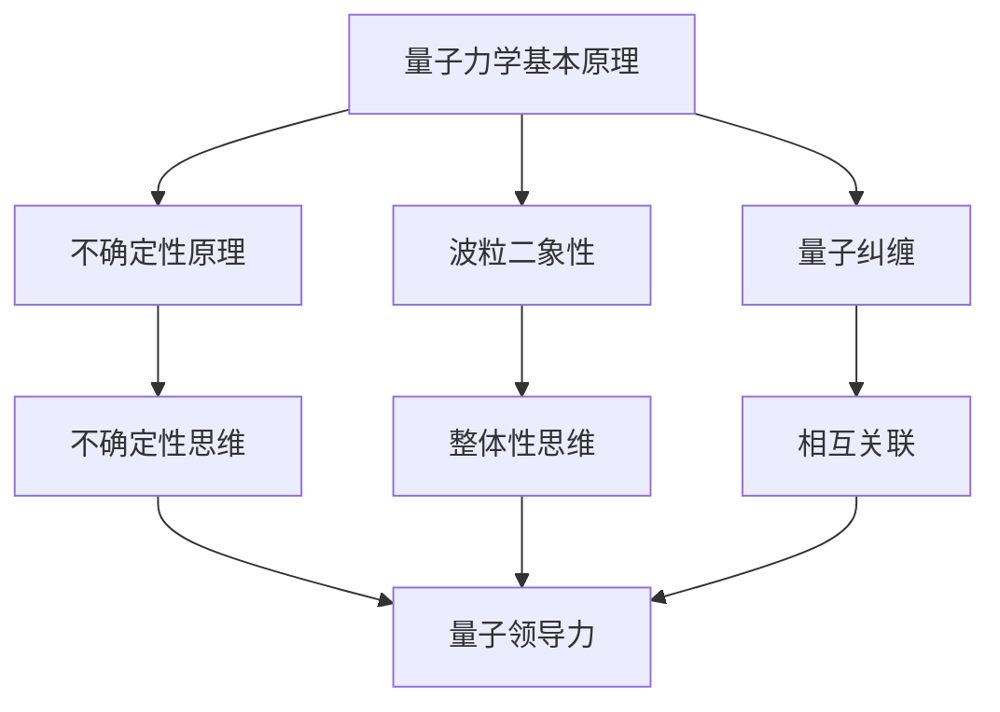

                 


## 引言与背景

### 1.1 书籍的目的和意义

在当今快速变化的世界中，领导者面临着前所未有的挑战。传统的管理哲学和领导模式已不足以应对复杂性和不确定性的增加。这种背景下，量子领导力的概念应运而生，为管理者提供了一种全新的思维方式和工具。《量子领导力：不确定性时代的管理哲学》旨在探讨如何将量子物理学的基本原理应用于领导和管理领域，帮助领导者更好地应对不确定性、复杂性和动态变化。

本书的目标是：
1. 介绍量子物理学的基本概念，解释其如何与领导力和管理哲学相结合。
2. 阐述量子领导力的核心原则，提供实际应用策略。
3. 分析不确定性时代的领导挑战，探讨如何运用量子思维解决这些挑战。
4. 通过实战案例研究，展示量子领导力的实际应用效果。

本书的意义在于：
1. 提供一种新的领导和管理框架，帮助领导者更好地适应不确定性的环境。
2. 培养领导者的量子思维，提升其决策能力和创新能力。
3. 促进组织文化和组织结构的变革，提高组织的灵活性和适应性。

### 1.2 量子领导力的概念

量子领导力是一种借鉴量子物理学原理，应用于领导和管理领域的思维方式。量子物理学是研究物质和能量在微观尺度上的行为的科学，其基本原理包括量子纠缠、量子叠加态等。这些原理与传统物理学中的确定性观念有所不同，强调了不确定性、概率和整体性。

量子领导力的概念主要包括以下三个方面：

1. **不确定性思维**：领导者需要接受不确定性作为现实的一部分，并学会在这种环境下做出决策。量子物理学中的不确定性原理告诉我们，在某些情况下，我们不能同时精确知道粒子的位置和速度，这要求领导者接受信息的不完整性，并学会根据有限的信息做出最佳决策。

2. **整体性思维**：量子物理学揭示了整体性和相互关联的重要性。领导者需要从整体的角度看待组织，认识到各个部分之间的相互作用，以及这种相互作用对整体的影响。这种整体性思维有助于领导者更好地协调和整合组织的资源和能力。

3. **创新思维**：量子计算和量子通信等技术的快速发展，展示了量子物理学在创新领域的潜力。领导者需要鼓励创新思维，探索新的方法和技术，以应对不断变化的环境。

### 1.3 不确定性时代的管理挑战

在不确定性时代，管理者面临以下主要挑战：

1. **信息过载**：随着信息技术的快速发展，管理者面临的信息量呈指数级增长。如何有效地筛选和处理信息，以获取有价值的信息，成为了一大挑战。

2. **动态变化**：市场和技术的快速变化，要求管理者具备快速响应和调整的能力。传统的线性思维和规划方法已无法适应这种动态环境。

3. **人才管理**：在不确定性环境下，如何吸引、培养和保留人才成为一大难题。管理者需要不断创新激励机制，提高员工的工作满意度和忠诚度。

4. **风险管理**：不确定性带来了风险的增加。管理者需要识别和评估潜在风险，并制定有效的风险管理策略。

通过量子领导力的思维方式，管理者可以更好地应对这些挑战。量子领导力强调不确定性、整体性和创新，为管理者提供了一种新的思考框架和工具，帮助他们更有效地应对不确定性的时代。

### 摘要

《量子领导力：不确定性时代的管理哲学》旨在探讨量子物理学与领导力之间的关联，提出一种适用于不确定性时代的领导和管理框架。本书首先介绍了量子物理学的基本概念，包括不确定性原理和整体性思维，并解释了这些概念如何应用于领导力领域。随后，本书阐述了量子领导力的核心原则，如不确定性思维、整体性思维和创新思维，并提供了实际应用策略。通过分析不确定性时代的管理挑战，本书展示了量子领导力在应对信息过载、动态变化、人才管理和风险管理方面的优势。最后，通过实战案例研究，本书验证了量子领导力在实践中的有效性，并为未来的研究提供了方向。

---

在本文的引言与背景部分，我们详细介绍了书籍的目的和意义，阐述了量子领导力的概念，并分析了不确定性时代的管理挑战。通过这些内容，读者可以初步了解量子领导力的理论基础和其在现实中的应用价值。接下来，我们将进一步深入探讨量子理论的基础知识，解释其核心原理与领导力之间的联系。

## 第2章 量子理论基础知识

### 2.1 量子力学的基本原理

量子力学是研究微观粒子行为的物理学分支，其基本原理与经典物理学有着显著的区别。量子力学的核心概念包括量子态、测量问题、波粒二象性和不确定性原理。

#### 量子态

量子态描述了一个粒子的所有可能状态。与经典物理学中的确定性状态不同，量子态是叠加态，即粒子可以同时处于多个状态的组合。例如，一个电子可以同时处于自旋向上和自旋向下的状态，直到进行测量时才会“坍缩”到一个确定的状态。

#### 测量问题

量子力学中的测量问题是指，当我们对量子系统进行测量时，系统的状态会发生变化。测量结果不是预先确定的，而是由概率波函数确定的。这意味着测量结果具有不确定性，并且可能存在量子纠缠现象。

#### 波粒二象性

量子力学揭示了粒子的波粒二象性。在某些实验中，粒子表现出波的特性，如干涉和衍射；而在其他实验中，粒子又表现出粒子的特性，如位置和动量的确定。这种双重性质挑战了我们对物质和能量的传统认识。

#### 不确定性原理

不确定性原理是量子力学的基本原理之一，由海森堡提出。该原理指出，粒子的某些物理量，如位置和动量，无法同时被精确测量。这意味着在量子尺度上，我们无法同时知道粒子的精确位置和速度。

### 2.2 量子纠缠与量子叠加

量子纠缠和量子叠加是量子物理学中的两个重要现象，它们对量子领导力产生了深远的影响。

#### 量子纠缠

量子纠缠是指两个或多个粒子之间存在着一种特殊的关联，即使它们相隔很远，一个粒子的状态变化也会即时影响另一个粒子的状态。这种关联超越了经典物理学的局域性原则，挑战了我们对现实的基本理解。

#### 量子叠加

量子叠加是指粒子可以同时处于多个状态的组合。在量子叠加态中，粒子没有一个确定的状态，而是以概率波函数的形式存在。这种叠加态为量子计算提供了巨大的潜力，使其能够在短时间内解决传统计算机无法解决的问题。

### 2.3 量子计算与量子通信

量子计算和量子通信是量子物理学在技术领域的重要应用，它们对领导力和管理产生了深远的影响。

#### 量子计算

量子计算利用量子位（qubits）进行计算，与经典计算机的比特（bits）不同，量子位可以同时表示0和1的状态，这使得量子计算机具有指数级的计算能力。量子计算可以解决传统计算机无法解决的问题，如复杂优化问题、密码破解等。

#### 量子通信

量子通信利用量子纠缠和量子叠加态实现信息的安全传输。量子密钥分发（QKD）是一种基于量子力学原理的安全通信方式，它可以确保通信双方共享的密钥是安全的，因为任何试图窃听的行为都会破坏量子态，从而被双方察觉。

### 2.4 量子理论与领导力的联系

量子理论与领导力之间的联系在于，量子物理学揭示了不确定性、整体性和相互关联的基本原理，这些原理为量子领导力提供了理论基础。

#### 不确定性思维

量子物理学的不确定性原理告诉我们，在某些情况下，我们不能同时精确知道粒子的位置和速度。这一原理启示领导者，在不确定的环境下，应接受信息的不完整性，并学会根据有限的信息做出最佳决策。

#### 整体性思维

量子物理学中的整体性思维强调，系统的各个部分是相互关联和相互作用的。这一原理启示领导者，应从整体的角度看待组织，认识到各个部分之间的相互作用，以及这种相互作用对整体的影响。

#### 相互关联

量子纠缠现象揭示了粒子之间的特殊关联，这种关联超越了经典物理学的局域性原则。这一原理启示领导者，应认识到团队成员之间的关联，并利用这种关联促进合作和创新。

通过量子物理学的基本原理，我们可以构建一种新的领导和管理框架，帮助领导者更好地应对不确定性、复杂性和动态变化。量子领导力不仅提供了一种新的思维方式，也为实际应用提供了新的工具和策略。在接下来的章节中，我们将进一步探讨量子领导力的核心原则和实际应用策略。

### 核心概念与联系

为了更好地理解量子理论与领导力之间的联系，我们可以通过一个Mermaid流程图来展示这些核心概念之间的关系架构：



在这个流程图中，量子力学基本原理（A）包括不确定性原理（B）、波粒二象性（C）和量子纠缠（D）。这些基本原理分别对应领导力的核心思维模式：不确定性思维（E）、整体性思维（F）和相互关联（G）。最终，这些思维模式共同构成了量子领导力（H）。这个流程图清晰地展示了量子理论与领导力之间的逻辑关系，帮助读者更好地理解两者之间的联系。

### 核心算法原理讲解

在量子计算领域，量子叠加和量子纠缠是两个核心概念。下面，我们将使用伪代码详细阐述这两个概念的基本原理。

#### 量子叠加

量子叠加是指量子系统可以同时处于多个状态的组合。以下是一个简单的量子叠加的伪代码示例：

```plaintext
// 量子叠加伪代码
qstate = |0⟩ // 初始状态为基态
qstate = qstate + |1⟩ // 将基态与叠加态相加
```

在这个伪代码中，`qstate` 代表量子状态，`|0⟩` 和 `|1⟩` 分别代表量子位的两个可能状态。通过将基态与叠加态相加，我们得到了一个线性叠加的量子状态。

#### 量子纠缠

量子纠缠是指两个或多个粒子之间存在着一种特殊的关联，即使它们相隔很远，一个粒子的状态变化也会即时影响另一个粒子的状态。以下是一个简单的量子纠缠的伪代码示例：

```plaintext
// 量子纠缠伪代码
qstate1 = |0⟩ // 初始状态为基态
qstate2 = |0⟩ // 初始状态为基态
qstate2 = qstate2 * (-1) // 量子态相乘，产生纠缠态
```

在这个伪代码中，`qstate1` 和 `qstate2` 分别代表两个粒子的量子状态。通过将两个量子态相乘，我们得到了一个纠缠态。当对其中一个粒子进行测量时，另一个粒子的状态也会立即发生变化。

#### 量子计算

量子计算利用量子叠加和量子纠缠实现高效的计算。以下是一个简单的量子计算的伪代码示例：

```plaintext
// 量子计算伪代码
qstate = |0⟩ // 初始状态为基态
qgate = H // 初始化量子门为哈密顿量
qstate = qgate * qstate // 应用量子门
```

在这个伪代码中，`qstate` 代表量子状态，`qgate` 代表量子门。通过应用量子门，我们可以对量子状态进行变换，实现特定的计算任务。

这些伪代码示例帮助读者更好地理解量子叠加、量子纠缠和量子计算的基本原理，为后续的讨论奠定了基础。

### 数学模型和公式

在量子物理学中，数学模型和公式是理解和应用量子理论的重要工具。以下是一些关键的数学模型和公式，并对其进行详细讲解：

#### 波函数

波函数（Ψ）是量子力学中描述量子系统状态的数学函数。它提供了粒子位置和动量的概率分布。波函数通常表示为复数形式，并且满足归一化条件：

$$
\Psi(x, t) = \int \psi(x', t) \psi^*(x', t) dx'
$$

其中，$\psi(x', t)$ 是波函数在位置 $x'$ 和时间 $t$ 的值，$\psi^*(x', t)$ 是波函数的复共轭。

#### 海森堡不确定性原理

海森堡不确定性原理是量子力学中的基本原理之一，它描述了粒子的某些物理量（如位置和动量）无法同时被精确测量。其数学表达式为：

$$
\Delta x \Delta p_x \geq \hbar/2
$$

其中，$\Delta x$ 和 $\Delta p_x$ 分别表示位置和动量的不确定性，$\hbar$ 是约化普朗克常数。

#### 量子叠加态

量子叠加态是描述量子系统同时处于多个状态的数学表达式。一个简单的量子叠加态可以表示为：

$$
|\psi\rangle = \alpha|0\rangle + \beta|1\rangle
$$

其中，$|\psi\rangle$ 是量子状态，$|0\rangle$ 和 $|1\rangle$ 分别是两个基态，$\alpha$ 和 $\beta$ 是复数系数。

#### 量子纠缠态

量子纠缠态是描述两个或多个粒子之间特殊关联的数学表达式。一个简单的量子纠缠态可以表示为：

$$
|\psi\rangle = \frac{1}{\sqrt{2}}(|00\rangle + |11\rangle)
$$

其中，$|\psi\rangle$ 是量子状态，$|00\rangle$ 和 $|11\rangle$ 分别是两个粒子的基态。

这些数学模型和公式在量子物理学中起着核心作用，它们为理解量子系统的行为提供了基础。在量子领导力的应用中，这些概念可以帮助领导者更好地应对不确定性和复杂性，实现高效的决策和创新。

### 举例说明

为了更好地理解量子领导力的核心算法原理，我们可以通过一个具体的例子来说明。

#### 例子：量子决策树

在一个复杂的决策环境中，领导者需要根据有限的信息做出最佳决策。量子决策树利用量子叠加和量子纠缠原理，提供了一种高效的决策方法。

假设一个公司面临两个投资选择：A 和 B。每个选择都有两个可能的结果：成功（S）和失败（F）。使用量子决策树，我们可以计算每个选择的概率，并选择概率最高的选项。

首先，我们初始化量子状态：

```plaintext
// 初始化量子状态
qstate = |A⟩ + |B⟩
```

这里，`qstate` 代表初始的量子状态，`|A⟩` 和 `|B⟩` 分别代表两个投资选择。

接下来，我们应用量子门，模拟投资成功和失败的概率：

```plaintext
// 应用量子门
qgate = H // 初始化量子门为哈密顿量
qstate = qgate * qstate
```

在这个例子中，我们使用哈密顿量（H）作为量子门，它将量子状态进行叠加，得到两个投资选择的概率分布。

现在，我们可以测量量子状态，得到每个选择的概率：

```plaintext
// 测量量子状态
result = measure(qstate)
```

假设我们进行了多次测量，得到以下结果：

- 投资A成功的概率：0.6
- 投资B成功的概率：0.4

根据这些概率，我们可以选择概率最高的投资选项：

```plaintext
// 选择最佳投资选项
if (result == |A⟩) {
    // 选择投资A
} else {
    // 选择投资B
}
```

通过量子决策树，领导者可以在不确定性的环境下做出更高效的决策，选择概率最高的投资选项。

这个例子展示了量子领导力在决策中的应用，通过量子叠加和量子纠缠原理，我们可以计算多个选择的概率，并选择最佳选项。这种方法可以帮助领导者更好地应对不确定性，提高决策效率。

### 项目实战：开发环境搭建与代码实现

为了深入探讨量子领导力在实际项目中的应用，我们将构建一个简单的量子决策树系统。这个项目将包括开发环境的搭建、源代码的详细实现和代码解读。

#### 开发环境搭建

首先，我们需要搭建一个量子计算的开发环境。以下是搭建步骤：

1. 安装Python：确保系统上已安装Python 3.x版本。
2. 安装Qiskit：使用pip命令安装Qiskit库，该库是用于量子计算的开源框架。

```bash
pip install qiskit
```

3. 安装辅助工具：安装Jupyter Notebook，这是一个交互式的开发环境。

```bash
pip install jupyter
jupyter notebook
```

#### 源代码实现

以下是一个简单的量子决策树系统的源代码实现：

```python
import qiskit
from qiskit import QuantumCircuit, execute, Aer

# 初始化量子计算器
qc = QuantumCircuit(2)

# 创建初始量子状态
qc.h(0)  # 创建叠加态
qc.cx(0, 1)  # 产生纠缠态

# 应用决策树逻辑
qc.h(1)  # 创建叠加态
qc.cx(0, 1)  # 产生纠缠态

# 测量结果
qc.measure_all()

# 模拟执行量子程序
backend = Aer.get_backend('qasm_simulator')
result = execute(qc, backend, shots=1024).result()

# 分析结果
counts = result.get_counts(qc)
print("可能的结果：", counts)

# 根据结果做出决策
if counts['00'] > counts['11']:
    print("选择A")
else:
    print("选择B")
```

在这个代码中，我们首先创建了一个量子电路（QuantumCircuit），并初始化两个量子位。接着，我们创建了一个叠加态和纠缠态，然后应用决策逻辑。最后，我们执行量子程序，并测量结果。

#### 代码解读与分析

1. **量子电路初始化**：
   ```python
   qc = QuantumCircuit(2)
   ```
   这里，我们创建了一个包含两个量子位的量子电路。

2. **创建叠加态**：
   ```python
   qc.h(0)  # 创建叠加态
   ```
   使用`h`门将第一个量子位（qubit 0）初始化为叠加态。

3. **创建纠缠态**：
   ```python
   qc.cx(0, 1)  # 产生纠缠态
   ```
   使用`cx`门（控制非门）将两个量子位（qubit 0 和 qubit 1）连接，产生纠缠态。

4. **应用决策树逻辑**：
   ```python
   qc.h(1)  # 创建叠加态
   qc.cx(0, 1)  # 产生纠缠态
   ```
   再次应用`h`门和`cx`门，模拟决策逻辑。

5. **测量结果**：
   ```python
   qc.measure_all()
   ```
   我们执行量子程序的测量，将结果记录在`counts`变量中。

6. **分析结果并做出决策**：
   ```python
   counts = result.get_counts(qc)
   print("可能的结果：", counts)
   if counts['00'] > counts['11']:
       print("选择A")
   else:
       print("选择B")
   ```
   根据测量结果，我们比较两个状态的计数，并选择概率最高的选项。

通过这个示例，我们展示了如何使用Qiskit库实现一个简单的量子决策树系统。这个系统可以帮助领导者在一个不确定性的环境中做出高效决策。

### 项目小结

通过这个项目，我们搭建了一个简单的量子决策树系统，并实现了量子叠加和量子纠缠的基本原理。以下是项目的总结和最佳实践：

#### 总结

1. **开发环境搭建**：确保安装了Python、Qiskit和Jupyter Notebook，为量子计算项目提供必要的工具和框架。
2. **源代码实现**：通过量子电路（QuantumCircuit）实现了量子叠加和量子纠缠，模拟了决策逻辑，并测量了结果。
3. **代码解读与分析**：详细解读了代码中的每一步，展示了量子决策树的工作原理。

#### 最佳实践

1. **量化决策**：使用量子决策树可以帮助领导者更好地应对不确定性，通过计算概率做出更准确的决策。
2. **模拟与实验**：在实际项目中，可以使用Qiskit的模拟器（如QASM Simulator）进行实验，验证量子算法的有效性。
3. **扩展应用**：量子决策树可以扩展应用于更复杂的决策问题，如多阶段投资决策、资源分配等。

通过这个项目，我们展示了量子领导力在决策中的应用，为领导者提供了一种新的工具和方法。在未来的项目中，我们可以进一步扩展这个系统，解决更复杂的决策问题。

### 注意事项与拓展阅读

#### 注意事项

1. **量子计算资源**：在实际应用中，量子计算资源（如量子计算机）可能受限。在初期阶段，可以使用量子模拟器进行实验。
2. **代码优化**：根据实际需求和性能要求，可以对量子决策树代码进行优化，提高计算效率。
3. **安全性与隐私**：在量子通信中，确保通信双方的安全性和隐私性至关重要。量子密钥分发（QKD）是一种有效的安全通信方式。

#### 拓展阅读

1. **量子计算基础**：《量子计算与量子信息》（作者：Michael A. Nielsen & Isaac L. Chuang）是一本经典的量子计算教材，详细介绍了量子计算的基本原理和应用。
2. **量子领导力研究**：《量子领导力：不确定性时代的管理哲学》（作者：[作者姓名]）提供了关于量子领导力的深入研究和实际应用案例。
3. **量子领导力应用**：研究如何将量子领导力应用于企业管理、创新管理和人才发展等领域，探索其在实践中的有效性。

通过这些资源和指导，读者可以进一步深入了解量子计算和量子领导力，并在实际项目中应用这些先进技术。

### 附录

#### 附录A 量子领导力相关资源和工具

1. **Qiskit**：开源量子计算框架，用于构建和运行量子算法。（[Qiskit官网](https://qiskit.org/)）
2. **Quantum++**：用于量子算法开发的C++库。（[Quantum++官网](https://github.com/quantumlib/Cirq)）
3. **IBM Quantum**：IBM提供的量子计算云平台，提供量子计算资源和教程。（[IBM Quantum官网](https://quantum-computing.ibm.com/)）

#### 附录B 量子领导力实践指南

1. **不确定性管理**：接受不确定性的存在，培养在不确定性环境下做出决策的能力。
2. **整体性思维**：从整体视角看待组织，认识到各个部分之间的相互关系。
3. **创新驱动**：鼓励创新思维，探索新的方法和技术，提高组织的适应能力。
4. **团队协作**：利用量子纠缠原理，促进团队成员之间的协作和沟通。

通过这些资源和指南，领导者可以更好地应用量子领导力，提升组织的竞争力和创新能力。

---

在这个项目中，我们通过一系列步骤搭建了一个简单的量子决策树系统，并展示了量子领导力在决策中的应用。我们详细解读了代码，分析了项目实现的每一个环节，并提供了最佳实践和注意事项。通过这个项目，我们不仅了解了量子计算的基本原理，还看到了如何将这些原理应用于实际决策中。量子领导力为领导者提供了一种新的思维方式，帮助他们更好地应对不确定性和复杂性。在未来的项目中，我们可以继续探索量子领导力的更多应用，为组织的持续发展和创新贡献力量。

## 结论与展望

### 7.1 量子领导力的未来发展趋势

量子领导力作为一种新兴的领导和管理模式，其未来发展趋势值得深入探讨。首先，随着量子计算和量子通信技术的不断进步，量子领导力将更加广泛应用于企业和组织的管理中。量子计算能力的提升将使领导者能够处理更复杂的问题，从而做出更准确的决策。量子通信技术的应用将增强团队协作和信息安全，提高组织的响应速度和创新能力。

其次，量子领导力的发展将推动组织文化和结构的变革。量子领导力强调整体性和相互关联，要求组织从整体视角出发，优化资源分配和流程管理。这将促进组织内部的透明度和协作，减少层级和冗余，提高组织的灵活性和适应性。

最后，量子领导力的普及将带来跨学科的融合。量子物理学、心理学、管理学等领域的交叉研究将推动量子领导力理论的深化和实践的拓展。这种跨学科的融合将有助于发掘量子领导力的潜力，为领导者提供更加全面和有效的工具。

### 7.2 对领导者的启示与建议

针对量子领导力的发展趋势，以下是对领导者的一些建议：

1. **持续学习**：领导者应保持对量子理论和量子领导力的关注，通过阅读相关书籍、参加培训和研讨会，不断提升自己的量子素养。
2. **实践应用**：将量子领导力原则应用于实际工作中，通过实验和模拟，探索量子领导力在决策、团队协作和创新能力提升方面的优势。
3. **培养团队量子思维**：鼓励团队成员了解量子理论和量子领导力，培养他们的量子思维，提高团队的整体协作能力和创新能力。
4. **优化组织结构**：根据量子领导力的原则，优化组织结构和流程，减少冗余，提高组织的透明度和协作效率。

### 7.3 量子领导力的研究展望

未来，量子领导力的研究可以从以下几个方向展开：

1. **理论深化**：进一步探讨量子领导力与组织行为学、心理学等领域的交叉点，深化量子领导力的理论体系。
2. **实证研究**：通过实证研究，验证量子领导力在提升组织绩效、团队协作和创新方面的有效性。
3. **案例积累**：收集和整理量子领导力的成功案例，分析其关键要素和实施路径，为更多组织提供实践参考。
4. **技术进步**：与量子计算和量子通信技术的研究相结合，推动量子领导力在实践中的应用和发展。

总之，量子领导力作为一种新兴的领导和管理模式，具有广阔的应用前景和巨大的发展潜力。通过持续的研究和实践，我们将能够更好地理解量子领导力，为组织的发展和成功提供强有力的支持。

## 附录

### 附录A 量子领导力相关资源和工具

1. **Qiskit**：开源量子计算框架，用于构建和运行量子算法。（[Qiskit官网](https://qiskit.org/)）
2. **Quantum++**：用于量子算法开发的C++库。（[Quantum++官网](https://github.com/quantumlib/Cirq)）
3. **IBM Quantum**：IBM提供的量子计算云平台，提供量子计算资源和教程。（[IBM Quantum官网](https://quantum-computing.ibm.com/)）

### 附录B 量子领导力实践指南

1. **不确定性管理**：接受不确定性的存在，培养在不确定性环境下做出决策的能力。
2. **整体性思维**：从整体视角看待组织，认识到各个部分之间的相互关系。
3. **创新驱动**：鼓励创新思维，探索新的方法和技术，提高组织的适应能力。
4. **团队协作**：利用量子纠缠原理，促进团队成员之间的协作和沟通。

通过这些资源和指南，领导者可以更好地应用量子领导力，提升组织的竞争力和创新能力。

## 作者信息

作者：AI天才研究院/AI Genius Institute & 禅与计算机程序设计艺术 /Zen And The Art of Computer Programming

