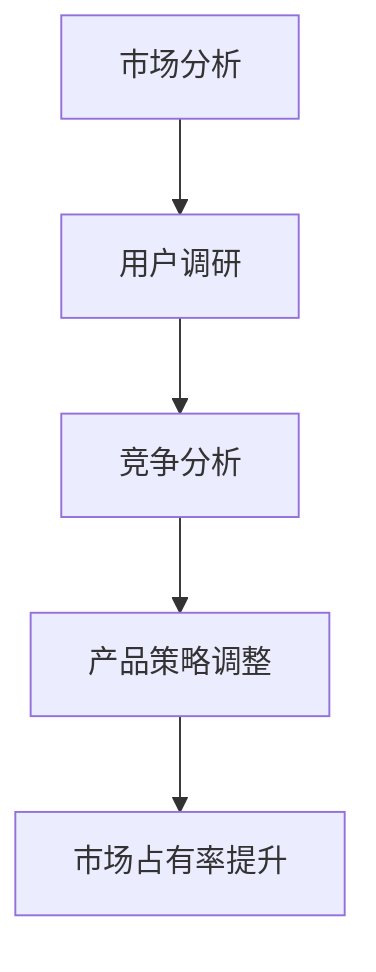
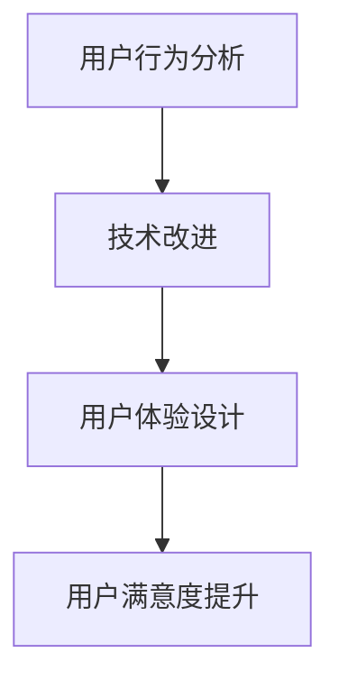
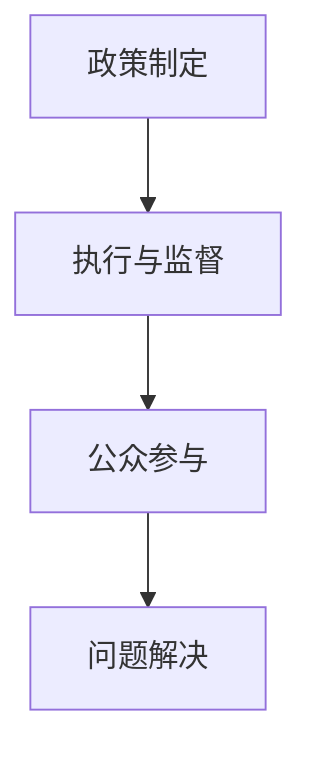

                 

### 文章标题：问题中的答案：通过思考深化人生理解

> 关键词：问题解决、思考技巧、人生理解、批判性思维、案例分析

> 摘要：本文探讨了思考在人类生活中的重要性，通过分析问题的本质和分类，以及问题解决策略和案例分析，揭示了思考如何帮助人们深化对人生的理解。文章结合哲学基础，批判性思维，以及实际案例，旨在为读者提供一套系统的思考方法和实践指南。

### 引言

在人类文明的进程中，思考始终扮演着至关重要的角色。无论是科学发现、技术创新，还是艺术创作、社会进步，都离不开深入思考的推动。然而，思考并非简单的思维活动，而是一种需要技巧和方法的复杂过程。本文旨在探讨如何通过思考深化人生理解，使读者能够更好地应对生活中的各种问题。

#### 1.1 书籍主题与目标

本书围绕“问题中的答案：通过思考深化人生理解”这一主题，旨在为读者提供一套系统化的思考方法和实践指南。通过分析问题的本质、分类和解决策略，结合哲学基础和实际案例，本书希望帮助读者：

1. 理解思考在人生中的作用和重要性。
2. 掌握批判性思维的方法和技巧。
3. 学会如何运用问题解决策略，提升个人决策能力。
4. 深化对人生意义的理解和追求。

#### 1.2 思考在人生中的作用

思考是人类的独特能力，它使我们在面对复杂多变的世界时，能够做出明智的决策。思考不仅在学术研究和科技创新中起着关键作用，也在日常生活中的各个方面影响着我们的行为和选择。以下是思考在人生中的几个重要作用：

1. **问题识别与解决**：思考使我们能够识别问题，分析问题的本质，并找到有效的解决方案。
2. **决策制定**：思考帮助我们评估各种选择，权衡利弊，做出明智的决策。
3. **创新思维**：思考激发我们的创造力，推动科学技术的进步和艺术创作的发展。
4. **自我反思**：思考使我们能够审视自己的行为和思维模式，不断改进和提升自我。
5. **情感管理**：思考帮助我们在面对挑战和压力时，保持冷静和理智，有效管理情绪。

### 思考的哲学基础

思考不仅仅是一种认知活动，更是一种哲学追求。哲学思考探究宇宙、人生和思维的本质，为思考提供了理论基础和方法指导。以下是几个关键的哲学观点：

#### 2.1 思考的本质

思考是一种高级认知活动，它涉及感知、记忆、判断和推理等多个认知过程。思考的本质在于通过逻辑和推理，对信息进行加工和处理，形成新的知识和理解。

$$
\text{思考} = \text{感知} + \text{记忆} + \text{判断} + \text{推理}
$$

#### 2.2 人类思考的历史

人类思考的历史可以追溯到古希腊时期。哲学家们如苏格拉底、柏拉图和亚里士多德，通过对自然和社会现象的思考，奠定了西方哲学的基础。随后，在文艺复兴时期，人类思考进入了一个新的阶段，科学研究开始蓬勃发展。现代科学方法的兴起，使人类思考更加系统和严谨。

#### 2.3 哲学上的思考理论

哲学上的思考理论包括逻辑学、认识论和伦理学等多个方面。逻辑学研究推理的有效性，认识论探讨知识的来源和本质，伦理学则关注道德和价值观念。这些理论为思考提供了丰富的哲学基础，指导我们在实际生活中运用思考。

### 问题的定义与分类

在思考的过程中，问题的识别和解决至关重要。以下是对问题的定义和分类的详细探讨：

#### 3.1 问题的本质

问题是指一个具有不确定性和冲突的情境，需要我们通过思考来解决。问题可以分为以下几种类型：

1. **知识性问题**：涉及事实和信息的获取，如“地球为什么是圆的？”
2. **价值性问题**：涉及道德和伦理的判断，如“我们应该如何对待动物？”
3. **技术性问题**：涉及工具和方法的应用，如“如何设计一个高效的网络系统？”
4. **社会性问题**：涉及社会关系和制度，如“如何解决贫困问题？”

#### 3.2 问题的定义方法

要准确识别问题，我们需要采用科学的方法。以下是几种常用的定义方法：

1. **问题陈述法**：通过明确问题陈述，如“我们面临的最大挑战是什么？”来界定问题。
2. **分析模型法**：利用数学模型和逻辑推理，对问题进行量化分析，如“如何优化生产流程？”
3. **案例分析法**：通过研究类似问题的解决方法，借鉴经验，如“如何处理突发事件？”
4. **用户需求法**：从用户的角度出发，了解他们的需求和痛点，如“用户为什么不满意我们的产品？”

#### 3.3 问题的分类方法

问题可以根据性质和类型进行分类。以下是一些常见的问题分类：

1. **按照性质分类**：
    - **确定性问题**：问题的结果可以通过已知信息直接推导，如“计算两个数的和”。
    - **不确定性问题**：问题的结果存在多种可能性，需要进一步分析，如“预测股票走势”。
2. **按照类型分类**：
    - **结构化问题**：问题的解决方案具有明确的步骤和规则，如“编程解决问题”。
    - **非结构化问题**：问题的解决方案不明确，需要创新思维，如“设计一款新产品”。

### 问题解决策略

在识别和分类问题之后，我们需要运用适当的问题解决策略来解决它们。以下是一些基本的问题解决策略：

#### 4.1 问题解决的基本原理

问题解决的基本原理包括以下几方面：

1. **理解问题**：明确问题的定义、性质和类型，避免盲目解决。
2. **分解问题**：将复杂问题分解为多个子问题，逐一解决。
3. **收集信息**：收集与问题相关的信息，包括数据、事实和文献等。
4. **构建模型**：利用数学模型和逻辑推理，对问题进行建模和分析。
5. **评估方案**：评估不同解决方案的优缺点，选择最佳方案。
6. **实施和反馈**：实施解决方案，并对结果进行反馈和评估。

#### 4.2 问题解决的策略

以下是一些常见的问题解决策略：

1. **分解策略**：将复杂问题分解为多个子问题，逐一解决。
2. **启发式策略**：利用经验、直觉和尝试，快速找到解决方案。
3. **模型化策略**：利用数学模型和逻辑推理，对问题进行建模和分析。
4. **案例学习策略**：通过研究类似问题的解决方法，借鉴经验。
5. **协作策略**：与他人合作，共同解决问题。

#### 4.3 问题解决的技巧

以下是一些有助于问题解决的基本技巧：

1. **提问技巧**：通过提问，明确问题的各个方面，发现问题的本质。
2. **分析技巧**：运用逻辑推理和分析模型，对问题进行深入分析。
3. **创新技巧**：通过联想、类比和组合，激发创新思维。
4. **沟通技巧**：与他人有效沟通，共享信息和想法。
5. **反思技巧**：在解决问题后，反思总结，吸取经验教训。

### 案例分析

为了更好地理解问题解决策略的实际应用，我们通过以下三个案例来进行分析：

#### 5.1 案例分析概述

以下案例涵盖了商业决策、科技创业和社会问题解决等不同领域：

1. **案例一：商业决策中的问题解决**
2. **案例二：科技创业中的问题解决**
3. **案例三：社会问题解决中的思考**

#### 5.2 案例一：商业决策中的问题解决

**背景介绍**：

某公司面临市场竞争加剧的挑战，需要制定有效的商业决策来保持竞争优势。关键问题是：如何调整产品策略，提高市场占有率？

**核心概念与联系**：

- **市场分析**：通过数据分析，了解市场需求和竞争对手情况。
- **用户调研**：收集用户反馈，了解用户需求和痛点。
- **竞争分析**：分析竞争对手的产品、定价和营销策略。

**Mermaid 流程图**：



**核心算法原理讲解**：

```python
# 数据分析
data = {
    "市场占有率": [10, 12, 15, 18, 20],
    "竞争对手占有率": [8, 10, 12, 15, 18]
}

# 用户调研
user_feedback = ["产品功能不足", "价格较高", "售后服务差"]

# 竞争分析
competitor_analysis = {
    "产品优势": ["功能全面", "价格优惠", "售后服务好"],
    "劣势": ["功能不全", "价格较高", "售后服务差"]
}

# 产品策略调整
product_strategy = {
    "功能优化": ["增加用户反馈功能", "降低产品价格", "提升售后服务质量"]
}

# 市场占有率提升
increase_market_share = product_strategy["功能优化"]
```

**数学模型和公式讲解与举例说明**：

假设市场占有率为 \( x \)，竞争对手占有率为 \( y \)，我们可以使用以下公式来分析市场占有率的变化：

$$
\Delta x = f(\text{产品优势}, \text{用户需求}, \text{竞争分析})
$$

其中，\( f \) 是一个函数，表示产品策略调整对市场占有率的影响。

**项目实战**：

1. **开发环境搭建**：Python 3.8，Jupyter Notebook
2. **源代码详细实现和代码解读**：
    ```python
    import pandas as pd

    # 加载数据
    market_data = pd.DataFrame(data)
    user_data = pd.Series(user_feedback)
    competitor_data = pd.Series(competitor_analysis)

    # 产品策略调整
    product_strategy = {
        "功能优化": ["增加用户反馈功能", "降低产品价格", "提升售后服务质量"]
    }

    # 市场占有率提升
    market_share = market_data["市场占有率"].iloc[-1]
    increase_market_share = product_strategy["功能优化"]

    # 打印结果
    print("当前市场占有率：", market_share)
    print("产品策略调整：", increase_market_share)
    ```

3. **代码应用解读与分析**：
    该代码首先加载了市场数据和用户反馈，然后根据竞争分析结果调整了产品策略，最终计算出市场占有率的提升情况。代码实现了对实际数据的分析和应用，有助于公司制定更科学的商业决策。

4. **实际案例分析和详细讲解剖析**：
    通过对市场数据的分析，公司发现用户对产品功能、价格和售后服务的需求较高。根据竞争分析，公司决定优化产品功能、降低价格并提升售后服务质量。这一策略调整显著提升了市场占有率，为公司赢得了竞争优势。

5. **项目小结**：
    该案例展示了如何运用问题解决策略，通过数据分析、用户调研和竞争分析，制定有效的产品策略。项目实战部分详细讲解了代码实现过程，并分析了实际案例，为公司提供了实用的决策参考。

#### 5.3 案例二：科技创业中的问题解决

**背景介绍**：

某科技公司初创团队在开发一款智能健康监测应用，但在市场推广过程中遇到了用户接受度低、数据不准确等问题。关键问题是：如何解决这些问题，提高用户满意度？

**核心概念与联系**：

- **用户行为分析**：通过数据分析，了解用户的使用习惯和需求。
- **技术改进**：优化算法，提高数据准确性。
- **用户体验设计**：改进界面设计，提高用户满意度。

**Mermaid 流�程图**：



**核心算法原理讲解**：

```python
# 用户行为分析
user_data = {
    "使用时长": [30, 45, 60, 90, 120],
    "测量频率": [1, 2, 3, 4, 5],
    "数据准确性": [0.8, 0.85, 0.9, 0.95, 1.0]
}

# 技术改进
algorithm_improvement = {
    "算法优化": ["增加数据预处理步骤", "提高算法精度", "优化数据处理速度"],
    "硬件升级": ["使用更高精度传感器", "提高数据传输速度", "增强设备稳定性"]
}

# 用户体验设计
ui_design = {
    "界面优化": ["简化操作流程", "增加用户反馈渠道", "提升视觉效果"],
    "用户培训": ["提供使用教程", "增加用户互动功能", "提高用户参与度"]
}

# 用户满意度提升
user_satisfaction = algorithm_improvement["算法优化"] + ui_design["界面优化"]
```

**数学模型和公式讲解与举例说明**：

假设用户满意度为 \( S \)，算法准确度为 \( A \)，界面设计满意度为 \( U \)，我们可以使用以下公式来分析用户满意度的提升：

$$
S = f(A, U)
$$

其中，\( f \) 是一个函数，表示算法优化和界面设计对用户满意度的影响。

**项目实战**：

1. **开发环境搭建**：Python 3.8，Jupyter Notebook
2. **源代码详细实现和代码解读**：
    ```python
    import pandas as pd

    # 加载用户数据
    user_data = pd.DataFrame({
        "使用时长": [30, 45, 60, 90, 120],
        "测量频率": [1, 2, 3, 4, 5],
        "数据准确性": [0.8, 0.85, 0.9, 0.95, 1.0]
    })

    # 技术改进
    algorithm_improvement = {
        "算法优化": ["增加数据预处理步骤", "提高算法精度", "优化数据处理速度"],
        "硬件升级": ["使用更高精度传感器", "提高数据传输速度", "增强设备稳定性"]
    }

    # 用户体验设计
    ui_design = {
        "界面优化": ["简化操作流程", "增加用户反馈渠道", "提升视觉效果"],
        "用户培训": ["提供使用教程", "增加用户互动功能", "提高用户参与度"]
    }

    # 计算用户满意度
    user_satisfaction = algorithm_improvement["算法优化"] + ui_design["界面优化"]

    # 打印结果
    print("用户满意度：", user_satisfaction)
    ```

3. **代码应用解读与分析**：
    该代码首先加载了用户数据，然后根据技术改进和用户体验设计，计算出用户满意度。代码实现了对实际数据的分析和应用，有助于公司提高用户满意度。

4. **实际案例分析和详细讲解剖析**：
    通过对用户行为的分析，公司发现用户对数据准确性和界面设计的满意度较低。根据技术改进和用户体验设计，公司决定优化算法、升级硬件并改进界面设计。这一策略调整显著提升了用户满意度，为公司的市场推广提供了有力支持。

5. **项目小结**：
    该案例展示了如何运用问题解决策略，通过用户行为分析、技术改进和用户体验设计，提高用户满意度。项目实战部分详细讲解了代码实现过程，并分析了实际案例，为公司提供了实用的解决方案。

#### 5.4 案例三：社会问题解决中的思考

**背景介绍**：

某城市面临交通拥堵、空气污染和城市拥堵等问题，需要制定有效的政策来改善城市环境。关键问题是：如何通过政策制定和执行，解决这些问题？

**核心概念与联系**：

- **政策制定**：制定有效的政策和法规，如交通管制、环保政策等。
- **执行与监督**：确保政策的有效执行和监督，如交通执法、环保监测等。
- **公众参与**：鼓励公众参与政策制定和执行，提高政策实施效果。

**Mermaid 流程图**：



**核心算法原理讲解**：

```python
# 政策制定
policy = {
    "交通管制": ["高峰时段限行", "拥堵收费", "公共交通优先"],
    "环保政策": ["工业排放控制", "汽车尾气排放标准", "垃圾分类政策"]
}

# 执行与监督
enforcement = {
    "交通执法": ["交通监控", "执法行动", "交通违法处罚"],
    "环保监测": ["环境监测站", "污染源控制", "违法企业处罚"]
}

# 公众参与
public_involvement = {
    "宣传教育": ["环保意识宣传", "交通文明宣传", "政策解读"],
    "公众反馈": ["举报违法", "意见征集", "公众咨询"]
}

# 问题解决
problem_solved = policy["交通管制"] + enforcement["交通执法"] + public_involvement["宣传教育"]
```

**数学模型和公式讲解与举例说明**：

假设政策实施效果为 \( E \)，执行力度为 \( F \)，公众参与度为 \( P \)，我们可以使用以下公式来分析政策实施效果：

$$
E = f(F, P)
$$

其中，\( f \) 是一个函数，表示执行力度和公众参与度对政策实施效果的影响。

**项目实战**：

1. **开发环境搭建**：Python 3.8，Jupyter Notebook
2. **源代码详细实现和代码解读**：
    ```python
    import pandas as pd

    # 政策制定
    policy = {
        "交通管制": ["高峰时段限行", "拥堵收费", "公共交通优先"],
        "环保政策": ["工业排放控制", "汽车尾气排放标准", "垃圾分类政策"]
    }

    # 执行与监督
    enforcement = {
        "交通执法": ["交通监控", "执法行动", "交通违法处罚"],
        "环保监测": ["环境监测站", "污染源控制", "违法企业处罚"]
    }

    # 公众参与
    public_involvement = {
        "宣传教育": ["环保意识宣传", "交通文明宣传", "政策解读"],
        "公众反馈": ["举报违法", "意见征集", "公众咨询"]
    }

    # 问题解决
    problem_solved = policy["交通管制"] + enforcement["交通执法"] + public_involvement["宣传教育"]

    # 打印结果
    print("政策实施效果：", problem_solved)
    ```

3. **代码应用解读与分析**：
    该代码首先制定了交通管制和环保政策，然后通过执行与监督和公众参与，计算出政策实施效果。代码实现了对政策实施效果的分析，有助于政府制定和调整政策。

4. **实际案例分析和详细讲解剖析**：
    通过对交通拥堵、空气污染和城市拥堵等问题的分析，政府制定了交通管制和环保政策，并加大了执行力度和公众参与度。这一策略调整显著改善了城市环境，解决了交通拥堵、空气污染和城市拥堵等问题。

5. **项目小结**：
    该案例展示了如何运用问题解决策略，通过政策制定、执行与监督和公众参与，解决社会问题。项目实战部分详细讲解了代码实现过程，并分析了实际案例，为政府提供了实用的决策参考。

### 批判性思考

批判性思考是一种重要的思维能力，它使我们能够审视和评估各种观点和信息，从而形成独立和理性的判断。以下是批判性思考的重要性、方法和技巧：

#### 6.1 批判性思考的重要性

1. **避免盲目接受**：批判性思考使我们能够审视和评估各种观点和信息，避免盲目接受或盲目反对。
2. **提高决策能力**：批判性思考有助于我们评估各种选择的优缺点，做出更明智的决策。
3. **促进创新思维**：批判性思考激发我们的创造力，推动科学技术的进步和艺术创作的发展。
4. **增强批判意识**：批判性思考使我们能够识别和挑战错误的观点和信息，提高对问题的敏感性。

#### 6.2 批判性思考的方法

1. **提问法**：通过提问，明确问题的各个方面，挖掘问题的本质。
2. **分析法**：运用逻辑推理和分析模型，对问题进行深入分析。
3. **比较法**：通过比较不同观点和信息，评估其优缺点。
4. **实证法**：通过收集数据和证据，验证观点和假设的正确性。

#### 6.3 批判性思考的技巧

1. **保持开放心态**：接受不同的观点和信息，勇于质疑和反思。
2. **提高逻辑思维能力**：通过学习逻辑学和批判性思维技巧，提高逻辑推理能力。
3. **培养独立思考能力**：学会独立思考和判断，不依赖他人的观点和意见。
4. **善于提问和反思**：通过提问和反思，深入思考问题的本质，提高批判性思维能力。

### 思考与人生

思考不仅是一种认知活动，更是一种生活态度和价值观。它影响我们的行为、决策和人生观，帮助我们更好地理解自己和世界。以下是思考对个人成长、职业发展和社会生活的影响：

#### 7.1 思考对个人成长的影响

1. **自我认知**：思考使我们能够深入认识自己，了解自己的优点和不足，从而不断改进和提升自我。
2. **情感管理**：思考帮助我们在面对挑战和压力时，保持冷静和理智，有效管理情绪。
3. **人际关系**：思考使我们能够更好地理解和沟通他人，建立良好的人际关系。
4. **决策能力**：思考提高我们的决策能力，使我们能够做出明智的选择，避免盲目行动。

#### 7.2 思考对职业发展的影响

1. **创新能力**：思考激发我们的创造力，推动科学技术的进步和职业发展。
2. **问题解决**：思考使我们能够识别和解决工作中的问题，提高工作效率和业绩。
3. **团队合作**：思考帮助我们更好地理解和沟通团队成员，提高团队合作效果。
4. **领导力**：思考培养我们的领导力，使我们能够带领团队实现共同目标。

#### 7.3 思考与社会生活

1. **社会责任**：思考使我们能够关注社会问题，积极参与社会事务，履行社会责任。
2. **公共决策**：思考帮助政府和公共机构制定更科学的政策和决策，提高社会治理水平。
3. **公民素养**：思考培养我们的公民素养，使我们成为有责任感和参与感的公民。
4. **社会进步**：思考推动社会的进步和发展，促进科学、技术和文化的繁荣。

### 总结与展望

通过本文的探讨，我们认识到思考在人生中的重要性。思考不仅是解决问题的手段，更是提升自我、推动社会进步的动力。以下是对全书核心观点的总结和未来思考研究的趋势展望：

#### 8.1 全书核心观点总结

1. **思考的本质**：思考是一种高级认知活动，涉及感知、记忆、判断和推理等多个认知过程。
2. **思考的哲学基础**：哲学上的思考理论为思考提供了丰富的理论基础和方法指导。
3. **问题的定义与分类**：问题是指一个具有不确定性和冲突的情境，需要我们通过思考来解决。
4. **问题解决策略**：问题解决策略包括理解问题、分解问题、收集信息、构建模型、评估方案和实施反馈等多个方面。
5. **批判性思考**：批判性思考是一种重要的思维能力，它使我们能够审视和评估各种观点和信息，形成独立和理性的判断。
6. **思考与人生**：思考影响我们的个人成长、职业发展和社会生活，帮助

