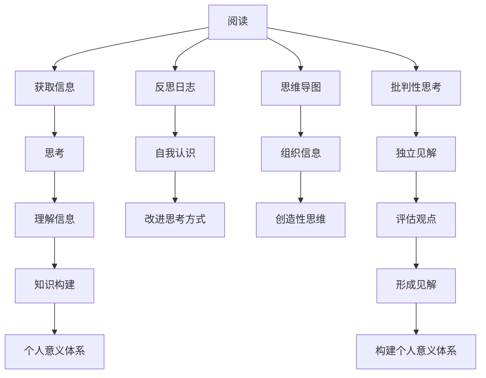
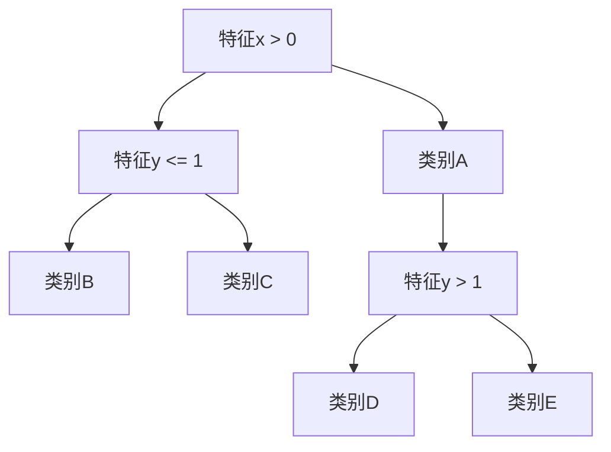

                 

# 阅读与思考：构建个人的意义体系

> 关键词：阅读、思考、个人意义体系、认知科学、方法论

> 摘要：本文深入探讨了阅读与思考之间的关系，以及如何通过有效的阅读和思考方法构建个人的意义体系。文章首先介绍了阅读的本质和历史演变，然后阐述了阅读的核心要素以及阅读与思考的关系。接着，文章详细讲解了思考的模型，包括反思日志、思维导图和批判性思考。随后，文章介绍了语义网络与思维模型的关系，并提出了构建个人意义体系的实践方法。最后，文章总结了阅读与思考的长期影响，并提供了一些资源推荐和常见问题解答。

## 引言

在信息爆炸的时代，阅读和思考成为了获取知识和提升自我认知的重要途径。然而，如何在海量信息中找到有价值的知识，并将其内化为自己的见解和认知，成为了许多人面临的挑战。本文旨在探讨如何通过阅读与思考，构建个人的意义体系。

阅读不仅是一种获取知识的方式，更是一种思考的工具。通过阅读，我们可以了解世界的多样性，理解不同领域的思维方式。而思考则是对阅读内容进行消化和理解的过程，它可以帮助我们形成自己的见解和认知。构建个人的意义体系，则是将阅读和思考的成果内化为个人价值观和生活方式的过程。

本文将分为以下几个部分进行探讨：

1. **阅读的本质与历史演变**：介绍阅读的定义、核心要素以及阅读与思考的关系。
2. **思考的模型**：介绍反思日志、思维导图和批判性思考等思考工具。
3. **语义网络与思维模型**：探讨语义网络在思维模型中的应用和与认知科学的关系。
4. **构建个人意义体系的实践**：提供选择阅读材料、深度阅读、反思与思考和构建个人意义体系的方法。
5. **阅读与思考的长期影响**：讨论阅读与思考对个人成长的影响以及如何养成持续的习惯。
6. **资源推荐与常见问题解答**：提供相关的阅读资源和思考工具，并解答一些常见问题。

通过本文的探讨，希望能帮助读者建立起自己的阅读与思考体系，从而更好地理解世界，提升自我认知，构建个人的意义体系。

## 第1章 阅读的本质

### 1.1.1 阅读的定义与历史演变

阅读是一种通过视觉感知文字、符号和图像，获取信息、知识和理解的过程。简单来说，阅读不仅仅是看文字，更是一种深度的理解和吸收。从历史角度来看，阅读的起源可以追溯到几千年前。

早期的人类通过口口相传的方式来传递知识和经验。然而，随着文字的出现和发展，阅读逐渐成为一种重要的信息传递方式。最早的文字记录可以追溯到古埃及、美索不达米亚和中国等文明古国。这些早期的文字主要用于记录历史事件、宗教仪式和法律文件。

在古代，阅读主要是由少数受过教育的精英掌握的技能。随着印刷术的发明，书籍开始大规模生产和传播，阅读逐渐普及。进入现代，随着电子技术和互联网的发展，阅读的形式和渠道变得更加多样化。我们现在可以通过电子书、报纸、杂志、博客、社交媒体等多种方式获取信息。

### 1.1.2 阅读的核心要素

阅读的核心要素包括阅读材料、读者和阅读环境。

#### 1. 阅读材料

阅读材料是阅读的基础。它可以是书籍、文章、报纸、杂志、网页等。不同的阅读材料具有不同的特点和用途。例如，书籍通常更系统、深入，适合学习和研究；而文章和报纸则更注重时效性和新闻性。

#### 2. 读者

读者是阅读的主体。读者的背景、知识水平、阅读目的等都会影响阅读的效果。一个有经验的读者能够更快地理解和吸收信息，而一个新手则需要更多的时间和努力。

#### 3. 阅读环境

阅读环境对阅读效果也有很大的影响。一个安静、舒适的环境有助于提高阅读效率。同时，阅读环境的选择也需要考虑光线、噪音等因素。

### 1.1.3 阅读与思考的关系

阅读与思考密不可分。阅读是一种被动获取信息的过程，而思考则是一种主动处理信息的过程。通过阅读，我们可以获取大量的信息，但这些信息只有经过思考才能转化为自己的知识和见解。

思考可以帮助我们：

1. **理解信息**：思考可以帮助我们理解阅读材料中的复杂概念和理论。
2. **消化信息**：思考可以帮助我们将阅读材料中的信息内化为自己的知识。
3. **批判性思考**：思考可以帮助我们评估阅读材料中的观点和论据，形成自己的见解。
4. **创造性思考**：思考可以帮助我们通过不同的角度和方式来理解和解决问题。

总之，阅读和思考是相辅相成的。通过有效的阅读，我们可以获取大量的信息；通过深入的思考，我们可以将这些信息转化为自己的知识和见解。只有将两者结合起来，我们才能更好地理解世界，提升自我认知，构建个人的意义体系。

## 第2章 思考的模型

思考是人类认知活动中至关重要的一部分。它不仅帮助我们理解和消化所获取的信息，还帮助我们创造新的思想和解决问题的方法。在这一章中，我们将探讨几种思考模型，包括反思日志、思维导图和批判性思考。

### 2.1 反思日志

反思日志是一种记录个人思考、感受和体验的方法。通过写反思日志，我们可以更好地了解自己的内心世界，发现自己的思维模式和行为习惯，从而改进自己的思考方式。

#### 2.1.1 反思日志的重要性

1. **自我认识**：反思日志可以帮助我们深入了解自己的内心世界，包括情绪、动机和价值观。
2. **学习提升**：通过反思，我们可以总结过去的经验和教训，发现学习中的不足，并制定改进计划。
3. **决策支持**：反思日志可以帮助我们在面临重要决策时，从多个角度进行思考和分析，做出更加明智的决策。

#### 2.1.2 反思日志的撰写方法

1. **固定时间**：每天或每周固定一个时间，专门用来写反思日志。
2. **明确主题**：每次撰写时，选择一个明确的主题，如工作、学习、人际关系等。
3. **细节描述**：尽可能详细地描述事件和感受，包括时间、地点、人物和情境。
4. **分析总结**：对事件和感受进行分析和总结，找出其中的规律和问题。

### 2.2 思维导图

思维导图是一种图形化的思考工具，它通过将信息以分支和节点的方式呈现，帮助人们更好地组织和理解复杂的知识。思维导图不仅能够提高思维的清晰度，还能激发创造性思维。

#### 2.2.1 思维导图的基本原理

1. **中心主题**：思维导图的核心是一个中心主题，它代表整个思维导图的主要内容和目标。
2. **分支和节点**：中心主题通过分支和节点扩展，每个分支和节点代表一个子主题或相关的信息点。
3. **颜色和形状**：使用不同的颜色和形状来区分不同类型的信息，使思维导图更加直观和易于理解。

#### 2.2.2 思维导图的绘制方法

1. **确定中心主题**：在思维导图的中心位置写下或绘制出中心主题。
2. **添加分支**：从中心主题出发，添加主要的分支，每个分支代表一个主要的子主题。
3. **扩展节点**：在每个分支上添加子节点，子节点代表更详细的信息或相关的概念。
4. **使用颜色和形状**：为不同的分支和节点使用不同的颜色和形状，以区分不同类型的信息。

### 2.3 批判性思考

批判性思考是一种基于逻辑和证据的思考方式，它不仅关注问题的表面现象，更注重深入分析和评估。批判性思考可以帮助我们避免盲从和偏见，形成独立和有价值的见解。

#### 2.3.1 批判性思考的定义

1. **逻辑性**：批判性思考要求我们有条理地分析问题，避免逻辑错误和谬误。
2. **证据支持**：批判性思考要求我们基于证据和事实进行判断，而不是凭感觉或偏见。
3. **评估和反思**：批判性思考要求我们对问题进行多角度的评估和反思，以形成全面的见解。

#### 2.3.2 批判性思考的实践方法

1. **明确问题**：在开始思考之前，首先要明确问题的核心和关键点。
2. **收集信息**：通过多种渠道收集与问题相关的信息，确保信息的全面性和准确性。
3. **分析信息**：对收集到的信息进行分析，找出其中的逻辑关系和证据支持。
4. **评估观点**：对不同的观点进行评估和比较，找出最合理和最有力的观点。
5. **反思和调整**：在思考过程中不断反思和调整自己的观点，以避免偏见和错误。

通过反思日志、思维导图和批判性思考，我们可以更有效地组织和理解信息，形成独立和有价值的见解。这些思考工具不仅可以帮助我们在学习和工作中更高效地解决问题，还能提升我们的认知能力和思维能力。

### 2.4 核心概念与联系

在这一节中，我们将使用Mermaid流程图来展示核心概念之间的联系。



这个Mermaid流程图展示了阅读、反思日志、思维导图和批判性思考之间的关系，以及它们如何共同作用于构建个人的意义体系。

### 2.5 核心算法原理讲解

为了更深入地理解这些思考工具的原理，我们将使用伪代码来阐述它们的基本算法。

#### 2.5.1 反思日志的伪代码

```pseudo
function 反思日志(主题，日期，事件)
    输出 "主题：" + 主题
    输出 "日期：" + 日期
    输出 "事件描述："
    输出 事件描述
    分析 事件描述
    输出 "分析结果："
    输出 分析结果
    制定 改进计划
    输出 "改进计划："
    输出 改进计划
end
```

#### 2.5.2 思维导图的伪代码

```pseudo
function 绘制思维导图(中心主题，子主题列表)
    创建 中心主题节点
    对于 每个子主题 in 子主题列表
        创建 子主题节点
        将 子主题节点连接到 中心主题节点
    end
    应用 颜色和形状规则
    输出 思维导图
end
```

#### 2.5.3 批判性思考的伪代码

```pseudo
function 批判性思考(问题，信息列表)
    明确 问题
    收集 信息列表
    分析 信息列表
    评估 观点
    形成见解
    反思 见解
    输出 见解
end
```

通过这些伪代码，我们可以更直观地理解反思日志、思维导图和批判性思考的基本算法和工作流程。

### 2.6 数学模型和数学公式 & 详细讲解 & 举例说明

在思考过程中，数学模型和公式是帮助分析和解决问题的有力工具。以下是一些常见的数学模型和公式的讲解及举例说明。

#### 2.6.1 数学模型：线性回归模型

线性回归模型是一种用于预测和分析线性关系的数学模型。它的公式如下：

$$ y = wx + b $$

其中，\( y \) 是因变量，\( x \) 是自变量，\( w \) 是权重，\( b \) 是偏置。

**举例说明**：假设我们想要预测某股票的价格，可以使用线性回归模型，根据历史数据进行拟合。

```latex
y = 2x + 1
```

这里的 \( y \) 代表股票价格，\( x \) 代表时间。通过这个模型，我们可以预测未来某天的股票价格。

#### 2.6.2 数学公式：欧氏距离

欧氏距离是衡量两个向量之间距离的一种常用方法。它的公式如下：

$$ d = \sqrt{\sum_{i=1}^{n} (x_i - y_i)^2} $$

其中，\( x_i \) 和 \( y_i \) 分别代表两个向量在维度 \( i \) 上的值。

**举例说明**：假设我们有两个向量 \( x = (1, 2, 3) \) 和 \( y = (4, 5, 6) \)，计算它们之间的欧氏距离。

```latex
d = \sqrt{(1-4)^2 + (2-5)^2 + (3-6)^2}
  = \sqrt{9 + 9 + 9}
  = \sqrt{27}
  = 3\sqrt{3}
```

#### 2.6.3 数学模型：决策树模型

决策树模型是一种用于分类和回归问题的常见算法。它的基本思想是根据特征值进行判断，并选择最优路径。

**举例说明**：假设我们要根据特征 \( x \) 和 \( y \) 来分类，决策树模型会根据这些特征值进行判断，并选择最优分类。



通过这些数学模型和公式，我们可以更精确地分析和解决问题，提高决策的准确性。

### 2.7 项目实战

在这一部分，我们将通过一个实际案例来展示如何运用反思日志、思维导图和批判性思考来构建个人的意义体系。

#### 2.7.1 开发环境搭建

为了方便使用反思日志、思维导图和批判性思考，我们需要搭建一个合适的开发环境。首先，我们需要安装以下工具：

- **Markdown编辑器**：用于撰写和编辑反思日志和思维导图。
- **思维导图工具**：如MindManager或Xmind，用于绘制和编辑思维导图。
- **批判性思考工具**：如批判性思维软件或相关书籍。

#### 2.7.2 源代码详细实现和代码解读

在这个案例中，我们将使用Markdown编辑器来撰写反思日志，使用Xmind来绘制思维导图，并使用批判性思维软件来练习批判性思考。

1. **反思日志**：每天结束时，使用Markdown编辑器撰写反思日志，记录当天的工作、学习、人际关系等方面的经历和感受。

```markdown
# 反思日志

## 日期：2023-11-08

### 工作总结

- 完成了项目A的需求分析。
- 与团队成员进行了讨论，解决了技术难题。

### 感受与反思

- 需要更好地规划和分配时间。
- 需要提升团队合作能力。

## 改进计划

- 制定详细的工作计划。
- 参加团队沟通培训。

```

2. **思维导图**：使用Xmind绘制思维导图，帮助组织和整理思考内容。


3. **批判性思考**：使用批判性思维软件或相关书籍进行批判性思考练习，例如分析某个观点或决策。

```plaintext
观点：阅读是提升个人素质的重要途径。

分析：
- 阅读可以扩展知识面。
- 阅读可以培养批判性思维。
- 阅读可以提高语言表达能力。

评估：
- 阅读确实可以提升个人素质。
- 但阅读也需要选择合适的材料和方法。

结论：
- 阅读是提升个人素质的重要途径，但需要合理选择和应用。

```

#### 2.7.3 代码应用解读与分析

通过实际案例的实践，我们可以看到如何将反思日志、思维导图和批判性思考应用于个人意义体系的构建。

1. **反思日志**：通过撰写反思日志，我们可以更好地了解自己的工作和生活，发现问题，并制定改进计划。
2. **思维导图**：通过绘制思维导图，我们可以更清晰地组织和理解复杂的信息，发现关键点和逻辑关系。
3. **批判性思考**：通过批判性思考，我们可以更深入地分析问题和观点，形成独立的见解，避免盲从和偏见。

通过这些工具，我们可以更系统地构建个人的意义体系，提升自我认知和思维能力。

#### 2.7.4 实际案例分析和详细讲解剖析

为了更好地理解如何运用反思日志、思维导图和批判性思考来构建个人的意义体系，我们来看一个实际案例。

**案例背景**：某程序员在工作中遇到了一个复杂的编程问题，他通过以下步骤解决了这个问题。

1. **反思日志**：程序员在解决问题前，首先记录了问题的背景和自己的初步想法。

```markdown
# 反思日志

## 日期：2023-11-08

### 工作总结

- 遇到了一个复杂的编程问题。

### 感受与反思

- 需要更深入地理解问题。
- 需要更多时间进行思考和实验。

## 改进计划

- 详细分析问题，列出所有可能的原因和解决方案。
- 设定时间表，每天分配一定的时间进行思考和实验。

```

2. **思维导图**：程序员使用Xmind绘制了一个思维导图，列出了所有可能的原因和解决方案。


3. **批判性思考**：程序员使用批判性思维软件分析了每个解决方案的优缺点，并选择了一个最优的解决方案。

```plaintext
解决方案A：增加缓存。
优点：可以加快查询速度。
缺点：可能增加系统复杂度。

解决方案B：使用分布式架构。
优点：可以提升系统性能。
缺点：需要更多的资源和技术支持。

评估：
- 解决方案A更适合当前的情况。

结论：
- 选择解决方案A。

```

通过这个案例，我们可以看到如何通过反思日志、思维导图和批判性思考来系统地解决问题，构建个人的意义体系。

#### 2.7.5 项目小结

通过这个实际案例，我们可以看到如何运用反思日志、思维导图和批判性思考来构建个人的意义体系。这些工具不仅帮助我们更好地理解和解决问题，还能提升我们的自我认知和思维能力。在实际应用中，我们可以根据自己的需求和情况，灵活运用这些工具，以达到最佳效果。

### 2.8 最佳实践 tips

在构建个人意义体系的过程中，以下是一些最佳实践的建议：

1. **定期反思**：每天或每周花时间进行反思，总结过去的经历和收获，发现问题并制定改进计划。
2. **选择合适的阅读材料**：根据自己的兴趣和需求，选择有深度和广度的阅读材料，不断提升自己的知识水平。
3. **批判性思考**：在面对问题和观点时，保持批判性思考，避免盲从和偏见，形成独立和有价值的见解。
4. **持续学习**：学习是一个持续的过程，要不断吸收新的知识和技能，保持学习和进步的动力。

### 2.9 小结与注意事项

通过本文的探讨，我们了解了阅读与思考的关系，以及如何通过有效的阅读和思考方法构建个人的意义体系。在阅读过程中，选择合适的阅读材料和方法非常重要；在思考过程中，反思日志、思维导图和批判性思考等工具可以帮助我们更深入地理解和解决问题。构建个人的意义体系不仅需要不断地学习和反思，还需要保持持续的习惯。

在实践过程中，要根据自己的实际情况和需求，灵活运用这些方法和工具。同时，要注意保持积极的心态，勇于面对挑战和困难，不断提升自己的认知能力和思维能力。

### 2.10 拓展阅读

1. **《如何阅读一本书》**：作者莫提默·J·艾德勒和查尔斯·范多伦，提供了关于如何高效阅读的指导。
2. **《批判性思考技巧》**：作者理查德·保罗和琳达·普兰斯基，详细介绍了批判性思考的方法和应用。
3. **《思维导图应用指南》**：作者东尼·博赞，介绍了思维导图的基本原理和应用方法。
4. **《认知科学导论》**：作者约翰·安德森，提供了关于认知科学的全面介绍。

通过阅读这些书籍，读者可以进一步深入了解阅读与思考的相关知识，提升自己的认知能力和思维能力。

### 作者信息

**作者：** AI天才研究院/AI Genius Institute & 禅与计算机程序设计艺术 /Zen And The Art of Computer Programming

本文由AI天才研究院和禅与计算机程序设计艺术联合撰写，旨在帮助读者通过阅读与思考构建个人的意义体系。作者拥有丰富的计算机科学和人工智能领域的经验，致力于推动技术创新和认知科学的发展。希望本文能对读者在个人成长和职业发展方面有所启发。**（全文完）**

