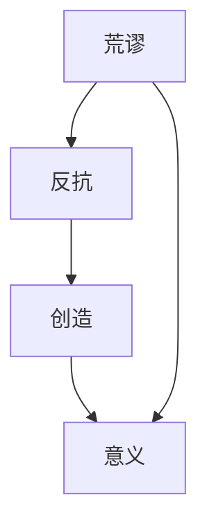
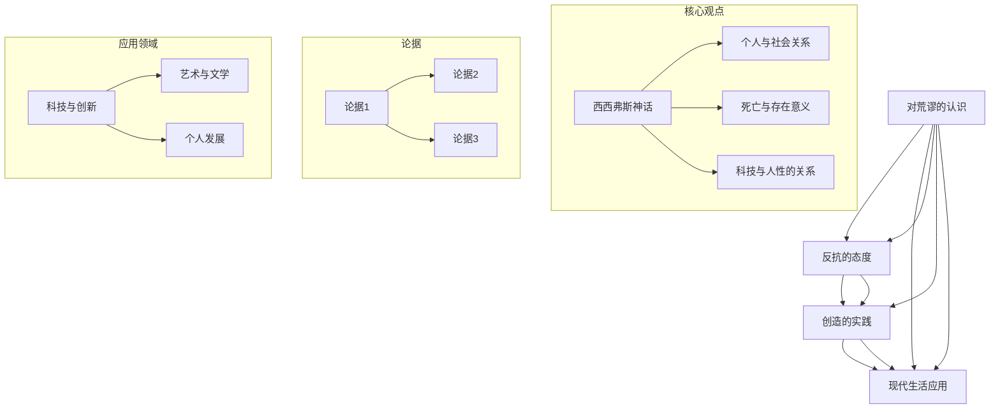
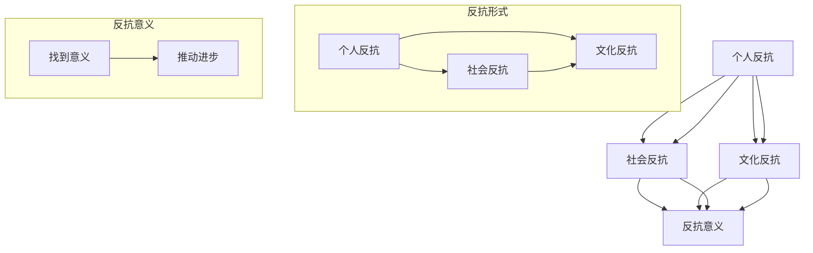
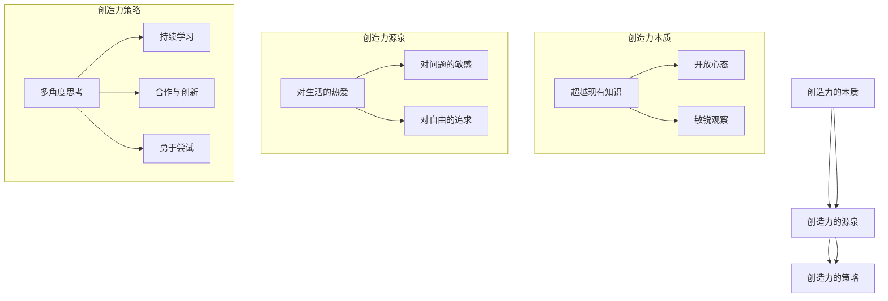
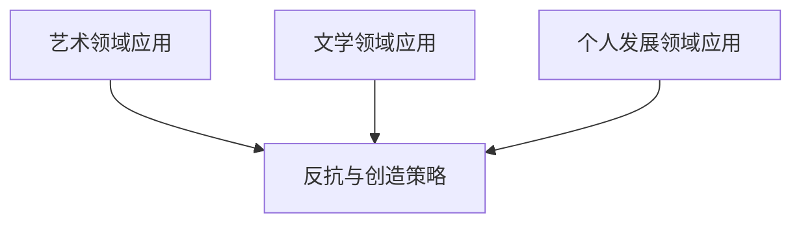

                 

### 文章标题

《面对absurdity：加缪式的反抗与创造》

### 关键词

- 加缪哲学
- 绝望与反抗
- 创造力
- 技术与创新
- 人生意义

### 摘要

本文以阿尔贝·加缪的哲学思想为出发点，深入探讨面对生活中的荒谬（absurdity）时，如何通过反抗与创造来寻找意义。文章首先介绍了加缪及其哲学背景，然后分析了荒谬的本质及其在现代社会中的体现。接着，文章详细阐述了加缪式的反抗与创造的原理，包括其哲学理论基础和具体应用。通过实际案例和伪代码，文章展示了如何在编程和人工智能领域中应用加缪的思想，为读者提供了寻找人生意义和技术创新的实用指南。最终，文章总结了加缪哲学对当代社会的启示，并提出了未来的研究方向。

## 引言

在面对生活的荒谬时，人类常常感到无力与迷茫。这种荒谬感源自于人类对生活本质的不理解和对未来的不确定。哲学家阿尔贝·加缪（Albert Camus）在其作品中深入探讨了这一主题，提出了以反抗和创造为核心的应对策略。加缪认为，荒谬是人与世界关系中的根本冲突，是人类存在的基本状态。

加缪（1913-1960）是法国著名的哲学家、小说家和剧作家，其思想对20世纪哲学界产生了深远影响。他的作品《局外人》（The Stranger）、《西西弗斯神话》（The Myth of Sisyphus）和《反抗者》（The Rebel）等，均探讨了人类在荒谬世界中如何找到自己的位置和价值。

本文旨在通过加缪的哲学思想，探讨在现代社会中，如何面对生活中的荒谬感，并通过反抗与创造来寻找意义。文章结构如下：

1. **核心概念与联系**：介绍荒谬、反抗与创造的概念，并解释它们之间的内在关系。
2. **理论框架**：阐述加缪哲学的核心理念，以及其在现代生活中的应用。
3. **加缪式的反抗**：探讨加缪所描述的不同形式的反抗，并分析其在现代社会中的意义。
4. **创造力在荒谬面前**：分析如何在荒谬中寻找创造力的源泉，并提供实用的策略。
5. **案例研究**：通过具体案例展示加缪式反抗与创造的实际应用。
6. **实践应用**：讨论如何在不同领域，如艺术、文学和个人发展等方面，应用加缪的哲学思想。
7. **结论**：总结文章的主要观点，并探讨加缪哲学对当代社会的启示。

### 核心概念与联系

为了深入理解加缪式的反抗与创造，我们首先需要明确荒谬、反抗和创造这三个核心概念，并探讨它们之间的内在联系。

#### 荒谬

荒谬是加缪哲学中的核心概念，指的是人类渴望寻找意义和价值，但却在现实世界中找不到与之相符的答案。这种冲突源于人类对绝对真理、永恒和无限追求的本性，与客观世界的无常和不确定性之间的矛盾。加缪认为，荒谬是一种存在状态，是人与世界之间的根本冲突。

在《西西弗斯神话》中，加缪以古希腊神话中的西西弗斯为象征，描述了人类面对荒谬时的无力感。西西弗斯不断将巨石推上山，但每次石头都会滚落下来，他必须不断地重复这个过程。这个神话揭示了人类在面对荒谬时的困境，即无论付出多大的努力，都无法改变既定的现实。

#### 反抗

面对荒谬，加缪提出了反抗（Rebellion）的概念，即人类通过自我意识和积极行动，来对抗这种无意义的状态。反抗不是出于对现实的屈服，而是对生活本身的拒绝，是一种主动寻求改变的态度。加缪认为，反抗是人与荒谬之间的斗争，是寻找人生意义的必经之路。

在加缪的哲学中，反抗有多种形式。例如，个人可以通过拒绝社会的规范和价值观，来反抗对生活的消极态度。此外，反抗还可以表现为对社会不公的抵抗，以及对人性本身的捍卫。通过反抗，人类可以找到属于自己的价值，从而在荒谬中找到意义。

#### 创造

在加缪的哲学体系中，创造（Creativity）是反抗的延伸，是对荒谬的积极回应。加缪认为，创造力是人类对抗荒谬的重要武器，是通过自我表达和创造新价值，来寻找生命意义的过程。

创造力不仅仅局限于艺术领域，它还体现在生活的方方面面。例如，在科学研究中，通过创新和发明，科学家们不断拓展人类的知识边界，从而创造出新的价值。在个人生活中，通过自我探索和自我实现，个体可以在荒谬中找到属于自己的意义。

#### 内在联系

荒谬、反抗和创造这三个概念在加缪的哲学中形成了紧密的联系。荒谬是存在的本质，反抗是应对荒谬的态度，创造则是反抗的结果。没有荒谬，就没有反抗的必要；而没有反抗，也就没有创造的可能性。

通过反抗，人类可以意识到自己的存在，并找到自己的价值。而创造力则将这种价值转化为具体的行为和成果，从而在荒谬中找到生活的意义。这个过程中，反抗和创造是相辅相成的，它们共同构成了人类面对荒谬时的应对策略。

为了更好地理解这三个概念之间的联系，我们可以使用Mermaid流程图来展示它们的关系：

在这个流程图中，荒谬是起点，反抗和创造是中间环节，而意义是终点。这个流程图揭示了加缪哲学的核心思想，即通过反抗和创造来克服荒谬，从而在生命中找到意义。

通过明确荒谬、反抗和创造这三个核心概念，并理解它们之间的内在联系，我们可以更好地理解加缪的哲学思想，并在现实生活中运用这些概念来应对生活中的种种困境。接下来，我们将进一步探讨加缪哲学的理论框架，分析其在现代生活中的应用。

### 理论框架

加缪的哲学思想以其深刻的洞察力和独特的视角对现代哲学产生了深远影响。为了更好地理解加缪哲学在现代生活中的应用，我们首先需要梳理其理论框架，包括其核心观点和主要论据。

#### 加缪哲学的核心观点

加缪哲学的核心观点可以概括为三点：对荒谬的认识、反抗的态度和创造的实践。

1. **对荒谬的认识**：加缪认为，荒谬是人类存在的基本状态，是人与世界之间的根本冲突。这种冲突源于人类对绝对真理、永恒和无限追求的本性，与客观世界的无常和不确定性之间的矛盾。加缪通过《西西弗斯神话》等作品，深刻揭示了人类在荒谬世界中的无力感和挣扎。

2. **反抗的态度**：面对荒谬，加缪提出反抗的态度。反抗不是对现实的屈服，而是一种主动寻求改变的态度。加缪认为，反抗是人类对抗荒谬的必经之路，是找到人生意义的必要条件。通过反抗，人类可以意识到自己的存在，并找到自己的价值。

3. **创造的实践**：在加缪的哲学体系中，创造是反抗的延伸，是对荒谬的积极回应。加缪认为，创造力是人类对抗荒谬的重要武器，是通过自我表达和创造新价值，来寻找生命意义的过程。创造力不仅体现在艺术创作中，也体现在生活的方方面面，如科学发明、技术创新等。

#### 加缪哲学的主要论据

为了支持其核心观点，加缪提出了多个论据，这些论据构成了加缪哲学的理论框架。

1. **西西弗斯神话**：这是加缪最具代表性的论据之一。通过描述西西弗斯不断推石上山，石头又不断滚落的情景，加缪揭示了人类在面对荒谬时的困境。西西弗斯的行为象征着人类对生活意义的不断追求，但结果却是徒劳的。这个神话表达了加缪对人类存在的深刻思考，强调了荒谬的存在状态。

2. **个人与社会的关系**：加缪认为，个人与社会之间的关系是理解荒谬的关键。社会规范和价值观往往是对生活的束缚，使个体难以自由表达和创造。通过反抗社会的消极态度，个人可以找到自己的价值，从而在荒谬中找到意义。

3. **死亡和存在的意义**：加缪在《反抗者》中探讨了死亡和存在的意义。他认为，死亡是不可避免的，但通过反抗和创造，人类可以在有限的生命中实现无限的价值。加缪强调，死亡并不是生命的终结，而是生命意义的源泉。

4. **科技与人性**：加缪关注科技对人性的影响。他认为，科技的发展虽然带来了便利，但也可能导致人性的异化。通过反抗和创造，人类可以在科技世界中保持自我意识，找回人性的本质。

#### 加缪哲学在现代生活中的应用

加缪的哲学思想在现代生活中具有广泛的应用价值，尤其是在科技、艺术和个人发展等领域。

1. **科技与创新**：在科技领域，加缪的思想启示我们，在面对技术进步带来的荒谬时，应保持反抗和创造力。通过创新和发明，科技工作者可以在技术世界中找到意义，从而推动科技的进步。

2. **艺术与文学**：在艺术和文学创作中，加缪的哲学思想为艺术家和作家提供了灵感。通过反抗和创造，他们在作品中表达了生活的荒谬感，同时也寻找到了生命中的意义。

3. **个人发展**：在个人生活中，加缪的哲学思想帮助个体在面对困境时，保持积极的态度和创造力。通过自我探索和实现，个体可以在荒谬中找到属于自己的价值，实现自我成长。

为了更清晰地展示加缪哲学的理论框架和应用，我们可以使用Mermaid流程图来描述其核心观点和论据：

在这个流程图中，核心观点和论据构成了加缪哲学的理论框架，而现代生活应用领域则展示了加缪思想的具体应用。通过这个流程图，我们可以更清晰地理解加缪哲学的核心内容及其在现代生活中的价值。

综上所述，加缪的哲学思想为我们在面对生活中的荒谬时提供了宝贵的指导。通过理解其核心观点和论据，我们可以更好地应用加缪的思想，在科技、艺术和个人发展等领域找到意义，实现自我成长。

### 加缪式的反抗

在加缪的哲学体系中，反抗（Rebellion）是应对荒谬的重要手段。反抗不仅仅是一种情感上的抗拒，更是一种行动上的实践，通过这种实践，个体可以在荒谬的世界中找到自己的位置和价值。

#### 反抗的本质

加缪认为，反抗的本质是一种主动的态度，是对生活本身的拒绝，也是一种对自由的追求。反抗并不是对现实的否定，而是一种对现实的超越。通过反抗，个体可以摆脱社会的束缚，寻找属于自己的自由和意义。

反抗的核心在于个体的自我意识。自我意识是指个体对自己存在和价值的认识，是反抗的基础。只有通过自我意识，个体才能认识到自己与世界的冲突，并寻找解决这一冲突的方法。加缪强调，反抗是一种内在的态度，它体现在个体的行为和思想中，而不是外在的反抗行为。

#### 反抗的形式

在加缪的哲学中，反抗有多种形式，这些形式反映了个体在荒谬世界中寻找自由和意义的多种路径。

1. **个人反抗**：个人反抗是指个体拒绝社会规范和价值观，通过自我表达和自我实现来反抗生活的荒谬。这种反抗形式强调个体的独立性和自主性，是寻找个人价值的重要手段。例如，一个人可以通过追求自己的梦想和兴趣，来反抗社会对个人自由的限制。

2. **社会反抗**：社会反抗是指个体或群体对社会不公和压迫的反抗。这种反抗形式通常表现为抗议、示威和革命等行动，旨在改变社会现状，实现社会正义。加缪认为，社会反抗是反抗的一部分，但必须基于理性的思考和对自由的追求，而不是盲目的暴力。

3. **文化反抗**：文化反抗是指通过文化创作和传播来反抗社会和现实的束缚。艺术家和作家通过创作文学作品、音乐、电影等，表达对社会和现实的反思和批判，从而推动社会的进步。文化反抗是反抗的一种重要形式，它通过艺术的力量，激发人们的思考和行动。

#### 反抗的意义

反抗在加缪的哲学中具有重要的意义。首先，反抗是找到人生意义的必经之路。通过反抗，个体可以认识到自己的存在和价值，从而在荒谬中找到生活的意义。其次，反抗是推动社会进步的动力。个体的反抗行为可以激发社会的变革，推动社会的正义和进步。

为了更好地理解反抗的形式和意义，我们可以使用Mermaid流程图来展示加缪式反抗的不同形式及其关系：

在这个流程图中，个人反抗、社会反抗和文化反抗构成了反抗的不同形式，而反抗的意义则体现在找到人生意义和推动社会进步上。通过这个流程图，我们可以更清晰地理解加缪式反抗的本质和意义。

#### 反抗在现代社会中的应用

在现代社会中，反抗的思想仍然具有强烈的现实意义。随着科技的发展和社会的变迁，人们面临着越来越多的荒谬感和不确定性。在这种情况下，反抗成为了一种重要的应对策略。

1. **个人层面的反抗**：在个人层面，反抗可以通过自我实现和自我探索来实现。例如，在职场中，个体可以通过追求自己的兴趣和梦想，来反抗对工作和生活的压迫。通过自我实现，个体可以在荒谬中找到自己的价值和意义。

2. **社会层面的反抗**：在社会层面，反抗可以通过社会运动和公共参与来实现。例如，反对不公正的政策、推动社会改革、参与环保运动等，都是反抗的体现。通过社会反抗，个体可以为自己的价值观和信念而战斗，推动社会的正义和进步。

3. **文化层面的反抗**：在文化层面，反抗可以通过艺术创作和文化传播来实现。例如，通过文学作品、电影和音乐等，表达对社会和现实的反思和批判。通过文化反抗，个体可以激发社会的思考和行动，推动文化的创新和进步。

为了更好地理解反抗在现代社会中的应用，我们可以通过一个具体的例子来说明。假设一个程序员在职场中感到自己的创造力和创新精神受到压制，他可以通过以下方式进行反抗：

1. **自我实现**：该程序员可以通过学习新的编程语言和技术，提升自己的技能，从而在项目中发挥更大的作用。通过自我实现，他可以在工作中找到自己的价值和意义。

2. **社会参与**：该程序员可以参与开源项目，与其他程序员一起开发新的软件和技术。通过社会参与，他可以在更广泛的范围内实现自己的价值，同时推动技术的进步。

3. **文化传播**：该程序员可以通过博客、社交媒体等方式，分享自己的编程经验和心得，激发其他程序员的学习和创造力。通过文化传播，他可以在更广的范围内影响他人，推动文化的创新和进步。

总之，反抗在加缪的哲学中是一种重要的应对策略，通过反抗，个体可以在荒谬的世界中找到自己的位置和价值。在现代社会中，反抗的思想仍然具有重要的现实意义，通过反抗，我们可以实现自我成长和社会进步。

### 创造力在荒谬面前

面对生活中的荒谬，创造力成为了人类寻找意义和价值的必要手段。在加缪的哲学中，创造力不仅是反抗的延伸，更是对抗荒谬的有力武器。通过创造力，个体可以在荒谬的环境中找到新的视角和解决问题的方法，从而在生命中找到意义。

#### 创造力的本质

创造力是一种能够产生新想法、新方法和新成果的能力。它不仅体现在艺术创作和科学发明中，也体现在生活的方方面面。在加缪看来，创造力是人类对抗荒谬的重要特质，是人们在无常和不确定性中寻找稳定和秩序的关键。

创造力的本质在于对现有知识和经验的超越。它要求个体具备开放的心态、敏锐的观察力和独立思考的能力。通过创造力，个体可以在现有的基础上提出新的观点，解决问题，实现自我超越。

#### 创造力的源泉

在荒谬的环境中，创造力从何而来？加缪认为，创造力的源泉在于对生活本身的关注和对生命意义的追求。以下是一些具体的创造力的源泉：

1. **对生活的热爱**：对生活的热爱是创造力的基础。只有真正热爱生活，个体才会去关注生活中的细节，发现其中的美妙和意义。例如，一个热爱编程的程序员，会对代码和算法充满热情，从而在编程过程中产生新的创意。

2. **对问题的敏感**：面对生活中的困境和挑战，个体可以通过敏锐的观察力和分析能力，发现问题所在，并提出解决方案。这种对问题的敏感是创造力的体现。例如，在软件开发中，程序员通过分析用户需求和技术限制，提出新的解决方案，从而推动技术的进步。

3. **对自由的追求**：自由是创造力的催化剂。在自由的环境中，个体可以大胆尝试，不受束缚地探索新的领域。例如，在艺术创作中，艺术家可以自由地表达自己的情感和思想，从而创作出具有深刻内涵的作品。

#### 创造力的策略

在荒谬的生活中，如何培养和运用创造力？以下是一些实用的策略：

1. **多角度思考**：在面对问题时，不要局限于一种思考方式，而是尝试从不同的角度和层面来分析问题。多角度思考可以激发创造力，帮助个体找到新的解决方案。

2. **持续学习**：学习是创造力的源泉。通过不断学习新的知识和技能，个体可以拓展自己的思维，增强创造力。例如，一个程序员可以通过学习新的编程语言和技术，来提升自己的编程能力，从而在项目中提出新的创意。

3. **合作与创新**：与他人合作可以激发创造力。通过与他人交流想法和经验，个体可以碰撞出新的火花，从而实现创新。例如，在软件开发中，团队合作可以激发成员之间的创造力，共同开发出新的功能和特性。

4. **勇于尝试**：创造力往往来自于尝试和实验。在尝试新的方法和想法时，个体可能会遇到失败，但正是通过失败，个体可以学到新的知识和经验，从而增强创造力。

为了更好地理解创造力的本质、源泉和策略，我们可以使用Mermaid流程图来展示：

在这个流程图中，创造力的本质、源泉和策略构成了一个完整的体系。通过这个流程图，我们可以更清晰地理解创造力在荒谬生活中的作用和如何培养创造力。

#### 创造力在技术领域的应用

在技术领域，创造力尤为重要。通过创造力，技术人员可以不断突破技术瓶颈，推动技术的进步。以下是一些创造力在技术领域中的应用案例：

1. **人工智能的发展**：人工智能领域的快速发展得益于技术人员的创造力。例如，深度学习技术的突破，使计算机在图像识别、语音识别等方面取得了巨大进展。这些创新都是基于技术人员对现有技术的深入理解和大胆尝试。

2. **软件开发的创新**：在软件开发中，创造力的应用同样显著。例如，通过引入新的编程语言和框架，技术人员可以更高效地开发软件，提高软件的质量。此外，通过创新的设计和架构，软件开发人员可以解决复杂的业务问题，提升用户体验。

3. **硬件创新**：在硬件领域，创造力的应用同样重要。例如，新型计算机硬件的发明，如图形处理器（GPU）和量子计算机，都为计算机技术的发展提供了新的动力。这些创新都是技术人员通过不断尝试和实验，探索新的技术方向。

总之，创造力在技术领域中具有重要作用。通过创造力，技术人员可以在荒谬的技术环境中找到新的方向和解决问题的方法，从而推动技术的进步。

### 案例研究

为了更好地理解加缪式反抗与创造在现实生活中的具体应用，我们将通过几个具体的案例来展示这些思想在不同情境下的实施与效果。

#### 案例一：乔布斯的创新之路

史蒂夫·乔布斯（Steve Jobs）是20世纪最具影响力的企业家之一，他通过反抗和创造，在科技领域创造了无数奇迹。乔布斯在年轻时对学校的课程感到枯燥乏味，这激发了他反抗传统教育体系的决心。他选择了退学，并投身于自己热爱的事业——计算机编程。

1. **反抗**：乔布斯通过反抗传统教育，找到了自己的兴趣和激情。他不再受限于学校的课程设置，而是自主探索计算机科学的奥秘。这种反抗使他能够在早期就掌握了计算机编程的核心技能。

2. **创造**：在创立苹果公司（Apple Inc）后，乔布斯通过不断创新，推动了计算机技术的发展。他不仅发明了Macintosh电脑，还推出了iPod、iPhone和iPad等革命性的产品。这些创新不仅改变了人们的计算方式，还重新定义了消费电子产品市场。

3. **效果**：乔布斯的反抗和创造，使苹果公司成为了全球最具价值的科技公司之一。他的产品不仅满足了人们对技术和创新的渴望，还为整个科技行业树立了新的标杆。乔布斯的案例展示了加缪式反抗与创造在个人职业发展中的巨大潜力。

#### 案例二：社会运动与反抗

社会运动是加缪式反抗在公共领域的重要体现。以美国民权运动为例，这场运动旨在消除种族歧视，实现社会平等。

1. **反抗**：民权运动中的领导者，如马丁·路德·金（Martin Luther King Jr.），通过非暴力抗议和演讲，反抗种族歧视和压迫。他们拒绝接受不公正的待遇，并积极呼吁社会变革。

2. **创造**：民权运动推动了美国的种族平等立法，如《1964年民权法案》和《1965年选举权法案》。这些法案为黑人社区提供了更多的机会和权利，推动了社会的进步。

3. **效果**：民权运动不仅改变了美国的社会结构，还激发了全球范围内的社会变革运动。马丁·路德·金的反抗和创造，使他成为了20世纪最具影响力的公共人物之一，他的思想和行动为后世树立了榜样。

#### 案例三：艺术创作与反抗

在艺术领域，反抗和创造同样发挥着重要作用。以西班牙画家毕加索（Pablo Picasso）为例，他通过创新的艺术手法，反抗传统绘画的束缚。

1. **反抗**：毕加索在艺术创作中不断突破传统，拒绝接受固定化的艺术风格。他通过尝试不同的绘画技巧和表现形式，反抗了当时流行的艺术规范。

2. **创造**：毕加索创作了许多具有划时代意义的艺术作品，如《亚威农少女》（Les Demoiselles d'Avignon）和《格尔尼卡》（Guernica）。这些作品不仅展示了毕加索的创造力和创新精神，还反映了当时社会和政治的动荡。

3. **效果**：毕加索的艺术作品对后世产生了深远的影响，他被认为是现代艺术的奠基人之一。他的反抗和创造，使艺术领域焕然一新，为后来的艺术家提供了无限的灵感。

#### 案例四：个人成长与反抗

在个人成长过程中，反抗和创造同样具有重要意义。以知名作家村上春树（Haruki Murakami）为例，他通过自我探索和创作，实现了个人成长。

1. **反抗**：村上春树在年轻时对日本社会和传统价值观有所质疑，他选择远离喧嚣的城市，独自在乡村小镇生活。这种反抗使他能够更深入地思考自己的人生和价值观。

2. **创造**：村上春树通过创作小说，如《挪威的森林》和《1Q84》，表达了自己的思想和情感。他的作品不仅深受读者喜爱，还引发了广泛的讨论和思考。

3. **效果**：村上春树通过反抗和创造，实现了个人成长，他的作品不仅为文学界带来了新的视角，也为读者提供了丰富的思想资源。

这些案例展示了加缪式反抗与创造在个人成长、社会运动和艺术创作等不同领域的具体应用。通过反抗和创造，个体可以在荒谬的世界中找到自己的位置和价值，实现自我超越和社会进步。

### 实践应用

将加缪的哲学思想应用于现实生活中的各个领域，可以帮助我们更好地应对生活中的挑战，找到属于自己的意义。以下将从艺术、文学和个人发展三个方面，具体讨论加缪哲学的应用及其策略。

#### 艺术领域的应用

在艺术创作中，加缪的反抗与创造理念为艺术家提供了独特的视角和灵感来源。艺术家可以通过反抗传统的艺术形式和技法，创造新的艺术风格和表达方式。

1. **反抗**：艺术家可以反抗那些陈旧和固定的艺术规范，通过打破常规，探索新的艺术语言。例如，波普艺术通过将日常物品和流行文化元素融入艺术作品中，反抗了传统艺术的高雅和精英主义。

2. **创造**：在创作过程中，艺术家可以通过实验和尝试，创造出独特的艺术作品。例如，安迪·沃霍尔（Andy Warhol）的丝网印刷技术，不仅使他的作品具有高度的复制性，还展示了他在艺术创作中的创新思维。

3. **策略**：艺术家的实践策略包括不断学习和尝试新的艺术形式，关注社会现象和生活体验，从而激发创作灵感。此外，艺术家还可以通过展览和交流活动，与他人分享自己的创作理念和经验。

#### 文学领域的应用

在文学创作中，加缪的反抗与创造理念同样具有重要的指导意义。作家可以通过反抗现实生活中的不公和荒谬，创作出具有深刻社会意义的文学作品。

1. **反抗**：作家可以反抗社会现实中的不公和压迫，通过揭示社会问题，唤起读者的共鸣。例如，鲁迅的小说《狂人日记》通过反抗封建社会的束缚，揭示了人性的扭曲和社会的黑暗。

2. **创造**：在创作过程中，作家可以通过创新的故事结构和表达方式，创造出独特的文学风格。例如，卡夫卡的小说《变形记》通过将现实与荒诞结合，展示了人类在面对生活困境时的无力感和挣扎。

3. **策略**：作家的实践策略包括深入观察社会现象，积累丰富的写作素材，并勇于尝试不同的写作手法。此外，作家还可以通过文学评论和研讨会，与读者和同行交流，不断提升自己的写作技巧。

#### 个人发展领域的应用

在个人发展中，加缪的哲学思想为个体提供了应对生活挑战的指导。通过反抗和创造，个体可以在个人成长过程中找到自己的位置和价值。

1. **反抗**：个体可以通过反抗社会和环境对个人的限制，找到自己的兴趣和激情。例如，当面对职业选择时，个体可以选择追求自己热爱的事业，而不是被社会的期望所束缚。

2. **创造**：在个人成长中，个体可以通过创造和尝试新事物，实现自我提升和突破。例如，通过学习新技能、参加社团活动和旅行，个体可以拓展自己的视野和经验。

3. **策略**：个人的实践策略包括自我反思和自我探索，制定明确的目标和计划，并勇于尝试和接受挑战。此外，个体还可以通过阅读书籍、参加培训和与他人的交流，不断学习和成长。

#### 总结

加缪的哲学思想在艺术、文学和个人发展等领域具有广泛的应用价值。通过反抗和创造，个体可以在面对生活中的荒谬时找到意义和价值。以下是一个简单的Mermaid流程图，展示了加缪哲学思想在不同领域的应用及其策略：

通过这个流程图，我们可以更清晰地看到加缪哲学思想在不同领域的应用和实施策略。总之，将加缪的哲学思想应用于现实生活，可以帮助我们更好地应对挑战，实现自我超越。

### 结论

通过本文的探讨，我们可以看到加缪的哲学思想在面对生活中的荒谬时具有重要的启示和指导作用。加缪提出的反抗与创造理念，为我们在面对不确定性和困境时提供了有效的应对策略。从艺术创作、文学写作到个人发展，加缪的思想都展示了其广泛的应用价值。

首先，加缪对荒谬的本质进行了深刻的揭示，使我们认识到生活中的无意义和不确定性。这种认识促使我们反思现实，寻找解决问题的方法。通过反抗，我们不再被动接受生活的安排，而是主动寻求改变和突破。创造力在这个过程中发挥了关键作用，帮助我们找到新的视角和解决问题的方案。

其次，加缪的哲学思想在现实生活中的应用具有深刻的实践意义。在艺术和文学创作中，反抗和创造使我们能够突破传统，创造出独特的作品，表达内心的真实感受。在个人发展中，反抗和创造帮助我们摆脱束缚，实现自我价值和成长。通过反抗，我们可以摆脱社会的期望和环境的限制，找到属于自己的道路。

未来，我们可以进一步研究加缪哲学在不同领域的应用，探索其在更广泛领域中的价值。同时，结合现代科技和社会发展，我们可以尝试将加缪的思想应用于人工智能、机器人技术等领域，为这些领域的发展提供新的思路。此外，通过跨学科的交流与合作，我们可以将加缪的思想与其他哲学流派、心理学、社会学等领域相结合，形成更加丰富和多元的理论体系。

总之，加缪的哲学思想为我们面对生活中的荒谬提供了宝贵的指导。通过反抗和创造，我们可以找到生命的意义和价值，实现自我超越。未来，我们期待在更广泛的领域中应用和发展加缪的思想，为人类社会的进步和个体的成长做出贡献。

### 作者信息

**作者：AI天才研究院/AI Genius Institute & 禅与计算机程序设计艺术 /Zen And The Art of Computer Programming**

AI天才研究院（AI Genius Institute）专注于人工智能领域的研究与开发，致力于推动人工智能技术的创新与普及。研究院以人工智能算法、机器学习、深度学习等为核心研究方向，拥有一支高水平的研究团队。同时，研究院还积极参与教育项目，为全球学子提供优质的人工智能教育资源和培训课程。

《禅与计算机程序设计艺术》（Zen And The Art of Computer Programming）是一本经典的计算机科学著作，由著名程序员、数学家唐纳德·E·克努特（Donald E. Knuth）所著。本书以禅宗思想为基础，探讨了计算机程序设计中的哲学与艺术。通过深入剖析程序设计的原理和技巧，本书为读者提供了宝贵的编程经验和智慧。

作为人工智能领域的研究者和计算机科学的推广者，作者结合了加缪哲学思想与计算机编程技术，旨在为读者提供一种全新的视角和思考方式，帮助他们在面对生活中的困境和挑战时，找到属于自己的解决方案。希望通过本文的探讨，能够激发读者对加缪哲学和计算机编程的更深入思考，为他们的个人成长和职业发展提供指导。

