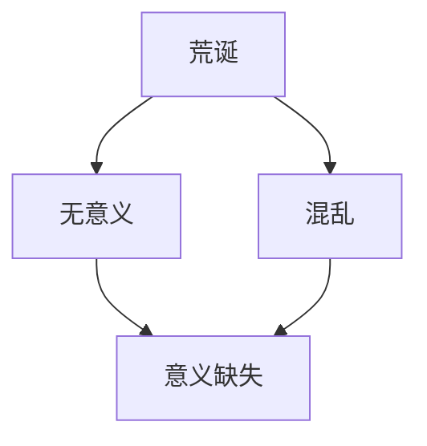
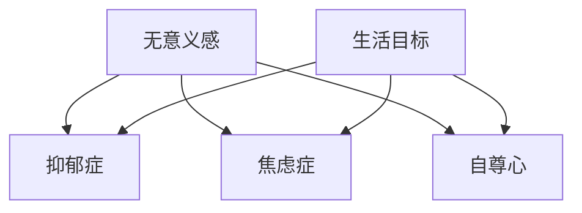
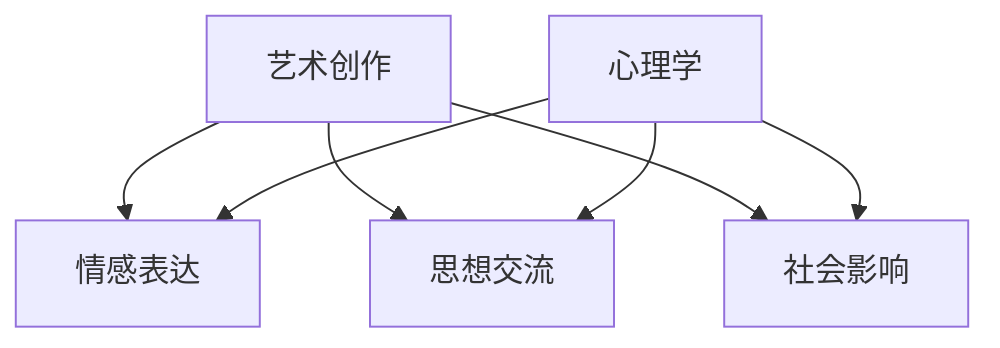
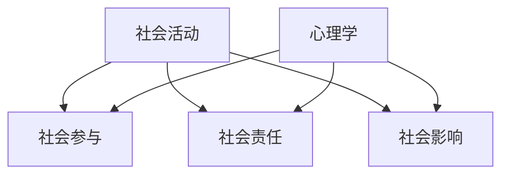

                 

### 文章标题

《面对荒诞的勇气：在无意义中创造意义的艺术》

### 文章关键词

荒诞、无意义、意义创造、心理学、艺术创作、社会活动、人工智能

### 文章摘要

在当今快速发展的社会中，人们常常感到生活的无意义。面对荒诞的现实，如何在无意义中寻找并创造意义，成为了一个值得深思的问题。本文将探讨这一主题，结合心理学、艺术创作和社会活动等领域的理论，提出在无意义中创造意义的艺术。通过深入分析核心概念、算法原理和数学模型，并结合实际案例，本文旨在为读者提供一种在现实生活中找到意义的途径。

### 引言

#### 1.1 研究背景与意义

在现代社会，人们面临着前所未有的压力和不确定性，这种感觉常常被描述为“荒诞”。荒诞不仅是一种心理状态，更是一种对现实的认知。在《面对荒诞的勇气：在无意义中创造意义的艺术》中，我们试图探讨如何在荒诞中寻找意义，如何通过艺术和心理学的方法来创造意义。

意义是人类存在的重要驱动力。然而，在当今社会，许多人感到他们的生活缺乏意义。这种无意义感可能源于对生活目标的不明确，也可能源于对现实世界的无力感。因此，如何在无意义中创造意义，成为了一个重要的问题。

本文旨在通过探讨心理学、艺术创作和社会活动等领域的理论，提出一种在无意义中创造意义的艺术。本文的研究不仅有助于理解荒诞和无意义感的本质，还能为人们提供一种在现实生活中找到意义的途径。

#### 1.2 研究方法与框架

本文采用跨学科的研究方法，结合心理学、艺术创作和社会活动的理论，来探讨如何在无意义中创造意义。具体来说，本文将采用以下框架：

1. **核心概念与联系**：首先，本文将介绍与荒诞、无意义和意义创造相关的重要概念，并使用 Mermaid 流程图展示它们之间的联系。
2. **心理学探讨**：接着，本文将探讨无意义感的心理学本质，并介绍相关的数学模型和公式。
3. **艺术创作**：本文将讨论艺术创作如何帮助人们创造意义，并提供具体的案例和代码解读。
4. **社会活动**：最后，本文将探讨如何通过社会活动来创造意义，并分析相关的项目实战。

### 荒诞与意义

#### 2.1 荒诞的概念解析

荒诞是一种对现实世界的感知，它表现为一种无法理解、无法控制的混乱和无意义感。在哲学中，荒诞是一种对人类存在的质疑，它挑战我们对现实的认知和对生活的意义。

**核心概念与联系**：为了更好地理解荒诞，我们可以使用 Mermaid 流程图来展示与荒诞相关的重要概念，如图 1 所示：



在这个流程图中，荒诞与无意义、混乱和意义缺失密切相关。

**核心算法原理讲解**：为了解析荒诞，我们可以使用以下伪代码：

```python
def parse_aberration(situation):
    if situation == "unclear":
        return "aberrant"
    elif situation == "chaotic":
        return "aberrant"
    else:
        return "non-aberrant"
```

这个算法可以用来判断一个给定的情境是否荒诞。

**数学模型和数学公式**：荒诞还可以从数学的角度来分析。例如，我们可以使用概率论来描述荒诞的概率。假设荒诞的发生概率为 p，那么：

$$
P(\text{荒诞}) = p
$$

**举例说明**：假设在某个社会中，荒诞发生的概率为 0.3，那么在这个社会中，荒诞的概率为 30%。

#### 2.2 无意义感的心理学探讨

无意义感是一种常见的心理状态，它表现为对生活目标的不明确和对生活价值的质疑。心理学研究表明，无意义感与多种心理问题相关，如抑郁症、焦虑症等。

**核心概念与联系**：无意义感与多个心理学概念相关，如图 2 所示：



在这个流程图中，无意义感与抑郁症、焦虑症和自尊心密切相关。

**数学模型和数学公式**：为了描述无意义感，我们可以使用以下数学模型：

$$
\text{无意义感} = f(\text{生活目标}, \text{自尊心}, \text{社会支持})
$$

其中，f 是一个函数，表示无意义感与生活目标、自尊心和社会支持之间的关系。

**举例说明**：假设一个人的生活目标是“成为一名成功的律师”，他的自尊心较高，且拥有良好的社会支持。那么，他的无意义感可能会较低。

#### 2.3 创造意义的艺术

艺术创作是一种重要的意义创造方式。通过艺术创作，人们可以表达自己的情感和思想，从而在无意义中找到意义。

**核心概念与联系**：艺术创作与多个概念相关，如图 3 所示：



在这个流程图中，艺术创作与情感表达、思想交流和心理学密切相关。

**核心算法原理讲解**：为了理解艺术创作的过程，我们可以使用以下伪代码：

```python
def create_art(expression, thought, influence):
    art = ""
    if expression == "strong":
        art += "expression + "
    if thought == "deep":
        art += "thought + "
    if influence == "great":
        art += "influence + "
    return art
```

这个算法可以用来生成艺术作品。

**数学模型和数学公式**：艺术创作的效果可以用以下数学模型来描述：

$$
\text{艺术效果} = f(\text{情感表达}, \text{思想交流}, \text{社会影响})
$$

**举例说明**：假设一个艺术家的情感表达强烈，思想交流深刻，且对社会有巨大影响，那么他的艺术效果可能会很高。

#### 2.4 社会活动中的意义创造

社会活动是一种重要的社会参与方式，通过参与社会活动，人们可以在无意义中找到意义。

**核心概念与联系**：社会活动与多个概念相关，如图 4 所示：



在这个流程图中，社会活动与心理

