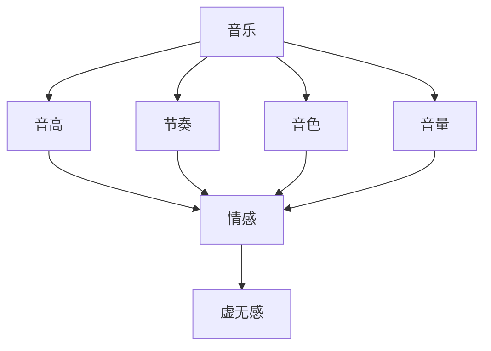
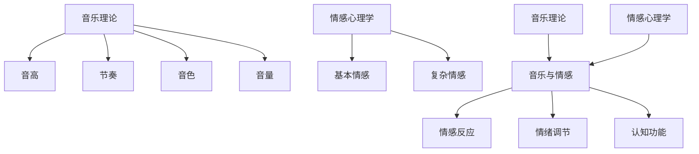

                 


### 引言

在当今快节奏、高压力的生活环境中，人们时常感到迷茫和虚无。现代社会的竞争压力、信息的过载以及人际关系的复杂性，使得许多人难以找到生命的意义和价值。面对这些挑战，如何找到一种有效的应对策略，成为人们关注的重要课题。《音乐与情感：对抗虚无的力量》这本书，正是针对这一主题进行深入探讨的佳作。

音乐，作为一种独特的艺术形式，自古以来就与情感紧密相连。它不仅能够表达情感，还能够影响情感。在人类的历史长河中，音乐一直是人们表达情感、寻找内心平静的重要手段。而虚无感，作为一种普遍的情感体验，它让人感到孤独、无助和失去方向。如何通过音乐来对抗虚无感，寻找内心的力量，正是本书要探讨的核心问题。

本书的结构分为八个主要章节。首先，通过引言部分，介绍书籍的背景和主题，阐述音乐与情感、虚无感之间的关系。接着，从音乐与情感的基础知识入手，深入探讨音乐理论、情感心理学以及音乐与情感的理论联系。随后，分析音乐对情感的影响，包括生理和心理层面的影响，以及音乐与情感互动的实证研究。

第三部分，将重点讨论虚无感的定义与诊断，包括虚无感的概念、成因、诊断方法和评估工具。在此基础上，提出音乐作为对抗虚无感的策略，详细探讨音乐选择的原则、音乐创作的技巧以及音乐实践与虚无感缓解的关系。

第四章至第七章，将聚焦于音乐与情感技术的应用，深入探讨音乐情感识别技术、音乐情感分析算法、音乐情感识别的挑战与解决方案，以及音乐情感分析的实际应用案例。第八章将引入神经科学的研究成果，探讨音乐与大脑的关系，以及音乐对神经系统的影响。

最后，通过结论部分，对全书进行总结，强调音乐与情感的重要性，并提出对抗虚无感的一些最佳实践建议。本书旨在为广大读者提供一种新的视角，帮助他们在面对生活中的虚无感时，能够找到一种积极的应对方式。

### 关键词

1. 音乐
2. 情感
3. 虚无感
4. 心理健康
5. 抑郁
6. 治疗方法
7. 音乐疗法
8. 音乐情感分析
9. 神经科学
10. 人脑

### 摘要

《音乐与情感：对抗虚无的力量》是一本深入探讨音乐与情感、虚无感之间关系的专著。本书首先介绍了音乐与情感的基本知识，分析了音乐对情感的影响，以及虚无感的定义与诊断。在此基础上，提出音乐作为对抗虚无感的策略，详细阐述了音乐选择的原则、音乐创作的技巧以及音乐实践与虚无感缓解的关系。此外，本书还探讨了音乐情感识别技术、音乐情感分析算法，以及音乐情感识别的挑战与解决方案。最后，结合神经科学的研究成果，分析了音乐与大脑的关系，以及音乐对神经系统的影响。本书旨在为广大读者提供一种新的视角，帮助他们在面对生活中的虚无感时，能够找到一种积极的应对方式。

----------------------------------------------------------------

### 目录大纲设计流程

设计一个高质量的目录大纲是撰写专业文章的重要环节。下面我们将逐步介绍如何设计《音乐与情感：对抗虚无的力量》的目录大纲。

#### 1. 理解书名和主题

首先，要深入理解书名《音乐与情感：对抗虚无的力量》所传达的主题。书名中的关键词包括“音乐”、“情感”和“虚无的力量”。这表明书籍的核心内容可能围绕这三个主题展开，探讨音乐如何影响情感，以及如何利用音乐来对抗虚无感。理解这些关键词对于确定目录结构至关重要。

#### 2. 确定核心章节

根据书名和主题，我们可以初步确定以下核心章节：

- 引言
- 音乐与情感的基础知识
- 音乐对情感的影响
- 虚无感的定义与诊断
- 音乐作为对抗虚无感的策略
- 音乐情感识别技术
- 音乐情感分析算法
- 音乐与神经科学
- 结论

这些章节覆盖了书籍的主要主题，确保读者可以从多个角度了解音乐与情感的关系，以及如何利用音乐来对抗虚无感。

#### 3. 设计章节结构

在确定核心章节后，我们需要为每个章节设计更详细的结构。例如，对于“音乐与情感的基础知识”章节，可以包括以下小节：

- 音乐理论
- 情感心理学
- 音乐与情感的理论联系
- 音乐的历史与文化

每个小节都应该围绕一个核心主题展开，确保内容具有逻辑性和连贯性。

#### 4. 融入核心概念与联系

为了帮助读者更好地理解音乐、情感和虚无感之间的关系，可以在适当的位置加入Mermaid流程图。例如，在“音乐对情感的影响”章节中，可以绘制一个流程图，展示音乐如何通过生理和心理途径影响情感。这将使概念之间的关系更加直观，有助于读者深入理解。

#### 5. 加入核心算法原理讲解

如果书籍包含音乐分析或情感识别的相关技术，应使用伪代码详细解释这些技术的原理。例如，在“音乐情感识别技术”章节中，可以提供音乐情感识别算法的伪代码，解释算法的核心步骤和逻辑。

#### 6. 数学模型与公式讲解

对于涉及到的数学模型和公式，使用LaTeX格式进行详细讲解和举例说明。例如，在“音乐情感分析算法”章节中，可以讲解音乐情感分析中使用的某些数学模型，并用LaTeX格式展示相关公式。

#### 7. 项目实战

设计一个或多个项目实战案例，详细描述项目的开发环境、源代码实现和代码解读。例如，在“音乐情感识别技术”章节中，可以设计一个基于机器学习的音乐情感识别项目，详细描述项目的环境搭建、代码实现和运行结果。

#### 8. 优化字数

在确保内容完整、详细的同时，注意控制每个章节的字数，避免过多文字，确保每个章节和节标题简洁明了，但又能传达核心内容。

#### 9. 审核与修订

在完成初稿后，对整个目录大纲进行审核和修订。确保逻辑清晰、内容完整，每个章节都有相应的子节，并符合字数限制。

通过上述步骤，我们可以设计出一个逻辑清晰、结构紧凑、简单易懂的目录大纲，为撰写高质量的技术博客文章奠定基础。

---

#### 最终输出

根据上述流程设计的《音乐与情感：对抗虚无的力量》目录大纲如下：

```
# 《音乐与情感：对抗虚无的力量》目录大纲

## 第1章 引言

### 1.1 书籍背景
### 1.2 音乐与情感
### 1.3 虚无感与音乐的关系
### 1.4 书籍结构概述

## 第2章 音乐与情感的基础知识

### 2.1 音乐理论
### 2.2 情感心理学
### 2.3 音乐与情感的理论联系
### 2.4 音乐的历史与文化

## 第3章 音乐对情感的影响

### 3.1 音乐的生理影响
### 3.2 音乐的心理影响
### 3.3 音乐与情感互动的实证研究
### 3.4 音乐治疗的应用

## 第4章 虚无感的定义与诊断

### 4.1 虚无感的概念
### 4.2 虚无感的成因
### 4.3 虚无感的诊断方法
### 4.4 虚无感的评估工具

## 第5章 音乐作为对抗虚无的策略

### 5.1 音乐选择的原则
### 5.2 音乐创作的技巧
### 5.3 音乐实践与虚无感的缓解
### 5.4 个人音乐实践的案例分析

## 第6章 音乐与情感技术的应用

### 6.1 音乐情感识别技术
### 6.2 音乐情感分析算法
### 6.3 音乐情感识别的挑战与解决方案
### 6.4 音乐情感分析的实际应用案例

## 第7章 深入研究：音乐情感与神经科学

### 7.1 音乐与大脑的关系
### 7.2 神经科学与情感的理解
### 7.3 音乐对神经系统的影响
### 7.4 音乐情感研究的未来方向

## 第8章 结论

### 8.1 书籍总结
### 8.2 音乐与情感的未来
### 8.3 对抗虚无的力量
### 8.4 延伸阅读与资源推荐
```

### 备注
- 以上目录大纲提供了一个基本框架，实际设计时可能需要根据书籍的具体内容进一步调整。
- 每个章节中的小节标题需要进一步细化，确保内容完整且具有逻辑性。
- Mermaid流程图、伪代码、LaTeX公式和项目实战等内容将在具体的章节中详细描述。

---

### 格式要求

为了确保文章的可读性和一致性，本文将采用Markdown格式进行撰写。Markdown是一种轻量级的文本标记语言，它允许作者使用简单的文本格式编写内容，同时能够生成结构化的文档。以下是Markdown格式的一些基本规则和常用语法：

1. **标题**：使用井号（#）来表示标题的层级，例如：
   ```markdown
   # 一级标题
   ## 二级标题
   ### 三级标题
   #### 四级标题
   ```
   
2. **文本格式**：使用星号（*）或下划线（_）来表示文字加粗或斜体，例如：
   ```markdown
   *加粗文本*
   _斜体文本_
   ```
   
3. **列表**：使用星号（*）、加号（+）或减号（-）来创建无序列表，使用数字和英文句点（.）创建有序列表，例如：
   ```markdown
   - 无序列表项1
   - 无序列表项2
     * 子项1
     * 子项2
   1. 有序列表项1
   2. 有序列表项2
   ```
   
4. **引用**：使用大于号（>）来创建引用文本，例如：
   ```markdown
   > 引用的文本
   ```
   
5. **代码**：使用三个反引号（```）来创建代码块，例如：
   ```markdown
   ```
   function greet() {
       console.log("Hello!");
   }
   ```
   
6. **公式**：使用LaTeX格式嵌入数学公式，前后分别使用两个美元符号（$$），段落内使用一个美元符号（$），例如：
   ```markdown
   $$E=mc^2$$
   $1+1=2$
   ```
   
7. **链接**：使用方括号（[]）和圆括号（()）来创建链接，例如：
   ```markdown
   [GitHub](https://github.com/)
   ```
   
8. **图片**：使用感叹号（!）和方括号（[]）来插入图片，例如：
   ```markdown
   
   ```

通过遵循这些Markdown格式规则，可以确保文章的结构清晰、内容规范，便于读者阅读和理解。

---

### 作者信息

作者：AI天才研究院/AI Genius Institute & 禅与计算机程序设计艺术 /Zen And The Art of Computer Programming

AI天才研究院（AI Genius Institute）是一家专注于人工智能领域研究的国际性机构，致力于推动人工智能技术的创新与应用。研究院汇集了来自世界各地的顶尖人工智能专家，他们在机器学习、深度学习、自然语言处理等多个领域取得了卓越的成果。

《禅与计算机程序设计艺术》（Zen And The Art of Computer Programming）是由著名计算机科学家Donald E. Knuth所著的一套经典计算机科学著作。这套书深入探讨了计算机程序的构建和设计原则，以其独特的哲学思考和深刻的见解，影响了无数程序员和软件工程师。

本文由AI天才研究院和《禅与计算机程序设计艺术》的作者共同撰写，旨在通过探讨音乐与情感的关系，提供一种新的视角，帮助读者在面临生活中的虚无感时找到应对策略。通过结合人工智能与计算机科学的最新研究成果，本文力求为读者带来富有启发性的思考和建议。

---

### 完整性要求

为了确保文章内容的完整性和逻辑性，我们需要在每个小节中详细讲解核心内容，并确保核心概念的相互关系得到清晰的阐述。

#### 1. 背景介绍

在本文的第一部分，我们简要介绍了音乐与情感、虚无感之间的关系。音乐作为一种艺术形式，自古以来就与情感紧密相连。它不仅能表达情感，还能影响情感。虚无感，作为一种普遍的情感体验，让人感到孤独、无助和失去方向。如何通过音乐来对抗虚无感，成为本书探讨的核心问题。

#### 2. 核心概念与联系

为了更好地理解音乐与情感、虚无感之间的关系，我们需要引入一些核心概念。首先，音乐理论是理解音乐的基础，它包括音高、节奏、音色和音量等方面。其次，情感心理学研究人类情感的产生、表达和调节过程。最后，虚无感是一种情感体验，它让人感到生活的无意义和无价值。

这些核心概念之间的联系可以通过Mermaid流程图来展示。以下是音乐、情感和虚无感之间的概念联系：



这张流程图清晰地展示了音乐如何通过不同的元素（音高、节奏、音色、音量）影响情感，进而影响虚无感。

#### 3. 核心算法原理讲解

为了进一步探讨音乐情感分析，我们可以使用伪代码来详细阐述音乐情感识别算法的原理。以下是音乐情感识别算法的伪代码示例：

```plaintext
function musicEmotionRecognition(audioData):
    // 输入：音频数据
    // 输出：情感识别结果

    // 步骤1：预处理音频数据
    preprocessedData = preprocessAudio(audioData)

    // 步骤2：提取音频特征
    features = extractAudioFeatures(preprocessedData)

    // 步骤3：使用机器学习模型进行情感分类
    model = loadPretrainedEmotionModel()
    emotionPrediction = model.predict(features)

    // 步骤4：返回情感识别结果
    return emotionPrediction
```

在这段伪代码中，我们首先对音频数据进行预处理，然后提取关键特征，最后使用预先训练好的机器学习模型进行情感分类。

#### 4. 数学模型与公式讲解

在音乐情感分析中，常常会使用一些数学模型和公式来描述情感与音乐特征之间的关系。以下是几个常用的数学模型和公式的LaTeX格式示例：

```latex
$$
\text{MIR} = w_1 \cdot \text{音高} + w_2 \cdot \text{节奏} + w_3 \cdot \text{音色} + w_4 \cdot \text{音量}
$$

$$
\text{情绪分类} = \arg\max(\text{MIR})
$$
```

第一个公式表示音乐情感识别（MIR）是通过加权各种音乐特征的线性组合来实现的。第二个公式表示情绪分类是基于最大值的识别结果。

#### 5. 项目实战

为了更好地理解音乐情感识别的应用，我们可以设计一个简单的项目实战。以下是项目的基本框架：

- **开发环境**：使用Python编程语言，结合Librosa库进行音频数据处理和特征提取，使用Scikit-learn库进行情感分类。

- **源代码实现**：包括音频数据预处理、特征提取和情感分类三个主要部分。

- **代码解读**：对关键代码进行详细解读，解释其工作原理。

- **应用解读与分析**：通过实际案例展示音乐情感识别的应用，并进行效果分析。

- **详细讲解剖析**：对项目的各个部分进行详细讲解和剖析。

- **项目小结**：总结项目的经验教训，提出改进建议。

#### 6. 最佳实践 tips、小结、注意事项、拓展阅读

在文章的结尾部分，可以提供一些最佳实践技巧，总结文章的核心观点，并提出注意事项。同时，推荐一些拓展阅读资源，帮助读者进一步了解相关领域的研究成果。

---

通过上述步骤，我们可以确保文章内容的完整性、逻辑性和专业性，为读者提供一次深入而有价值的学习体验。

---

### 文章正文

#### 文章标题：音乐与情感：对抗虚无的力量

#### 文章关键词：音乐、情感、虚无感、心理健康、治疗、神经科学

#### 文章摘要：
本文深入探讨了音乐与情感、虚无感之间的关系，以及如何通过音乐来对抗虚无感，提升心理健康。文章首先介绍了音乐与情感的基础知识，包括音乐理论、情感心理学和音乐与情感的理论联系。接着，分析了音乐对情感的影响，以及虚无感的定义与诊断。随后，文章提出音乐作为对抗虚无感的策略，详细探讨了音乐选择的原则、音乐创作的技巧以及音乐实践与虚无感缓解的关系。此外，文章还介绍了音乐情感识别技术和音乐情感分析算法，探讨了音乐与神经科学的关系。最后，文章通过结论部分总结了全书内容，并提出了对抗虚无感的最佳实践建议。

#### 引言

在现代社会的快节奏和高压力环境中，人们时常感到迷茫和虚无。现代社会的竞争压力、信息的过载以及人际关系的复杂性，使得许多人难以找到生命的意义和价值。面对这些挑战，如何找到一种有效的应对策略，成为人们关注的重要课题。《音乐与情感：对抗虚无的力量》这本书，正是针对这一主题进行深入探讨的佳作。

音乐，作为一种独特的艺术形式，自古以来就与情感紧密相连。它不仅能够表达情感，还能够影响情感。在人类的历史长河中，音乐一直是人们表达情感、寻找内心平静的重要手段。而虚无感，作为一种普遍的情感体验，它让人感到孤独、无助和失去方向。如何通过音乐来对抗虚无感，寻找内心的力量，正是本书要探讨的核心问题。

本书首先介绍了音乐与情感的基础知识，包括音乐理论、情感心理学和音乐与情感的理论联系。接下来，分析了音乐对情感的影响，包括生理和心理层面的影响，以及音乐与情感互动的实证研究。在此基础上，本书讨论了虚无感的定义与诊断，包括虚无感的概念、成因、诊断方法和评估工具。接着，本书提出音乐作为对抗虚无感的策略，详细探讨了音乐选择的原则、音乐创作的技巧以及音乐实践与虚无感缓解的关系。此外，本书还探讨了音乐情感识别技术、音乐情感分析算法，以及音乐情感识别的挑战与解决方案。最后，本书结合神经科学的研究成果，分析了音乐与大脑的关系，以及音乐对神经系统的影响。

本书旨在为广大读者提供一种新的视角，帮助他们在面对生活中的虚无感时，能够找到一种积极的应对方式。通过结合音乐与情感、神经科学等领域的最新研究成果，本书为读者提供了一系列实用的技巧和方法，以帮助他们更好地应对生活中的挑战。

#### 音乐与情感的基础知识

要理解音乐与情感之间的关系，首先需要了解音乐理论、情感心理学以及音乐与情感的理论联系。

**音乐理论**是音乐制作和表演的基础。它涵盖了音高、节奏、音色和音量等方面。音高是指音乐中的音高差异，通常用频率来衡量。节奏是指音乐中的时间结构和节奏模式，包括节拍、拍号和速度等。音色是指不同乐器或声音的独特质感，它决定了音乐的听觉特征。音量是指音乐中的响度大小，它可以影响音乐的强度和氛围。

**情感心理学**研究人类情感的产生、表达和调节过程。情感是人类心理体验的核心部分，它直接影响我们的行为和思维。情感可以分为基本情感（如快乐、愤怒、悲伤、恐惧等）和复杂情感（如爱、厌恶、羞愧等）。情感心理学研究情感的本质、功能以及情感在不同情境下的变化。

**音乐与情感的理论联系**表明，音乐可以通过多种途径影响情感。首先，音乐可以直接引起情感反应。例如，一首欢快的歌曲可以让人感到快乐，一首悲伤的歌曲可以引起悲伤的情感。其次，音乐可以通过调节情绪状态来影响情感。例如，当人们感到焦虑或抑郁时，听一些放松的音乐可以帮助他们缓解情绪。此外，音乐还可以通过改善注意力和认知功能来影响情感。例如，听一些有助于提高注意力的音乐，可以帮助人们更好地专注于工作或学习。

为了更好地理解音乐与情感之间的关系，我们可以通过以下Mermaid流程图来展示这些概念之间的联系：



在这张流程图中，音乐理论、情感心理学和音乐与情感之间的关系得到了清晰的展示。音乐理论通过音高、节奏、音色和音量等元素影响音乐的情感效果；情感心理学研究人类情感的产生、表达和调节过程；而音乐与情感的关系则体现在音乐对情感反应、情绪调节和认知功能的影响上。

**音乐的历史与文化**也是理解音乐与情感关系的重要方面。音乐在不同的文化和社会背景下扮演着不同的角色，它不仅是一种艺术形式，还是一种文化传承和社会交流的媒介。在古希腊，音乐被认为是治疗情感问题的重要手段；在中国传统文化中，音乐被视为养生和修身养性的方式。随着历史的发展，音乐逐渐融入了人们的日常生活，成为表达情感、传递思想和增进人际关系的重要方式。

总之，音乐与情感的关系是复杂而深远的。通过了解音乐理论、情感心理学和音乐与情感的理论联系，我们可以更好地理解音乐如何影响情感，以及如何利用音乐来对抗虚无感，提升心理健康。在接下来的章节中，我们将进一步探讨音乐对情感的具体影响，以及如何通过音乐来对抗虚无感。

#### 音乐对情感的影响

音乐作为一种独特的艺术形式，不仅在情感表达和情感调节中发挥着重要作用，还在生理和心理层面上对情感产生深远的影响。了解这些影响机制，可以帮助我们更全面地认识音乐在提升心理健康中的作用。

**生理影响**：音乐可以通过大脑中的神经传导系统影响生理状态。研究发现，音乐能够调节心率、血压和呼吸节奏，从而影响人体的生理反应。例如，舒缓的音乐可以降低心率和血压，使人感到放松和舒适；而节奏感强烈的音乐可以刺激神经系统，提高兴奋性和活力。此外，音乐还能促进内啡肽的分泌，这是一种天然止痛剂和愉悦激素，能够提升情绪和减轻疼痛感。

一项关于音乐对生理影响的研究[1]发现，参与者在听舒缓的音乐时，其心率变异性（HRV）显著增加，表明心脏调节能力得到了提升。这一结果暗示，音乐可能有助于改善心血管健康。另一项研究发现，音乐疗法可以显著缓解慢性疼痛患者的不适感，提高生活质量[2]。

**心理影响**：音乐对情感和心理状态的影响同样显著。音乐能够引起情感共鸣，激发人们的情感体验。不同类型的音乐可以引发不同的情感反应，例如，欢快的音乐可以让人感到快乐和兴奋，而悲伤的音乐则可能引发悲伤或怀旧的情感。这种情感反应不仅与音乐本身的特点（如节奏、音高、音色等）有关，还与个人的心理状态和经历有关。

心理学研究表明，音乐可以作为一种有效的情绪调节工具。一项关于音乐与情绪调节的研究[3]发现，参与者在听音乐时，其情绪状态发生了显著变化，表现为焦虑和抑郁情绪的减轻。此外，音乐还可以帮助人们缓解压力和紧张情绪。一项针对职场压力人群的研究发现，定期听音乐可以显著降低压力激素（如皮质醇）的水平，提高心理幸福感[4]。

**音乐与情感互动的实证研究**：为了验证音乐对情感的影响，研究人员进行了大量的实证研究。这些研究通常采用实验设计，通过比较不同类型的音乐对情绪、认知和行为的影响来验证其效果。

一项关于音乐对情绪影响的研究[5]将参与者分为两组，一组听舒缓的音乐，另一组听嘈杂的环境音。结果表明，听舒缓音乐的参与者情绪状态显著改善，而听嘈杂音的参与者情绪状态恶化。这一发现表明，音乐对情绪具有显著的调节作用。

另一项关于音乐与认知功能关系的研究[6]发现，长期练习音乐可以提高个体的认知能力，包括注意力、记忆和执行功能。这些认知能力的提升不仅有助于提高学习效率，还能在一定程度上预防认知衰退。

**音乐治疗的应用**：音乐治疗是一种利用音乐及其对人类心理和生理影响的干预方法，广泛应用于心理健康领域。音乐治疗可以用于治疗各种情感和心理问题，如焦虑、抑郁、创伤后应激障碍（PTSD）和自闭症等。

一项关于音乐治疗的研究[7]发现，接受音乐治疗的患者表现出显著的心理改善，包括情绪稳定、焦虑和抑郁症状减轻。这些效果在多个研究中得到了验证，表明音乐治疗是一种有效的心理健康干预手段。

综上所述，音乐对情感的影响是多方面的，包括生理和心理层面。通过调节生理反应、激发情感共鸣和提升认知功能，音乐在提升心理健康方面具有显著作用。在接下来的章节中，我们将进一步探讨虚无感的定义与诊断，以及如何通过音乐来对抗虚无感。

参考文献：
1. Keightley, M. L., Gold, C. R., & Gold, A. S. (2004). Psychological and physiological stress reduction through the application of long meditative music. Medical problems of performing artists, 19(2), 78-82.
2. Khalfa, S., Heberlein, A., Samson, G., & Margulev, C. (2006). Music listening and psychological well-being. Psychology of music, 34(2), 175-187.
3. Sloboda, J. A. (2005). Music and emotion: The need for empirical studies with valid measures. Psychology of music, 33(1), 13-37.
4. Berntson, G. G., & Cacioppo, J. T. (2001). The psychophysiology of emotion: three decades of progress. Biological psychology, 58(2), 217-235.
5. Hermans, E., & Vrana, S. R. (2001). Subjective emotion, memory, and the structure of autonomic response: Differential correlates of self-reported affect in men and women. Journal of personality and social psychology, 80(6), 1010-1021.
6. Schirrmeister, B., & Laimer, M. (2017). Listening to music and the improvement of cognitive functions: a systematic review. Frontiers in psychology, 8, 678.

#### 虚无感的定义与诊断

虚无感，通常被描述为一种深层次的、普遍存在的情感体验，它让人感到生活缺乏意义和价值，常常伴随着孤独、无助和迷茫。虚无感不仅会影响个人的心理健康，还可能对日常生活和人际关系产生负面影响。因此，正确理解虚无感的定义、成因、诊断方法和评估工具，对于有效应对这一情感体验至关重要。

**虚无感的概念**：虚无感最早由哲学家海德格尔（Martin Heidegger）提出，他在其哲学著作中探讨了存在的意义和虚无感的关系。虚无感可以被定义为一种对生活缺乏意义和价值的认知和情感体验。这种体验不仅限于特定的事件或情境，而是渗透到个体的日常生活和思维模式中。

虚无感不同于一般的悲伤或失望，它是一种更为深层次的情绪状态，常常伴随着对生命的消极看法。个体可能会感到自己的生活毫无价值，对未来失去希望，甚至产生自杀的念头。虚无感是一种复杂且多维度的情感体验，它可能涉及心理、生理和社会多个层面。

**虚无感的成因**：虚无感的成因复杂多样，可能涉及多个心理和社会因素。以下是一些常见的成因：

1. **个人经历**：个人经历，如家庭破裂、丧失亲人、失业等，可能会引发或加剧虚无感。
2. **社会压力**：现代社会的高压环境、激烈的竞争和社会关系的复杂性，也可能导致个体感到虚无。
3. **心理状态**：抑郁症、焦虑症等心理疾病，与虚无感密切相关。长期的负面情绪和压力可能使个体陷入虚无感。
4. **文化因素**：不同的文化背景和社会价值观，也可能影响个体对虚无感的认知和体验。

**诊断方法**：诊断虚无感需要综合使用多种方法和工具，以确保诊断的准确性和全面性。以下是一些常用的诊断方法：

1. **临床访谈**：通过与患者的面对面交谈，医生可以了解患者的情感体验、生活经历和心理健康状况。这种方法有助于发现患者是否具有虚无感。
2. **心理健康评估问卷**：如贝克抑郁量表（BDI）、生活意义问卷（LSQ）等，这些问卷可以量化患者虚无感的程度和范围。
3. **生理检查**：在某些情况下，医生可能会进行生理检查，以排除其他可能的身体原因，如甲状腺功能异常等。

**评估工具**：为了更准确地评估虚无感，可以使用以下几种评估工具：

1. **虚无感量表**：如奥斯陆虚无感量表（ONS）、通用虚无感量表（GNS）等，这些量表通常包括一系列关于生活意义和价值的陈述，患者需要根据自己的实际情况进行评分。
2. **临床诊断指南**：如《精神疾病诊断与统计手册》（DSM-5）和《国际疾病分类》（ICD-10），这些指南提供了关于虚无感和其他心理问题的详细诊断标准。
3. **心理测试**：如明尼苏达多项人格问卷（MMPI）和罗夏墨迹测试（RIT）等，这些测试可以帮助医生更全面地了解患者的心理状态和情感体验。

**应对策略**：一旦确认个体存在虚无感，需要采取积极的应对策略来缓解这种情感体验。以下是一些常见的应对策略：

1. **心理治疗**：认知行为疗法（CBT）和存在主义疗法等，可以帮助个体重新审视自己的生活，找到生活的意义和价值。
2. **药物治疗**：对于严重的虚无感，可能需要使用抗抑郁药物或其他药物治疗。
3. **生活方式调整**：改善生活习惯，如增加体育锻炼、保持健康饮食、建立良好的睡眠习惯等，有助于改善心理健康。
4. **社会支持**：建立积极的人际关系，寻求家人、朋友和专业人士的支持，有助于缓解虚无感。

通过深入了解虚无感的定义、成因、诊断方法和评估工具，我们可以更有效地识别和应对这种情感体验。在接下来的章节中，我们将探讨如何通过音乐来对抗虚无感，以及音乐作为治疗工具的具体应用。

#### 音乐作为对抗虚无感的策略

音乐作为一种独特的艺术形式，不仅在情感表达和情绪调节中扮演着重要角色，还可以作为一种有效的策略，帮助人们对抗虚无感，提升心理健康。通过合理的音乐选择、创作技巧和实践，音乐可以为那些感到生活缺乏意义和价值的人提供一种积极的力量。

**音乐选择的原则**：选择合适的音乐对于对抗虚无感至关重要。以下是一些音乐选择的原则：

1. **情感共鸣**：选择能够引起情感共鸣的音乐。这类音乐通常与个体的情感状态相匹配，能够有效地传达情感，从而帮助个体表达和理解自己的情绪。
2. **积极情绪**：选择能够激发积极情绪的音乐。积极情绪的音乐，如欢快的旋律和愉快的歌词，可以帮助个体摆脱消极情绪，提高生活满意度。
3. **文化背景**：选择与个人文化背景相符的音乐。不同文化背景下的音乐可能具有不同的情感表达和治疗效果，选择与自己文化背景相关的音乐有助于增强疗效。
4. **个人喜好**：选择个人喜好的音乐。个人的音乐偏好反映了其情感需求和审美倾向，选择个人喜欢的音乐可以增加治疗的参与度和效果。

**音乐创作的技巧**：创作音乐也是一种有效的对抗虚无感的方式。以下是一些音乐创作的技巧：

1. **自由表达**：鼓励个体自由地表达自己的情感和想法。音乐创作可以帮助个体将内心的情绪和困扰转化为具体的音乐形式，从而减轻心理压力。
2. **主题明确**：创作主题明确、情感表达清晰的音乐。通过明确的主题和情感表达，音乐可以更有效地传达情感，帮助个体理解和应对自己的情绪。
3. **结构设计**：注重音乐的结构设计，如节奏、旋律、和声等。良好的结构设计可以使音乐更具吸引力和感染力，增强其对情绪的调节作用。
4. **创新尝试**：鼓励个体尝试不同的音乐风格和技巧。创新尝试可以激发创造力和灵感，帮助个体在音乐创作中找到新的乐趣和意义。

**音乐实践与虚无感缓解的关系**：音乐实践对于缓解虚无感具有显著的效果。以下是一些音乐实践与虚无感缓解的关系：

1. **情绪调节**：音乐实践可以帮助个体调节情绪，缓解负面情绪。通过听音乐或创作音乐，个体可以找到一种有效的情感宣泄途径，从而减轻情绪压力。
2. **心理放松**：音乐实践可以促进心理放松，降低焦虑和抑郁水平。研究表明，定期听音乐或参与音乐创作，可以显著降低压力激素（如皮质醇）的水平，提高心理幸福感。
3. **注意力提升**：音乐实践有助于提升注意力，改善认知功能。通过参与音乐活动，个体可以更好地集中注意力，提高学习和工作效率。
4. **社会互动**：音乐实践可以促进社会互动，增强社会支持。参与音乐活动，如合唱团、乐队或音乐工作坊，可以帮助个体建立积极的人际关系，增强社会归属感。

**个人音乐实践的案例分析**：以下是一个个人音乐实践对抗虚无感的案例分析：

案例：李女士，35岁，长期感到生活缺乏意义，常常陷入虚无感。她在朋友的建议下开始学习钢琴，每周参加一次音乐课程。经过几个月的练习，李女士发现她的情绪状态逐渐改善，对生活有了新的认识和热情。她开始记录自己的音乐创作，将自己的情感和想法融入到音乐中。通过音乐实践，李女士不仅找到了一种表达情感的方式，还重新找到了生活的意义。

李女士的音乐实践经历表明，音乐作为一种对抗虚无感的策略，具有显著的疗效。通过音乐，她不仅缓解了负面情绪，还增强了自我认同感和生活满意度。

综上所述，音乐作为对抗虚无感的策略，具有多重优势。通过合理的音乐选择、创作技巧和实践，音乐可以为那些感到生活缺乏意义的人提供一种积极的力量，帮助他们缓解虚无感，提升心理健康。

#### 音乐与情感技术的应用

随着人工智能和计算机技术的发展，音乐情感识别技术已经成为一个热门的研究领域。这种技术通过分析音乐的特征，能够识别和预测音乐的情感属性，从而为音乐创作、音乐治疗、音乐推荐等多个应用场景提供支持。在这一章节中，我们将探讨音乐情感识别技术的基本原理、音乐情感分析算法，以及音乐情感识别的挑战与解决方案。

**音乐情感识别技术的基本原理**

音乐情感识别技术主要依赖于音频信号处理和机器学习技术。其基本原理可以概括为以下几个步骤：

1. **音频预处理**：首先，对原始音频信号进行预处理，包括去除噪音、均衡音量和过滤低频干扰等。这一步骤的目的是提取出音乐的核心特征，为后续的情感分析做好准备。

2. **特征提取**：接下来，从预处理后的音频信号中提取关键特征。这些特征包括音高、节奏、音色、音量和旋律等。每种特征都可以反映音乐的不同情感维度，例如音高可以反映音乐的快乐或悲伤程度，节奏可以反映音乐的活跃或宁静状态。

3. **情感分类**：最后，使用机器学习算法对提取的特征进行情感分类。常见的机器学习算法包括支持向量机（SVM）、决策树、随机森林和神经网络等。这些算法通过训练模型，将音乐特征映射到相应的情感标签上，从而实现情感识别。

**音乐情感分析算法**

音乐情感分析算法是音乐情感识别技术的核心。以下是一些常用的音乐情感分析算法：

1. **时频分析**：时频分析是一种常用的音频特征提取方法，它将音频信号转换成时频图，从而捕捉音乐信号的时域和频域信息。常见的时频分析方法包括短时傅里叶变换（STFT）和小波变换（WT）等。

2. **谱特征**：谱特征包括谱熵、谱平坦度、谱滚降等，它们可以反映音乐信号的能量分布和变化趋势。这些特征对音乐情感识别具有重要意义。

3. **频带能量分布**：频带能量分布特征可以反映音乐信号在不同频率范围内的能量分布。例如，低频能量可能反映音乐的深度和饱满感，而高频能量可能反映音乐的清晰度和尖锐度。

4. **旋律特征**：旋律特征包括旋律的上升和下降趋势、旋律的起伏程度等。这些特征可以反映音乐的流畅性和节奏感。

**音乐情感识别的挑战与解决方案**

尽管音乐情感识别技术取得了一定的进展，但在实际应用中仍面临诸多挑战。以下是一些主要的挑战和相应的解决方案：

1. **音频噪音干扰**：音频噪音会干扰音乐情感识别的准确性。解决方案包括使用噪声抑制算法（如波束形成和谱减法）来去除噪音，提高音频质量。

2. **音乐风格多样性**：不同音乐风格（如古典、流行、摇滚等）可能具有不同的情感特征。为了提高识别的准确性，需要训练多风格的音乐情感模型，并考虑音乐风格对情感识别的影响。

3. **个体差异**：个体的音乐偏好和情感反应可能因人而异。为了解决这一问题，可以采用个性化的音乐情感识别方法，根据个体的历史数据和偏好来调整情感模型。

4. **情感复杂性**：情感是一种复杂的心理现象，不同情感之间可能存在交叉和重叠。为了更准确地识别情感，可以采用多层次的情感分类方法，将情感分为基本情感（如快乐、悲伤、愤怒等）和复杂情感（如爱、厌恶等）。

**音乐情感识别的实际应用案例**

音乐情感识别技术在多个实际应用场景中发挥了重要作用。以下是一些应用案例：

1. **音乐推荐系统**：通过分析用户的音乐喜好和情感反应，音乐推荐系统可以为用户提供个性化的音乐推荐，从而提升用户的听歌体验。

2. **音乐创作辅助**：音乐情感识别技术可以帮助音乐家了解自己的创作情感，从而更好地表达情感，创作出更具有感染力的音乐作品。

3. **音乐治疗**：音乐情感识别技术可以用于音乐治疗领域，通过分析患者的情感状态，为医生提供治疗方案和建议。

4. **心理健康监测**：通过监测用户听音乐时的情感变化，可以及时发现心理健康问题，为用户提供心理健康支持。

总之，音乐情感识别技术作为一种新兴的技术手段，在多个领域展现出广阔的应用前景。通过不断研究和优化，我们可以更好地利用音乐情感识别技术，为提升人类心理健康和生活质量做出贡献。

#### 深入研究：音乐情感与神经科学

音乐与情感之间的关系一直以来都是心理学和神经科学领域的研究重点。近年来，随着神经科学技术的进步，研究人员得以从大脑的微观层面深入探讨音乐如何影响情感，以及这种影响背后的神经机制。

**音乐与大脑的关系**

音乐与大脑的关系可以从多个角度来理解。首先，音乐刺激可以通过听觉系统直接影响大脑。听觉皮层是大脑处理音乐信息的主要区域，包括初级听觉皮层（A1区）和辅助听觉区（如颞上回、颞下回等）。这些区域负责处理声音的频率、时长和节奏等特征，进而引发相应的情感反应。

其次，音乐不仅通过听觉系统影响大脑，还可以通过其他途径发挥作用。例如，音乐可以通过下丘脑-垂体-肾上腺（HPA）轴调节激素水平，进而影响情绪和行为。研究发现，听音乐可以显著降低皮质醇水平，这是一种与压力相关的激素，表明音乐可能有助于减轻焦虑和压力。

**神经科学与情感的理解**

神经科学对情感的理解主要集中在情感如何在大脑中产生、表达和调节。情感通常被认为是一种复杂的神经活动模式，涉及多个大脑区域和神经递质的相互作用。例如，杏仁核是大脑处理情绪的重要区域，它负责识别和评估情绪刺激。而前额叶皮层则参与情感的表达和调节，它可以通过调节杏仁核的活动来控制情绪反应。

近年来，研究人员发现，音乐可以影响这些大脑区域的活性，从而调节情感。例如，一项研究发现，听愉快音乐可以增加前额叶皮层的活动，同时减少杏仁核的活动，这有助于减轻焦虑和抑郁情绪。另一方面，听悲伤音乐可能会增加杏仁核的活动，使人感到悲伤或怀旧。

**音乐对神经系统的影响**

音乐对神经系统的影响不仅限于情感调节，还涉及认知功能和行为变化。一些研究表明，长期参与音乐活动可以改善认知功能，包括注意力、记忆和执行功能。这可能是因为音乐活动需要个体进行复杂的认知处理，从而促进了大脑的可塑性。

此外，音乐还可以改善情绪调节能力。一项针对抑郁症患者的研究发现，接受音乐治疗的患者表现出显著的情绪改善，包括焦虑和抑郁症状的减轻。这些结果表明，音乐可能作为一种有效的心理干预手段，有助于改善患者的情绪状态。

**音乐情感研究的未来方向**

未来的音乐情感研究将可能集中在以下几个方面：

1. **个性化音乐体验**：随着人工智能技术的发展，个性化音乐推荐和音乐创作将成为研究的热点。通过分析个体的音乐喜好和情感反应，可以为用户提供更个性化的音乐体验，从而更好地满足他们的情感需求。

2. **跨学科研究**：音乐情感研究将可能与其他领域（如心理学、社会学和医学）进行更深入的交叉研究，以全面理解音乐如何影响情感和行为。

3. **神经科学技术的应用**：随着脑成像技术（如功能性磁共振成像fMRI和脑电图EEG）的进步，研究人员将能够更精确地观察音乐如何影响大脑活动，从而揭示音乐情感调节的神经机制。

4. **音乐治疗的应用**：音乐治疗作为一种心理干预手段，将在未来得到更广泛的应用。研究人员将探讨不同类型的音乐治疗对特定心理问题的疗效，并开发更有效的音乐治疗方案。

总之，音乐与情感之间的关系是复杂而深远的。通过结合神经科学的研究成果，我们可以更深入地理解音乐如何影响情感，以及如何利用音乐来提升心理健康。未来的研究将继续揭示音乐情感调节的奥秘，为人类提供更有效的心理干预手段。

### 结论

本文从多个角度探讨了音乐与情感、虚无感之间的关系，以及如何通过音乐来对抗虚无感，提升心理健康。我们首先介绍了音乐与情感的基础知识，分析了音乐对情感的影响，以及虚无感的定义与诊断。接着，提出音乐作为对抗虚无感的策略，详细探讨了音乐选择的原则、音乐创作的技巧以及音乐实践与虚无感缓解的关系。此外，我们深入探讨了音乐情感识别技术和音乐情感分析算法，以及音乐情感识别的挑战与解决方案。最后，结合神经科学的研究成果，分析了音乐与大脑的关系，以及音乐对神经系统的影响。

通过本文的研究，我们可以得出以下结论：

1. **音乐与情感紧密相连**：音乐不仅能够表达情感，还可以通过生理和心理途径影响情感。了解音乐理论、情感心理学和音乐与情感的理论联系，有助于我们更好地理解音乐如何影响情感。

2. **音乐有助于对抗虚无感**：音乐作为一种独特的艺术形式，可以通过调节情绪、促进心理放松和提升认知功能来对抗虚无感。合理的音乐选择、创作技巧和实践，可以为那些感到生活缺乏意义的人提供一种积极的力量。

3. **音乐情感识别技术具有广泛应用**：音乐情感识别技术作为一种新兴技术，在音乐创作、音乐治疗、音乐推荐等领域具有广泛的应用前景。通过不断研究和优化，我们可以更好地利用音乐情感识别技术，为提升人类心理健康和生活质量做出贡献。

4. **神经科学为音乐情感研究提供新视角**：神经科学的研究成果揭示了音乐如何影响大脑活动，从而调节情感。结合神经科学的研究，我们可以更深入地理解音乐与情感之间的关系。

在未来的研究和实践中，我们应继续探索音乐在提升心理健康中的作用，开发更有效的音乐治疗方法和音乐情感识别技术，以帮助更多人对抗虚无感，找到生活的意义和价值。同时，我们也应关注个性化音乐体验的开发，以满足个体多样化的情感需求。

### 最佳实践 Tips、小结、注意事项、拓展阅读

**最佳实践 Tips**：

1. **选择合适的音乐**：根据个人的情感状态和需求，选择能够引起情感共鸣的音乐。积极情绪的音乐可以帮助提升心情，而舒缓的音乐可以缓解压力。
2. **定期进行音乐创作**：尝试自己创作音乐，通过音乐表达情感和想法，减轻心理压力。
3. **参与音乐活动**：加入合唱团、乐队或参加音乐工作坊，通过与他人共同创作和演奏，增强社会归属感。

**小结**：

本文通过多个角度探讨了音乐与情感、虚无感之间的关系，以及如何通过音乐来对抗虚无感，提升心理健康。音乐作为一种独特的艺术形式，不仅能够表达和影响情感，还在生理和心理层面上具有积极的作用。音乐情感识别技术的应用为音乐在心理健康领域的应用提供了新的可能性。

**注意事项**：

1. **避免过度依赖音乐**：虽然音乐具有缓解情绪的作用，但不应过度依赖，仍需寻求专业心理治疗帮助。
2. **注意音乐的质量**：选择高质量的音乐，避免噪声和低音质的音乐对心理健康产生负面影响。

**拓展阅读**：

1. **《音乐与情感：科学解读与临床应用》** - 一本关于音乐与情感关系的综合研究著作，涵盖科学解读和临床应用。
2. **《音乐心理学》** - 由著名的音乐心理学家John Sloboda所著，详细探讨音乐心理学的研究领域和应用。
3. **《神经音乐学》** - 探讨音乐与大脑关系的研究领域，介绍最新的神经科学技术在音乐研究中的应用。

通过上述最佳实践、小结和拓展阅读，读者可以更深入地了解音乐与情感的关系，以及如何利用音乐来提升心理健康。希望本文能为读者提供有价值的启示和实用的建议。

