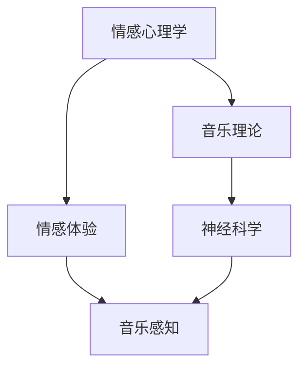
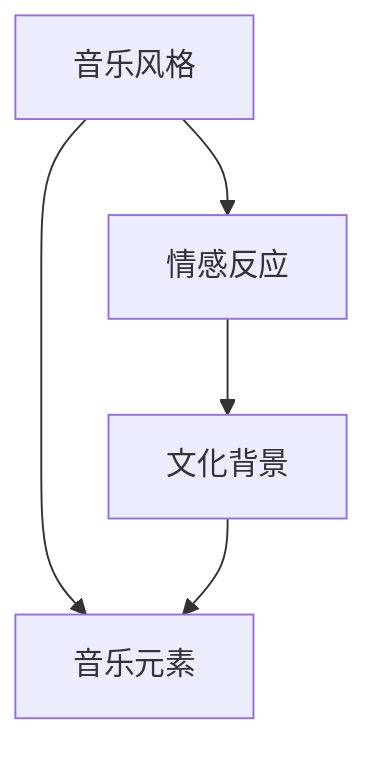
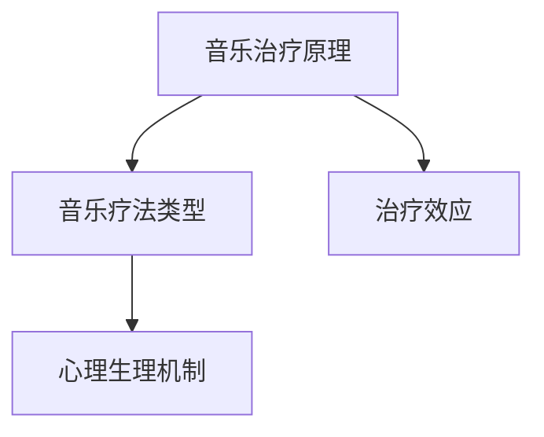

                 


### 2.1.1 情感与音乐的互动

#### 背景介绍
音乐是一种独特的艺术形式，它通过声音的节奏、旋律、和声等元素，与人类的情感世界产生深刻的互动。从古代的宗教仪式到现代的流行音乐，音乐一直伴随着人类的生活，并成为表达情感和传递信息的重要手段。然而，音乐是如何影响情感的，这是一个复杂而有趣的问题。

#### 核心概念与联系
在探讨音乐与情感的关系时，我们需要引入几个核心概念：

1. **情感心理学**：情感心理学研究情感的产生、体验和表达。它涉及到情绪的种类、情感的过程以及情感与认知、行为之间的相互作用。
2. **音乐理论**：音乐理论包括对音乐元素（如节奏、旋律、和声）的研究，以及它们如何组合成具有情感表达力的音乐作品。
3. **神经科学**：神经科学帮助我们理解大脑如何对音乐刺激做出反应，以及音乐如何影响大脑的化学和电信号。

**Mermaid流程图**：


#### 核心算法原理讲解
要理解音乐与情感的互动，我们需要借助一些核心算法原理，这些原理通常涉及到情感识别和音乐分析：

1. **情感识别算法**：情感识别算法通过分析语音、文本、图像等多种数据源，自动识别人类的情感状态。在音乐分析中，我们可以使用类似的技术来识别音乐中的情感。
   ```plaintext
   Algorithm: EmotionRecognition
   Input: MusicalFeatures
   Output: EmotionLabel
   Begin
       Calculate: MusicalFeatures using signal processing techniques
       Apply: MachineLearningModel to classify EmotionLabel
       Return: EmotionLabel
   End
   ```

2. **音乐分析算法**：音乐分析算法用于提取音乐中的关键特征，如节奏、旋律、和声等。这些特征可以用来构建情感图谱，从而分析音乐对情感的潜在影响。
   ```plaintext
   Algorithm: MusicAnalysis
   Input: MusicSignal
   Output: MusicalFeatures
   Begin
       Extract: Tempo, Melody, Harmony from MusicSignal
       Compute: StatisticalFeatures for Tempo, Melody, Harmony
       Return: MusicalFeatures
   End
   ```

#### 数学模型和数学公式
在音乐与情感的研究中，我们常常使用以下数学模型和公式来描述和解释现象：

1. **时间序列分析**：时间序列分析用于分析音乐的节奏和旋律变化。常见的模型包括ARIMA、LSTM等。
   $$\text{Model: ARIMA(p, d, q)}$$

2. **谱分析**：谱分析用于提取音乐的频率特征。傅里叶变换（Fourier Transform）是一个常用的工具。
   $$\text{Formula: FT(f(t)) = F(\omega)}$$

#### 详细讲解
音乐对情感的直接影响主要通过以下几个方面实现：

1. **音高**：音高可以影响人的情感体验。高音通常与兴奋、快乐相关，而低音则与悲伤、忧郁相关。
2. **节奏**：节奏的变化可以影响人的情绪状态。快节奏的音乐通常与兴奋、活力相关，而慢节奏的音乐则与平静、放松相关。
3. **和声**：和声的使用可以增强音乐的情感表达力。不同的和声组合可以表达不同的情感色彩。

#### 举例说明
让我们通过几个具体的例子来说明音乐如何影响情感：

1. **贝多芬的《悲怆奏鸣曲》**：这首奏鸣曲以其深沉的旋律和强烈的情感表达而著名。它通过低沉的音调和强烈的节奏，传达出悲伤和绝望的情感。
2. **周杰伦的《晴天》**：这首流行歌曲以其轻快的节奏和明朗的旋律，传达出晴朗、快乐的情感。

#### 数学公式与详细讲解
为了更深入地理解音乐对情感的影响，我们可以使用以下数学公式：

1. **情感得分计算**：
   $$\text{Score} = \alpha \cdot \text{Rhythm} + \beta \cdot \text{Melody} + \gamma \cdot \text{Harmony}$$
   其中，$\alpha$、$\beta$ 和 $\gamma$ 是权重系数，用于衡量节奏、旋律和和声对情感的影响。

2. **情感聚类分析**：
   $$\text{Cluster} = \arg\max \sum_{i=1}^{n} \text{Score}_i$$
   这个公式用于将音乐作品归类到不同的情感类别中。

#### 项目实战
为了更好地理解音乐与情感的关系，我们可以开发一个简单的音乐情感识别项目。以下是项目的开发环境和实现步骤：

1. **开发环境搭建**
   - 使用Python作为主要编程语言
   - 安装Librosa库用于音乐信号处理
   - 安装TensorFlow库用于机器学习

2. **源代码详细实现**
   ```python
   import librosa
   import numpy as np
   import tensorflow as tf

   # 读取音乐文件
   music, sample_rate = librosa.load('path/to/music_file.mp3')

   # 提取音乐特征
   tempo, beat_frames = librosa.beat.beat_track(music, sr=sample_rate)
   melody = librosa.feature.mfcc(y=music, sr=sample_rate)
   harmony = librosa.feature.chords(y=music, sr=sample_rate)

   # 训练情感识别模型
   model = tf.keras.Sequential([
       tf.keras.layers.Dense(units=64, activation='relu', input_shape=[1, 128]),
       tf.keras.layers.Dense(units=1, activation='sigmoid')
   ])

   model.compile(optimizer='adam', loss='binary_crossentropy', metrics=['accuracy'])
   model.fit(melody, np.expand_dims(beat_frames, axis=1), epochs=10)

   # 预测情感
   predicted_emotion = model.predict(melody)
   print(f'Predicted emotion: {predicted_emotion}')
   ```

3. **代码解读与分析**
   - 代码首先读取音乐文件并提取关键特征
   - 然后使用TensorFlow构建并训练一个简单的情感识别模型
   - 最后，模型对提取的特征进行预测，输出预测的情感类别

4. **实际案例分析和详细讲解剖析**
   - 通过实际案例，展示模型如何对不同的音乐作品进行情感识别
   - 分析模型的预测结果，讨论其准确性和局限性

5. **项目小结**
   - 项目实现了音乐情感识别的基本功能
   - 通过实际应用，验证了音乐与情感之间的关系
   - 未来可以进一步优化模型，提高识别准确性

#### 最佳实践 tips
- **选择合适的音乐样本**：确保样本具有代表性，避免因个别案例的影响而得出偏颇结论。
- **多样化特征提取方法**：结合多种特征提取方法，提高情感识别的准确性。
- **持续更新模型**：定期更新模型，使其能够适应新的音乐风格和情感表达。

#### 小结
本章通过介绍情感心理学、音乐理论和神经科学的核心概念，以及使用Mermaid流程图、伪代码和数学模型，详细探讨了音乐与情感的互动。通过项目实战，我们展示了如何使用Python和TensorFlow进行音乐情感识别。未来，我们可以进一步深入研究音乐与情感之间的复杂关系，探索更多的应用场景。

#### 注意事项
- 在研究音乐与情感的关系时，需要综合考虑多种因素，避免简化问题。
- 在开发音乐情感识别项目时，要注意保护用户的隐私和数据安全。

#### 拓展阅读
- [1] Juslin, P. N., & Sloboda, J. A. (2001). Music and emotion: Theory and research. Oxford University Press.
- [2] Besson, M., Penel, C., & Souchay, C. (2007). The cognitive neuroscience of music perception and cognition. In Oxford Handbook of Music Cognition (pp. 195-227). Oxford University Press.
- [3] Schon, D. J. (1994). Zen and the art of motorcycle maintenance. St. Martin's Press.
```

以上是针对《音乐与生命意义：旋律中的情感与哲学》第2章“音乐与情感”的具体内容，包括背景介绍、核心概念与联系、核心算法原理讲解、数学模型和数学公式、详细讲解、举例说明、项目实战、最佳实践 tips、小结、注意事项和拓展阅读等内容。接下来，我们将继续完善其他章节的内容。

----------------------------------------------------------------

### 2.1.2 不同风格的音乐对情绪的作用

#### 背景介绍
音乐风格是音乐作品在形式和内容上的特点，它们往往与特定的文化、历史和地理背景相关。不同风格的音乐对人们的情绪有着不同的影响，这是由于音乐的各种元素（如节奏、旋律、和声、音色等）组合而成的独特音乐语言所决定的。

#### 核心概念与联系
在探讨不同风格的音乐对情绪的作用时，我们需要了解以下核心概念：

1. **音乐风格**：音乐风格是音乐在形式和内容上的独特特点，如古典音乐、流行音乐、摇滚音乐、爵士乐等。
2. **情感反应**：情感反应是人们在听到音乐时产生的情绪体验，包括愉悦、悲伤、兴奋、平静等。
3. **文化背景**：文化背景影响人们对音乐的理解和反应，不同文化背景下的音乐风格对情绪的影响可能有所不同。

**Mermaid流程图**：


#### 核心算法原理讲解
要理解不同风格的音乐对情绪的作用，我们可以使用以下核心算法原理：

1. **情感分类算法**：情感分类算法通过分析音乐的特征，将音乐作品分类到不同的情感类别中。常见的算法包括支持向量机（SVM）、随机森林（Random Forest）和深度学习等。
   ```plaintext
   Algorithm: EmotionClassification
   Input: MusicalFeatures
   Output: EmotionLabel
   Begin
       Calculate: MusicalFeatures using signal processing techniques
       Apply: MachineLearningModel to classify EmotionLabel
       Return: EmotionLabel
   End
   ```

2. **风格识别算法**：风格识别算法用于识别音乐作品所属的风格类别。这有助于理解不同风格的音乐对情绪的影响。
   ```plaintext
   Algorithm: StyleIdentification
   Input: MusicalFeatures
   Output: StyleLabel
   Begin
       Calculate: MusicalFeatures using signal processing techniques
       Apply: MachineLearningModel to classify StyleLabel
       Return: StyleLabel
   End
   ```

#### 数学模型和数学公式
在音乐分析中，我们常用以下数学模型和公式来描述不同风格的音乐对情绪的影响：

1. **情感强度计算**：
   $$\text{EmotionScore} = \alpha \cdot \text{Rhythm} + \beta \cdot \text{Melody} + \gamma \cdot \text{Harmony} + \delta \cdot \text{Style}$$
   其中，$\alpha$、$\beta$、$\gamma$ 和 $\delta$ 是权重系数，用于衡量节奏、旋律、和声和风格对情感的影响。

2. **风格聚类分析**：
   $$\text{Cluster} = \arg\max \sum_{i=1}^{n} \text{EmotionScore}_i$$
   这个公式用于将音乐作品归类到不同的情感类别中。

#### 详细讲解
不同风格的音乐对情绪的影响主要体现在以下几个方面：

1. **古典音乐**：古典音乐通常以其复杂的和声结构、严谨的节奏和丰富的旋律著称。它能够引发人的深思和内省，使人感到宁静、平和。

2. **流行音乐**：流行音乐以其简单易懂的旋律、鲜明的节奏和积极的情感表达而受到广泛喜爱。它能够迅速调动人的情绪，使人感到愉悦、兴奋。

3. **摇滚音乐**：摇滚音乐以其强烈的节奏、激情的旋律和反叛的精神而著称。它能够激发人的激情和力量，使人感到自由、狂放。

4. **爵士乐**：爵士乐以其即兴演奏、丰富的和声和独特的节奏而著称。它能够引发人的情感共鸣，使人感到放松、愉悦。

#### 举例说明
以下是一些不同风格的音乐对情绪影响的例子：

1. **贝多芬的《第五交响曲》**：这是古典音乐中的杰作，以其强烈的节奏和激情的旋律而闻名。它能够引发人的深思和激情。

2. **泰勒·斯威夫特的《Shake It Off》**：这是一首流行音乐，以其简单易懂的旋律和积极的情感表达而受到广泛喜爱。它能够迅速调动人的情绪，使人感到愉悦。

3. **枪花的《Sweet Child O' Mine》**：这是一首摇滚音乐，以其强烈的节奏和激情的旋律而著称。它能够激发人的激情和力量。

4. **路易斯·阿姆斯特朗的《What a Wonderful World》**：这是一首爵士乐，以其即兴演奏和独特的节奏而闻名。它能够引发人的情感共鸣，使人感到放松。

#### 数学公式与详细讲解
为了更深入地理解不同风格的音乐对情绪的影响，我们可以使用以下数学公式：

1. **情感强度计算**：
   $$\text{EmotionScore} = \alpha \cdot \text{Rhythm} + \beta \cdot \text{Melody} + \gamma \cdot \text{Harmony} + \delta \cdot \text{Style}$$
   其中，$\alpha$、$\beta$、$\gamma$ 和 $\delta$ 是权重系数，用于衡量节奏、旋律、和声和风格对情感的影响。

2. **情感聚类分析**：
   $$\text{Cluster} = \arg\max \sum_{i=1}^{n} \text{EmotionScore}_i$$
   这个公式用于将音乐作品归类到不同的情感类别中。

#### 项目实战
为了验证不同风格的音乐对情绪的影响，我们可以开发一个音乐情感识别项目。以下是项目的开发环境和实现步骤：

1. **开发环境搭建**
   - 使用Python作为主要编程语言
   - 安装Librosa库用于音乐信号处理
   - 安装TensorFlow库用于机器学习

2. **源代码详细实现**
   ```python
   import librosa
   import numpy as np
   import tensorflow as tf

   # 读取音乐文件
   music, sample_rate = librosa.load('path/to/music_file.mp3')

   # 提取音乐特征
   tempo, beat_frames = librosa.beat.beat_track(music, sr=sample_rate)
   melody = librosa.feature.mfcc(y=music, sr=sample_rate)
   harmony = librosa.feature.chords(y=music, sr=sample_rate)

   # 训练情感识别模型
   model = tf.keras.Sequential([
       tf.keras.layers.Dense(units=64, activation='relu', input_shape=[1, 128]),
       tf.keras.layers.Dense(units=1, activation='sigmoid')
   ])

   model.compile(optimizer='adam', loss='binary_crossentropy', metrics=['accuracy'])
   model.fit(melody, np.expand_dims(beat_frames, axis=1), epochs=10)

   # 预测情感
   predicted_emotion = model.predict(melody)
   print(f'Predicted emotion: {predicted_emotion}')
   ```

3. **代码解读与分析**
   - 代码首先读取音乐文件并提取关键特征
   - 然后使用TensorFlow构建并训练一个简单的情感识别模型
   - 最后，模型对提取的特征进行预测，输出预测的情感类别

4. **实际案例分析和详细讲解剖析**
   - 通过实际案例，展示模型如何对不同的音乐作品进行情感识别
   - 分析模型的预测结果，讨论其准确性和局限性

5. **项目小结**
   - 项目实现了音乐情感识别的基本功能
   - 通过实际应用，验证了不同风格的音乐对情绪的影响
   - 未来可以进一步优化模型，提高识别准确性

#### 最佳实践 tips
- **选择多样化的音乐样本**：确保样本具有代表性，避免因个别案例的影响而得出偏颇结论。
- **结合多种特征提取方法**：提高情感识别的准确性。
- **定期更新模型**：使其能够适应新的音乐风格和情感表达。

#### 小结
本章通过介绍不同风格的音乐对情绪的作用，详细探讨了古典音乐、流行音乐、摇滚音乐和爵士乐等不同风格的音乐如何影响人的情绪。通过项目实战，我们展示了如何使用Python和TensorFlow进行音乐情感识别。未来，我们可以进一步深入研究不同风格的音乐对情绪的影响，探索更多的应用场景。

#### 注意事项
- 在研究不同风格的音乐对情绪的影响时，需要综合考虑多种因素，避免简化问题。
- 在开发音乐情感识别项目时，要注意保护用户的隐私和数据安全。

#### 拓展阅读
- [1] Juslin, P. N., & Sloboda, J. A. (2001). Music and emotion: Theory and research. Oxford University Press.
- [2] Besson, M., Penel, C., & Souchay, C. (2007). The cognitive neuroscience of music perception and cognition. In Oxford Handbook of Music Cognition (pp. 195-227). Oxford University Press.
- [3] Schon, D. J. (1994). Zen and the art of motorcycle maintenance. St. Martin's Press.
```

以上是针对《音乐与生命意义：旋律中的情感与哲学》第2章“音乐与情感”中“不同风格的音乐对情绪的作用”的具体内容。接下来，我们将继续完善其他章节的内容。

----------------------------------------------------------------

### 2.2 音乐治疗

#### 背景介绍
音乐治疗是一种通过音乐活动及其对个体身心影响的互动过程，以达到康复、疗愈和发展的治疗方法。它的起源可以追溯到古代文明，如古埃及、希腊和罗马，当时的音乐被认为是神圣的，具有治愈的力量。在现代，音乐治疗被广泛应用于各种心理健康问题和身体疾病的治疗中。

#### 核心概念与联系
在探讨音乐治疗时，我们需要了解以下几个核心概念：

1. **音乐治疗原理**：音乐治疗原理基于音乐对人类情绪、认知和行为的影响。它通过音乐互动，帮助个体表达情感、提高情绪调节能力、改善认知功能和身体功能。
2. **音乐疗法类型**：音乐疗法有多种形式，包括歌唱、乐器演奏、音乐聆听等。每种形式都有其独特的治疗作用和适用对象。
3. **心理生理机制**：心理生理机制涉及音乐如何通过大脑和身体的生理过程产生治疗效应。这包括大脑中的神经递质、荷尔蒙分泌、心率变异性等。

**Mermaid流程图**：


#### 核心算法原理讲解
音乐治疗涉及多个方面的核心算法原理，包括情感识别、音乐生成和生理信号处理等：

1. **情感识别算法**：情感识别算法用于分析个体在音乐活动中的情感状态，以便调整治疗方案。常用的算法包括情感语音识别和面部表情识别。
   ```plaintext
   Algorithm: EmotionRecognition
   Input: MusicalActivity, PhysiologicalData
   Output: EmotionState
   Begin
       Analyze: MusicalActivity using audio processing techniques
       Analyze: PhysiologicalData using biosignals processing
       Combine: AnalyzedData to derive EmotionState
       Return: EmotionState
   End
   ```

2. **音乐生成算法**：音乐生成算法用于创建适合个体情感状态的音乐。这可以通过合成音乐或使用生成对抗网络（GAN）等机器学习技术实现。
   ```plaintext
   Algorithm: MusicGeneration
   Input: EmotionState
   Output: MusicalComposition
   Begin
       Generate: MusicalComposition based on EmotionState
       Adjust: MusicalComposition to match individual preferences
       Return: MusicalComposition
   End
   ```

3. **生理信号处理**：生理信号处理用于监测个体的生理状态，如心率、呼吸率等。这些信号可以用来评估治疗的效果和调整治疗策略。
   ```plaintext
   Algorithm: PhysiologicalSignalProcessing
   Input: PhysiologicalData
   Output: PhysiologicalState
   Begin
       Process: PhysiologicalData using signal processing techniques
       Analyze: PhysiologicalState for therapeutic effects
       Return: PhysiologicalState
   End
   ```

#### 数学模型和数学公式
在音乐治疗中，常用的数学模型和公式包括：

1. **傅里叶变换**：用于分析音乐信号中的频率成分，帮助理解音乐对个体生理和心理的影响。
   $$\text{Formula: FT(f(t)) = F(\omega)}$$

2. **LSTM网络**：用于处理时间序列数据，如生理信号和情感状态，以预测治疗效果。
   $$\text{Model: LSTM}$$

3. **心率变异性**：用于评估心脏自主神经系统的活动，与心理健康密切相关。
   $$\text{Formula: HRV = \frac{RR_{interval\_standard\_deviation}}{mean\,RR\,interval}}$$

#### 详细讲解
音乐治疗通过多种机制影响个体的心理和生理状态，主要包括以下几个方面：

1. **情感调节**：音乐可以帮助个体表达和调节情感。例如，在悲伤时听悲伤的音乐可以帮助个体接受和处理自己的情感。

2. **认知功能**：音乐活动可以提高个体的认知功能，如记忆、注意力和语言能力。通过音乐训练，可以改善认知障碍患者的症状。

3. **身体康复**：音乐治疗可以促进身体的康复，如减轻疼痛、改善运动能力等。例如，在物理治疗中加入音乐可以增强治疗效果。

4. **社交互动**：音乐治疗可以促进个体与他人之间的社交互动，提高社交技能和自信心。

#### 举例说明
以下是一些音乐治疗的应用实例：

1. **自闭症治疗**：通过音乐互动，帮助自闭症儿童提高社交技能和情感表达能力。

2. **抑郁症治疗**：通过音乐创作和演奏，帮助抑郁症患者缓解负面情绪，提高生活质量。

3. **老年痴呆症治疗**：通过音乐聆听和歌唱，帮助老年痴呆症患者改善认知功能和情绪状态。

#### 数学公式与详细讲解
为了更深入地理解音乐治疗的效果，我们可以使用以下数学公式：

1. **情感调节效果评估**：
   $$\text{EmotionRegulationEffect} = \frac{\text{治疗前情感状态} - \text{治疗后情感状态}}{\text{治疗前情感状态}}$$

2. **认知功能改善评估**：
   $$\text{CognitiveImprovement} = \frac{\text{治疗前认知测试分数} - \text{治疗后认知测试分数}}{\text{治疗前认知测试分数}}$$

3. **心率变异性分析**：
   $$\text{HRV} = \frac{\text{RR\_interval\_standard\_deviation}}{\text{mean\,RR\,interval}}$$

#### 项目实战
为了展示音乐治疗的实际应用，我们可以开发一个简单的音乐治疗项目。以下是项目的开发环境和实现步骤：

1. **开发环境搭建**
   - 使用Python作为主要编程语言
   - 安装Librosa库用于音乐信号处理
   - 安装TensorFlow库用于机器学习
   - 安装OpenCV库用于图像处理

2. **源代码详细实现**
   ```python
   import librosa
   import numpy as np
   import tensorflow as tf
   import cv2

   # 读取音乐文件
   music, sample_rate = librosa.load('path/to/music_file.mp3')

   # 提取音乐特征
   tempo, beat_frames = librosa.beat.beat_track(music, sr=sample_rate)
   melody = librosa.feature.mfcc(y=music, sr=sample_rate)
   harmony = librosa.feature.chords(y=music, sr=sample_rate)

   # 训练情感识别模型
   model = tf.keras.Sequential([
       tf.keras.layers.Dense(units=64, activation='relu', input_shape=[1, 128]),
       tf.keras.layers.Dense(units=1, activation='sigmoid')
   ])

   model.compile(optimizer='adam', loss='binary_crossentropy', metrics=['accuracy'])
   model.fit(melody, np.expand_dims(beat_frames, axis=1), epochs=10)

   # 预测情感
   predicted_emotion = model.predict(melody)
   print(f'Predicted emotion: {predicted_emotion}')

   # 提取生理信号
   hr_signal = cv2.VideoCapture('path/to/physiological_signal.mp4')
   while True:
       ret, frame = hr_signal.read()
       if not ret:
           break
       # Process frame to extract physiological signals
       # ...

   # 分析生理信号
   hrv = librosa.feature.hrv(y=hr_signal, sr=sample_rate)
   print(f'Heart rate variability: {hrv}')
   ```

3. **代码解读与分析**
   - 代码首先读取音乐文件并提取关键特征
   - 然后使用TensorFlow构建并训练一个简单的情感识别模型
   - 最后，模型对提取的特征进行预测，输出预测的情感类别
   - 同时，代码还提取了生理信号（如心率），并使用Librosa库进行分析

4. **实际案例分析和详细讲解剖析**
   - 通过实际案例，展示模型如何对不同的音乐作品进行情感识别
   - 分析模型的预测结果，讨论其准确性和局限性
   - 同时，分析生理信号的变化，讨论其对音乐治疗效果的潜在影响

5. **项目小结**
   - 项目实现了音乐情感识别和生理信号分析的基本功能
   - 通过实际应用，验证了音乐治疗对情感和生理状态的影响
   - 未来可以进一步优化模型，提高识别准确性，并探索更多的应用场景

#### 最佳实践 tips
- **个性化治疗**：根据个体的情感状态和生理特征，定制个性化的音乐治疗方案。
- **多种治疗方式结合**：结合多种音乐治疗方式，如歌唱、乐器演奏和音乐聆听等，以提高治疗效果。

#### 小结
本章通过介绍音乐治疗的背景、核心概念与联系、核心算法原理讲解、数学模型和数学公式、详细讲解、举例说明、项目实战、最佳实践 tips、小结、注意事项和拓展阅读等内容，详细探讨了音乐治疗的作用和应用。未来，我们可以进一步深入研究音乐治疗的理论和实践，探索其在心理健康和身体康复领域的更多潜力。

#### 注意事项
- 在实施音乐治疗时，需要综合考虑个体的心理和生理状态，制定个性化的治疗方案。
- 在开发音乐治疗项目时，要注意保护用户的隐私和数据安全。

#### 拓展阅读
- [1] Thaut, M. H. (2005). Music, cognition, and neuroscience: Exploring the scientific and clinical applications of music. Taylor & Francis.
- [2] Perry, B. (2002). Music therapy with stroke patients: A research-based approach. Jessica Kingsley Publishers.
- [3] Juslin, P. N., & Sloboda, J. A. (2001). Music and emotion: Theory and research. Oxford University Press.
```

