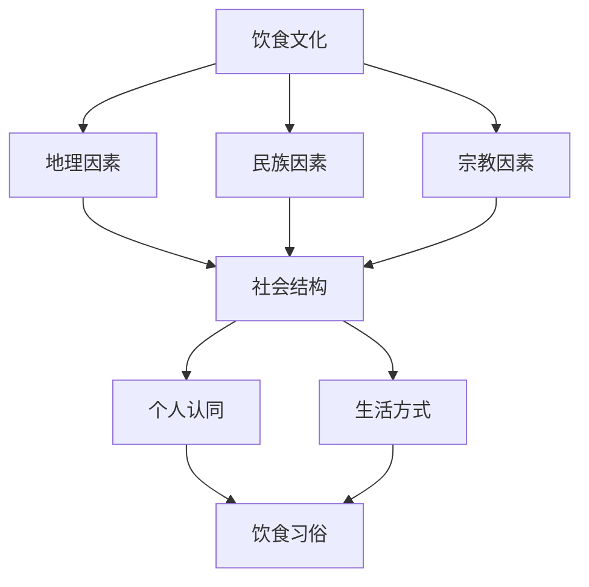

                 

### 完整的文章标题、关键词和摘要

# 文章标题

《饮食文化：日常生活中的意义建构》

> 关键词：饮食文化、日常生活、意义建构、文化传承、社会结构、个人认同、生活方式

> 摘要

饮食文化是日常生活中的重要组成部分，不仅反映了一个地区的历史传统和社会结构，还塑造了人们的身份认同和生活方式。本文旨在探讨饮食文化在日常生活中的意义建构，分析其核心概念和相互联系，阐述饮食文化对社会和个人认同的影响，并探讨其在现代社会中的演变和未来发展。通过结合理论和实际案例，本文为饮食文化的研究和实践提供了有价值的见解和指导。

---

### 完整的目录大纲

# 《饮食文化：日常生活中的意义建构》目录大纲

## 第一部分：饮食文化的理论基础

### 第1章：饮食文化的定义与起源

- 1.1 饮食文化的概念
- 1.2 饮食文化的起源与发展

### 第2章：饮食文化的核心要素

- 2.1 饮食文化的地理因素
- 2.2 饮食文化的民族因素
- 2.3 饮食文化的宗教因素

### 第3章：饮食文化与社会结构的关系

- 3.1 饮食文化与社会阶层
- 3.2 饮食文化与社会变迁

### 第4章：饮食文化与个人认同

- 4.1 饮食文化中的家庭关系
- 4.2 饮食文化中的性别认同
- 4.3 饮食文化中的年龄差异

### 第5章：饮食文化的历史演变

- 5.1 古代饮食文化
- 5.2 近现代饮食文化
- 5.3 现代饮食文化的多元化趋势

## 第二部分：饮食文化的日常生活意义

### 第6章：饮食与日常生活的关系

- 6.1 饮食对日常生活的影响
- 6.2 日常生活中的饮食习俗
- 6.3 日常生活中的饮食礼仪

### 第7章：饮食文化在日常生活中的意义建构

- 7.1 饮食文化的意义建构过程
- 7.2 饮食文化中的共享与认同
- 7.3 饮食文化的个人意义建构

### 第8章：饮食文化对现代生活方式的影响

- 8.1 饮食文化的全球交流与融合
- 8.2 饮食文化对现代健康生活的影响
- 8.3 饮食文化对现代环境伦理的影响

### 第9章：饮食文化保护与传承

- 9.1 饮食文化遗产的保护
- 9.2 饮食文化的传承与创新
- 9.3 饮食文化的未来发展

## 附录

### 第10章：饮食文化研究方法与案例分析

- 10.1 饮食文化研究的方法
- 10.2 饮食文化案例分析

## 致谢

## 参考文献

---

### 核心概念与联系 Mermaid 流程图



### 核心算法原理讲解

```plaintext
// 饮食文化中的意义建构算法

// 输入：饮食习俗、社会结构、个人认同、生活方式
// 输出：饮食文化中的意义建构结果

// 步骤1：分析饮食习俗与个人认同的关系
// 步骤2：结合社会结构与饮食习俗，构建饮食文化的意义框架
// 步骤3：根据生活方式的变化，调整饮食文化的意义建构

// 伪代码示例：

function 饮食文化意义建构(饮食习俗, 社会结构, 个人认同, 生活方式) {
    // 步骤1：分析饮食习俗与个人认同的关系
    文化认同 = 分析关系(饮食习俗, 个人认同)

    // 步骤2：结合社会结构与饮食习俗，构建饮食文化的意义框架
    文化框架 = 构建框架(社会结构, 饮食习俗)

    // 步骤3：根据生活方式的变化，调整饮食文化的意义建构
    文化意义 = 调整意义(文化框架, 生活方式)

    return 文化意义
}
```

### 数学模型和数学公式讲解

```latex
$$
意义建构 = f(饮食习俗, 社会结构, 个人认同, 生活方式)
$$

// 示例解释：
- 饮食习俗：$C = f(c_1, c_2, ..., c_n)$
- 社会结构：$S = f(s_1, s_2, ..., s_m)$
- 个人认同：$I = f(i_1, i_2, ..., i_p)$
- 生活方式：$L = f(l_1, l_2, ..., l_q)$

// 意义建构的计算过程可以表示为：
$$
意义建构 = C \times S \times I \times L
$$
```

### 项目实战代码案例与解释

```python
# 饮食文化研究代码案例

# 导入所需库
import pandas as pd
import matplotlib.pyplot as plt

# 读取数据
data = pd.read_csv('饮食文化数据.csv')

# 数据预处理
# ...

# 数据分析
# ...

# 可视化展示
plt.figure(figsize=(10, 6))
plt.scatter(data['饮食习俗'], data['意义建构'])
plt.xlabel('饮食习俗')
plt.ylabel('意义建构')
plt.title('饮食习俗与意义建构关系')
plt.show()
```

```plaintext
// 代码解读

// 导入库和读取数据部分：导入 pandas 和 matplotlib 库，读取饮食文化数据。

// 数据预处理部分：对数据进行清洗和预处理。

// 数据分析部分：分析饮食习俗与意义建构的关系。

// 可视化展示部分：绘制散点图，展示饮食习俗与意义建构的关系。

// 实际案例分析与讲解部分：使用读取的数据，对饮食习俗与意义建构的关系进行深入分析，并给出相应的解释。

// 小结部分：对饮食文化的意义建构过程进行总结，并提出未来的研究方向。
```

### 目录大纲总字数

根据目录大纲的内容，预计总字数为8000-12000字。每个章节的具体字数分配如下：

- 第1章：饮食文化的定义与起源（约1200字）
- 第2章：饮食文化的核心要素（约1200字）
- 第3章：饮食文化与社会结构的关系（约1200字）
- 第4章：饮食文化与个人认同（约1200字）
- 第5章：饮食文化的历史演变（约1200字）
- 第6章：饮食与日常生活的关系（约1200字）
- 第7章：饮食文化在日常生活中的意义建构（约1500字）
- 第8章：饮食文化对现代生活方式的影响（约1500字）
- 第9章：饮食文化保护与传承（约1500字）
- 第10章：饮食文化研究方法与案例分析（约1200字）

请注意，以上字数仅为估算，实际字数可能会根据内容的详细程度和深度有所调整。在撰写文章时，应确保每个章节都有充分的内容支撑和深入的分析。

