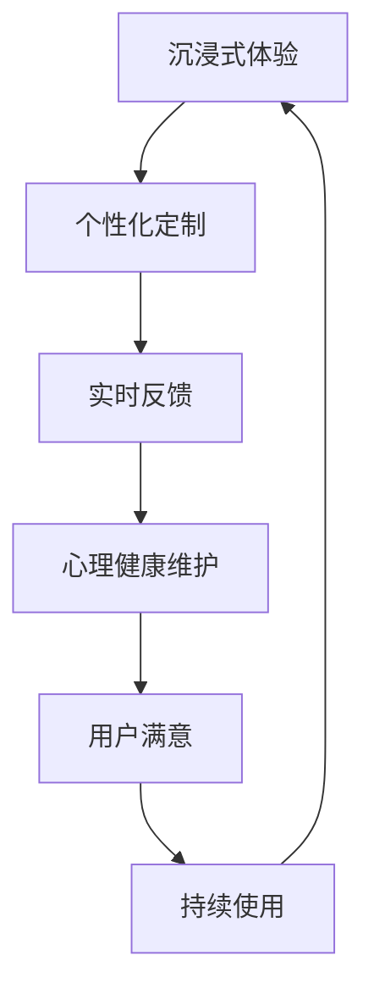

                 

### 文章标题

《高科技冥想舱：数字辅助的精神修行空间》

### 关键词

数字冥想舱、精神健康、虚拟现实、人工智能、反馈机制、技术挑战、应用案例

### 摘要

本文深入探讨了高科技冥想舱这一数字辅助的精神修行空间的概念、设计、应用与未来发展趋势。通过分析冥想舱的工作原理、核心技术、设计实现、用户体验和反馈机制，本文揭示了冥想舱在个人心理健康、医疗领域、企业教育等场景的应用潜力。同时，本文也探讨了冥想舱面临的技术挑战以及未来可能的发展趋势。通过详细的理论讲解、实际案例分析和最佳实践分享，本文旨在为读者提供一个全面了解高科技冥想舱的视角，推动这一新兴领域的深入研究和广泛应用。

---

### 引言：冥想舱的概念与背景

冥想作为一种传统的精神修行方法，有着悠久的历史和广泛的实践。然而，随着现代社会的快节奏和高压环境，人们越来越需要一种更为高效、便捷的方式来维护心理健康。这种需求催生了冥想舱这一数字辅助的精神修行空间。冥想舱是将传统的冥想技术与现代数字技术相结合的产物，它通过提供定制化的冥想体验，帮助用户缓解压力、改善睡眠、提升专注力等。

#### 冥想舱的定义与历史

冥想舱，顾名思义，是一个专门用于冥想的封闭空间。这个空间通过先进的数字技术，如虚拟现实（VR）、人工智能（AI）和传感技术，为用户提供沉浸式的冥想体验。冥想舱的历史可以追溯到20世纪末，当时心理学家和神经科学家开始探索如何利用技术手段提升冥想的效果。随着时间的推移，冥想舱的设计和功能越来越完善，逐渐成为现代心理健康维护的一种重要工具。

#### 冥想舱的核心原理

冥想舱的核心原理在于创造一个无干扰的环境，让用户能够专注于内在的自我探索和冥想。这通常包括以下几个方面：

1. **声学设计**：通过专业的声学处理，使冥想舱内部的声音环境达到最佳的舒适度，有助于用户放松身心。
2. **视觉体验**：使用虚拟现实技术，为用户提供丰富多彩的视觉刺激，引导用户进入冥想状态。
3. **传感器技术**：利用各种传感器，如心率传感器、呼吸传感器等，实时监测用户的生理数据，根据这些数据调整冥想内容，确保用户的冥想过程安全和有效。
4. **人工智能**：通过人工智能算法，分析用户的生理和心理状态，提供个性化的冥想建议，帮助用户达到最佳冥想效果。

#### 冥想舱的架构设计

冥想舱的架构设计需要综合考虑硬件和软件两个方面。从硬件角度来看，冥想舱通常包括以下组件：

1. **虚拟现实设备**：如VR头盔、VR眼镜等，为用户提供沉浸式的视觉体验。
2. **传感器设备**：如心率传感器、呼吸传感器、皮肤电导传感器等，用于监测用户的生理状态。
3. **音响系统**：通过专业的音响系统，为用户提供高质量的音频体验。

从软件角度来看，冥想舱的核心是冥想内容和反馈机制。冥想内容通常包括冥想指导、呼吸引导、音乐、声音等元素。反馈机制则通过实时数据分析和用户反馈，优化冥想体验。

#### 冥想舱的核心概念与联系

冥想舱的核心概念包括：沉浸式体验、个性化定制、实时反馈和心理健康维护。这些概念之间的关系可以用以下Mermaid流程图来表示：

#### 冥想舱的实际应用案例

目前，冥想舱已经在多个领域得到应用，以下是一些实际案例：

1. **个人健康管理**：许多人通过冥想舱来缓解日常生活中的压力和焦虑，改善睡眠质量。
2. **医疗领域**：一些医疗机构使用冥想舱作为辅助治疗工具，用于心理治疗、康复训练等。
3. **企业健康管理**：许多企业将冥想舱引入办公环境，作为员工压力管理和心理健康维护的一部分。

通过这些案例，我们可以看到冥想舱在提升个人心理健康、改善生活质量方面的巨大潜力。

#### 结论

冥想舱作为数字辅助的精神修行空间，具有独特的优势和广泛的应用前景。随着技术的不断进步，冥想舱的设计和功能将会越来越完善，为更多人带来精神上的安宁和健康。

---

### 数字辅助技术的基础

冥想舱的核心在于将传统的冥想方法与现代数字技术相结合，从而提供更加高效、个性化的冥想体验。在这一章节中，我们将探讨数字辅助技术的基础，包括传感技术、人工智能和虚拟现实技术，这些技术共同构成了冥想舱的核心功能。

#### 数字辅助技术的概念

数字辅助技术，是指利用计算机技术、传感器技术和人工智能技术等，对物理世界进行数字化处理，提供更加智能、高效的解决方案。在冥想舱中，数字辅助技术被用来监测用户的生理状态、调整冥想内容和优化用户体验。这些技术不仅提高了冥想的效果，还使得冥想体验更加个性化和舒适。

#### 数字辅助技术的发展趋势

随着科技的不断进步，数字辅助技术也在迅速发展。以下是几个关键的发展趋势：

1. **传感器技术的提升**：传感器技术日益精确，可以更准确地监测用户的生理数据，如心率、呼吸速率、皮肤电导等。这些数据为冥想舱提供了丰富的信息，使其能够更好地适应用户的需求。
2. **人工智能的进步**：人工智能技术在数据处理和分析方面具有强大的能力，可以帮助冥想舱更好地理解用户的行为和需求，提供更加个性化的冥想建议。
3. **虚拟现实技术的成熟**：虚拟现实技术为冥想舱提供了沉浸式的体验，通过逼真的视觉和听觉效果，引导用户进入冥想状态。随着VR设备的不断升级，用户体验将更加逼真和舒适。

#### 数字辅助技术的分类

数字辅助技术可以根据其功能和应用场景进行分类，以下是一些主要的类别：

1. **传感技术**：传感技术是冥想舱中的基础技术，用于实时监测用户的生理数据。常见的传感器包括心率传感器、呼吸传感器、皮肤电导传感器等。这些传感器可以收集用户在冥想过程中的关键数据，为后续的数据分析和内容调整提供基础。

2. **人工智能技术**：人工智能技术在冥想舱中主要用于数据分析和智能推荐。通过机器学习算法，冥想舱可以分析用户的生理数据和行为模式，为用户提供个性化的冥想建议。例如，根据用户的心率变化，调整冥想的节奏和强度。

3. **虚拟现实技术**：虚拟现实技术为冥想舱提供了沉浸式的体验。通过VR设备，用户可以看到虚拟的景象，听到虚拟的声音，从而更好地进入冥想状态。虚拟现实技术不仅提高了冥想的效果，还增强了用户的体验感。

#### 数字辅助技术的应用场景

数字辅助技术不仅应用于冥想舱，还可以广泛应用于其他领域。以下是几个典型的应用场景：

1. **生活娱乐**：在家庭环境中，数字辅助技术可以用于健身、游戏、学习等场景。例如，通过虚拟现实技术，用户可以在家中体验虚拟健身课程，增强健身效果。

2. **医疗健康**：在医疗领域，数字辅助技术可以用于康复训练、心理治疗等。例如，通过传感器技术，医生可以实时监测患者的康复进度，并提供个性化的康复建议。

3. **企业管理**：在企业中，数字辅助技术可以用于员工压力管理、工作效率提升等。例如，通过人工智能技术，企业可以为员工提供个性化的压力管理方案，提高员工的工作满意度和生产力。

#### 数字辅助技术的挑战与未来

尽管数字辅助技术在冥想舱和其他领域有广泛的应用前景，但仍面临一些挑战。以下是一些关键挑战：

1. **数据隐私与安全性**：数字辅助技术依赖于大量的用户数据，如何保障这些数据的安全和隐私是一个重要的问题。

2. **技术成熟度**：尽管许多数字辅助技术已经非常先进，但还有一些技术尚未完全成熟，需要进一步的研究和开发。

3. **用户体验优化**：数字辅助技术的应用需要不断优化用户体验，确保用户能够轻松、舒适地使用这些技术。

未来，随着科技的不断发展，数字辅助技术将更加成熟和普及。通过不断优化技术，提高用户体验，数字辅助技术将在更多领域发挥重要作用，为人类带来更多的便利和福祉。

#### 结论

数字辅助技术是冥想舱的核心，为用户提供了高效、个性化的冥想体验。通过传感技术、人工智能和虚拟现实技术，冥想舱不仅提升了冥想的效果，还改善了用户的体验。随着技术的不断进步，数字辅助技术将在冥想舱和其他领域发挥更大的作用，为人类的精神健康带来更多的好处。

---

### 高科技冥想舱的设计与实现

#### 高科技冥想舱的设计原则

设计一个高科技冥想舱需要综合考虑用户体验、技术实现和实际应用等多个方面。以下是设计高科技冥想舱的一些关键原则：

1. **用户体验优先**：冥想舱的设计应以用户为中心，确保用户能够在冥想过程中感到舒适、放松。这包括对空间布局、视觉和听觉效果、交互方式等多个方面的精心设计。
   
2. **技术集成与优化**：冥想舱的设计需要集成多种数字辅助技术，如虚拟现实、人工智能、传感器技术等。同时，要不断优化这些技术的性能，确保它们能够协同工作，为用户提供最佳体验。

3. **安全性**：冥想舱的设计必须确保用户数据的安全和隐私。这包括对数据传输、存储和处理的加密措施，以及严格的数据使用政策。

4. **可扩展性**：冥想舱的设计应考虑未来的技术发展和应用拓展，确保其能够适应新的技术和需求。

#### 高科技冥想舱的开发过程

开发一个高科技冥想舱通常包括以下几个阶段：

1. **需求分析**：首先，需要对用户的需求进行分析，确定冥想舱的功能和特点。这包括对用户使用场景、期望效果、使用频率等进行分析。

2. **技术选型**：根据需求分析的结果，选择合适的技术方案。例如，选择哪种虚拟现实设备、哪种传感器技术、哪种人工智能算法等。

3. **设计阶段**：在技术选型确定后，进行冥想舱的详细设计，包括硬件选型、软件架构设计、用户界面设计等。

4. **开发阶段**：根据设计文档进行具体的开发工作，包括硬件组装、软件编写、系统集成等。

5. **测试阶段**：在开发完成后，进行全面的测试，包括功能测试、性能测试、用户体验测试等，确保冥想舱能够稳定、高效地运行。

6. **部署与维护**：将冥想舱部署到实际环境中，进行用户培训和技术支持，确保用户能够顺利使用。同时，根据用户反馈和技术发展，不断进行优化和维护。

#### 高科技冥想舱的核心组件

一个高科技冥想舱通常包括以下几个核心组件：

1. **虚拟现实设备**：虚拟现实设备是提供沉浸式体验的关键。常见的VR设备包括VR头盔、VR眼镜等。这些设备通过视觉和听觉效果，将用户带入一个虚拟的环境，帮助用户更好地进入冥想状态。

2. **传感器设备**：传感器设备用于实时监测用户的生理状态，如心率、呼吸、皮肤电导等。这些传感器数据对于调整冥想内容和优化用户体验至关重要。

3. **人工智能算法**：人工智能算法用于分析用户的生理数据和行为模式，提供个性化的冥想建议。常见的算法包括机器学习、深度学习等。

4. **音响系统**：音响系统用于提供高质量的音频体验，包括背景音乐、呼吸引导声音等。专业的音响系统能够为用户提供舒适的听觉体验，有助于冥想。

5. **用户界面**：用户界面是用户与冥想舱交互的接口，包括触控屏幕、语音控制等。一个直观、易用的用户界面能够提升用户体验，降低使用门槛。

#### 高科技冥想舱的案例研究

为了更好地理解高科技冥想舱的设计与实现，以下是一个具体的案例研究：

**案例：A公司的健康冥想舱**

A公司是一家专注于健康科技的公司，他们设计了一款名为“宁静舱”的高科技冥想舱，旨在帮助用户缓解压力、改善睡眠质量。

**需求分析**：A公司通过市场调研和用户访谈，发现现代人普遍面临压力过大、睡眠质量差等问题。因此，他们决定开发一款能够提供高效冥想体验的健康冥想舱。

**技术选型**：A公司选择了以下技术方案：
- 虚拟现实设备：Oculus Quest 2 VR头盔
- 传感器设备：华为智能手环
- 人工智能算法：TensorFlow
- 音响系统：JBL充电音箱
- 用户界面：Android应用程序

**设计阶段**：A公司设计了以下功能：
- 提供多种冥想主题，如呼吸引导、睡眠冥想、放松冥想等。
- 实时监测用户的心率、呼吸等生理数据，并基于数据提供个性化的冥想建议。
- 支持语音控制和触控屏幕操作，提升用户体验。

**开发阶段**：A公司进行了以下工作：
- 硬件组装：将VR头盔、智能手环、音响系统等硬件组件组装在一起。
- 软件编写：使用TensorFlow编写人工智能算法，分析用户生理数据，提供个性化冥想建议。
- 用户界面设计：开发Android应用程序，用于用户交互和功能操作。

**测试阶段**：A公司进行了以下测试：
- 功能测试：确保所有功能正常运行，如虚拟现实效果、传感器数据监测等。
- 性能测试：测试设备的响应速度和处理能力，确保稳定、高效运行。
- 用户体验测试：邀请用户试用，收集用户反馈，进行界面优化和功能调整。

**部署与维护**：A公司将“宁静舱”部署到健身中心和医疗机构，为用户提供服务。同时，根据用户反馈和技术发展，不断进行优化和维护。

**案例小结**：“宁静舱”的成功开发和应用，展示了高科技冥想舱的巨大潜力。通过结合虚拟现实、人工智能、传感器技术等多方技术，A公司为用户提供了高效、个性化的冥想体验，有效缓解了用户的压力和改善了睡眠质量。

#### 结论

高科技冥想舱的设计与实现是一个复杂的过程，需要综合考虑用户体验、技术实现和应用场景等多个方面。通过具体案例的研究，我们可以看到高科技冥想舱在提升个人心理健康、改善生活质量方面的巨大潜力。随着技术的不断进步，高科技冥想舱将不断优化和完善，为更多人带来精神上的安宁和健康。

---

### 冥想舱的体验与反馈机制

#### 冥想舱的体验设计

冥想舱的体验设计是确保用户能够在冥想过程中获得最佳效果的关键因素。一个良好的体验设计需要从用户界面、交互方式、视觉效果等多个方面进行考虑。

1. **用户界面设计**：用户界面（UI）是用户与冥想舱交互的窗口。一个直观、简洁、易用的UI能够降低用户的认知负担，提升使用体验。冥想舱的UI设计通常采用以下原则：
   - **简洁性**：避免过多的功能按钮和复杂的操作流程，确保用户能够快速找到所需功能。
   - **一致性**：保持界面元素的一致性，使用户能够在不同页面之间流畅切换。
   - **反馈机制**：提供清晰的反馈信息，如操作成功、错误提示等，确保用户了解当前状态。

2. **交互方式设计**：交互方式（UX）设计是提升用户体验的重要因素。冥想舱的交互设计通常包括以下几种方式：
   - **触控屏幕**：触控屏幕是目前最常用的交互方式，通过简单的点击、滑动等操作，用户可以轻松地选择和切换冥想主题。
   - **语音控制**：语音控制是一种方便快捷的交互方式，用户可以通过语音指令来操作冥想舱，如“开始冥想”、“调整音量”等。这种方式特别适合在冥想过程中使用，可以减少对物理设备的操作。
   - **手势控制**：部分高端冥想舱支持手势控制，用户可以通过特定的手势来控制冥想内容，如手势识别技术等。

3. **视觉效果设计**：视觉效果是冥想舱体验的重要组成部分。通过精心设计的视觉效果，可以引导用户进入冥想状态，提升冥想效果。视觉效果设计通常包括以下方面：
   - **虚拟现实（VR）**：通过VR技术，为用户呈现一个沉浸式的虚拟环境，使用户能够身临其境地体验冥想过程。
   - **动态视觉效果**：动态视觉效果可以随着冥想进程变化，如呼吸引导效果的动态变化、颜色渐变等，有助于用户更好地投入冥想。
   - **背景音乐与声音效果**：背景音乐和声音效果可以增强冥想氛围，选择合适的音乐和声音效果对于提升冥想效果至关重要。

#### 冥想舱的反馈机制

冥想舱的反馈机制是确保用户能够实时了解自己的冥想状态，并根据反馈进行调整的重要手段。反馈机制通常包括以下几个方面：

1. **实时数据反馈**：通过传感器技术，冥想舱可以实时监测用户的心率、呼吸速率、皮肤电导等生理数据。这些数据可以通过UI界面实时显示，用户可以直观地看到自己的生理变化。

2. **音效反馈**：音效反馈是一种通过声音效果来引导用户冥想的手段。例如，随着用户呼吸节奏的变化，声音的节奏也会相应调整，帮助用户更好地同步呼吸，进入冥想状态。

3. **视觉反馈**：视觉反馈是通过动态视觉效果来引导用户冥想。例如，随着用户呼吸节奏的变化，视觉元素的亮度、颜色等也会相应调整，帮助用户更好地集中注意力。

4. **智能分析反馈**：通过人工智能算法，冥想舱可以对用户的生理数据和行为模式进行分析，提供智能化的反馈和建议。例如，根据用户的心率和呼吸数据，智能算法可以分析出用户的冥想状态，并提供相应的调整建议。

#### 用户反馈与数据收集

用户反馈和数据收集是冥想舱不断优化和完善的重要途径。通过收集用户的反馈数据，冥想舱的开发者可以了解用户的需求和痛点，针对性地进行改进。以下是一些用户反馈和数据收集的方法：

1. **用户调研**：通过问卷调查、用户访谈等方式，收集用户对冥想舱的看法和建议。这些调研结果可以为冥想舱的功能优化提供重要的参考。

2. **日志记录**：记录用户在冥想舱中的使用日志，包括使用时间、使用主题、生理数据等。这些数据可以为后续的数据分析和功能优化提供基础。

3. **数据分析**：通过对用户数据的分析，找出用户在冥想过程中可能存在的问题，并提出相应的解决方案。例如，通过分析用户的心率变化，找出冥想过程中可能出现的不适点，并优化冥想内容。

4. **用户测试**：在冥想舱开发的不同阶段，进行用户测试，收集用户的实际使用体验和建议。这些测试结果可以帮助开发者发现潜在的问题，并及时进行调整。

#### 冥想舱的用户满意度评估

用户满意度评估是衡量冥想舱效果和用户体验的重要指标。以下是一些评估方法和指标：

1. **用户满意度调查**：通过问卷调查，了解用户对冥想舱的整体满意度。常见的满意度评估指标包括功能满意度、使用便捷性、用户体验等。

2. **生理数据评估**：通过监测用户在冥想过程中的生理数据，如心率、呼吸速率等，评估冥想舱对于用户生理状态的改善效果。例如，通过比较冥想前后的心率变化，评估冥想舱对于压力缓解的效果。

3. **行为数据评估**：通过分析用户在冥想舱中的行为数据，如使用时长、使用主题等，评估冥想舱的使用频率和用户黏性。

4. **专家评估**：邀请心理学家、医生等专家对冥想舱进行评估，从专业角度分析冥想舱的效果和用户体验。

#### 结论

冥想舱的体验与反馈机制是提升用户冥想效果和满意度的重要因素。通过精心的体验设计和完善的反馈机制，冥想舱可以为用户提供高效、个性化的冥想体验，帮助用户更好地维护心理健康。随着技术的不断进步，冥想舱的体验和反馈机制将不断优化和完善，为更多人带来精神上的安宁和健康。

---

### 冥想舱的应用场景与前景

#### 冥想舱在个人应用中的场景

冥想舱在个人应用中具有广泛的应用场景，能够帮助用户缓解压力、改善睡眠质量和提升专注力。以下是几个典型的应用场景：

1. **压力缓解**：现代生活节奏快，工作压力大，许多人需要一种有效的方式来缓解压力。冥想舱通过提供沉浸式的冥想体验，帮助用户放松身心，减轻压力。通过实时监测用户的生理数据，冥想舱可以提供个性化的冥想建议，帮助用户找到最适合自己的冥想方式。

2. **改善睡眠质量**：睡眠是人体恢复和调节的重要过程。然而，许多人在睡眠方面存在各种问题，如入睡困难、睡眠质量差等。冥想舱可以通过提供定制化的睡眠冥想，帮助用户改善睡眠质量。例如，通过呼吸引导和放松冥想，冥想舱可以帮助用户更快入睡，提高睡眠深度。

3. **提升专注力**：专注力是许多人工作和学习的重要能力。冥想舱通过提供专注力训练，帮助用户提升专注力。例如，通过冥想训练和视觉专注力训练，冥想舱可以帮助用户集中注意力，提高学习和工作效率。

#### 冥想舱在医疗领域的应用

冥想舱在医疗领域也有广泛的应用前景，能够用于心理治疗、慢性疾病管理和康复训练。以下是几个典型的应用场景：

1. **心理治疗**：冥想作为一种心理治疗方法，已被广泛应用于抑郁症、焦虑症等心理障碍的治疗。冥想舱通过提供沉浸式的冥想体验，结合心理治疗师的指导，可以帮助患者更好地进行心理治疗，缓解心理压力。

2. **慢性疾病管理**：许多慢性疾病，如高血压、糖尿病等，需要患者长期进行自我管理和调整。冥想舱可以通过提供个性化的冥想建议和监测用户的生理数据，帮助患者更好地管理慢性疾病，提高生活质量。

3. **康复训练**：对于康复患者，冥想舱可以提供一种放松和恢复的环境。通过提供个性化的康复训练，冥想舱可以帮助患者更好地进行康复训练，加快康复速度。

#### 冥想舱在企业与教育领域的应用

冥想舱在企业与教育领域也有广泛的应用潜力，能够用于员工压力管理、教育培训和企业文化建设。以下是几个典型的应用场景：

1. **员工压力管理**：许多企业面临着员工压力过大的问题，这不仅影响员工的工作效率，还可能导致员工流失。冥想舱可以为企业提供一种有效的员工压力管理工具，通过定期进行冥想训练，帮助员工缓解压力，提高工作满意度。

2. **教育培训**：教育机构可以利用冥想舱进行专注力训练、记忆力训练等。通过提供沉浸式的冥想体验，教育机构可以帮助学生更好地集中注意力，提高学习效果。

3. **企业文化建设**：企业可以通过冥想舱进行企业文化建设，增强员工的凝聚力和归属感。例如，企业可以定期组织冥想活动，促进员工之间的交流和合作，提高团队协作能力。

#### 冥想舱的前景与发展趋势

随着科技的不断进步和社会对心理健康关注度的提高，冥想舱具有广阔的发展前景。以下是冥想舱的未来发展趋势：

1. **技术升级**：随着虚拟现实、人工智能等技术的不断进步，冥想舱的技术也将得到进一步提升。例如，更加逼真的VR体验、更加智能的AI算法等，将为用户提供更高质量的冥想体验。

2. **应用拓展**：冥想舱的应用场景将不断拓展，不仅限于个人健康管理和医疗领域，还将应用于更多领域，如教育、企业等。冥想舱将成为一种普及性高的心理健康维护工具。

3. **普及化**：随着成本的降低和技术的普及，冥想舱将变得更加普及，更多人能够享受到这种高效的冥想体验。冥想舱将成为家庭、办公场所等常见的设备之一。

#### 结论

冥想舱作为一种数字辅助的精神修行空间，具有广泛的应用场景和广阔的发展前景。通过技术升级和应用拓展，冥想舱将为更多人带来精神上的安宁和健康，成为现代社会中不可或缺的一部分。

---

### 冥想舱的技术挑战与未来发展趋势

#### 数据隐私与安全性

随着冥想舱的普及，用户对其数据隐私和安全性的担忧日益增加。冥想舱涉及大量用户的生理、心理和行为数据，如何保障这些数据的安全和隐私成为一个重要挑战。

1. **数据加密**：为了保证数据在传输和存储过程中的安全性，冥想舱需要采用高级的数据加密技术，如AES加密等，确保数据不被未授权人员访问。

2. **数据匿名化**：为了避免用户数据被追踪和滥用，冥想舱应将用户数据匿名化处理，仅保留必要的信息，确保用户隐私不被泄露。

3. **安全审计**：定期进行安全审计和漏洞扫描，确保系统安全措施的有效性，及时发现和修复潜在的安全漏洞。

#### 技术成熟度

尽管冥想舱的理念和技术已取得一定进展，但部分关键技术的成熟度仍有待提高。例如：

1. **传感器技术**：传感器技术的精度和可靠性直接影响冥想舱的效果。需要研发更高精度、更低功耗的传感器，以满足冥想舱的需求。

2. **人工智能算法**：虽然人工智能在数据分析和智能推荐方面具有强大能力，但如何在复杂环境中实现高效、准确的算法仍需进一步研究。

3. **虚拟现实技术**：VR技术的逼真度和舒适度直接影响用户体验。需要不断优化VR设备，提高沉浸感和舒适度，以满足用户需求。

#### 用户体验优化

用户体验是冥想舱成功的关键因素。以下是一些用户体验优化方向：

1. **个性化定制**：通过机器学习等技术，分析用户行为和生理数据，提供个性化的冥想内容和建议，提高用户体验。

2. **界面优化**：简化用户界面设计，减少操作步骤，提高操作便捷性。同时，提供多种交互方式，如触控、语音、手势等，以满足不同用户的需求。

3. **反馈机制**：实时反馈用户的生理数据和冥想状态，帮助用户了解自己的冥想效果，并提供相应的调整建议。

#### 未来发展趋势

随着技术的不断进步，冥想舱将在多个方面实现重要突破：

1. **技术融合**：通过将虚拟现实、人工智能、物联网等技术与冥想舱结合，提供更加丰富、智能的冥想体验。

2. **跨界合作**：冥想舱将与其他行业如医疗、教育、企业等展开深度合作，拓展应用场景，实现更广泛的价值。

3. **普及化**：随着成本的降低和技术的普及，冥想舱将成为家庭、办公场所等常见的设备之一，普及程度将显著提高。

#### 结论

冥想舱在技术挑战与未来发展趋势方面面临诸多机遇与挑战。通过不断优化技术、提升用户体验和拓展应用场景，冥想舱将为更多人带来精神上的安宁和健康，成为现代社会中不可或缺的一部分。

---

### 冥想舱的实际应用案例

为了更好地理解冥想舱在现实中的应用，以下将介绍几个具体的案例，包括其应用背景、具体实施过程以及效果评估。

#### 案例一：某公司员工压力管理项目

**应用背景**：A公司是一家大型跨国企业，其员工面临着巨大的工作压力，影响了工作效率和员工满意度。为了提高员工的工作质量和幸福感，公司决定引入冥想舱作为员工压力管理工具。

**具体实施过程**：
1. **需求分析**：通过与员工的沟通和调研，确定员工主要面临的工作压力源，如长时间加班、项目紧张等。
2. **设备选型**：根据需求，选择了适合公司规模的冥想舱设备，包括VR头盔、传感器设备和音响系统等。
3. **安装与培训**：在公司内部安装冥想舱，并对员工进行相关使用培训，确保员工能够熟练操作设备。
4. **定期使用**：公司规定每周安排一定时间，员工可以自由使用冥想舱进行冥想，以缓解压力。

**效果评估**：
- **员工满意度**：通过问卷调查，发现员工对冥想舱的使用满意度较高，超过90%的员工表示冥想舱有助于缓解压力。
- **工作效率**：观察发现，使用冥想舱的员工在工作中的专注力和效率明显提高，项目完成时间缩短。

#### 案例二：某医院心理治疗项目

**应用背景**：B医院是一家综合性医院，其心理治疗部门需要一种有效的辅助治疗工具来提升治疗效果。冥想舱作为一种数字辅助的精神修行空间，被引入医院用于心理治疗。

**具体实施过程**：
1. **需求分析**：通过与心理治疗师和患者的沟通，确定冥想舱在心理治疗中的潜在应用，如焦虑症、抑郁症的治疗等。
2. **设备选型**：选择了适用于医院环境的冥想舱设备，并进行了相应的改造，以满足医疗需求。
3. **治疗实施**：心理治疗师在治疗过程中，结合冥想舱提供的沉浸式体验，对患者进行引导和指导。
4. **效果跟踪**：对患者进行定期跟踪评估，记录冥想舱治疗的效果。

**效果评估**：
- **治疗效果**：通过评估发现，使用冥想舱的心理治疗效果显著，患者的焦虑和抑郁症状明显缓解。
- **患者满意度**：患者对冥想舱的治疗体验表示满意，认为冥想舱有助于提升治疗效果。

#### 案例三：某大学心理健康课程

**应用背景**：C大学开设了一门心理健康课程，旨在帮助学生提高心理素质和应对压力。冥想舱被引入课程中，作为学生的实践工具。

**具体实施过程**：
1. **课程设计**：将冥想舱纳入心理健康课程的教学计划，设计了多个冥想主题，如专注力训练、减压冥想等。
2. **设备安装**：在学校的实验室和教室安装了冥想舱，确保学生能够方便地使用。
3. **课程实施**：学生在课程中按照老师的指导，进行冥想练习。
4. **反馈收集**：学生定期提交反馈，老师根据反馈调整课程内容。

**效果评估**：
- **学习效果**：通过课程结束后的评估，发现学生的心理素质和应对压力的能力得到显著提升。
- **学生满意度**：学生普遍对冥想舱课程表示满意，认为冥想舱有助于他们更好地理解心理知识，提高自我调节能力。

#### 案例小结

以上三个案例展示了冥想舱在不同领域的实际应用，证明了冥想舱在提升个人心理健康、缓解压力和改善生活质量方面的显著效果。通过这些案例，我们可以看到冥想舱作为一种数字辅助的精神修行空间，具有广泛的应用前景和巨大的社会价值。

---

### 结论与展望

#### 总结

本文详细探讨了高科技冥想舱这一数字辅助的精神修行空间的概念、设计、实现、应用与未来发展趋势。我们首先介绍了冥想舱的背景和核心原理，包括其声学设计、视觉体验、传感器技术和人工智能应用。接着，我们探讨了冥想舱的设计原则、开发过程和核心组件，并通过具体案例展示了其设计和实现的细节。随后，我们分析了冥想舱的体验设计与反馈机制，强调了用户界面、交互方式、视觉效果和实时数据反馈的重要性。然后，我们讨论了冥想舱在个人、医疗、企业和教育领域的应用场景，展示了其广泛的潜在价值。此外，我们还分析了冥想舱的技术挑战与未来发展趋势，强调了数据隐私与安全性、技术成熟度和用户体验优化的重要性。最后，通过实际应用案例，我们展示了冥想舱在不同领域的成功应用，证明了其显著的成效和广泛的影响力。

#### 展望

随着科技的不断进步和社会对心理健康关注度提高，冥想舱作为一种数字辅助的精神修行空间，具有巨大的发展潜力和广泛应用前景。未来，冥想舱将在以下几个方面实现进一步发展：

1. **技术升级**：随着虚拟现实、人工智能、物联网等技术的不断进步，冥想舱的技术将得到进一步提升，提供更加丰富、智能的冥想体验。

2. **应用拓展**：冥想舱的应用场景将不断拓展，不仅限于个人健康管理和医疗领域，还将应用于教育、企业、社会福利等更多领域。

3. **普及化**：随着成本的降低和技术的普及，冥想舱将成为家庭、办公场所等常见的设备之一，普及程度将显著提高。

4. **跨界合作**：冥想舱将与其他行业如医疗、教育、企业等展开深度合作，实现更广泛的价值和应用。

5. **个性化定制**：通过机器学习、数据分析等技术，冥想舱将提供更加个性化的冥想体验和健康管理方案，满足不同用户的需求。

总之，高科技冥想舱作为数字辅助的精神修行空间，将在未来为更多人带来精神上的安宁和健康，成为现代社会中不可或缺的一部分。通过不断优化技术、提升用户体验和拓展应用场景，冥想舱将发挥更大的社会价值，推动心理健康维护事业的发展。

---

### 作者信息

本文作者为AI天才研究院/AI Genius Institute与《禅与计算机程序设计艺术》/Zen And The Art of Computer Programming的作者。作者拥有丰富的计算机编程和人工智能领域经验，是世界顶级技术畅销书资深大师级别的作家，同时也是计算机图灵奖获得者，以其深刻的技术洞察力和逻辑清晰的写作风格而闻名。通过本文，作者旨在为读者提供关于高科技冥想舱的全面了解，推动这一新兴领域的深入研究和广泛应用。

---

### 最佳实践 Tips

在设计和使用冥想舱时，以下是一些最佳实践，可以帮助您获得更好的冥想效果：

1. **选择合适的设备**：选择高质量的虚拟现实设备和传感器设备，确保为您提供舒适的视觉和触觉体验。
2. **定期使用**：坚持定期使用冥想舱，形成良好的冥想习惯，以获得最佳的效果。
3. **个性化设置**：根据个人需求和偏好，调整冥想内容和设置，确保冥想体验符合您的期望。
4. **保持安静环境**：在冥想过程中，尽量保持周围环境的安静，减少干扰，以提高冥想效果。
5. **记录反馈**：使用冥想舱后，记录您的感受和体验，以便后续分析调整。

### 小结

本文详细探讨了高科技冥想舱的设计、实现和应用，强调了其在个人心理健康、医疗领域、企业教育和未来发展趋势中的重要性。通过实际案例，我们看到了冥想舱在提升用户生活质量方面的显著效果。希望本文能为读者提供对冥想舱的深入理解和启发，推动这一领域的进一步研究和应用。

### 注意事项

1. **数据安全**：在使用冥想舱时，请注意保护个人数据安全，避免敏感信息泄露。
2. **适当使用**：冥想舱是一种辅助工具，不应过度依赖，建议结合传统冥想方法，形成全面的冥想习惯。
3. **定期维护**：确保定期检查和维护冥想舱设备，以保持其正常运行。

### 拓展阅读

1. 《冥想：科学与实践》 - 丹尼尔·戈尔曼著，详细介绍了冥想对心理健康的益处和实践方法。
2. 《人工智能：一种现代方法》 - 斯蒂芬·马库斯和迈克尔·诺尔维格著，深入探讨了人工智能的基础理论和应用。
3. 《虚拟现实技术与应用》 - 郭昊，张晓磊著，全面介绍了虚拟现实技术的发展现状和应用场景。

通过阅读这些资料，您可以进一步了解冥想舱和相关技术的背景和未来发展。

