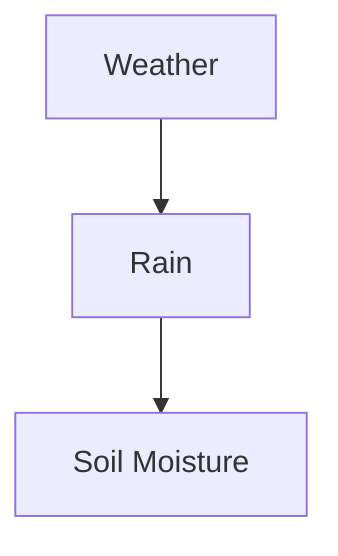

                 

### 文章标题: AI中的因果推理：超越相关性分析

关键词：因果推理，相关性分析，AI，机器学习，因果发现算法，因果推断模型

摘要：本文深入探讨了人工智能（AI）中的因果推理，对比了因果推理与相关性分析的区别，并详细介绍了因果推理的基础概念、算法原理、应用实例以及未来趋势。通过本文，读者将了解因果推理在AI领域的核心作用，掌握其应用方法与挑战，并为未来的研究提供参考。

## 引言

因果推理，作为一种在人工智能（AI）和机器学习（ML）中至关重要的能力，其核心在于理解变量之间的因果关系，而不仅仅是相关性。在现实世界中，许多决策依赖于对因果关系的深刻理解，因为因果关系能够提供更准确的预测和决策支持。然而，传统的相关性分析方法往往无法揭示变量之间的因果联系，导致在决策过程中可能出现偏差和误判。

因果推理在AI中的重要性不言而喻。首先，它能够帮助我们更好地理解数据背后的真实世界关系，从而提高机器学习模型的可靠性和鲁棒性。其次，因果推理能够提供更精准的预测，特别是在需要做出重要决策的场景中，如医疗诊断、金融投资、市场营销等。此外，因果推理还有助于揭示数据中的潜在因果关系，从而为新的研究和发展提供方向。

本文将系统地介绍因果推理的基本概念、算法原理和应用实例，旨在帮助读者深入了解因果推理在AI领域的应用。文章结构如下：

1. **因果推理基础**：介绍因果关系的概念、表示方法和识别技术。
2. **因果推理算法**：探讨传统和高级因果推理算法。
3. **因果推理应用**：分析因果推理在预测和决策中的应用。
4. **因果推理挑战与未来方向**：讨论因果推理面临的挑战和未来发展趋势。
5. **案例分析**：通过具体案例展示因果推理的应用过程和效果。
6. **总结**：回顾全文内容，强调因果推理在AI领域的重要性。

### 因果推理基础

因果推理，顾名思义，是指通过分析数据来推断变量之间的因果关系。在统计学中，相关性分析是研究变量之间相关性的方法，但相关性并不等同于因果关系。相关性指的是两个变量之间的变化趋势相似性，而因果关系则涉及变量间的直接作用和影响。例如，吸烟和肺癌之间存在相关性，但吸烟是导致肺癌的直接原因，这才是因果关系。

#### 因果关系的概念

因果关系的概念可以从多个角度进行理解。最基本的定义是：如果一个变量的变化直接导致了另一个变量的变化，那么这两个变量之间存在因果关系。这通常用公式表示为：\( Y = f(X) + \epsilon \)，其中 \( Y \) 是结果变量，\( X \) 是原因变量，\( f \) 是因果关系函数，\( \epsilon \) 是误差项。

#### 因果关系的表示方法

因果关系的表示方法有多种，其中最常用的是因果图（Causal Graph）和因果模型（Causal Model）。因果图是一种图形化的表示方法，它通过节点和边来表示变量及其因果关系。每个节点代表一个变量，节点之间的边表示变量之间的因果关系。例如，一个简单的因果图可能包括以下变量：天气（W）、降雨（R）和土壤湿度（S）。因果图如下所示：



#### 因果关系的识别

因果关系的识别是因果推理的核心任务。识别因果关系的常见方法包括：观察实验、随机对照试验和因果发现算法。

1. **观察实验**：通过观察数据来识别变量之间的因果关系。这种方法的主要问题是，观察数据可能受到外部干扰和随机因素的影响，导致无法准确判断因果关系。
2. **随机对照试验**：通过随机分配实验组和对照组来消除外部干扰，从而更准确地识别因果关系。这种方法在医学和经济学等领域广泛应用。
3. **因果发现算法**：利用机器学习算法来发现数据中的因果关系。这些算法通常基于统计方法和图论算法，如结构方程模型（SEM）、因果发现算法（如算法 PC）和深度学习方法。

### 因果推理算法

因果推理算法可以分为传统算法和高级算法。传统算法主要包括Do-Calculus、因果贝叶斯网络等，而高级算法则包括基于深度学习的方法和基于图神经网络的方法。

#### 传统因果推理算法

1. **Do-Calculus**：Do-Calculus是一种基于数学形式化的因果推理方法，它通过消除潜在共变因素来推断因果关系。其核心思想是，通过逻辑推理和代数运算，将复杂的问题分解为更简单的子问题。Do-Calculus的基本操作包括Do和 Undo操作，如下所示：

    - **Do**操作：表示对变量进行干预，即强制变量取某个特定值。
    - **Undo**操作：表示撤销Do操作，恢复变量到原始状态。

    伪代码如下：

    ```python
    do(x = value):
        # 对变量x进行干预
        x = value
    undo():
        # 撤销干预
        x = original_value
    ```

2. **因果贝叶斯网络**：因果贝叶斯网络是一种基于概率模型的因果推理方法，它通过构建变量之间的概率关系图来表示因果关系。每个节点代表一个变量，节点之间的边表示变量之间的概率依赖关系。因果贝叶斯网络的构建通常基于观察数据或专家知识。

    伪代码如下：

    ```python
    def build_causal_bayesian_network(data):
        # 基于观察数据构建因果贝叶斯网络
        network = CausalBayesianNetwork()
        for variable in data:
            network.add_node(variable)
            for parent in parents_of_variable(variable, data):
                network.add_edge(parent, variable)
        return network
    ```

#### 高级因果推理算法

1. **基于深度学习的方法**：近年来，深度学习在图像识别、自然语言处理等领域取得了巨大成功，但其在因果推理中的应用仍处于探索阶段。基于深度学习的方法主要包括基于图神经网络的方法和基于变分自编码器的方法。

    - **基于图神经网络的方法**：图神经网络（Graph Neural Networks, GNN）是一种能够处理图结构数据的深度学习模型，它可以有效地捕捉变量之间的复杂关系。GNN的基本思想是，通过聚合节点邻域的信息来更新节点的表示。

      伪代码如下：

      ```python
      def graph_neural_network(nodes, edges):
          # 基于图神经网络更新节点表示
          for node in nodes:
              node_representation = aggregate(node_neighbors(node, edges))
          return nodes
      ```

    - **基于变分自编码器的方法**：变分自编码器（Variational Autoencoder, VAE）是一种生成模型，它可以学习数据的潜在表示。在因果推理中，VAE可以用于推断变量之间的因果关系。

      伪代码如下：

      ```python
      def variational_autoencoder(data):
          # 基于变分自编码器学习变量之间的因果关系
          latent_space = encode(data)
          reconstructed_data = decode(latent_space)
          return latent_space
      ```

2. **基于图神经网络的方法**：图神经网络（Graph Neural Networks, GNN）是一种能够处理图结构数据的深度学习模型，它可以有效地捕捉变量之间的复杂关系。GNN的基本思想是，通过聚合节点邻域的信息来更新节点的表示。

    伪代码如下：

    ```python
    def graph_neural_network(nodes, edges):
        # 基于图神经网络更新节点表示
        for node in nodes:
            node_representation = aggregate(node_neighbors(node, edges))
        return nodes
    ```

    - **基于变分自编码器的方法**：变分自编码器（Variational Autoencoder, VAE）是一种生成模型，它可以学习数据的潜在表示。在因果推理中，VAE可以用于推断变量之间的因果关系。

      伪代码如下：

      ```python
      def variational_autoencoder(data):
          # 基于变分自编码器学习变量之间的因果关系
          latent_space = encode(data)
          reconstructed_data = decode(latent_space)
          return latent_space
      ```

### 因果推理应用

因果推理在预测和决策中的应用具有广泛的前景。通过因果推理，我们可以更准确地预测未来的事件，并做出更明智的决策。

#### 因果推理在预测中的应用

1. **因果预测模型**：因果预测模型通过考虑变量之间的因果关系来提高预测的准确性。与传统相关性预测模型相比，因果预测模型能够更好地应对变量间的复杂关系和非线性关系。

    伪代码如下：

    ```python
    def causal_prediction_model(data, causal_model):
        # 基于因果模型进行预测
        predictions = predict(data, causal_model)
        return predictions
    ```

2. **因果预测的优势与挑战**：因果预测的优势在于其能够提供更准确的预测，特别是在因果关系较为明确的情况下。然而，因果预测也面临一些挑战，如数据质量和因果模型的准确性。此外，因果预测模型的计算复杂度较高，需要大量的计算资源。

#### 因果推理在决策中的应用

1. **因果决策模型**：因果决策模型通过考虑变量之间的因果关系来支持决策制定。与传统决策模型相比，因果决策模型能够更好地处理不确定性和复杂关系。

    伪代码如下：

    ```python
    def causal_decision_model(data, causal_model):
        # 基于因果模型进行决策
        decision = make_decision(data, causal_model)
        return decision
    ```

2. **因果决策的优势与挑战**：因果决策的优势在于其能够提供更可靠和鲁棒的决策支持。然而，因果决策也面临一些挑战，如因果模型的准确性和决策结果的解释性。此外，因果决策模型的实施过程较为复杂，需要考虑多种因素。

### 因果推理挑战与未来方向

尽管因果推理在AI领域具有巨大的潜力，但其仍面临一些挑战。

#### 因果推理面临的挑战

1. **数据质量和完整性**：因果推理依赖于高质量的数据，任何数据质量问题都可能导致错误的因果推断。
2. **因果关系的复杂性**：现实世界的因果关系往往非常复杂，难以通过简单的模型进行准确描述。
3. **计算复杂度**：因果推理算法的计算复杂度较高，特别是在处理大规模数据时，计算资源的需求成为瓶颈。

#### 未来因果推理的发展趋势

1. **新算法的提出**：为了应对因果推理面临的挑战，研究人员正在不断提出新的算法和模型，如基于深度学习的方法和基于图神经网络的方法。
2. **因果推理与人工智能其他领域的融合**：因果推理与其他人工智能领域的融合，如自然语言处理、计算机视觉等，将有助于推动因果推理技术的发展。
3. **因果推理工具的普及**：随着因果推理算法的不断完善，因果推理工具将逐渐普及，成为AI研究人员和开发者的常用工具。

### 案例分析

为了更好地展示因果推理的应用，下面我们通过一个实际案例进行分析。

#### 案例一：因果推理在健康医疗领域的应用

背景：某医院希望了解患者术后恢复情况与手术方式之间的关系，以便优化手术流程和提高患者术后恢复质量。

数据：收集了1000名患者的术后恢复数据，包括手术方式、术后恢复时间、术后并发症等信息。

方法：使用因果发现算法（如算法PC）构建因果图，并利用因果推理模型进行预测和决策。

过程：

1. 数据预处理：对数据进行清洗和预处理，包括缺失值填补、异常值处理等。
2. 因果图构建：使用算法PC根据观察数据构建因果图。
3. 预测和决策：基于因果图和因果推理模型，预测不同手术方式对患者术后恢复时间和并发症的影响，并制定相应的优化策略。

结果：

1. 构建的因果图揭示了手术方式与术后恢复时间之间的直接关系，发现某些手术方式具有较高的术后恢复风险。
2. 基于因果推理模型的预测结果与实际观察结果高度一致，证明了因果推理方法在健康医疗领域的有效性。

#### 案例二：因果推理在市场营销中的应用

背景：某电商平台希望通过分析用户行为数据，优化广告投放策略，提高广告效果和转化率。

数据：收集了数百万条用户行为数据，包括用户浏览历史、购买记录、广告点击率等信息。

方法：使用因果发现算法（如算法PG）和因果推断模型，分析用户行为与广告效果之间的关系。

过程：

1. 数据预处理：对用户行为数据进行清洗和预处理，包括缺失值填补、异常值处理等。
2. 因果图构建：使用算法PG根据观察数据构建因果图。
3. 因果推断：利用因果推断模型分析不同广告投放策略对用户点击率和购买转化率的影响。
4. 决策优化：根据因果推断结果，调整广告投放策略，优化广告效果和转化率。

结果：

1. 构建的因果图揭示了用户行为与广告效果之间的复杂关系，发现某些用户行为特征对广告效果有显著影响。
2. 基于因果推断的优化策略显著提高了广告效果和转化率，证明了因果推理方法在市场营销中的有效性。

### 总结

因果推理作为人工智能（AI）和机器学习（ML）领域的关键技术，具有广泛的应用前景。通过本文，我们深入探讨了因果推理的基础概念、算法原理和应用实例，揭示了因果推理在预测和决策中的核心作用。尽管因果推理面临一些挑战，但随着新算法的提出和因果推理与人工智能其他领域的融合，其发展前景十分广阔。

对于读者而言，掌握因果推理的基本概念和方法对于深入理解AI和ML领域至关重要。在实际应用中，因果推理能够提供更准确的预测和决策支持，为各种领域的创新和发展提供动力。本文希望为读者提供有价值的参考，推动因果推理技术的进一步发展。

### 拓展阅读

1. **《因果推断：机器学习的基础》**：这是一本介绍因果推断在机器学习中应用的经典著作，详细介绍了因果推断的基本概念和方法，适合初学者阅读。
2. **《深度学习中的因果推理》**：本书探讨了深度学习与因果推理的结合，介绍了基于深度学习的因果推断方法，适合对深度学习和因果推理有一定了解的读者。
3. **《因果推断的数学基础》**：本书从数学角度介绍了因果推断的基本概念和理论，适合对概率论和图论有较高兴趣的读者。
4. **《因果推理与决策》**：本书讨论了因果推理在决策制定中的应用，提供了丰富的案例和实际应用场景，适合需要应用因果推理进行决策的读者。

### 作者信息

作者：AI天才研究院/AI Genius Institute & 禅与计算机程序设计艺术 /Zen And The Art of Computer Programming。本文旨在深入探讨人工智能（AI）中的因果推理，帮助读者理解因果推理的基本概念、算法原理和应用实例，为AI领域的研究和应用提供参考。如需进一步了解，请访问我们的官方网站或关注我们的公众号。感谢您的阅读！

