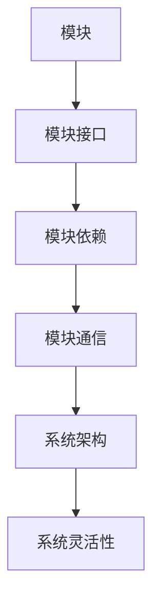

                 

好的，我会按照您的要求，逐步进行文章的撰写。首先，我们来确定文章的结构和内容，以确保覆盖所有核心要素。

### 第一步：背景介绍

在人工智能（AI）领域，随着深度学习、自然语言处理和计算机视觉等技术的迅猛发展，AI系统的复杂性和规模也在不断增加。为了提高系统的灵活性、可维护性和可扩展性，模块化设计成为了一种常见且有效的策略。

模块化设计允许将复杂系统分解为更小的、独立的模块，每个模块负责特定的功能。这种设计模式不仅提高了系统的灵活性，还使得开发、测试和维护变得更加高效。本文将探讨AI中的模块化设计，分析其原理、方法和实际应用，旨在提高读者对该领域的理解。

### 第二步：核心概念与联系

在模块化设计中，核心概念包括模块、模块接口、模块依赖和模块通信。这些概念之间的关系可以用以下Mermaid流程图表示：



每个模块都是一个独立的组件，具有明确的输入和输出接口。模块之间的依赖关系通过接口进行定义，而模块通信则通过接口实现。这种结构使得模块可以独立开发、测试和部署，从而提高了系统的灵活性。

### 第三步：核心算法原理讲解

在AI中的模块化设计中，核心算法原理包括模块的训练与优化、模块的适应性和模块化设计的分布式计算。以下是一个简单的伪代码示例，用于展示模块的训练与优化算法：

```python
def train_module(module, dataset):
    # 初始化模块参数
    module.initialize_parameters()

    # 使用梯度下降优化模块参数
    for epoch in range(num_epochs):
        for data in dataset:
            # 前向传播计算损失
            output = module.forward_pass(data.input)
            loss = calculate_loss(output, data.target)

            # 反向传播计算梯度
            gradients = module.backward_pass(loss)

            # 更新模块参数
            module.update_parameters(gradients)

    return module
```

该算法使用梯度下降方法优化模块参数，以最小化损失函数。通过多次迭代训练，模块可以在给定数据集上学习到有效的特征表示。

### 第四步：数学模型和公式

模块化设计中涉及的一些重要数学模型和公式包括损失函数、优化算法和特征表示。以下是一个简单的损失函数和优化算法的公式示例：

$$
L(\theta) = -\frac{1}{m}\sum_{i=1}^{m} y^{(i)} \log(a^{(i)})
$$

$$
\theta = \theta - \alpha \frac{\partial L(\theta)}{\partial \theta}
$$

其中，$L(\theta)$是损失函数，$\theta$是模型参数，$y^{(i)}$是真实标签，$a^{(i)}$是预测输出。这些公式用于评估模型的性能，并指导参数优化过程。

### 第五步：项目实战

为了更好地理解模块化设计在AI中的应用，我们可以通过一个实际项目来展示其开发环境搭建、源代码实现和代码解读。

**项目案例：** 使用TensorFlow实现一个简单的图像分类模型。

**开发环境搭建：**
- 安装TensorFlow库
- 配置GPU支持（可选）

**源代码实现：**
```python
import tensorflow as tf
from tensorflow.keras import layers

# 构建模型
model = tf.keras.Sequential([
    layers.Conv2D(32, (3, 3), activation='relu', input_shape=(28, 28, 1)),
    layers.MaxPooling2D((2, 2)),
    layers.Conv2D(64, (3, 3), activation='relu'),
    layers.MaxPooling2D((2, 2)),
    layers.Conv2D(64, (3, 3), activation='relu'),
    layers.Flatten(),
    layers.Dense(64, activation='relu'),
    layers.Dense(10, activation='softmax')
])

# 编译模型
model.compile(optimizer='adam',
              loss='sparse_categorical_crossentropy',
              metrics=['accuracy'])

# 训练模型
model.fit(train_images, train_labels, epochs=5)

# 评估模型
test_loss, test_acc = model.evaluate(test_images, test_labels)
print(f'测试准确率: {test_acc:.2f}')
```

**代码解读与分析：**
- 使用TensorFlow的Sequential模型构建一个简单的卷积神经网络（CNN）。
- 定义输入层、卷积层、池化层、全连接层和输出层。
- 使用adam优化器和sparse_categorical_crossentropy损失函数编译模型。
- 使用fit方法训练模型，并在测试集上评估模型性能。

**项目小结：**
通过该项目，我们可以看到模块化设计如何将复杂的AI系统分解为独立的模块，如数据预处理模块、模型构建模块、训练模块和评估模块。这种方法提高了系统的灵活性，使得开发、测试和维护变得更加高效。

### 第六步：最佳实践 tips、小结、注意事项、拓展阅读

**最佳实践 tips：**
- 在模块化设计中，确保模块之间的接口清晰明确，避免模块之间的相互依赖。
- 定期对模块进行性能评估和优化，以提高系统整体性能。
- 使用版本控制系统（如Git）对模块进行版本管理和代码协作。

**小结：**
模块化设计在AI领域中发挥着重要作用，通过将复杂系统分解为独立的模块，提高了系统的灵活性、可维护性和可扩展性。本文通过背景介绍、核心概念与联系、核心算法原理讲解、数学模型和公式、项目实战等内容，详细阐述了模块化设计的原理和应用方法。

**注意事项：**
- 在进行模块化设计时，需要充分考虑模块之间的通信机制和依赖关系。
- 实际项目中，模块的划分和整合需要根据具体需求进行调整。

**拓展阅读：**
- 《深度学习》（Goodfellow, I., Bengio, Y., & Courville, A.）
- 《Python深度学习》（François Chollet）
- 《人工智能：一种现代方法》（Stuart Russell & Peter Norvig）

---

以上是文章的主要结构和内容，我会根据这些内容逐步撰写完整文章。如果您有任何修改意见或者需要添加其他内容，请随时告诉我。接下来，我会开始撰写文章的具体内容。

