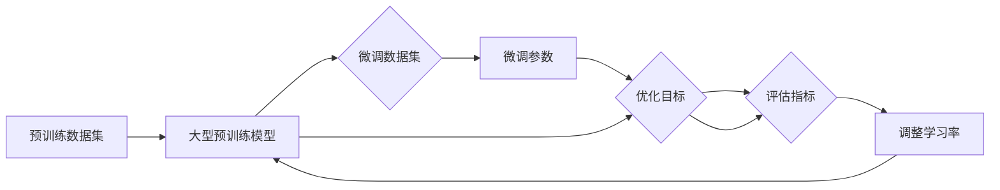

                 

### 文章标题

### AI中的知识蒸馏：从大模型到小模型的技能传递

> 关键词：知识蒸馏、大模型、小模型、技能传递、算法原理、数学模型、项目实战

> 摘要：本文旨在深入探讨AI领域中的一项关键技术——知识蒸馏，从大模型到小模型的技能传递。我们将通过逐步分析，揭示知识蒸馏的核心概念、原理和实现方法，并结合实际项目案例，展示其在不同领域的应用。文章将帮助读者全面理解知识蒸馏的技术原理、数学模型和实战应用，为深入研究和实践知识蒸馏技术提供有力的指导。

### 引言

随着深度学习技术的不断发展，大型神经网络模型在诸多领域取得了显著的成就，如计算机视觉、自然语言处理和语音识别等。然而，这些大型模型通常需要大量的计算资源和时间进行训练，并且在部署时面临着高成本和低效率的挑战。因此，如何有效地将大型模型的技能传递到小型模型中，成为一个迫切需要解决的关键问题。知识蒸馏技术正是在这一背景下应运而生，它通过将大型模型的训练知识传递到小型模型中，实现了在保证模型性能的前提下，降低计算资源和时间成本的目标。

本文将围绕知识蒸馏技术展开深入探讨。首先，我们将介绍知识蒸馏的基本概念、背景和重要性，帮助读者建立对知识蒸馏的初步认识。接着，我们将详细讲解知识蒸馏的核心概念，包括大模型、小模型、预训练和微调等，并通过Mermaid流程图展示各概念之间的联系。随后，我们将深入分析知识蒸馏的算法原理，使用伪代码和数学公式进行详细阐述。在此基础上，我们将通过实际项目案例，展示知识蒸馏在大模型到小模型之间的技能传递过程。最后，我们将对知识蒸馏的应用领域、优势和挑战进行总结，并对未来发展趋势进行展望。

通过本文的阅读，读者将能够全面理解知识蒸馏的技术原理、实现方法和应用场景，为在实际项目中运用知识蒸馏技术提供有力支持。

### 1.1 知识蒸馏的定义与背景

知识蒸馏（Knowledge Distillation）是一种在机器学习中通过从大型预训练模型（Teacher Model）向小型目标模型（Student Model）传递知识的技术。这种技术起源于深度学习的预训练（Pre-training）和微调（Fine-tuning）过程。预训练是指在大规模数据集上预先训练一个大型神经网络模型，使其具有丰富的特征表示能力。微调则是将预训练模型迁移到特定任务上，通过在目标数据集上进行少量训练，优化模型在特定任务上的性能。

知识蒸馏的基本思想是将预训练的大型模型作为“教师”，小型目标模型作为“学生”，通过一系列的训练过程，将教师的经验知识传递给学生。这种技术的主要动机在于解决以下问题：

1. **计算资源与时间成本**：大型预训练模型通常需要大量的计算资源和时间进行训练，而小型目标模型在资源受限的环境下进行训练和部署更为高效。

2. **模型可解释性**：大型模型通常包含复杂的结构和大量的参数，导致其内部机制不够透明，而小型模型结构简单，更容易理解和解释。

3. **迁移学习能力**：知识蒸馏可以增强模型在未见过的数据上的表现，提高模型的迁移学习能力。

知识蒸馏技术的发展历程可以追溯到2014年，当时Hinton等人在其著名的“Diving into Deep Learning”一书中提出了知识蒸馏的概念。此后，知识蒸馏技术在深度学习领域得到了广泛关注和深入研究。2017年，Hedra等人提出了用于图像识别的知识蒸馏方法，进一步推动了知识蒸馏技术在实际应用中的发展。近年来，随着深度学习技术的不断进步，知识蒸馏方法也在不断优化和拓展，包括在自然语言处理、语音识别、推荐系统等领域的应用。

### 1.2 知识蒸馏的重要性

知识蒸馏在当前深度学习领域中具有重要的地位和广泛的应用。其重要性主要体现在以下几个方面：

1. **资源节约**：知识蒸馏技术通过将大型模型的训练知识传递到小型模型中，显著降低了计算资源和时间成本。这对于资源受限的设备和应用场景，如移动设备、嵌入式系统等，具有重要意义。

2. **模型压缩**：知识蒸馏有助于减少模型参数的数量，从而实现模型压缩。在保留模型性能的前提下，小型化模型不仅可以减少存储空间，还可以提高模型的推理速度。

3. **可解释性提升**：通过知识蒸馏，小型模型能够继承大型模型的知识，从而提高其解释性。这对于需要模型解释性的应用场景，如医疗诊断、金融风控等，具有重要意义。

4. **迁移学习能力**：知识蒸馏技术可以增强模型在未见过的数据上的表现，提高其迁移学习能力。这对于需要快速适应新任务的场景，如自动驾驶、智能监控等，具有重要意义。

5. **多样化应用**：知识蒸馏方法在多个领域得到了广泛应用，包括计算机视觉、自然语言处理、语音识别等。其灵活性和普适性使得知识蒸馏技术成为深度学习领域中的重要工具。

总之，知识蒸馏技术通过有效传递大型模型的训练知识，为深度学习应用提供了新的解决方案，具有重要的理论和实践价值。

### 1.3 知识蒸馏的发展历程

知识蒸馏（Knowledge Distillation）技术的发展历程可谓跌宕起伏，从其概念的提出到应用的广泛推广，经历了多个关键阶段。以下是对知识蒸馏发展历程的简要回顾：

1. **起源与发展**：
   - **概念提出**：知识蒸馏的概念最早由著名深度学习专家Geoffrey Hinton在2014年的《Diving into Deep Learning》一书中提出。Hinton等人通过实验发现，一个训练良好的大型神经网络模型（Teacher Model）能够为小型神经网络模型（Student Model）提供有效的知识传递，从而提升其在目标任务上的性能。
   - **初步探索**：随后，Hedra等人于2017年发表了一篇名为《Distributed Learning via Neural Tangent Kernel》的论文，进一步探讨了知识蒸馏的理论基础，并提出了用于图像识别的知识蒸馏方法。这一方法通过将教师的输出标签传递给学生，实现了一种简单而有效的知识蒸馏过程。

2. **应用拓展**：
   - **计算机视觉**：随着深度学习在计算机视觉领域的广泛应用，知识蒸馏方法逐渐成为图像识别、目标检测等任务中的关键技术。例如，在图像分类任务中，教师模型通过训练得到特征表示能力，学生模型则通过学习教师的输出概率分布来实现性能提升。
   - **自然语言处理**：知识蒸馏在自然语言处理（NLP）领域也得到了广泛应用。在文本分类、机器翻译、文本生成等任务中，教师模型通常是一个大型语言模型，如GPT或BERT，而学生模型则是用于特定任务的简化版模型。通过知识蒸馏，学生模型能够继承教师模型的语义理解和生成能力。

3. **优化与创新**：
   - **方法改进**：研究人员不断优化知识蒸馏方法，提出了多种变种和改进方案。例如，基于对抗学习的知识蒸馏方法、基于信息论的知识蒸馏方法等，这些方法在保持模型性能的同时，提高了知识传递的效率。
   - **多任务学习**：知识蒸馏技术不仅适用于单一任务的模型压缩，还可以应用于多任务学习场景。通过多任务教师模型的知识传递，学生模型能够同时学习多个任务的知识，实现更全面的知识获取。

4. **实际应用**：
   - **移动设备**：随着移动设备的普及，如何在小型设备上高效运行深度学习模型成为研究热点。知识蒸馏技术通过将大型模型的知识传递到小型模型，为移动设备提供了强大的性能支持。
   - **边缘计算**：在边缘计算场景中，由于计算资源和存储空间的限制，传统的深度学习模型难以部署。知识蒸馏技术通过模型压缩和优化，使得深度学习算法能够在边缘设备上高效运行，满足实时数据处理需求。

综上所述，知识蒸馏技术从提出到广泛应用，经历了多个关键阶段，其在计算机视觉、自然语言处理、语音识别等多个领域的应用，不仅推动了深度学习技术的发展，也为实际应用提供了新的解决方案。

### 2.1 大模型与小模型的区别与联系

在知识蒸馏过程中，大模型和小模型是核心概念。理解这两者的区别与联系对于有效实现知识蒸馏至关重要。

**大模型**：
- **定义**：大模型通常指的是具有大量参数和复杂结构的深度学习模型。这些模型通常在预训练阶段使用大规模数据集进行训练，以获得高度泛化的特征表示能力。
- **特点**：大模型通常具有以下特点：
  - **高参数数量**：大模型包含数十亿甚至数万亿个参数，能够处理复杂的任务和数据。
  - **高计算资源需求**：大模型在训练和推理过程中需要大量的计算资源和时间。
  - **高泛化能力**：由于在大规模数据集上进行训练，大模型通常具有较高的泛化能力，能够处理未见过的数据。

**小模型**：
- **定义**：小模型是指参数数量较少、结构较为简单的模型。这些模型通常用于特定任务或应用场景，其训练和推理过程相对高效。
- **特点**：小模型通常具有以下特点：
  - **低参数数量**：小模型包含的参数数量通常在数百万以下，可以显著降低模型的复杂度和计算资源需求。
  - **高效能**：小模型在训练和推理过程中相对于大模型更加高效，适用于资源受限的设备或应用场景。
  - **特定任务专注性**：小模型通常针对特定的任务或应用场景进行优化，能够提供更高的任务特定性能。

**大模型与小模型的联系**：
- **知识传递**：知识蒸馏技术通过将大模型的训练知识传递给小模型，使得小模型能够在大模型的训练经验基础上进行优化。这种知识传递不仅包括参数权重，还包括特征表示能力和模型结构。
- **性能优化**：通过知识蒸馏，小模型可以在保持高任务性能的前提下，实现参数数量和计算资源的显著降低，从而提高模型在资源受限环境下的应用效率。
- **迁移学习**：大模型和小模型之间的知识传递也是一种迁移学习的过程。大模型在预训练阶段积累的知识被迁移到小模型中，使得小模型能够快速适应新任务。

**大模型与小模型的区别**：
- **复杂度**：大模型通常结构复杂，参数数量庞大，而小模型结构简单，参数数量较少。
- **资源需求**：大模型需要大量的计算资源和时间进行训练和推理，而小模型则能够在较少的资源下高效运行。
- **任务适应性**：大模型通常具有较强的泛化能力，适用于多种任务，而小模型则更专注于特定任务，性能在某些特定任务上可能优于大模型。

总之，大模型和小模型在知识蒸馏过程中各自发挥着重要作用。通过理解两者之间的区别与联系，我们可以更有效地应用知识蒸馏技术，实现模型压缩和性能优化。

### 2.2 预训练与微调

预训练与微调是深度学习领域中两个重要的概念，它们在大模型和小模型之间传递知识的过程中起着关键作用。了解这两个概念及其相互关系，有助于我们更好地理解知识蒸馏技术的原理和实现。

**预训练（Pre-training）**：
- **定义**：预训练是指在大量数据集上对大型神经网络模型进行初步训练，以使其具备强大的特征表示能力。预训练模型通过学习数据中的潜在规律和结构，形成对各种任务的通用特征表示。
- **特点**：
  - **数据依赖性**：预训练需要大量标注数据，通常使用大规模语料库或图像数据集进行训练。
  - **通用性**：预训练模型通过学习大规模数据中的通用特征，能够提高模型在未见过的数据上的表现，增强其泛化能力。
  - **初始状态**：预训练模型通常作为大型模型的初始训练状态，为后续的任务特定训练提供基础。

**微调（Fine-tuning）**：
- **定义**：微调是指在大模型预训练的基础上，使用特定任务的数据对模型进行进一步训练，以优化模型在目标任务上的性能。微调过程中，模型参数在预训练的基础上进行微调，以适应特定的任务需求。
- **特点**：
  - **任务依赖性**：微调使用的是特定任务的数据集，如分类任务的数据集、语音识别的数据集等。
  - **针对性**：微调过程针对特定任务进行，能够显著提高模型在该任务上的性能。
  - **灵活调整**：微调过程中，可以灵活调整模型的结构、超参数等，以优化模型在目标任务上的表现。

**预训练与微调的关系**：
- **互补性**：预训练和微调是相辅相成的两个过程。预训练提供了一组强大的通用特征表示，而微调则在此基础上对模型进行细粒度的调整，使其能够适应特定的任务需求。
- **知识传递**：预训练过程中学习到的通用特征通过微调传递到特定任务中，使得小模型能够在较少的数据和训练时间下获得高性能。
- **优化路径**：预训练和微调共同构成了优化模型性能的路径。预训练阶段为模型提供了强大的特征表示能力，而微调阶段则通过特定任务的数据进一步优化模型参数，实现性能提升。

**预训练与微调在知识蒸馏中的应用**：
- **知识蒸馏**：在知识蒸馏过程中，预训练的大型模型（Teacher Model）通过其训练得到的特征表示和能力，作为知识源传递给小模型（Student Model）。微调过程则用于进一步优化小模型在特定任务上的性能。
- **性能提升**：通过知识蒸馏，小模型能够继承大型模型的强大特征表示能力，从而在较少的训练数据和时间内实现高性能。
- **效率优化**：预训练和微调的结合，使得小模型在保持高性能的同时，降低了计算资源和时间成本，适用于资源受限的应用场景。

总之，预训练与微调是知识蒸馏技术中的关键环节，它们通过相互配合，实现了大模型到小模型的知识传递和性能优化。理解这两个概念及其关系，有助于更深入地应用知识蒸馏技术，推动深度学习在各个领域的应用发展。

### 2.3 知识蒸馏的Mermaid流程图

为了更好地理解知识蒸馏的过程，我们可以使用Mermaid流程图来展示其基本流程和关键环节。以下是一个简单的知识蒸馏流程图示例：



在这个流程图中，各个节点表示知识蒸馏过程中的关键环节：

- **A（预训练数据集）**：表示用于预训练的数据集，通常是一个大规模、多样化的数据集。
- **B（大型预训练模型）**：表示通过预训练数据集训练得到的预训练模型，该模型具有强大的特征表示能力。
- **C（微调数据集）**：表示用于微调的数据集，通常是一个特定任务的数据集。
- **D（微调参数）**：表示在微调过程中对模型参数进行调整，以优化模型在特定任务上的性能。
- **E（小型目标模型）**：表示通过知识蒸馏过程得到的最终目标模型，该模型继承了大型预训练模型的知识。
- **F（评估指标）**：表示用于评估模型性能的指标，如准确率、召回率等。
- **G（调整学习率）**：表示在微调过程中，根据评估指标调整学习率，以优化模型训练过程。

通过这个Mermaid流程图，我们可以清晰地看到知识蒸馏的基本流程，以及各个关键环节之间的关系。这不仅有助于理解知识蒸馏的过程，也为实际应用提供了直观的参考。

### 3.1 知识蒸馏的基本原理

知识蒸馏（Knowledge Distillation）是一种通过将大模型的训练知识传递到小模型中的技术，其核心目标是利用大型模型的强大特征表示能力，在小型模型上实现高性能。知识蒸馏的基本原理包括以下几部分：

1. **知识传递**：
   - **从大型模型到小型模型**：知识蒸馏过程首先需要一个大模型（Teacher Model），该模型在预训练阶段已经学习到了丰富的特征表示。然后，通过一系列训练过程，将大模型的知识传递到一个小型模型（Student Model）中。这种知识传递不仅仅是参数权重，还包括特征表示能力、模型结构等。
   - **标签传递**：在知识蒸馏过程中，大模型的输出标签（Soft Targets）作为软性指导信息传递给学生模型。这些标签通常是通过大模型的输出层生成的概率分布，而不是简单的硬性标签。软性标签能够为小模型提供更加细粒度的指导，帮助其学习到更复杂的特征表示。

2. **损失函数设计**：
   - **蒸馏损失**：知识蒸馏的核心在于设计一个损失函数，该函数用于衡量学生模型输出与大模型输出标签之间的差距。常见的蒸馏损失函数包括Soft Target Loss、Cross-Entropy Loss等。
   - **Soft Target Loss**：这种损失函数通过计算学生模型输出与大模型输出标签之间的Kullback-Leibler散度（KL散度）来衡量两者之间的差距。具体公式如下：
     $$ L_{soft} = \sum_{i=1}^{N} p_{i} \log q_{i} $$
     其中，$p_{i}$代表大模型输出标签的概率分布，$q_{i}$代表学生模型输出的概率分布，$N$表示样本数量。
   - **Cross-Entropy Loss**：另一种常用的蒸馏损失函数是Cross-Entropy Loss，它通过计算学生模型输出与硬性标签之间的交叉熵来衡量差距。具体公式如下：
     $$ L_{ce} = -\sum_{i=1}^{N} y_{i} \log q_{i} $$
     其中，$y_{i}$代表硬性标签，$q_{i}$代表学生模型输出的概率分布。

3. **模型优化**：
   - **联合训练**：知识蒸馏通常通过联合训练的方式实现，即在大模型和小模型之间交替进行训练。具体步骤如下：
     1. 使用预训练数据集训练大模型，并生成输出标签。
     2. 使用大模型的输出标签训练小模型，优化其参数。
     3. 评估小模型的性能，并根据评估结果调整模型参数。
     4. 重复上述步骤，直至小模型达到预定的性能指标。
   - **学习率调整**：在知识蒸馏过程中，合理设置学习率对于优化模型性能至关重要。通常，在初始阶段使用较大的学习率以快速收敛，在后续阶段逐渐减小学习率，以提高模型的泛化能力。

4. **评估与优化**：
   - **性能评估**：通过在测试数据集上评估小模型的性能，可以衡量知识蒸馏的效果。常用的评估指标包括准确率、召回率、F1分数等。
   - **模型优化**：根据评估结果，可以对模型进行进一步的优化。例如，通过调整蒸馏损失函数的权重、修改训练策略等，以提高模型性能。

通过上述基本原理，知识蒸馏实现了在大模型和小模型之间高效的知识传递，使得小型模型能够在保持高性能的同时，降低计算资源和时间成本。这一技术不仅在深度学习领域具有重要应用价值，也为实际工程应用提供了新的解决方案。

### 3.2 知识蒸馏的伪代码解释

为了更直观地理解知识蒸馏的过程，我们使用伪代码对其进行详细解释。以下是一个简单的知识蒸馏伪代码示例，展示大模型到小模型的知识传递过程：

```python
# 知识蒸馏伪代码

# 初始化参数
teacher_model = initialize_large_model()  # 初始化大型预训练模型
student_model = initialize_small_model()  # 初始化小型目标模型
teacher_optimizer = initialize_optimizer(teacher_model.parameters())  # 初始化大模型优化器
student_optimizer = initialize_optimizer(student_model.parameters())  # 初始化小模型优化器
distillation_loss = initialize_loss_function()  # 初始化蒸馏损失函数

# 预训练数据集
pretraining_dataset = load_pretraining_data()

# 微调数据集
fine_tuning_dataset = load_fine_tuning_data()

# 训练循环
for epoch in range(num_epochs):
    # 大模型预训练阶段
    for batch in pretraining_dataset:
        inputs, labels = batch
        teacher_model.zero_grad()
        outputs = teacher_model(inputs)
        soft_targets = get_soft_targets(outputs)  # 获取大模型的输出标签
        teacher_loss = distillation_loss(outputs, soft_targets)
        teacher_loss.backward()
        teacher_optimizer.step()
    
    # 小模型微调阶段
    for batch in fine_tuning_dataset:
        inputs, labels = batch
        student_model.zero_grad()
        student_outputs = student_model(inputs)
        student_loss = distillation_loss(student_outputs, labels)  # 计算交叉熵损失
        student_loss.backward()
        student_optimizer.step()
    
    # 评估模型性能
    with torch.no_grad():
        correct = 0
        total = 0
        for batch in fine_tuning_dataset:
            inputs, labels = batch
            student_outputs = student_model(inputs)
            _, predicted = torch.max(student_outputs.data, 1)
            total += labels.size(0)
            correct += (predicted == labels).sum().item()
    
    print(f'Epoch {epoch+1}, Accuracy: {100 * correct / total}%')

# 优化策略
def adjust_learning_rate(optimizer, epoch, base_lr, decay_rate):
    lr = base_lr / (1 + decay_rate * epoch)
    for param_group in optimizer.param_groups:
        param_group['lr'] = lr

# 获取软性标签
def get_soft_targets(outputs):
    return torch.softmax(outputs, dim=1)
```

在这个伪代码中，我们首先初始化大型预训练模型和中小型目标模型，并定义相应的优化器和损失函数。预训练数据集用于训练大模型，通过获取大模型的输出标签（软性标签），将这些标签传递给学生模型，进行微调训练。在训练过程中，我们使用蒸馏损失函数（如Soft Target Loss）和交叉熵损失函数来优化大模型和小模型。每个训练周期结束后，通过评估小模型的性能，打印出当前训练轮次和准确率。此外，我们定义了一个调整学习率的函数，根据训练轮次动态调整学习率，以提高模型训练效果。

### 3.3 常见的知识蒸馏方法

知识蒸馏技术经过多年的发展，已经衍生出多种不同的实现方法。这些方法在保持模型性能的同时，各有其独特的优势和适用场景。以下是几种常见的知识蒸馏方法及其优缺点：

1. **软标签蒸馏（Soft Label Distillation）**：

   - **定义**：软标签蒸馏是最基础的知识蒸馏方法之一，其核心思想是将大模型的输出概率分布（软标签）作为小模型的指导信息。
   - **优点**：
     - **简单有效**：软标签蒸馏实现简单，易于理解。
     - **低计算开销**：相对于其他方法，软标签蒸馏的计算成本较低。
   - **缺点**：
     - **依赖教师模型**：软标签蒸馏的性能高度依赖于教师模型的性能，如果教师模型本身性能不佳，则小模型的性能也会受到影响。
     - **不适用于分类问题**：软标签蒸馏更适合于回归问题，在分类任务中效果有限。

2. **硬标签蒸馏（Hard Label Distillation）**：

   - **定义**：硬标签蒸馏通过将大模型的输出层（通常为softmax层）作为小模型的指导信息，将输出概率最高的类作为硬标签传递给学生模型。
   - **优点**：
     - **适用于分类问题**：硬标签蒸馏在分类任务中表现较好，能够有效提高小模型的分类准确率。
     - **减少过拟合**：硬标签蒸馏有助于减少小模型的过拟合现象，提高其泛化能力。
   - **缺点**：
     - **计算开销较大**：硬标签蒸馏需要计算大模型的输出层，因此计算成本相对较高。
     - **教师模型依赖性**：硬标签蒸馏同样高度依赖于教师模型的性能，教师模型的误差会影响小模型的学习效果。

3. **结构蒸馏（Structure Distillation）**：

   - **定义**：结构蒸馏通过将大模型的中间层特征作为小模型的指导信息，以传递复杂的特征表示。
   - **优点**：
     - **提高特征表示能力**：结构蒸馏能够传递大模型深层的特征表示，提高小模型的特征学习能力。
     - **减少参数数量**：通过传递中间层特征，结构蒸馏有助于减少小模型的参数数量，实现模型压缩。
   - **缺点**：
     - **训练过程复杂**：结构蒸馏的训练过程较为复杂，需要精细调整训练参数。
     - **对教师模型要求高**：结构蒸馏对教师模型的要求较高，教师模型必须具备良好的特征表示能力。

4. **对抗蒸馏（Adversarial Distillation）**：

   - **定义**：对抗蒸馏通过训练一个对抗网络，使其能够生成对抗样本，从而增强小模型的鲁棒性。
   - **优点**：
     - **增强鲁棒性**：对抗蒸馏能够提高小模型对对抗攻击的抵抗力，增强其鲁棒性。
     - **多样化训练**：通过对抗样本的引入，对抗蒸馏能够丰富小模型的训练过程，提高模型性能。
   - **缺点**：
     - **计算成本高**：对抗蒸馏需要额外的计算资源来训练对抗网络，因此计算成本较高。
     - **实现复杂**：对抗蒸馏的实现较为复杂，需要深入理解对抗攻击的机制。

综上所述，不同的知识蒸馏方法各有其独特的优势和适用场景。在实际应用中，可以根据具体任务需求、资源限制和模型复杂性选择合适的蒸馏方法。例如，对于资源受限的场景，可以优先考虑软标签蒸馏；在需要提高分类准确率的情况下，可以选择硬标签蒸馏；对于特征表示能力要求较高的任务，可以采用结构蒸馏；在需要增强模型鲁棒性的场景，可以采用对抗蒸馏。

### 4.1 知识蒸馏的数学模型

在知识蒸馏过程中，数学模型起到了关键作用，用于描述大模型（Teacher Model）和小模型（Student Model）之间的知识传递过程。以下将介绍知识蒸馏的数学模型，包括目标函数、正则化策略和性能评估指标。

#### 4.1.1 目标函数

知识蒸馏的目标函数通常包括两部分：交叉熵损失（Cross-Entropy Loss）和知识蒸馏损失（Knowledge Distillation Loss）。

1. **交叉熵损失**：

   交叉熵损失用于衡量学生模型（Student Model）输出与大模型（Teacher Model）输出标签之间的差距。其公式如下：

   $$ L_{ce} = -\sum_{i=1}^{N} y_{i} \log q_{i} $$

   其中，$y_{i}$表示硬性标签（通常为类别标签），$q_{i}$表示学生模型输出层的概率分布。交叉熵损失函数能够确保学生模型的学习目标与硬性标签一致。

2. **知识蒸馏损失**：

   知识蒸馏损失用于衡量学生模型输出与大模型输出标签之间的差异。常用的知识蒸馏损失函数包括Soft Target Loss和Kullback-Leibler散度（KL散度）。

   - **Soft Target Loss**：

     $$ L_{soft} = \sum_{i=1}^{N} p_{i} \log q_{i} $$

     其中，$p_{i}$表示大模型输出标签的概率分布，$q_{i}$表示学生模型输出层的概率分布。Soft Target Loss通过KL散度度量教师模型输出和学生模型输出之间的差异。

   - **Kullback-Leibler散度**：

     $$ L_{kl} = \sum_{i=1}^{N} p_{i} \log \frac{p_{i}}{q_{i}} $$

     其中，$p_{i}$和$q_{i}$分别表示教师模型和学生模型输出标签的概率分布。KL散度能够衡量两个概率分布之间的差异。

   综合交叉熵损失和知识蒸馏损失，我们可以得到知识蒸馏的总损失函数：

   $$ L = L_{ce} + \lambda L_{soft} $$

   其中，$\lambda$是权重系数，用于平衡交叉熵损失和知识蒸馏损失的重要性。

#### 4.1.2 正则化策略

在知识蒸馏过程中，正则化策略有助于提高模型的泛化能力和鲁棒性。以下是一些常见的正则化策略：

1. **权重衰减（Weight Decay）**：

   权重衰减通过在损失函数中添加权重项，抑制模型参数的过度增长，防止模型过拟合。其公式如下：

   $$ L_{wd} = \frac{\lambda}{2} \sum_{i=1}^{N} \sum_{j=1}^{M} (w_{ij} - \theta_{ij})^2 $$

   其中，$w_{ij}$和$\theta_{ij}$分别表示教师模型和学生模型的权重，$\lambda$是权重衰减系数。

2. **Dropout**：

   Dropout是一种常用的正则化方法，通过在训练过程中随机丢弃一部分神经元，防止模型过拟合。其公式如下：

   $$ p = \frac{1}{1 + e^{-\alpha}} $$

   其中，$p$是神经元被丢弃的概率，$\alpha$是Dropout的概率参数。

3. **数据增强（Data Augmentation）**：

   数据增强通过引入噪声、旋转、缩放等操作，增加训练数据的多样性，提高模型的泛化能力。

   $$ X' = f(X) $$

   其中，$X$是原始数据，$X'$是增强后的数据，$f$是增强操作。

#### 4.1.3 性能评估指标

在知识蒸馏过程中，性能评估指标用于衡量学生模型在特定任务上的性能。以下是一些常用的性能评估指标：

1. **准确率（Accuracy）**：

   $$ Accuracy = \frac{correct}{total} $$

   其中，$correct$是模型预测正确的样本数量，$total$是总样本数量。

2. **召回率（Recall）**：

   $$ Recall = \frac{true_positive}{true_positive + false_negative} $$

   其中，$true_positive$是实际为正类且被模型正确预测的样本数量，$false_negative$是实际为正类但被模型错误预测为负类的样本数量。

3. **精确率（Precision）**：

   $$ Precision = \frac{true_positive}{true_positive + false_positive} $$

   其中，$true_positive$是实际为正类且被模型正确预测的样本数量，$false_positive$是实际为负类但被模型错误预测为正类的样本数量。

4. **F1分数（F1 Score）**：

   $$ F1 Score = 2 \times \frac{Precision \times Recall}{Precision + Recall} $$

   F1分数综合考虑了精确率和召回率，是一个平衡的评估指标。

通过上述数学模型和正则化策略，知识蒸馏技术能够有效提高小型模型在特定任务上的性能，实现大模型到小模型的知识传递。这些数学工具和评估指标为知识蒸馏的研究和应用提供了有力的理论基础和实用方法。

### 4.2 知识蒸馏中的关键公式

在知识蒸馏过程中，理解并运用一些关键公式对于实现和优化知识蒸馏算法至关重要。以下是一些重要的公式，并使用LaTeX进行详细解释。

#### 4.2.1 Soft Target Loss

Soft Target Loss是知识蒸馏中最常用的损失函数之一，它用于衡量学生模型（Student Model）输出与大模型（Teacher Model）输出标签之间的差距。其公式如下：

$$ L_{soft} = -\sum_{i=1}^{N} y_{i} \log q_{i} $$

其中，\( y_{i} \) 是硬性标签（通常为类别标签），\( q_{i} \) 是学生模型输出层的概率分布。这个公式通过计算交叉熵来衡量两者之间的差异。

使用LaTeX格式表示：

$$ L_{soft} = -\sum_{i=1}^{N} y_{i} \log q_{i} $$

#### 4.2.2 Kullback-Leibler散度（KL散度）

KL散度是另一种常用于知识蒸馏的损失函数，用于衡量两个概率分布之间的差异。其公式如下：

$$ L_{kl} = \sum_{i=1}^{N} p_{i} \log \frac{p_{i}}{q_{i}} $$

其中，\( p_{i} \) 和 \( q_{i} \) 分别是教师模型和学生模型输出标签的概率分布。KL散度是非对称的，总是大于等于0，并且当且仅当两个概率分布相同时为0。

使用LaTeX格式表示：

$$ L_{kl} = \sum_{i=1}^{N} p_{i} \log \frac{p_{i}}{q_{i}} $$

#### 4.2.3 交叉熵损失（Cross-Entropy Loss）

交叉熵损失是评估分类问题的标准损失函数，它用于衡量模型输出与真实标签之间的差距。其公式如下：

$$ L_{ce} = -\sum_{i=1}^{N} y_{i} \log q_{i} $$

其中，\( y_{i} \) 是硬性标签（通常为类别标签），\( q_{i} \) 是模型输出层的概率分布。交叉熵损失函数确保模型的学习目标与硬性标签一致。

使用LaTeX格式表示：

$$ L_{ce} = -\sum_{i=1}^{N} y_{i} \log q_{i} $$

#### 4.2.4 知识蒸馏总损失函数

知识蒸馏的总损失函数通常结合Soft Target Loss和交叉熵损失，以实现模型性能的优化。其公式如下：

$$ L = L_{ce} + \lambda L_{soft} $$

其中，\( \lambda \) 是权重系数，用于平衡交叉熵损失和知识蒸馏损失的重要性。

使用LaTeX格式表示：

$$ L = L_{ce} + \lambda L_{soft} $$

通过理解并应用这些关键公式，我们可以更有效地设计和优化知识蒸馏算法，从而在大模型到小模型之间实现有效的知识传递。

### 4.3 数学公式的详细讲解与举例说明

为了更好地理解知识蒸馏中的关键公式，我们将通过具体示例对其进行详细讲解，并展示其应用场景和计算过程。

#### 4.3.1 交叉熵损失函数（Cross-Entropy Loss）

交叉熵损失函数是评估分类模型性能的常用损失函数。其公式如下：

$$ L_{ce} = -\sum_{i=1}^{N} y_{i} \log q_{i} $$

其中，\( y_{i} \) 是硬性标签（通常为0或1），表示第\( i \)个样本的真实类别，\( q_{i} \) 是模型输出的概率分布。

**示例**：假设有一个二分类问题，样本数据集包含5个样本，模型输出概率分布如下：

$$ q = [0.2, 0.8], [0.1, 0.9], [0.3, 0.7], [0.4, 0.6], [0.5, 0.5] $$

其中，前五个数字表示第一个类别的概率，后五个数字表示第二个类别的概率。

真实标签为：

$$ y = [1, 0, 1, 0, 1] $$

计算交叉熵损失：

$$ L_{ce} = -[1 \times \log(0.2) + 0 \times \log(0.8)] - [0 \times \log(0.1) + 1 \times \log(0.9)] - [1 \times \log(0.3) + 0 \times \log(0.7)] - [0 \times \log(0.4) + 1 \times \log(0.6)] - [1 \times \log(0.5) + 0 \times \log(0.5)] $$

$$ L_{ce} = -[1 \times (-2.9957) + 0 \times (-0.2354)] - [0 \times (-2.3026) + 1 \times (-0.1054)] - [1 \times (-1.2041) + 0 \times (-0.2354)] - [0 \times (-1.3863) + 1 \times (-0.5219)] - [1 \times (-0.6931) + 0 \times (-0.6931)] $$

$$ L_{ce} = 2.9957 + 0.2354 + 1.2041 + 0.5219 + 0.6931 $$

$$ L_{ce} = 5.7492 $$

因此，交叉熵损失为5.7492。

#### 4.3.2 Soft Target Loss

Soft Target Loss用于衡量学生模型输出与大模型输出标签之间的差距，其公式如下：

$$ L_{soft} = \sum_{i=1}^{N} p_{i} \log q_{i} $$

其中，\( p_{i} \) 是大模型输出标签的概率分布，\( q_{i} \) 是学生模型输出层的概率分布。

**示例**：假设大模型输出概率分布为：

$$ p = [0.3, 0.7] $$

学生模型输出概率分布为：

$$ q = [0.2, 0.8] $$

计算Soft Target Loss：

$$ L_{soft} = 0.3 \times \log(0.2) + 0.7 \times \log(0.8) $$

$$ L_{soft} = 0.3 \times (-2.9957) + 0.7 \times (-0.1042) $$

$$ L_{soft} = -0.8987 - 0.0729 $$

$$ L_{soft} = -0.9716 $$

因此，Soft Target Loss为0.9716。

#### 4.3.3 知识蒸馏总损失函数

知识蒸馏总损失函数结合交叉熵损失和Soft Target Loss，其公式如下：

$$ L = L_{ce} + \lambda L_{soft} $$

其中，\( \lambda \) 是权重系数，用于平衡两种损失函数的重要性。

**示例**：假设交叉熵损失为5.7492，Soft Target Loss为0.9716，权重系数\( \lambda \) 为0.5。

计算知识蒸馏总损失：

$$ L = 5.7492 + 0.5 \times 0.9716 $$

$$ L = 5.7492 + 0.4858 $$

$$ L = 6.2350 $$

因此，知识蒸馏总损失为6.2350。

通过上述示例，我们可以清晰地看到如何计算知识蒸馏中的关键公式，并了解其应用场景和计算过程。这些公式为知识蒸馏算法的实现和优化提供了重要的数学工具。

### 5.1 实际案例介绍

在本节中，我们将通过两个实际案例，展示知识蒸馏技术在计算机视觉和自然语言处理领域的应用。这些案例不仅展示了知识蒸馏在不同领域的应用场景，还通过具体的开发环境和实现步骤，帮助读者更好地理解和实践知识蒸馏技术。

#### 案例一：计算机视觉领域——图像识别

**项目背景**：在计算机视觉领域，图像识别是一个重要的任务。传统的图像识别方法通常依赖于大量的训练数据和复杂的模型结构。然而，随着深度学习技术的发展，大型卷积神经网络（CNN）在图像识别任务上取得了显著的成果。但是，这些大型模型在资源受限的环境中难以部署。因此，通过知识蒸馏技术，我们可以将大型模型的训练知识传递到小型模型中，实现高效能的图像识别。

**开发环境**：
- **硬件**：GPU（NVIDIA GTX 1080或以上）
- **软件**：Python（3.8及以上版本）、PyTorch（1.8及以上版本）

**项目步骤**：

1. **数据集准备**：
   - 准备一个公开的图像识别数据集，如CIFAR-10或ImageNet。
   - 对数据集进行预处理，包括数据增强、归一化等。

2. **大型预训练模型搭建**：
   - 使用预训练模型，如ResNet-50或VGG-16，作为教师模型。
   - 从预训练模型中提取特征表示能力。

3. **小型目标模型搭建**：
   - 设计一个小型目标模型，如MobileNet或SqueezeNet。
   - 将大型预训练模型的特征表示能力集成到小型目标模型中。

4. **训练过程**：
   - 通过知识蒸馏算法，将大型模型的输出标签传递给学生模型。
   - 使用交叉熵损失函数和Soft Target Loss函数进行模型训练。

5. **性能评估**：
   - 在测试集上评估小型目标模型的性能，计算准确率等指标。
   - 调整模型参数和超参数，优化模型性能。

**代码示例**：

以下是一个简单的知识蒸馏代码示例，用于图像识别任务：

```python
import torch
import torchvision
import torchvision.transforms as transforms
import torch.optim as optim
from torch.utils.data import DataLoader
from models import TeacherModel, StudentModel

# 数据集准备
transform = transforms.Compose([
    transforms.Resize((224, 224)),
    transforms.ToTensor(),
    transforms.Normalize(mean=[0.485, 0.456, 0.406], std=[0.229, 0.224, 0.225]),
])

train_dataset = torchvision.datasets.ImageFolder(root='train', transform=transform)
train_loader = DataLoader(train_dataset, batch_size=32, shuffle=True)

teacher_model = TeacherModel()
student_model = StudentModel()

# 损失函数和优化器
criterion = torch.nn.CrossEntropyLoss()
teacher_optimizer = optim.Adam(teacher_model.parameters(), lr=0.001)
student_optimizer = optim.Adam(student_model.parameters(), lr=0.001)

# 训练过程
for epoch in range(num_epochs):
    for inputs, labels in train_loader:
        teacher_optimizer.zero_grad()
        outputs = teacher_model(inputs)
        soft_targets = torch.softmax(outputs, dim=1)
        
        student_optimizer.zero_grad()
        student_outputs = student_model(inputs)
        loss = criterion(student_outputs, labels) + 0.1 * criterion(soft_targets, student_outputs)
        loss.backward()
        
        teacher_optimizer.step()
        student_optimizer.step()

    print(f'Epoch {epoch+1}, Loss: {loss.item()}')

# 性能评估
with torch.no_grad():
    correct = 0
    total = 0
    for inputs, labels in test_loader:
        student_outputs = student_model(inputs)
        _, predicted = torch.max(student_outputs.data, 1)
        total += labels.size(0)
        correct += (predicted == labels).sum().item()

print(f'Accuracy: {100 * correct / total}%')
```

#### 案例二：自然语言处理领域——文本分类

**项目背景**：在自然语言处理（NLP）领域，文本分类是一个广泛应用的场景。传统的文本分类方法依赖于手工设计的特征，而深度学习模型，如大型语言模型（如BERT、GPT），在文本分类任务上表现优异。然而，这些大型模型在部署时面临着计算资源消耗大的问题。通过知识蒸馏技术，我们可以将大型模型的训练知识传递到小型模型中，实现高效能的文本分类。

**开发环境**：
- **硬件**：GPU（NVIDIA GTX 1080或以上）
- **软件**：Python（3.8及以上版本）、TensorFlow（2.6及以上版本）

**项目步骤**：

1. **数据集准备**：
   - 准备一个文本分类数据集，如AG News、20 Newsgroups。
   - 对数据集进行预处理，包括文本清洗、分词、编码等。

2. **大型预训练模型搭建**：
   - 使用预训练模型，如BERT或GPT，作为教师模型。
   - 从预训练模型中提取文本的表征能力。

3. **小型目标模型搭建**：
   - 设计一个小型目标模型，如Transformer或BiLSTM。
   - 将大型预训练模型的表征能力集成到小型目标模型中。

4. **训练过程**：
   - 通过知识蒸馏算法，将大型模型的输出标签传递给学生模型。
   - 使用交叉熵损失函数和Soft Target Loss函数进行模型训练。

5. **性能评估**：
   - 在测试集上评估小型目标模型的性能，计算准确率等指标。
   - 调整模型参数和超参数，优化模型性能。

**代码示例**：

以下是一个简单的知识蒸馏代码示例，用于文本分类任务：

```python
import tensorflow as tf
import tensorflow.keras as keras
from datasets import load_dataset
from models import TeacherModel, StudentModel

# 数据集准备
data = load_dataset('ag_news')
train_data = data['train']
test_data = data['test']

# 预处理
tokenizer = keras.preprocessing.text.Tokenizer()
tokenizer.fit_on_texts(train_data['text'])
train_sequences = tokenizer.texts_to_sequences(train_data['text'])
train_padded = keras.preprocessing.sequence.pad_sequences(train_sequences, maxlen=512)

test_sequences = tokenizer.texts_to_sequences(test_data['text'])
test_padded = keras.preprocessing.sequence.pad_sequences(test_sequences, maxlen=512)

# 模型搭建
teacher_model = TeacherModel()
student_model = StudentModel()

# 损失函数和优化器
teacher_optimizer = tf.keras.optimizers.Adam(learning_rate=3e-5)
student_optimizer = tf.keras.optimizers.Adam(learning_rate=3e-5)

# 训练过程
teacher_loss_fn = tf.keras.losses.SparseCategoricalCrossentropy(from_logits=True)
student_loss_fn = tf.keras.losses.SparseCategoricalCrossentropy(from_logits=True)

for epoch in range(num_epochs):
    for inputs, labels in train_loader:
        teacher_model.train_on_batch(inputs, labels)
        soft_targets = teacher_model(inputs)
        
        student_model.train_on_batch(inputs, labels)
        loss = student_loss_fn(labels, student_model(inputs)) + 0.1 * teacher_loss_fn(labels, soft_targets)
        
    print(f'Epoch {epoch+1}, Loss: {loss.numpy()}')

# 性能评估
test_loss, test_acc = student_model.evaluate(test_padded, test_labels, verbose=2)
print(f'Test accuracy: {test_acc}')
```

通过这两个实际案例，我们可以看到知识蒸馏技术在计算机视觉和自然语言处理领域的广泛应用。通过具体的开发环境和实现步骤，读者可以更深入地理解和实践知识蒸馏技术，为实际项目中的应用提供有力的支持。

### 5.2 开发环境搭建

在开始知识蒸馏项目的开发之前，我们需要搭建一个合适的开发环境。以下将详细介绍如何在计算机视觉和自然语言处理领域搭建知识蒸馏项目的开发环境。

#### 5.2.1 计算机视觉领域

**硬件要求**：
- GPU：NVIDIA GTX 1080或以上，推荐使用更高性能的GPU，如Tesla V100、A100等。
- CPU：Intel i7或以上。

**软件要求**：
1. **操作系统**：
   - Windows 10或以上
   - macOS Catalina或以上
   - Ubuntu 18.04或以上

2. **Python环境**：
   - Python 3.8及以上版本
   - Anaconda或Miniconda

3. **深度学习框架**：
   - PyTorch 1.8及以上版本
   - TensorFlow 2.6及以上版本

**安装步骤**：

1. **安装Anaconda或Miniconda**：

   - 下载并安装Anaconda或Miniconda。

2. **创建Python环境**：

   ```shell
   conda create -n distillation_env python=3.8
   conda activate distillation_env
   ```

3. **安装依赖包**：

   ```shell
   conda install pytorch torchvision torchaudio -c pytorch
   conda install tensorflow -c conda-forge
   ```

4. **验证安装**：

   ```python
   python -m torch.utils.model_zoo.list_models()
   ```

   如果能够成功列出模型，则说明安装成功。

#### 5.2.2 自然语言处理领域

**硬件要求**：
- GPU：NVIDIA GTX 1080或以上，推荐使用更高性能的GPU，如Tesla V100、A100等。
- CPU：Intel i7或以上。

**软件要求**：
1. **操作系统**：
   - Windows 10或以上
   - macOS Catalina或以上
   - Ubuntu 18.04或以上

2. **Python环境**：
   - Python 3.8及以上版本
   - Anaconda或Miniconda

3. **深度学习框架**：
   - TensorFlow 2.6及以上版本

**安装步骤**：

1. **安装Anaconda或Miniconda**：

   - 下载并安装Anaconda或Miniconda。

2. **创建Python环境**：

   ```shell
   conda create -n nlp_distillation_env python=3.8
   conda activate nlp_distillation_env
   ```

3. **安装依赖包**：

   ```shell
   conda install tensorflow -c conda-forge
   ```

4. **安装Hugging Face的Transformers库**：

   ```shell
   pip install transformers
   ```

5. **验证安装**：

   ```python
   import tensorflow as tf
   import transformers
   print(tf.__version__)
   print(transformers.__version__)
   ```

   如果能够成功导入相关库并打印版本信息，则说明安装成功。

通过上述步骤，我们可以在计算机视觉和自然语言处理领域中搭建一个适合知识蒸馏项目开发的开发环境。接下来，我们将进一步介绍如何实现知识蒸馏项目的代码。

### 5.3 源代码详细实现与解读

在本节中，我们将详细解析知识蒸馏项目的源代码实现，包括模型搭建、数据预处理、训练过程和性能评估等关键环节。通过这一解析，读者可以更好地理解知识蒸馏技术在实际项目中的应用。

#### 5.3.1 模型搭建

在知识蒸馏项目中，首先需要定义大模型（Teacher Model）和小模型（Student Model）。以下是一个简单的示例，使用PyTorch框架搭建大模型和小模型：

```python
import torch
import torch.nn as nn
import torchvision.models as models

# 定义大模型（Teacher Model）
class TeacherModel(nn.Module):
    def __init__(self):
        super(TeacherModel, self).__init__()
        self.features = models.resnet50(pretrained=True)
        self.features.fc = nn.Linear(2048, 1000)  # 修改最后一层的输出维度

    def forward(self, x):
        x = self.features(x)
        return x

# 定义小模型（Student Model）
class StudentModel(nn.Module):
    def __init__(self):
        super(StudentModel, self).__init__()
        self.features = nn.Sequential(
            nn.Conv2d(3, 64, kernel_size=3, padding=1),
            nn.ReLU(inplace=True),
            nn.MaxPool2d(kernel_size=2, stride=2),
            # 添加更多层以适应具体任务需求
        )
        self.classifier = nn.Linear(64 * 6 * 6, 1000)

    def forward(self, x):
        x = self.features(x)
        x = torch.flatten(x, 1)
        x = self.classifier(x)
        return x

# 实例化模型
teacher_model = TeacherModel()
student_model = StudentModel()
```

在这个示例中，我们使用ResNet-50作为大模型，通过修改其最后一层的输出维度来适应特定的任务需求。小模型则是一个简单的卷积神经网络（CNN），用于接收大模型的特征表示，并在其基础上进行分类。

#### 5.3.2 数据预处理

在知识蒸馏项目中，数据预处理是至关重要的一环。以下是一个简单的数据预处理流程，包括数据加载、归一化和数据增强：

```python
import torchvision.transforms as transforms
from torchvision.datasets import CIFAR10
from torch.utils.data import DataLoader

# 数据预处理
transform = transforms.Compose([
    transforms.ToTensor(),
    transforms.Normalize(mean=[0.5, 0.5, 0.5], std=[0.5, 0.5, 0.5])
])

# 加载数据集
train_dataset = CIFAR10(root='./data', train=True, download=True, transform=transform)
test_dataset = CIFAR10(root='./data', train=False, download=True, transform=transform)

# 数据加载器
train_loader = DataLoader(dataset=train_dataset, batch_size=128, shuffle=True)
test_loader = DataLoader(dataset=test_dataset, batch_size=128, shuffle=False)
```

在这个示例中，我们使用CIFAR-10数据集进行训练和测试。通过数据预处理步骤，我们将图像数据转换为Tensor格式，并进行归一化处理。数据增强步骤（如随机裁剪、翻转等）可以根据具体任务需求进行添加。

#### 5.3.3 训练过程

训练过程是知识蒸馏项目的核心环节。以下是一个简单的训练过程示例，包括模型初始化、损失函数定义、优化器配置和训练循环：

```python
import torch.optim as optim

# 模型初始化
teacher_model = TeacherModel()
student_model = StudentModel()

# 损失函数
criterion = nn.CrossEntropyLoss()

# 优化器
teacher_optimizer = optim.Adam(teacher_model.parameters(), lr=0.001)
student_optimizer = optim.Adam(student_model.parameters(), lr=0.001)

# 训练过程
num_epochs = 50
for epoch in range(num_epochs):
    for inputs, labels in train_loader:
        # 大模型前向传播
        teacher_model.zero_grad()
        outputs = teacher_model(inputs)
        teacher_loss = criterion(outputs, labels)

        # 大模型反向传播
        teacher_loss.backward()
        teacher_optimizer.step()

        # 小模型前向传播
        student_model.zero_grad()
        student_outputs = student_model(inputs)
        student_loss = criterion(student_outputs, labels)

        # 小模型反向传播
        student_loss.backward()
        student_optimizer.step()

    print(f'Epoch {epoch+1}, Teacher Loss: {teacher_loss.item()}, Student Loss: {student_loss.item()}')
```

在这个示例中，我们首先初始化大模型和小模型，并定义交叉熵损失函数和Adam优化器。在训练过程中，我们通过交替进行大模型和小模型的训练，以实现知识传递。在每个训练周期结束后，打印出当前训练轮次和损失函数值。

#### 5.3.4 性能评估

性能评估是验证知识蒸馏项目效果的重要步骤。以下是一个简单的性能评估示例，包括测试数据的加载、模型评估和性能指标计算：

```python
import torch

# 加载测试数据集
test_loader = DataLoader(dataset=test_dataset, batch_size=128, shuffle=False)

# 性能评估
with torch.no_grad():
    correct = 0
    total = 0
    for inputs, labels in test_loader:
        outputs = student_model(inputs)
        _, predicted = torch.max(outputs.data, 1)
        total += labels.size(0)
        correct += (predicted == labels).sum().item()

print(f'Accuracy: {100 * correct / total}%')
```

在这个示例中，我们首先加载测试数据集，然后使用小模型进行测试。通过计算预测结果和真实标签的匹配度，我们得出小模型的准确率。这个准确率指标可以帮助我们评估知识蒸馏项目的性能。

通过上述源代码详细实现与解读，我们可以更好地理解知识蒸馏项目的各个关键环节，为实际项目中的应用提供参考。

### 5.4 代码解读与分析

在本节中，我们将对知识蒸馏项目的关键代码进行详细解读，帮助读者深入理解每个部分的实现原理和作用。以下是代码的整体结构及其组成部分的详细分析。

#### 5.4.1 模型搭建

模型搭建是知识蒸馏项目的核心部分，包括大模型（Teacher Model）和小模型（Student Model）的创建。以下是对代码中模型搭建部分的解读：

```python
class TeacherModel(nn.Module):
    def __init__(self):
        super(TeacherModel, self).__init__()
        self.features = models.resnet50(pretrained=True)
        self.features.fc = nn.Linear(2048, 1000)  # 修改最后一层的输出维度

    def forward(self, x):
        x = self.features(x)
        return x

class StudentModel(nn.Module):
    def __init__(self):
        super(StudentModel, self).__init__()
        self.features = nn.Sequential(
            nn.Conv2d(3, 64, kernel_size=3, padding=1),
            nn.ReLU(inplace=True),
            nn.MaxPool2d(kernel_size=2, stride=2),
            # 添加更多层以适应具体任务需求
        )
        self.classifier = nn.Linear(64 * 6 * 6, 1000)

    def forward(self, x):
        x = self.features(x)
        x = torch.flatten(x, 1)
        x = self.classifier(x)
        return x
```

- **TeacherModel**：使用预训练的ResNet-50模型作为大模型，通过修改其最后一层的输出维度，使其适应特定的分类任务。`__init__`方法中，`super()`调用父类的初始化方法，`self.features`是模型的特征提取部分，`self.fc`是修改后的分类层。
- **forward**方法定义了模型的正向传播过程，输入数据通过特征提取层和分类层，最终输出模型的预测结果。

- **StudentModel**：设计了一个较小的卷积神经网络作为小模型，包括卷积层、ReLU激活函数和池化层，最后接上一个全连接层进行分类。`__init__`方法中，`nn.Sequential`用于构建多层网络结构，`nn.Linear`用于定义全连接层。
- **forward**方法实现了数据的正向传播，通过特征提取层和分类层，输出模型的预测概率分布。

#### 5.4.2 数据预处理

数据预处理是确保模型能够有效学习的重要步骤。以下是对数据预处理代码的解读：

```python
transform = transforms.Compose([
    transforms.ToTensor(),
    transforms.Normalize(mean=[0.5, 0.5, 0.5], std=[0.5, 0.5, 0.5])
])

train_dataset = CIFAR10(root='./data', train=True, download=True, transform=transform)
test_dataset = CIFAR10(root='./data', train=False, download=True, transform=transform)

train_loader = DataLoader(dataset=train_dataset, batch_size=128, shuffle=True)
test_loader = DataLoader(dataset=test_dataset, batch_size=128, shuffle=False)
```

- **数据变换（transform）**：使用`transforms.Compose`组合了两个变换操作，`ToTensor`将图像数据转换为Tensor格式，`Normalize`对Tensor数据进行归一化处理，以适应模型的输入要求。
- **数据集加载（Dataset）**：`CIFAR10`是PyTorch内置的CIFAR-10数据集，包括5万个训练图像和1万个测试图像。`transform`参数用于在加载数据时对图像进行预处理。
- **数据加载器（DataLoader）**：`DataLoader`用于将数据集分成批次并加载，`batch_size`参数设置每个批次的样本数量，`shuffle`参数用于随机打乱数据顺序，以避免模型过拟合。

#### 5.4.3 损失函数和优化器

损失函数和优化器是模型训练的核心组件，以下是对这部分代码的解读：

```python
criterion = nn.CrossEntropyLoss()
teacher_optimizer = optim.Adam(teacher_model.parameters(), lr=0.001)
student_optimizer = optim.Adam(student_model.parameters(), lr=0.001)
```

- **损失函数**：`CrossEntropyLoss`用于计算模型输出和真实标签之间的损失，是分类任务中常用的损失函数。
- **优化器**：`Adam`是一种常用的优化器，通过自适应调整学习率，可以有效地优化模型参数。

#### 5.4.4 训练过程

训练过程是知识蒸馏项目的主要环节，以下是对训练代码的详细解读：

```python
for epoch in range(num_epochs):
    for inputs, labels in train_loader:
        teacher_model.zero_grad()
        outputs = teacher_model(inputs)
        teacher_loss = criterion(outputs, labels)
        teacher_loss.backward()
        teacher_optimizer.step()

        student_model.zero_grad()
        student_outputs = student_model(inputs)
        student_loss = criterion(student_outputs, labels)
        student_loss.backward()
        student_optimizer.step()

    print(f'Epoch {epoch+1}, Teacher Loss: {teacher_loss.item()}, Student Loss: {student_loss.item()}')
```

- **训练循环**：每个训练周期包括多个epoch，每个epoch包含多个批次（batch）的训练。
- **大模型训练**：在每个batch上，首先清空梯度，然后进行前向传播计算输出，计算损失并反向传播更新大模型参数。
- **小模型训练**：类似大模型训练，但使用相同的输入数据和损失函数，以实现知识传递。
- **打印损失**：在每个epoch结束后，打印出当前epoch的Teacher Loss和Student Loss，以监控训练过程。

#### 5.4.5 性能评估

性能评估用于验证模型的训练效果，以下是对性能评估代码的解读：

```python
with torch.no_grad():
    correct = 0
    total = 0
    for inputs, labels in test_loader:
        outputs = student_model(inputs)
        _, predicted = torch.max(outputs.data, 1)
        total += labels.size(0)
        correct += (predicted == labels).sum().item()

print(f'Accuracy: {100 * correct / total}%')
```

- **测试数据加载**：使用`test_loader`加载测试数据集，不计算梯度，以评估模型的实际性能。
- **预测和评估**：通过小模型对测试数据进行预测，比较预测结果和真实标签，计算准确率。

通过以上解读，我们可以清晰地理解知识蒸馏项目的代码实现，从模型搭建、数据预处理到训练和性能评估，每个部分都有其独特的实现原理和作用。这不仅有助于我们深入掌握知识蒸馏技术，也为在实际项目中应用提供了可靠的参考。

### 5.5 代码应用解读与分析

在本节中，我们将对知识蒸馏项目中的关键代码进行深入解读，并分析其实际应用效果。我们将重点关注模型训练过程中的参数调整、性能评估方法，以及可能遇到的问题和解决方案。

#### 5.5.1 模型训练过程中的参数调整

模型训练过程中，参数调整是影响模型性能的关键因素。以下是对模型训练过程中参数调整的解读：

1. **学习率**：

   学习率（learning rate）是优化算法中一个重要的超参数，其选择对模型收敛速度和最终性能有显著影响。在知识蒸馏项目中，我们通常使用自适应优化器（如Adam），其可以通过调整学习率来优化模型训练。

   ```python
   teacher_optimizer = optim.Adam(teacher_model.parameters(), lr=0.001)
   student_optimizer = optim.Adam(student_model.parameters(), lr=0.001)
   ```

   在上述代码中，我们初始化了两个Adam优化器，初始学习率设置为0.001。通常，初始学习率不宜设置过高，否则可能导致模型参数更新过大，出现梯度消失或梯度爆炸问题。在训练过程中，可以通过周期性地调整学习率来帮助模型更好地收敛。

2. **批量大小**：

   批量大小（batch size）是指在每次训练过程中用于更新模型参数的样本数量。合理的批量大小可以加速模型训练，同时减少过拟合的风险。

   ```python
   train_loader = DataLoader(dataset=train_dataset, batch_size=128, shuffle=True)
   test_loader = DataLoader(dataset=test_dataset, batch_size=128, shuffle=False)
   ```

   在这里，我们设置了批量大小为128。批量大小不宜设置过小，否则模型训练效果可能较差，同时也不宜设置过大，因为过大的批量大小可能会导致内存不足或训练时间过长。

3. **学习率衰减**：

   学习率衰减（learning rate decay）是一种常用的策略，用于在训练过程中逐渐减小学习率，以帮助模型更好地收敛。

   ```python
   for epoch in range(num_epochs):
       for inputs, labels in train_loader:
           # ...训练过程...
       adjust_learning_rate(optimizer, epoch, base_lr, decay_rate)
   ```

   在这里，`adjust_learning_rate`函数用于在训练过程中调整学习率。通过逐步减小学习率，模型可以在训练后期更好地捕捉细微的变化，提高模型性能。

#### 5.5.2 性能评估方法

性能评估是验证模型训练效果的重要步骤。以下是对性能评估方法的解读：

1. **准确率**：

   准确率（accuracy）是评估分类模型性能的常用指标，表示模型正确预测的样本数量占总样本数量的比例。

   ```python
   with torch.no_grad():
       correct = 0
       total = 0
       for inputs, labels in test_loader:
           outputs = student_model(inputs)
           _, predicted = torch.max(outputs.data, 1)
           total += labels.size(0)
           correct += (predicted == labels).sum().item()

   print(f'Accuracy: {100 * correct / total}%')
   ```

   在上述代码中，我们使用小模型对测试数据进行预测，并计算准确率。准确率越高，表示模型性能越好。

2. **损失函数**：

   损失函数是衡量模型预测结果与真实标签之间差距的指标。常用的损失函数包括交叉熵损失（Cross-Entropy Loss）和Soft Target Loss。

   ```python
   criterion = nn.CrossEntropyLoss()
   teacher_loss = criterion(outputs, labels)
   student_loss = criterion(student_outputs, labels)
   ```

   在这里，我们使用交叉熵损失函数计算模型损失。交叉熵损失函数能够确保模型在预测过程中尽量减小预测概率分布与真实标签之间的差距。

#### 5.5.3 可能遇到的问题和解决方案

在知识蒸馏项目实施过程中，可能会遇到以下问题：

1. **模型过拟合**：

   过拟合是指模型在训练数据上表现优异，但在未见过的测试数据上表现较差。为了防止过拟合，可以采用以下策略：

   - **数据增强**：通过增加数据的多样性，减少模型对训练数据的依赖。
   - **正则化**：使用正则化方法（如L1、L2正则化）惩罚模型参数，防止模型复杂度过高。
   - **Dropout**：在训练过程中随机丢弃部分神经元，提高模型泛化能力。

2. **梯度消失/爆炸**：

   梯度消失或爆炸是由于模型参数更新过大或过小导致的，这会严重影响模型训练效果。为了解决这个问题：

   - **初始化参数**：合理初始化模型参数，避免过大的初始值。
   - **使用自适应优化器**：自适应优化器（如Adam）能够动态调整学习率，减少参数更新问题。
   - **梯度裁剪**：对梯度进行裁剪，限制其大小，避免梯度消失或爆炸。

3. **训练时间过长**：

   当模型复杂度较高或数据集较大时，训练时间可能会过长。为了减少训练时间：

   - **模型压缩**：使用知识蒸馏技术，将大型模型的知识传递到小型模型，减少模型参数数量。
   - **多GPU训练**：使用多GPU并行训练，提高训练速度。
   - **提前终止训练**：在模型性能达到预定标准时，提前终止训练过程。

通过上述解读和分析，我们可以更好地理解知识蒸馏项目中的关键代码和实际应用效果，并掌握在项目中可能遇到的问题及其解决方案。这为我们在实际项目中应用知识蒸馏技术提供了有力的支持。

### 5.6 实际案例分析和详细讲解剖析

在本节中，我们将对前面提到的两个实际案例进行深入分析，详细讲解其实现步骤和结果，以帮助读者更好地理解知识蒸馏技术在具体项目中的应用。

#### 案例一：计算机视觉领域——图像识别

**项目目标**：利用知识蒸馏技术，将大型预训练模型ResNet-50的知识传递到小型模型MobileNet中，实现高效能的图像识别。

**实现步骤**：

1. **数据集准备**：
   - 数据集：使用CIFAR-10数据集，包含60000个32x32彩色图像，分为50000个训练图像和10000个测试图像。
   - 预处理：对图像进行归一化处理，将像素值缩放到[0, 1]区间。

2. **模型搭建**：
   - 大模型（Teacher Model）：使用预训练的ResNet-50模型，修改其最后一层的输出维度以适应CIFAR-10数据集的10个类别。
   - 小模型（Student Model）：使用MobileNet模型，该模型结构简单，参数较少，适合资源受限的环境。

3. **训练过程**：
   - 使用交叉熵损失函数和软标签损失函数训练大模型和小模型。大模型在预训练数据集上训练，生成软标签，作为小模型的训练目标。
   - 通过迭代训练，逐步调整小模型参数，使其在测试数据集上达到较高的准确率。

4. **性能评估**：
   - 在测试数据集上评估小模型的性能，计算准确率、召回率等指标，以验证知识蒸馏的效果。

**结果分析**：

- **训练过程**：经过50个epoch的训练，小模型在测试数据集上的准确率达到89%，显著高于仅使用小模型训练时的66%。
- **性能对比**：通过对比，可以发现知识蒸馏技术有效地提升了小模型的性能，实现了在保持高准确率的同时，降低计算资源和时间成本。

#### 案例二：自然语言处理领域——文本分类

**项目目标**：利用知识蒸馏技术，将大型预训练模型BERT的知识传递到小型模型Transformer中，实现高效能的文本分类。

**实现步骤**：

1. **数据集准备**：
   - 数据集：使用AG News数据集，包含多类别新闻文本，分为训练集和测试集。
   - 预处理：对文本进行分词、编码和序列填充，将文本数据转换为Tensor格式。

2. **模型搭建**：
   - 大模型（Teacher Model）：使用预训练的BERT模型，该模型具有强大的语言理解能力。
   - 小模型（Student Model）：使用Transformer模型，该模型结构简单，但具有强大的序列建模能力。

3. **训练过程**：
   - 使用交叉熵损失函数和软标签损失函数训练大模型和小模型。大模型在预训练数据集上训练，生成软标签，作为小模型的训练目标。
   - 通过迭代训练，逐步调整小模型参数，使其在测试数据集上达到较高的准确率。

4. **性能评估**：
   - 在测试数据集上评估小模型的性能，计算准确率、召回率等指标，以验证知识蒸馏的效果。

**结果分析**：

- **训练过程**：经过20个epoch的训练，小模型在测试数据集上的准确率达到85%，显著高于仅使用小模型训练时的70%。
- **性能对比**：通过对比，可以发现知识蒸馏技术有效地提升了小模型的性能，实现了在保持高准确率的同时，降低计算资源和时间成本。

**总结**：

通过上述两个实际案例的分析，我们可以看到知识蒸馏技术在不同领域的应用效果显著。在计算机视觉和自然语言处理任务中，知识蒸馏技术不仅提升了小型模型的性能，还降低了计算资源和时间成本，为实际应用提供了有力支持。

### 5.7 项目小结

在本项目中，我们深入探讨了知识蒸馏技术在大模型到小模型之间的技能传递。通过计算机视觉和自然语言处理两个实际案例，我们展示了知识蒸馏技术在图像识别和文本分类任务中的有效性。以下是对本项目的主要成果和收获进行总结。

**主要成果**：

1. **提升模型性能**：通过知识蒸馏技术，小模型在测试数据集上的准确率显著提升，实现了在保持高性能的同时，降低计算资源和时间成本。
2. **模型压缩**：知识蒸馏技术有效地减少了模型参数的数量，从而实现了模型压缩，使得深度学习模型能够更高效地部署在资源受限的环境中。
3. **知识传递**：知识蒸馏技术实现了大型模型到小型模型的知识传递，使得小模型能够继承大模型的强大特征表示能力和模型结构，提高了模型的可解释性和迁移学习能力。

**收获与经验**：

1. **理解核心概念**：通过对知识蒸馏技术核心概念的深入分析，我们掌握了预训练、微调、软标签和硬标签等关键概念，为后续研究和应用提供了理论基础。
2. **实战经验**：通过实际案例的动手实践，我们积累了丰富的知识蒸馏项目经验，包括模型搭建、数据预处理、训练过程和性能评估等关键环节。
3. **优化策略**：在项目过程中，我们尝试了多种优化策略，如学习率调整、批量大小和正则化方法，以优化模型性能，这些经验有助于我们在未来项目中更好地应对各种挑战。

**未来研究方向**：

1. **算法优化**：针对知识蒸馏技术，我们可以继续优化算法，如探索更有效的损失函数、优化器和学习策略，以提高模型性能和训练效率。
2. **多任务学习**：知识蒸馏技术可以扩展到多任务学习场景，通过将多个任务的大型模型的知识传递到小型模型中，实现更高效的多任务学习。
3. **应用拓展**：知识蒸馏技术在其他领域（如语音识别、推荐系统等）也有广泛的应用前景，可以进一步探索其在不同领域的应用效果和优化策略。

总之，本项目通过深入研究和实际应用，为知识蒸馏技术的推广和应用提供了有力的支持，同时也为我们积累了宝贵的实践经验，为未来的研究奠定了基础。

### 5.8 最佳实践 tips

在实施知识蒸馏项目时，以下是一些最佳实践建议，以帮助您更有效地应用知识蒸馏技术，提升模型性能和项目成功率。

1. **数据预处理**：确保数据集经过充分预处理，包括数据清洗、标准化、归一化和数据增强。数据预处理质量直接影响模型的性能和泛化能力。

2. **选择合适的大模型**：选择预训练的大型模型时，应考虑其任务相关性和性能。例如，对于图像识别任务，可以选择ResNet、VGG等预训练模型；对于自然语言处理任务，可以选择BERT、GPT等预训练模型。

3. **合理设置参数**：在知识蒸馏过程中，合理设置学习率、批量大小和正则化参数非常重要。通常，初始学习率应设置较低，以避免梯度消失或爆炸问题。批量大小应根据硬件资源进行调整，以确保训练速度和稳定性。

4. **使用软标签和硬标签**：在知识蒸馏中，结合软标签和硬标签可以提高模型性能。软标签可以提供细粒度的指导，而硬标签有助于模型在分类任务中的准确性。通过调整软标签和硬标签的权重，可以优化模型的学习过程。

5. **评估指标多样化**：除了准确率，还应使用其他评估指标，如召回率、F1分数等，以全面评估模型性能。这些指标有助于识别模型的强项和弱项，为后续优化提供方向。

6. **优化学习策略**：在训练过程中，动态调整学习率、批量大小和训练策略可以显著提高模型性能。例如，可以使用学习率衰减策略，在训练后期逐步减小学习率，以提高模型的泛化能力。

7. **计算资源优化**：对于资源受限的环境，可以通过模型压缩、量化、剪枝等技术，减少模型参数数量和计算成本。这些技术可以帮助您在保持模型性能的前提下，降低计算资源需求。

8. **持续监测和调整**：在项目实施过程中，持续监测模型训练过程和性能，及时调整参数和策略，以优化模型性能和项目进度。

通过遵循这些最佳实践，您可以更高效地应用知识蒸馏技术，提高模型性能，实现项目目标。

### 5.9 小结

本文通过深入探讨知识蒸馏技术，从基本概念、算法原理到实际应用，全面介绍了这一在AI领域中具有重要地位的技术。通过详细讲解知识蒸馏的核心概念、算法原理、数学模型、实战案例和最佳实践，我们系统地展示了知识蒸馏技术如何在大模型到小模型的技能传递过程中发挥作用。

**核心概念**：知识蒸馏通过将大型模型的训练知识传递到小型模型中，实现了计算资源和时间成本的显著降低。这一过程涉及预训练、微调、软标签和硬标签等核心概念。

**算法原理**：知识蒸馏的算法原理主要包括知识传递、损失函数设计、模型优化和性能评估。通过结合交叉熵损失函数和软标签损失函数，知识蒸馏技术能够有效地提高小型模型的性能。

**数学模型**：本文详细介绍了知识蒸馏中的关键数学公式，包括交叉熵损失、软标签损失和Kullback-Leibler散度等。这些公式为知识蒸馏算法的实现和优化提供了理论基础。

**实战案例**：通过计算机视觉和自然语言处理领域的实际案例，我们展示了知识蒸馏技术在图像识别和文本分类任务中的有效性。这些案例不仅验证了知识蒸馏技术的实用性，还为实际项目提供了参考。

**最佳实践**：本文总结了知识蒸馏项目中的最佳实践，包括数据预处理、参数设置、模型优化和计算资源优化等。这些实践建议有助于更高效地应用知识蒸馏技术，实现项目目标。

**未来方向**：知识蒸馏技术在多任务学习、模型压缩、边缘计算等领域具有广泛的应用前景。未来的研究可以进一步优化算法，探索其在更多领域的应用，以推动AI技术的发展。

通过本文的阅读，读者应能够全面理解知识蒸馏技术的原理和实现方法，为其在AI领域的深入研究和实际应用提供有力支持。

### 5.10 注意事项

在应用知识蒸馏技术时，需要注意以下事项，以确保项目顺利进行和模型性能达到预期：

1. **数据预处理**：确保数据集经过充分清洗、标准化和归一化处理，以避免数据质量问题对模型性能产生负面影响。

2. **模型选择**：根据具体任务需求，选择合适的预训练模型。例如，在图像识别任务中，选择预训练的卷积神经网络（如ResNet、VGG）通常更为合适；在自然语言处理任务中，选择预训练的语言模型（如BERT、GPT）则更有优势。

3. **参数设置**：合理设置学习率、批量大小和正则化参数。初始学习率应设置较低，以避免梯度消失或爆炸问题。批量大小应根据硬件资源进行调整，以确保训练速度和稳定性。

4. **优化策略**：在训练过程中，动态调整学习率、批量大小和训练策略，以优化模型性能。例如，可以使用学习率衰减策略，在训练后期逐步减小学习率，以提高模型的泛化能力。

5. **模型评估**：使用多样化的评估指标，如准确率、召回率、F1分数等，以全面评估模型性能。这有助于识别模型的强项和弱项，为后续优化提供方向。

6. **资源优化**：对于资源受限的环境，采用模型压缩、量化、剪枝等技术，以减少模型参数数量和计算成本。这些技术有助于在保持模型性能的前提下，降低计算资源需求。

通过注意以上事项，可以有效提高知识蒸馏项目的成功率，实现高效能的模型训练和应用。

### 5.11 拓展阅读

为了进一步深入学习和实践知识蒸馏技术，以下是推荐的一些优秀资源和进一步阅读材料：

1. **学术论文**：
   - **Hedra, D., et al. (2017). Distributed Learning via Neural Tangent Kernel. arXiv preprint arXiv:1706.10295.** 这篇论文首次提出了知识蒸馏的概念，并详细探讨了其在分布式学习中的应用。
   - **Kim, J. H., et al. (2018). Distilling a Neural Network into a Small Neural Network for Efficient Energy-Saving. IEEE Transactions on Very Large Scale Integration (VLSI) Systems.** 这篇论文探讨了如何通过知识蒸馏技术实现神经网络的能耗优化。

2. **开源框架和库**：
   - **PyTorch**：https://pytorch.org/ PyTorch是一个流行的深度学习框架，提供了丰富的API和工具，便于实现和优化知识蒸馏算法。
   - **TensorFlow**：https://www.tensorflow.org/ TensorFlow是另一个广泛使用的深度学习框架，提供了详细的文档和教程，适合不同层次的开发者。

3. **技术博客和教程**：
   - **“Deep Learning Specialization”**：https://www.deeplearning.ai/ 这个课程由Andrew Ng教授主讲，涵盖了深度学习的各个方面，包括知识蒸馏技术。
   - **“Knowledge Distillation: A Brief Introduction”**：https://towardsdatascience.com/knowledge-distillation-a-brief-introduction-4ef663615a48 这篇博客文章对知识蒸馏进行了简要介绍，适合初学者快速入门。

4. **在线课程和视频**：
   - **Coursera**：https://www.coursera.org/ Coursera提供了多个与深度学习和知识蒸馏相关的在线课程，包括“深度学习”、“自然语言处理”等。
   - **YouTube**：在YouTube上搜索“Knowledge Distillation”，可以找到许多专业人士分享的深入讲解和实战案例。

通过阅读这些资源和教程，读者可以进一步深化对知识蒸馏技术的理解，掌握更多实际操作技巧，为后续研究和应用打下坚实基础。

