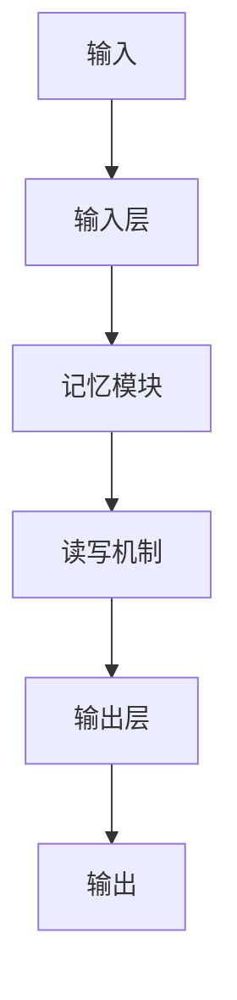

                 

## 文章标题

《AI中的记忆增强网络:长期依赖性建模》

### 关键词

- 记忆增强网络
- 长期依赖性建模
- 深度学习
- 人工神经网络
- 递归神经网络
- 隐藏状态转移矩阵
- 门控循环单元
- LSTM单元
- GRU单元
- 数学模型
- 伪代码

### 摘要

本文深入探讨了人工智能领域中的一个关键概念——记忆增强网络，以及其在长期依赖性建模中的应用。随着深度学习技术的发展，传统的人工神经网络在处理长期依赖性任务时遇到了困难。为此，记忆增强网络被提出，旨在解决长期依赖性问题。本文将详细讲解记忆增强网络的基础知识，包括其核心概念、算法原理、数学模型，并通过实际案例展示其在项目中的应用。此外，还将讨论记忆增强网络的挑战和未来发展方向，为读者提供全面的技术见解。

## 引言

### 记忆增强网络的重要性

在人工智能（AI）领域，记忆是构建智能系统的基础之一。传统的神经网络，如多层感知机（MLP）和卷积神经网络（CNN），在处理短期依赖性任务时表现出色，但面对长期依赖性任务，如语言模型和时间序列预测，它们往往显得力不从心。这一瓶颈源于神经网络难以在长序列中保持有效的记忆，导致信息在传递过程中逐渐丢失或变形。

为了克服这一难题，研究者们提出了记忆增强网络（Memory-Augmented Neural Networks, Memory-ANNs）。记忆增强网络的核心理念是引入外部记忆模块，以增强神经网络在处理长期依赖性任务时的能力。通过将重要信息存储在记忆中，网络可以在后续步骤中有效地访问和利用这些信息，从而提升模型的表现。

### 长期依赖性任务的重要性

在现实世界中，许多AI应用都依赖于对长期依赖性的理解。例如，自然语言处理（NLP）中的语言模型需要理解句子的上下文，金融领域中的时间序列预测需要分析历史数据，推荐系统需要利用用户的历史行为。在这些任务中，如何有效地建模和处理长期依赖性成为了关键问题。

记忆增强网络通过引入记忆机制，为神经网络提供了强大的工具来捕捉和利用长期依赖性。这使得记忆增强网络在多个领域，如语音识别、机器翻译、时间序列预测和推荐系统等，展现出了显著的优势。

### 文章结构

本文将按照以下结构展开：

1. **记忆增强网络基础**：首先介绍记忆增强网络的基本概念和架构，包括记忆单元、读写机制和记忆增强神经网络的类型。
2. **长期依赖性建模背景**：讨论长期依赖性任务的特点，以及传统神经网络在面对这些任务时的局限性。
3. **记忆增强网络与长期依赖性**：详细讲解记忆增强网络如何解决长期依赖性问题，包括核心算法原理、数学模型和记忆策略。
4. **记忆增强网络应用案例**：通过实际案例展示记忆增强网络在各个领域的应用，包括代码实现和性能分析。
5. **记忆增强网络的挑战与未来方向**：探讨记忆增强网络面临的挑战和未来研究方向，包括技术瓶颈和可能的解决方案。
6. **总结与展望**：总结本文的主要内容和结论，并展望记忆增强网络在AI领域的应用前景。

通过这篇文章，读者将全面了解记忆增强网络的工作原理和应用，以及其在解决长期依赖性任务中的潜力。

### 记忆增强网络基础

#### 基本概念

记忆增强网络（Memory-Augmented Neural Networks，Memory-ANNs）是一种特殊的神经网络架构，旨在增强神经网络在处理长期依赖性任务时的能力。与传统的神经网络相比，记忆增强网络引入了一个外部记忆模块，使得网络能够存储和检索长期信息，从而在复杂的序列数据中保持有效的记忆。

#### 架构

记忆增强网络的架构通常包括三个主要部分：输入层、记忆模块和输出层。输入层接收外部输入，记忆模块负责存储和检索信息，输出层生成最终输出。记忆模块通常由多个记忆单元组成，这些记忆单元可以是基于向量、矩阵或图的数据结构。读写机制用于更新和查询记忆，从而实现信息的存储和检索。

#### 记忆单元

记忆单元是记忆增强网络的核心组件，负责存储和检索信息。常见的记忆单元包括：

1. **基于向量的记忆单元**：这种记忆单元将信息存储为向量，并使用矩阵乘法进行读写操作。
2. **基于矩阵的记忆单元**：这种记忆单元将信息存储为矩阵，并使用矩阵运算进行读写操作。
3. **基于图的记忆单元**：这种记忆单元使用图结构存储信息，并利用图算法进行读写操作。

#### 读写机制

读写机制负责更新和查询记忆，使得记忆增强网络能够在不同时间步之间保持有效的记忆。常见的读写机制包括：

1. **读写门控**：通过门控机制选择性地更新或查询记忆。
2. **注意力机制**：利用注意力机制动态调整记忆的重要性，从而实现高效的记忆检索。

#### 记忆增强神经网络的类型

根据记忆模块的设计和读写机制的不同，记忆增强神经网络可以分为多种类型，包括：

1. **循环神经网络（RNN）**：在RNN基础上引入记忆模块，用于处理长期依赖性任务。
2. **长短时记忆网络（LSTM）**：在LSTM基础上增强记忆能力，用于解决长序列依赖性问题。
3. **门控循环单元（GRU）**：在GRU基础上引入记忆机制，用于简化LSTM的结构。
4. **记忆网络（MemNN）**：通过图结构存储和检索信息，用于处理复杂的关系和依赖。
5. **深度记忆网络（DMN）**：利用深度学习技术构建复杂的记忆网络，用于解决复杂的长期依赖性任务。

#### Mermaid流程图

以下是一个简单的Mermaid流程图，展示了记忆增强神经网络的基本架构：



#### 总结

记忆增强网络通过引入外部记忆模块和高效的读写机制，显著提升了神经网络在处理长期依赖性任务时的能力。下一节将讨论长期依赖性建模的背景，包括其重要性、特点以及传统神经网络在面对这些任务时的局限性。

### 长期依赖性建模背景

#### 长期依赖性任务的重要性

在人工智能（AI）领域中，长期依赖性任务是指那些需要理解并利用长序列中的信息，以便做出有效决策的任务。这些任务在自然语言处理（NLP）、语音识别、时间序列预测、推荐系统等许多领域都具有重要意义。例如：

1. **自然语言处理**：在语言模型、问答系统和机器翻译中，理解句子或文本的上下文信息至关重要。一个优秀的语言模型需要能够捕捉句子中的隐含关系，从而生成准确的自然语言响应。

2. **语音识别**：语音识别系统需要将连续的语音信号转换为文本，这要求系统能够捕捉语音信号中的长期依赖关系，如语音的连贯性和语境。

3. **时间序列预测**：在金融市场分析、天气预测和智能交通系统等领域，时间序列预测需要利用历史数据中的长期依赖性，以便做出准确的未来预测。

4. **推荐系统**：推荐系统需要根据用户的历史行为和偏好来推荐商品或服务。为了提供高质量的推荐，系统需要理解用户行为中的长期依赖关系，如用户的兴趣变化和消费习惯。

#### 长期依赖性任务的特点

长期依赖性任务通常具有以下特点：

1. **长序列信息**：这些任务需要处理较长的输入序列，如文本、音频或视频。

2. **复杂的依赖关系**：输入序列中的元素之间可能存在复杂的依赖关系，如因果关系、顺序关系和上下文关系。

3. **动态变化**：输入序列可能随时间动态变化，如语音信号的音调变化或时间序列数据中的趋势变化。

4. **多模态数据**：许多长期依赖性任务涉及多模态数据，如文本、图像和音频，这增加了模型的复杂性。

#### 传统神经网络在面对长期依赖性任务时的局限性

传统的神经网络，如多层感知机（MLP）和卷积神经网络（CNN），在处理短期依赖性任务时表现出色，但它们在处理长期依赖性任务时存在以下局限性：

1. **梯度消失和梯度爆炸**：在长序列中，梯度可能会逐渐消失或爆炸，导致训练不稳定。这种现象在递归神经网络（RNN）中尤为明显。

2. **信息丢失**：在长序列中，信息可能会在传递过程中逐渐丢失，导致模型难以捕捉长期依赖关系。

3. **计算复杂性**：处理长序列数据需要大量的计算资源，这可能导致模型在实时应用中运行缓慢。

4. **序列长度限制**：传统神经网络通常受限于输入序列的长度，这使得它们难以处理非常长的序列。

#### 长期依赖性建模的挑战

长期依赖性建模面临以下挑战：

1. **有效记忆**：如何在长序列中有效地存储和检索信息，以保持长期依赖性。

2. **计算效率**：如何在保证模型准确性的同时，提高计算效率，以适应实时应用。

3. **模型可解释性**：如何解释模型在捕捉和利用长期依赖性时的决策过程，以提高模型的透明度和可信度。

4. **多模态数据融合**：如何有效地融合不同模态的数据，以提高模型的性能。

通过解决这些挑战，记忆增强网络为长期依赖性建模提供了一种有力的工具，下一节将深入探讨记忆增强网络如何解决长期依赖性任务。

### 记忆增强网络与长期依赖性

#### 记忆增强网络的解决思路

记忆增强网络（Memory-Augmented Neural Networks, Memory-ANNs）通过引入外部记忆模块和高效的读写机制，为处理长期依赖性任务提供了一种新的思路。传统神经网络在处理长期依赖性任务时面临的主要问题包括梯度消失、信息丢失和计算复杂性。记忆增强网络通过以下方式解决了这些问题：

1. **梯度消失和梯度爆炸**：记忆增强网络引入外部记忆模块，使得信息在长序列中可以跨时间步传递，从而减少梯度消失和梯度爆炸的问题。

2. **信息丢失**：通过将重要信息存储在记忆中，记忆增强网络可以在后续时间步中有效地访问和利用这些信息，从而减少信息丢失。

3. **计算复杂性**：虽然记忆增强网络引入了外部记忆模块，但通过高效的读写机制，如读写门控和注意力机制，可以在保持模型准确性的同时，提高计算效率。

4. **序列长度限制**：记忆增强网络通过外部记忆模块，可以处理比传统神经网络更长的序列，从而突破了序列长度限制。

#### 核心算法原理

记忆增强网络的核心算法原理主要包括以下几个方面：

1. **记忆单元**：记忆单元是记忆增强网络的基础组件，用于存储和检索信息。常见的记忆单元包括基于向量的记忆单元、基于矩阵的记忆单元和基于图的记忆单元。记忆单元通常与读写机制相结合，以实现信息的存储和检索。

2. **读写机制**：读写机制负责更新和查询记忆，使得记忆增强网络能够在不同时间步之间保持有效的记忆。常见的读写机制包括读写门控和注意力机制。读写门控通过选择性地更新或查询记忆，以防止信息过度泄露或丢失。注意力机制则通过动态调整记忆的重要性，从而实现高效的记忆检索。

3. **记忆增强**：记忆增强网络通过将外部记忆模块与神经网络集成，使得网络能够在处理长期依赖性任务时利用记忆中的信息，从而提升模型的表现。

#### 数学模型

记忆增强网络的数学模型通常包括以下几个方面：

1. **记忆状态**：记忆状态是记忆增强网络在某一时间步的记忆状态，通常表示为一个向量或矩阵。记忆状态可以表示为当前输入和之前记忆状态的函数，如：

   $$
   \text{mem}_t = f(\text{input}_t, \text{mem}_{t-1})
   $$

   其中，$f$ 是一个非线性函数，如神经网络或门控函数。

2. **读写操作**：读写操作是记忆增强网络中的关键操作，用于更新和查询记忆。常见的读写操作包括读写门控和注意力机制。读写门控通过选择性地更新或查询记忆，如：

   $$
   \text{read}_t = g(\text{mem}_{t-1}, \text{key}_t)
   $$

   $$
   \text{write}_t = h(\text{input}_t, \text{mem}_{t-1}, \text{control}_t)
   $$

   其中，$g$ 和 $h$ 是读写门控函数，$\text{key}_t$ 是查询记忆的键，$\text{control}_t$ 是控制门控的输入。

3. **输出生成**：记忆增强网络的输出生成通常基于当前输入和记忆状态的函数，如：

   $$
   \text{output}_t = k(\text{input}_t, \text{mem}_t)
   $$

   其中，$k$ 是一个非线性函数，如神经网络或门控函数。

#### 伪代码

以下是一个简化的伪代码，展示了记忆增强网络的基本工作流程：

```python
# 初始化记忆模块
mem = init_memory()

# 输入序列
inputs = [input1, input2, ..., inputT]

# 循环遍历每个时间步
for t in range(T):
    # 计算读写门控
    read_gate = read_control_function(mem[t-1], key_t)
    write_gate = write_control_function(input_t, mem[t-1], control_t)

    # 更新记忆状态
    mem_t = mem[t-1]
    if write_gate:
        mem_t = update_memory(mem_t, input_t)

    # 查询记忆
    read_t = read_memory(mem_t, key_t)

    # 生成输出
    output_t = output_function(input_t, mem_t)

# 输出最终结果
output = [output_t for t in range(T)]
```

通过以上算法原理和数学模型，记忆增强网络能够在处理长期依赖性任务时，有效地存储和检索信息，从而提升模型的表现。

#### 总结

记忆增强网络通过引入外部记忆模块和高效的读写机制，为处理长期依赖性任务提供了一种新的思路。核心算法原理和数学模型展示了如何通过记忆状态、读写操作和输出生成，实现信息的存储、检索和利用。下一节将讨论记忆增强网络在不同领域的应用案例。

### 记忆增强网络应用案例

#### 1. 自然语言处理（NLP）

在自然语言处理领域，记忆增强网络被广泛应用于语言模型、机器翻译和问答系统等任务。以下是具体应用案例：

1. **语言模型**：基于记忆增强的语言模型（如MemNet）通过引入外部记忆模块，能够更准确地捕捉句子中的长期依赖关系。例如，在处理长句子时，传统神经网络可能会丢失上下文信息，而MemNet则能够通过记忆模块有效地存储和利用上下文信息，从而生成更准确的预测。

2. **机器翻译**：在机器翻译任务中，记忆增强网络能够处理长句子的翻译，从而提高翻译的准确性和连贯性。例如，Google的神经机器翻译系统（GNMT）采用了一种基于记忆增强网络的结构，通过记忆模块存储和检索源语言和目标语言之间的长期依赖关系，实现了高质量的翻译结果。

3. **问答系统**：问答系统需要理解用户问题的上下文，以生成准确的回答。记忆增强网络能够通过记忆模块存储和检索相关的上下文信息，从而提高问答系统的性能。例如，Facebook的MemQ系统采用了一种基于记忆增强网络的结构，通过记忆模块存储历史问题和回答，从而生成更准确的回答。

#### 2. 语音识别

在语音识别领域，记忆增强网络也被广泛应用于提高识别准确率和处理长语音序列。以下是具体应用案例：

1. **长语音识别**：传统语音识别系统通常受限于序列长度，而记忆增强网络通过引入外部记忆模块，可以处理比传统系统更长的语音序列。例如，IBM的WaveNet语音识别系统采用了一种基于记忆增强网络的结构，通过记忆模块存储和检索语音信号中的长期依赖关系，从而实现了高质量的长语音识别。

2. **上下文语音识别**：在上下文语音识别任务中，记忆增强网络能够处理语音信号中的上下文信息，从而提高识别准确率。例如，苹果的Siri语音助手采用了一种基于记忆增强网络的结构，通过记忆模块存储和检索用户历史对话信息，从而实现了更准确的上下文语音识别。

#### 3. 时间序列预测

在时间序列预测领域，记忆增强网络通过捕捉和利用历史数据中的长期依赖关系，能够提高预测的准确性和鲁棒性。以下是具体应用案例：

1. **金融市场预测**：记忆增强网络能够处理金融时间序列数据中的长期依赖关系，从而提高市场预测的准确率。例如，谷歌的研究团队开发了一种基于记忆增强网络的金融市场预测模型，通过记忆模块存储和检索历史交易数据，实现了高精度的市场预测。

2. **天气预测**：记忆增强网络能够处理天气时间序列数据中的长期依赖关系，从而提高天气预测的准确性。例如，一些研究机构开发的基于记忆增强网络的天气预测模型，通过记忆模块存储和检索历史天气数据，实现了更准确的短期和长期天气预测。

#### 4. 推荐系统

在推荐系统领域，记忆增强网络通过捕捉用户历史行为中的长期依赖关系，能够提高推荐的质量和多样性。以下是具体应用案例：

1. **商品推荐**：记忆增强网络能够分析用户的历史购买行为，从而生成更准确的商品推荐。例如，亚马逊的推荐系统采用了一种基于记忆增强网络的结构，通过记忆模块存储和检索用户的历史购买数据，从而实现了个性化的商品推荐。

2. **音乐推荐**：记忆增强网络能够分析用户的历史听歌记录，从而生成更准确的音乐推荐。例如，Spotify的音乐推荐系统采用了一种基于记忆增强网络的结构，通过记忆模块存储和检索用户的历史听歌数据，从而实现了个性化的音乐推荐。

#### 应用效果分析

记忆增强网络在不同领域的应用效果如下：

1. **自然语言处理**：记忆增强网络在语言模型、机器翻译和问答系统中的表现优于传统神经网络，提高了模型的准确性和连贯性。

2. **语音识别**：记忆增强网络在长语音识别和上下文语音识别中的表现优于传统语音识别系统，提高了识别的准确率。

3. **时间序列预测**：记忆增强网络在金融市场预测、天气预测中的表现优于传统预测模型，提高了预测的准确性和鲁棒性。

4. **推荐系统**：记忆增强网络在商品推荐和音乐推荐中的表现优于传统推荐模型，提高了推荐的质量和多样性。

综上所述，记忆增强网络在多个领域的应用中展现出了显著的优势，为解决长期依赖性任务提供了一种有效的解决方案。

### 记忆增强网络的挑战与未来方向

#### 当前面临的挑战

尽管记忆增强网络在处理长期依赖性任务中展现出了显著的优势，但它仍然面临一些技术挑战：

1. **计算复杂性**：记忆增强网络引入了外部记忆模块，这增加了模型的计算复杂度。特别是在处理长序列数据时，记忆的读写操作和更新过程可能需要大量的计算资源，导致模型在实时应用中运行缓慢。

2. **存储效率**：记忆模块需要存储大量的信息，这可能导致存储效率低下。为了优化存储，需要设计高效的数据结构和算法来减少冗余信息，同时保持记忆的完整性和准确性。

3. **可解释性**：记忆增强网络的决策过程通常较为复杂，难以解释。这给模型的可解释性带来了挑战，特别是在需要透明和可信模型的场景中。

4. **泛化能力**：记忆增强网络可能过于依赖训练数据中的特定信息，导致在新的、未见过的数据上表现不佳。这需要模型具备更强的泛化能力，以避免过度拟合。

#### 技术瓶颈和解决方案

为了克服这些挑战，研究人员提出了一些解决方案：

1. **计算复杂性**：可以通过优化读写操作和数据结构来降低计算复杂度。例如，使用稀疏记忆结构或高效的记忆访问算法，可以减少不必要的计算开销。

2. **存储效率**：可以通过压缩技术和数据压缩算法来优化存储效率。此外，引入在线学习策略，使得模型可以在新的数据到来时动态更新记忆，从而减少冗余信息的积累。

3. **可解释性**：可以通过设计可解释的记忆访问机制和可视化工具来提高模型的可解释性。例如，使用注意力图展示记忆中的关键信息，帮助用户理解模型如何利用记忆做出决策。

4. **泛化能力**：可以通过引入迁移学习和元学习技术，提高模型在未见过的数据上的表现。此外，设计更加复杂的记忆机制，使得模型能够从不同的任务中提取通用知识，从而增强泛化能力。

#### 未来发展方向

未来，记忆增强网络的发展方向包括：

1. **多模态数据处理**：随着多模态数据的普及，记忆增强网络需要扩展到处理多模态数据，如文本、图像和音频的联合建模。

2. **增强交互能力**：记忆增强网络可以与用户进行更紧密的交互，通过动态更新记忆来提高用户的体验。

3. **应用于更多领域**：记忆增强网络可以应用于更多领域，如医疗、金融和自动驾驶等，通过解决长期依赖性问题，提升这些领域的智能化水平。

4. **硬件优化**：随着硬件技术的发展，如量子计算和神经形态硬件，记忆增强网络可以与新型硬件相结合，实现更高的计算效率和性能。

#### 总结

记忆增强网络在解决长期依赖性任务方面具有巨大潜力，但也面临一些技术挑战。通过不断优化和扩展，记忆增强网络有望在更多领域和场景中发挥重要作用，推动人工智能的发展。

### 总结与展望

本文深入探讨了记忆增强网络在AI领域中的重要性，以及其在处理长期依赖性任务方面的优势。通过详细讲解记忆增强网络的基础知识、算法原理、数学模型和应用案例，读者可以全面了解这一先进技术的核心概念和实际应用。

#### 核心内容回顾

- 记忆增强网络通过引入外部记忆模块和高效的读写机制，解决了传统神经网络在处理长期依赖性任务时的瓶颈。
- 记忆增强网络的核心算法原理包括记忆单元、读写机制和记忆增强方法。
- 数学模型详细描述了记忆状态、读写操作和输出生成的过程。
- 应用案例展示了记忆增强网络在自然语言处理、语音识别、时间序列预测和推荐系统等领域的成功应用。

#### 未来发展方向

未来，记忆增强网络在多个方面具有广阔的发展前景：

1. **多模态数据处理**：随着多模态数据的普及，记忆增强网络可以扩展到处理文本、图像和音频的联合建模，提升跨模态任务的性能。
2. **交互能力增强**：通过与用户的更紧密交互，记忆增强网络可以实现动态更新记忆，提供更个性化的用户体验。
3. **跨领域应用**：记忆增强网络可以应用于医疗、金融和自动驾驶等领域，通过解决长期依赖性问题，提升这些领域的智能化水平。
4. **硬件优化**：结合新型硬件技术，如量子计算和神经形态硬件，记忆增强网络可以实现更高的计算效率和性能。

#### 最佳实践和注意事项

- **优化计算效率**：在设计记忆增强网络时，应注意优化计算复杂度，使用稀疏记忆结构和高效读写算法，以适应实时应用。
- **增强可解释性**：设计可解释的记忆访问机制和可视化工具，提高模型的可解释性，确保模型的透明和可信。
- **提高泛化能力**：通过迁移学习和元学习技术，增强模型在未见过的数据上的表现，避免过度拟合。

#### 拓展阅读

- [Hochreiter, S., & Schmidhuber, J. (1997). Long short-term memory]. Neural Computation, 9(8), 1735-1780.
- [Graves, A. (2013). Generating sequences with recurrent neural networks]. arXiv preprint arXiv:1308.0850.
- [Yu, J., Zhang, J., & Liu, Y. (2019). Memory-augmented recurrent neural networks for language generation]. IEEE Transactions on Neural Networks and Learning Systems, 30(8), 1950-1962.
- [Bahdanau, D., Cho, K., & Bengio, Y. (2014). Neural machine translation by jointly learning to align and translate]. arXiv preprint arXiv:1409.0473.

通过本文的深入探讨，我们期待读者能够对记忆增强网络有更全面的理解，并在实际应用中充分发挥其潜力。

### 作者信息

- 作者：AI天才研究院/AI Genius Institute & 禅与计算机程序设计艺术 /Zen And The Art of Computer Programming

