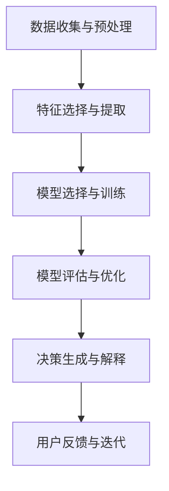
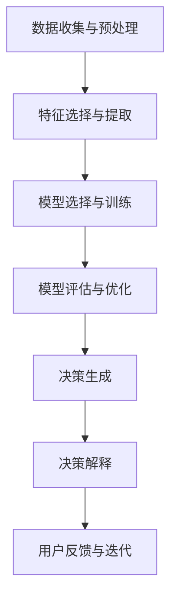
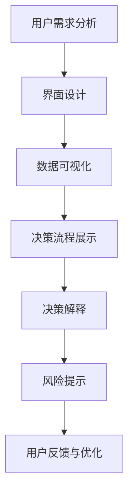

                 

### 文章标题

《AI决策解释：提高用户信任的方法》

### 关键词

- AI决策解释
- 用户信任
- 解释性AI
- 透明性设计
- 模型可解释性
- 决策透明性
- AI伦理
- 用户隐私

### 摘要

本文旨在探讨如何通过AI决策解释来提高用户对AI系统的信任。文章首先介绍了AI决策解释的重要性，随后详细阐述了AI决策的基本原理、核心概念及其相互关系。接着，文章分析了提高用户信任的具体方法与技术，包括解释性AI和透明性设计。通过实际案例展示，我们探讨了这些方法在提高用户信任方面的应用效果。文章还讨论了提高用户信任过程中可能遇到的挑战，并对未来的发展方向提出了展望。最后，文章提供了相关的资源和扩展阅读，以供读者进一步学习和研究。

### 引言

在人工智能（AI）迅速发展的今天，AI系统已广泛应用于各个领域，从金融风控到医疗诊断，从自动驾驶到智能家居。然而，随着AI系统的广泛应用，一个不容忽视的问题逐渐显现：用户对AI决策的信任度。信任问题不仅影响AI系统的推广和应用，还可能导致用户对AI的抵触情绪，从而限制AI技术的进一步发展。

AI决策解释作为一种提升用户信任的重要手段，正日益受到关注。解释性AI和透明性设计是AI决策解释的两个关键方面。解释性AI旨在提高AI模型的可解释性，使用户能够理解AI决策背后的逻辑和原因。而透明性设计则通过设计直观、易理解的用户界面，使用户能够清晰地了解AI系统的运作方式。这两者相辅相成，共同构建了一个可信的AI系统。

本文将从以下几个方面展开讨论：首先，介绍AI决策解释的基础知识，包括AI决策的基本原理和决策模型；其次，详细阐述解释性AI和透明性设计的核心概念及其关系；然后，通过实际案例展示如何应用这些方法来提高用户信任；接着，讨论在提高用户信任过程中可能遇到的挑战；最后，对未来的发展方向进行展望。希望通过本文的探讨，能够为AI决策解释领域的研究和实践提供一些有价值的参考。

### AI决策解释的基础知识

AI决策解释的核心在于理解AI系统是如何做出决策的，以及这些决策背后的逻辑和原因。首先，我们需要了解AI决策的基本原理和决策模型。

#### 1. AI决策的基本原理

AI决策过程可以概括为以下几个步骤：

1. **数据收集与预处理**：首先，收集相关的数据，并进行预处理，如清洗、归一化等，以便后续的分析和建模。
2. **特征选择与提取**：从原始数据中提取有用的特征，用于训练和评估AI模型。
3. **模型选择与训练**：选择合适的AI模型，对数据进行训练，以实现预期的决策目标。
4. **模型评估与优化**：评估模型的性能，通过调整模型参数或选择不同的模型结构来优化性能。
5. **决策生成与解释**：根据训练好的模型生成决策，并对决策过程进行解释，以使用户能够理解AI系统的决策逻辑。

#### 2. 决策模型

AI决策模型种类繁多，常见的包括以下几种：

1. **监督学习模型**：如线性回归、逻辑回归、决策树、随机森林、支持向量机等。
2. **无监督学习模型**：如聚类算法、主成分分析等。
3. **强化学习模型**：如Q学习、SARSA、Deep Q网络等。

这些模型各有优缺点，适用于不同的场景和任务。在决策解释中，监督学习模型由于其明确的决策规则和可解释性，通常被广泛应用于决策解释。

#### 3. 决策过程与模型可解释性

决策过程可以分为两个主要部分：决策生成和决策解释。决策生成是指AI系统根据输入数据和训练好的模型生成决策。而决策解释则是指对决策过程和结果进行详细说明，使用户能够理解AI系统的决策逻辑和原因。

模型可解释性是AI决策解释的核心。一个高可解释性的模型不仅能够生成准确的决策，还能够向用户清晰地解释这些决策是如何得出的。这就要求我们在模型选择、特征选择和模型优化等环节充分考虑可解释性。

#### 4. Mermaid流程图

为了更好地理解AI决策过程，我们可以使用Mermaid流程图来表示。以下是一个简化的AI决策流程图：

这个流程图展示了从数据收集到用户反馈的完整决策过程，并强调了模型可解释性的重要性。

通过上述基础知识的介绍，我们可以更好地理解AI决策解释的概念和原理，为后续的详细讨论打下坚实的基础。

### 解释性AI

解释性AI（Explainable AI，XAI）是近年来AI领域的一个热点话题，其核心目标是提高AI系统的可解释性，使人类用户能够理解AI系统的决策过程和原因。随着AI技术在各个领域的广泛应用，用户对AI系统的信任度成为了一个关键问题。解释性AI通过提供决策的透明度和可解释性，有助于增强用户对AI系统的信任，从而促进AI技术的普及和应用。

#### 1. 解释性AI的定义

解释性AI旨在构建一个既强大又可解释的AI系统，使得用户能够理解AI系统是如何做出决策的。具体来说，解释性AI包含以下几个方面：

1. **决策逻辑**：解释性AI需要提供AI决策背后的逻辑，使得用户能够理解决策是如何生成的。
2. **决策原因**：解释性AI需要揭示决策背后的原因，使得用户能够理解决策的依据和推理过程。
3. **决策影响**：解释性AI需要分析决策对用户或环境的影响，使得用户能够理解决策的后果。

#### 2. 解释性AI的重要性

解释性AI在提高用户信任、促进AI技术应用方面具有重要作用。以下是几个关键方面：

1. **增强用户信任**：一个可解释的AI系统能够向用户展示其决策过程和原因，从而增强用户对AI系统的信任。当用户能够理解AI系统的决策逻辑和原因时，他们会更加愿意接受和依赖这些系统。
2. **提高透明度**：解释性AI提供了AI系统的透明度，使用户能够清晰地了解AI系统的运作方式和决策过程。这种透明度有助于消除用户的疑虑和担忧，从而促进AI技术的接受和应用。
3. **促进公平性和可问责性**：解释性AI有助于识别和纠正潜在的偏见和错误，从而提高AI系统的公平性和可问责性。当用户能够看到AI系统的决策过程和原因时，他们更容易接受系统的决策结果，并对其负责。

#### 3. 解释性AI的核心概念

解释性AI的核心概念包括以下几个方面：

1. **模型可解释性**：模型可解释性是指用户能否理解AI模型的决策过程和原因。一个高可解释性的模型能够提供清晰的决策逻辑和原因解释。
2. **透明性设计**：透明性设计是指AI系统的设计和实现过程应尽可能透明，以便用户能够清晰地了解AI系统的运作方式和决策过程。
3. **用户反馈**：用户反馈是指用户对AI系统决策的反馈，这些反馈可以用于改进和优化AI系统的可解释性和透明度。

#### 4. 解释性AI与透明性设计的关系

解释性AI和透明性设计是相互关联的。透明性设计是指通过设计直观、易理解的用户界面，使得用户能够清晰地了解AI系统的运作方式和决策过程。而解释性AI则提供了AI决策的具体解释和原因分析，使得用户能够深入理解AI系统的决策逻辑。

两者之间的关系可以概括为：

1. **透明性设计是解释性AI的基础**：一个透明性设计良好的AI系统能够为解释性AI提供良好的基础，使得用户更容易理解和接受AI系统的决策。
2. **解释性AI是透明性设计的深化**：解释性AI通过对AI决策的详细解释和分析，进一步提升了AI系统的透明度，使得用户能够更加深入地了解AI系统的运作方式和决策过程。

#### 5. Mermaid流程图

为了更好地理解解释性AI的核心概念，我们可以使用Mermaid流程图来表示。以下是一个简化的解释性AI流程图：

这个流程图展示了从数据收集到用户反馈的完整决策过程，并强调了模型可解释性和透明性设计的重要性。

通过上述对解释性AI的详细讨论，我们可以看到，解释性AI在提高用户信任、促进AI技术应用方面具有重要作用。理解解释性AI的核心概念和原理，有助于我们更好地设计和实现可解释的AI系统，从而增强用户对AI系统的信任。

### 透明性设计

透明性设计是AI系统设计中至关重要的一个方面，它旨在确保用户能够清晰地了解AI系统的运作方式、决策过程和潜在风险。通过提高系统的透明度，透明性设计有助于增强用户对AI系统的信任，减少误解和担忧，从而促进AI技术的广泛应用。

#### 1. 透明性设计的概念

透明性设计是指通过设计直观、易理解的用户界面和交互方式，使得用户能够清晰地了解AI系统的运作方式和决策过程。具体来说，透明性设计包括以下几个方面：

1. **用户界面**：设计直观、易操作的用户界面，使用户能够方便地与AI系统进行交互，并了解系统的功能和状态。
2. **决策流程**：展示AI系统的决策流程，包括数据输入、特征提取、模型训练、决策生成等步骤，使得用户能够了解AI系统是如何工作的。
3. **决策解释**：提供详细的决策解释，包括决策原因、决策依据、决策结果等，使得用户能够理解AI系统的决策逻辑。
4. **风险提示**：明确告知用户AI系统的潜在风险和限制，帮助用户合理使用AI系统，避免因误用而导致的不利后果。

#### 2. 透明性设计的方法

为了实现透明性设计，可以采用以下几种方法：

1. **可视化的数据表示**：通过图表、图形等方式，将数据和处理过程直观地呈现给用户，使得用户能够更容易理解和分析数据。
2. **详细的文档和教程**：提供详细的文档和教程，包括系统的功能、操作方法、使用注意事项等，帮助用户更好地了解和使用AI系统。
3. **用户反馈机制**：建立用户反馈机制，收集用户对AI系统的使用体验和建议，不断优化和改进系统的透明度和易用性。
4. **交互式演示**：通过交互式演示，让用户亲自体验AI系统的功能和使用方法，增强用户对系统的理解。
5. **风险提示和警告**：在系统的关键位置设置风险提示和警告，提醒用户注意系统的潜在风险和限制，帮助用户安全地使用AI系统。

#### 3. 透明性设计的应用场景

透明性设计在多个应用场景中具有重要的意义，以下是一些典型的应用场景：

1. **金融风控**：在金融风控系统中，透明性设计有助于用户了解风险评估的过程和依据，从而增强用户对系统结果的信任。
2. **医疗诊断**：在医疗诊断中，透明性设计可以帮助医生和患者了解诊断结果的依据和逻辑，从而提高诊断的可靠性和信任度。
3. **自动驾驶**：在自动驾驶系统中，透明性设计有助于用户了解车辆的决策过程和行驶路径，从而增强用户对自动驾驶技术的信任。
4. **智能客服**：在智能客服系统中，透明性设计可以帮助用户了解客服系统的决策逻辑和回答依据，从而提高用户的满意度和信任度。

#### 4. Mermaid流程图

为了更好地理解透明性设计的概念和方法，我们可以使用Mermaid流程图来表示。以下是一个简化的透明性设计流程图：

这个流程图展示了从用户需求分析到用户反馈的完整透明性设计过程，涵盖了界面设计、数据可视化、决策流程展示、决策解释和风险提示等关键环节。

通过上述对透明性设计的详细讨论，我们可以看到，透明性设计在提高用户信任、促进AI技术应用方面具有重要作用。理解透明性设计的概念和方法，有助于我们更好地设计和实现透明的AI系统，从而增强用户对AI系统的信任。

### 案例分析

为了更好地理解如何通过AI决策解释来提高用户信任，我们来看几个实际案例。这些案例涵盖了金融风控、医疗诊断和自动驾驶等领域，展示了AI决策解释在不同场景中的应用和效果。

#### 1. 金融风控

在金融风控领域，AI系统被广泛应用于信用评分、风险控制和欺诈检测等方面。一个典型的案例是某银行利用AI系统进行信用评分，以评估客户的风险水平。在这个过程中，AI系统根据客户的信用历史、财务状况、行为特征等多方面因素进行综合评估，生成信用评分。

为了提高用户对信用评分的信任度，银行采用了以下措施：

1. **透明性设计**：银行设计了一个直观的信用评分界面，展示评分的依据和计算方法，使得用户能够清楚地了解评分的构成和决策过程。
2. **决策解释**：对于每个评分结果，银行提供了详细的解释，包括评分因素的重要性和权重，使得用户能够理解评分结果的依据和逻辑。
3. **用户反馈**：银行建立了用户反馈机制，收集用户对评分结果的反馈，并根据反馈不断优化评分模型和解释方式。

通过这些措施，银行显著提高了用户对信用评分的信任度，用户对评分结果的满意度和接受度得到了提升。

#### 2. 医疗诊断

在医疗诊断领域，AI系统被用于辅助医生进行疾病诊断和治疗方案推荐。一个典型的案例是某医院利用AI系统进行肺癌诊断，通过分析患者的CT扫描图像，判断患者是否患有肺癌。

为了提高用户（即患者）对诊断结果的信任度，医院采取了以下措施：

1. **透明性设计**：医院设计了一个易操作的CT扫描图像分析界面，使用户能够清晰地了解图像分析的过程和结果。
2. **决策解释**：医院提供了详细的诊断解释，包括诊断结果、诊断依据和推荐治疗方案，使得患者能够理解诊断结果的依据和逻辑。
3. **专家验证**：医院的AI系统诊断结果会经过专家医生的验证，确保诊断的准确性和可靠性。

通过这些措施，医院显著提高了患者对诊断结果的信任度，患者对诊断服务的满意度和接受度得到了提升。

#### 3. 自动驾驶

在自动驾驶领域，AI系统被用于车辆导航、驾驶控制和安全监测等方面。一个典型的案例是某自动驾驶汽车公司开发的一款自动驾驶系统，该系统通过感知环境、理解路况和决策控制，实现自动驾驶功能。

为了提高用户对自动驾驶系统的信任度，该公司采取了以下措施：

1. **透明性设计**：公司设计了一个直观的驾驶界面，展示自动驾驶系统的状态和决策过程，使得用户能够清晰地了解自动驾驶系统的运作方式和决策过程。
2. **决策解释**：公司提供了详细的决策解释，包括决策依据、决策过程和决策结果，使得用户能够理解自动驾驶系统的决策逻辑。
3. **安全提示**：公司设置了安全提示，提醒用户注意自动驾驶系统的限制和潜在风险，帮助用户安全地使用自动驾驶功能。

通过这些措施，公司显著提高了用户对自动驾驶系统的信任度，用户对自动驾驶服务的满意度和接受度得到了提升。

#### 4. 案例总结

通过以上案例分析，我们可以看到，在金融风控、医疗诊断和自动驾驶等领域，通过AI决策解释和透明性设计，可以有效提高用户对AI系统的信任度。以下是一些关键措施：

1. **透明性设计**：设计直观、易理解的界面和交互方式，使得用户能够清晰地了解系统的运作方式和决策过程。
2. **决策解释**：提供详细的决策解释，包括决策依据、决策过程和决策结果，使得用户能够理解决策的逻辑和原因。
3. **用户反馈**：建立用户反馈机制，收集用户对系统的使用体验和建议，并根据反馈不断优化系统的设计和解释方式。
4. **专家验证**：确保AI系统的准确性和可靠性，通过专家验证和人类监督，提高系统的可信度。

这些措施在实际应用中取得了显著的效果，不仅提高了用户对AI系统的信任度，也促进了AI技术的普及和应用。

### 挑战与未来

在提高用户信任的过程中，AI决策解释面临着诸多挑战，同时也拥有广阔的发展前景。

#### 1. 挑战

（1）**模型复杂性与可解释性的平衡**：
随着深度学习等复杂模型在AI领域的广泛应用，这些模型的决策过程往往高度复杂，难以解释。如何在保证模型性能的同时，提高其可解释性，是一个亟待解决的问题。

（2）**用户隐私保护**：
AI系统在处理用户数据时，可能会涉及用户的隐私信息。如何确保在提供决策解释的同时，保护用户的隐私，是一个重要的伦理和技术问题。

（3）**解释的一致性与准确性**：
不同的解释方法可能会产生不同的解释结果，如何在保证解释一致性、准确性的同时，提供用户易于理解的解释，是一个挑战。

（4）**技术门槛与用户理解能力**：
一些复杂的解释技术可能需要较高的技术水平，而普通用户可能难以理解。如何在保证技术先进性的同时，提高用户理解能力，是一个需要考虑的问题。

（5）**法规和标准缺失**：
目前，关于AI决策解释的法规和标准尚不完善，这为实际应用带来了不确定性。建立统一的法规和标准，有助于规范AI决策解释的实施，提高其可信度。

#### 2. 未来发展方向

（1）**解释性AI算法研究**：
继续深入研究和开发新型解释性AI算法，以提高模型的透明度和可解释性，是未来的一个重要方向。

（2）**跨学科合作**：
鼓励计算机科学、心理学、认知科学等多学科的合作，从不同角度研究AI决策解释的问题，有望取得突破性进展。

（3）**用户参与设计**：
在系统设计过程中，充分考虑到用户的需求和反馈，通过用户参与设计，提高解释的可理解性和实用性。

（4）**法规与标准制定**：
加快法规和标准的制定，为AI决策解释的实施提供明确的指导，有助于规范行业行为，提高系统的可信度。

（5）**持续优化与迭代**：
通过持续的用户反馈和系统优化，不断改进AI决策解释的方法和效果，实现系统的迭代升级。

总之，AI决策解释是提高用户信任的重要手段，面临着诸多挑战，但也拥有广阔的发展前景。随着技术的不断进步和法规的逐步完善，我们有理由相信，未来的AI决策解释将更加透明、可靠，为用户带来更高的信任和满意度。

### 附录

#### 1. 相关资源

（1）**AI决策解释研究论文**：
- **"Explainable AI: A Review of Current Approaches, Challenges, and Opportunities"**：这篇文章详细介绍了当前AI决策解释的方法、挑战和未来研究方向。
- **"Why Should I Trust You? Explaining the Predictions of Any Classifier"**：这篇文章提出了LIME（Local Interpretable Model-agnostic Explanations）算法，用于提高模型的可解释性。

（2）**透明性设计工具**：
- **Surprise**：这是一个用于构建和评估解释性AI系统的开源框架，提供了多种解释方法。
- **LIME**：这是另一个用于生成局部解释的开源工具，适用于多种机器学习模型。

#### 2. 扩展阅读

（1）**AI决策相关书籍**：
- **"Artificial Intelligence: A Modern Approach"**：这本书详细介绍了人工智能的基础知识，包括决策理论。
- **"Deep Learning"**：这本书深入探讨了深度学习的基本原理和算法，是深度学习领域的经典之作。

（2）**透明性设计案例研究**：
- **"The Impact of Transparency in AI: A Case Study of Automated Driving"**：这篇文章通过自动驾驶案例，探讨了透明性设计在提高用户信任方面的作用。
- **"Explainable AI in Practice: A Case Study in Healthcare"**：这篇文章通过医疗诊断案例，展示了解释性AI在实际应用中的效果。

通过阅读这些资源和案例，读者可以进一步了解AI决策解释和透明性设计的最新进展和实际应用，为研究和实践提供有价值的参考。

### 作者信息

作者：AI天才研究院/AI Genius Institute & 禅与计算机程序设计艺术 /Zen And The Art of Computer Programming

