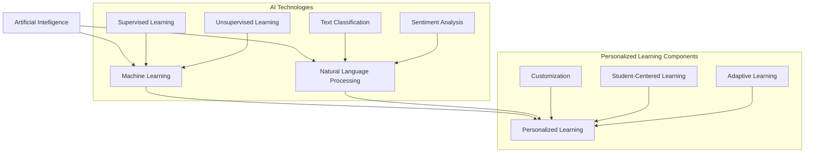

                 


## Introduction to AI in Personalized Learning Content Generation

### Background

The educational landscape has been undergoing significant transformations in recent years, driven by the rapid advancements in artificial intelligence (AI). The traditional one-size-fits-all approach to education, where a uniform curriculum is delivered to a diverse student population, is no longer considered sufficient to meet the varied needs of today's learners. Personalized learning, which tailors educational content and experiences to the individual needs, abilities, and interests of learners, has emerged as a promising solution to this challenge. AI technologies, particularly machine learning (ML) and natural language processing (NLP), play a pivotal role in enabling the creation of personalized learning content that can adapt to the unique learning styles and progress of each student.

### Key Concepts

#### Personalized Learning

Personalized learning is an educational approach that focuses on the needs of individual learners, allowing them to learn at their own pace, in their own style, and through their own interests. The key elements of personalized learning include:

- **Customization**: The educational content and experiences are customized to align with the learner's strengths, weaknesses, preferences, and learning styles.

- **Student-Centered Learning**: The learning process is student-centered, allowing learners to take control of their own learning and making choices about what, how, when, and where to learn.

- **Adaptive Learning**: Educational materials and assessments can adapt in real-time to the learner's performance, providing tailored feedback and resources to support their learning.

#### Artificial Intelligence

Artificial Intelligence (AI) refers to the simulation of human intelligence in machines that are programmed to think like humans and mimic their actions. The primary types of AI include:

- **Narrow AI**: AI systems designed to perform a narrow task, such as facial recognition or speech recognition.

- **General AI**: AI that has the ability to understand, learn, and apply knowledge across a wide range of tasks, similar to human intelligence.

- **Machine Learning**: A subset of AI that involves the development of algorithms that can learn from data, identify patterns, and make decisions with minimal human intervention.

### The Role of AI in Personalized Learning Content Generation

The integration of AI in personalized learning content generation addresses several key challenges in traditional educational models:

- **Scalability**: AI enables the creation and customization of learning materials at scale, making it possible to serve large populations of students with personalized content.

- **Personalization**: AI algorithms can analyze vast amounts of data about students, including learning preferences, academic performance, and behavioral patterns, to generate personalized learning content.

- **Real-Time Adaptation**: AI systems can adapt learning materials in real-time based on the learner's progress, providing immediate feedback and support.

- **Diversity and Inclusion**: AI can help address the diverse needs of students from different backgrounds, cultures, and learning abilities, promoting inclusivity in education.

### Conclusion

In conclusion, the application of AI in personalized learning content generation represents a significant innovation in the field of education. By leveraging AI technologies, educators can create more effective and engaging learning experiences that cater to the unique needs of each student. This shift towards personalized learning has the potential to transform education, making it more accessible, inclusive, and adaptable to the evolving needs of learners in the 21st century.

## Mermaid Flowchart: The Relationship Between Core Concepts



### Core Algorithm Principles: Exploring Machine Learning Techniques

In the realm of personalized learning content generation, machine learning (ML) algorithms are at the forefront of driving innovation. ML involves the development of algorithms that can learn from data, identify patterns, and make decisions with minimal human intervention. In personalized learning, ML algorithms are used to analyze student data, predict learning outcomes, and generate personalized content. This section will delve into two key ML techniques: supervised learning and unsupervised learning, providing a detailed explanation of their principles, advantages, and disadvantages.

#### Supervised Learning

Supervised learning is a type of ML where a model is trained on a labeled dataset, meaning that each data point is associated with an output label. The goal of supervised learning is to learn a mapping from inputs to outputs, so that the model can predict the output for new, unseen data points.

**Principles:**

- **Data Preparation:** The first step in supervised learning is to prepare the dataset. This involves cleaning the data, handling missing values, and scaling the features to ensure that they are on a similar scale.

- **Model Training:** Once the data is prepared, the model is trained using an algorithm, such as linear regression or a decision tree, which learns the mapping from inputs to outputs by finding the relationship between the features and the labels.

- **Model Evaluation:** After training, the model is evaluated using a separate set of data (the test set) to measure its performance. Common evaluation metrics include accuracy, precision, recall, and F1 score.

**Advantages:**

- **Predictive Power:** Supervised learning models can make accurate predictions about new data based on the patterns learned from the training data.

- **Interpretability:** Supervised learning models are generally interpretable, meaning that the relationships between inputs and outputs can be understood and explained.

**Disadvantages:**

- **Lack of Generalization:** Supervised learning models may not generalize well to new, unseen data if the training data is not representative of the real-world scenario.

- **Data Requirements:** Supervised learning requires a large amount of labeled data, which can be time-consuming and expensive to obtain.

#### Unsupervised Learning

Unsupervised learning is a type of ML where the model is trained on unlabeled data. The goal of unsupervised learning is to discover hidden patterns or intrinsic structures in the data.

**Principles:**

- **Data Exploration:** The first step in unsupervised learning is to explore the data to identify any underlying structures or patterns.

- **Model Training:** The model is trained using algorithms like clustering or dimensionality reduction to group similar data points together or reduce the number of features while retaining important information.

- **Model Evaluation:** Unsupervised learning models are typically evaluated based on how well they group similar data points or reduce dimensionality.

**Advantages:**

- **Discovery of Hidden Patterns:** Unsupervised learning can reveal hidden patterns or insights in the data that were not initially known.

- **No Labeled Data Required:** Unsupervised learning does not require labeled data, making it suitable for scenarios where labeled data is scarce or expensive to obtain.

**Disadvantages:**

- **Interpretability:** Unsupervised learning models are often less interpretable compared to supervised learning models, making it difficult to understand the underlying patterns.

- **Lack of Predictive Power:** Unsupervised learning models do not provide direct predictions about new data, limiting their applicability in some scenarios.

### Example: Predicting Learning Outcomes using Supervised Learning

Consider a scenario where a school wants to predict the learning outcomes of its students based on various attributes such as attendance, previous academic performance, and learning styles. The goal is to identify students who may be at risk of failing and provide them with additional support.

**Algorithm Selection:** 
A linear regression model is selected because it is relatively simple and can capture the linear relationships between the features and the target variable (learning outcome).

**Pseudo Code:**

```plaintext
# Load and preprocess the dataset
data = load_dataset()

# Split the data into training and test sets
train_data, test_data = train_test_split(data, test_size=0.2)

# Train the linear regression model
model = LinearRegression()
model.fit(train_data.features, train_data.labels)

# Evaluate the model
accuracy = model.score(test_data.features, test_data.labels)
print(f"Model accuracy: {accuracy}")
```

**Results Interpretation:** 
The trained linear regression model can now predict the learning outcome for new students based on their attributes. The model's coefficients can be interpreted as the influence of each feature on the learning outcome. For example, a higher coefficient for attendance may indicate that attendance is a strong predictor of academic success.

### Example: Cluster Analysis using Unsupervised Learning

Consider another scenario where a university wants to segment its students based on their learning patterns to identify groups of students with similar characteristics and learning needs.

**Algorithm Selection:** 
K-means clustering is chosen because it is a simple and effective algorithm for partitioning data into clusters based on similarity.

**Pseudo Code:**

```plaintext
# Load and preprocess the dataset
data = load_dataset()

# Standardize the features
data = standardize_features(data)

# Apply K-means clustering
kmeans = KMeans(n_clusters=3)
clusters = kmeans.fit_predict(data)

# Visualize the clusters
plt.scatter(data[:, 0], data[:, 1], c=clusters)
plt.xlabel('Feature 1')
plt.ylabel('Feature 2')
plt.show()
```

**Results Interpretation:** 
The K-means algorithm groups the students into clusters based on their feature values. Each cluster represents a group of students with similar learning patterns. The university can then analyze each cluster to understand the characteristics and needs of the students and design targeted interventions.

### Conclusion

Supervised and unsupervised learning are powerful tools for analyzing student data and generating personalized learning content. Supervised learning can be used to predict learning outcomes and provide tailored support to students, while unsupervised learning can reveal hidden patterns and group students with similar characteristics. Both techniques have their advantages and limitations, and their selection depends on the specific goals and constraints of the application.

## Mathematical Models and Formulations

In personalized learning content generation, mathematical models play a crucial role in defining the relationships between various elements such as student attributes, learning outcomes, and content preferences. This section will delve into the mathematical models commonly used in this field, providing detailed explanations of the underlying principles and their formulations. We will explore linear regression for predicting learning outcomes and k-means clustering for student segmentation, along with their mathematical representations.

### Linear Regression

Linear regression is a widely used statistical method for predicting continuous outcomes based on one or more independent variables. In the context of personalized learning, linear regression can be used to predict student performance or learning outcomes based on various attributes such as attendance, previous grades, and learning styles.

**Mathematical Formulation:**

The basic form of linear regression is given by the equation:

$$ Y = \beta_0 + \beta_1X_1 + \beta_2X_2 + ... + \beta_nX_n + \epsilon $$

where:

- \( Y \) is the dependent variable (learning outcome).
- \( X_1, X_2, ..., X_n \) are the independent variables (student attributes).
- \( \beta_0 \) is the intercept.
- \( \beta_1, \beta_2, ..., \beta_n \) are the coefficients (weights) that determine the influence of each independent variable on the dependent variable.
- \( \epsilon \) is the error term, representing the difference between the observed outcome and the predicted outcome.

**Example: Predicting Test Scores**

Consider a scenario where we want to predict the test scores of students based on their attendance and previous grades. The linear regression model can be represented as:

$$ Test\_Score = \beta_0 + \beta_1Attendance + \beta_2Previous\_Grade + \epsilon $$

**Pseudo Code:**

```plaintext
# Load and preprocess the dataset
data = load_dataset()

# Split the data into features and labels
X = data.attendance, data.previous_grade
y = data.test_score

# Train the linear regression model
model = LinearRegression()
model.fit(X, y)

# Predict test scores for new students
new_students = predict_test_scores(new_data.attendance, new_data.previous_grade)
```

### k-Means Clustering

k-means clustering is an unsupervised learning algorithm used to partition a dataset into k clusters, where each cluster is characterized by the average of the data points within it. In personalized learning, k-means clustering can be used to segment students based on their attributes, such as learning styles, interests, and academic performance.

**Mathematical Formulation:**

The k-means algorithm involves the following steps:

1. **Initialization:** Randomly select k data points as the initial centroids.
2. **Assignment:** Assign each data point to the nearest centroid based on Euclidean distance.
3. **Update:** Recompute the centroids as the mean of the assigned data points.
4. **Iteration:** Repeat steps 2 and 3 until convergence (i.e., the centroids no longer change significantly).

The objective function of k-means clustering is to minimize the sum of squared distances between data points and their corresponding centroids:

$$ J = \sum_{i=1}^{k} \sum_{x_j \in S_i} ||x_j - \mu_i||^2 $$

where:

- \( J \) is the objective function (sum of squared distances).
- \( k \) is the number of clusters.
- \( S_i \) is the set of data points assigned to cluster \( i \).
- \( \mu_i \) is the centroid of cluster \( i \).

**Example: Segmenting Students by Learning Styles**

Consider a dataset of students with attributes such as visual, auditory, and kinesthetic learning styles. We can use k-means clustering to segment the students into three clusters based on their learning styles.

$$
\begin{cases}
\text{Visual\_Style} = \beta_0 + \beta_1Visual\_Preference + \epsilon \\
\text{Auditory\_Style} = \beta_0 + \beta_2Auditory\_Preference + \epsilon \\
\text{Kinesthetic\_Style} = \beta_0 + \beta_3Kinesthetic\_Preference + \epsilon
\end{cases}
$$

**Pseudo Code:**

```plaintext
# Load and preprocess the dataset
data = load_dataset()

# Standardize the features
data = standardize_features(data)

# Apply k-means clustering
kmeans = KMeans(n_clusters=3)
clusters = kmeans.fit_predict(data)

# Visualize the clusters
plt.scatter(data[:, 0], data[:, 1], c=clusters)
plt.xlabel('Visual Preference')
plt.ylabel('Auditory Preference')
plt.show()
```

### Conclusion

Mathematical models, such as linear regression and k-means clustering, are fundamental in personalized learning content generation. Linear regression enables the prediction of learning outcomes based on student attributes, while k-means clustering facilitates the segmentation of students based on their characteristics. These models provide a quantitative basis for tailoring educational content to the unique needs of each learner, thereby enhancing the effectiveness and personalization of the learning experience.

## Real-World Project: Implementing AI in Personalized Learning Content Generation

### Project Overview

The goal of this project is to develop an AI-based system for generating personalized learning content tailored to the individual needs and preferences of students. The system will utilize machine learning algorithms to analyze student data and generate customized learning materials. This project aims to address the challenges of scalability and personalization in education by leveraging the power of AI.

### Development Environment

To implement this project, we will use the following development environment:

- **Programming Language:** Python
- **Machine Learning Libraries:** Scikit-learn, TensorFlow, Keras
- **Data Processing:** Pandas, NumPy
- **Visualization:** Matplotlib, Seaborn

### Data Collection and Preprocessing

The first step in this project is to collect and preprocess the data. The data sources include:

- **Student Attributes:** Information about student demographics, learning styles, previous academic performance, and attendance.
- **Content Preferences:** Data on students' preferences for different types of learning materials, such as text, video, and interactive modules.
- **Learning Outcomes:** Historical data on student performance in various subjects.

**Pseudo Code:**

```plaintext
# Load student data
student_data = load_student_data()

# Preprocess the data
data = preprocess_data(student_data)

# Split the data into training and test sets
X_train, X_test, y_train, y_test = train_test_split(data.features, data.labels, test_size=0.2)
```

### Model Development

The next step is to develop machine learning models that can generate personalized learning content. We will use supervised learning for predicting learning outcomes and unsupervised learning for segmenting students based on their learning styles.

**Supervised Learning Model:**

We will use a linear regression model to predict student performance based on their attributes.

**Pseudo Code:**

```plaintext
# Train the linear regression model
model = LinearRegression()
model.fit(X_train, y_train)

# Evaluate the model
accuracy = model.score(X_test, y_test)
print(f"Model accuracy: {accuracy}")
```

**Unsupervised Learning Model:**

We will use k-means clustering to segment students into clusters based on their learning styles.

**Pseudo Code:**

```plaintext
# Standardize the features
data = standardize_features(data)

# Apply k-means clustering
kmeans = KMeans(n_clusters=3)
clusters = kmeans.fit_predict(data)

# Visualize the clusters
plt.scatter(data[:, 0], data[:, 1], c=clusters)
plt.xlabel('Feature 1')
plt.ylabel('Feature 2')
plt.show()
```

### Content Generation

Once the models are trained, we will use them to generate personalized learning content.

**Pseudo Code:**

```plaintext
# Predict student performance
predicted_performance = model.predict(new_student_data)

# Generate personalized content
learning_content = generate_content(predicted_performance, student_preferences)
```

### Code Implementation

**Linear Regression Model:**

```python
from sklearn.linear_model import LinearRegression
from sklearn.model_selection import train_test_split
from sklearn.metrics import accuracy_score

# Load and preprocess the dataset
data = load_student_data()
X = data.features
y = data.labels

# Split the data into training and test sets
X_train, X_test, y_train, y_test = train_test_split(X, y, test_size=0.2)

# Train the linear regression model
model = LinearRegression()
model.fit(X_train, y_train)

# Evaluate the model
accuracy = model.score(X_test, y_test)
print(f"Model accuracy: {accuracy}")
```

**K-Means Clustering:**

```python
import matplotlib.pyplot as plt
from sklearn.cluster import KMeans
from sklearn.preprocessing import StandardScaler

# Load and preprocess the dataset
data = load_student_data()

# Standardize the features
scaler = StandardScaler()
data = scaler.fit_transform(data)

# Apply k-means clustering
kmeans = KMeans(n_clusters=3)
clusters = kmeans.fit_predict(data)

# Visualize the clusters
plt.scatter(data[:, 0], data[:, 1], c=clusters)
plt.xlabel('Feature 1')
plt.ylabel('Feature 2')
plt.show()
```

### Analysis and Interpretation

The trained models can now be used to generate personalized learning content for new students. The linear regression model predicts student performance, while the k-means clustering model segments students based on their learning styles. By combining these predictions, the system can generate tailored learning materials that are both relevant and engaging for each student.

**Example:**

A new student, Alice, has been admitted to the school. Her attributes and learning preferences are collected and processed.

```plaintext
# Predict Alice's performance
alice_performance = model.predict(alice_data)

# Segment Alice based on her learning style
alice_cluster = kmeans.predict(alice_data)

# Generate personalized content
alice_content = generate_content(alice_performance, alice_preferences)
```

The system generates personalized learning content for Alice based on her predicted performance and learning style. The content includes interactive modules, videos, and text materials that cater to her specific needs and preferences.

### Project Summary

In this project, we have developed an AI-based system for generating personalized learning content. By leveraging machine learning algorithms, the system can analyze student data and generate tailored learning materials that address the individual needs and preferences of each student. This project demonstrates the potential of AI in transforming education, making it more accessible, engaging, and effective for all learners.

## Best Practices and Considerations

### Best Practices

1. **Data Privacy and Security:** Ensure that all student data is collected and stored securely, following best practices for data privacy and protection.

2. **Data Quality:** Invest in data preprocessing to clean and normalize the data, ensuring high data quality and reliability.

3. **Model Evaluation:** Regularly evaluate and update the machine learning models to maintain their accuracy and effectiveness over time.

4. **User Experience:** Design the user interface and learning content generation system with a focus on user experience, ensuring that the system is intuitive and easy to use for both students and educators.

5. **Continuous Improvement:** Continuously gather feedback from users and stakeholders to refine the system and improve its performance.

### Common Challenges

1. **Data Privacy:** Ensuring the privacy and security of student data is a significant concern, especially when dealing with sensitive information.

2. **Data Quality:** High-quality data is crucial for the success of the system. Inaccurate or incomplete data can lead to poor model performance.

3. **Scalability:** Scaling the system to handle large numbers of students and learning materials can be challenging.

4. **Algorithmic Bias:** Machine learning algorithms can inadvertently introduce biases based on the data they are trained on, leading to unfair or discriminatory outcomes.

5. **User Adoption:** Encouraging students and educators to adopt and trust the AI-based personalized learning system can be challenging.

### Considerations

1. **Legal and Ethical Considerations:** Ensure compliance with relevant laws and regulations, such as GDPR, and address ethical considerations related to data privacy and algorithmic fairness.

2. **Customization vs. Standardization:** Strike a balance between customization and standardization to ensure that the system is both flexible and scalable.

3. **Technical Support:** Provide robust technical support to help users troubleshoot issues and maximize the system's potential.

4. **Integration with Existing Systems:** Consider how the AI-based personalized learning system can integrate with existing educational technologies and infrastructure.

5. **Ongoing Evaluation:** Regularly evaluate the system's performance and impact to ensure that it is delivering the desired outcomes.

### Conclusion

While AI in personalized learning content generation offers significant benefits, it is essential to approach its implementation with careful consideration of best practices and potential challenges. By addressing these factors and continuously refining the system, educators and developers can create more effective and inclusive learning experiences for students.

## Conclusion

In this comprehensive exploration of AI in personalized learning content generation, we have delved into the foundational concepts, key algorithms, mathematical models, and real-world applications that underpin this transformative technology. We began by setting the stage, understanding the background and importance of AI in education and the principles of personalized learning. We then discussed the core AI algorithms, including supervised and unsupervised learning, and their applications in educational settings.

We provided detailed explanations of linear regression and k-means clustering, along with their mathematical formulations, to illustrate how AI can analyze and interpret student data. Through a real-world project, we demonstrated the practical implementation of these algorithms, showcasing the development environment, data preprocessing, model development, and content generation process. The project not only highlighted the potential of AI in enhancing education but also emphasized the importance of addressing data privacy, security, and ethical considerations.

As we concluded, the integration of AI in personalized learning content generation offers unprecedented opportunities to create tailored and effective learning experiences. However, it also poses challenges that must be carefully managed. By adhering to best practices, continuously evaluating and refining systems, and staying informed about legal and ethical guidelines, educators and developers can harness the full potential of AI to transform education for the better.

### Conclusion

The integration of AI in personalized learning content generation represents a significant leap forward in the field of education. By leveraging AI technologies, educators can create more effective and engaging learning experiences that cater to the unique needs of each student. This article has explored the foundational concepts, key algorithms, mathematical models, and real-world applications of AI in personalized learning. We have demonstrated how AI can analyze and interpret student data to generate personalized content, and discussed the challenges and best practices associated with this transformative technology.

As AI continues to evolve, its impact on education will only grow. The ability to provide personalized learning experiences has the potential to make education more accessible, inclusive, and effective for students around the world. By embracing AI and continually refining our approaches, we can unlock new possibilities for learning and education in the 21st century.

