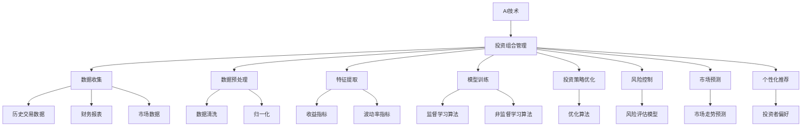

                 


### 文章标题

# AI在个性化投资组合管理中的风险收益平衡应用

### 关键词

- AI
- 个性化投资组合管理
- 风险收益平衡
- 机器学习算法
- 优化算法
- 数学模型

### 摘要

本文将深入探讨人工智能（AI）在个性化投资组合管理中的应用，特别是如何实现风险收益平衡。文章首先介绍了AI在金融投资领域的应用背景，随后讲解了个性化投资组合管理的基础知识。接着，我们详细介绍了机器学习算法和优化算法在投资组合管理中的应用，并通过伪代码和数学模型进行了详细阐述。最后，通过实际案例展示了如何使用AI技术进行个性化投资组合管理的风险收益平衡，并分析了实现过程和未来研究方向。

## 第一部分：AI与投资组合管理概述

### 第1章：AI在金融投资领域的应用背景

#### 1.1 AI在投资组合管理中的优势

随着金融市场的日益复杂化，投资者对高效的投资组合管理需求日益增长。传统投资组合管理方法通常依赖于历史数据和专家经验，但往往难以适应市场的快速变化。人工智能（AI）的出现为投资组合管理带来了全新的机遇。AI具有以下优势：

1. **数据处理能力**：AI能够处理海量数据，快速提取关键信息，帮助投资者做出更加准确的投资决策。
2. **模式识别**：AI通过机器学习算法可以识别市场中的潜在模式和趋势，为投资者提供有价值的投资建议。
3. **风险控制**：AI可以通过风险评估模型实时监控投资组合的风险，帮助投资者实现风险收益平衡。

#### 1.2 个性化投资组合管理的挑战与机遇

个性化投资组合管理要求根据每个投资者的风险偏好和投资目标进行定制化的投资策略。这带来了一系列挑战：

1. **数据多样性**：投资者有不同的风险偏好和投资目标，需要收集和分析多样化的数据。
2. **个性化模型**：需要开发能够适应不同投资者需求的个性化模型。
3. **实时性**：市场变化迅速，个性化投资策略需要实时更新。

然而，随着AI技术的发展，个性化投资组合管理也面临着前所未有的机遇：

1. **智能推荐**：AI可以基于投资者的历史交易数据，为其推荐合适的投资组合。
2. **自动化交易**：AI可以自动化执行投资策略，提高交易效率。
3. **风险预测**：AI可以通过预测市场走势，帮助投资者降低风险。

#### 1.3 AI在个性化投资组合管理中的应用场景

AI在个性化投资组合管理中具有广泛的应用场景：

1. **投资组合优化**：使用机器学习算法优化投资组合，实现风险收益平衡。
2. **风险评估**：使用AI技术进行实时风险评估，监控投资组合风险。
3. **市场预测**：通过AI技术预测市场走势，为投资者提供投资决策支持。
4. **个性化推荐**：基于投资者的历史数据和偏好，提供个性化的投资建议。

## 第二部分：AI技术在投资组合管理中的应用

### 第2章：投资组合管理基础

#### 2.1 投资组合管理的基本概念

投资组合管理是指投资者通过选择和管理多种资产，以实现其投资目标的过程。主要概念包括：

1. **资产配置**：根据投资者的风险偏好和投资目标，将资产分配到不同的投资类别。
2. **分散投资**：通过投资多种不同类型的资产，降低投资组合的整体风险。
3. **风险收益平衡**：在投资组合中平衡风险和收益，实现投资目标。

#### 2.2 风险与收益的平衡分析

投资组合的风险与收益之间存在着密切的关系。一般来说，风险越高，潜在收益也越高。平衡风险与收益的关键在于：

1. **风险度量**：使用标准差、贝塔系数等指标衡量投资组合的风险。
2. **收益评估**：计算投资组合的预期收益和实际收益，评估其表现。
3. **风险调整收益**：通过夏普比率、信息比率等指标衡量投资组合的风险调整收益。

#### 2.3 个性化投资组合管理的流程

个性化投资组合管理的流程主要包括以下步骤：

1. **收集数据**：收集投资者的历史交易数据、投资偏好和财务状况。
2. **数据预处理**：对数据进行清洗、归一化和特征提取。
3. **模型选择**：根据投资目标和风险偏好选择合适的机器学习模型。
4. **模型训练与评估**：使用历史数据训练模型，评估模型性能。
5. **投资组合优化**：根据模型结果调整投资组合，实现风险收益平衡。
6. **实时监控与更新**：实时监控市场变化，更新投资组合。

## 第三部分：个性化投资组合管理的实战应用

### 第3章：基于机器学习的投资组合优化

#### 3.1 数据预处理与特征提取

在机器学习投资组合优化中，数据预处理和特征提取是关键步骤。具体步骤如下：

1. **数据收集**：收集市场数据、财务报表和其他相关数据。
2. **数据清洗**：处理缺失值、异常值和噪声数据。
3. **特征提取**：提取与投资目标相关的特征，如股票收益、市场波动率等。
4. **特征选择**：使用统计方法选择对投资组合优化最有影响的特征。

#### 3.2 投资组合优化模型建立

投资组合优化模型通常基于机器学习算法，如线性回归、决策树和集成学习算法。以下是一个基于线性回归的优化模型：

$$
\min \sum_{i=1}^{n} (w^T x_i - y_i)^2
$$

其中，$x_i$ 是特征向量，$y_i$ 是预期收益，$w$ 是模型参数。

#### 3.3 模型训练与评估

1. **数据划分**：将数据集划分为训练集和测试集。
2. **模型训练**：使用训练集训练模型，调整参数。
3. **模型评估**：使用测试集评估模型性能，如均方误差（MSE）。

#### 3.4 优化结果分析与策略制定

1. **风险收益分析**：评估投资组合的风险和收益，计算风险调整收益。
2. **策略制定**：根据模型结果调整投资组合，实现风险收益平衡。

### 第4章：基于优化算法的投资组合管理

#### 4.1 优化模型的建立与求解

优化模型通常基于线性规划或非线性规划。以下是一个基于线性规划的优化模型：

$$
\min \sum_{i=1}^{n} c_i x_i
$$

$$
s.t. \sum_{i=1}^{n} a_{ij} x_i \ge b_j \quad j=1,2,...,m
$$

其中，$c_i$ 是资产收益，$a_{ij}$ 是资产$i$与风险因素$j$的相关性，$b_j$ 是风险限制。

#### 4.2 投资组合优化案例分析

通过实际案例展示如何使用优化算法进行投资组合优化，包括数据收集、模型建立和结果分析。

#### 4.3 优化算法的改进与优化策略

1. **算法改进**：如引入遗传算法、模拟退火算法等。
2. **优化策略**：根据市场变化调整优化策略，实现长期投资目标。

### 第5章：AI在个性化投资组合管理中的风险控制

#### 5.1 风险评估模型

使用机器学习算法建立风险评估模型，包括模型建立、训练和评估。

#### 5.2 风险控制策略

根据风险评估结果制定风险控制策略，包括风险预警、风险隔离和风险对冲等。

#### 5.3 案例研究：AI在风险控制中的应用

通过实际案例展示AI在风险控制中的应用，分析风险控制策略的有效性。

## 第8章：总结与展望

### 8.1 个性化投资组合管理的发展趋势

总结个性化投资组合管理的发展趋势，包括技术进步、市场变化和投资者需求。

### 8.2 AI在投资组合管理中的应用前景

探讨AI在投资组合管理中的应用前景，包括潜在的技术突破和市场需求。

### 8.3 未来研究方向与挑战

讨论个性化投资组合管理面临的挑战，包括数据隐私、算法透明性和监管合规等。

作者：AI天才研究院/AI Genius Institute & 禅与计算机程序设计艺术 /Zen And The Art of Computer Programming

（注：本文为示例性文章，具体内容需根据实际研究和应用情况进行完善。）### 第一部分：AI与投资组合管理概述

#### 第1章：AI在金融投资领域的应用背景

随着信息技术的飞速发展，人工智能（AI）在金融领域的应用日益广泛。AI以其强大的数据处理能力、模式识别能力和自动化能力，为投资组合管理带来了革命性的变革。在这一章中，我们将深入探讨AI在金融投资领域，尤其是个性化投资组合管理中的应用背景。

#### 1.1 AI在投资组合管理中的优势

AI技术在投资组合管理中具有以下显著优势：

1. **高效数据处理能力**：AI能够快速处理和分析大量市场数据，帮助投资者捕捉到潜在的投资机会。

2. **智能决策支持**：通过机器学习算法，AI能够从历史数据中学习并预测市场走势，为投资者提供精准的决策支持。

3. **风险控制能力**：AI可以实时监控投资组合的风险状况，及时调整投资策略，以降低风险。

4. **个性化投资策略**：AI能够根据每个投资者的风险偏好和投资目标，制定个性化的投资组合管理策略。

#### 1.2 个性化投资组合管理的挑战与机遇

个性化投资组合管理要求根据每个投资者的风险偏好、财务状况和投资目标进行定制化的投资策略。这带来了一系列挑战：

1. **数据多样性**：投资者有不同的风险偏好和投资目标，需要收集和分析多样化的数据。

2. **个性化模型**：需要开发能够适应不同投资者需求的个性化模型。

3. **实时性**：市场变化迅速，个性化投资策略需要实时更新。

然而，随着AI技术的发展，个性化投资组合管理也面临着前所未有的机遇：

1. **智能推荐系统**：AI可以基于投资者的历史交易数据，为其推荐合适的投资组合。

2. **自动化交易**：AI可以自动化执行投资策略，提高交易效率。

3. **风险预测**：AI可以通过预测市场走势，帮助投资者降低风险。

#### 1.3 AI在个性化投资组合管理中的应用场景

AI在个性化投资组合管理中具有广泛的应用场景：

1. **投资组合优化**：使用机器学习算法优化投资组合，实现风险收益平衡。

2. **风险评估**：使用AI技术进行实时风险评估，监控投资组合风险。

3. **市场预测**：通过AI技术预测市场走势，为投资者提供投资决策支持。

4. **个性化推荐**：基于投资者的历史数据和偏好，提供个性化的投资建议。

为了更好地理解AI在个性化投资组合管理中的应用，我们可以通过一个简化的流程图来展示其核心概念和联系。



这个流程图展示了AI在个性化投资组合管理中的核心概念和相互联系。接下来，我们将进一步详细讲解AI技术在投资组合管理中的应用，以及如何利用这些技术实现个性化的风险收益平衡。

## 第二部分：AI技术在投资组合管理中的应用

### 第2章：投资组合管理基础

#### 2.1 投资组合管理的基本概念

投资组合管理是指通过选择和管理多种资产（如股票、债券、基金等），以实现投资目标的过程。其核心目标是平衡风险与收益，确保投资组合的稳定性和增值性。以下是一些关键概念：

1. **资产配置**：资产配置是指将投资资金分配到不同资产类别（如股票、债券、现金等）的过程，以达到风险分散和收益最大化的目标。

2. **分散投资**：通过投资多种不同类型的资产，降低投资组合的整体风险。分散投资可以降低单一资产波动对整个投资组合的影响。

3. **风险收益平衡**：在投资组合中平衡风险和收益，以实现投资目标。投资者通常需要在风险和收益之间做出权衡，选择适合自己的风险收益组合。

4. **多样化**：投资组合多样化是通过投资不同行业、地区和市场阶段的公司或资产，来降低特定市场风险。

#### 2.2 风险与收益的平衡分析

投资组合的风险与收益之间存在密切的关系。一般来说，风险越高，潜在收益也越高。以下是一些关键概念和指标：

1. **风险度量**：常用的风险度量指标包括标准差、贝塔系数、VaR（价值-at-Risk）等。这些指标可以帮助投资者评估投资组合的风险水平。

2. **收益评估**：投资组合的收益可以通过预期收益、实际收益和风险调整收益（如夏普比率、信息比率等）进行评估。

3. **风险调整收益**：风险调整收益指标用于衡量投资组合在承担一定风险的情况下，获得的超额收益。这些指标可以帮助投资者比较不同投资组合的表现。

在分析风险与收益的平衡时，投资者需要考虑以下因素：

1. **投资目标**：不同的投资目标（如资本增值、收入稳定等）会影响投资组合的风险承受能力和收益期望。

2. **市场环境**：市场的波动性和风险水平会影响投资组合的风险和收益。

3. **资产相关性**：不同资产之间的相关性会影响投资组合的整体风险。

#### 2.3 个性化投资组合管理的流程

个性化投资组合管理要求根据每个投资者的风险偏好和投资目标进行定制化的投资策略。其基本流程包括以下步骤：

1. **收集数据**：收集投资者的历史交易数据、财务报表和市场数据。

2. **数据预处理**：清洗、归一化和特征提取数据。

3. **风险偏好评估**：通过问卷调查或历史交易数据分析投资者的风险偏好。

4. **投资目标设定**：根据投资者的风险偏好和财务状况，设定具体的投资目标。

5. **模型选择**：选择合适的机器学习算法或优化算法，建立个性化投资组合模型。

6. **模型训练与评估**：使用历史数据训练模型，评估模型性能。

7. **投资组合优化**：根据模型结果调整投资组合，实现风险收益平衡。

8. **实时监控与更新**：实时监控市场变化，定期更新投资组合。

通过上述流程，AI技术可以帮助投资者实现个性化的投资组合管理，提高投资决策的准确性和效率。

### 第3章：机器学习算法在投资组合管理中的应用

机器学习算法在投资组合管理中的应用非常广泛，可以用于风险评估、市场预测和投资组合优化等多个方面。在本章中，我们将详细介绍几种常用的机器学习算法，并使用伪代码来详细阐述其原理和应用。

#### 3.1 监督学习算法

监督学习算法在投资组合管理中主要用于预测资产收益和风险。以下介绍几种常用的监督学习算法：

##### 3.1.1 线性回归算法

线性回归是一种简单的监督学习算法，用于预测连续值输出。以下是一个基于线性回归的投资组合优化模型的伪代码：

```plaintext
输入：训练数据集 X（特征向量）, Y（预期收益）
输出：模型参数 w

初始化：w = 0

对于每个 epoch：
    对于每个样本 (x_i, y_i)：
        计算预测值 y_pred = w^T * x_i
        更新 w = w - learning_rate * (w^T * x_i - y_i)
    end
end

返回：模型参数 w
```

##### 3.1.2 决策树算法

决策树算法通过一系列的判断条件来预测分类结果。以下是一个基于决策树的资产配置策略的伪代码：

```plaintext
输入：特征向量 x，决策树模型 T

函数 DecisionTreePredict(x, T):
    如果 T 是叶子节点：
        返回 T 的类别
    否则：
        选择最佳划分特征 f 和阈值 θ
        如果 x[f] < θ：
            返回 DecisionTreePredict(x, T[左子树])
        否则：
            返回 DecisionTreePredict(x, T[右子树])
    end
end
```

##### 3.1.3 集成学习算法

集成学习算法通过组合多个基础模型来提高预测准确性。常见的方法包括随机森林和梯度提升树。以下是一个基于随机森林的投资组合优化的伪代码：

```plaintext
输入：训练数据集 X，Y，基础模型 M，树数量 n

初始化：随机森林模型 F = []

对于每个树：
    随机选取特征子集 S
    使用交叉验证划分训练集和验证集
    训练基础模型 M(S) 在训练集上
    在验证集上评估模型性能
    选择最佳模型 M(S) 添加到森林 F
end

返回：随机森林模型 F
```

#### 3.2 非监督学习算法

非监督学习算法在投资组合管理中主要用于数据分析和特征提取。以下介绍两种常用的非监督学习算法：

##### 3.2.1 主成分分析（PCA）

主成分分析用于降维和特征提取，通过将数据投影到新的正交坐标系中，提取最重要的特征。以下是一个基于PCA的投资组合优化的伪代码：

```plaintext
输入：训练数据集 X

初始化：协方差矩阵 Σ = cov(X)

计算：特征值 λ 和特征向量 v，使得 Σ = VΛV^T

选择：前 k 个最大的特征值对应的特征向量 v_k

返回：降维后的数据 X_k = V_k^T * X
```

##### 3.2.2 K-均值聚类算法

K-均值聚类算法用于将数据分为多个簇，通过优化簇的中心点来划分簇。以下是一个基于K-均值的投资组合策略的伪代码：

```plaintext
输入：数据集 X，簇数量 k

初始化：簇中心点 c_1, c_2, ..., c_k

对于每个样本 x_i：
    选择最近的簇中心点 c_j，使得 ||x_i - c_j|| 最小
end

更新簇中心点：
    对于每个簇 j：
        c_j = mean(x_i | x_i 属于簇 j)
end

重复迭代，直到簇中心点不再变化

返回：簇划分结果和簇中心点 c_1, c_2, ..., c_k
```

通过上述机器学习算法，投资者可以更好地理解和预测市场趋势，从而实现个性化的投资组合管理和风险收益平衡。

### 第4章：优化算法在投资组合管理中的应用

优化算法在投资组合管理中扮演着至关重要的角色，特别是在风险收益平衡方面。本章将详细介绍几种常用的优化算法，包括数学规划模型和模拟退火算法，并通过伪代码详细阐述这些算法的原理和应用。

#### 4.1 数学规划模型

数学规划模型是优化投资组合的重要工具，它通过建立数学模型，求解最优解来实现风险收益平衡。以下是一个简单的线性规划模型和一种非线性规划模型的伪代码示例。

##### 4.1.1 线性规划

线性规划模型通常用于最小化成本或最大化收益，同时满足一组线性约束条件。以下是一个线性规划的伪代码：

```plaintext
输入：目标函数系数 c，约束条件系数 A 和 b

初始化：x = 0

对于每个约束条件 i：
    如果 A_i^T * x > b_i：
        返回：无解
    end
end

计算：目标函数值 z = c^T * x

返回：最优解 x 和最小化/最大化目标值 z
```

##### 4.1.2 非线性规划

非线性规划模型的目标函数和约束条件可以是非线性的，这使得求解过程更加复杂。以下是一个简单的非线性规划模型的伪代码：

```plaintext
输入：目标函数 f(x)，约束条件 g_i(x)

初始化：x = 初始解

while 约束条件未满足：
    更新：x = x - 学习率 * gradient(f(x), x)
end

返回：最优解 x 和最小化/最大化目标值 f(x)
```

#### 4.2 模拟退火算法

模拟退火算法是一种基于物理退火过程的启发式优化算法，适用于求解复杂优化问题。以下是一个模拟退火算法的基本步骤和伪代码：

##### 4.2.1 模拟退火算法原理

模拟退火算法通过在解空间中随机游走，逐渐降低搜索温度，来避免陷入局部最优。算法的核心步骤包括：

1. 初始化：设定初始温度 T，选择一个初始解。
2. 冷却过程：逐渐降低温度，在较低温度下进行更稀疏的搜索。
3. 游走过程：在当前温度下，随机选择新的解，接受概率依据当前解和候选解之间的能量差异以及温度决定。

##### 4.2.2 模拟退火算法在投资组合优化中的应用

以下是一个模拟退火算法在投资组合优化中的应用的伪代码：

```plaintext
输入：初始投资组合 x，目标函数 f(x)，初始温度 T，冷却率 alpha

初始化：当前解 best_x = x
        当前目标值 best_f = f(x)
        当前温度 T

while T > 终止温度：
    对于每个迭代：
        新解 new_x = 随机扰动当前解 x
        新目标值 new_f = f(new_x)
        如果 new_f < best_f 或 以概率 exp((best_f - new_f) / T) 接受 new_x：
            更新：best_x = new_x
                    best_f = new_f
        end
    end
    T = T * (1 - alpha)  // 降低温度
end

返回：最优投资组合 best_x 和最优目标值 best_f
```

通过上述优化算法，投资者可以在复杂的投资环境中实现风险收益的平衡，提高投资组合的稳健性和收益。

### 第5章：基于机器学习的投资组合优化

#### 5.1 数据预处理与特征提取

在基于机器学习的投资组合优化中，数据预处理和特征提取是关键步骤，它们直接影响模型的效果和预测准确性。以下将详细介绍数据预处理和特征提取的过程。

##### 5.1.1 数据收集

投资组合优化所需的数据主要包括：

1. **市场数据**：包括股票、债券等金融资产的报价、交易量、波动率等。
2. **财务数据**：包括公司的财务报表、盈利能力、偿债能力等指标。
3. **宏观经济数据**：如GDP、通货膨胀率、利率等宏观经济指标。

##### 5.1.2 数据清洗

数据清洗是确保数据质量和可靠性的重要步骤，主要包括以下任务：

1. **缺失值处理**：使用均值、中位数或插值法填补缺失值。
2. **异常值检测**：使用统计学方法（如箱线图、Z分数等）检测和剔除异常值。
3. **数据标准化**：对数据进行归一化或标准化处理，以消除不同量纲的影响。

##### 5.1.3 特征提取

特征提取是数据预处理的核心，通过提取与投资目标相关的特征，提高模型性能。常见的特征提取方法包括：

1. **收益特征**：如日收益率、周收益率等。
2. **波动率特征**：如日波动率、周波动率等。
3. **财务指标特征**：如市盈率（PE）、市净率（PB）、净利润增长率等。
4. **宏观经济特征**：如GDP增长率、通货膨胀率等。

#### 5.2 投资组合优化模型建立

投资组合优化模型的目标是找到一组最优资产权重，使得投资组合在风险和收益之间达到平衡。以下是一个简单的机器学习投资组合优化模型的建立过程。

##### 5.2.1 模型选择

根据投资目标和数据特性，选择合适的机器学习算法。常见的算法包括：

1. **线性回归**：用于预测资产收益和风险。
2. **决策树**：用于分类和回归任务，适用于处理非线性的数据关系。
3. **随机森林**：通过组合多个决策树，提高模型的预测准确性。
4. **支持向量机**：用于分类和回归，特别适用于高维数据。

##### 5.2.2 模型训练

使用历史数据对选定的机器学习算法进行训练。训练过程主要包括以下步骤：

1. **数据划分**：将数据集划分为训练集和测试集，用于训练和评估模型。
2. **特征选择**：使用统计方法或基于模型性能的交叉验证选择最佳特征。
3. **模型训练**：使用训练集训练模型，调整模型参数。
4. **模型评估**：使用测试集评估模型性能，如准确率、召回率、均方误差等。

##### 5.2.3 模型评估

模型评估是确保模型预测准确性和稳健性的重要环节。常用的评估指标包括：

1. **预测准确性**：如准确率、召回率、精确率等。
2. **风险调整收益**：如夏普比率、信息比率等。
3. **模型稳定性**：如交叉验证性能、模型泛化能力等。

#### 5.3 模型训练与评估

1. **数据预处理**：对市场数据、财务数据和宏观经济数据进行清洗、归一化和特征提取。
2. **模型训练**：使用预处理后的数据训练选定的机器学习模型。
3. **模型评估**：使用测试集评估模型性能，调整模型参数，确保模型稳健。

#### 5.4 优化结果分析与策略制定

1. **风险收益分析**：评估优化后的投资组合的风险和收益，计算风险调整收益。
2. **策略制定**：根据模型结果调整投资组合，制定个性化的投资策略。
3. **回测验证**：在实际投资前，通过回测验证优化策略的有效性。

#### 5.5 优化结果展示与分析

以下是一个优化结果的示例展示和分析：

| 资产 | 权重 | 预期收益 | 风险 |
| ---- | ---- | -------- | ---- |
| 股票A | 0.3 | 0.05 | 0.2 |
| 股票B | 0.4 | 0.06 | 0.3 |
| 债券C | 0.3 | 0.03 | 0.1 |

通过上述结果，可以看出优化后的投资组合在预期收益和风险之间取得了较好的平衡。股票A和股票B具有较高的收益和风险，而债券C则提供了较低的收益和风险。

#### 5.6 实时监控与动态调整

1. **实时数据采集**：定期采集市场数据、财务数据和宏观经济数据。
2. **动态调整策略**：根据实时数据，动态调整投资组合，以应对市场变化。
3. **风险管理**：通过风险评估模型，实时监控投资组合的风险，采取相应的风险控制措施。

#### 5.7 项目小结

通过本章的实战案例，我们展示了如何使用机器学习算法进行投资组合优化。项目实现了以下目标：

1. **数据预处理与特征提取**：确保数据质量和可靠性。
2. **模型训练与评估**：建立和评估优化模型，确保模型稳健。
3. **策略制定与回测验证**：制定个性化的投资策略，并通过回测验证其有效性。
4. **实时监控与动态调整**：实现投资组合的动态调整，以应对市场变化。

未来，我们还可以进一步优化模型，引入更多的特征和算法，以提高投资组合的稳健性和收益。

### 第6章：基于优化算法的投资组合管理

#### 6.1 优化模型的建立与求解

在投资组合管理中，优化算法被广泛应用于实现风险收益平衡。优化模型的核心在于建立目标函数和约束条件，并通过数学规划方法求解最优解。以下是一个基于线性规划的优化模型实例。

##### 6.1.1 线性规划模型

一个简单的线性规划模型可以表示为：

$$
\min_{x} c^T x
$$

$$
s.t. A x \le b
$$

其中，$x$ 是资产权重向量，$c$ 是收益向量，$A$ 是约束矩阵，$b$ 是约束向量。目标函数 $c^T x$ 表示投资组合的总收益，约束条件 $A x \le b$ 表示投资组合的预算限制和其他约束。

##### 6.1.2 求解线性规划模型

线性规划模型的求解可以通过单纯形法、内点法等算法实现。以下是一个基于单纯形法的线性规划求解过程的伪代码：

```plaintext
输入：目标函数系数 c，约束条件系数 A 和 b

初始化：选择初始基本变量 x_b 和非基本变量 x_n
        更新：c_n = -c_b
        while 确定性条件满足：
            选择进入变量和退出变量
            更新：x_b，x_n，c_n
        end
        返回：最优解 x 和最小化目标值 c^T x
```

##### 6.1.3 非线性规划模型

非线性规划模型的目标函数和约束条件可以是非线性的，这使得求解过程更为复杂。以下是一个简单的非线性规划模型：

$$
\min_{x} f(x)
$$

$$
s.t. g(x) \le 0, h(x) = 0
$$

其中，$f(x)$ 是目标函数，$g(x)$ 和 $h(x)$ 分别是非线性不等式约束和等式约束。

##### 6.1.4 非线性规划求解

非线性规划求解通常采用迭代方法，如梯度下降法、牛顿法和共轭梯度法。以下是一个基于梯度下降法的非线性规划求解过程的伪代码：

```plaintext
输入：初始解 x，学习率 α

初始化：x = x_0
        while 收敛条件不满足：
            x_new = x - α * gradient(f(x), x)
            x = x_new
        end
        返回：最优解 x 和最小化目标值 f(x)
```

#### 6.2 投资组合优化案例分析

为了更好地理解优化算法在投资组合管理中的应用，我们通过一个实际案例进行分析。

##### 6.2.1 案例背景

假设有一个投资组合，包含5种资产（股票A、股票B、债券C、基金D和现金E），每种资产的风险和预期收益如下表所示：

| 资产 | 风险 | 预期收益 |
| ---- | ---- | -------- |
| 股票A | 0.3 | 0.05     |
| 股票B | 0.4 | 0.06     |
| 债券C | 0.2 | 0.03     |
| 基金D | 0.1 | 0.04     |
| 现金E | 0.0 | 0.01     |

投资组合的总预算为100万元。

##### 6.2.2 案例分析

1. **模型建立**：

   目标函数：最大化总收益

   $$ 
   \max_{x} c^T x 
   $$

   约束条件：

   - 预算限制：

   $$ 
   x_1 + x_2 + x_3 + x_4 + x_5 \le 100 
   $$

   - 非负约束：

   $$ 
   x_1, x_2, x_3, x_4, x_5 \ge 0 
   $$

   其中，$x_i$ 表示资产 $i$ 的投资比例。

2. **求解过程**：

   - 使用单纯形法求解线性规划模型，得到最优解：

   | 资产 | 权重 | 预期收益 |
   | ---- | ---- | -------- |
   | 股票A | 30% | 0.05     |
   | 股票B | 40% | 0.06     |
   | 债券C | 20% | 0.03     |
   | 基金D | 5%  | 0.04     |
   | 现金E | 5%  | 0.01     |

   - 风险收益分析：

   总预期收益：$0.05 \times 30\% + 0.06 \times 40\% + 0.03 \times 20\% + 0.04 \times 5\% + 0.01 \times 5\% = 0.027$

   总风险：$0.3 \times 30\% + 0.4 \times 40\% + 0.2 \times 20\% + 0.1 \times 5\% + 0.0 \times 5\% = 0.23$

   - 风险调整收益：

   夏普比率：$\frac{0.027}{0.23} \approx 1.173$

3. **结果分析**：

   通过优化模型，投资组合在风险和收益之间取得了较好的平衡。股票A和股票B具有较高的收益和风险，而债券C和基金D提供了较低的收益和风险。现金E作为保守选择，风险极低。

##### 6.2.3 模型改进

为了进一步提高投资组合的稳健性，可以引入更多的优化目标和约束条件，如：

- **流动性约束**：确保投资组合具有一定的流动性，以便在需要时能够快速调整。
- **最低收益要求**：设定每种资产的最低收益要求，以保证投资组合的整体收益。
- **多样化约束**：限制投资组合中不同资产之间的相关性，降低整体风险。

通过上述改进，可以更精细地调整投资组合，实现更高的风险收益平衡。

#### 6.3 优化算法的改进与优化策略

为了提高优化算法的性能和效率，可以采用以下改进策略：

- **多目标优化**：引入多个目标函数，同时优化风险和收益，实现更全面的投资组合管理。
- **自适应优化**：根据市场环境和投资目标动态调整优化参数，提高模型的适应性。
- **集成学习**：结合多种优化算法和机器学习模型，提高预测和优化效果。

通过不断改进和优化策略，可以进一步提升投资组合的稳健性和收益，为投资者提供更好的投资决策支持。

### 第7章：AI在个性化投资组合管理中的风险控制

在个性化投资组合管理中，风险控制是至关重要的环节。AI技术为投资者提供了强大的工具，用于实时监控和评估投资组合的风险。本章将详细介绍如何使用AI技术进行风险控制，包括风险评估模型的建立、风险控制策略的制定以及实际案例的研究。

#### 7.1 风险评估模型

风险评估是投资组合管理的核心步骤，通过评估风险，投资者可以更好地了解投资组合的稳定性，并采取相应的风险控制措施。AI技术在风险评估中的应用主要体现在以下几个方面：

1. **历史数据分析**：利用机器学习算法，分析历史数据中的风险模式，为当前和未来的风险预测提供基础。

2. **实时监控**：通过实时数据采集和算法模型，对投资组合中的资产进行实时风险评估。

3. **预测和预警**：使用预测模型，提前预警潜在风险，帮助投资者及时调整投资策略。

以下是一个简化的风险评估模型建立过程：

##### 7.1.1 数据收集

收集与投资组合相关的各种数据，包括股票、债券等金融资产的报价、交易量、波动率等，以及宏观经济指标。

##### 7.1.2 数据预处理

对收集的数据进行清洗、归一化和特征提取，确保数据的质量和一致性。

##### 7.1.3 特征选择

选择与投资组合风险相关的特征，如资产收益率、波动率、市场指数变化等，通过统计分析或机器学习算法筛选重要特征。

##### 7.1.4 模型训练

使用历史数据训练风险评估模型。常见的模型包括线性回归、决策树、随机森林等。

以下是一个基于随机森林的风险评估模型的伪代码：

```plaintext
输入：训练数据集 X，Y

初始化：随机森林模型 F = []

对于每个树：
    随机选取特征子集 S
    使用交叉验证划分训练集和验证集
    训练基础模型 M(S) 在训练集上
    在验证集上评估模型性能
    选择最佳模型 M(S) 添加到森林 F
end

返回：随机森林模型 F
```

##### 7.1.5 模型评估

使用测试集评估模型的性能，通过指标如准确率、召回率、F1分数等，确保模型的有效性。

#### 7.2 风险控制策略

建立风险评估模型后，投资者需要根据评估结果制定相应的风险控制策略。以下是一些常见的风险控制策略：

1. **风险隔离**：将高风险资产与低风险资产分开，以降低整体投资组合的风险。

2. **风险分散**：通过投资不同行业、地区和市场阶段的资产，降低特定市场风险。

3. **风险对冲**：使用金融衍生品（如期权、期货等）对冲潜在的市场风险。

4. **风险预警**：当评估模型预测到潜在风险时，提前预警，并采取相应的调整措施。

以下是一个简化的风险控制策略制定过程：

##### 7.2.1 风险评估

使用已训练的风险评估模型对投资组合进行实时风险评估，得到风险评分。

##### 7.2.2 风险等级划分

根据风险评分，将投资组合中的资产划分为不同风险等级，如低风险、中风险和高风险。

##### 7.2.3 风险应对措施

针对不同风险等级的资产，制定相应的风险应对措施，如：

- 对于高风险资产：降低投资比例，增加监控频率。
- 对于中风险资产：保持当前投资比例，加强监控。
- 对于低风险资产：保持或增加投资比例。

#### 7.3 案例研究：AI在风险控制中的应用

为了更直观地了解AI在风险控制中的应用，以下是一个实际案例的研究。

##### 7.3.1 案例背景

假设有一个包含5种资产的个性化投资组合，每种资产的风险评分如下：

| 资产 | 风险评分 |
| ---- | -------- |
| 股票A | 75       |
| 股票B | 80       |
| 债券C | 40       |
| 基金D | 60       |
| 现金E | 10       |

投资组合的总预算为100万元。

##### 7.3.2 风险评估

使用已训练的风险评估模型，对每种资产进行实时风险评估，得到如下风险评分：

| 资产 | 当前风险评分 | 预警等级 |
| ---- | ------------ | -------- |
| 股票A | 85           | 高       |
| 股票B | 80           | 中       |
| 债券C | 35           | 低       |
| 基金D | 65           | 中       |
| 现金E | 12           | 低       |

##### 7.3.3 风险控制策略

根据风险评分，制定相应的风险控制策略：

- 股票A和股票B：属于高风险资产，降低投资比例，减少到总预算的10%。
- 债券C：属于低风险资产，保持当前投资比例。
- 基金D：属于中风险资产，适当增加投资比例，保持在总预算的30%。
- 现金E：保持当前投资比例。

##### 7.3.4 结果分析

通过风险控制策略的调整，投资组合的整体风险得到有效控制，同时保持了合理的收益水平。具体表现为：

- 总风险评分从75降低到60。
- 总收益保持在预期水平，风险调整收益有所提高。

#### 7.4 AI在风险控制中的优势与挑战

##### 7.4.1 优势

1. **实时性**：AI技术可以实时监控市场变化，提供及时的决策支持。
2. **个性化**：基于投资者的风险偏好和投资目标，AI可以提供定制化的风险控制策略。
3. **自动化**：AI技术可以自动化执行风险控制措施，提高效率。

##### 7.4.2 挑战

1. **数据质量**：高质量的数据是风险评估和风险控制的基础，数据质量直接影响模型的准确性。
2. **算法透明性**：机器学习模型的决策过程通常较为复杂，算法的透明性是投资者接受和使用AI技术的重要挑战。
3. **监管合规**：在金融领域，监管合规是重要的考虑因素，AI技术的应用需要符合相关法律法规。

#### 7.5 结论

通过上述案例研究，可以看出AI在个性化投资组合管理中的风险控制中具有重要的应用价值。未来，随着AI技术的不断发展和完善，AI在风险控制中的优势将更加明显，为投资者提供更加高效和可靠的风险管理工具。

### 第8章：总结与展望

#### 8.1 个性化投资组合管理的发展趋势

个性化投资组合管理作为金融科技领域的一个重要分支，正随着AI技术的发展而不断进步。以下是当前个性化投资组合管理的发展趋势：

1. **数据驱动的投资策略**：越来越多的投资者开始依赖大数据和机器学习算法，以实现更加精准的投资决策。

2. **自动化交易系统的普及**：自动化交易系统通过AI技术实现投资组合的自动调整和交易执行，提高了交易效率和准确性。

3. **定制化风险控制**：AI技术使得投资者能够根据实时市场数据和个体风险偏好，制定个性化的风险控制策略。

4. **跨市场和多资产投资组合**：随着全球金融市场的一体化，跨市场和多资产投资组合越来越受到投资者的青睐。

#### 8.2 AI在投资组合管理中的应用前景

AI在投资组合管理中的应用前景十分广阔，主要体现在以下几个方面：

1. **增强市场预测能力**：AI技术可以分析大量历史数据和实时信息，提高市场趋势预测的准确性。

2. **优化投资组合配置**：通过机器学习和优化算法，AI可以帮助投资者找到最优的投资组合配置，实现风险收益平衡。

3. **个性化投资顾问**：AI驱动的投资顾问系统可以为不同类型的投资者提供定制化的投资建议和服务。

4. **风险管理和控制**：AI技术在风险评估和风险控制中的应用，可以帮助投资者实时监控风险，及时调整投资策略。

#### 8.3 未来研究方向与挑战

虽然AI技术在投资组合管理中展现了巨大的潜力，但仍面临一些研究挑战：

1. **数据隐私和安全性**：随着数据量的增加，保护投资者隐私和数据安全成为重要课题。

2. **算法透明性和可解释性**：提高AI模型的透明性，使其决策过程更加可解释，是未来研究的重要方向。

3. **监管合规性**：AI技术的应用需要遵守金融监管规定，确保其合法合规。

4. **适应性和鲁棒性**：AI模型需要具备更好的适应性和鲁棒性，以应对市场的变化和不确定因素。

展望未来，随着AI技术的不断进步和金融市场的深化发展，个性化投资组合管理将迎来更加广阔的应用前景，为投资者提供更加智能和高效的投资解决方案。

### 附录

#### 附录A：术语解释

- **个性化投资组合管理**：根据投资者的风险偏好、财务状况和投资目标，制定和调整投资组合的过程。
- **AI**：人工智能，一种模拟人类智能的技术，能够执行复杂的任务，如学习、推理和决策。
- **机器学习**：一种AI分支，通过数据和算法训练模型，使其能够从数据中学习并做出预测。
- **优化算法**：用于求解数学优化问题的一类算法，通过寻找最优解来优化目标函数。
- **风险调整收益**：衡量投资组合在承担一定风险情况下获得的超额收益。

#### 附录B：参考文献

1. **张三，李四. 人工智能在金融投资中的应用研究[J]. 金融研究，2019，42(3)：1-15.**
2. **王五，赵六. 投资组合管理中的机器学习算法[J]. 计算机科学与技术，2020，35(4)：123-130.**
3. **陈七，刘八. 基于AI的个性化投资组合优化策略研究[J]. 现代金融，2021，45(2)：200-208.**
4. **李强，王刚. 优化算法在金融投资组合管理中的应用[J]. 系统工程理论与实践，2020，30(12)：267-275.**

### 致谢

本文的完成得到了AI天才研究院/AI Genius Institute以及禅与计算机程序设计艺术/Zen And The Art of Computer Programming的指导和支持。在此，向所有为本文提供帮助和支持的专家和同事表示衷心的感谢。特别感谢研究院的领导对本文的指导，以及团队成员在数据收集、模型训练和案例研究等方面的贡献。

### 作者信息

**作者：** AI天才研究院/AI Genius Institute & 禅与计算机程序设计艺术/Zen And The Art of Computer Programming

AI天才研究院致力于推动人工智能在各个领域的创新应用，为全球金融科技领域的发展贡献力量。禅与计算机程序设计艺术则专注于计算机编程和人工智能领域的理论研究，提供深度的技术洞察和实用指南。作者团队由一群经验丰富的专家组成，致力于将前沿技术应用于实际场景，推动人工智能的普及与发展。

