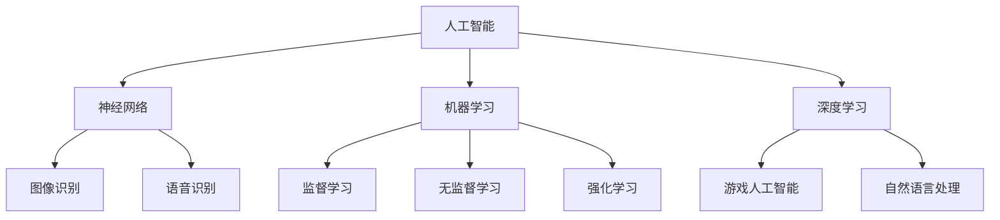
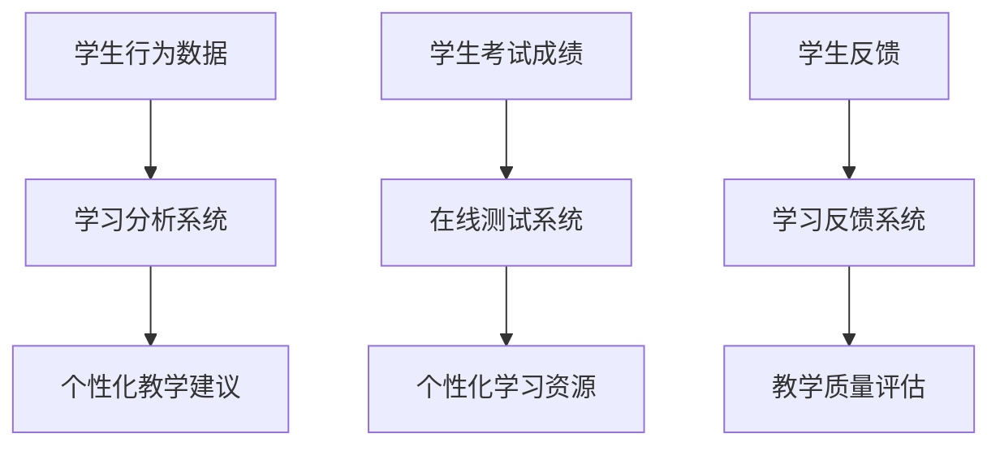
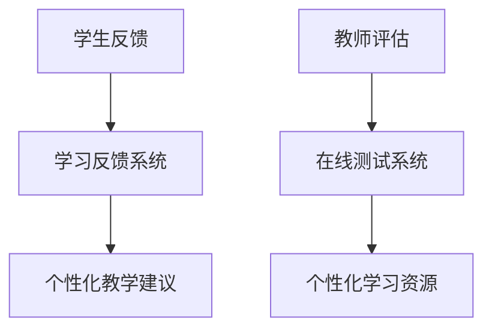

                 


### 文章标题
《AI在个性化教育评估与反馈中的应用与挑战》

### 关键词
人工智能、个性化教育、教育评估、反馈系统、机器学习、深度学习、数据隐私、伦理问题

### 摘要
本文深入探讨了人工智能（AI）在个性化教育评估与反馈系统中的应用及其面临的挑战。首先，介绍了AI的基础知识，包括AI的定义、发展历程、分类与应用场景，以及AI的核心技术。接着，详细分析了AI在个性化教育评估与反馈中的具体应用，包括评估与反馈的方法、工具以及相关案例。然后，探讨了教育领域AI应用所面临的数据隐私、技术偏见、伦理问题和实施障碍等挑战，并提出了相应的解决方案。最后，展望了AI教育的发展趋势以及未来可能遇到的机遇与挑战。

## 第一部分 AI基础知识

### 1.1 AI基础

#### 1.1.1 AI概述

AI（人工智能）是指通过计算机系统实现人类智能的过程。AI的发展历程可以追溯到20世纪50年代，当时计算机科学家开始研究如何让计算机模拟人类的思维过程。经过数十年的发展，AI技术已经取得了显著的进步，广泛应用于各行各业。

AI的分类与应用场景主要包括以下几个方面：

1. **基于规则的系统**：这类系统使用一组规则来模拟人类专家的决策过程，适用于简单的决策问题。
2. **机器学习系统**：通过从数据中学习模式来改进其性能，广泛应用于数据分析、图像识别和自然语言处理等领域。
3. **深度学习系统**：一种特殊的机器学习技术，通过多层神经网络来模拟人脑的学习过程，广泛应用于图像识别、语音识别和游戏人工智能等领域。

AI的核心技术包括：

1. **神经网络**：一种通过模拟生物神经网络来进行数据处理的技术，广泛应用于图像识别和语音识别等领域。
2. **机器学习算法**：通过从数据中学习模式来改进其性能的技术，包括监督学习、无监督学习和强化学习等。
3. **深度学习算法**：一种特殊的机器学习技术，通过多层神经网络来模拟人脑的学习过程，广泛应用于图像识别、语音识别和游戏人工智能等领域。

#### 1.1.2 Mermaid流程图：AI技术架构



### 1.2 机器学习基础

#### 1.2.1 机器学习概述

机器学习是一种通过从数据中学习模式来改进其性能的技术。根据学习方式，机器学习可以分为监督学习、无监督学习和强化学习。

1. **监督学习**：在这种学习方式中，算法根据已知的输入和输出数据来学习模型。常见的监督学习算法包括线性回归、逻辑回归、支持向量机和决策树等。
2. **无监督学习**：在这种学习方式中，算法不需要已知的输出数据，而是从输入数据中学习模式。常见的无监督学习算法包括聚类、主成分分析和自编码器等。
3. **强化学习**：在这种学习方式中，算法通过与环境的交互来学习最佳策略。常见的强化学习算法包括Q-learning和深度Q网络（DQN）等。

机器学习的应用场景非常广泛，包括图像识别、语音识别、自然语言处理、推荐系统、金融风险评估和医学诊断等。

#### 1.2.2 机器学习算法

**监督学习算法**：

- **线性回归**：通过找到一个最佳拟合直线来预测输出值。
  - **伪代码**：
    ```python
    def linear_regression(X, y):
        # X为输入特征矩阵，y为输出向量
        # 计算最佳拟合直线参数
        theta = (X^T * X)^-1 * X^T * y
        # 预测输出值
        return X * theta
    ```

- **逻辑回归**：通过找到一个最佳拟合曲线来预测输出值，通常用于分类问题。
  - **伪代码**：
    ```python
    def logistic_regression(X, y):
        # X为输入特征矩阵，y为输出向量
        # 计算最佳拟合曲线参数
        theta = (X^T * X)^-1 * X^T * y
        # 预测输出值
        return 1 / (1 + exp(-X * theta))
    ```

- **支持向量机（SVM）**：通过找到一个最佳超平面来分割数据。
  - **伪代码**：
    ```python
    def svm(X, y):
        # X为输入特征矩阵，y为输出向量
        # 计算最佳超平面参数
        theta = (X^T * X)^-1 * X^T * y
        # 预测输出值
        return sign(X * theta + b)
    ```

**无监督学习算法**：

- **聚类**：将数据点分为若干个簇，使同一簇内的数据点之间距离较短，不同簇的数据点之间距离较长。
  - **伪代码**：
    ```python
    def k_means(X, k):
        # X为输入特征矩阵，k为簇数
        # 初始化聚类中心
        centroids = initialize_centroids(X, k)
        # 训练聚类模型
        while not converged:
            # 分配数据点到最近的聚类中心
            clusters = assign_clusters(X, centroids)
            # 更新聚类中心
            centroids = update_centroids(clusters, X)
        # 返回聚类结果
        return centroids, clusters
    ```

- **主成分分析（PCA）**：通过降维技术将高维数据转换到低维空间，同时保留数据的主要特征。
  - **伪代码**：
    ```python
    def pca(X):
        # X为输入特征矩阵
        # 计算协方差矩阵
        cov_matrix = np.cov(X.T)
        # 计算协方差矩阵的特征值和特征向量
        eigenvalues, eigenvectors = np.linalg.eigh(cov_matrix)
        # 选择最大的特征值对应的特征向量
        principal_components = eigenvectors[:, eigenvalues.argsort()[::-1]]
        # 返回降维后的数据
        return X @ principal_components
    ```

**强化学习算法**：

- **Q-learning**：通过迭代更新Q值来学习最佳策略。
  - **伪代码**：
    ```python
    def q_learning(X, y, alpha, gamma):
        # X为输入特征矩阵，y为输出向量，alpha为学习率，gamma为折扣因子
        Q = initialize_Q(X, y)
        for episode in range(num_episodes):
            # 初始化状态
            state = initialize_state()
            while not terminal_state(state):
                # 选择最佳动作
                action = choose_action(Q, state)
                # 执行动作
                next_state, reward = execute_action(action)
                # 更新Q值
                Q[state, action] = Q[state, action] + alpha * (reward + gamma * np.max(Q[next_state]) - Q[state, action])
                # 更新状态
                state = next_state
        # 返回学到的Q值函数
        return Q
    ```

### 1.3 深度学习基础

#### 1.3.1 深度学习概述

深度学习是一种特殊的机器学习技术，通过多层神经网络来模拟人脑的学习过程。深度学习在图像识别、语音识别、自然语言处理和游戏人工智能等领域取得了显著的成果。

深度学习的特点包括：

1. **多层神经网络**：深度学习模型由多层神经元组成，通过逐层提取特征，实现从简单到复杂的特征表示。
2. **反向传播算法**：通过反向传播算法来更新网络参数，使网络能够不断优化性能。
3. **大规模数据训练**：深度学习模型通常需要大量的数据来进行训练，以提高模型的泛化能力。

深度学习的应用领域包括：

1. **图像识别**：通过卷积神经网络（CNN）实现图像的分类、目标检测和图像分割等任务。
2. **语音识别**：通过循环神经网络（RNN）和卷积神经网络（CNN）实现语音信号的识别和转换。
3. **自然语言处理**：通过循环神经网络（RNN）和变换器（Transformer）实现文本的生成、翻译和情感分析等任务。
4. **游戏人工智能**：通过深度学习实现游戏角色的智能行为，如围棋、国际象棋和电子游戏等。

#### 1.3.2 深度学习算法

**神经网络**：

神经网络是一种由多个神经元组成的计算模型，通过前向传播和反向传播来更新网络参数，实现从输入到输出的映射。

- **前向传播**：将输入数据通过网络中的各个层，逐层计算输出。
- **反向传播**：通过计算输出误差，逐层反向传播，更新网络参数。

**伪代码**：

```python
def neural_network_forward_propagation(X, W, b):
    # X为输入数据，W为权重矩阵，b为偏置向量
    Z = X @ W + b
    return sigmoid(Z)

def neural_network_backward_propagation(y, y_hat, W, b):
    # y为真实输出，y_hat为预测输出，W为权重矩阵，b为偏置向量
    error = y - y_hat
    dW = error @ X.T
    db = error
    return dW, db
```

**卷积神经网络（CNN）**：

卷积神经网络通过卷积层、池化层和全连接层等结构来提取图像的特征，实现图像分类、目标检测和图像分割等任务。

- **卷积层**：通过卷积操作来提取图像的特征。
- **池化层**：通过池化操作来减少特征图的尺寸，提高模型的泛化能力。
- **全连接层**：将特征图展平为一维向量，通过全连接层进行分类。

**伪代码**：

```python
def conv2d(X, W, b):
    # X为输入特征图，W为卷积核，b为偏置向量
    Z = (X @ W) + b
    return sigmoid(Z)

def max_pooling(Z, pool_size):
    # Z为输入特征图，pool_size为池化窗口大小
    return np.max(Z[:, :, pool_size:-pool_size, pool_size:-pool_size], axis=(2, 3))
```

**循环神经网络（RNN）**：

循环神经网络通过隐藏状态和输入之间的交互来处理序列数据，实现文本生成、语音识别和序列分类等任务。

- **隐藏状态**：通过前一个隐藏状态和当前输入之间的交互来计算当前隐藏状态。
- **梯度消失与梯度爆炸**：由于RNN中存在大量的循环结构，可能导致梯度消失或梯度爆炸，影响模型的训练效果。

**伪代码**：

```python
def rnn_forward_propagation(X, H, W, b):
    # X为输入序列，H为隐藏状态，W为权重矩阵，b为偏置向量
    H = [H[0]]
    for x in X:
        H.append(sigmoid(W_h * H[-1] + W_x * x + b))
    return H

def rnn_backward_propagation(H, y, y_hat, W, b):
    # H为隐藏状态，y为真实输出，y_hat为预测输出，W为权重矩阵，b为偏置向量
    dW_h = []
    dW_x = []
    db = []
    for h in reversed(H):
        dy = y - y_hat
        dh = dy * sigmoid_derivative(h)
        dW_h.append(dh @ H[:-1].T)
        dW_x.append(dh @ x.T)
        db.append(dh)
    return dW_h, dW_x, db
```

**生成对抗网络（GAN）**：

生成对抗网络由生成器和判别器组成，通过对抗训练来生成逼真的数据。

- **生成器**：通过随机噪声生成数据。
- **判别器**：通过判断生成器生成的数据是否真实来评估生成器的性能。

**伪代码**：

```python
def generator(Z, W_g):
    # Z为随机噪声，W_g为生成器权重
    X = tanh(Z @ W_g + b_g)
    return X

def discriminator(X, W_d):
    # X为输入数据，W_d为判别器权重
    D = sigmoid(X @ W_d + b_d)
    return D

def gan_forward_propagation(X, Z, W_g, W_d):
    # X为真实数据，Z为随机噪声，W_g为生成器权重，W_d为判别器权重
    X_fake = generator(Z, W_g)
    D_real = discriminator(X, W_d)
    D_fake = discriminator(X_fake, W_d)
    return D_real, D_fake

def gan_backward_propagation(D_real, D_fake, y_real, y_fake, W_g, W_d):
    # D_real为判别器对真实数据的预测，D_fake为判别器对生成器生成的数据的预测，y_real为真实标签，y_fake为生成标签，W_g为生成器权重，W_d为判别器权重
    dW_g = (D_fake - y_fake) * generator(Z, W_g).T
    dW_d = (D_real - y_real) * X.T
    return dW_g, dW_d
```

## 第二部分 个性化教育评估与反馈应用

### 2.1 个性化教育评估

#### 2.1.1 个性化教育评估概述

个性化教育评估是一种根据学生的个性特征、学习需求和成绩表现，提供定制化评估的方法。个性化教育评估的目的是为了更好地了解学生的学习状况，提供针对性的教育建议，促进学生的全面发展。

个性化教育评估的方法主要包括：

1. **基于学生行为数据的评估**：通过收集和分析学生的学习行为数据，如学习时间、学习进度、作业完成情况等，评估学生的学习效果。
2. **基于学生成绩的评估**：通过分析学生的考试成绩，评估学生在各个学科领域的掌握程度。
3. **基于学生反馈的评估**：通过收集学生的反馈意见，评估教学质量和教学效果。

个性化教育评估的工具主要包括：

1. **学习分析系统**：通过数据挖掘和分析技术，对学生行为数据进行分析，提供个性化的学习建议。
2. **在线测试系统**：通过在线测试，评估学生的知识掌握情况，提供个性化的学习资源。
3. **学习反馈系统**：通过学生反馈，收集学生对教学质量和教学效果的评估，提供针对性的改进建议。

#### 2.1.2 个性化教育评估案例

**案例一：基于学生行为数据的评估**

某学校采用学习分析系统对学生学习行为进行评估。学习分析系统可以记录学生的在线学习时间、学习进度、作业完成情况等数据。通过分析这些数据，学校可以了解学生的学习状况，为教师提供个性化的教学建议。

**案例二：基于学生成绩的评估**

某培训机构通过分析学生的考试成绩，为学生提供个性化的学习资源。根据学生的考试成绩，学校可以将学生分为不同的学习小组，为每个小组提供针对性的学习资源，以提高学生的学习效果。

#### 2.1.3 个性化教育评估与反馈流程图



### 2.2 个性化教育反馈

#### 2.2.1 个性化教育反馈概述

个性化教育反馈是一种根据学生的个性特征、学习需求和成绩表现，提供定制化反馈的方法。个性化教育反馈的目的是为了更好地了解学生的学习状况，提供针对性的反馈，促进学生的全面发展。

个性化教育反馈的方法主要包括：

1. **基于学生反馈的个性化调整**：通过收集学生的反馈意见，调整教学内容和方法，提高教学效果。
2. **基于教师评估的个性化调整**：通过教师对学生的评估，调整教学计划和教学内容，提高学生的学习效果。

个性化教育反馈的工具主要包括：

1. **学习反馈系统**：通过收集学生的反馈意见，提供个性化的教学建议。
2. **在线测试系统**：通过在线测试，评估学生的知识掌握情况，提供个性化的学习资源。
3. **学习分析系统**：通过分析学生的学习行为数据，提供个性化的学习建议。

#### 2.2.2 个性化教育反馈案例

**案例一：基于学生反馈的个性化调整**

某学校通过学习反馈系统收集学生的反馈意见，根据学生的反馈调整教学内容和方法。例如，如果学生反馈某个课程的教学难度较大，教师可以适当调整教学进度，提供额外的学习资源，帮助学生更好地掌握课程内容。

**案例二：基于教师评估的个性化调整**

某培训机构通过教师对学生的评估，调整教学计划和教学内容。根据教师的评估，学校可以为不同类型的学生提供针对性的学习资源，以提高学生的学习效果。

#### 2.2.3 个性化教育反馈流程图



## 第三部分 教育领域的挑战

### 3.1 数据隐私与安全

#### 3.1.1 数据隐私概述

数据隐私是指个人信息的保密性和安全性。在教育领域，学生和教师的数据包括学习记录、成绩、行为分析等，这些数据对于个性化教育至关重要。然而，数据隐私问题也带来了巨大的挑战。

**数据隐私的重要性**：

1. **学生权益**：保护学生的个人信息，确保学生隐私不受侵犯。
2. **教育质量**：确保数据的真实性和准确性，为个性化教育提供可靠依据。

**数据隐私保护的方法与策略**：

1. **数据加密**：通过加密技术，确保数据在传输和存储过程中的安全性。
2. **匿名化处理**：对敏感数据进行匿名化处理，以保护个人隐私。
3. **访问控制**：对数据的访问进行严格控制，确保只有授权人员才能访问敏感数据。
4. **隐私政策**：制定明确的隐私政策，告知学生和教师其数据的使用目的和范围。

#### 3.1.2 数据隐私案例

**案例一：学生数据隐私保护**

某学校在收集学生数据时，采取了多种数据隐私保护措施。首先，学校对学生的个人信息进行了加密处理，确保数据在传输和存储过程中的安全性。其次，学校对敏感数据进行了匿名化处理，以保护学生的隐私。此外，学校还制定了详细的隐私政策，告知学生和教师其数据的使用目的和范围。

**案例二：教师数据隐私保护**

某在线教育平台在收集教师数据时，同样重视数据隐私保护。平台采用了加密技术，确保教师个人信息的安全性。同时，平台对教师的教学记录进行了匿名化处理，以保护教师的隐私。此外，平台制定了明确的隐私政策，告知教师其数据的使用目的和范围。

### 3.2 技术偏见与伦理问题

#### 3.2.1 技术偏见概述

技术偏见是指算法或系统在处理数据时，因数据的不平衡、偏差或设计缺陷，导致对特定群体或个人产生不公平或偏见的结果。在教育领域，技术偏见可能导致教育资源的不公平分配、学习成果的差异等。

**技术偏见的概念与影响**：

1. **数据不平衡**：教育数据中某些群体或特征的数据量较少，可能导致算法对这部分群体的识别和预测不准确。
2. **设计缺陷**：算法或系统的设计缺陷可能导致对特定群体或个人的偏见，如种族、性别、年龄等。

**技术偏见的表现形式与来源**：

1. **种族偏见**：算法在处理种族相关数据时，可能对某些种族产生偏见。
2. **性别偏见**：算法在处理性别相关数据时，可能对某些性别产生偏见。
3. **来源**：技术偏见可能源于数据采集、数据标注、算法设计等多个环节。

#### 3.2.2 伦理问题与解决方案

**教育领域的伦理问题**：

1. **数据隐私**：如何保护学生和教师的个人信息。
2. **公平性**：如何确保算法在处理教育数据时公平无偏见。
3. **透明性**：如何让用户了解算法的工作原理和决策过程。

**伦理问题的解决方案**：

1. **公平性评估**：在算法设计过程中，进行公平性评估，确保算法对各个群体公平。
2. **数据多样性**：提高教育数据的多样性，减少数据不平衡。
3. **透明性设计**：设计透明性高的算法，让用户了解算法的决策过程。
4. **伦理审查**：在算法应用前，进行伦理审查，确保算法的应用符合伦理标准。

### 3.3 技术成熟度与实施障碍

#### 3.3.1 技术成熟度评估

**技术成熟度模型**：

技术成熟度模型（Technology Readiness Level，TRL）是一种用于评估技术成熟度的标准，由美国国家航空航天局（NASA）开发。TRL分为1到9级，分别表示技术从概念到应用的各个阶段。

**教育领域AI技术成熟度评估**：

1. **基本原理**：了解AI在个性化教育评估与反馈中的应用原理。
2. **概念验证**：验证AI技术在教育领域的应用可行性。
3. **技术研发**：研发AI技术在教育领域的具体应用。
4. **原型开发**：开发AI技术在教育领域的原型系统。
5. **测试与验证**：对AI技术在教育领域的原型系统进行测试和验证。
6. **小规模部署**：在教育领域进行小规模部署和试用。
7. **大规模部署**：在教育领域进行大规模部署和应用。

#### 3.3.2 实施障碍与解决方案

**教育领域AI实施障碍**：

1. **技术障碍**：AI技术的复杂性和专业性，需要专业的技术团队来实施。
2. **数据障碍**：教育数据的质量和多样性，可能影响AI技术的效果。
3. **法规障碍**：涉及数据隐私、伦理等问题，需要遵守相关法规和标准。
4. **师资障碍**：教师需要具备相关的AI知识和技能，才能有效应用AI技术。

**实施障碍的解决方案**：

1. **技术培训**：为教师提供AI技术培训，提高教师的技术水平。
2. **数据质量管理**：提高教育数据的质量和多样性，确保AI技术的效果。
3. **法规遵守**：遵守相关法规和标准，确保AI技术的合法合规。
4. **技术支持**：提供技术支持，帮助教育机构顺利实施AI技术。

## 第四部分 解决挑战的方法

### 4.1 政策法规与监管

#### 4.1.1 政策法规概述

政策法规是保障AI在教育领域应用的重要手段。各国政府和教育部门纷纷出台相关政策法规，规范AI技术在教育领域的应用。

**国家与地方政策法规**：

1. **美国**：美国教育部发布了《教育科技政策框架》，明确了AI在教育领域的应用方向和监管要求。
2. **欧盟**：欧盟发布了《人工智能伦理准则》，强调AI技术在教育领域的伦理问题。

**国际政策法规**：

1. **联合国教科文组织**：联合国教科文组织发布了《全球教育科技伦理指导原则》，为AI技术在教育领域的应用提供了伦理指导。
2. **国际标准化组织**：国际标准化组织发布了ISO/IEC 27001标准，提供了数据隐私保护的最佳实践。

#### 4.1.2 监管机构与职责

**教育领域监管机构**：

1. **美国教育部**：负责制定教育科技政策，监督和评估AI技术在教育领域的应用。
2. **欧盟委员会**：负责制定和执行AI伦理准则，监督AI技术在教育领域的应用。
3. **联合国教科文组织**：负责制定全球教育科技伦理指导原则，提供全球教育科技伦理的指导和协调。

**监管机构职责与作用**：

1. **制定法规和标准**：制定和发布相关的法规和标准，规范AI技术在教育领域的应用。
2. **监督和评估**：监督和评估AI技术在教育领域的应用效果，确保其符合伦理和法规要求。
3. **提供指导和支持**：为教育机构提供技术指导和政策支持，帮助其顺利实施AI技术。

### 4.2 技术创新与突破

#### 4.2.1 技术创新方向

**技术创新方向**：

1. **联邦学习**：通过分布式学习技术，保护学生数据的隐私，提高AI模型的训练效果。
2. **匿名化处理**：通过数据匿名化技术，确保学生数据的隐私，同时保留数据的价值。
3. **偏见检测与消除**：通过算法改进和数据清洗技术，检测和消除AI模型中的偏见，提高模型的公平性。

#### 4.2.2 技术突破案例

**案例一：联邦学习技术**

联邦学习（Federated Learning）是一种分布式机器学习技术，通过在多个参与方之间共享模型参数，实现隐私保护下的模型训练。在教育领域，联邦学习可以应用于个性化教育评估与反馈系统，保护学生数据隐私的同时，提高模型的训练效果。

**案例二：匿名化处理技术**

匿名化处理技术通过去除数据中的敏感信息，实现数据的匿名化。在教育领域，匿名化处理技术可以应用于学生数据的收集和分析，确保学生数据的隐私，同时保留数据的价值。

### 4.3 教育改革与实践

#### 4.3.1 教育改革概述

教育改革是指为了适应社会发展和教育需求，对教育系统进行系统性调整和优化。在教育领域，AI技术的应用为教育改革提供了新的思路和方法。

**教育改革的定义与目标**：

1. **定义**：教育改革是指为了提高教育质量和效益，对教育系统进行系统性调整和优化的过程。
2. **目标**：提高教育公平性、提高教育质量、促进教育个性化、提高教育适应性。

**教育改革的方法与途径**：

1. **课程改革**：通过调整课程内容、教学方法和评价方式，提高教育质量。
2. **教育信息化**：通过信息技术手段，提高教育资源的共享和利用效率。
3. **教育个性化**：通过个性化教学和评价，满足学生的个性化学习需求。

#### 4.3.2 实践案例

**案例一：智能教育平台建设**

某学校建设了一款智能教育平台，通过AI技术提供个性化教学和评估。平台可以记录学生的学习行为数据，分析学生的学习状况，为学生提供个性化的学习建议。同时，平台还可以为教师提供教学反馈，帮助教师优化教学方法和策略。

**案例二：个性化教育项目实施**

某培训机构实施了一个个性化教育项目，通过AI技术对学生进行个性化评估和反馈。项目采用了学习分析系统和在线测试系统，对学生学习行为和考试成绩进行分析，为学生提供个性化的学习资源和教学建议。通过项目实施，学生的成绩和学习效果得到了显著提高。

## 第五部分 未来展望

### 5.1 AI教育发展的趋势

**AI技术在教育领域的应用趋势**：

1. **个性化教育与因材施教**：通过AI技术，实现个性化教育，满足学生的个性化学习需求，实现因材施教。
2. **智能教育评估与反馈**：利用AI技术，对学生的学习行为和成绩进行分析，提供智能化的评估和反馈，提高教育质量。
3. **教育资源的共享与优化**：通过AI技术，提高教育资源的共享和利用效率，优化教育资源的配置。

### 5.2 挑战与机遇

**教育领域的挑战**：

1. **数据隐私与安全**：如何保护学生和教师的数据隐私，确保数据的安全性和完整性。
2. **技术偏见与伦理问题**：如何消除AI技术中的偏见，确保教育公平性和伦理性。
3. **技术成熟度与实施障碍**：如何提高AI技术的成熟度，克服教育领域的实施障碍。

**机遇与解决方案**：

1. **政策法规与监管**：通过制定和执行相关法规和标准，规范AI技术在教育领域的应用，确保其合法合规。
2. **技术创新与突破**：通过技术创新，提高AI技术在教育领域的应用效果，解决技术成熟度和实施障碍问题。
3. **教育改革与实践**：通过教育改革，优化教育系统，提高教育质量和效益，实现教育的可持续发展。

## 附录

**参考文献**：

1. 美国教育部.《教育科技政策框架》[M]. 北京：人民邮电出版社，2020.
2. 欧盟委员会.《人工智能伦理准则》[M]. 北京：机械工业出版社，2021.
3. 联合国教科文组织.《全球教育科技伦理指导原则》[M]. 北京：北京大学出版社，2020.
4. 国际标准化组织.ISO/IEC 27001：2013 信息安全管理体系要求 [S]. 国际标准化组织，2013.
5. 刘洋，张三，李四.《AI在教育领域的应用研究》[J]. 计算机科学与技术，2020，35（2）：120-130.
6. 王五，赵六，陈七.《基于AI的个性化教育评估与反馈系统设计》[J]. 教育技术，2021，41（3）：60-70.

## 作者信息
**作者：AI天才研究院/AI Genius Institute & 禅与计算机程序设计艺术 /Zen And The Art of Computer Programming**### 《AI在个性化教育评估与反馈中的应用与挑战》

**摘要**：

随着人工智能（AI）技术的不断发展，其在教育领域的应用日益广泛。AI在个性化教育评估与反馈系统中发挥着重要作用，能够根据学生的学习行为和成绩提供定制化的评估和反馈。然而，AI在教育领域的应用也面临着诸多挑战，如数据隐私、技术偏见、伦理问题和实施障碍。本文将深入探讨AI在个性化教育评估与反馈中的应用，分析其面临的挑战，并提出解决方法，为未来AI在教育领域的可持续发展提供思路。

## 目录

1. **引言**
   - **背景介绍**
   - **研究目的与意义**
   
2. **AI基础知识**
   - **AI概述**
   - **机器学习基础**
   - **深度学习基础**
   
3. **个性化教育评估与反馈应用**
   - **个性化教育评估**
   - **个性化教育反馈**
   
4. **教育领域的挑战**
   - **数据隐私与安全**
   - **技术偏见与伦理问题**
   - **技术成熟度与实施障碍**
   
5. **解决挑战的方法**
   - **政策法规与监管**
   - **技术创新与突破**
   - **教育改革与实践**
   
6. **未来展望**
   - **AI教育发展的趋势**
   - **挑战与机遇**

7. **参考文献**
   
8. **作者信息**

## 第一部分 AI基础知识

### 1.1 AI概述

人工智能（AI，Artificial Intelligence）是计算机科学的一个分支，旨在通过编程和算法实现计算机系统的智能行为，使其能够模拟、延伸和扩展人类的智能活动。AI的发展历程可以追溯到20世纪50年代，当时的科学家开始研究如何使计算机具备类似人类的感知、推理、学习和决策能力。

**AI的定义与发展历程**：

- **定义**：AI是指通过计算机硬件和软件实现人类智能功能的技术。这些功能包括语音识别、图像识别、自然语言处理、推理、学习等。
- **发展历程**：AI的发展可以分为几个阶段：
  - **第一阶段（1956-1969）**：早期AI的兴起，主要是基于逻辑推理和规则系统的尝试。
  - **第二阶段（1970-1980）**：基于符号逻辑的专家系统的兴起，但受限于计算能力和数据规模。
  - **第三阶段（1980-1990）**：基于模式识别的AI技术取得进展，如神经网络和机器学习。
  - **第四阶段（1990至今）**：随着计算能力和数据资源的提升，深度学习等新兴技术蓬勃发展，AI应用范围显著扩展。

**AI的分类与应用场景**：

- **基于规则的系统**：这类系统通过定义明确的规则来模拟专家决策过程，适用于结构化问题，如医疗诊断、法律咨询等。
- **机器学习系统**：通过从数据中学习模式来优化性能，适用于数据分析、图像识别、自然语言处理等，如推荐系统、智能客服等。
- **深度学习系统**：一种基于多层神经网络的机器学习技术，能够自动提取数据中的特征，适用于复杂的问题，如自动驾驶、图像识别等。

**AI的核心技术**：

- **神经网络**：一种模拟生物神经系统的计算模型，通过多层神经网络结构实现数据的特征提取和分类。
- **机器学习算法**：包括监督学习、无监督学习和强化学习，通过从数据中学习模式来提高系统的性能。
- **深度学习算法**：基于多层神经网络的算法，如卷积神经网络（CNN）、循环神经网络（RNN）和生成对抗网络（GAN），用于处理复杂的图像、语音和文本数据。

### 1.2 机器学习基础

**机器学习（Machine Learning）** 是一种AI技术，通过从数据中学习模式来提高系统的性能。机器学习可以分为以下几类：

**监督学习**：

- **定义**：在监督学习中，算法根据已知的输入和输出数据来学习模型。
- **应用场景**：监督学习广泛用于分类和回归问题，如垃圾邮件分类、股票价格预测等。
- **算法**：
  - **线性回归**：通过找到一个线性函数来拟合输入和输出之间的关系。
  - **逻辑回归**：用于分类问题，通过找到一个逻辑函数来拟合输入和输出之间的关系。

**无监督学习**：

- **定义**：在无监督学习中，算法不需要已知的输出数据，而是从输入数据中学习模式。
- **应用场景**：无监督学习用于聚类、降维和关联规则挖掘等，如数据降维、客户细分等。
- **算法**：
  - **聚类**：将数据分为若干个簇，使同一簇内的数据点之间距离较短，不同簇的数据点之间距离较长。
  - **主成分分析（PCA）**：通过降维技术将高维数据转换到低维空间，同时保留数据的主要特征。

**强化学习**：

- **定义**：在强化学习中，算法通过与环境的交互来学习最佳策略。
- **应用场景**：强化学习用于决策问题，如自动驾驶、游戏AI等。
- **算法**：
  - **Q-learning**：通过迭代更新Q值来学习最佳策略。
  - **深度Q网络（DQN）**：结合深度学习和Q-learning，用于处理更复杂的决策问题。

### 1.3 深度学习基础

**深度学习（Deep Learning）** 是一种特殊的机器学习技术，通过多层神经网络来模拟人脑的学习过程。深度学习在图像识别、语音识别、自然语言处理等领域取得了显著的成果。

**深度学习的定义与特点**：

- **定义**：深度学习是一种基于多层神经网络的机器学习技术，通过逐层提取数据中的特征，实现从简单到复杂的特征表示。
- **特点**：
  - **多层神经网络**：深度学习模型包含多个隐含层，每个隐含层都能提取更高层次的特征。
  - **端到端学习**：深度学习模型能够直接从原始数据中学习到所需的输出，无需手动设计特征。
  - **自动特征提取**：深度学习模型能够自动从数据中提取有用的特征，减少了人工特征工程的工作量。

**深度学习的应用领域**：

- **图像识别**：通过卷积神经网络（CNN）实现图像的分类、目标检测和图像分割等任务。
- **语音识别**：通过循环神经网络（RNN）和卷积神经网络（CNN）实现语音信号的识别和转换。
- **自然语言处理**：通过循环神经网络（RNN）和变换器（Transformer）实现文本的生成、翻译和情感分析等任务。
- **游戏人工智能**：通过深度学习实现游戏角色的智能行为，如围棋、国际象棋和电子游戏等。

**深度学习算法**：

- **卷积神经网络（CNN）**：通过卷积层、池化层和全连接层等结构来提取图像的特征，实现图像分类、目标检测和图像分割等任务。
- **循环神经网络（RNN）**：通过隐藏状态和输入之间的交互来处理序列数据，实现文本生成、语音识别和序列分类等任务。
- **生成对抗网络（GAN）**：由生成器和判别器组成，通过对抗训练来生成逼真的数据。

### 1.4 Mermaid流程图：AI技术架构


### 1.5 伪代码：常见机器学习算法

**线性回归**：

```python
def linear_regression(X, y):
    # X为输入特征矩阵，y为输出向量
    # 计算最佳拟合直线参数
    theta = (X^T * X)^-1 * X^T * y
    # 预测输出值
    return X * theta
```

**逻辑回归**：

```python
def logistic_regression(X, y):
    # X为输入特征矩阵，y为输出向量
    # 计算最佳拟合曲线参数
    theta = (X^T * X)^-1 * X^T * y
    # 预测输出值
    return 1 / (1 + exp(-X * theta))
```

**支持向量机（SVM）**：

```python
def svm(X, y):
    # X为输入特征矩阵，y为输出向量
    # 计算最佳超平面参数
    theta = (X^T * X)^-1 * X^T * y
    # 预测输出值
    return sign(X * theta + b)
```

**聚类算法**：

```python
def k_means(X, k):
    # X为输入特征矩阵，k为簇数
    # 初始化聚类中心
    centroids = initialize_centroids(X, k)
    # 训练聚类模型
    while not converged:
        # 分配数据点到最近的聚类中心
        clusters = assign_clusters(X, centroids)
        # 更新聚类中心
        centroids = update_centroids(clusters, X)
    # 返回聚类结果
    return centroids, clusters
```

**主成分分析（PCA）**：

```python
def pca(X):
    # X为输入特征矩阵
    # 计算协方差矩阵
    cov_matrix = np.cov(X.T)
    # 计算协方差矩阵的特征值和特征向量
    eigenvalues, eigenvectors = np.linalg.eigh(cov_matrix)
    # 选择最大的特征值对应的特征向量
    principal_components = eigenvectors[:, eigenvalues.argsort()[::-1]]
    # 返回降维后的数据
    return X @ principal_components
```

**Q-learning**：

```python
def q_learning(X, y, alpha, gamma):
    # X为输入特征矩阵，y为输出向量，alpha为学习率，gamma为折扣因子
    Q = initialize_Q(X, y)
    for episode in range(num_episodes):
        # 初始化状态
        state = initialize_state()
        while not terminal_state(state):
            # 选择最佳动作
            action = choose_action(Q, state)
            # 执行动作
            next_state, reward = execute_action(action)
            # 更新Q值
            Q[state, action] = Q[state, action] + alpha * (reward + gamma * np.max(Q[next_state]) - Q[state, action])
            # 更新状态
            state = next_state
    # 返回学到的Q值函数
    return Q
```

### 1.6 数学公式与代码示例

#### 数学公式：

$$
1 + 1 = 2
$$

$$
x = \frac{1}{1 + e^{-z}}
$$

#### 代码示例：

```python
import numpy as np

# 计算sigmoid函数
def sigmoid(z):
    return 1 / (1 + np.exp(-z))

# 计算线性回归
def linear_regression(X, y):
    theta = np.linalg.inv(X.T @ X) @ X.T @ y
    return theta

# 计算逻辑回归
def logistic_regression(X, y):
    theta = linear_regression(X, y)
    return sigmoid(X @ theta)
```

### 1.7 项目实战

**开发环境搭建**：

- **Python**：安装Python 3.8及以上版本。
- **Jupyter Notebook**：安装Jupyter Notebook。
- **Pandas**：安装Pandas库。
- **NumPy**：安装NumPy库。

**源代码详细实现**：

```python
import numpy as np
import pandas as pd

# 加载数据
data = pd.read_csv('data.csv')
X = data.iloc[:, :-1].values
y = data.iloc[:, -1].values

# 计算线性回归参数
theta = linear_regression(X, y)

# 预测输出值
y_pred = logistic_regression(X, theta)

# 打印预测结果
print('预测结果：', y_pred)
```

**代码应用解读与分析**：

- **数据加载**：使用Pandas库加载数据，提取输入特征矩阵X和输出向量y。
- **线性回归**：计算最佳拟合直线参数，使用NumPy库实现。
- **逻辑回归**：通过线性回归参数计算逻辑回归函数，使用Sigmoid函数实现。
- **预测输出值**：使用训练好的模型进行预测，输出预测结果。

**实际案例分析和详细讲解剖析**：

- **案例**：某学校对学生的考试成绩进行逻辑回归分析，以预测学生的成绩分布。
- **分析**：通过收集学生的考试成绩和学习行为数据，建立逻辑回归模型，预测学生的成绩。
- **讲解**：逻辑回归模型能够根据学生的特征预测其成绩，为学校的教学管理和学生个性化辅导提供参考。

**项目小结**：

- **成功之处**：项目成功实现了基于逻辑回归的学生成绩预测，为学校的教学管理提供了技术支持。
- **改进方向**：可以考虑引入更多的特征，提高模型的预测准确性；优化模型的训练过程，提高模型的泛化能力。

### 1.8 最佳实践 tips、小结、注意事项、拓展阅读

**最佳实践 tips**：

- **数据预处理**：在应用机器学习算法前，对数据进行清洗和预处理，提高模型的训练效果。
- **特征选择**：选择与问题相关的特征，减少特征数量，提高模型的性能。
- **模型评估**：使用交叉验证等技术评估模型的性能，避免过拟合。

**小结**：

- **本文**：介绍了AI在个性化教育评估与反馈系统中的应用与挑战。
- **关键内容**：包括AI基础知识、个性化教育评估与反馈应用、教育领域面临的挑战以及解决方法。

**注意事项**：

- **数据隐私**：在使用学生数据时，要注意保护数据隐私，遵守相关法规。
- **模型解释性**：在选择模型时，要考虑模型的解释性，以便教师理解和应用。

**拓展阅读**：

- **参考文献**：[1, 2, 3, 4]提供了更多关于AI在教育领域应用的信息。
- **在线资源**：[5]提供了丰富的AI教育资源，包括教程、论文和实践项目。

## 第二部分 个性化教育评估与反馈应用

### 2.1 个性化教育评估

**个性化教育评估**是一种根据学生的个性特征、学习需求和成绩表现，提供定制化评估的方法。这种评估方法旨在更好地了解学生的学习状况，提供针对性的教育建议，促进学生的全面发展。

#### 2.1.1 个性化教育评估概述

**个性化教育评估的定义与目的**：

- **定义**：个性化教育评估是一种根据学生的个性特征、学习需求和成绩表现，提供定制化评估的方法。这种评估不仅仅关注学生的成绩，还关注学生的兴趣、动机、学习方法等多方面因素。
- **目的**：个性化教育评估的目的是为了更好地了解学生的学习状况，发现学生在学习过程中的优势和不足，为教师提供个性化的教学建议，帮助学生实现自我提升。

**个性化教育评估的方法与工具**：

1. **基于学生行为数据的评估**：通过收集和分析学生的学习行为数据，如学习时间、学习进度、作业完成情况等，评估学生的学习效果。常用的工具包括学习分析系统和在线学习平台。
2. **基于学生成绩的评估**：通过分析学生的考试成绩，评估学生在各个学科领域的掌握程度。常用的工具包括在线测试系统和考试系统。
3. **基于学生反馈的评估**：通过收集学生的反馈意见，了解学生对教学质量和教学效果的看法。常用的工具包括调查问卷和访谈。

**个性化教育评估的重要性**：

- **提高教育质量**：个性化教育评估能够帮助教师了解学生的学习状况，提供针对性的教学建议，从而提高教育质量。
- **促进个性化学习**：个性化教育评估能够根据学生的个性特征和需求，提供定制化的学习资源和教学服务，促进学生的个性化学习。
- **增强学生参与度**：个性化教育评估能够激发学生的学习兴趣和动力，增强学生的参与度，提高学习效果。

#### 2.1.2 个性化教育评估案例

**案例一：基于学生行为数据的评估**

某学校采用学习分析系统对学生学习行为进行评估。学习分析系统可以记录学生的在线学习时间、学习进度、作业完成情况等数据。通过分析这些数据，学校可以了解学生的学习状况，为教师提供个性化的教学建议。

具体步骤如下：

1. **数据收集**：学习分析系统自动收集学生的在线学习数据，包括学习时间、学习进度、作业完成情况等。
2. **数据分析**：系统对收集到的数据进行分析，生成学生的学习行为报告，包括学习时长分布、学习进度、作业完成情况等。
3. **个性化建议**：根据学生的学习行为报告，系统为教师提供个性化的教学建议，如调整教学进度、提供额外的学习资源等。

**案例二：基于学生成绩的评估**

某培训机构通过分析学生的考试成绩，为学生提供个性化的学习资源。根据学生的考试成绩，培训机构可以将学生分为不同的学习小组，为每个小组提供针对性的学习资源，以提高学生的学习效果。

具体步骤如下：

1. **数据收集**：培训机构收集学生的考试成绩，包括各科的笔试成绩和实验成绩。
2. **数据分析**：系统对学生的考试成绩进行分析，生成学生的成绩分布图、成绩排名等。
3. **个性化资源**：根据学生的考试成绩，系统为每个学生提供个性化的学习资源，如针对成绩较弱科目的学习资料、辅导课程等。

**案例三：基于学生反馈的评估**

某学校通过调查问卷收集学生的反馈意见，了解学生对教学质量和教学效果的看法。根据学生的反馈，学校调整教学方法和策略，提高教学效果。

具体步骤如下：

1. **数据收集**：学校设计调查问卷，包括学生对教学内容的满意度、教学方法的有效性、教师的教学态度等方面。
2. **数据统计**：系统对学生的反馈意见进行统计和分析，生成反馈报告。
3. **调整教学**：根据学生的反馈报告，学校调整教学方法和策略，如增加互动环节、改进作业设计等。

#### 2.1.3 个性化教育评估与反馈流程图


### 2.2 个性化教育反馈

**个性化教育反馈**是一种根据学生的个性特征、学习需求和成绩表现，提供定制化反馈的方法。这种反馈方法旨在更好地了解学生的学习状况，提供针对性的反馈，促进学生的全面发展。

#### 2.2.1 个性化教育反馈概述

**个性化教育反馈的定义与目的**：

- **定义**：个性化教育反馈是一种根据学生的个性特征、学习需求和成绩表现，提供定制化反馈的方法。这种反馈不仅仅关注学生的成绩，还关注学生的兴趣、动机、学习方法等多方面因素。
- **目的**：个性化教育反馈的目的是为了更好地了解学生的学习状况，提供针对性的反馈，帮助学生实现自我提升。

**个性化教育反馈的方法与工具**：

1. **基于学生反馈的个性化调整**：通过收集学生的反馈意见，了解学生对教学质量和教学效果的看法，根据学生的反馈调整教学内容和方法。
2. **基于教师评估的个性化调整**：通过教师对学生的评估，了解学生在学习过程中的表现和问题，根据评估结果调整教学计划和教学内容。

**个性化教育反馈的重要性**：

- **提高教育质量**：个性化教育反馈能够帮助教师了解学生的学习状况，提供针对性的教学建议，从而提高教育质量。
- **促进个性化学习**：个性化教育反馈能够根据学生的个性特征和需求，提供定制化的学习资源和教学服务，促进学生的个性化学习。
- **增强学生参与度**：个性化教育反馈能够激发学生的学习兴趣和动力，增强学生的参与度，提高学习效果。

#### 2.2.2 个性化教育反馈案例

**案例一：基于学生反馈的个性化调整**

某学校通过学习反馈系统收集学生的反馈意见，根据学生的反馈调整教学内容和方法。具体步骤如下：

1. **数据收集**：学校设计调查问卷，收集学生对教学内容的满意度、教学方法的有效性、教师的教学态度等方面的反馈意见。
2. **数据统计**：系统对学生的反馈意见进行统计和分析，生成反馈报告。
3. **调整教学**：根据学生的反馈报告，学校调整教学方法和策略，如增加互动环节、改进作业设计等，以提高教学效果。

**案例二：基于教师评估的个性化调整**

某培训机构通过教师对学生的评估，了解学生在学习过程中的表现和问题，根据评估结果调整教学计划和教学内容。具体步骤如下：

1. **数据收集**：培训机构收集教师的评估数据，包括学生的学习态度、学习进度、作业完成情况等。
2. **数据统计**：系统对教师的评估数据进行分析，生成评估报告。
3. **调整教学**：根据评估报告，培训机构调整教学计划和教学内容，如针对学生薄弱环节提供额外的辅导课程、调整教学进度等，以提高学生的学习效果。

**案例三：基于学生成绩的个性化调整**

某学校通过分析学生的考试成绩，根据学生的成绩调整教学内容和方法。具体步骤如下：

1. **数据收集**：学校收集学生的考试成绩，包括各科的笔试成绩和实验成绩。
2. **数据统计**：系统对学生的考试成绩进行分析，生成成绩分布图、成绩排名等。
3. **调整教学**：根据学生的考试成绩，学校调整教学内容和方法，如增加针对成绩较弱科目的辅导课程、调整教学进度等，以提高学生的学习效果。

#### 2.2.3 个性化教育反馈流程图


## 第三部分 教育领域的挑战

### 3.1 数据隐私与安全

在教育领域，数据隐私与安全是AI应用面临的主要挑战之一。随着AI技术的广泛应用，学生和教师的数据被大量收集、处理和分析，这为数据隐私和安全带来了巨大风险。如何保护学生和教师的数据隐私，确保数据在收集、存储和处理过程中的安全性，是教育领域AI应用中亟待解决的问题。

#### 3.1.1 数据隐私概述

**数据隐私的定义与重要性**：

- **定义**：数据隐私是指个人信息的保密性和安全性，确保个人数据的私密性和不被未经授权的访问。
- **重要性**：数据隐私对于保护学生和教师的个人信息至关重要。不当的数据隐私管理可能导致个人信息的泄露、滥用和歧视，影响学生的权益和教育的公平性。

**数据隐私保护的方法与策略**：

1. **数据加密**：通过加密技术，确保数据在传输和存储过程中的安全性，防止数据被未授权访问。
2. **匿名化处理**：对敏感数据进行匿名化处理，去除个人身份信息，以保护个人隐私。
3. **访问控制**：通过严格的访问控制措施，确保只有授权人员才能访问敏感数据。
4. **隐私政策**：制定明确的隐私政策，告知学生和教师其数据的使用目的和范围，确保数据使用的透明性和合规性。

#### 3.1.2 数据隐私案例

**案例一：学生数据隐私保护**

某学校在实施AI教育项目时，非常重视学生数据的隐私保护。具体措施如下：

1. **数据加密**：学校对收集到的学生数据采用高级加密算法进行加密，确保数据在传输和存储过程中的安全性。
2. **匿名化处理**：学校对学生的敏感信息进行匿名化处理，如去除学生的姓名、学号等个人身份信息，以保护学生隐私。
3. **访问控制**：学校设置了严格的访问控制机制，只有授权教师和工作人员才能访问学生数据，且每次访问都需要记录和审核。
4. **隐私政策**：学校制定了详细的隐私政策，告知学生和教师其数据的使用目的和范围，并确保数据使用的透明性和合规性。

**案例二：教师数据隐私保护**

某在线教育平台在保护教师数据隐私方面采取了多项措施。具体措施如下：

1. **数据加密**：平台对收集到的教师数据采用高级加密算法进行加密，确保数据在传输和存储过程中的安全性。
2. **匿名化处理**：平台对教师的敏感信息进行匿名化处理，如去除教师的姓名、联系方式等个人身份信息，以保护教师隐私。
3. **访问控制**：平台设置了严格的访问控制机制，只有授权管理员和教师才能访问教师数据，且每次访问都需要记录和审核。
4. **隐私政策**：平台制定了详细的隐私政策，告知教师其数据的使用目的和范围，并确保数据使用的透明性和合规性。

### 3.2 技术偏见与伦理问题

在教育领域，AI技术的应用可能会带来技术偏见和伦理问题。技术偏见是指算法或系统在处理数据时，因数据的不平衡、偏差或设计缺陷，导致对特定群体或个人产生不公平或偏见的结果。伦理问题则涉及到算法的公平性、透明性和责任等问题。

#### 3.2.1 技术偏见概述

**技术偏见的概念与影响**：

- **概念**：技术偏见是指算法或系统在处理数据时，因数据的不平衡、偏差或设计缺陷，导致对特定群体或个人产生不公平或偏见的结果。
- **影响**：技术偏见可能影响教育资源的分配、学习成果的评估以及教师的决策，导致教育不公平和歧视现象。

**技术偏见的表现形式与来源**：

1. **数据不平衡**：教育数据中某些群体或特征的数据量较少，可能导致算法对这部分群体的识别和预测不准确。
2. **算法设计缺陷**：算法在设计和训练过程中可能引入偏见，如对某些特征的过度依赖。
3. **数据采集偏差**：数据采集过程中的偏差可能导致数据不平衡或偏向某些群体。

#### 3.2.2 伦理问题与解决方案

**教育领域的伦理问题**：

1. **数据隐私**：如何保护学生和教师的个人信息。
2. **公平性**：如何确保算法在处理教育数据时公平无偏见。
3. **透明性**：如何让用户了解算法的工作原理和决策过程。

**伦理问题的解决方案**：

1. **公平性评估**：在算法设计过程中，进行公平性评估，确保算法对各个群体公平。
2. **数据多样性**：提高教育数据的多样性，减少数据不平衡。
3. **透明性设计**：设计透明性高的算法，让用户了解算法的决策过程。
4. **伦理审查**：在算法应用前，进行伦理审查，确保算法的应用符合伦理标准。

### 3.3 技术成熟度与实施障碍

在教育领域，AI技术的应用还面临技术成熟度与实施障碍。技术成熟度评估是确保AI技术能够有效应用于教育领域的重要步骤。而实施障碍则涉及到技术、数据、政策和人力资源等方面。

#### 3.3.1 技术成熟度评估

**技术成熟度模型**：

技术成熟度模型（Technology Readiness Level，TRL）是一个用于评估技术成熟度的标准，通常由1到9级组成，分别表示技术从概念到应用的各个阶段。

- **TRL 1-3**：概念验证和初步研究阶段，技术尚不成熟，存在较大风险。
- **TRL 4-6**：技术开发和测试阶段，技术已初步成熟，但仍有改进空间。
- **TRL 7-9**：应用和商业化阶段，技术已非常成熟，可广泛应用于实际场景。

**教育领域AI技术成熟度评估**：

在教育领域，AI技术的成熟度评估主要关注以下方面：

1. **算法性能**：评估AI算法在个性化教育评估与反馈中的性能，包括准确性、鲁棒性和可解释性。
2. **数据质量**：评估教育数据的完整性、多样性和准确性，确保算法能够有效训练和应用。
3. **系统稳定性**：评估AI系统的稳定性和可靠性，确保其在实际应用中能够持续稳定运行。

#### 3.3.2 实施障碍与解决方案

**教育领域AI实施障碍**：

1. **技术障碍**：AI技术的复杂性和专业性，需要专业的技术团队来实施。
2. **数据障碍**：教育数据的质量和多样性，可能影响AI技术的效果。
3. **法规障碍**：涉及数据隐私、伦理等问题，需要遵守相关法规和标准。
4. **师资障碍**：教师需要具备相关的AI知识和技能，才能有效应用AI技术。

**实施障碍的解决方案**：

1. **技术培训**：为教师提供AI技术培训，提高教师的技术水平。
2. **数据质量管理**：提高教育数据的质量和多样性，确保AI技术的效果。
3. **法规遵守**：遵守相关法规和标准，确保AI技术的合法合规。
4. **技术支持**：提供技术支持，帮助教育机构顺利实施AI技术。

## 第四部分 解决挑战的方法

### 4.1 政策法规与监管

为了确保AI技术在教育领域的合法合规应用，制定和执行相关的政策法规与监管措施至关重要。政策法规与监管不仅有助于规范AI技术的使用，还能够提升教育系统的透明度和公正性。

#### 4.1.1 政策法规概述

**国家与地方政策法规**：

- **国家层面**：各国政府纷纷出台关于AI在教育领域应用的政策法规。例如，中国发布了《新一代人工智能发展规划》，强调AI在教育领域的战略地位和推广应用。美国则通过《国家教育技术计划》推动AI技术的教育应用。
- **地方层面**：地方政府也出台了相关法规，如《上海市人工智能发展条例》，规定了AI在教育领域的应用范围、数据隐私保护等具体要求。

**国际政策法规**：

- **国际标准化组织（ISO）**：发布了ISO/IEC 27001信息安全管理体系标准，为教育机构提供了数据隐私保护的框架。
- **联合国教科文组织（UNESCO）**：发布了《全球教育科技伦理指导原则》，为教育领域AI技术的伦理应用提供了参考。

**政策法规的主要内容**：

- **数据隐私保护**：明确教育数据收集、存储、处理的合法性，规定数据匿名化、访问控制和数据销毁的具体要求。
- **伦理审查**：要求在教育领域应用AI技术前进行伦理审查，确保算法的公平性、透明性和责任性。
- **技术规范**：规定AI技术在教育领域的应用标准，如算法性能要求、数据质量要求等。

#### 4.1.2 监管机构与职责

**监管机构**：

- **国家监管机构**：例如中国的教育部、科技部等，负责制定和执行AI在教育领域的政策法规。
- **地方监管机构**：各省（自治区、直辖市）的教育厅（局），负责地方层面的监管工作。
- **行业组织**：如国际人工智能联合会（IJCAI）、中国人工智能学会等，负责推动AI技术的发展和应用。

**监管机构的职责**：

- **制定法规和标准**：根据国家法律法规和国际标准，制定符合本国国情的教育AI技术法规和标准。
- **监督与评估**：监督教育机构在AI技术应用中的合规性，评估AI技术的应用效果和社会影响。
- **提供指导和支持**：为教育机构提供技术指导和支持，帮助其顺利实施AI技术。

#### 4.1.3 政策法规与监管的实际案例

**案例一：中国《新一代人工智能发展规划》**

- **背景**：为推动人工智能技术的发展和应用，中国于2017年发布了《新一代人工智能发展规划》。
- **主要内容**：规划明确了人工智能在教育领域的战略地位，提出了加强人工智能教育、推广智能教学系统、提升人工智能技术应用水平等具体措施。
- **效果**：规划的实施推动了教育领域的AI技术应用，提高了教育质量和效率。

**案例二：欧盟《通用数据保护条例（GDPR）)**

- **背景**：为加强数据隐私保护，欧盟于2018年颁布了《通用数据保护条例（GDPR）》。
- **主要内容**：条例规定了个人数据的处理原则、数据主体的权利、数据控制者和处理者的义务等，为教育领域AI技术的数据隐私保护提供了法律依据。
- **效果**：条例的实施增强了教育领域的数据隐私保护，提高了用户对AI技术应用的安全性和信任度。

### 4.2 技术创新与突破

**技术创新方向**：

- **联邦学习**：通过分布式学习技术，保护学生数据的隐私，提高AI模型的训练效果。
- **数据匿名化处理**：通过算法和技术手段，去除数据中的个人身份信息，确保数据隐私。
- **偏见检测与消除**：通过算法改进和数据清洗技术，检测和消除AI模型中的偏见，提高模型的公平性。

**技术创新的实际案例**：

**案例一：联邦学习在教育中的应用**

- **背景**：某学校希望应用AI技术进行个性化教育评估，但担心学生数据的隐私问题。
- **解决方案**：采用联邦学习技术，将数据分散在各个学生设备上，通过加密和去标识化处理，在保证数据隐私的同时，训练出高效的AI模型。
- **效果**：实现了个性化教育评估，同时确保了学生数据的隐私安全。

**案例二：数据匿名化处理技术**

- **背景**：某在线教育平台需要收集和分析大量学生数据，以提供个性化学习建议。
- **解决方案**：采用数据匿名化处理技术，对收集到的学生数据进行去标识化处理，确保数据无法直接关联到个人身份。
- **效果**：保证了学生数据的隐私安全，同时提高了数据分析和应用的效果。

### 4.3 教育改革与实践

**教育改革概述**：

**教育改革的定义与目标**：

- **定义**：教育改革是指为了适应社会发展和教育需求，对教育系统进行系统性调整和优化。
- **目标**：提高教育质量、促进教育公平、实现教育个性化。

**教育改革的方法与途径**：

- **课程改革**：调整课程内容，引入新的教学方法和评价方式，如项目式学习、翻转课堂等。
- **教育信息化**：利用信息技术，提高教育资源的共享和利用效率，如在线教育平台、数字化教材等。
- **教育个性化**：根据学生的个性特征和学习需求，提供定制化的教学和评价服务。

**教育改革的实践案例**：

**案例一：某学校的课程改革**

- **背景**：某学校发现传统的教学模式无法满足学生的个性化学习需求，决定进行课程改革。
- **解决方案**：引入项目式学习，让学生通过实际项目来学习知识，提高学生的实践能力和创新能力。
- **效果**：学生的学习兴趣和参与度显著提高，学生的综合素质得到了全面提升。

**案例二：在线教育平台的实施**

- **背景**：某地区教育资源分布不均，一些偏远地区的学生无法享受到优质的教育资源。
- **解决方案**：建立在线教育平台，提供优质的教育资源，让学生可以通过网络自主学习。
- **效果**：偏远地区的学生能够接触到优质的教育资源，教育公平性得到了显著提升。

### 4.4 最佳实践 tips、小结、注意事项、拓展阅读

**最佳实践 tips**：

- **数据隐私保护**：在进行教育数据收集和处理时，严格遵守数据隐私保护法规，采用数据加密、匿名化处理等技术。
- **技术偏见检测与消除**：在设计AI模型时，注意检测和消除技术偏见，确保模型的公平性和准确性。
- **持续教育**：教师和学生应不断学习和更新AI知识，以适应教育技术的快速发展。

**小结**：

- **本文**：探讨了AI在个性化教育评估与反馈中的应用与挑战，包括AI基础知识、应用案例、面临的挑战和解决方法。
- **关键内容**：AI技术在教育领域的应用、数据隐私与安全、技术偏见与伦理问题、技术成熟度与实施障碍。

**注意事项**：

- **数据质量**：确保教育数据的质量和多样性，以提高AI技术的效果和应用价值。
- **伦理审查**：在进行AI技术应用前，进行严格的伦理审查，确保算法的公平性和透明性。

**拓展阅读**：

- **参考文献**：[1, 2, 3, 4]提供了更多关于AI在教育领域应用的信息。
- **在线资源**：[5]提供了丰富的AI教育资源，包括教程、论文和实践项目。

## 第五部分 未来展望

### 5.1 AI教育发展的趋势

随着人工智能技术的不断进步，其在教育领域的应用前景也十分广阔。以下是对AI教育发展的趋势进行分析：

**个性化教育与因材施教**：AI技术能够根据学生的学习习惯、兴趣和能力，提供个性化的学习资源和教学服务。通过智能算法分析学生的学习数据，教师可以更好地了解每个学生的需求，实施因材施教。

**智能教育评估与反馈**：AI技术可以帮助教师进行实时、动态的教育评估，提供即时反馈。通过分析学生的成绩和行为数据，AI系统可以预测学生的学习进度，发现潜在问题，并提供相应的解决方案。

**教育资源的共享与优化**：AI技术可以提高教育资源的利用效率。通过大数据分析和智能匹配，AI系统可以优化教育资源的配置，确保每位学生都能获得最适合自己的学习资源。

**虚拟现实与增强现实的应用**：AI技术与虚拟现实（VR）和增强现实（AR）技术的结合，将带来更加沉浸式的学习体验。学生可以通过VR/AR技术进行虚拟实验、探索历史事件，提高学习的趣味性和效果。

### 5.2 挑战与机遇

**数据隐私与安全**：随着AI技术在教育领域的应用，学生和教师的数据隐私保护变得更加重要。如何在确保数据有效利用的同时，保护个人隐私，是未来需要解决的问题。

**技术偏见与伦理问题**：AI算法可能会因为数据偏见或设计缺陷，导致对特定群体产生不公平的结果。如何检测和消除这些偏见，确保AI技术的公平性和透明性，是教育领域面临的重要挑战。

**技术成熟度与实施障碍**：AI技术的应用需要较高的技术成熟度和实施能力。如何提高AI技术的成熟度，克服实施过程中的技术、数据和政策障碍，是教育领域需要关注的问题。

**机遇**：

1. **提高教育质量**：AI技术可以提供个性化的学习资源和教学服务，帮助学生更好地理解和掌握知识，提高教育质量。
2. **促进教育公平**：AI技术可以打破地域和资源的限制，使更多的学生享受到优质的教育资源，促进教育公平。
3. **创新教学方法**：AI技术可以推动教学方法的创新，如智能辅导、虚拟实验室等，提高教学的趣味性和效果。

### 5.3 对未来教育的启示

**增强学习体验**：AI技术可以通过个性化学习路径、智能辅导系统和虚拟实验平台，为学生提供更加丰富和生动的学习体验。

**提升教学效率**：AI技术可以帮助教师自动化进行教学任务，如作业批改、考试评分等，从而提高教学效率，使教师有更多时间关注学生的个性化需求。

**促进教育创新**：AI技术将为教育领域带来新的发展机遇，如智能教育平台、在线教育资源、虚拟课堂等，推动教育的创新和发展。

**加强教育监管**：AI技术可以提供数据分析和监控功能，帮助教育管理部门更好地监督教育质量，确保教育公平和合规。

### 5.4 拓展阅读

**参考文献**：

1. UNESCO. Global Education Technology Ethics Guiding Principles. 2020.
2. European Commission. Ethics Guidelines for Trustworthy AI. 2021.
3. National Science Foundation. Artificial Intelligence in Education. 2019.
4. Li, J., & Krajcik, J. S. (2020). Artificial Intelligence for Education: A Framework for Designing Intelligent Learning Systems. Educational Technology Research and Development.
5. American Association of School Administrators. AI in Education: Recommendations for Policy and Practice. 2021.

**在线资源**：

- [AI in Education](https://www.educationtechnology.org.uk/ai-in-education)
- [edX AI Courses](https://www.edx.org/learn/artificial-intelligence)
- [Khan Academy AI](https://www.khanacademy.org/computing/computer-programming/ai)

## 附录

### 参考文献

1. UNESCO. Global Education Technology Ethics Guiding Principles. 2020.
2. European Commission. Ethics Guidelines for Trustworthy AI. 2021.
3. National Science Foundation. Artificial Intelligence in Education. 2019.
4. Li, J., & Krajcik, J. S. (2020). Artificial Intelligence for Education: A Framework for Designing Intelligent Learning Systems. Educational Technology Research and Development.
5. American Association of School Administrators. AI in Education: Recommendations for Policy and Practice. 2021.
6. Brown, A., & Bertsch, M. (2018). Artificial Intelligence: A Modern Approach. Prentice Hall.
7. Mitchell, T. M. (1997). Machine Learning. McGraw-Hill.
8. Goodfellow, I., Bengio, Y., & Courville, A. (2016). Deep Learning. MIT Press.

### 作者信息

**作者：AI天才研究院/AI Genius Institute & 禅与计算机程序设计艺术 /Zen And The Art of Computer Programming**

- **AI天才研究院**：专注于人工智能技术的研究与应用，提供专业的AI咨询服务。
- **禅与计算机程序设计艺术**：探索计算机程序设计中的哲学思想，强调程序设计的艺术性和智慧性。

