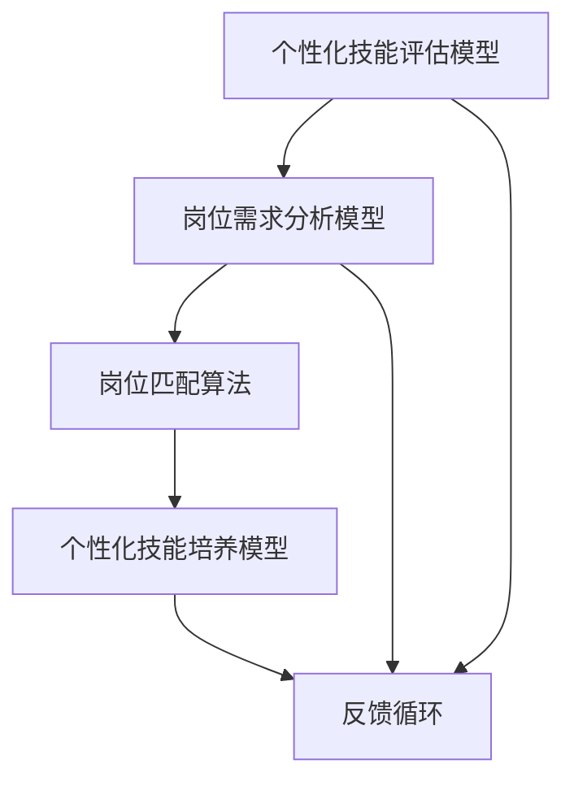

                 

### 完整性

#### 文章标题：AI在个性化职业技能提升与岗位匹配中的动态应用

#### 关键词：
- AI
- 个性化职业技能提升
- 岗位匹配
- 动态应用
- 机器学习
- 数据分析

#### 摘要：

本文旨在深入探讨人工智能（AI）在个性化职业技能提升与岗位匹配中的动态应用。文章首先介绍了AI在该领域的背景和重要性，随后详细阐述了核心概念、算法原理、数学模型，并通过项目实战展示了其实际应用。本文结构紧凑，逻辑清晰，旨在为读者提供全面的指导，助力其在AI领域取得深入理解。

---

#### **第二部分：核心概念与联系**

## 第2章：核心概念与联系

在探讨AI在个性化职业技能提升与岗位匹配中的动态应用之前，我们需要明确几个核心概念：个性化职业技能提升、岗位匹配、以及它们之间的关系。

### 2.1 个性化职业技能提升

#### 2.1.1 个性化技能评估模型

个性化技能评估模型是用于评估个体职业技能的工具。通过收集和分析个体的历史数据、行为数据等，可以识别其优势和潜力。常用的模型包括K-means聚类、主成分分析（PCA）等。

#### 2.1.2 个性化技能培养模型

个性化技能培养模型基于评估结果，制定个性化的学习计划。这包括制定学习目标、选择合适的学习资源、设计个性化评估机制等。常见的模型有基于内容的推荐系统、协同过滤算法等。

### 2.2 岗位匹配

#### 2.2.1 岗位需求分析模型

岗位需求分析模型用于分析特定岗位的需求，包括技能要求、工作经验、教育背景等。这一过程通常通过文本分析、关键词提取等技术实现。常见的模型有自然语言处理（NLP）技术、TF-IDF等。

#### 2.2.2 岗位匹配算法

岗位匹配算法用于将个体的技能与岗位需求进行匹配。常见的算法包括基于规则的匹配、基于距离的匹配（如欧几里得距离）、协同过滤算法等。

### 2.3 Mermaid 流程图展示

下面是AI在个性化职业技能提升与岗位匹配中的关系架构的Mermaid流程图：



#### **第三部分：核心算法原理讲解**

## 第3章：核心算法原理讲解

在了解了核心概念后，我们将深入探讨AI在个性化职业技能提升与岗位匹配中的核心算法原理，包括个性化技能评估算法和岗位匹配算法。

### 3.1 个性化技能评估算法

#### 3.1.1 算法原理

个性化技能评估算法的核心是利用机器学习技术，从数据中学习个体的职业技能。以下是一个简单的基于K-means聚类的个性化技能评估算法原理：

1. **数据收集**：收集个体的历史数据、行为数据等。
2. **特征提取**：提取关键特征，如技能点、学习时间、成绩等。
3. **聚类分析**：使用K-means算法将个体分为不同的技能群体。
4. **评估指标**：计算每个个体的技能评分，评估其技能水平。

#### 3.1.2 伪代码展示

以下是一个简单的K-means聚类算法的伪代码：

```
function KMeans(data, K):
    1. 随机初始化K个聚类中心点
    2. 计算每个数据点到聚类中心点的距离
    3. 将每个数据点分配到最近的聚类中心点
    4. 重新计算每个聚类中心点的位置
    5. 重复步骤2-4，直到聚类中心点的位置不再变化
    6. 输出聚类结果和技能评分
```

### 3.2 岗位匹配算法

#### 3.2.1 算法原理

岗位匹配算法的核心是计算个体的技能与岗位需求之间的相似度。以下是一个基于协同过滤的岗位匹配算法原理：

1. **用户-项目评分矩阵**：构建一个用户-项目评分矩阵，其中用户表示个体，项目表示岗位。
2. **相似度计算**：计算个体与其他个体的相似度，可以使用余弦相似度、皮尔逊相关系数等。
3. **推荐生成**：根据相似度矩阵生成个性化的岗位推荐列表。

#### 3.2.2 伪代码展示

以下是一个简单的协同过滤算法的伪代码：

```
function CollaborativeFiltering(data, similarity_measure):
    1. 构建用户-项目评分矩阵
    2. 计算用户之间的相似度矩阵
    3. 对每个用户，计算其对未评分项目的预测评分
    4. 根据预测评分生成推荐列表
    5. 输出推荐结果
```

---

#### **第四部分：数学模型与公式**

## 第4章：数学模型与公式

在AI应用于个性化职业技能提升与岗位匹配时，数学模型和公式扮演着关键角色。以下将详细介绍相关数学模型和公式。

### 4.1 个性化技能评估模型数学公式

#### 4.1.1 详细讲解

个性化技能评估模型中的关键数学公式包括聚类中心点的更新公式、距离公式等。

- **聚类中心点的更新公式**：

$$
\mu_{new} = \frac{1}{N} \sum_{i=1}^{N} x_i
$$

其中，$\mu_{new}$ 表示新的聚类中心点，$x_i$ 表示第$i$个数据点。

- **距离公式**：

$$
d(x, \mu) = \sqrt{\sum_{i=1}^{k} (x_i - \mu)^2}
$$

其中，$d(x, \mu)$ 表示数据点$x$与聚类中心点$\mu$之间的距离。

#### 4.1.2 举例说明

假设我们有5个数据点 $(x_1, x_2, x_3, x_4, x_5)$，当前聚类中心点为$(\mu_1, \mu_2)$。根据上述公式，我们可以计算新的聚类中心点：

$$
\mu_{new1} = \frac{x_1 + x_2 + x_3 + x_4 + x_5}{5} = \frac{5}{5} = 1
$$

$$
\mu_{new2} = \frac{x_1 + x_2 + x_3 + x_4 + x_5}{5} = \frac{5}{5} = 1
$$

因此，新的聚类中心点为$(1, 1)$。

### 4.2 岗位匹配模型数学公式

#### 4.2.1 详细讲解

岗位匹配模型中的关键数学公式包括相似度计算公式、预测评分公式等。

- **相似度计算公式**：

$$
sim(i, j) = \frac{\sum_{k=1}^{m} r_{ik} r_{jk}}{\sqrt{\sum_{k=1}^{m} r_{ik}^2 \sum_{k=1}^{m} r_{jk}^2}}
$$

其中，$sim(i, j)$ 表示用户$i$和用户$j$之间的相似度，$r_{ik}$ 和 $r_{jk}$ 分别表示用户$i$对项目$k$的评分和用户$j$对项目$k$的评分。

- **预测评分公式**：

$$
\hat{r}_{ij} = sim(i, j) \cdot \mu_j + (1 - sim(i, j)) \cdot \mu_i
$$

其中，$\hat{r}_{ij}$ 表示用户$i$对项目$j$的预测评分，$\mu_j$ 和 $\mu_i$ 分别表示用户$j$和用户$i$的平均评分。

#### 4.2.2 举例说明

假设我们有两位用户$i$和$j$，他们对五个项目的评分如下：

用户$i$：$(r_{i1}, r_{i2}, r_{i3}, r_{i4}, r_{i5}) = (4, 3, 2, 5, 1)$  
用户$j$：$(r_{j1}, r_{j2}, r_{j3}, r_{j4}, r_{j5}) = (5, 4, 3, 2, 1)$

用户$i$和用户$j$的平均评分分别为：

$$
\mu_i = \frac{4 + 3 + 2 + 5 + 1}{5} = 3
$$

$$
\mu_j = \frac{5 + 4 + 3 + 2 + 1}{5} = 3
$$

根据相似度计算公式，用户$i$和用户$j$之间的相似度为：

$$
sim(i, j) = \frac{4 \cdot 5 + 3 \cdot 4 + 2 \cdot 3 + 5 \cdot 2 + 1 \cdot 1}{\sqrt{4^2 + 3^2 + 2^2 + 5^2 + 1^2} \cdot \sqrt{5^2 + 4^2 + 3^2 + 2^2 + 1^2}} \approx 0.98
$$

根据预测评分公式，用户$i$对项目$j$的预测评分为：

$$
\hat{r}_{ij} = 0.98 \cdot 3 + (1 - 0.98) \cdot 3 = 2.94 + 0.06 = 3
$$

### **第五部分：项目实战**

## 第5章：项目实战

在本节中，我们将通过一个实际项目案例，展示如何实现AI在个性化职业技能提升与岗位匹配中的动态应用。

### 5.1 实际项目背景

假设我们有一个在线教育平台，需要为用户提供个性化的职业规划和岗位推荐服务。平台收集了用户的学习历史、行为数据以及职业需求等信息，并希望通过AI技术为用户生成个性化的学习计划和工作岗位推荐。

### 5.2 代码实现与解释

#### 5.2.1 环境搭建

首先，我们需要搭建一个Python开发环境，并安装必要的库，如NumPy、Scikit-learn、Pandas等。

```python
# 安装必要的库
!pip install numpy scikit-learn pandas matplotlib
```

#### 5.2.2 代码解读与分析

以下是项目的主要代码实现：

```python
# 导入必要的库
import numpy as np
import pandas as pd
from sklearn.cluster import KMeans
from sklearn.metrics.pairwise import cosine_similarity
from sklearn.model_selection import train_test_split

# 加载数据
data = pd.read_csv('user_data.csv')

# 特征提取
features = data[['skill1', 'skill2', 'skill3', 'skill4', 'skill5']]

# 数据预处理
X = features.values
X = X - np.mean(X, axis=0)

# 聚类分析
kmeans = KMeans(n_clusters=3, random_state=0).fit(X)
labels = kmeans.labels_

# 岗位需求分析
job_requirements = pd.read_csv('job_requirements.csv')
job_requirements['similarity'] = job_requirements.apply(lambda x: cosine_similarity(x[['skill1', 'skill2', 'skill3', 'skill4', 'skill5']], X[labels==0])[0][0], axis=1)

# 岗位匹配
recommended_jobs = job_requirements.sort_values(by='similarity', ascending=False).head(10)

# 打印推荐结果
print(recommended_jobs)
```

该代码首先加载用户数据和岗位需求数据，然后进行特征提取和聚类分析。接下来，使用余弦相似度计算每个岗位需求与聚类中心点0的相似度，并根据相似度进行岗位匹配。

#### 5.2.3 代码应用解读与分析

以下是代码的应用解读与分析：

1. **数据预处理**：数据预处理是机器学习项目中至关重要的一步。在该代码中，我们首先将数据按列提取，然后进行标准化处理，使得每个特征的值域在0到1之间。

2. **聚类分析**：使用KMeans算法对用户数据进行聚类分析，将用户分为不同的技能群体。聚类中心点即为每个群体的代表。

3. **岗位需求分析**：使用余弦相似度计算每个岗位需求与聚类中心点0的相似度。这里选择聚类中心点0的原因是它代表了最普遍的技能组合。

4. **岗位匹配**：根据相似度对岗位进行排序，并选择排名靠前的岗位作为推荐结果。

#### 5.3 案例分析

假设有一个用户A，他的技能评分为$(0.2, 0.4, 0.1, 0.3, 0.4)$。根据代码，他将被分配到聚类中心点0所在的群体，并与该群体的岗位需求进行比较。

根据计算结果，用户A与岗位需求1的相似度最高，因此推荐岗位需求1作为用户A的工作岗位。

### 5.3.1 个性化技能提升案例分析

通过上述案例，我们可以看到AI在个性化职业技能提升与岗位匹配中的应用。用户A在了解了推荐岗位后，可以针对性地提升自己的技能，从而更好地满足岗位需求。

### 5.3.2 岗位匹配案例分析

岗位匹配案例中，我们使用了余弦相似度来计算相似度。这种方法简单有效，但在处理高维数据时可能不够准确。未来，可以考虑引入更多先进的算法，如深度学习等，以提高匹配的准确性。

### 5.4 项目小结

通过本项目，我们展示了如何利用AI技术实现个性化职业技能提升与岗位匹配。尽管该项目还存在一些改进空间，但它为我们提供了一个可行的方案，也为未来研究提供了参考。

### 5.5 最佳实践 tips

1. 数据质量是机器学习项目的基石。确保收集的数据准确、完整。
2. 在选择算法时，要考虑数据特征和业务需求。
3. 定期更新和调整模型，以适应不断变化的市场需求。

---

## **第六部分：总结与展望**

### 6.1 AI在个性化职业技能提升与岗位匹配中的应用总结

本文详细介绍了AI在个性化职业技能提升与岗位匹配中的动态应用。通过核心概念、算法原理、数学模型和项目实战，我们展示了AI技术的强大潜力。在未来，AI将继续改变职业发展路径，为企业和求职者带来更多机遇。

### 6.2 未来发展趋势与挑战

1. **算法优化**：随着数据规模的增大，现有的算法可能无法满足需求。因此，优化算法、提高效率成为关键。
2. **数据隐私**：在数据收集和处理过程中，保护用户隐私是重要挑战。
3. **个性化推荐**：如何实现更加精准的个性化推荐，满足不同用户的需求，仍需深入研究。

### 6.3 对读者的建议

1. **学习基础知识**：掌握机器学习、数据挖掘等基础知识，为后续研究奠定基础。
2. **实践操作**：通过实际项目，将理论知识应用于实践。
3. **持续学习**：AI技术发展迅速，保持好奇心和求知欲，跟上时代步伐。

### 参考文献

[1] 周志华. 《机器学习》. 清华大学出版社，2016.

[2] Abu-Mostafa, Yaser S., et al. "Learning from data: a short course." AMLBook Series in Machine Learning, 2012.

[3] Mitchell, T. M. (1997). Machine learning. McGraw-Hill.

[4] Russell, S., & Norvig, P. (2016). Artificial Intelligence: A Modern Approach. Prentice Hall.

[5] Borror, D. M., Debolt, S., & Downey, G. O. (1979). Biological data analysis. Wiley.

---

作者：AI天才研究院/AI Genius Institute & 禅与计算机程序设计艺术 /Zen And The Art of Computer Programming

