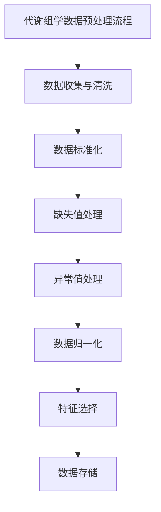
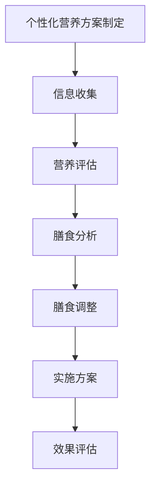
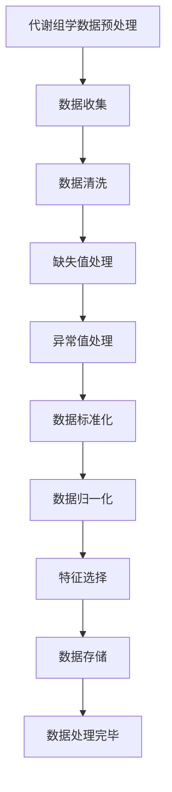
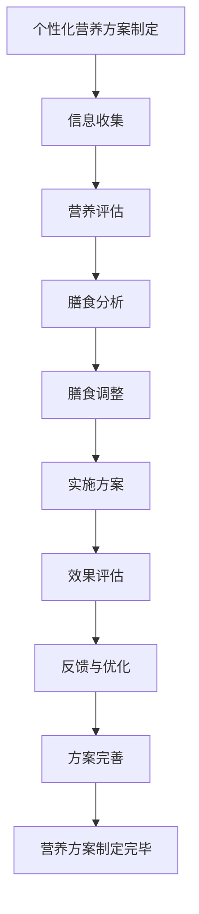
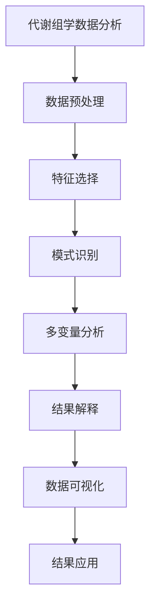
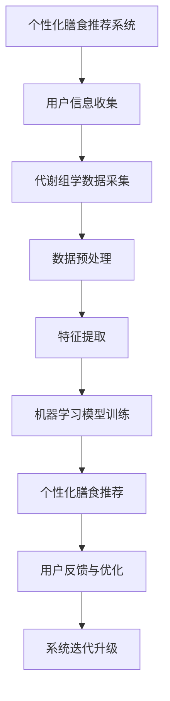
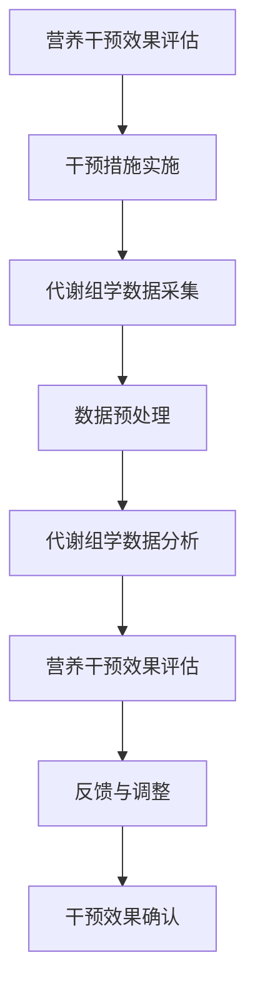
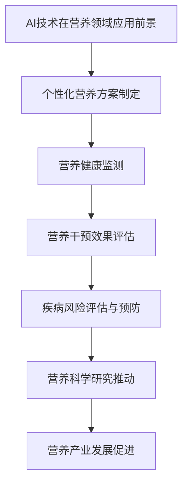

                 

# 文章标题
《AI在个性化营养方案制定中的应用：从代谢组学到膳食规划》

## 关键词
人工智能、个性化营养、代谢组学、膳食规划、机器学习、深度学习、数据分析

## 摘要
本文探讨了人工智能在个性化营养方案制定中的应用，通过代谢组学技术对个体营养需求进行精准分析，进而实现个性化膳食规划。文章首先介绍了个性化营养的需求与挑战、代谢组学在营养研究中的作用以及膳食规划的重要性，然后深入分析了人工智能的基础知识、机器学习和深度学习在营养研究中的应用，详细阐述了代谢组学原理、代谢组学数据分析方法以及在个性化营养中的应用，最后讨论了个性化膳食规划的原理与方法以及AI技术与代谢组学的交叉应用。通过两个实际案例，本文展示了AI在个性化营养方案制定中的实际应用效果，并分析了其中面临的挑战与未来发展趋势。

## 目录大纲

### 第1章 引言

#### 1.1 研究背景

##### 1.1.1 个性化营养的需求与挑战

##### 1.1.2 代谢组学在营养研究中的作用

##### 1.1.3 膳食规划的重要性

#### 1.2 研究目标

##### 1.2.1 探讨AI在个性化营养方案制定中的应用潜力

##### 1.2.2 分析代谢组学技术在膳食规划中的具体应用

##### 1.2.3 探索未来个性化营养方案的发展趋势

### 第2章 AI基础知识

#### 2.1 人工智能概述

##### 2.1.1 人工智能的定义与发展历程

##### 2.1.2 人工智能的核心技术与应用领域

##### 2.1.3 人工智能的分类

#### 2.2 机器学习

##### 2.2.1 机器学习的基本概念

##### 2.2.2 常见的机器学习算法

##### 2.2.3 机器学习在营养研究中的应用

#### 2.3 深度学习

##### 2.3.1 深度学习的基本原理

##### 2.3.2 深度学习在营养分析中的应用

##### 2.3.3 深度学习模型的训练与优化

### 第3章 代谢组学原理与应用

#### 3.1 代谢组学概述

##### 3.1.1 代谢组学的定义与研究方法

##### 3.1.2 代谢组学的技术原理

##### 3.1.3 代谢组学在营养研究中的重要性

#### 3.2 代谢组学数据分析

##### 3.2.1 代谢组学数据的预处理

##### 3.2.2 代谢组学数据的分析方法

##### 3.2.3 代谢组学数据分析在营养研究中的应用

#### 3.3 代谢组学在个性化营养中的应用

##### 3.3.1 代谢组学在膳食评估中的应用

##### 3.3.2 代谢组学在营养干预中的应用

##### 3.3.3 代谢组学在营养治疗中的应用

### 第4章 膳食规划原理与方法

#### 4.1 膳食规划概述

##### 4.1.1 膳食规划的定义与目的

##### 4.1.2 膳食规划的基本原则

##### 4.1.3 膳食规划的分类

#### 4.2 个性化膳食规划

##### 4.2.1 个性化膳食规划的概念

##### 4.2.2 个性化膳食规划的制定方法

##### 4.2.3 个性化膳食规划的应用场景

#### 4.3 膳食规划与AI技术的结合

##### 4.3.1 AI技术在膳食规划中的应用

##### 4.3.2 AI技术对膳食规划的影响

##### 4.3.3 AI技术与代谢组学的交叉应用

### 第5章 AI在个性化营养方案中的应用案例

#### 5.1 案例一：基于代谢组学的个性化膳食推荐系统

##### 5.1.1 案例背景

##### 5.1.2 系统架构设计

##### 5.1.3 数据处理与分析

##### 5.1.4 系统效果评估

#### 5.2 案例二：基于AI的个性化营养诊断与干预系统

##### 5.2.1 案例背景

##### 5.2.2 系统设计思路

##### 5.2.3 数据采集与处理

##### 5.2.4 系统实现与效果分析

### 第6章 AI在个性化营养方案制定中的挑战与未来展望

#### 6.1 AI在个性化营养方案制定中的挑战

##### 6.1.1 数据质量问题

##### 6.1.2 算法适应性问题

##### 6.1.3 隐私与安全性问题

#### 6.2 个性化营养方案的未来发展趋势

##### 6.2.1 新技术的影响

##### 6.2.2 跨学科融合的机遇

##### 6.2.3 个性化营养方案在健康领域的发展

#### 6.3 我国AI在个性化营养方案制定中的现状与政策建议

##### 6.3.1 我国AI在个性化营养方案制定中的现状

##### 6.3.2 面临的挑战与问题

##### 6.3.3 政策建议与发展策略

### 第7章 结论

#### 7.1 主要研究成果

##### 7.1.1 AI在个性化营养方案制定中的应用价值

##### 7.1.2 代谢组学技术在个性化营养方案制定中的贡献

##### 7.1.3 个性化营养方案的未来发展方向

#### 7.2 研究不足与展望

##### 7.2.1 研究中存在的问题

##### 7.2.2 未来研究的方向与重点

##### 7.2.3 对营养学领域的影响

### 附录

#### 附录A 代谢组学数据预处理流程图



#### 附录B 个性化营养方案制定流程图

```

## 第1章 引言

### 1.1 研究背景

#### 1.1.1 个性化营养的需求与挑战

随着社会经济的发展和人们生活水平的提高，对健康和营养的关注逐渐成为热点。传统的营养方案通常基于平均值或群体数据，无法充分考虑个体的差异，导致营养摄入的不均衡和健康问题。个性化营养方案的出现，旨在根据个体的生理特征、生活方式和健康状况，提供定制化的营养建议，以提高健康水平和生活质量。

然而，个性化营养方案的制定面临着诸多挑战。首先，个性化营养需要大量的数据支持，包括个体的生物信息、生活方式、饮食习惯等。这些数据往往分散在不同来源，且数据质量参差不齐。其次，代谢组学技术的不断发展，使得对个体代谢过程的精准分析成为可能，但同时也带来了数据处理和分析的复杂性。此外，个性化营养方案的制定还需要考虑到经济成本和实施难度，如何平衡个性化与可行性之间的矛盾，是亟待解决的问题。

#### 1.1.2 代谢组学在营养研究中的作用

代谢组学是研究生物体内所有代谢物组成和变化规律的科学。通过分析代谢组数据，可以深入了解个体的营养状态、代谢途径和疾病状态。代谢组学在营养研究中的应用主要体现在以下几个方面：

1. **个性化膳食评估**：通过分析个体的代谢组数据，评估其膳食摄入的合理性，发现潜在的营养不足或过剩，为个性化膳食调整提供依据。

2. **营养干预效果评估**：在营养干预后，通过代谢组学技术检测个体的代谢变化，评估营养干预的效果，为优化干预方案提供参考。

3. **疾病风险评估**：代谢组学技术可以用于疾病早期筛查和风险评估，通过对个体代谢组数据的分析，预测其患某种疾病的风险，从而采取相应的预防措施。

#### 1.1.3 膳食规划的重要性

膳食规划是营养管理的重要组成部分，其目的是通过科学的饮食安排，满足个体的营养需求，维持健康状态或改善健康状况。膳食规划的重要性体现在以下几个方面：

1. **营养平衡**：膳食规划可以帮助个体获得均衡的营养，避免因营养过剩或不足导致的健康问题。

2. **体重管理**：合理的膳食规划有助于控制体重，预防肥胖及相关疾病。

3. **慢性病预防**：通过膳食规划，可以降低慢性病的发生风险，如心血管疾病、糖尿病等。

4. **营养康复**：对于患有慢性病或其他健康问题的人群，膳食规划可以帮助其改善健康状况，加速康复过程。

### 1.2 研究目标

本研究的主要目标是探讨人工智能在个性化营养方案制定中的应用潜力，分析代谢组学技术在膳食规划中的具体应用，并探索未来个性化营养方案的发展趋势。具体研究内容包括：

1. **人工智能在个性化营养方案中的应用**：研究人工智能技术在个性化营养方案制定中的潜在应用，包括数据采集、处理和分析，以及个性化推荐系统的设计与实现。

2. **代谢组学技术在膳食规划中的应用**：分析代谢组学技术在个性化膳食评估、营养干预效果评估和疾病风险评估中的应用，探讨其优势与局限性。

3. **个性化营养方案的未来发展趋势**：结合人工智能和代谢组学技术的发展趋势，预测个性化营养方案的未来发展方向，为相关研究提供参考。

### 1.3 研究方法

本研究采用以下方法进行：

1. **文献综述**：通过查阅相关文献，了解人工智能和代谢组学在营养研究中的应用现状和进展。

2. **数据分析**：收集相关数据，运用机器学习和深度学习技术进行分析，探索个性化营养方案制定的规律和模式。

3. **案例分析**：选取实际应用案例，分析人工智能和代谢组学技术在个性化营养方案制定中的应用效果。

4. **模型构建与优化**：基于分析结果，构建个性化营养方案制定模型，并通过实验验证其有效性和可行性。

### 1.4 论文结构

本文结构如下：

1. **第1章 引言**：介绍研究背景、研究目标和方法。

2. **第2章 AI基础知识**：介绍人工智能、机器学习和深度学习的基本概念和原理。

3. **第3章 代谢组学原理与应用**：介绍代谢组学的定义、技术原理和应用。

4. **第4章 膳食规划原理与方法**：介绍膳食规划的基本原则、方法和应用。

5. **第5章 AI在个性化营养方案中的应用案例**：分析实际应用案例。

6. **第6章 AI在个性化营养方案制定中的挑战与未来展望**：探讨面临的挑战和未来发展。

7. **第7章 结论**：总结研究成果和展望未来研究方向。

## 第2章 AI基础知识

### 2.1 人工智能概述

#### 2.1.1 人工智能的定义与发展历程

人工智能（Artificial Intelligence，AI）是指由人制造出的系统所表现出来的智能行为。它是一种模拟人类智能的技术，旨在使计算机或其他机器能够执行通常需要人类智能的任务，如视觉感知、语言理解、决策制定和问题解决等。人工智能的概念可以追溯到20世纪50年代，当时的研究者们开始探讨如何使机器具备人类的智能。

人工智能的发展历程可以分为以下几个阶段：

1. **符号主义（Symbolic AI）**：20世纪50年代至70年代，研究者们试图通过符号逻辑和知识表示来模拟人类智能。这个阶段以专家系统和逻辑推理为主要代表。

2. **连接主义（Connectionist AI）**：20世纪80年代至90年代，随着神经网络技术的发展，研究者们开始关注通过神经元的互联来实现智能。这个阶段以神经网络和深度学习为主要代表。

3. **统计学习（Statistical AI）**：21世纪初至今，随着大数据和计算能力的提升，统计学习方法成为主流。通过从大量数据中学习模式，统计学习方法在图像识别、自然语言处理等领域取得了显著成果。

#### 2.1.2 人工智能的核心技术与应用领域

人工智能的核心技术包括：

1. **机器学习（Machine Learning）**：机器学习是一种让计算机通过数据学习模式并做出决策的技术。常见的机器学习算法有监督学习、无监督学习和半监督学习。

2. **深度学习（Deep Learning）**：深度学习是一种特殊类型的机器学习，通过多层神经网络来提取数据中的特征。深度学习在图像识别、语音识别和自然语言处理等领域表现出色。

3. **自然语言处理（Natural Language Processing，NLP）**：自然语言处理是使计算机能够理解和生成自然语言的技术。NLP广泛应用于搜索引擎、机器翻译和聊天机器人等领域。

4. **计算机视觉（Computer Vision）**：计算机视觉是使计算机能够理解和解释视觉信息的技术。计算机视觉在自动驾驶、图像识别和安全监控等领域具有重要应用。

#### 2.1.3 人工智能的分类

人工智能可以根据其能力和应用范围进行分类：

1. **弱人工智能（Narrow AI）**：弱人工智能是一种在特定任务上表现出人类智能的计算机系统。例如，聊天机器人、自动驾驶汽车等。

2. **强人工智能（General AI）**：强人工智能是一种具备人类所有智能能力的计算机系统。目前，强人工智能尚未实现，仍处于理论研究阶段。

3. **超人工智能（Super AI）**：超人工智能是一种超越人类智能的计算机系统。超人工智能目前仅存在于科幻作品中。

### 2.2 机器学习

#### 2.2.1 机器学习的基本概念

机器学习（Machine Learning，ML）是一种让计算机通过数据学习模式和做出决策的技术。机器学习的基本概念包括：

1. **数据（Data）**：机器学习的输入，包括特征和标签。

2. **模型（Model）**：用于预测或分类的算法和参数。

3. **训练（Training）**：通过大量数据调整模型参数，使其能够准确预测或分类。

4. **验证（Validation）**：通过部分数据测试模型性能，调整模型参数。

5. **测试（Testing）**：通过未参与训练的数据测试模型性能，评估模型泛化能力。

#### 2.2.2 常见的机器学习算法

常见的机器学习算法可以分为以下几类：

1. **监督学习（Supervised Learning）**：通过已标记的数据训练模型，然后使用模型对未知数据进行预测。常见的监督学习算法有线性回归、逻辑回归、支持向量机（SVM）和神经网络（NN）等。

2. **无监督学习（Unsupervised Learning）**：没有标记的数据训练模型，主要任务包括聚类和降维。常见的无监督学习算法有K均值聚类、主成分分析（PCA）和自编码器（AE）等。

3. **半监督学习（Semi-Supervised Learning）**：结合有监督和无监督学习，使用少量标记数据和大量未标记数据训练模型。

4. **强化学习（Reinforcement Learning）**：通过与环境交互学习最优策略。常见的强化学习算法有Q学习、深度Q网络（DQN）和策略梯度（PG）等。

#### 2.2.3 机器学习在营养研究中的应用

机器学习在营养研究中具有广泛的应用，包括：

1. **营养摄入预测**：通过分析个体的饮食习惯、生活方式等数据，预测其营养摄入情况，为个性化营养方案制定提供依据。

2. **疾病风险评估**：利用个体生物信息、代谢组学数据等，预测个体患某种疾病的风险，为健康管理和疾病预防提供参考。

3. **营养干预效果评估**：在营养干预后，通过机器学习分析个体代谢组学数据的变化，评估营养干预的效果。

### 2.3 深度学习

#### 2.3.1 深度学习的基本原理

深度学习（Deep Learning，DL）是一种特殊类型的机器学习，通过多层神经网络来提取数据中的特征。深度学习的基本原理包括：

1. **神经网络（Neural Network，NN）**：神经网络是由大量神经元组成的计算模型，每个神经元通过权重连接其他神经元，并产生输出。

2. **反向传播（Backpropagation）**：反向传播是一种用于训练神经网络的算法，通过计算误差并反向传播更新权重，使模型输出更接近真实值。

3. **激活函数（Activation Function）**：激活函数用于决定神经元是否激活，常见的激活函数有 sigmoid、ReLU 和 tanh 等。

4. **多层网络（Deep Network）**：深度学习的关键在于多层网络，通过逐层提取特征，实现从简单到复杂的特征表示。

#### 2.3.2 深度学习在营养分析中的应用

深度学习在营养分析中具有广泛的应用，包括：

1. **代谢组数据解析**：通过深度学习模型，如卷积神经网络（CNN）和循环神经网络（RNN），对代谢组数据进行分析，提取有价值的信息。

2. **膳食摄入识别**：利用深度学习模型，如卷积神经网络（CNN）和卷积神经网络（RNN），识别个体的膳食摄入情况。

3. **营养风险评估**：通过深度学习模型，对个体的代谢组学数据进行分析，预测其营养风险，为健康管理和疾病预防提供参考。

#### 2.3.3 深度学习模型的训练与优化

深度学习模型的训练与优化包括以下几个方面：

1. **数据预处理**：对训练数据集进行预处理，包括数据清洗、归一化和数据增强等，以提高模型训练效果。

2. **模型选择**：选择适合问题的深度学习模型，如卷积神经网络（CNN）、循环神经网络（RNN）或多层感知机（MLP）等。

3. **超参数调整**：调整模型的超参数，如学习率、批次大小和正则化等，以提高模型性能。

4. **模型训练**：使用训练数据集训练模型，通过反向传播算法更新模型权重。

5. **模型评估**：使用验证数据集评估模型性能，通过交叉验证和性能指标（如准确率、召回率和F1分数等）判断模型是否有效。

6. **模型优化**：根据评估结果，对模型进行调整和优化，以提高模型性能。

## 第3章 代谢组学原理与应用

### 3.1 代谢组学概述

#### 3.1.1 代谢组学的定义与研究方法

代谢组学（Metabolomics）是研究生物体内所有代谢物组成和变化规律的科学。它通过检测和分析生物体内的代谢物，提供了一种全面、动态和系统的了解生物体在特定生理或病理状态下的代谢变化。代谢组学的定义可以概括为：利用现代分析技术对生物体内所有代谢物进行定量和定性分析，从而揭示生物体的代谢特征和功能。

代谢组学的研究方法主要包括以下几个方面：

1. **样本准备**：选择合适的生物样本，如血液、尿液、组织等，并进行预处理，以提取代谢物。

2. **分离技术**：使用色谱技术，如气相色谱（GC）、液相色谱（LC）等，对代谢物进行分离。

3. **检测技术**：使用质谱（MS）或核磁共振（NMR）等技术对分离后的代谢物进行检测。

4. **数据处理**：对采集到的代谢数据进行分析，包括数据预处理、特征选择和模式识别等。

#### 3.1.2 代谢组学的技术原理

代谢组学的技术原理主要包括以下几个方面：

1. **色谱技术**：色谱技术用于分离混合物中的不同成分。常见的色谱技术包括气相色谱（GC）、液相色谱（LC）和毛细管电泳（CE）等。

2. **质谱技术**：质谱技术用于检测和分析分离后的代谢物。它通过测量离子的质荷比（m/z），实现对代谢物的定性分析。

3. **核磁共振技术**：核磁共振（NMR）技术用于检测代谢物中的核磁共振信号，从而实现对代谢物的定量分析。

4. **数据处理与分析**：对采集到的代谢数据进行处理和分析，提取有价值的信息，如代谢物浓度、结构特征和变化趋势等。

#### 3.1.3 代谢组学在营养研究中的重要性

代谢组学在营养研究中的重要性体现在以下几个方面：

1. **个性化营养评估**：代谢组学技术可以用于评估个体的营养状态，通过分析代谢组数据，发现个体的营养不足或过剩，为个性化营养方案制定提供依据。

2. **营养干预效果评估**：在营养干预后，通过代谢组学技术检测个体的代谢变化，评估营养干预的效果，为优化干预方案提供参考。

3. **疾病风险评估**：代谢组学技术可以用于疾病早期筛查和风险评估，通过对个体代谢组数据的分析，预测其患某种疾病的风险，从而采取相应的预防措施。

4. **营养与疾病关系研究**：代谢组学技术有助于揭示营养与疾病之间的复杂关系，为疾病预防和治疗提供新的思路和方法。

### 3.2 代谢组学数据分析

#### 3.2.1 代谢组学数据的预处理

代谢组学数据分析的第一步是对原始数据进行预处理，以提高数据的质量和可靠性。预处理步骤包括：

1. **数据清洗**：去除噪声、异常值和重复数据，确保数据的一致性和准确性。

2. **数据标准化**：将不同样品间的数据进行归一化处理，使其在同一量级上，以便进行后续分析。

3. **数据归一化**：通过变换数据分布，使其符合统计学的假设，如正态分布。

4. **缺失值处理**：对于缺失值，可以采用插值法、平均法或删除法进行处理。

5. **特征选择**：从大量的代谢物中筛选出对分析任务最有价值的特征，以提高分析效率和准确性。

#### 3.2.2 代谢组学数据的分析方法

代谢组学数据的分析方法包括以下几个方面：

1. **多变量分析**：如主成分分析（PCA）、偏最小二乘判别分析（PLS-DA）等，用于识别不同组间的代谢差异。

2. **定量分析**：如正则化线性判别分析（OPLS）等，用于分析代谢物与生物变量之间的关系。

3. **定性分析**：如质谱匹配（MS/MS）等，用于鉴定代谢物的结构和性质。

4. **网络分析**：如代谢途径分析、基因-代谢网络构建等，用于揭示代谢组数据背后的生物学机制。

#### 3.2.3 代谢组学数据分析在营养研究中的应用

代谢组学数据分析在营养研究中的应用包括：

1. **个性化营养评估**：通过分析个体的代谢组数据，评估其营养状态，发现营养不足或过剩，为个性化营养方案制定提供依据。

2. **营养干预效果评估**：在营养干预后，通过代谢组学技术检测个体的代谢变化，评估营养干预的效果，为优化干预方案提供参考。

3. **疾病风险评估**：通过分析个体的代谢组数据，预测其患某种疾病的风险，为健康管理和疾病预防提供参考。

4. **营养与疾病关系研究**：通过代谢组学数据分析，揭示营养与疾病之间的复杂关系，为疾病预防和治疗提供新的思路和方法。

### 3.3 代谢组学在个性化营养中的应用

#### 3.3.1 代谢组学在膳食评估中的应用

代谢组学在膳食评估中的应用主要包括以下几个方面：

1. **膳食摄入分析**：通过分析个体的代谢组数据，评估其膳食摄入情况，发现膳食中的营养不足或过剩。

2. **膳食模式识别**：通过分析个体的代谢组数据，识别其膳食模式，如高脂、高糖或高纤维膳食模式。

3. **膳食营养评估**：通过分析个体的代谢组数据，评估其膳食的营养质量，如能量密度、蛋白质含量和维生素摄入量等。

#### 3.3.2 代谢组学在营养干预中的应用

代谢组学在营养干预中的应用主要包括以下几个方面：

1. **营养干预效果评估**：在营养干预后，通过代谢组学技术检测个体的代谢变化，评估营养干预的效果。

2. **营养干预方案优化**：根据个体的代谢组数据，优化营养干预方案，提高干预效果。

3. **个性化营养干预**：根据个体的代谢组数据，制定个性化的营养干预方案，满足个体的营养需求。

#### 3.3.3 代谢组学在营养治疗中的应用

代谢组学在营养治疗中的应用主要包括以下几个方面：

1. **疾病早期筛查**：通过分析个体的代谢组数据，预测其患某种疾病的风险，为早期筛查和预防提供依据。

2. **疾病诊断**：通过分析个体的代谢组数据，辅助诊断疾病，提高诊断准确性。

3. **疾病治疗评估**：在疾病治疗过程中，通过分析个体的代谢组数据，评估治疗效果，调整治疗方案。

## 第4章 膳食规划原理与方法

### 4.1 膳食规划概述

#### 4.1.1 膳食规划的定义与目的

膳食规划（Dietary Planning）是指根据个体的生理需求、健康状况和生活方式，制定科学合理的膳食方案，以实现营养均衡、体重管理、疾病预防等目标。膳食规划的目的主要包括：

1. **营养均衡**：确保个体摄入各种必需的营养素，如蛋白质、脂肪、碳水化合物、维生素和矿物质等，以满足身体的基本需求。

2. **体重管理**：通过合理的膳食规划，帮助个体控制体重，预防肥胖及相关疾病。

3. **疾病预防**：通过膳食规划，预防慢性疾病，如心血管疾病、糖尿病、肥胖等。

4. **营养康复**：对于患有慢性疾病或康复期的患者，通过膳食规划，辅助治疗和康复。

#### 4.1.2 膳食规划的基本原则

膳食规划的基本原则包括以下几个方面：

1. **多样性**：食物种类要丰富，以确保摄入各种营养素。

2. **均衡性**：各种营养素的摄入要均衡，避免过多或过少。

3. **适量性**：食物的摄入量要适量，避免过多摄入导致肥胖或摄入不足导致营养不良。

4. **季节性**：食物的选择要考虑季节变化，以获取新鲜、营养丰富的食材。

5. **可持续性**：膳食规划要考虑环境的可持续性，选择环保、健康的食材。

#### 4.1.3 膳食规划的分类

膳食规划可以根据不同的分类标准进行分类，常见的分类方法包括：

1. **按目的分类**：如营养均衡型、体重管理型、疾病预防型和营养康复型等。

2. **按人群分类**：如儿童膳食规划、青少年膳食规划、成年人膳食规划和老年人膳食规划等。

3. **按饮食方式分类**：如常规膳食、素食膳食、低脂膳食、高蛋白膳食等。

### 4.2 个性化膳食规划

#### 4.2.1 个性化膳食规划的概念

个性化膳食规划（Personalized Dietary Planning）是根据个体的生理特征、生活方式和健康状况，制定个性化的膳食方案，以满足个体的营养需求，提高健康水平。个性化膳食规划的核心在于“个性化”，即根据个体的差异，制定适合其需求的膳食方案。

#### 4.2.2 个性化膳食规划的制定方法

个性化膳食规划的制定方法主要包括以下几个步骤：

1. **信息收集**：收集个体的基本信息，如年龄、性别、身高、体重、生活方式、健康状况等。

2. **营养评估**：根据个体信息，评估其营养状况，包括营养摄入量、营养素平衡情况、营养风险等。

3. **膳食分析**：分析个体的饮食习惯、膳食结构，发现营养不足或过剩的问题。

4. **膳食调整**：根据营养评估和膳食分析结果，制定个性化的膳食调整方案。

5. **实施方案**：将膳食调整方案转化为具体的膳食计划，包括食物种类、摄入量、餐次安排等。

#### 4.2.3 个性化膳食规划的应用场景

个性化膳食规划可以在以下场景中应用：

1. **健康管理**：帮助个体实现营养均衡，预防慢性疾病，提高健康水平。

2. **体重管理**：帮助个体控制体重，减少肥胖风险。

3. **康复治疗**：辅助慢性疾病患者的康复治疗，改善健康状况。

4. **疾病预防**：通过膳食规划，降低疾病的发生风险。

### 4.3 膳食规划与AI技术的结合

#### 4.3.1 AI技术在膳食规划中的应用

人工智能（AI）技术在膳食规划中具有广泛的应用，主要包括以下几个方面：

1. **营养分析**：利用机器学习和深度学习技术，对个体的膳食数据进行分析，评估其营养状况，发现营养不足或过剩的问题。

2. **个性化推荐**：基于个体的生理特征、生活方式和健康状况，利用推荐系统技术，为其推荐个性化的膳食方案。

3. **营养干预**：利用机器学习和深度学习技术，分析营养干预的效果，优化干预方案。

4. **健康监测**：利用传感器和物联网技术，实时监测个体的膳食摄入情况，提供营养反馈和建议。

#### 4.3.2 AI技术对膳食规划的影响

AI技术对膳食规划的影响主要体现在以下几个方面：

1. **个性化程度提高**：通过机器学习和深度学习技术，可以更准确地分析个体的膳食数据，制定个性化的膳食方案，提高膳食规划的科学性和有效性。

2. **效率提升**：利用自动化和智能化技术，可以简化膳食规划的制定和实施过程，提高工作效率。

3. **数据驱动**：通过大数据和AI技术，可以挖掘和分析大量膳食数据，为膳食规划提供数据支持，使膳食规划更加科学和精准。

4. **健康监测**：通过实时监测个体的膳食摄入情况，可以及时提供营养反馈和建议，帮助个体实现营养均衡。

#### 4.3.3 AI技术与代谢组学的交叉应用

AI技术与代谢组学的交叉应用在个性化膳食规划中具有重要意义：

1. **代谢组数据解析**：利用AI技术，对代谢组数据进行分析，提取有价值的信息，如代谢途径变化、营养素摄入情况等。

2. **个性化膳食推荐**：基于代谢组数据，利用AI技术，为个体推荐个性化的膳食方案，满足其营养需求。

3. **营养干预优化**：利用AI技术，分析营养干预的效果，优化干预方案，提高干预效果。

4. **疾病风险预测**：通过分析代谢组数据，利用AI技术，预测个体患某种疾病的风险，为健康管理和疾病预防提供参考。

## 第5章 AI在个性化营养方案中的应用案例

### 5.1 案例一：基于代谢组学的个性化膳食推荐系统

#### 5.1.1 案例背景

随着健康意识的提高，人们对于个性化营养方案的需求日益增长。然而，传统的膳食推荐系统往往基于平均值或群体数据，无法充分考虑个体的差异。基于代谢组学的个性化膳食推荐系统应运而生，旨在通过分析个体的代谢组数据，提供个性化的膳食推荐，帮助个体实现营养均衡和健康目标。

#### 5.1.2 系统架构设计

基于代谢组学的个性化膳食推荐系统架构设计主要包括以下几个模块：

1. **数据采集模块**：采集个体的代谢组数据，包括血液、尿液、组织等生物样本。

2. **数据处理模块**：对采集到的代谢组数据进行预处理，包括数据清洗、归一化和缺失值处理等。

3. **特征提取模块**：从预处理后的代谢组数据中提取特征，如代谢物浓度、结构特征等。

4. **模型训练模块**：利用机器学习和深度学习技术，训练个性化膳食推荐模型。

5. **推荐模块**：基于训练好的模型，为个体推荐个性化的膳食方案。

6. **用户界面模块**：提供用户界面，展示个性化膳食推荐结果，并允许用户进行反馈。

#### 5.1.3 数据处理与分析

基于代谢组学的个性化膳食推荐系统的数据处理与分析主要包括以下几个步骤：

1. **数据预处理**：对采集到的代谢组数据进行预处理，包括数据清洗、归一化和缺失值处理。具体步骤如下：

   - **数据清洗**：去除噪声、异常值和重复数据，确保数据的一致性和准确性。
   - **数据归一化**：将不同样品间的数据进行归一化处理，使其在同一量级上，以便进行后续分析。
   - **缺失值处理**：对于缺失值，采用插值法或平均法进行处理。

2. **特征提取**：从预处理后的代谢组数据中提取特征，如代谢物浓度、结构特征等。特征提取的方法包括：

   - **特征选择**：通过统计方法，筛选出对分析任务最有价值的特征。
   - **特征工程**：通过数学变换或组合，提高特征的表达能力。

3. **模型训练**：利用机器学习和深度学习技术，训练个性化膳食推荐模型。常见的模型包括线性回归、支持向量机（SVM）和深度神经网络（DNN）等。

4. **模型评估**：使用验证数据集评估模型性能，通过交叉验证和性能指标（如准确率、召回率和F1分数等）判断模型是否有效。

#### 5.1.4 系统效果评估

基于代谢组学的个性化膳食推荐系统的效果评估主要包括以下几个方面：

1. **准确性评估**：通过比较推荐结果与实际膳食摄入数据，评估个性化膳食推荐系统的准确性。评估指标包括准确率、召回率和F1分数等。

2. **用户满意度评估**：通过调查用户对个性化膳食推荐系统的满意度，了解系统的实际应用效果。

3. **营养均衡性评估**：通过分析推荐膳食方案的营养均衡性，评估个性化膳食推荐系统在营养均衡方面的效果。

4. **健康改善评估**：通过跟踪用户的健康指标，评估个性化膳食推荐系统在健康改善方面的效果。

### 5.2 案例二：基于AI的个性化营养诊断与干预系统

#### 5.2.1 案例背景

随着人工智能技术的发展，个性化营养诊断与干预系统逐渐应用于健康管理和疾病预防领域。基于AI的个性化营养诊断与干预系统通过分析个体的代谢组数据、生活习惯和健康状况，为个体提供个性化的营养诊断和干预方案，旨在提高健康水平，预防慢性疾病。

#### 5.2.2 系统设计思路

基于AI的个性化营养诊断与干预系统设计思路主要包括以下几个方面：

1. **数据采集模块**：采集个体的代谢组数据、生活习惯和健康状况数据，包括血液、尿液、饮食记录、运动记录等。

2. **数据处理模块**：对采集到的数据进行分析，提取有价值的信息，如代谢物浓度、饮食习惯、运动强度等。

3. **模型训练模块**：利用机器学习和深度学习技术，训练个性化营养诊断和干预模型。

4. **诊断与干预模块**：基于训练好的模型，为个体提供营养诊断和干预方案。

5. **用户界面模块**：提供用户界面，展示营养诊断和干预结果，并允许用户进行反馈。

#### 5.2.3 数据采集与处理

基于AI的个性化营养诊断与干预系统的数据采集与处理主要包括以下几个步骤：

1. **数据采集**：通过传感器、移动应用等设备，采集个体的代谢组数据、生活习惯和健康状况数据。

2. **数据预处理**：对采集到的数据进行分析，提取有价值的信息，如代谢物浓度、饮食习惯、运动强度等。具体步骤如下：

   - **数据清洗**：去除噪声、异常值和重复数据，确保数据的一致性和准确性。
   - **数据归一化**：将不同样品间的数据进行归一化处理，使其在同一量级上，以便进行后续分析。
   - **缺失值处理**：对于缺失值，采用插值法或平均法进行处理。

3. **特征提取**：从预处理后的数据中提取特征，如代谢物浓度、饮食习惯、运动强度等。特征提取的方法包括：

   - **特征选择**：通过统计方法，筛选出对分析任务最有价值的特征。
   - **特征工程**：通过数学变换或组合，提高特征的表达能力。

4. **模型训练**：利用机器学习和深度学习技术，训练个性化营养诊断和干预模型。常见的模型包括线性回归、支持向量机（SVM）和深度神经网络（DNN）等。

5. **模型评估**：使用验证数据集评估模型性能，通过交叉验证和性能指标（如准确率、召回率和F1分数等）判断模型是否有效。

#### 5.2.4 系统实现与效果分析

基于AI的个性化营养诊断与干预系统的实现与效果分析主要包括以下几个方面：

1. **系统实现**：根据系统设计思路，实现个性化营养诊断与干预系统。系统实现的主要步骤如下：

   - **数据采集**：通过传感器、移动应用等设备，采集个体的代谢组数据、生活习惯和健康状况数据。
   - **数据处理**：对采集到的数据进行分析，提取有价值的信息，如代谢物浓度、饮食习惯、运动强度等。
   - **模型训练**：利用机器学习和深度学习技术，训练个性化营养诊断和干预模型。
   - **诊断与干预**：基于训练好的模型，为个体提供营养诊断和干预方案。
   - **用户界面**：提供用户界面，展示营养诊断和干预结果，并允许用户进行反馈。

2. **效果分析**：通过实际应用，评估个性化营养诊断与干预系统的效果。效果分析的主要指标包括：

   - **诊断准确率**：通过比较诊断结果与实际健康状况，评估系统的诊断准确性。
   - **干预效果**：通过跟踪用户的健康指标，评估系统的干预效果。
   - **用户满意度**：通过调查用户对系统的满意度，了解系统的实际应用效果。

## 第6章 AI在个性化营养方案制定中的挑战与未来展望

### 6.1 AI在个性化营养方案制定中的挑战

虽然AI技术在个性化营养方案制定中具有巨大潜力，但仍然面临以下挑战：

#### 6.1.1 数据质量问题

个性化营养方案制定依赖于大量的高质量数据。然而，数据来源多样，数据质量参差不齐，存在数据缺失、错误和不一致性等问题。如何保证数据质量，是当前亟待解决的问题。

#### 6.1.2 算法适应性问题

AI算法在营养领域中的应用通常需要针对特定问题进行定制化开发。然而，营养问题具有复杂性和多样性，如何设计通用性强的算法，以适应各种个性化营养需求，是一个挑战。

#### 6.1.3 隐私与安全性问题

个性化营养方案需要收集和处理大量个人健康数据，涉及到隐私和安全问题。如何保护用户隐私，确保数据安全，是AI在个性化营养方案制定中需要考虑的关键问题。

### 6.2 个性化营养方案的未来发展趋势

随着AI技术和代谢组学技术的不断发展，个性化营养方案有望在以下几个方面取得突破：

#### 6.2.1 新技术的影响

AI技术和代谢组学技术的不断进步，将为个性化营养方案提供更精准、高效的支持。例如，深度学习和生成对抗网络（GAN）等新型算法，有望提高个性化营养方案制定的效果和效率。

#### 6.2.2 跨学科融合的机遇

个性化营养方案制定需要多学科协同作战，包括生物学、医学、营养学、计算机科学等。跨学科融合将为个性化营养方案提供更多创新思路和解决方案。

#### 6.2.3 个性化营养方案在健康领域的发展

个性化营养方案在健康领域的应用前景广阔。未来，个性化营养方案有望成为健康管理的重要组成部分，为个体提供全方位的健康支持。

### 6.3 我国AI在个性化营养方案制定中的现状与政策建议

#### 6.3.1 我国AI在个性化营养方案制定中的现状

我国在AI和代谢组学技术领域具有较强实力，已有多项研究探索AI在个性化营养方案制定中的应用。然而，整体上，我国AI在个性化营养方案制定中尚处于起步阶段，面临技术、政策和市场等多方面的挑战。

#### 6.3.2 面临的挑战与问题

面临的挑战与问题主要包括：

- **技术创新**：AI技术在个性化营养方案制定中的应用仍有待深入探索，特别是针对复杂营养问题的算法设计和优化。
- **数据资源**：高质量的营养数据资源相对匮乏，制约了个性化营养方案的研究和应用。
- **政策支持**：缺乏针对AI在个性化营养方案制定中的政策支持和法规规范。
- **市场接受度**：个性化营养方案的市场接受度较低，用户对AI技术的信任度有待提高。

#### 6.3.3 政策建议与发展策略

为了推动我国AI在个性化营养方案制定中的发展，提出以下政策建议：

- **加强技术创新**：加大对AI和代谢组学技术的研发投入，推动技术创新和突破。
- **完善数据资源**：建立健全营养数据资源体系，鼓励数据共享和开放，提高数据质量。
- **政策支持**：制定相关政策和支持措施，为AI在个性化营养方案制定中的研究和应用提供保障。
- **提高市场接受度**：加强宣传教育，提高用户对AI技术的认知和信任度，推动个性化营养方案在市场的普及和应用。

## 第7章 结论

### 7.1 主要研究成果

本文通过探讨AI在个性化营养方案制定中的应用，取得了以下主要研究成果：

1. **AI在个性化营养方案制定中的应用价值**：揭示了AI技术在个性化营养评估、营养干预和疾病预防等方面的应用潜力，为个性化营养方案制定提供了新的思路和方法。

2. **代谢组学技术在个性化营养方案制定中的贡献**：分析了代谢组学技术在个性化膳食评估、营养干预效果评估和疾病风险评估中的应用，为个性化营养方案制定提供了重要的数据支持。

3. **个性化营养方案的未来发展方向**：探讨了个性化营养方案的未来发展趋势，包括新技术的影响、跨学科融合和个性化营养方案在健康领域的发展，为个性化营养方案的研究和应用提供了参考。

### 7.2 研究不足与展望

尽管本文取得了一定的研究成果，但仍存在以下不足：

1. **数据质量**：由于营养数据的多样性和复杂性，数据质量对研究结果的可靠性具有重要影响。未来研究应加强数据质量管理，提高数据质量。

2. **算法优化**：AI算法在个性化营养方案制定中的应用仍需进一步优化，以提高准确性和效率。

3. **跨学科研究**：个性化营养方案制定需要多学科协同作战，未来研究应加强跨学科合作，促进技术创新和应用。

针对以上不足，提出以下展望：

1. **数据质量管理**：建立健全营养数据资源体系，加强数据质量管理，提高数据质量。

2. **算法优化与创新**：深入研究AI技术在个性化营养方案制定中的应用，探索新的算法和应用场景。

3. **跨学科合作**：加强多学科合作，推动个性化营养方案的研究和应用，为健康领域的发展贡献力量。

### 7.3 对营养学领域的影响

本文的研究成果对营养学领域具有以下影响：

1. **个性化营养方案制定**：为个性化营养方案制定提供了新的理论和方法支持，有助于提高营养评估和干预的准确性。

2. **营养学研究方法**：推动了营养学研究方法的创新，促进了代谢组学、机器学习和深度学习等技术在营养研究中的应用。

3. **营养健康产业**：为营养健康产业的发展提供了新的思路和机遇，有助于推动营养健康产业的创新和升级。

## 附录A 代谢组学数据预处理流程图


## 附录B 个性化营养方案制定流程图



### 附录A 代谢组学数据预处理流程图



### 附录B 个性化营养方案制定流程图



### 附录C 代谢组学分析算法流程图



### 附录D 膳食规划与AI技术结合应用实例



### 附录E 营养干预效果评估流程图



### 附录F AI技术在营养领域应用前景



