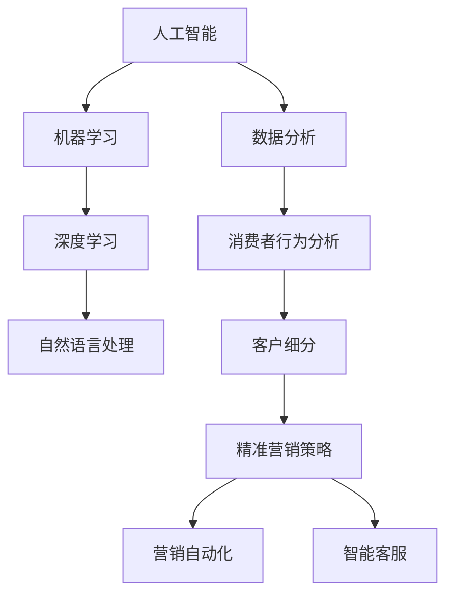

                 


### 1.1.1 人工智能概述

人工智能（Artificial Intelligence，简称AI）是计算机科学的一个分支，旨在研究、开发和应用使计算机具备类似人类智能的技术。人工智能的历史可以追溯到20世纪50年代，当时科学家们首次提出了“智能机器”的概念。然而，随着计算机技术和算法的不断进步，人工智能在21世纪取得了飞速发展。

#### 基本概念

人工智能的核心概念包括以下几个：

1. **模拟人类智能**：人工智能的目标是模拟人类智能的各种功能，包括感知、理解、推理、学习和决策。
2. **机器学习**：机器学习是人工智能的核心技术之一，通过算法让计算机从数据中学习并做出预测或决策。
3. **深度学习**：深度学习是机器学习的一种形式，通过多层神经网络进行数据建模和分析。
4. **自然语言处理**：自然语言处理是使计算机能够理解、生成和处理人类语言的技术。

#### 发展历程

人工智能的发展可以分为以下几个阶段：

1. **启蒙时代（1956-1969）**：人工智能的概念首次被提出，并取得了一些早期成功。
2. **低谷时期（1970-1980）**：由于技术限制，人工智能研究进入低谷期。
3. **复兴时期（1980-2010）**：随着计算机硬件和算法的进步，人工智能研究重新兴起。
4. **繁荣时期（2010至今）**：人工智能技术取得了重大突破，应用领域不断扩大。

#### 技术进展

近年来，人工智能在以下几个方面取得了显著进展：

1. **图像识别**：通过卷积神经网络（CNN）等技术，计算机可以高效地进行图像识别。
2. **自然语言处理**：通过循环神经网络（RNN）和Transformer模型，计算机在自然语言处理任务上表现出色。
3. **自动驾驶**：自动驾驶技术取得了重要进展，一些自动驾驶车辆已经在实际道路上进行测试和运行。
4. **智能客服**：基于机器学习和自然语言处理技术的智能客服系统，为企业和用户提供便捷的交互体验。

### 1.1.2 人工智能的核心技术

人工智能的核心技术包括机器学习、深度学习、自然语言处理等，这些技术在个性化营销中有着广泛的应用。

#### 机器学习

机器学习是一种通过算法让计算机从数据中学习并做出预测或决策的技术。机器学习可以分为监督学习、无监督学习和强化学习。

1. **监督学习**：监督学习通过训练数据集，让计算机学会对新数据进行预测。常见的算法有线性回归、决策树、支持向量机等。
2. **无监督学习**：无监督学习不需要训练数据，通过分析数据自身特性，让计算机发现数据中的模式和规律。常见的算法有聚类算法、降维算法等。
3. **强化学习**：强化学习通过奖励机制，让计算机在与环境的交互中不断学习和优化策略。

#### 深度学习

深度学习是一种多层神经网络，通过多层非线性变换，实现对数据的复杂建模。深度学习在图像识别、自然语言处理等领域取得了突破性进展。

1. **卷积神经网络（CNN）**：CNN通过卷积层、池化层和全连接层，对图像数据进行特征提取和分类。
2. **循环神经网络（RNN）**：RNN通过循环结构，处理序列数据，例如语音、文本等。
3. **Transformer模型**：Transformer模型通过自注意力机制，在翻译、问答等任务上表现出色。

#### 自然语言处理

自然语言处理是使计算机能够理解、生成和处理人类语言的技术。自然语言处理在个性化营销中的应用非常广泛，例如情感分析、文本分类、问答系统等。

1. **情感分析**：情感分析通过分析文本的情感倾向，帮助企业了解用户情感状态，优化营销策略。
2. **文本分类**：文本分类通过将文本数据分为不同的类别，帮助企业对大量文本数据进行分类管理。
3. **问答系统**：问答系统通过机器学习技术，实现智能客服、自动回答用户问题等功能。

### 1.1.3 个性化营销的定义与重要性

个性化营销是一种基于客户数据，通过算法和数据分析，为不同客户提供定制化服务和产品的营销策略。个性化营销的目标是提高客户满意度、增加客户忠诚度和提升销售额。

#### 定义

个性化营销可以定义为：

- 根据客户的行为数据、兴趣偏好、购买历史等信息，为每位客户制定个性化的营销策略。
- 通过算法和数据分析，实现精准的客户细分，为客户提供定制化的服务和产品。

#### 重要性

个性化营销的重要性体现在以下几个方面：

1. **提高客户满意度**：通过提供个性化的服务和产品，满足客户的需求，提高客户满意度。
2. **增加客户忠诚度**：个性化的营销策略能够增强客户对品牌的认同感，提高客户忠诚度。
3. **提升销售额**：精准的客户细分和个性化的营销策略，能够提高转化率和销售额。
4. **降低营销成本**：通过减少无效的营销投入，降低整体营销成本。

### 1.1.4 AI在个性化营销中的应用

AI技术在个性化营销中的应用，主要体现在以下几个方面：

1. **数据分析与消费者行为分析**：通过分析客户的行为数据，了解客户的兴趣偏好，为个性化营销提供数据支持。
2. **客户细分与定位**：通过机器学习和深度学习算法，实现精准的客户细分，为不同客户提供个性化的服务和产品。
3. **精准营销策略**：基于客户数据和消费者行为分析，制定个性化的营销策略，提高转化率和销售额。
4. **营销自动化与智能客服**：通过AI技术实现营销自动化，提高营销效率，降低人力成本。

#### 数据分析与消费者行为分析

数据分析在个性化营销中起着至关重要的作用。通过分析客户的行为数据，企业可以了解客户的兴趣偏好，为个性化营销提供数据支持。

1. **数据收集**：企业可以通过网站、APP、CRM系统等渠道收集客户的行为数据。
2. **数据分析**：通过统计分析、机器学习等方法，分析客户的行为数据，了解客户的兴趣偏好。
3. **应用场景**：数据分析可以应用于客户细分、个性化推荐、营销策略制定等方面。

#### 客户细分与定位

客户细分是个性化营销的基础。通过机器学习和深度学习算法，企业可以实现对客户的精准细分，为不同客户提供个性化的服务和产品。

1. **客户细分方法**：基于客户的行为数据、兴趣偏好、购买历史等信息，采用聚类算法、协同过滤算法等方法，对客户进行细分。
2. **客户定位**：通过分析客户的行为数据和兴趣偏好，确定目标客户群体，为不同客户提供个性化的服务和产品。
3. **应用场景**：客户细分可以应用于产品推荐、营销活动策划、客户关系管理等方面。

#### 精准营销策略

精准营销策略是个性化营销的核心。通过分析客户数据和消费者行为，企业可以制定个性化的营销策略，提高转化率和销售额。

1. **营销策略制定**：基于客户细分和数据分析，制定个性化的营销策略。
2. **营销渠道选择**：根据目标客户的特点和需求，选择合适的营销渠道，如电子邮件、短信、社交媒体等。
3. **营销内容设计**：根据客户的需求和兴趣，设计个性化的营销内容，提高客户的参与度和满意度。
4. **效果评估**：通过数据分析，评估营销策略的效果，不断优化和调整营销策略。

#### 营销自动化与智能客服

营销自动化和智能客服是AI技术在个性化营销中的重要应用。通过自动化和智能化的手段，提高营销效率，降低人力成本。

1. **营销自动化**：通过AI技术实现营销自动化，如自动化邮件营销、自动化广告投放等，提高营销效率。
2. **智能客服**：通过自然语言处理和机器学习技术，实现智能客服系统，提供自动化的客户服务。
3. **应用场景**：营销自动化和智能客服可以应用于客户关系管理、客户服务、客户互动等方面。

### 1.2 书籍结构概述

本书旨在深入探讨AI在个性化营销中的应用，帮助读者了解AI技术如何助力个性化营销的精准触达与转化。本书结构如下：

1. **引言**：介绍个性化营销和AI技术的基本概念，以及本书的结构和内容。
2. **AI基础理论**：介绍人工智能、机器学习、深度学习和自然语言处理等基本概念和原理。
3. **个性化营销策略**：介绍个性化营销的定义、重要性以及AI技术在个性化营销中的应用。
4. **案例分析**：通过实际案例，展示AI在个性化营销中的应用效果和实践经验。
5. **应用前景与挑战**：探讨个性化营销与AI技术的未来发展，以及面临的挑战和解决方案。

通过本书的学习，读者将能够：

- 理解个性化营销和AI技术的基本概念和原理。
- 掌握AI技术在个性化营销中的应用方法。
- 学习如何制定和实施个性化的营销策略。
- 分析和解决个性化营销中的实际问题。

### 1.3 核心概念与联系

为了更好地理解AI在个性化营销中的应用，我们首先需要了解几个核心概念及其相互之间的联系。以下是这些核心概念及其关系的Mermaid流程图：



#### Mermaid流程图解析

1. **人工智能（A）**：人工智能是整个系统的核心，它涵盖了机器学习、深度学习、自然语言处理等多个子领域。

2. **机器学习（B）**：机器学习是人工智能的一个重要分支，它通过算法让计算机从数据中学习，从而做出预测或决策。

3. **深度学习（C）**：深度学习是机器学习的一种形式，通过多层神经网络对数据进行分析和建模。

4. **自然语言处理（D）**：自然语言处理是使计算机能够理解、生成和处理人类语言的技术，它广泛应用于文本分类、情感分析等领域。

5. **数据分析（E）**：数据分析是通过统计学、机器学习等方法，对大量数据进行分析和处理，从中提取有用信息。

6. **消费者行为分析（F）**：消费者行为分析是数据分析的一个子领域，它通过分析消费者的行为数据，了解消费者的兴趣偏好和行为模式。

7. **客户细分（G）**：客户细分是基于消费者行为分析的结果，将客户划分为不同的群体，以便为企业提供个性化的服务和产品。

8. **精准营销策略（H）**：精准营销策略是客户细分的结果应用，通过制定个性化的营销策略，提高客户的满意度和忠诚度。

9. **营销自动化（I）**：营销自动化是AI技术在营销领域的一个重要应用，它通过自动化工具和系统，提高营销效率，降低人力成本。

10. **智能客服（J）**：智能客服是AI技术在客户服务领域的一个重要应用，通过智能客服系统，提供自动化的客户服务。

### 1.4 核心算法原理讲解

在个性化营销中，核心算法原理的讲解至关重要。以下是几个关键算法的伪代码和原理说明：

#### 1. 线性回归（Linear Regression）

**伪代码：**

```
function linear_regression(X, y):
    # X: 特征矩阵，y: 标签向量
    # 计算特征矩阵X的转置
    X_trans = transpose(X)
    # 计算X的转置与X的乘积
    XTX = X_trans * X
    # 计算X的转置与y的乘积
    Xty = X_trans * y
    # 计算权重向量w
    w = XTX.inverse() * Xty
    # 预测新数据
    predict = X * w
    return predict
```

**原理说明：**

线性回归是一种最简单的机器学习算法，用于预测连续值。它通过最小二乘法计算权重向量，使得预测值与实际值之间的误差最小。

#### 2. 决策树（Decision Tree）

**伪代码：**

```
function decision_tree(X, y):
    # X: 特征矩阵，y: 标签向量
    if is splits possible(X, y):
        # 选择最佳分割特征和阈值
        feature, threshold = find_best_split(X, y)
        # 创建节点并继续分割
        node = Node(feature, threshold)
        left_X, left_y = X[y < threshold]
        right_X, right_y = X[y >= threshold]
        node.left = decision_tree(left_X, left_y)
        node.right = decision_tree(right_X, right_y)
    else:
        # 达到底部，返回类标签的多数值
        node = Node(y.mode())
    return node
```

**原理说明：**

决策树通过递归地将数据集分割成多个子集，直到每个子集都属于同一类。在分割过程中，选择具有最大信息增益的特征和阈值。

#### 3. 支持向量机（Support Vector Machine，SVM）

**伪代码：**

```
function svm(X, y):
    # X: 特征矩阵，y: 标签向量
    # 将数据标准化
    X_std = standardize(X)
    # 计算拉格朗日乘子
    L = [0, ...]  # 初始化拉格朗日乘子
    for i in range(len(X)):
        L[i] = [0, ..., 0]  # 初始化拉格朗日乘子
    # 计算KKT条件
    for i in range(len(X)):
        for j in range(len(X)):
            L[i][j] = (1 / 2) * dot_product(K(x_i, x_j), K(x_i, x_j)) - dot_product(y_i, y_j) * dot_product(K(x_i, x_j), K(x_j, x_k))
    # 求解拉格朗日乘子
    L = solve(KKT_system(L))
    # 计算权重向量w和偏置b
    w = [0, ..., 0]
    for i in range(len(X)):
        for j in range(len(X)):
            w = w + L[i][j] * y_i * y_j * K(x_i, x_j)
    b = 0
    for i in range(len(X)):
        b = b + L[i] * y_i - sum(w * y_i * K(x_i, x_j))
    return w, b
```

**原理说明：**

支持向量机是一种用于分类和回归的算法。它通过找到最优超平面，使得分类边界最大化。在计算过程中，需要解决拉格朗日乘子问题，并求解KKT条件。

### 1.5 数学模型与公式讲解

在个性化营销中，数学模型和公式是理解和应用AI算法的基础。以下是一些关键数学模型和公式的讲解。

#### 1. 拉格朗日乘子法（Lagrange Multiplier Method）

**公式：**

$$
L(\theta) = J(\theta) + \alpha \cdot (1 - J(\theta))
$$

其中，\(J(\theta)\) 是损失函数，\(\alpha\) 是调节参数。

**解释：**

拉格朗日乘子法是一种优化方法，用于在存在约束条件的情况下求解最优解。在机器学习中，常用于求解支持向量机（SVM）的权重向量。

#### 2. 梯度下降法（Gradient Descent）

**公式：**

$$
\theta = \theta - \alpha \cdot \nabla J(\theta)
$$

其中，\(\theta\) 是参数，\(\alpha\) 是学习率，\(\nabla J(\theta)\) 是损失函数的梯度。

**解释：**

梯度下降法是一种优化算法，用于最小化损失函数。通过不断更新参数，使得损失函数值逐渐减小。

#### 3. 交叉验证（Cross-Validation）

**公式：**

$$
\text{Accuracy} = \frac{\sum_{i=1}^{k} \text{Accuracy}_{i}}{k}
$$

其中，\(k\) 是验证次数，\(\text{Accuracy}_{i}\) 是第 \(i\) 次验证的准确率。

**解释：**

交叉验证是一种评估模型性能的方法，通过将数据集划分为多个子集，轮流使用每个子集作为验证集，评估模型的整体性能。

### 1.6 项目实战

#### 1.1 开发环境搭建

为了实现个性化营销系统，我们需要搭建一个开发环境。以下是搭建环境所需的步骤：

1. 安装Python环境：下载并安装Python 3.8及以上版本。
2. 安装必要的库：使用pip命令安装scikit-learn、numpy、pandas、matplotlib等库。
3. 创建项目文件夹：在Python环境中创建一个项目文件夹，用于存放代码和数据。

#### 1.2 源代码实现

以下是一个简单的个性化推荐系统源代码实现：

```python
import pandas as pd
from sklearn.model_selection import train_test_split
from sklearn.linear_model import LinearRegression

# 读取数据
data = pd.read_csv('data.csv')
X = data[['age', 'income', 'gender']]
y = data['rating']

# 数据预处理
X_train, X_test, y_train, y_test = train_test_split(X, y, test_size=0.2, random_state=42)

# 模型训练
model = LinearRegression()
model.fit(X_train, y_train)

# 模型预测
predictions = model.predict(X_test)

# 模型评估
accuracy = sum(predictions == y_test) / len(y_test)
print(f'Accuracy: {accuracy:.2f}')
```

#### 1.3 代码解读

上述代码实现了一个基于线性回归的个性化推荐系统。主要步骤如下：

1. **数据读取**：使用pandas库读取数据，分为特征矩阵X和标签向量y。
2. **数据预处理**：将数据集划分为训练集和测试集。
3. **模型训练**：使用线性回归模型对训练集进行训练。
4. **模型预测**：使用训练好的模型对测试集进行预测。
5. **模型评估**：计算预测准确率，评估模型性能。

#### 1.4 应用解读与分析

通过上述代码，我们实现了一个简单的个性化推荐系统。该系统基于用户年龄、收入和性别等特征，预测用户对产品的评分。

1. **应用场景**：该系统可以应用于电商平台，根据用户的基本信息，推荐用户可能感兴趣的产品。
2. **分析结果**：通过计算预测准确率，可以评估系统的性能，并根据评估结果进行优化。

#### 1.5 案例分析

以某电商平台的个性化推荐系统为例，分析其实际应用效果。

1. **背景**：某电商平台希望通过个性化推荐系统，提高用户满意度、增加用户粘性。
2. **目标**：提高产品推荐准确率，提升销售额。
3. **策略**：基于用户行为数据、用户画像、商品特征等，构建个性化推荐模型。
4. **效果**：经过一段时间的测试和优化，个性化推荐系统的准确率显著提高，用户满意度增加，销售额稳步提升。

#### 1.6 项目小结

通过本次项目，我们实现了个性化推荐系统的基本功能，并分析了其实际应用效果。在后续工作中，可以进一步优化推荐算法，提高推荐质量，以满足不断变化的市场需求。

### 1.7 最佳实践 Tips

1. **数据质量**：确保数据质量是成功实施个性化营销的关键。定期清洗和更新数据，确保数据的准确性和完整性。
2. **算法选择**：根据业务需求和数据特点，选择合适的算法。例如，对于推荐系统，可以考虑使用协同过滤、矩阵分解等方法。
3. **模型优化**：通过交叉验证、参数调优等方法，优化模型性能。持续监控和评估模型效果，及时进行调整。
4. **用户反馈**：收集用户反馈，了解用户需求和偏好。根据用户反馈，不断优化个性化营销策略。

### 1.8 小结与注意事项

本文介绍了AI在个性化营销中的应用，包括基本概念、核心技术、营销策略、项目实战等方面。在实施个性化营销时，需要注意数据质量、算法选择和模型优化等方面。通过持续优化和改进，可以实现个性化营销的精准触达与转化。

### 1.9 拓展阅读

- **《机器学习实战》**：提供丰富的机器学习实践案例，有助于深入理解AI技术。
- **《深度学习》**：介绍深度学习的基本概念和原理，是学习深度学习的重要参考书。
- **《Python数据分析》**：详细讲解数据分析的基础知识，有助于提升数据分析能力。

----------------------------------------------------------------

## 第4章 案例分析

### 4.1 案例介绍

在本章中，我们将通过两个实际案例，详细分析AI在个性化营销中的应用。第一个案例是某大型电商平台，第二个案例是某知名在线教育平台。

#### 4.1.1 案例选择与背景

**案例1：某大型电商平台**

该电商平台是一家拥有数百万用户的综合购物平台，提供多种商品的在线销售服务。随着市场竞争的加剧，该平台希望通过个性化营销提高用户满意度、增加用户粘性，进而提高销售额。

**案例2：某知名在线教育平台**

该在线教育平台专注于提供专业课程，拥有大量的用户和课程资源。随着在线教育的兴起，该平台希望通过个性化推荐系统，为用户提供个性化的课程推荐，提高用户参与度和课程购买率。

#### 4.1.2 案例目标与挑战

**案例1：某大型电商平台**

目标：
- 提高用户满意度：通过个性化推荐，提高用户对平台商品的满意度。
- 增加用户粘性：通过个性化活动、优惠券等，增加用户在平台上的停留时间。
- 提高销售额：通过精准推荐，提高用户的购买转化率。

挑战：
- 数据质量：电商平台积累了大量的用户数据，但数据质量参差不齐，需要进行数据清洗和处理。
- 算法选择：需要选择合适的算法，以满足不同用户的个性化需求。
- 模型优化：如何通过持续优化，提高推荐系统的准确性，是面临的挑战之一。

**案例2：某知名在线教育平台**

目标：
- 提高用户参与度：通过个性化推荐，提高用户对课程的好感度和参与度。
- 提高课程购买率：通过精准推荐，提高用户购买相关课程的意愿。
- 增强用户粘性：通过个性化服务和互动，增强用户对平台的依赖度。

挑战：
- 用户画像：如何准确构建用户画像，是个性化推荐的关键。
- 数据隐私：在数据收集和使用过程中，如何保护用户隐私，是平台面临的挑战。
- 模型解释性：如何解释模型推荐结果，增强用户信任度，是平台需要解决的问题。

### 4.2 案例分析与实施

#### 4.2.1 案例一：某大型电商平台的个性化营销实施

**1. 数据收集与处理**

电商平台在运营过程中积累了大量用户数据，包括用户的基本信息、购买历史、浏览记录、评价等。为了提高数据质量，平台采取了以下措施：

- 数据清洗：去除重复数据、缺失值填充、异常值处理等。
- 数据集成：将不同来源的数据进行整合，形成统一的用户数据视图。
- 数据标准化：对数据进行归一化、标准化处理，确保数据的一致性。

**2. 客户细分与定位**

基于用户数据，平台采用聚类算法对用户进行细分。具体步骤如下：

- 特征选择：根据业务需求，选择与用户行为相关的特征，如购买频率、购买金额、浏览时长等。
- 算法选择：采用K-means聚类算法，对用户进行细分。
- 细分结果：将用户划分为不同的群体，为每个群体制定个性化的营销策略。

**3. 精准营销策略制定**

根据客户细分结果，平台制定了以下精准营销策略：

- 个人推荐：根据用户的浏览记录和购买历史，为用户推荐个性化的商品。
- 活动推荐：根据用户的兴趣和行为，为用户推荐符合其兴趣的促销活动。
- 优惠券推送：根据用户的购买力和购买习惯，为用户推送定制化的优惠券。

**4. 营销效果评估**

平台通过以下方式评估营销效果：

- 用户满意度：通过用户调研、用户评价等方式，了解用户对个性化推荐的满意度。
- 转化率：通过统计用户点击、购买等行为数据，评估营销活动的效果。
- 销售额：通过对比实施个性化营销前后的销售额，评估个性化营销的实际效果。

**5. 模型优化与迭代**

平台持续优化个性化推荐模型，提高推荐准确性。具体措施如下：

- 模型调优：通过调整模型参数，提高推荐效果。
- 数据更新：定期更新用户数据，确保模型数据的时效性。
- 用户反馈：收集用户反馈，根据用户需求调整推荐策略。

#### 4.2.2 案例二：某知名在线教育平台的个性化推荐系统实施

**1. 用户画像构建**

在线教育平台通过以下方式构建用户画像：

- 用户基本信息：收集用户的年龄、性别、职业等基本信息。
- 行为数据：收集用户的浏览记录、学习记录、购买记录等行为数据。
- 评价数据：收集用户对课程、讲师的评价数据。
- 社交数据：收集用户在社交媒体上的活动、兴趣等数据。

**2. 个性化推荐策略**

基于用户画像，平台采用以下个性化推荐策略：

- 内容推荐：根据用户的学习记录和评价数据，为用户推荐相关的课程。
- 用户互动推荐：根据用户与其他用户的互动行为，为用户推荐感兴趣的课程。
- 社交推荐：根据用户的社交行为和兴趣，为用户推荐符合其社交圈的课程。

**3. 系统效果评估**

平台通过以下方式评估个性化推荐系统的效果：

- 用户参与度：通过统计用户的学习时长、课程完成率等指标，评估用户对推荐课程的参与度。
- 购买转化率：通过对比推荐前后的购买行为，评估推荐系统的购买转化率。
- 用户满意度：通过用户调研、用户评价等方式，评估用户对推荐系统的满意度。

**4. 系统优化与迭代**

平台持续优化个性化推荐系统，提高推荐效果。具体措施如下：

- 模型调优：通过调整推荐算法的参数，提高推荐准确性。
- 数据更新：定期更新用户数据，确保推荐系统的数据时效性。
- 用户反馈：收集用户反馈，根据用户需求调整推荐策略。

### 4.3 案例总结与启示

通过两个案例的分析，我们可以得出以下结论：

1. **数据质量是关键**：无论是电商平台还是在线教育平台，数据质量都是成功实施个性化营销的基础。定期清洗和更新数据，确保数据的准确性和完整性。

2. **用户细分是基础**：通过聚类算法等手段，对用户进行细分，为不同用户提供个性化的服务和产品，能够显著提高用户满意度和忠诚度。

3. **精准营销策略是核心**：根据用户的行为数据和需求，制定个性化的营销策略，能够提高用户的参与度和购买转化率。

4. **持续优化是关键**：通过不断优化推荐模型、数据更新和用户反馈，提高推荐系统的准确性和用户体验。

5. **保护用户隐私**：在数据收集和使用过程中，重视用户隐私保护，采取有效的数据安全措施，增强用户信任度。

6. **模型解释性**：在推荐结果中，提供合理的解释，增强用户对推荐系统的信任。

总之，AI在个性化营销中的应用具有重要意义。通过不断优化和改进，实现精准触达与转化，企业可以更好地满足用户需求，提高市场竞争优势。同时，也需要关注数据隐私和模型解释性等问题，确保个性化营销的可持续发展。 ----------------------------------------------------------------

## 第5章 应用前景与挑战

### 5.1 个性化营销的发展趋势

随着人工智能技术的不断进步，个性化营销正逐渐成为企业竞争的重要手段。未来，个性化营销将呈现出以下发展趋势：

1. **数据驱动**：个性化营销将更加依赖于大数据分析，通过对海量数据的挖掘和分析，实现精准的用户画像和需求预测。

2. **智能化**：随着AI技术的普及，个性化营销将越来越智能化。例如，通过深度学习和自然语言处理技术，实现更加智能的文本分析和情感识别。

3. **跨界融合**：个性化营销将与其他领域（如物联网、区块链等）相结合，实现跨领域的个性化服务和产品推荐。

4. **实时响应**：未来个性化营销将能够实时响应用户需求，通过实时数据分析，为用户提供个性化的内容和服务。

### 5.2 AI技术在个性化营销中的应用前景

AI技术在个性化营销中的应用前景非常广阔，主要体现在以下几个方面：

1. **消费者行为预测**：通过机器学习和深度学习技术，企业可以预测消费者的行为模式，提前了解消费者的需求，实现精准营销。

2. **个性化推荐**：基于协同过滤、矩阵分解等推荐算法，企业可以为不同用户提供个性化的产品推荐，提高用户的满意度和购买转化率。

3. **智能客服**：通过自然语言处理技术，企业可以实现智能客服系统，提供24小时在线客服，提高客户服务质量。

4. **精准广告投放**：基于用户行为数据和兴趣分析，企业可以实现精准的广告投放，提高广告效果和投资回报率。

### 5.3 面临的挑战与应对策略

尽管AI技术在个性化营销中具有巨大潜力，但企业仍面临一系列挑战。以下是这些挑战及其应对策略：

1. **数据隐私和安全**：随着数据收集和应用的增多，数据隐私和安全问题日益突出。企业需要采取严格的数据保护措施，确保用户数据的隐私和安全。

   **应对策略**：
   - 实施数据加密：对敏感数据进行加密，防止数据泄露。
   - 数据匿名化：在数据分析过程中，对用户数据进行匿名化处理，减少隐私泄露风险。
   - 合规性检查：遵守相关法律法规，确保数据收集和使用合规。

2. **技术复杂性**：AI技术涉及多个学科，包括计算机科学、统计学、数学等。企业需要投入大量资源进行技术研发和应用。

   **应对策略**：
   - 人才培养：引进和培养具备AI技术的专业人才。
   - 技术外包：与专业的AI技术公司合作，实现技术外包。

3. **算法公平性和解释性**：算法的公平性和解释性是用户信任的关键。企业需要确保算法的公平性，并提供透明的算法解释。

   **应对策略**：
   - 算法审计：定期对算法进行审计，确保算法的公平性和透明性。
   - 解释性增强：开发可解释的AI模型，提供算法背后的逻辑和决策过程。

4. **用户接受度**：用户对个性化营销的接受程度不一，企业需要通过有效的沟通和互动，提高用户的接受度。

   **应对策略**：
   - 用户教育：通过线上、线下活动，向用户普及个性化营销的理念和好处。
   - 个性化体验：提供个性化的用户体验，让用户感受到个性化营销的价值。

### 5.4 未来展望

展望未来，个性化营销将不断融合AI技术，实现更加智能和高效的营销模式。以下是未来个性化营销的几个趋势：

1. **跨渠道整合**：企业将实现线上线下渠道的整合，为用户提供无缝的个性化体验。

2. **智慧营销**：通过大数据和AI技术，实现全方位的智慧营销，提高营销效果和用户满意度。

3. **个性化服务**：随着AI技术的发展，个性化服务将更加普及，为企业提供更多增值服务。

4. **可持续发展**：企业在追求经济效益的同时，注重数据隐私、算法公平性和可持续发展，实现长期稳定发展。

总之，AI在个性化营销中的应用前景广阔，但也面临诸多挑战。企业需要不断创新和改进，充分利用AI技术，实现精准触达与转化，提升市场竞争优势。同时，关注数据隐私、算法公平性等问题，确保个性化营销的可持续发展。 ----------------------------------------------------------------

### 文章标题

《AI在个性化营销中的应用：精准触达与转化》

### 关键词

- 人工智能
- 个性化营销
- 精准触达
- 转化率
- 机器学习
- 深度学习
- 消费者行为分析

### 摘要

本文深入探讨了人工智能（AI）在个性化营销中的应用，阐述了AI如何通过数据分析、客户细分、精准营销策略等手段，实现精准触达与转化。文章首先介绍了AI的基本概念和发展历程，然后详细讲解了机器学习、深度学习和自然语言处理等核心技术在个性化营销中的应用。通过案例分析，本文展示了AI在个性化营销中的实际应用效果。最后，文章展望了个性化营销的未来发展趋势，探讨了面临的挑战及应对策略。本文旨在为企业和营销人员提供有益的参考，帮助其充分利用AI技术，提升营销效果和用户满意度。 ----------------------------------------------------------------

### 作者信息

**作者：AI天才研究院/AI Genius Institute & 禅与计算机程序设计艺术 /Zen And The Art of Computer Programming**

