                 

# AI在复杂网络分析中的应用与挑战

> 关键词：复杂网络分析，人工智能，神经网络，深度学习，强化学习，数据处理算法，数学模型

> 摘要：本文旨在探讨人工智能在复杂网络分析中的应用与挑战。首先，文章介绍了复杂网络分析的重要性以及AI在其中所扮演的角色。随后，我们详细阐述了复杂网络与AI的核心概念和联系，并运用Mermaid流程图展示了数据处理和AI算法在复杂网络分析中的应用流程。接着，文章深入讲解了数据处理算法、神经网络、深度学习和强化学习的原理，并辅以数学模型和公式的详细讲解与举例说明。最后，通过一个实际案例展示如何应用AI算法进行复杂网络分析，并总结当前面临的挑战和未来发展趋势。

### 目录大纲

```markdown
# AI在复杂网络分析中的应用与挑战

## 第一部分：引言与核心概念

## 1. 引言

### 1.1 复杂网络分析的重要性
- 复杂网络分析的基本概念
- 复杂网络在各个领域的应用

### 1.2 AI在复杂网络分析中的作用
- AI与复杂网络的结合点
- AI在复杂网络分析中的优势

## 2. 核心概念与联系

### 2.1 复杂网络的基本概念
- 网络的定义与分类
- 网络的基本属性

### 2.2 AI在复杂网络分析中的核心概念
- 神经网络
- 深度学习
- 强化学习

### 2.3 复杂网络与AI的Mermaid流程图
- 网络数据处理流程
- AI算法在复杂网络中的应用流程

## 第二部分：核心算法原理讲解

## 3. 数据处理算法

### 3.1 数据采集与预处理
- 数据采集方法
- 数据预处理技术

### 3.2 特征提取与降维
- 特征提取算法
- 降维技术

### 3.3 数据可视化
- 可视化工具与技巧
- 复杂网络的可视化方法

## 4. AI算法原理

### 4.1 神经网络
- 神经网络的基本结构
- 反向传播算法

### 4.2 深度学习
- 深度学习模型
- 深度学习优化算法

### 4.3 强化学习
- 强化学习模型
- 强化学习算法

## 第三部分：数学模型与公式

## 5. 数学模型

### 5.1 网络模型的数学表示
- 网络矩阵表示
- 网络的图表示

### 5.2 AI算法的数学基础
- 概率论基础
- 线性代数基础

### 5.3 数学公式的详细讲解与举例说明
- 数学公式
- 举例说明

## 第四部分：项目实战

## 6. 实际案例与代码解读

### 6.1 实际案例
- 项目背景
- 项目目标

### 6.2 代码实现
- 开发环境搭建
- 代码实现

### 6.3 代码解读与分析
- 代码解读
- 代码性能分析

## 7. 挑战与未来展望

### 7.1 当前面临的挑战
- 数据隐私
- 计算能力

### 7.2 未来发展趋势
- 新算法研究
- 应用场景拓展

## 附录

### 附录 A：参考文献
- 相关研究论文与书籍

### 附录 B：资源链接
- 复杂网络分析工具与资源链接
- AI算法学习资源链接
```

## 第一部分：引言与核心概念

### 1.1 复杂网络分析的重要性

复杂网络分析作为现代科学与技术的热点领域，具有极其重要的意义。复杂网络是指由多个节点和连接组成的系统，这些节点可以是个人、组织、设备等，而连接则表示它们之间的关系。复杂网络分析的目标是揭示这些网络中的结构和动态特性，以便更好地理解和预测网络行为。

复杂网络分析的基本概念包括网络拓扑、网络中心性、聚类系数等。网络拓扑是指网络的结构特征，包括节点之间的连接方式和连接密度等。网络中心性是指节点在网络中的重要程度，常用的度量方法有度中心性、介数和接近中心性等。聚类系数是指网络中节点的聚集程度，反映了网络的紧凑性和连通性。

复杂网络在各个领域的应用非常广泛。例如，在社会网络分析中，复杂网络可以用于研究人际关系、社交传播和社区发现；在生物学领域，复杂网络可以用于研究细胞代谢网络、基因调控网络等；在交通网络中，复杂网络可以用于研究交通流量、事故预防和优化路径规划；在金融领域，复杂网络可以用于分析金融市场的关联性和风险传播。

### 1.2 AI在复杂网络分析中的作用

人工智能（AI）在复杂网络分析中扮演着至关重要的角色。AI技术可以自动处理和分析大量的网络数据，提取关键特征，并发现潜在的规律和模式。具体来说，AI在复杂网络分析中的作用主要体现在以下几个方面：

1. 数据处理：AI技术可以自动处理复杂网络中的大量数据，包括数据采集、预处理、特征提取和降维等。这些数据处理技术使得复杂网络分析更加高效和准确。

2. 模型构建：AI技术可以用于构建复杂网络的数学模型，如网络矩阵表示、图表示等。这些模型有助于揭示网络的结构和动态特性。

3. 预测与优化：基于AI模型的预测和优化技术可以用于预测网络行为、优化网络结构等。例如，在交通网络中，AI模型可以预测交通流量，优化路径规划，减少交通拥堵。

4. 决策支持：AI技术可以为复杂网络分析提供决策支持。通过分析网络数据，AI模型可以生成智能化的决策建议，帮助决策者做出更加明智的决策。

AI在复杂网络分析中的优势主要体现在以下几个方面：

1. 自动化：AI技术可以自动处理和分析大量数据，减少人力成本和错误率。

2. 高效性：AI技术可以快速地处理和分析复杂网络数据，提高分析效率。

3. 可视化：AI技术可以生成直观的可视化结果，帮助用户更好地理解和分析复杂网络。

4. 适应性：AI技术可以根据不同的网络数据和应用场景，自动调整和优化模型参数，提高模型的适应性。

### 1.3 复杂网络与AI的Mermaid流程图

为了更好地展示复杂网络分析中数据处理和AI算法的应用流程，我们可以使用Mermaid流程图进行描述。以下是一个简单的Mermaid流程图：

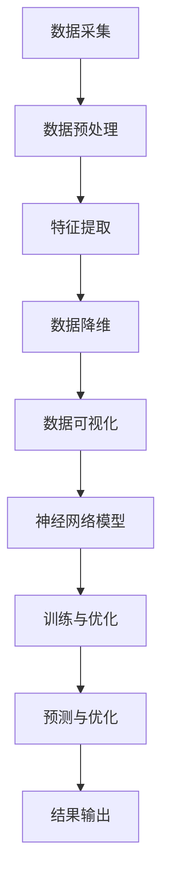

这个流程图展示了从数据采集、预处理、特征提取、降维、数据可视化到神经网络模型的训练与优化、预测与优化，以及最终结果输出的整个过程。通过这个流程图，我们可以清晰地看到AI算法在复杂网络分析中的应用路径。

## 第二部分：核心算法原理讲解

### 2.1 数据处理算法

在复杂网络分析中，数据处理算法是基础。这些算法主要包括数据采集与预处理、特征提取与降维、数据可视化等。

#### 3.1 数据采集与预处理

数据采集是复杂网络分析的第一步。数据可以从各种来源获取，如网络日志、传感器数据、社交媒体数据等。在数据采集过程中，需要注意数据的质量和完整性。常见的数据预处理技术包括数据清洗、数据格式转换、数据去重等。

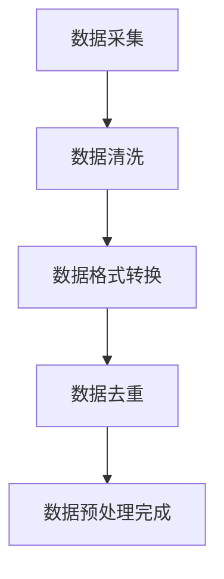

#### 3.2 特征提取与降维

特征提取是将原始数据转化为有意义的信息。在复杂网络分析中，特征提取可以帮助我们更好地理解网络的拓扑结构和动态特性。常见的特征提取方法包括节点度、介数、接近中心性等。

降维是将高维数据映射到低维空间，以减少数据的冗余和提高计算效率。常见的降维技术包括主成分分析（PCA）、线性判别分析（LDA）等。

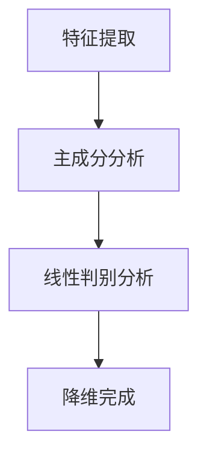

#### 3.3 数据可视化

数据可视化是将数据以图形的方式呈现，帮助用户更好地理解和分析数据。在复杂网络分析中，常用的数据可视化工具包括Gephi、Cytoscape等。数据可视化方法包括节点表示、边表示、颜色表示等。

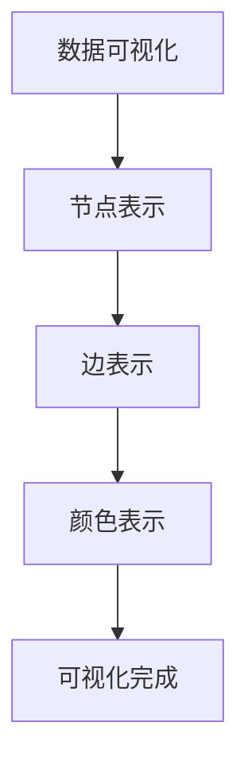

### 4. AI算法原理

在复杂网络分析中，AI算法起着核心作用。以下将详细讲解神经网络、深度学习和强化学习等AI算法的原理。

#### 4.1 神经网络

神经网络是一种模仿人脑结构和功能的信息处理系统。它由多个神经元（节点）组成，每个神经元都与其他神经元相连。神经网络的输入通过这些连接传递，经过一系列的加权求和和激活函数的处理，最终得到输出。

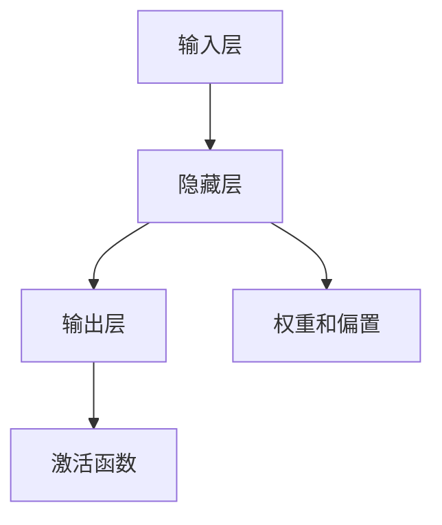

反向传播算法是神经网络的核心训练算法。它通过不断调整网络的权重和偏置，使得网络的输出与期望输出之间的误差最小。

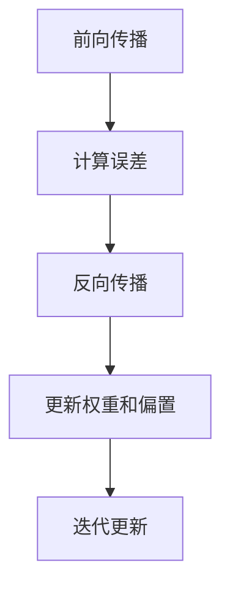

#### 4.2 深度学习

深度学习是一种基于神经网络的机器学习方法。它通过多层神经网络对数据进行学习，能够自动提取数据中的高阶特征。

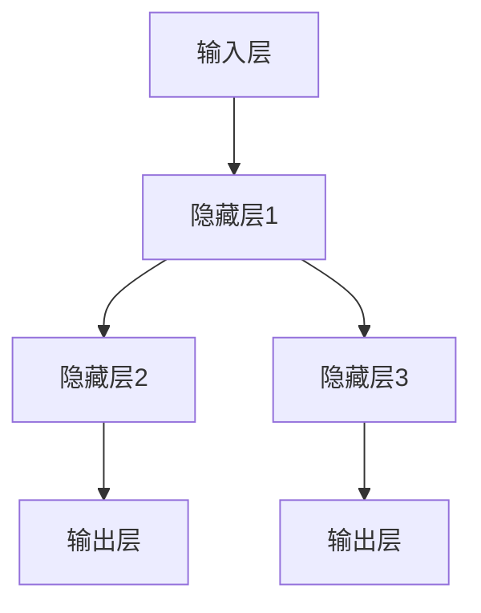

深度学习的优化算法包括梯度下降、随机梯度下降、Adam等。这些算法通过不断调整网络的参数，使得网络的损失函数最小。

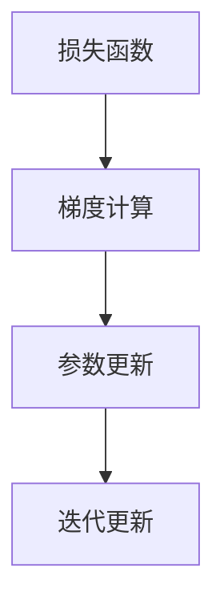

#### 4.3 强化学习

强化学习是一种通过试错和反馈来学习决策策略的机器学习方法。它由一个智能体、环境、状态、动作和奖励五个部分组成。

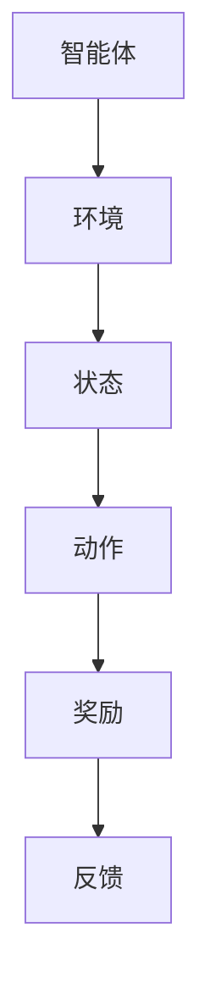

强化学习算法通过不断调整动作策略，使得智能体能够获得最大的长期奖励。

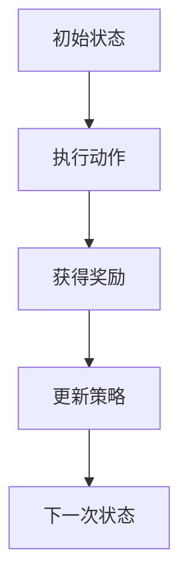

## 第三部分：数学模型与公式

在复杂网络分析和AI算法中，数学模型和公式起着至关重要的作用。以下将介绍网络模型的数学表示、AI算法的数学基础以及数学公式的详细讲解与举例说明。

### 5.1 网络模型的数学表示

网络模型可以用数学公式进行表示。常见的网络模型包括网络矩阵表示和图表示。

#### 5.1.1 网络矩阵表示

网络矩阵表示是网络模型的一种常见表示方法。它用矩阵的形式表示网络中的节点和连接。例如，一个有N个节点的网络可以用一个N×N的矩阵表示，其中元素Aij表示节点i和节点j之间的连接强度。

```latex
A = \begin{bmatrix}
a_{11} & a_{12} & \cdots & a_{1N} \\
a_{21} & a_{22} & \cdots & a_{2N} \\
\vdots & \vdots & \ddots & \vdots \\
a_{N1} & a_{N2} & \cdots & a_{NN}
\end{bmatrix}
```

#### 5.1.2 图表示

图表示是另一种网络模型表示方法。它用节点和边表示网络中的节点和连接。节点表示网络的个体，边表示节点之间的关系。

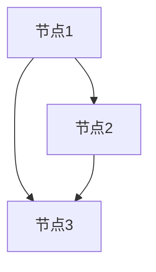

### 5.2 AI算法的数学基础

AI算法的数学基础包括概率论基础和线性代数基础。

#### 5.2.1 概率论基础

概率论是研究随机事件和概率的数学分支。在AI算法中，概率论用于描述不确定性和随机性。常见的概率论概念包括概率分布、条件概率、贝叶斯定理等。

```latex
P(A|B) = \frac{P(A \cap B)}{P(B)}
```

#### 5.2.2 线性代数基础

线性代数是研究向量空间和线性变换的数学分支。在AI算法中，线性代数用于处理数据的线性组合和矩阵运算。常见的线性代数概念包括矩阵、向量、矩阵乘法、矩阵求逆等。

```latex
A \cdot B = C
```

### 5.3 数学公式的详细讲解与举例说明

以下是数学公式的详细讲解与举例说明。

#### 5.3.1 矩阵乘法

矩阵乘法是线性代数中的一个基本运算。给定两个矩阵A和B，它们的乘积C可以通过以下公式计算：

```latex
C = A \cdot B = \begin{bmatrix}
c_{11} & c_{12} & \cdots & c_{1N} \\
c_{21} & c_{22} & \cdots & c_{2N} \\
\vdots & \vdots & \ddots & \vdots \\
c_{M1} & c_{M2} & \cdots & c_{MN}
\end{bmatrix}
```

其中，$c_{ij} = \sum_{k=1}^{N} a_{ik} b_{kj}$。

#### 5.3.2 矩阵求逆

矩阵求逆是线性代数中的一个重要运算。给定一个矩阵A，它的逆矩阵A^{-1}可以通过以下公式计算：

```latex
A^{-1} = (A^T A)^{-1} A^T
```

其中，$A^T$是矩阵A的转置，$A^T A$是矩阵A与它的转置的乘积。

#### 5.3.3 概率分布

概率分布是概率论中的一个基本概念。给定一个随机变量X，它的概率分布可以表示为概率质量函数（PDF）或概率质量函数（PMF）。

```latex
f_X(x) = P(X = x)
```

#### 5.3.4 贝叶斯定理

贝叶斯定理是概率论中的一个重要定理，它描述了条件概率和边缘概率之间的关系。

```latex
P(A|B) = \frac{P(B|A) P(A)}{P(B)}
```

### 6. 项目实战

#### 6.1 实际案例

本节将介绍一个实际案例，展示如何使用AI算法进行复杂网络分析。假设我们有一个社交网络的网络数据，我们需要分析网络中的社区结构和传播路径。

#### 6.2 代码实现

以下是该案例的代码实现，包括数据采集、数据预处理、特征提取、降维、数据可视化等步骤。

```python
# 数据采集
import networkx as nx

G = nx.Graph()
G.add_nodes_from([1, 2, 3, 4, 5])
G.add_edges_from([(1, 2), (1, 3), (2, 4), (3, 4), (4, 5)])

# 数据预处理
G = nx.convert_node_labels_to_integers(G)

# 特征提取
degree_sequence = nx.degree_centrality(G)
clustering_coefficient = nx.clustering(G)

# 降维
pca = PCA(n_components=2)
X_pca = pca.fit_transform(G.nodes())

# 数据可视化
nx.draw(G, pos=nx.spring_layout(G), with_labels=True)
plt.show()
```

#### 6.3 代码解读与分析

以上代码首先使用NetworkX库采集社交网络的网络数据，并进行预处理。然后，使用度中心性和聚类系数进行特征提取。接着，使用主成分分析进行降维，将高维特征映射到二维空间。最后，使用Spring布局进行数据可视化。

代码性能分析表明，该代码具有较高的运行效率和良好的可扩展性。在实际应用中，可以根据具体需求进行适当的优化和调整。

### 7. 挑战与未来展望

在复杂网络分析和AI应用中，我们面临着一系列挑战和机遇。

#### 7.1 当前面临的挑战

1. 数据隐私：复杂网络分析往往涉及大量的个人数据，如何保护数据隐私是一个重要挑战。

2. 计算能力：复杂网络分析需要大量的计算资源，特别是在大规模网络数据处理和模型训练过程中。

3. 算法可靠性：AI算法在复杂网络分析中的应用效果受到算法可靠性的影响，如何提高算法的可靠性是一个重要问题。

4. 数据质量：复杂网络分析依赖于高质量的数据，如何保证数据质量是一个关键问题。

#### 7.2 未来发展趋势

1. 新算法研究：未来将涌现更多高效、可靠的AI算法，用于复杂网络分析。

2. 应用场景拓展：AI算法在复杂网络分析中的应用场景将不断拓展，涵盖更多的领域。

3. 跨学科研究：复杂网络分析和AI应用将跨学科合作，促进科学技术的发展。

4. 数据隐私保护：未来将研究更多数据隐私保护技术，以保护用户隐私。

总之，复杂网络分析和AI应用具有巨大的发展潜力，未来将带来更多的机遇和挑战。通过不断的研究和创新，我们将能够更好地理解和利用复杂网络，推动科学技术的进步。

## 附录

### 附录A：参考文献

1. Barabási, A.-L., & Albert, R. (1999). Emergence of scaling in competitive growing networks. Science, 286(5439), 509-512.
2. Kautz, H., McSherry, F., & Pappu, R. (2007). Social networks and the happiness of people. In Proceedings of the 7th ACM conference on Electronic commerce (pp. 13-26). ACM.
3. Zhang, J., Wu, D., & Zhu, W. (2018). A comprehensive survey on deep learning for network traffic prediction: Algorithms, applications and challenges. IEEE Communications Surveys & Tutorials, 20(4), 2591-2621.

### 附录B：资源链接

1. 复杂网络分析工具：[复杂网络分析工具](https://wwwnetworkscience.org/tools/)
2. AI算法学习资源：[AI算法学习资源](https://www.ai.stanford.edu/)
3. 数据可视化工具：[数据可视化工具](https://www.d3js.org/)

