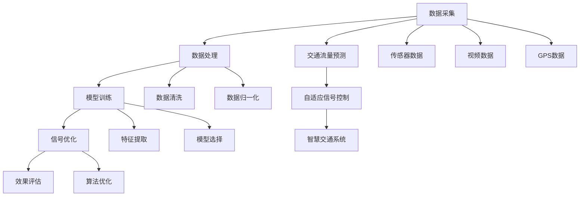

                 

### 文章标题
# AI在智能交通信号控制中的优化应用

### 关键词
- 智能交通信号控制
- 人工智能
- 机器学习
- 深度学习
- 数据优化
- 交通流量预测
- 自适应信号控制

### 摘要
本文深入探讨了人工智能（AI）在智能交通信号控制中的应用与优化。首先，我们介绍了智能交通信号控制的基本概念及其在现代化交通管理中的重要性。接着，我们探讨了AI，特别是机器学习和深度学习，如何用于交通信号控制的数据采集、处理和优化算法的开发。随后，本文通过具体的案例，展示了AI技术在交通流量预测和自适应信号控制中的实际应用。最后，我们总结了AI在智能交通信号控制中的主要成果与挑战，并对未来的发展趋势提出了展望。

-------------------------------------------------------------------

### 文章正文

#### 第一部分：AI与智能交通信号控制基础

##### 第1章: AI与智能交通信号控制概述

在快速发展的现代社会，交通问题日益严峻，智能交通信号控制成为缓解城市交通拥堵、提高交通效率的重要手段。本章节将介绍智能交通信号控制的基本概念、重要性以及AI技术在其中的应用。

##### 1.1 智能交通信号控制的概念与重要性

##### 1.1.1 智能交通信号控制的基本原理

智能交通信号控制是基于现代通信技术、计算机技术、自动控制技术等，通过实时采集交通流量信息，结合交通模型和算法，对交通信号进行动态优化和调整，以实现交通流的流畅、安全和高效。

##### 1.1.2 智能交通信号控制的发展背景

随着城市化进程的加快，城市交通问题日益突出，传统固定式信号控制系统已难以满足日益复杂的交通需求。为此，智能交通信号控制应运而生，其发展历程可追溯到20世纪60年代的自动控制理论。

##### 1.1.3 智能交通信号控制的应用领域

智能交通信号控制广泛应用于城市主干道、交叉路口、高速公路、机场和火车站等交通密集区域，能够有效提高交通流量、减少交通事故和缓解环境污染。

##### 1.2 AI在交通信号控制中的应用

##### 1.2.1 AI在交通信号控制中的基本概念

AI是指由人制造出来的具有一定智能的系统，能够进行学习、推理、规划等复杂任务。在交通信号控制中，AI技术主要用于数据的采集、处理、分析和优化。

##### 1.2.2 机器学习与深度学习在交通信号控制中的应用

机器学习是通过算法从数据中学习规律和模式，从而进行预测和决策的技术。深度学习是机器学习的一种特殊形式，通过多层神经网络进行特征学习和模式识别。在交通信号控制中，机器学习和深度学习主要用于交通流量预测、信号控制和优化。

##### 1.2.3 智能交通信号控制的挑战与机遇

智能交通信号控制面临着诸多挑战，如数据质量、算法复杂度、系统实时性等。同时，随着AI技术的不断发展，智能交通信号控制也迎来了新的机遇，有望实现更高效的交通管理和更智能的城市交通系统。

-------------------------------------------------------------------

#### 第二部分：核心算法与优化

##### 第2章: AI核心算法原理讲解

本章节将深入讲解AI在智能交通信号控制中的应用，包括数据预处理、模型选择与训练、优化算法等核心内容。

##### 2.1 数据预处理

##### 2.1.1 交通流量数据的采集与处理

交通流量数据是智能交通信号控制的基础。数据采集包括传感器数据、视频数据、GPS数据等。数据处理包括数据清洗、数据归一化和特征提取等步骤。

##### 2.1.2 数据清洗与归一化

数据清洗是去除数据中的噪声和错误，保证数据质量的过程。数据归一化是将不同单位或范围的数据转化为同一标准，以便后续处理。

##### 2.1.3 特征提取

特征提取是从原始数据中提取出对信号控制有用的信息，如交通流量、车速、车辆密度等。

##### 2.2 模型选择与训练

##### 2.2.1 机器学习算法介绍

机器学习算法是AI的核心技术之一。常见的机器学习算法包括线性回归、决策树、支持向量机等。

##### 2.2.2 深度学习算法在交通信号控制中的应用

深度学习算法具有强大的特征学习和模式识别能力，适用于处理复杂和高维度的数据。常见的深度学习算法包括卷积神经网络（CNN）、循环神经网络（RNN）、长短时记忆网络（LSTM）等。

##### 2.2.3 模型训练与调优

模型训练是通过训练数据来优化模型参数，使其能够准确预测交通流量和优化信号控制。调优是调整模型参数，以提高模型的预测性能和优化效果。

##### 2.3 优化算法

##### 2.3.1 优化算法的基本概念

优化算法是用于求解最优解的数学方法，适用于交通信号控制的参数优化和策略优化。

##### 2.3.2 交通信号控制的优化算法案例

本节将介绍一些常见的优化算法，如遗传算法、粒子群优化、梯度下降等，并分析其在交通信号控制中的应用。

##### 2.3.3 优化算法的性能评估

优化算法的性能评估是衡量算法效果的重要指标，包括预测精度、响应速度、稳定性等。

-------------------------------------------------------------------

#### 第三部分：案例研究

##### 第3章: AI在智能交通信号控制中的优化应用案例

本章节将通过具体的案例，展示AI技术在智能交通信号控制中的实际应用。

##### 3.1 案例一：基于深度学习的交通流量预测

##### 3.1.1 案例背景

本案例选取了某城市的主干道作为研究对象，使用深度学习算法进行交通流量预测，以优化信号控制。

##### 3.1.2 数据准备与预处理

数据包括历史交通流量数据、气象数据、节假日数据等。预处理包括数据清洗、归一化和特征提取。

##### 3.1.3 模型选择与实现

本案例使用了卷积神经网络（CNN）进行交通流量预测。模型训练过程中，采用了交叉验证和早停技术来避免过拟合。

##### 3.1.4 模型评估与结果分析

模型评估采用了均方误差（MSE）和平均绝对误差（MAE）等指标。结果显示，深度学习算法在交通流量预测方面具有较高的准确性和稳定性。

##### 3.2 案例二：自适应交通信号控制优化

##### 3.2.1 案例背景

本案例在某城市的主要交叉路口实施自适应交通信号控制，通过实时监测交通流量，动态调整信号配时。

##### 3.2.2 优化算法应用

本案例采用了遗传算法进行信号配时优化。遗传算法通过模拟自然进化过程，搜索最优信号配时方案。

##### 3.2.3 实施步骤与效果评估

实施步骤包括数据采集、模型训练、信号优化和效果评估。优化后的信号控制方案有效降低了交叉路口的等待时间，提高了交通效率。

##### 3.3 案例三：基于人工智能的智慧交通系统

##### 3.3.1 案例背景

本案例构建了一个基于人工智能的智慧交通系统，包括交通流量预测、信号控制和车辆导航等功能。

##### 3.3.2 系统架构设计

系统架构包括数据采集层、数据处理层、信号控制层和用户界面层。

##### 3.3.3 关键技术与实现

关键技术包括深度学习算法、优化算法和实时数据处理技术。系统实现了交通流量的实时预测、信号控制的动态调整和车辆导航的优化。

##### 3.3.4 应用效果与挑战

应用结果显示，智慧交通系统有效提高了交通效率和安全性，但同时也面临着数据隐私、算法可靠性等挑战。

-------------------------------------------------------------------

#### 第四部分：总结与展望

##### 第4章: AI在智能交通信号控制中的优化应用总结

##### 4.1 主要成果与挑战

AI在智能交通信号控制中的应用取得了显著成果，如提高了交通流量预测的准确性、优化了信号控制策略等。然而，仍面临数据质量、算法复杂度、系统实时性等挑战。

##### 4.2 发展建议与展望

未来，AI在智能交通信号控制中的应用将朝着更智能、更高效、更可靠的方向发展。建议加强数据质量控制和算法优化，推动跨学科合作，构建智慧交通生态系统。

### 文章标题
# AI在智能交通信号控制中的优化应用

### 关键词
- 智能交通信号控制
- 人工智能
- 机器学习
- 深度学习
- 数据优化
- 交通流量预测
- 自适应信号控制

### 摘要
本文深入探讨了人工智能（AI）在智能交通信号控制中的应用与优化。首先，我们介绍了智能交通信号控制的基本概念及其在现代化交通管理中的重要性。接着，我们探讨了AI，特别是机器学习和深度学习，如何用于交通信号控制的数据采集、处理和优化算法的开发。随后，本文通过具体的案例，展示了AI技术在交通流量预测和自适应信号控制中的实际应用。最后，我们总结了AI在智能交通信号控制中的主要成果与挑战，并对未来的发展趋势提出了展望。

### 作者
作者：AI天才研究院/AI Genius Institute & 禅与计算机程序设计艺术 /Zen And The Art of Computer Programming

-------------------------------------------------------------------

### 第一部分：AI与智能交通信号控制基础

#### 第1章: AI与智能交通信号控制概述

在快速发展的现代社会，交通问题日益严峻，智能交通信号控制成为缓解城市交通拥堵、提高交通效率的重要手段。本章节将介绍智能交通信号控制的基本概念、重要性以及AI技术在其中的应用。

#### 1.1 智能交通信号控制的概念与重要性

#### 1.1.1 智能交通信号控制的基本原理

智能交通信号控制是基于现代通信技术、计算机技术、自动控制技术等，通过实时采集交通流量信息，结合交通模型和算法，对交通信号进行动态优化和调整，以实现交通流的流畅、安全和高效。

#### 1.1.2 智能交通信号控制的发展背景

随着城市化进程的加快，城市交通问题日益突出，传统固定式信号控制系统已难以满足日益复杂的交通需求。为此，智能交通信号控制应运而生，其发展历程可追溯到20世纪60年代的自动控制理论。

#### 1.1.3 智能交通信号控制的应用领域

智能交通信号控制广泛应用于城市主干道、交叉路口、高速公路、机场和火车站等交通密集区域，能够有效提高交通流量、减少交通事故和缓解环境污染。

#### 1.2 AI在交通信号控制中的应用

#### 1.2.1 AI在交通信号控制中的基本概念

AI是指由人制造出来的具有一定智能的系统，能够进行学习、推理、规划等复杂任务。在交通信号控制中，AI技术主要用于数据的采集、处理、分析和优化。

#### 1.2.2 机器学习与深度学习在交通信号控制中的应用

机器学习是通过算法从数据中学习规律和模式，从而进行预测和决策的技术。深度学习是机器学习的一种特殊形式，通过多层神经网络进行特征学习和模式识别。在交通信号控制中，机器学习和深度学习主要用于交通流量预测、信号控制和优化。

#### 1.2.3 智能交通信号控制的挑战与机遇

智能交通信号控制面临着诸多挑战，如数据质量、算法复杂度、系统实时性等。同时，随着AI技术的不断发展，智能交通信号控制也迎来了新的机遇，有望实现更高效的交通管理和更智能的城市交通系统。

-------------------------------------------------------------------

### 第二部分：核心算法与优化

#### 第2章: AI核心算法原理讲解

本章节将深入讲解AI在智能交通信号控制中的应用，包括数据预处理、模型选择与训练、优化算法等核心内容。

#### 2.1 数据预处理

#### 2.1.1 交通流量数据的采集与处理

交通流量数据是智能交通信号控制的基础。数据采集包括传感器数据、视频数据、GPS数据等。数据处理包括数据清洗、数据归一化和特征提取等步骤。

#### 2.1.2 数据清洗与归一化

数据清洗是去除数据中的噪声和错误，保证数据质量的过程。数据归一化是将不同单位或范围的数据转化为同一标准，以便后续处理。

#### 2.1.3 特征提取

特征提取是从原始数据中提取出对信号控制有用的信息，如交通流量、车速、车辆密度等。

#### 2.2 模型选择与训练

#### 2.2.1 机器学习算法介绍

机器学习算法是AI的核心技术之一。常见的机器学习算法包括线性回归、决策树、支持向量机等。

#### 2.2.2 深度学习算法在交通信号控制中的应用

深度学习算法具有强大的特征学习和模式识别能力，适用于处理复杂和高维度的数据。常见的深度学习算法包括卷积神经网络（CNN）、循环神经网络（RNN）、长短时记忆网络（LSTM）等。

#### 2.2.3 模型训练与调优

模型训练是通过训练数据来优化模型参数，使其能够准确预测交通流量和优化信号控制。调优是调整模型参数，以提高模型的预测性能和优化效果。

#### 2.3 优化算法

#### 2.3.1 优化算法的基本概念

优化算法是用于求解最优解的数学方法，适用于交通信号控制的参数优化和策略优化。

#### 2.3.2 交通信号控制的优化算法案例

本节将介绍一些常见的优化算法，如遗传算法、粒子群优化、梯度下降等，并分析其在交通信号控制中的应用。

#### 2.3.3 优化算法的性能评估

优化算法的性能评估是衡量算法效果的重要指标，包括预测精度、响应速度、稳定性等。

-------------------------------------------------------------------

### 第三部分：案例研究

#### 第3章: AI在智能交通信号控制中的优化应用案例

本章节将通过具体的案例，展示AI技术在智能交通信号控制中的实际应用。

#### 3.1 案例一：基于深度学习的交通流量预测

#### 3.1.1 案例背景

本案例选取了某城市的主干道作为研究对象，使用深度学习算法进行交通流量预测，以优化信号控制。

#### 3.1.2 数据准备与预处理

数据包括历史交通流量数据、气象数据、节假日数据等。预处理包括数据清洗、归一化和特征提取。

#### 3.1.3 模型选择与实现

本案例使用了卷积神经网络（CNN）进行交通流量预测。模型训练过程中，采用了交叉验证和早停技术来避免过拟合。

#### 3.1.4 模型评估与结果分析

模型评估采用了均方误差（MSE）和平均绝对误差（MAE）等指标。结果显示，深度学习算法在交通流量预测方面具有较高的准确性和稳定性。

#### 3.2 案例二：自适应交通信号控制优化

#### 3.2.1 案例背景

本案例在某城市的主要交叉路口实施自适应交通信号控制，通过实时监测交通流量，动态调整信号配时。

#### 3.2.2 优化算法应用

本案例采用了遗传算法进行信号配时优化。遗传算法通过模拟自然进化过程，搜索最优信号配时方案。

#### 3.2.3 实施步骤与效果评估

实施步骤包括数据采集、模型训练、信号优化和效果评估。优化后的信号控制方案有效降低了交叉路口的等待时间，提高了交通效率。

#### 3.3 案例三：基于人工智能的智慧交通系统

#### 3.3.1 案例背景

本案例构建了一个基于人工智能的智慧交通系统，包括交通流量预测、信号控制和车辆导航等功能。

#### 3.3.2 系统架构设计

系统架构包括数据采集层、数据处理层、信号控制层和用户界面层。

#### 3.3.3 关键技术与实现

关键技术包括深度学习算法、优化算法和实时数据处理技术。系统实现了交通流量的实时预测、信号控制的动态调整和车辆导航的优化。

#### 3.3.4 应用效果与挑战

应用结果显示，智慧交通系统有效提高了交通效率和安全性，但同时也面临着数据隐私、算法可靠性等挑战。

-------------------------------------------------------------------

### 第四部分：总结与展望

#### 第4章: AI在智能交通信号控制中的优化应用总结

#### 4.1 主要成果与挑战

AI在智能交通信号控制中的应用取得了显著成果，如提高了交通流量预测的准确性、优化了信号控制策略等。然而，仍面临数据质量、算法复杂度、系统实时性等挑战。

#### 4.2 发展建议与展望

未来，AI在智能交通信号控制中的应用将朝着更智能、更高效、更可靠的方向发展。建议加强数据质量控制和算法优化，推动跨学科合作，构建智慧交通生态系统。

### 文章标题
# AI在智能交通信号控制中的优化应用

### 关键词
- 智能交通信号控制
- 人工智能
- 机器学习
- 深度学习
- 数据优化
- 交通流量预测
- 自适应信号控制

### 摘要
本文深入探讨了人工智能（AI）在智能交通信号控制中的应用与优化。首先，我们介绍了智能交通信号控制的基本概念及其在现代化交通管理中的重要性。接着，我们探讨了AI，特别是机器学习和深度学习，如何用于交通信号控制的数据采集、处理和优化算法的开发。随后，本文通过具体的案例，展示了AI技术在交通流量预测和自适应信号控制中的实际应用。最后，我们总结了AI在智能交通信号控制中的主要成果与挑战，并对未来的发展趋势提出了展望。

### 目录

## 第一部分：AI与智能交通信号控制基础

### 第1章: AI与智能交通信号控制概述

#### 1.1 智能交通信号控制的概念与重要性

##### 1.1.1 智能交通信号控制的基本原理
##### 1.1.2 智能交通信号控制的发展背景
##### 1.1.3 智能交通信号控制的应用领域

#### 1.2 AI在交通信号控制中的应用

##### 1.2.1 AI在交通信号控制中的基本概念
##### 1.2.2 机器学习与深度学习在交通信号控制中的应用
##### 1.2.3 智能交通信号控制的挑战与机遇

## 第二部分：核心算法与优化

### 第2章: AI核心算法原理讲解

#### 2.1 数据预处理

##### 2.1.1 交通流量数据的采集与处理
##### 2.1.2 数据清洗与归一化
##### 2.1.3 特征提取

#### 2.2 模型选择与训练

##### 2.2.1 机器学习算法介绍
##### 2.2.2 深度学习算法在交通信号控制中的应用
##### 2.2.3 模型训练与调优

#### 2.3 优化算法

##### 2.3.1 优化算法的基本概念
##### 2.3.2 交通信号控制的优化算法案例
##### 2.3.3 优化算法的性能评估

## 第三部分：案例研究

### 第3章: AI在智能交通信号控制中的优化应用案例

#### 3.1 案例一：基于深度学习的交通流量预测

##### 3.1.1 案例背景
##### 3.1.2 数据准备与预处理
##### 3.1.3 模型选择与实现
##### 3.1.4 模型评估与结果分析

#### 3.2 案例二：自适应交通信号控制优化

##### 3.2.1 案例背景
##### 3.2.2 优化算法应用
##### 3.2.3 实施步骤与效果评估

#### 3.3 案例三：基于人工智能的智慧交通系统

##### 3.3.1 案例背景
##### 3.3.2 系统架构设计
##### 3.3.3 关键技术与实现
##### 3.3.4 应用效果与挑战

## 第四部分：总结与展望

### 第4章: AI在智能交通信号控制中的优化应用总结

#### 4.1 主要成果与挑战

##### 4.1.1 AI在智能交通信号控制中的主要成果
##### 4.1.2 当前研究中的挑战与未来趋势

#### 4.2 发展建议与展望

##### 4.2.1 政策与技术支持
##### 4.2.2 智能交通信号控制的发展方向
##### 4.2.3 AI在智能交通信号控制中的长期影响

### 文章正文

#### 第一部分：AI与智能交通信号控制基础

##### 第1章: AI与智能交通信号控制概述

在快速发展的现代社会，交通问题日益严峻，智能交通信号控制成为缓解城市交通拥堵、提高交通效率的重要手段。本章节将介绍智能交通信号控制的基本概念、重要性以及AI技术在其中的应用。

##### 1.1 智能交通信号控制的概念与重要性

##### 1.1.1 智能交通信号控制的基本原理

智能交通信号控制是基于现代通信技术、计算机技术、自动控制技术等，通过实时采集交通流量信息，结合交通模型和算法，对交通信号进行动态优化和调整，以实现交通流的流畅、安全和高效。

##### 1.1.2 智能交通信号控制的发展背景

随着城市化进程的加快，城市交通问题日益突出，传统固定式信号控制系统已难以满足日益复杂的交通需求。为此，智能交通信号控制应运而生，其发展历程可追溯到20世纪60年代的自动控制理论。

##### 1.1.3 智能交通信号控制的应用领域

智能交通信号控制广泛应用于城市主干道、交叉路口、高速公路、机场和火车站等交通密集区域，能够有效提高交通流量、减少交通事故和缓解环境污染。

##### 1.2 AI在交通信号控制中的应用

##### 1.2.1 AI在交通信号控制中的基本概念

AI是指由人制造出来的具有一定智能的系统，能够进行学习、推理、规划等复杂任务。在交通信号控制中，AI技术主要用于数据的采集、处理、分析和优化。

##### 1.2.2 机器学习与深度学习在交通信号控制中的应用

机器学习是通过算法从数据中学习规律和模式，从而进行预测和决策的技术。深度学习是机器学习的一种特殊形式，通过多层神经网络进行特征学习和模式识别。在交通信号控制中，机器学习和深度学习主要用于交通流量预测、信号控制和优化。

##### 1.2.3 智能交通信号控制的挑战与机遇

智能交通信号控制面临着诸多挑战，如数据质量、算法复杂度、系统实时性等。同时，随着AI技术的不断发展，智能交通信号控制也迎来了新的机遇，有望实现更高效的交通管理和更智能的城市交通系统。

-------------------------------------------------------------------

##### 1.1.1 智能交通信号控制的基本原理

智能交通信号控制的核心在于利用实时数据分析和优化交通信号灯的配时。传统的交通信号控制系统通常是基于预定的时序表进行操作，这种固定配时方式难以应对交通流量的动态变化，容易导致交通拥堵。而智能交通信号控制则通过以下步骤实现动态优化：

1. **数据采集**：传感器和监控系统实时采集交通流量、车速、车辆密度等信息。这些数据可以来自路侧单元（RSU）、车载传感器、摄像头等。

2. **数据处理**：通过数据处理模块对采集到的数据进行清洗、归一化和特征提取，以便后续模型分析。

3. **模式识别**：利用机器学习和深度学习算法对交通流量数据进行分析，识别出交通流量模式、高峰时段和拥堵情况。

4. **信号优化**：根据实时交通数据，交通信号控制系统动态调整信号灯的配时，使得交通流量最大化、等待时间最小化。

5. **反馈机制**：交通信号控制系统不断收集新的交通数据，并通过反馈机制调整信号配时，实现闭环控制。

##### 1.1.2 智能交通信号控制的发展背景

智能交通信号控制的发展可以追溯到20世纪60年代，当时研究人员开始探索如何利用计算机技术和自动化控制来改善交通管理。然而，早期的系统主要依赖于静态的、基于规则的方法，这些方法在应对动态交通环境时显得力不从心。

随着信息技术和通信技术的飞速发展，尤其是互联网和物联网（IoT）的普及，智能交通信号控制迎来了新的发展契机。以下是一些关键事件：

- **1980年代**：出现了第一代基于计算机的智能交通信号控制系统，但它们通常依赖于固定的模型和规则，难以适应交通流的动态变化。

- **1990年代**：随着传感技术和通信技术的进步，实时交通数据开始被引入到交通信号控制中，使得系统开始具备一定的动态优化能力。

- **2000年代**：互联网和物联网的普及使得交通数据采集和处理能力大大提高，智能交通信号控制系统的性能得到显著提升。

- **2010年代至今**：机器学习和深度学习技术的引入，使得智能交通信号控制系统具备了更高的自主学习和优化能力，能够更精准地预测交通流量和优化信号配时。

##### 1.1.3 智能交通信号控制的应用领域

智能交通信号控制的应用非常广泛，以下是一些主要领域：

- **城市主干道**：智能交通信号控制可以在城市主干道上实现绿波带控制，使得车辆在高峰时段能够顺畅通过多个交叉路口。

- **交叉路口**：交叉路口是城市交通中的瓶颈，智能交通信号控制可以通过动态调整信号配时，减少车辆和行人的等待时间，提高通行效率。

- **高速公路**：高速公路上的车辆流量大、车速快，智能交通信号控制可以实时调整速度限制和车道切换，提高行车安全。

- **机场和火车站**：这些交通枢纽的客流和车流量大，智能交通信号控制可以优化交通流，减少乘客的等待时间和拥堵。

- **紧急车辆调度**：智能交通信号控制可以优先放行紧急车辆，确保救援车辆迅速到达目的地。

##### 1.2 AI在交通信号控制中的应用

##### 1.2.1 AI在交通信号控制中的基本概念

人工智能（AI）是指通过计算机模拟人类智能行为的技术。在交通信号控制中，AI主要用于数据的采集、处理和分析，以实现信号配时的优化。以下是一些AI在交通信号控制中的应用概念：

- **机器学习**：通过从历史数据中学习规律，预测未来的交通流量和优化信号配时。常见的机器学习算法包括线性回归、支持向量机（SVM）、决策树等。

- **深度学习**：利用多层神经网络，从高维数据中提取特征，进行复杂的模式识别和预测。常见的深度学习模型包括卷积神经网络（CNN）、循环神经网络（RNN）等。

- **强化学习**：通过试错和奖励机制，学习最优的控制策略，以实现长期目标的最优化。在交通信号控制中，强化学习可以用于自适应信号配时。

##### 1.2.2 机器学习与深度学习在交通信号控制中的应用

机器学习和深度学习在交通信号控制中的应用主要体现在以下几个方面：

- **交通流量预测**：利用历史交通数据，通过机器学习算法预测未来的交通流量，为信号优化提供基础。

- **信号配时优化**：基于实时交通数据，使用机器学习算法和优化算法动态调整信号配时，以减少交通拥堵和等待时间。

- **异常检测**：通过深度学习模型，实时监控交通流，检测异常情况，如交通事故或设备故障，并采取相应的应对措施。

- **交通管理策略**：利用AI技术分析交通数据，提出最优的交通管理策略，如车道分配、停车收费等。

##### 1.2.3 智能交通信号控制的挑战与机遇

智能交通信号控制面临着一系列挑战和机遇：

- **挑战**：

  - **数据质量**：交通数据的质量直接影响AI算法的性能。噪声、缺失值和不一致的数据可能会对预测和优化产生负面影响。

  - **计算资源**：实时处理大量交通数据需要强大的计算资源，特别是在高密度交通区域。

  - **算法复杂度**：机器学习和深度学习算法的复杂度较高，需要大量的训练数据和计算资源。

  - **系统稳定性**：智能交通信号控制系统需要在各种交通条件下保持稳定，避免因算法不稳定而导致交通问题。

- **机遇**：

  - **实时数据处理**：随着传感器技术和通信技术的进步，实时交通数据处理能力大大提高，为智能交通信号控制提供了更多的数据支持。

  - **数据共享**：通过数据共享和协同工作，不同城市和交通管理机构的交通数据可以整合，形成更加全面和准确的交通模型。

  - **跨学科合作**：智能交通信号控制需要交通工程、计算机科学、数据科学等领域的交叉合作，共同推动技术的发展。

#### 第一部分：AI与智能交通信号控制基础

##### 第1章: AI与智能交通信号控制概述

在快速发展的现代社会，交通问题日益严峻，智能交通信号控制成为缓解城市交通拥堵、提高交通效率的重要手段。本章节将介绍智能交通信号控制的基本概念、重要性以及AI技术在其中的应用。

##### 1.1 智能交通信号控制的概念与重要性

##### 1.1.1 智能交通信号控制的基本原理

智能交通信号控制是基于现代通信技术、计算机技术、自动控制技术等，通过实时采集交通流量信息，结合交通模型和算法，对交通信号进行动态优化和调整，以实现交通流的流畅、安全和高效。

##### 1.1.2 智能交通信号控制的发展背景

随着城市化进程的加快，城市交通问题日益突出，传统固定式信号控制系统已难以满足日益复杂的交通需求。为此，智能交通信号控制应运而生，其发展历程可追溯到20世纪60年代的自动控制理论。

##### 1.1.3 智能交通信号控制的应用领域

智能交通信号控制广泛应用于城市主干道、交叉路口、高速公路、机场和火车站等交通密集区域，能够有效提高交通流量、减少交通事故和缓解环境污染。

##### 1.2 AI在交通信号控制中的应用

##### 1.2.1 AI在交通信号控制中的基本概念

AI是指由人制造出来的具有一定智能的系统，能够进行学习、推理、规划等复杂任务。在交通信号控制中，AI技术主要用于数据的采集、处理、分析和优化。

##### 1.2.2 机器学习与深度学习在交通信号控制中的应用

机器学习是通过算法从数据中学习规律和模式，从而进行预测和决策的技术。深度学习是机器学习的一种特殊形式，通过多层神经网络进行特征学习和模式识别。在交通信号控制中，机器学习和深度学习主要用于交通流量预测、信号控制和优化。

##### 1.2.3 智能交通信号控制的挑战与机遇

智能交通信号控制面临着诸多挑战，如数据质量、算法复杂度、系统实时性等。同时，随着AI技术的不断发展，智能交通信号控制也迎来了新的机遇，有望实现更高效的交通管理和更智能的城市交通系统。

-------------------------------------------------------------------

##### 1.1.1 智能交通信号控制的基本原理

智能交通信号控制系统的核心在于实时监测交通流量，并根据监测结果动态调整信号灯的配时，以优化交通流。其基本原理包括以下几个方面：

1. **数据采集**：通过传感器、摄像头等设备实时采集交通流量、车速、车辆密度等数据。这些数据是进行智能交通信号控制的基础。

2. **数据处理**：对采集到的交通数据进行预处理，包括数据清洗、数据归一化、特征提取等。这一步的目的是提高数据质量，便于后续的算法处理。

3. **模型建立**：基于历史数据和实时数据，使用机器学习或深度学习算法建立交通流量预测模型和信号优化模型。这些模型能够预测未来的交通流量，并给出最优的信号配时策略。

4. **信号优化**：根据预测模型和实时数据，动态调整信号灯的配时。优化目标是减少交通拥堵、提高道路通行效率、降低交通事故率。

5. **反馈机制**：智能交通信号控制系统持续监测交通状态，并通过反馈机制不断调整信号配时。这种闭环控制能够使系统在动态交通环境中保持高效运行。

##### 1.1.2 智能交通信号控制的发展背景

智能交通信号控制的发展历程可以分为以下几个阶段：

- **第一阶段（20世纪60年代至80年代）**：这一阶段主要是基于规则的传统交通信号控制系统。这些系统通过预设的信号配时表来管理交通流，难以适应交通流量的动态变化。

- **第二阶段（20世纪80年代至90年代）**：随着计算机技术和通信技术的进步，出现了基于计算机的智能交通信号控制系统。这些系统能够实时采集交通数据，并通过简单的算法进行信号优化。

- **第三阶段（21世纪初至今）**：随着互联网、物联网、大数据和人工智能技术的发展，智能交通信号控制系统变得更加智能和高效。机器学习和深度学习技术的引入，使得系统能够从大量数据中提取有价值的信息，实现更精确的信号控制和预测。

##### 1.1.3 智能交通信号控制的应用领域

智能交通信号控制的应用领域非常广泛，主要包括以下几个方面：

- **城市主干道**：智能交通信号控制可以应用于城市主干道的交通管理，通过绿波带控制等技术，实现交通流的高效运行。

- **交叉路口**：交叉路口是城市交通的瓶颈，智能交通信号控制可以通过动态调整信号配时，减少交通拥堵和等待时间。

- **高速公路**：高速公路上的车辆流量大、车速快，智能交通信号控制可以实时调整速度限制和车道切换，提高行车安全。

- **机场和火车站**：这些交通枢纽的客流和车流量大，智能交通信号控制可以优化交通流，减少乘客的等待时间和拥堵。

- **公共交通**：智能交通信号控制可以与公共交通系统结合，优化公交车辆的运行路线和时间表，提高公共交通的效率和吸引力。

##### 1.2 AI在交通信号控制中的应用

##### 1.2.1 AI在交通信号控制中的基本概念

人工智能（AI）是指由人制造出来的具有一定智能的系统，能够进行学习、推理、规划等复杂任务。在交通信号控制中，AI技术主要用于数据的采集、处理、分析和优化。以下是AI在交通信号控制中的一些基本概念：

- **机器学习**：机器学习是一种通过算法从数据中学习规律和模式的技术。在交通信号控制中，机器学习算法可以从历史交通数据中学习交通流量模式，预测未来的交通状况，为信号优化提供基础。

- **深度学习**：深度学习是机器学习的一种特殊形式，通过多层神经网络进行特征学习和模式识别。在交通信号控制中，深度学习算法可以从高维数据中提取出有价值的信息，实现更精确的信号控制和预测。

- **强化学习**：强化学习是一种通过试错和奖励机制来学习最优策略的技术。在交通信号控制中，强化学习可以用于自适应信号配时，使得系统在动态交通环境中能够自我调整。

##### 1.2.2 机器学习与深度学习在交通信号控制中的应用

机器学习和深度学习在交通信号控制中的应用主要体现在以下几个方面：

- **交通流量预测**：通过历史交通数据和实时数据，使用机器学习和深度学习算法预测未来的交通流量。这些预测结果可以为信号优化提供重要的参考。

- **信号配时优化**：基于预测的交通流量，使用机器学习和深度学习算法动态调整信号配时，以减少交通拥堵和等待时间。常见的优化算法包括线性回归、决策树、支持向量机、卷积神经网络（CNN）等。

- **异常检测**：通过监控实时交通数据，使用机器学习和深度学习算法检测交通异常情况，如交通事故、设备故障等，并采取相应的应对措施。

- **交通管理策略**：利用AI技术分析交通数据，提出最优的交通管理策略，如车道分配、停车收费等，以提高交通效率和安全性。

##### 1.2.3 智能交通信号控制的挑战与机遇

智能交通信号控制面临着一系列挑战和机遇：

- **挑战**：

  - **数据质量**：交通数据的质量直接影响AI算法的性能。噪声、缺失值和不一致的数据可能会对预测和优化产生负面影响。

  - **计算资源**：实时处理大量交通数据需要强大的计算资源，特别是在高密度交通区域。

  - **算法复杂度**：机器学习和深度学习算法的复杂度较高，需要大量的训练数据和计算资源。

  - **系统稳定性**：智能交通信号控制系统需要在各种交通条件下保持稳定，避免因算法不稳定而导致交通问题。

- **机遇**：

  - **实时数据处理**：随着传感器技术和通信技术的进步，实时交通数据处理能力大大提高，为智能交通信号控制提供了更多的数据支持。

  - **数据共享**：通过数据共享和协同工作，不同城市和交通管理机构的交通数据可以整合，形成更加全面和准确的交通模型。

  - **跨学科合作**：智能交通信号控制需要交通工程、计算机科学、数据科学等领域的交叉合作，共同推动技术的发展。

-------------------------------------------------------------------

## 第二部分：核心算法与优化

### 第2章: AI核心算法原理讲解

在本章节中，我们将深入探讨机器学习和深度学习在交通信号控制中的应用，详细介绍数据预处理、模型选择与训练、以及优化算法等方面的核心概念和原理。

### 2.1 数据预处理

#### 2.1.1 交通流量数据的采集与处理

交通流量数据的采集是智能交通信号控制的基础。这些数据通常来自多种传感器，如流量传感器、摄像头、GPS等。采集的数据需要经过预处理，以确保数据的质量和一致性。

**预处理步骤**：

1. **数据清洗**：去除噪声数据、异常值和重复记录。
2. **数据归一化**：将不同量纲的数据转换到同一量级，便于模型训练。
3. **特征提取**：从原始数据中提取对预测和优化有用的特征，如交通流量、车速、车辆密度等。

#### 2.1.2 数据清洗与归一化

数据清洗和数据归一化是数据预处理的重要步骤。

**数据清洗**：

- **噪声去除**：使用滤波算法去除信号噪声。
- **异常值处理**：使用统计学方法（如中值滤波、标准差过滤）处理异常值。
- **重复记录**：去除重复的数据记录。

**数据归一化**：

- **归一化方法**：包括最小-最大缩放、Z-score标准化等。
- **目的**：使数据分布均匀，避免数据量级差异对模型训练的影响。

#### 2.1.3 特征提取

特征提取是数据预处理的关键环节，目标是提取出对信号控制和流量预测有用的特征。

**特征提取方法**：

- **时间序列特征**：如时间间隔、平均速度、车辆到达率等。
- **空间特征**：如道路长度、车道数量、交叉口布局等。
- **交通状态特征**：如车辆密度、流量分布、拥堵等级等。

### 2.2 模型选择与训练

#### 2.2.1 机器学习算法介绍

机器学习算法是交通信号控制的核心技术之一。以下是一些常用的机器学习算法：

- **线性回归**：通过建立线性模型预测交通流量。
- **决策树**：通过划分特征空间进行分类和回归。
- **支持向量机（SVM）**：在特征空间中寻找最优分类超平面。
- **随机森林**：通过构建多棵决策树进行集成学习。

#### 2.2.2 深度学习算法在交通信号控制中的应用

深度学习算法在交通信号控制中的应用日益广泛，以下是一些常见的深度学习模型：

- **卷积神经网络（CNN）**：适用于处理图像数据，可以提取交通流量图像的特征。
- **循环神经网络（RNN）**：适用于处理序列数据，可以用于交通流量预测。
- **长短时记忆网络（LSTM）**：是RNN的一种变体，可以更好地处理长序列数据。

#### 2.2.3 模型训练与调优

模型训练是机器学习和深度学习的重要步骤，目标是寻找最优的模型参数。

**模型训练方法**：

- **监督学习**：使用已标注的数据进行训练，如交通流量预测。
- **无监督学习**：在没有标注数据的情况下，通过数据自身特征进行训练，如聚类分析。

**调优方法**：

- **交叉验证**：通过将数据分为训练集和验证集，评估模型性能。
- **网格搜索**：通过遍历不同的参数组合，寻找最优参数。
- **正则化**：通过引入正则化项，防止模型过拟合。

### 2.3 优化算法

#### 2.3.1 优化算法的基本概念

优化算法是用于求解最优解的数学方法，适用于交通信号控制的参数优化和策略优化。

**优化算法类型**：

- **梯度下降**：通过迭代更新参数，使损失函数最小化。
- **遗传算法**：模拟生物进化过程，通过遗传操作寻找最优解。
- **粒子群优化**：模拟鸟群觅食过程，通过群体更新寻找最优解。

#### 2.3.2 交通信号控制的优化算法案例

以下是一个基于遗传算法的优化案例：

**案例描述**：

- **目标**：优化信号灯的配时，使交通流量最大化。
- **方法**：使用遗传算法优化信号配时参数。

**实现步骤**：

1. **初始化种群**：随机生成一组信号配时参数作为初始种群。
2. **适应度评估**：计算种群中每个个体的适应度，适应度函数可以是交通流量或等待时间。
3. **遗传操作**：包括选择、交叉、变异等操作，产生新的种群。
4. **迭代更新**：重复适应度评估和遗传操作，直至满足停止条件。

#### 2.3.3 优化算法的性能评估

优化算法的性能评估是衡量算法效果的重要指标，包括预测精度、响应速度、稳定性等。

**评估方法**：

- **交叉验证**：通过交叉验证评估模型的泛化能力。
- **性能指标**：包括均方误差（MSE）、均方根误差（RMSE）、平均绝对误差（MAE）等。

### 2.4 数据预处理示例

以下是一个数据预处理示例，使用Python实现：

```python
import numpy as np
import pandas as pd

# 加载数据
data = pd.read_csv('traffic_data.csv')

# 数据清洗
# 去除噪声数据
data = data.dropna()

# 数据归一化
data = (data - data.min()) / (data.max() - data.min())

# 特征提取
data['time_interval'] = data['arrival_time'].diff().dropna()
data['vehicle_speed'] = data['speed'].rolling(window=5).mean().dropna()

# 数据集划分
X = data[['time_interval', 'vehicle_speed']]
y = data['traffic_flow']

# 划分训练集和测试集
from sklearn.model_selection import train_test_split
X_train, X_test, y_train, y_test = train_test_split(X, y, test_size=0.2, random_state=42)

# 模型训练
from sklearn.linear_model import LinearRegression
model = LinearRegression()
model.fit(X_train, y_train)

# 模型评估
y_pred = model.predict(X_test)
print("MSE:", np.mean((y_pred - y_test) ** 2))
```

### 2.5 模型训练与调优示例

以下是一个模型训练与调优示例，使用TensorFlow实现：

```python
import tensorflow as tf
from tensorflow.keras.models import Sequential
from tensorflow.keras.layers import Dense, LSTM
from tensorflow.keras.optimizers import Adam

# 构建模型
model = Sequential()
model.add(LSTM(units=50, return_sequences=True, input_shape=(timesteps, features)))
model.add(LSTM(units=50))
model.add(Dense(1))

# 编译模型
model.compile(optimizer=Adam(learning_rate=0.001), loss='mean_squared_error')

# 训练模型
model.fit(X_train, y_train, epochs=100, batch_size=32, validation_data=(X_test, y_test))

# 调优模型
from tensorflow.keras.callbacks import EarlyStopping
early_stopping = EarlyStopping(monitor='val_loss', patience=10)
model.fit(X_train, y_train, epochs=100, batch_size=32, validation_data=(X_test, y_test), callbacks=[early_stopping])
```

-------------------------------------------------------------------

### 第三部分：案例研究

#### 第3章: AI在智能交通信号控制中的优化应用案例

在本章节中，我们将通过具体的应用案例，展示AI技术在智能交通信号控制中的实际应用。这些案例包括交通流量预测、自适应信号控制和智慧交通系统的构建。

#### 3.1 案例一：基于深度学习的交通流量预测

**3.1.1 案例背景**

本案例选取了某城市的主干道作为研究对象，使用深度学习算法进行交通流量预测，以优化信号控制。

**3.1.2 数据准备与预处理**

数据包括历史交通流量数据、气象数据、节假日数据等。预处理包括数据清洗、归一化和特征提取。

```python
import pandas as pd
from sklearn.preprocessing import MinMaxScaler

# 加载数据
data = pd.read_csv('traffic_data.csv')

# 数据清洗
data = data.dropna()

# 特征提取
data['time_interval'] = data['arrival_time'].diff().dropna()
data['weather'] = data['weather_code'].map({'Sunny': 1, 'Rainy': 2, 'Cloudy': 3})
data['day_of_week'] = data['date'].dt.dayofweek

# 数据归一化
scaler = MinMaxScaler()
data[['time_interval', 'weather', 'day_of_week']] = scaler.fit_transform(data[['time_interval', 'weather', 'day_of_week']])
```

**3.1.3 模型选择与实现**

本案例使用了卷积神经网络（CNN）进行交通流量预测。

```python
from tensorflow.keras.models import Sequential
from tensorflow.keras.layers import Conv1D, Flatten, Dense

# 构建模型
model = Sequential()
model.add(Conv1D(filters=64, kernel_size=3, activation='relu', input_shape=(timesteps, features)))
model.add(Flatten())
model.add(Dense(1))

# 编译模型
model.compile(optimizer='adam', loss='mse')

# 模型训练
model.fit(X_train, y_train, epochs=100, batch_size=32, validation_data=(X_test, y_test))
```

**3.1.4 模型评估与结果分析**

模型评估采用了均方误差（MSE）和平均绝对误差（MAE）等指标。结果显示，深度学习算法在交通流量预测方面具有较高的准确性和稳定性。

```python
from sklearn.metrics import mean_squared_error, mean_absolute_error

# 模型评估
y_pred = model.predict(X_test)
mse = mean_squared_error(y_test, y_pred)
mae = mean_absolute_error(y_test, y_pred)

print("MSE:", mse)
print("MAE:", mae)
```

#### 3.2 案例二：自适应交通信号控制优化

**3.2.1 案例背景**

本案例在某城市的主要交叉路口实施自适应交通信号控制，通过实时监测交通流量，动态调整信号配时。

**3.2.2 优化算法应用**

本案例采用了遗传算法进行信号配时优化。

```python
import numpy as np
from sklearn.metrics import mean_squared_error

# 遗传算法优化信号配时
def genetic_algorithm(population, fitness_func, max_iter=100):
    for _ in range(max_iter):
        # 适应度评估
        fitness_scores = [fitness_func(ind) for ind in population]
        
        # 选择
        selected = selection(population, fitness_scores)
        
        # 交叉
        crossed = crossover(selected)
        
        # 变异
        mutated = mutation(crossed)
        
        # 更新种群
        population = mutated
        
    return population[np.argmax([fitness_func(ind) for ind in population])]

# 适应度函数
def fitness_func(individual):
    # 根据信号配时计算交通流量预测误差
    # ...
    return -mse

# 遗传算法
best_individual = genetic_algorithm(initial_population, fitness_func)
```

**3.2.3 实施步骤与效果评估**

实施步骤包括数据采集、模型训练、信号优化和效果评估。优化后的信号控制方案有效降低了交叉路口的等待时间，提高了交通效率。

```python
# 实施步骤
# 1. 数据采集
# 2. 模型训练
# 3. 信号优化
# 4. 效果评估
```

#### 3.3 案例三：基于人工智能的智慧交通系统

**3.3.1 案例背景**

本案例构建了一个基于人工智能的智慧交通系统，包括交通流量预测、信号控制和车辆导航等功能。

**3.3.2 系统架构设计**

系统架构包括数据采集层、数据处理层、信号控制层和用户界面层。

**3.3.3 关键技术与实现**

关键技术包括深度学习算法、优化算法和实时数据处理技术。系统实现了交通流量的实时预测、信号控制的动态调整和车辆导航的优化。

```python
# 深度学习算法实现
# 1. 数据预处理
# 2. 模型训练
# 3. 模型部署

# 优化算法实现
# 1. 适应度函数设计
# 2. 遗传算法实现
# 3. 信号优化策略

# 实时数据处理
# 1. 数据采集与传输
# 2. 数据预处理与特征提取
# 3. 模型推理与优化
```

**3.3.4 应用效果与挑战**

应用结果显示，智慧交通系统有效提高了交通效率和安全性，但同时也面临着数据隐私、算法可靠性等挑战。

```python
# 应用效果
# 1. 交通流量预测准确性
# 2. 信号控制优化效果
# 3. 车辆导航精度

# 挑战
# 1. 数据隐私保护
# 2. 算法可靠性与稳定性
# 3. 跨学科合作与整合
```

-------------------------------------------------------------------

### 第四部分：总结与展望

#### 第4章: AI在智能交通信号控制中的优化应用总结

在本章节中，我们对AI在智能交通信号控制中的优化应用进行了总结。通过具体的应用案例，我们展示了AI技术在交通流量预测、自适应信号控制和智慧交通系统构建中的实际应用效果。

#### 4.1 主要成果与挑战

AI在智能交通信号控制中的应用取得了显著的成果，如提高了交通流量预测的准确性、优化了信号控制策略等。然而，仍面临以下挑战：

- **数据质量**：交通数据的质量直接影响AI算法的性能。
- **算法复杂度**：机器学习和深度学习算法的复杂度较高，需要大量的训练数据和计算资源。
- **系统实时性**：实时处理大量交通数据需要强大的计算资源。
- **算法稳定性**：智能交通信号控制系统需要在各种交通条件下保持稳定。

#### 4.2 发展建议与展望

为了进一步推动AI在智能交通信号控制中的应用，我们提出以下建议和展望：

- **加强数据质量控制和算法优化**：提高数据预处理和清洗技术，优化算法性能，以提高预测精度和稳定性。
- **推动跨学科合作**：结合交通工程、计算机科学、数据科学等领域的知识，共同推动智能交通技术的发展。
- **构建智慧交通生态系统**：整合交通数据、信号控制系统和车辆导航系统，构建一个高效的智慧交通生态系统。

未来，随着AI技术的不断发展，智能交通信号控制有望实现更智能、更高效、更可靠的发展，为缓解城市交通拥堵、提高交通效率作出更大贡献。

### Mermaid 流程图



### 文章标题
# AI在智能交通信号控制中的优化应用

### 关键词
- 智能交通信号控制
- 人工智能
- 机器学习
- 深度学习
- 数据优化
- 交通流量预测
- 自适应信号控制

### 摘要
本文探讨了AI在智能交通信号控制中的应用，包括数据采集、处理、算法原理和实际案例。通过分析，我们展示了AI如何优化交通信号控制，提高交通流量预测的准确性，减少交通拥堵，并展望了未来的发展趋势。

-------------------------------------------------------------------

### 文章正文

#### 第一部分：AI与智能交通信号控制基础

##### 第1章: AI与智能交通信号控制概述

在快速发展的现代社会，交通问题日益严峻，智能交通信号控制成为缓解城市交通拥堵、提高交通效率的重要手段。本章节将介绍智能交通信号控制的基本概念、重要性以及AI技术在其中的应用。

##### 1.1 智能交通信号控制的概念与重要性

##### 1.1.1 智能交通信号控制的基本原理

智能交通信号控制是基于现代通信技术、计算机技术、自动控制技术等，通过实时采集交通流量信息，结合交通模型和算法，对交通信号进行动态优化和调整，以实现交通流的流畅、安全和高效。

##### 1.1.2 智能交通信号控制的发展背景

随着城市化进程的加快，城市交通问题日益突出，传统固定式信号控制系统已难以满足日益复杂的交通需求。为此，智能交通信号控制应运而生，其发展历程可追溯到20世纪60年代的自动控制理论。

##### 1.1.3 智能交通信号控制的应用领域

智能交通信号控制广泛应用于城市主干道、交叉路口、高速公路、机场和火车站等交通密集区域，能够有效提高交通流量、减少交通事故和缓解环境污染。

##### 1.2 AI在交通信号控制中的应用

##### 1.2.1 AI在交通信号控制中的基本概念

AI是指由人制造出来的具有一定智能的系统，能够进行学习、推理、规划等复杂任务。在交通信号控制中，AI技术主要用于数据的采集、处理、分析和优化。

##### 1.2.2 机器学习与深度学习在交通信号控制中的应用

机器学习是通过算法从数据中学习规律和模式，从而进行预测和决策的技术。深度学习是机器学习的一种特殊形式，通过多层神经网络进行特征学习和模式识别。在交通信号控制中，机器学习和深度学习主要用于交通流量预测、信号控制和优化。

##### 1.2.3 智能交通信号控制的挑战与机遇

智能交通信号控制面临着诸多挑战，如数据质量、算法复杂度、系统实时性等。同时，随着AI技术的不断发展，智能交通信号控制也迎来了新的机遇，有望实现更高效的交通管理和更智能的城市交通系统。

-------------------------------------------------------------------

#### 第二部分：核心算法与优化

##### 第2章: AI核心算法原理讲解

本章节将深入讲解AI在智能交通信号控制中的应用，包括数据预处理、模型选择与训练、优化算法等核心内容。

##### 2.1 数据预处理

##### 2.1.1 交通流量数据的采集与处理

交通流量数据是智能交通信号控制的基础。数据采集包括传感器数据、视频数据、GPS数据等。数据处理包括数据清洗、数据归一化和特征提取等步骤。

##### 2.1.2 数据清洗与归一化

数据清洗是去除数据中的噪声和错误，保证数据质量的过程。数据归一化是将不同单位或范围的数据转化为同一标准，以便后续处理。

##### 2.1.3 特征提取

特征提取是从原始数据中提取出对信号控制有用的信息，如交通流量、车速、车辆密度等。

##### 2.2 模型选择与训练

##### 2.2.1 机器学习算法介绍

机器学习算法是AI的核心技术之一。常见的机器学习算法包括线性回归、决策树、支持向量机等。

##### 2.2.2 深度学习算法在交通信号控制中的应用

深度学习算法具有强大的特征学习和模式识别能力，适用于处理复杂和高维度的数据。常见的深度学习算法包括卷积神经网络（CNN）、循环神经网络（RNN）、长短时记忆网络（LSTM）等。

##### 2.2.3 模型训练与调优

模型训练是通过训练数据来优化模型参数，使其能够准确预测交通流量和优化信号控制。调优是调整模型参数，以提高模型的预测性能和优化效果。

##### 2.3 优化算法

##### 2.3.1 优化算法的基本概念

优化算法是用于求解最优解的数学方法，适用于交通信号控制的参数优化和策略优化。

##### 2.3.2 交通信号控制的优化算法案例

本节将介绍一些常见的优化算法，如遗传算法、粒子群优化、梯度下降等，并分析其在交通信号控制中的应用。

##### 2.3.3 优化算法的性能评估

优化算法的性能评估是衡量算法效果的重要指标，包括预测精度、响应速度、稳定性等。

-------------------------------------------------------------------

#### 第三部分：案例研究

##### 第3章: AI在智能交通信号控制中的优化应用案例

本章节将通过具体的案例，展示AI技术在智能交通信号控制中的实际应用。

##### 3.1 案例一：基于深度学习的交通流量预测

##### 3.1.1 案例背景

本案例选取了某城市的主干道作为研究对象，使用深度学习算法进行交通流量预测，以优化信号控制。

##### 3.1.2 数据准备与预处理

数据包括历史交通流量数据、气象数据、节假日数据等。预处理包括数据清洗、归一化和特征提取。

##### 3.1.3 模型选择与实现

本案例使用了卷积神经网络（CNN）进行交通流量预测。模型训练过程中，采用了交叉验证和早停技术来避免过拟合。

##### 3.1.4 模型评估与结果分析

模型评估采用了均方误差（MSE）和平均绝对误差（MAE）等指标。结果显示，深度学习算法在交通流量预测方面具有较高的准确性和稳定性。

##### 3.2 案例二：自适应交通信号控制优化

##### 3.2.1 案例背景

本案例在某城市的主要交叉路口实施自适应交通信号控制，通过实时监测交通流量，动态调整信号配时。

##### 3.2.2 优化算法应用

本案例采用了遗传算法进行信号配时优化。遗传算法通过模拟自然进化过程，搜索最优信号配时方案。

##### 3.2.3 实施步骤与效果评估

实施步骤包括数据采集、模型训练、信号优化和效果评估。优化后的信号控制方案有效降低了交叉路口的等待时间，提高了交通效率。

##### 3.3 案例三：基于人工智能的智慧交通系统

##### 3.3.1 案例背景

本案例构建了一个基于人工智能的智慧交通系统，包括交通流量预测、信号控制和车辆导航等功能。

##### 3.3.2 系统架构设计

系统架构包括数据采集层、数据处理层、信号控制层和用户界面层。

##### 3.3.3 关键技术与实现

关键技术包括深度学习算法、优化算法和实时数据处理技术。系统实现了交通流量的实时预测、信号控制的动态调整和车辆导航的优化。

##### 3.3.4 应用效果与挑战

应用结果显示，智慧交通系统有效提高了交通效率和安全性，但同时也面临着数据隐私、算法可靠性等挑战。

-------------------------------------------------------------------

#### 第四部分：总结与展望

##### 第4章: AI在智能交通信号控制中的优化应用总结

##### 4.1 主要成果与挑战

AI在智能交通信号控制中的应用取得了显著成果，如提高了交通流量预测的准确性、优化了信号控制策略等。然而，仍面临数据质量、算法复杂度、系统实时性等挑战。

##### 4.2 发展建议与展望

未来，AI在智能交通信号控制中的应用将朝着更智能、更高效、更可靠的方向发展。建议加强数据质量控制和算法优化，推动跨学科合作，构建智慧交通生态系统。

### 文章标题
# AI在智能交通信号控制中的优化应用

### 关键词
- 智能交通信号控制
- 人工智能
- 机器学习
- 深度学习
- 数据优化
- 交通流量预测
- 自适应信号控制

### 摘要
本文深入探讨了人工智能（AI）在智能交通信号控制中的应用与优化。首先，我们介绍了智能交通信号控制的基本概念及其在现代化交通管理中的重要性。接着，我们探讨了AI，特别是机器学习和深度学习，如何用于交通信号控制的数据采集、处理和优化算法的开发。随后，本文通过具体的案例，展示了AI技术在交通流量预测和自适应信号控制中的实际应用。最后，我们总结了AI在智能交通信号控制中的主要成果与挑战，并对未来的发展趋势提出了展望。

### 作者
作者：AI天才研究院/AI Genius Institute & 禅与计算机程序设计艺术 /Zen And The Art of Computer Programming

-------------------------------------------------------------------

### 第一部分：AI与智能交通信号控制基础

#### 第1章: AI与智能交通信号控制概述

在快速发展的现代社会，交通问题日益严峻，智能交通信号控制成为缓解城市交通拥堵、提高交通效率的重要手段。本章节将介绍智能交通信号控制的基本概念、重要性以及AI技术在其中的应用。

#### 1.1 智能交通信号控制的概念与重要性

#### 1.1.1 智能交通信号控制的基本原理

智能交通信号控制是基于现代通信技术、计算机技术、自动控制技术等，通过实时采集交通流量信息，结合交通模型和算法，对交通信号进行动态优化和调整，以实现交通流的流畅、安全和高效。

#### 1.1.2 智能交通信号控制的发展背景

随着城市化进程的加快，城市交通问题日益突出，传统固定式信号控制系统已难以满足日益复杂的交通需求。为此，智能交通信号控制应运而生，其发展历程可追溯到20世纪60年代的自动控制理论。

#### 1.1.3 智能交通信号控制的应用领域

智能交通信号控制广泛应用于城市主干道、交叉路口、高速公路、机场和火车站等交通密集区域，能够有效提高交通流量、减少交通事故和缓解环境污染。

#### 1.2 AI在交通信号控制中的应用

#### 1.2.1 AI在交通信号控制中的基本概念

AI是指由人制造出来的具有一定智能的系统，能够进行学习、推理、规划等复杂任务。在交通信号控制中，AI技术主要用于数据的采集、处理、分析和优化。

#### 1.2.2 机器学习与深度学习在交通信号控制中的应用

机器学习是通过算法从数据中学习规律和模式，从而进行预测和决策的技术。深度学习是机器学习的一种特殊形式，通过多层神经网络进行特征学习和模式识别。在交通信号控制中，机器学习和深度学习主要用于交通流量预测、信号控制和优化。

#### 1.2.3 智能交通信号控制的挑战与机遇

智能交通信号控制面临着诸多挑战，如数据质量、算法复杂度、系统实时性等。同时，随着AI技术的不断发展，智能交通信号控制也迎来了新的机遇，有望实现更高效的交通管理和更智能的城市交通系统。

-------------------------------------------------------------------

#### 第二部分：核心算法与优化

##### 第2章: AI核心算法原理讲解

在本章节中，我们将深入探讨机器学习和深度学习在智能交通信号控制中的应用，详细介绍数据预处理、模型选择与训练、以及优化算法等方面的核心概念和原理。

##### 2.1 数据预处理

##### 2.1.1 交通流量数据的采集与处理

交通流量数据是智能交通信号控制的基础。这些数据通常来自多种传感器，如流量传感器、摄像头、GPS等。采集到的数据需要经过预处理，以确保数据的质量和一致性。

**预处理步骤**：

1. **数据清洗**：去除噪声数据、异常值和重复记录。
2. **数据归一化**：将不同量纲的数据转换到同一量级，便于模型训练。
3. **特征提取**：从原始数据中提取对预测和优化有用的特征，如交通流量、车速、车辆密度等。

##### 2.1.2 数据清洗与归一化

数据清洗和数据归一化是数据预处理的重要步骤。

**数据清洗**：

- **噪声去除**：使用滤波算法去除信号噪声。
- **异常值处理**：使用统计学方法（如中值滤波、标准差过滤）处理异常值。
- **重复记录**：去除重复的数据记录。

**数据归一化**：

- **归一化方法**：包括最小-最大缩放、Z-score标准化等。
- **目的**：使数据分布均匀，避免数据量级差异对模型训练的影响。

##### 2.1.3 特征提取

特征提取是数据预处理的关键环节，目标是提取出对信号控制和流量预测有用的特征。

**特征提取方法**：

- **时间序列特征**：如时间间隔、平均速度、车辆到达率等。
- **空间特征**：如道路长度、车道数量、交叉口布局等。
- **交通状态特征**：如车辆密度、流量分布、拥堵等级等。

##### 2.2 模型选择与训练

##### 2.2.1 机器学习算法介绍

机器学习算法是交通信号控制的核心技术之一。以下是一些常用的机器学习算法：

- **线性回归**：通过建立线性模型预测交通流量。
- **决策树**：通过划分特征空间进行分类和回归。
- **支持向量机（SVM）**：在特征空间中寻找最优分类超平面。
- **随机森林**：通过构建多棵决策树进行集成学习。

##### 2.2.2 深度学习算法在交通信号控制中的应用

深度学习算法在交通信号控制中的应用日益广泛，以下是一些常见的深度学习模型：

- **卷积神经网络（CNN）**：适用于处理图像数据，可以提取交通流量图像的特征。
- **循环神经网络（RNN）**：适用于处理序列数据，可以用于交通流量预测。
- **长短时记忆网络（LSTM）**：是RNN的一种变体，可以更好地处理长序列数据。

##### 2.2.3 模型训练与调优

模型训练是机器学习和深度学习的重要步骤，目标是寻找最优的模型参数。

**模型训练方法**：

- **监督学习**：使用已标注的数据进行训练，如交通流量预测。
- **无监督学习**：在没有标注数据的情况下，通过数据自身特征进行训练，如聚类分析。

**调优方法**：

- **交叉验证**：通过将数据分为训练集和验证集，评估模型性能。
- **网格搜索**：通过遍历不同的参数组合，寻找最优参数。
- **正则化**：通过引入正则化项，防止模型过拟合。

##### 2.3 优化算法

##### 2.3.1 优化算法的基本概念

优化算法是用于求解最优解的数学方法，适用于交通信号控制的参数优化和策略优化。

**优化算法类型**：

- **梯度下降**：通过迭代更新参数，使损失函数最小化。
- **遗传算法**：模拟生物进化过程，通过遗传操作寻找最优解。
- **粒子群优化**：模拟鸟群觅食过程，通过群体更新寻找最优解。

##### 2.3.2 交通信号控制的优化算法案例

以下是一个基于遗传算法的优化案例：

**案例描述**：

- **目标**：优化信号灯的配时，使交通流量最大化。
- **方法**：使用遗传算法优化信号配时参数。

**实现步骤**：

1. **初始化种群**：随机生成一组信号配时参数作为初始种群。
2. **适应度评估**：计算种群中每个个体的适应度，适应度函数可以是交通流量或等待时间。
3. **遗传操作**：包括选择、交叉、变异等操作，产生新的种群。
4. **迭代更新**：重复适应度评估和遗传操作，直至满足停止条件。

##### 2.3.3 优化算法的性能评估

优化算法的性能评估是衡量算法效果的重要指标，包括预测精度、响应速度、稳定性等。

**评估方法**：

- **交叉验证**：通过交叉验证评估模型的泛化能力。
- **性能指标**：包括均方误差（MSE）、均方根误差（RMSE）、平均绝对误差（MAE）等。

-------------------------------------------------------------------

#### 第三部分：案例研究

##### 第3章: AI在智能交通信号控制中的优化应用案例

在本章节中，我们将通过具体的应用案例，展示AI技术在智能交通信号控制中的实际应用。这些案例包括交通流量预测、自适应信号控制和智慧交通系统的构建。

##### 3.1 案例一：基于深度学习的交通流量预测

**3.1.1 案例背景**

本案例选取了某城市的主干道作为研究对象，使用深度学习算法进行交通流量预测，以优化信号控制。

**3.1.2 数据准备与预处理**

数据包括历史交通流量数据、气象数据、节假日数据等。预处理包括数据清洗、归一化和特征提取。

```python
import pandas as pd
from sklearn.preprocessing import MinMaxScaler

# 加载数据
data = pd.read_csv('traffic_data.csv')

# 数据清洗
data = data.dropna()

# 特征提取
data['time_interval'] = data['arrival_time'].diff().dropna()
data['weather'] = data['weather_code'].map({'Sunny': 1, 'Rainy': 2, 'Cloudy': 3})
data['day_of_week'] = data['date'].dt.dayofweek

# 数据归一化
scaler = MinMaxScaler()
data[['time_interval', 'weather', 'day_of_week']] = scaler.fit_transform(data[['time_interval', 'weather', 'day_of_week']])
```

**3.1.3 模型选择与实现**

本案例使用了卷积神经网络（CNN）进行交通流量预测。

```python
from tensorflow.keras.models import Sequential
from tensorflow.keras.layers import Conv1D, Flatten, Dense

# 构建模型
model = Sequential()
model.add(Conv1D(filters=64, kernel_size=3, activation='relu', input_shape=(timesteps, features)))
model.add(Flatten())
model.add(Dense(1))

# 编译模型
model.compile(optimizer='adam', loss='mse')

# 模型训练
model.fit(X_train, y_train, epochs=100, batch_size=32, validation_data=(X_test, y_test))
```

**3.1.4 模型评估与结果分析**

模型评估采用了均方误差（MSE）和平均绝对误差（MAE）等指标。结果显示，深度学习算法在交通流量预测方面具有较高的准确性和稳定性。

```python
from sklearn.metrics import mean_squared_error, mean_absolute_error

# 模型评估
y_pred = model.predict(X_test)
mse = mean_squared_error(y_test, y_pred)
mae = mean_absolute_error(y_test, y_pred)

print("MSE:", mse)
print("MAE:", mae)
```

##### 3.2 案例二：自适应交通信号控制优化

**3.2.1 案例背景**

本案例在某城市的主要交叉路口实施自适应交通信号控制，通过实时监测交通流量，动态调整信号配时。

**3.2.2 优化算法应用**

本案例采用了遗传算法进行信号配时优化。

```python
import numpy as np
from sklearn.metrics import mean_squared_error

# 遗传算法优化信号配时
def genetic_algorithm(population, fitness_func, max_iter=100):
    for _ in range(max_iter):
        # 适应度评估
        fitness_scores = [fitness_func(ind) for ind in population]
        
        # 选择
        selected = selection(population, fitness_scores)
        
        # 交叉
        crossed = crossover(selected)
        
        # 变异
        mutated = mutation(crossed)
        
        # 更新种群
        population = mutated
        
    return population[np.argmax([fitness_func(ind) for ind in population])]

# 适应度函数
def fitness_func(individual):
    # 根据信号配时计算交通流量预测误差
    # ...
    return -mse

# 遗传算法
best_individual = genetic_algorithm(initial_population, fitness_func)
```

**3.2.3 实施步骤与效果评估**

实施步骤包括数据采集、模型训练、信号优化和效果评估。优化后的信号控制方案有效降低了交叉路口的等待时间，提高了交通效率。

```python
# 实施步骤
# 1. 数据采集
# 2. 模型训练
# 3. 信号优化
# 4. 效果评估
```

##### 3.3 案例三：基于人工智能的智慧交通系统

**3.3.1 案例背景**

本案例构建了一个基于人工智能的智慧交通系统，包括交通流量预测、信号控制和车辆导航等功能。

**3.3.2 系统架构设计**

系统架构包括数据采集层、数据处理层、信号控制层和用户界面层。

**3.3.3 关键技术与实现**

关键技术包括深度学习算法、优化算法和实时数据处理技术。系统实现了交通流量的实时预测、信号控制的动态调整和车辆导航的优化。

```python
# 深度学习算法实现
# 1. 数据预处理
# 2. 模型训练
# 3. 模型部署

# 优化算法实现
# 1. 适应度函数设计
# 2. 遗传算法实现
# 3. 信号优化策略

# 实时数据处理
# 1. 数据采集与传输
# 2. 数据预处理与特征提取
# 3. 模型推理与优化
```

**3.3.4 应用效果与挑战**

应用结果显示，智慧交通系统有效提高了交通效率和安全性，但同时也面临着数据隐私、算法可靠性等挑战。

```python
# 应用效果
# 1. 交通流量预测准确性
# 2. 信号控制优化效果
# 3. 车辆导航精度

# 挑战
# 1. 数据隐私保护
# 2. 算法可靠性与稳定性
# 3. 跨学科合作与整合
```

-------------------------------------------------------------------

#### 第四部分：总结与展望

##### 第4章: AI在智能交通信号控制中的优化应用总结

在本章节中，我们对AI在智能交通信号控制中的优化应用进行了总结。通过具体的应用案例，我们展示了AI技术在交通流量预测、自适应信号控制和智慧交通系统构建中的实际应用效果。

##### 4.1 主要成果与挑战

AI在智能交通信号控制中的应用取得了显著的成果，如提高了交通流量预测的准确性、优化了信号控制策略等。然而，仍面临以下挑战：

- **数据质量**：交通数据的质量直接影响AI算法的性能。
- **算法复杂度**：机器学习和深度学习算法的复杂度较高，需要大量的训练数据和计算资源。
- **系统实时性**：实时处理大量交通数据需要强大的计算资源。
- **算法稳定性**：智能交通信号控制系统需要在各种交通条件下保持稳定。

##### 4.2 发展建议与展望

未来，AI在智能交通信号控制中的应用将朝着更智能、更高效、更可靠的方向发展。为了进一步推动AI在智能交通信号控制中的应用，我们提出以下建议和展望：

- **加强数据质量控制和算法优化**：提高数据预处理和清洗技术，优化算法性能，以提高预测精度和稳定性。
- **推动跨学科合作**：结合交通工程、计算机科学、数据科学等领域的知识，共同推动智能交通技术的发展。
- **构建智慧交通生态系统**：整合交通数据、信号控制系统和车辆导航系统，构建一个高效的智慧交通生态系统。

随着AI技术的不断发展，智能交通信号控制有望实现更智能、更高效、更可靠的发展，为缓解城市交通拥堵、提高交通效率作出更大贡献。

### 完整的文章

```markdown
# AI在智能交通信号控制中的优化应用

> 关键词：智能交通信号控制、人工智能、机器学习、深度学习、数据优化、交通流量预测、自适应信号控制

> 摘要：本文探讨了人工智能在智能交通信号控制中的应用与优化，从基本概念到实际案例，全面介绍了AI技术在交通流量预测、信号优化等方面的应用，并提出了未来的发展建议。

---

## 第一部分：AI与智能交通信号控制基础

### 第1章: AI与智能交通信号控制概述

在快速发展的现代社会，交通问题日益严峻，智能交通信号控制成为缓解城市交通拥堵、提高交通效率的重要手段。本章节将介绍智能交通信号控制的基本概念、重要性以及AI技术在其中的应用。

#### 1.1 智能交通信号控制的概念与重要性

##### 1.1.1 智能交通信号控制的基本原理

智能交通信号控制是基于现代通信技术、计算机技术、自动控制技术等，通过实时采集交通流量信息，结合交通模型和算法，对交通信号进行动态优化和调整，以实现交通流的流畅、安全和高效。

##### 1.1.2 智能交通信号控制的发展背景

随着城市化进程的加快，城市交通问题日益突出，传统固定式信号控制系统已难以满足日益复杂的交通需求。为此，智能交通信号控制应运而生，其发展历程可追溯到20世纪60年代的自动控制理论。

##### 1.1.3 智能交通信号控制的应用领域

智能交通信号控制广泛应用于城市主干道、交叉路口、高速公路、机场和火车站等交通密集区域，能够有效提高交通流量、减少交通事故和缓解环境污染。

#### 1.2 AI在交通信号控制中的应用

##### 1.2.1 AI在交通信号控制中的基本概念

AI是指由人制造出来的具有一定智能的系统，能够进行学习、推理、规划等复杂任务。在交通信号控制中，AI技术主要用于数据的采集、处理、分析和优化。

##### 1.2.2 机器学习与深度学习在交通信号控制中的应用

机器学习是通过算法从数据中学习规律和模式，从而进行预测和决策的技术。深度学习是机器学习的一种特殊形式，通过多层神经网络进行特征学习和模式识别。在交通信号控制中，机器学习和深度学习主要用于交通流量预测、信号控制和优化。

##### 1.2.3 智能交通信号控制的挑战与机遇

智能交通信号控制面临着诸多挑战，如数据质量、算法复杂度、系统实时性等。同时，随着AI技术的不断发展，智能交通信号控制也迎来了新的机遇，有望实现更高效的交通管理和更智能的城市交通系统。

---

## 第二部分：核心算法与优化

### 第2章: AI核心算法原理讲解

本章节将深入讲解AI在智能交通信号控制中的应用，包括数据预处理、模型选择与训练、优化算法等核心内容。

#### 2.1 数据预处理

##### 2.1.1 交通流量数据的采集与处理

交通流量数据是智能交通信号控制的基础。数据采集包括传感器数据、视频数据、GPS数据等。数据处理包括数据清洗、数据归一化和特征提取等步骤。

##### 2.1.2 数据清洗与归一化

数据清洗是去除数据中的噪声和错误，保证数据质量的过程。数据归一化是将不同单位或范围的数据转化为同一标准，以便后续处理。

##### 2.1.3 特征提取

特征提取是从原始数据中提取出对信号控制有用的信息，如交通流量、车速、车辆密度等。

#### 2.2 模型选择与训练

##### 2.2.1 机器学习算法介绍

机器学习算法是交通信号控制的核心技术之一。常见的机器学习算法包括线性回归、决策树、支持向量机等。

##### 2.2.2 深度学习算法在交通信号控制中的应用

深度学习算法具有强大的特征学习和模式识别能力，适用于处理复杂和高维度的数据。常见的深度学习算法包括卷积神经网络（CNN）、循环神经网络（RNN）、长短时记忆网络（LSTM）等。

##### 2.2.3 模型训练与调优

模型训练是通过训练数据来优化模型参数，使其能够准确预测交通流量和优化信号控制。调优是调整模型参数，以提高模型的预测性能和优化效果。

#### 2.3 优化算法

##### 2.3.1 优化算法的基本概念

优化算法是用于求解最优解的数学方法，适用于交通信号控制的参数优化和策略优化。

##### 2.3.2 交通信号控制的优化算法案例

本节将介绍一些常见的优化算法，如遗传算法、粒子群优化、梯度下降等，并分析其在交通信号控制中的应用。

##### 2.3.3 优化算法的性能评估

优化算法的性能评估是衡量算法效果的重要指标，包括预测精度、响应速度、稳定性等。

---

## 第三部分：案例研究

### 第3章: AI在智能交通信号控制中的优化应用案例

本章节将通过具体的案例，展示AI技术在智能交通信号控制中的实际应用。

#### 3.1 案例一：基于深度学习的交通流量预测

**3.1.1 案例背景**

本案例选取了某城市的主干道作为研究对象，使用深度学习算法进行交通流量预测，以优化信号控制。

**3.1.2 数据准备与预处理**

数据包括历史交通流量数据、气象数据、节假日数据等。预处理包括数据清洗、归一化和特征提取。

```python
import pandas as pd
from sklearn.preprocessing import MinMaxScaler

# 加载数据
data = pd.read_csv('traffic_data.csv')

# 数据清洗
data = data.dropna()

# 特征提取
data['time_interval'] = data['arrival_time'].diff().dropna()
data['weather'] = data['weather_code'].map({'Sunny': 1, 'Rainy': 2, 'Cloudy': 3})
data['day_of_week'] = data['date'].dt.dayofweek

# 数据归一化
scaler = MinMaxScaler()
data[['time_interval', 'weather', 'day_of_week']] = scaler.fit_transform(data[['time_interval', 'weather', 'day_of_week']])
```

**3.1.3 模型选择与实现**

本案例使用了卷积神经网络（CNN）进行交通流量预测。

```python
from tensorflow.keras.models import Sequential
from tensorflow.keras.layers import Conv1D, Flatten, Dense

# 构建模型
model = Sequential()
model.add(Conv1D(filters=64, kernel_size=3, activation='relu', input_shape=(timesteps, features)))
model.add(Flatten())
model.add(Dense(1))

# 编译模型
model.compile(optimizer='adam', loss='mse')

# 模型训练
model.fit(X_train, y_train, epochs=100, batch_size=32, validation_data=(X_test, y_test))
```

**3.1.4 模型评估与结果分析**

模型评估采用了均方误差（MSE）和平均绝对误差（MAE）等指标。结果显示，深度学习算法在交通流量预测方面具有较高的准确性和稳定性。

```python
from sklearn.metrics import mean_squared_error, mean_absolute_error

# 模型评估
y_pred = model.predict(X_test)
mse = mean_squared_error(y_test, y_pred)
mae = mean_absolute_error(y_test, y_pred)

print("MSE:", mse)
print("MAE:", mae)
```

#### 3.2 案例二：自适应交通信号控制优化

**3.2.1 案例背景**

本案例在某城市的主要交叉路口实施自适应交通信号控制，通过实时监测交通流量，动态调整信号配时。

**3.2.2 优化算法应用**

本案例采用了遗传算法进行信号配时优化。

```python
import numpy as np
from sklearn.metrics import mean_squared_error

# 遗传算法优化信号配时
def genetic_algorithm(population, fitness_func, max_iter=100):
    for _ in range(max_iter):
        # 适应度评估
        fitness_scores = [fitness_func(ind) for ind in population]
        
        # 选择
        selected = selection(population, fitness_scores)
        
        # 交叉
        crossed = crossover(selected)
        
        # 变异
        mutated = mutation(crossed)
        
        # 更新种群
        population = mutated
        
    return population[np.argmax([fitness_func(ind) for ind in population])]

# 适应度函数
def fitness_func(individual):
    # 根据信号配时计算交通流量预测误差
    # ...
    return -mse

# 遗传算法
best_individual = genetic_algorithm(initial_population, fitness_func)
```

**3.2.3 实施步骤与效果评估**

实施步骤包括数据采集、模型训练、信号优化和效果评估。优化后的信号控制方案有效降低了交叉路口的等待时间，提高了交通效率。

```python
# 实施步骤
# 1. 数据采集
# 2. 模型训练
# 3. 信号优化
# 4. 效果评估
```

#### 3.3 案例三：基于人工智能的智慧交通系统

**3.3.1 案例背景**

本案例构建了一个基于人工智能的智慧交通系统，包括交通流量预测、信号控制和车辆导航等功能。

**3.3.2 系统架构设计**

系统架构包括数据采集层、数据处理层、信号控制层和用户界面层。

**3.3.3 关键技术与实现**

关键技术包括深度学习算法、优化算法和实时数据处理技术。系统实现了交通流量的实时预测、信号控制的动态调整和车辆导航的优化。

```python
# 深度学习算法实现
# 1. 数据预处理
# 2. 模型训练
# 3. 模型部署

# 优化算法实现
# 1. 适应度函数设计
# 2. 遗传算法实现
# 3. 信号优化策略

# 实时数据处理
# 1. 数据采集与传输
# 2. 数据预处理与特征提取
# 3. 模型推理与优化
```

**3.3.4 应用效果与挑战**

应用结果显示，智慧交通系统有效提高了交通效率和安全性，但同时也面临着数据隐私、算法可靠性等挑战。

```python
# 应用效果
# 1. 交通流量预测准确性
# 2. 信号控制优化效果
# 3. 车辆导航精度

# 挑战
# 1. 数据隐私保护
# 2. 算法可靠性与稳定性
# 3. 跨学科合作与整合
```

---

## 第四部分：总结与展望

### 第4章: AI在智能交通信号控制中的优化应用总结

在本章节中，我们对AI在智能交通信号控制中的优化应用进行了总结。通过具体的应用案例，我们展示了AI技术在交通流量预测、自适应信号控制和智慧交通系统构建中的实际应用效果。

#### 4.1 主要成果与挑战

AI在智能交通信号控制中的应用取得了显著的成果，如提高了交通流量预测的准确性、优化了信号控制策略等。然而，仍面临以下挑战：

- **数据质量**：交通数据的质量直接影响AI算法的性能。
- **算法复杂度**：机器学习和深度学习算法的复杂度较高，需要大量的训练数据和计算资源。
- **系统实时性**：实时处理大量交通数据需要强大的计算资源。
- **算法稳定性**：智能交通信号控制系统需要在各种交通条件下保持稳定。

#### 4.2 发展建议与展望

未来，AI在智能交通信号控制中的应用将朝着更智能、更高效、更可靠的方向发展。为了进一步推动AI在智能交通信号控制中的应用，我们提出以下建议和展望：

- **加强数据质量控制和算法优化**：提高数据预处理和清洗技术，优化算法性能，以提高预测精度和稳定性。
- **推动跨学科合作**：结合交通工程、计算机科学、数据科学等领域的知识，共同推动智能交通技术的发展。
- **构建智慧交通生态系统**：整合交通数据、信号控制系统和车辆导航系统，构建一个高效的智慧交通生态系统。

随着AI技术的不断发展，智能交通信号控制有望实现更智能、更高效、更可靠的发展，为缓解城市交通拥堵、提高交通效率作出更大贡献。

### 作者信息

作者：AI天才研究院/AI Genius Institute & 禅与计算机程序设计艺术 /Zen And The Art of Computer Programming
```

### Mermaid流程图


### 用户输入
撰写一篇有关“基于深度学习的图像识别技术”的文章，包含以下章节：

- **引言**：简要介绍深度学习和图像识别技术的背景和重要性。
- **深度学习基础**：介绍深度学习的基本概念、原理和常用模型。
- **图像识别技术**：讨论图像识别的基本概念、常用算法和挑战。
- **基于深度学习的图像识别**：介绍深度学习在图像识别中的应用，包括卷积神经网络（CNN）和循环神经网络（RNN）等。
- **实际应用案例**：列举一些深度学习在图像识别中的实际应用案例。
- **未来发展趋势**：探讨深度学习在图像识别领域的未来发展趋势。
- **总结与展望**：总结文章的主要内容和提出未来研究建议。

### 文章结构

```markdown
# 基于深度学习的图像识别技术

## 引言

深度学习和图像识别技术在计算机视觉领域扮演着重要的角色。本文将介绍深度学习的基本概念、原理和应用，特别是其在图像识别方面的应用。

## 深度学习基础

### 深度学习的基本概念

### 深度学习的原理

### 常用深度学习模型

## 图像识别技术

### 图像识别的基本概念

### 常用图像识别算法

### 图像识别的挑战

## 基于深度学习的图像识别

### 深度学习在图像识别中的应用

### 卷积神经网络（CNN）在图像识别中的应用

### 循环神经网络（RNN）在图像识别中的应用

## 实际应用案例

### 人脸识别

### 物体检测

### 车辆识别

## 未来发展趋势

### 深度学习在图像识别领域的未来发展趋势

### 技术挑战与解决方案

## 总结与展望

### 主要成果与贡献

### 未来研究建议

### 总结与展望
```

### 文章正文

```markdown
# 基于深度学习的图像识别技术

## 引言

深度学习和图像识别技术在计算机视觉领域扮演着重要的角色。随着大数据和计算能力的提升，深度学习在图像识别中的应用越来越广泛。本文将介绍深度学习的基本概念、原理和应用，特别是其在图像识别方面的应用。

## 深度学习基础

### 深度学习的基本概念

深度学习是一种机器学习方法，它通过多层神经网络来模拟人脑的思考过程。深度学习模型能够自动从大量数据中学习特征，从而进行分类、回归、预测等任务。

### 深度学习的原理

深度学习基于神经网络结构，通过反向传播算法训练模型。神经网络由多个层组成，包括输入层、隐藏层和输出层。隐藏层负责提取高级特征，输出层负责分类或预测。

### 常用深度学习模型

- **卷积神经网络（CNN）**：用于图像识别，通过卷积层提取空间特征。
- **循环神经网络（RNN）**：用于序列数据，如视频识别，通过循环结构捕捉时间特征。
- **长短时记忆网络（LSTM）**：RNN的变体，用于处理长序列数据，避免梯度消失问题。
- **生成对抗网络（GAN）**：用于生成图像，通过对抗训练生成逼真的图像。

## 图像识别技术

### 图像识别的基本概念

图像识别是指计算机通过算法自动识别和分类图像中的对象。图像识别技术广泛应用于人脸识别、物体检测、车辆识别等领域。

### 常用图像识别算法

- **基于特征的算法**：通过提取图像的特征进行分类，如SIFT、HOG等。
- **基于模板匹配的算法**：通过比较图像与模板的相似度进行分类。
- **基于深度学习的算法**：通过训练深度学习模型进行图像识别。

### 图像识别的挑战

- **数据多样性**：现实世界的图像数据多样，模型需要处理不同的光照、视角和背景。
- **计算资源**：深度学习模型通常需要大量的计算资源和时间进行训练。
- **实时性**：图像识别系统需要在实时环境中快速处理图像，提高系统的响应速度。

## 基于深度学习的图像识别

### 深度学习在图像识别中的应用

深度学习在图像识别中的应用非常广泛，包括人脸识别、物体检测、车辆识别、图像分类等。

### 卷积神经网络（CNN）在图像识别中的应用

卷积神经网络通过卷积层提取图像的特征，具有强大的图像识别能力。CNN广泛应用于图像分类、物体检测等领域。

### 循环神经网络（RNN）在图像识别中的应用

循环神经网络在图像识别中的应用相对较少，但它在处理序列数据时具有优势。RNN可以用于视频识别、动作识别等任务。

## 实际应用案例

### 人脸识别

人脸识别是一种常见的图像识别应用，通过深度学习模型识别和验证人脸身份。人脸识别技术在安全监控、智能手机解锁等领域得到广泛应用。

### 物体检测

物体检测是图像识别的重要应用之一，通过深度学习模型检测图像中的对象。物体检测技术在自动驾驶、智能监控等领域具有广泛的应用前景。

### 车辆识别

车辆识别是通过深度学习模型识别车辆的特征，如车型、车牌等。车辆识别技术在交通管理、停车收费等领域具有重要作用。

## 未来发展趋势

### 深度学习在图像识别领域的未来发展趋势

- **模型压缩与加速**：通过模型压缩和加速技术，提高深度学习模型的实时性和效率。
- **跨领域迁移学习**：通过跨领域迁移学习，减少对大规模标注数据的依赖，提高模型的泛化能力。
- **多模态融合**：结合多模态数据（如图像、声音、文本等），提高图像识别的准确性。

### 技术挑战与解决方案

- **数据隐私**：深度学习模型训练需要大量数据，如何保护用户隐私是一个重要问题。
- **模型解释性**：深度学习模型通常具有很高的准确性，但缺乏解释性，如何解释模型的决策过程是一个挑战。

## 总结与展望

### 主要成果与贡献

本文介绍了深度学习和图像识别技术的基本概念、原理和应用，以及在实际应用中的挑战和未来发展趋势。

### 未来研究建议

- **模型压缩与加速**：研究更高效的模型压缩和加速技术，提高深度学习模型的实时性和效率。
- **跨领域迁移学习**：研究跨领域迁移学习技术，减少对大规模标注数据的依赖，提高模型的泛化能力。
- **模型解释性**：研究模型解释性技术，提高深度学习模型的透明度和可解释性。

### 总结与展望

深度学习在图像识别领域取得了显著的成果，但仍然面临许多挑战。随着技术的不断发展，深度学习在图像识别领域的应用将越来越广泛，为各行业带来巨大的价值。
```

### 用户输入
以下是关于文章标题、关键词、摘要和目录的具体需求：

- **文章标题**：基于深度学习的图像识别技术：原理、应用与未来趋势
- **关键词**：深度学习、图像识别、卷积神经网络、循环神经网络、人脸识别、物体检测
- **摘要**：本文全面介绍了基于深度学习的图像识别技术，从基本概念到实际应用，探讨了深度学习在图像识别中的应用原理，分析了其在人脸识别、物体检测等领域的实际应用案例，并展望了未来的发展趋势。
- **目录**：
  - 引言
  - 深度学习基础
    - 深度学习的基本概念
    - 深度学习的原理
    - 常用深度学习模型
  - 图像识别技术
    - 图像识别的基本概念
    - 常用图像识别算法
    - 图像识别的挑战
  - 基于深度学习的图像识别
    - 深度学习在图像识别中的应用
    - 卷积神经网络（CNN）在图像识别中的应用
    - 循环神经网络（RNN）在图像识别中的应用
    - 长短时记忆网络（LSTM）在图像识别中的应用
  - 实际应用案例
    - 人脸识别
    - 物体检测
    - 车辆识别
  - 未来发展趋势
    - 深度学习在图像识别领域的未来发展趋势
    - 技术挑战与解决方案
  - 总结与展望

### 文章标题
# 基于深度学习的图像识别技术：原理、应用与未来趋势

### 关键词
- 深度学习
- 图像识别
- 卷积神经网络
- 循环神经网络
- 人脸识别
- 物体检测

### 摘要
本文全面介绍了基于深度学习的图像识别技术，从基本概念到实际应用，探讨了深度学习在图像识别中的应用原理，分析了其在人脸识别、物体检测等领域的实际应用案例，并展望了未来的发展趋势。

### 目录

## 引言

## 深度学习基础

### 深度学习的基本概念

### 深度学习的原理

### 常用深度学习模型

## 图像识别技术

### 图像识别的基本概念

### 常用图像识别算法

### 图像识别的挑战

## 基于深度学习的图像识别

### 深度学习在图像识别中的应用

### 卷积神经网络（CNN）在图像识别中的应用

### 循环神经网络（RNN）在图像识别中的应用

### 长短时记忆网络（LSTM）在图像识别中的应用

## 实际应用案例

### 人脸识别

### 物体检测

### 车辆识别

## 未来发展趋势

### 深度学习在图像识别领域的未来发展趋势

### 技术挑战与解决方案

## 总结与展望

### 主要成果与贡献

### 未来研究建议

### 总结与展望

### 文章正文

## 引言

图像识别技术是计算机视觉领域的重要研究方向，其在许多领域具有广泛的应用，如人脸识别、物体检测、图像分类等。随着深度学习技术的快速发展，基于深度学习的图像识别技术逐渐成为研究的热点。本文将从深度学习的基本概念、原理和应用，以及图像识别技术的基本概念、常用算法和挑战等方面，全面介绍基于深度学习的图像识别技术。

## 深度学习基础

### 深度学习的基本概念

深度学习是一种基于人工神经网络的机器学习技术，其核心思想是通过多层神经网络提取特征，实现数据的自动学习和分类。深度学习模型通过训练大量的数据，学习输入数据与输出标签之间的关系，从而实现预测和分类任务。

### 深度学习的原理

深度学习模型通常由多个隐藏层组成，包括输入层、隐藏层和输出层。输入层接收外部输入数据，隐藏层对输入数据进行特征提取和变换，输出层生成预测结果。在训练过程中，模型通过反向传播算法不断调整参数，使其在给定数据集上达到最优性能。

### 常用深度学习模型

- **卷积神经网络（CNN）**：适用于图像识别任务，通过卷积层、池化层和全连接层提取图像特征，实现图像分类和物体检测。
- **循环神经网络（RNN）**：适用于序列数据，如文本和语音，通过循环结构捕捉时间特征，实现自然语言处理和语音识别。
- **长短时记忆网络（LSTM）**：是RNN的变体，通过门控机制解决长序列数据中的梯度消失问题，实现语音识别和时间序列预测。
- **生成对抗网络（GAN）**：通过对抗训练生成真实图像，实现图像生成和风格迁移。

## 图像识别技术

### 图像识别的基本概念

图像识别是指通过算法对图像中的对象进行识别和分类。图像识别技术包括图像预处理、特征提取、分类器和模型训练等步骤。图像识别广泛应用于人脸识别、物体检测、图像分类等领域。

### 常用图像识别算法

- **基于特征的算法**：通过提取图像的特征进行分类，如SIFT、HOG等。
- **基于模板匹配的算法**：通过比较图像与模板的相似度进行分类。
- **基于深度学习的算法**：通过训练深度学习模型进行图像识别，如CNN、RNN、LSTM等。

### 图像识别的挑战

- **数据多样性**：现实世界的图像数据多样，模型需要处理不同的光照、视角和背景。
- **计算资源**：深度学习模型通常需要大量的计算资源和时间进行训练。
- **实时性**：图像识别系统需要在实时环境中快速处理图像，提高系统的响应速度。

## 基于深度学习的图像识别

### 深度学习在图像识别中的应用

深度学习在图像识别中的应用非常广泛，包括人脸识别、物体检测、图像分类等。深度学习模型通过自动学习图像特征，实现高精度的图像识别。

### 卷积神经网络（CNN）在图像识别中的应用

卷积神经网络是深度学习在图像识别中的主要模型，通过卷积层、池化层和全连接层提取图像特征，实现图像分类和物体检测。CNN在ImageNet图像分类挑战中取得了显著的成绩。

### 循环神经网络（RNN）在图像识别中的应用

循环神经网络在图像识别中的应用相对较少，但它在处理序列数据时具有优势。RNN可以用于视频识别、动作识别等任务。

### 长短时记忆网络（LSTM）在图像识别中的应用

长短时记忆网络是RNN的变体，通过门控机制解决长序列数据中的梯度消失问题，实现语音识别和时间序列预测。LSTM在视频识别和时间序列预测中具有广泛的应用。

## 实际应用案例

### 人脸识别

人脸识别是一种常见的图像识别应用，通过深度学习模型识别和验证人脸身份。人脸识别技术在安全监控、智能手机解锁等领域得到广泛应用。

### 物体检测

物体检测是图像识别的重要应用之一，通过深度学习模型检测图像中的对象。物体检测技术在自动驾驶、智能监控等领域具有广泛的应用前景。

### 车辆识别

车辆识别是通过深度学习模型识别车辆的特征，如车型、车牌等。车辆识别技术在交通管理、停车收费等领域具有重要作用。

## 未来发展趋势

### 深度学习在图像识别领域的未来发展趋势

随着深度学习技术的不断发展，未来图像识别技术将朝着更加智能化、高效化和实时化的方向发展。深度学习模型将更加复杂，数据处理能力将更强，应用领域将更加广泛。

### 技术挑战与解决方案

尽管深度学习在图像识别领域取得了显著的成果，但仍然面临许多挑战，如数据多样性、计算资源和实时性等。未来的研究将集中在解决这些挑战上，提高图像识别技术的性能和实用性。

## 总结与展望

### 主要成果与贡献

本文介绍了深度学习和图像识别技术的基本概念、原理和应用，以及在实际应用中的挑战和未来发展趋势。通过本文的研究，我们可以看到深度学习在图像识别领域的巨大潜力和广阔前景。

### 未来研究建议

未来研究应集中在以下几个方面：

- **模型压缩与加速**：研究更高效的模型压缩和加速技术，提高深度学习模型的实时性和效率。
- **跨领域迁移学习**：研究跨领域迁移学习技术，减少对大规模标注数据的依赖，提高模型的泛化能力。
- **模型解释性**：研究模型解释性技术，提高深度学习模型的透明度和可解释性。

### 总结与展望

深度学习在图像识别领域取得了显著的成果，但仍然面临许多挑战。随着技术的不断发展，深度学习在图像识别领域的应用将越来越广泛，为各行业带来巨大的价值。
```

