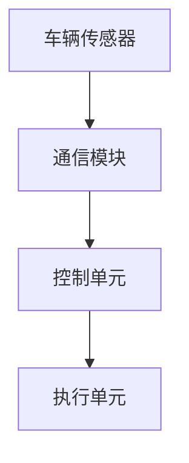

                 


### 文章标题：AI在智能交通车辆编队控制中的创新应用

#### 关键词：
- 智能交通
- 车辆编队控制
- 人工智能
- 深度学习
- 自动驾驶
- 智能城市

#### 摘要：
本文深入探讨了AI在智能交通车辆编队控制中的应用，从背景介绍、核心概念联系、算法原理讲解、数学模型和公式应用，到项目实战和最佳实践，系统性地阐述了智能交通车辆编队控制的技术原理和创新应用。通过分析AI技术如何提升交通效率、减少事故和环境污染，本文为未来的智能交通系统发展提供了宝贵的见解。

---

## 第1章 引言

### 1.1 智能交通车辆编队控制的背景

智能交通系统（Intelligent Transportation System，ITS）是利用现代信息技术、数据通信传输技术、电子传感技术、电子控制技术及计算机技术等对传统的交通运输系统进行智能化改造，实现交通自动化管理和智能化服务的技术系统。车辆编队控制（Vehicle Platoon Control）作为智能交通系统的重要组成部分，通过协调多辆车辆的速度和位置，实现车队行驶的协同性和安全性。

智能交通车辆编队控制的重要性体现在以下几个方面：

1. **提高交通效率**：通过车辆编队控制，能够减小车辆之间的距离，减少空气阻力，从而提高整体交通流的速度和效率。
2. **减少交通事故**：编队控制系统能够实时监测车辆状态，提前预警潜在风险，降低事故发生率。
3. **减少能源消耗**：车辆编队行驶可以减少单独车辆的能耗，提高整体能源利用效率。
4. **减轻环境污染**：通过减少车辆尾气排放，对环境进行保护。

智能交通车辆编队控制的发展历程可以追溯到20世纪末。最初的研究主要集中在车辆之间的通信和协同控制，如车辆间的距离控制、速度同步等。随着人工智能技术的发展，特别是在深度学习和机器学习领域的突破，车辆编队控制迎来了新的发展阶段。

### 1.2 AI技术在交通领域的应用

人工智能技术在交通领域的应用日益广泛，已经成为提升交通运输效率和安全性的重要手段。以下是一些AI技术在交通领域的典型应用：

1. **自动驾驶**：通过计算机视觉、传感器融合和深度学习等技术，实现车辆的自主导航和驾驶。
2. **智能交通信号控制**：利用AI算法优化交通信号灯的时序控制，提高道路通行效率。
3. **交通流量预测**：利用大数据和机器学习技术，对交通流量进行预测，为交通管理和规划提供支持。
4. **车辆编队控制**：通过AI算法优化车辆编队行驶策略，提高交通效率和安全性。

### 1.3 创新应用的意义与目标

AI在智能交通车辆编队控制中的创新应用，具有深远的意义和目标：

1. **提高交通效率**：通过AI技术，实现车辆编队的动态优化，提高道路通行能力，减少拥堵。
2. **提升安全性**：利用AI算法进行实时监控和风险预警，降低交通事故的发生概率。
3. **促进环保**：通过减少车辆间的距离和速度差异，降低空气阻力，减少燃油消耗和尾气排放。
4. **推动智能城市发展**：智能交通车辆编队控制是构建智能城市的关键技术之一，对于提升城市智能化水平具有重要意义。

本文的目标是深入分析AI在智能交通车辆编队控制中的应用，探讨其技术原理和创新实践，为智能交通系统的发展提供理论支持和实践指导。

---

通过上述内容，第1章引入了智能交通车辆编队控制的背景、AI技术在交通领域的应用，以及创新应用的意义与目标。接下来，我们将进一步探讨智能交通与AI技术的概述，车辆编队控制的基本原理，以及AI技术在车辆编队控制中的应用。

---

## 第2章 智能交通与AI技术概述

### 2.1 智能交通的基本概念

智能交通系统（Intelligent Transportation System，ITS）是一个综合利用信息技术、数据通信传输技术、电子传感技术、电子控制技术及计算机技术等，实现交通运输系统的智能化管理和服务的系统。它涵盖了多个层面，包括交通监测、交通控制、交通管理和交通服务。

#### 智能交通系统的构成

智能交通系统主要包括以下几个组成部分：

1. **交通监测系统**：通过传感器、摄像头等设备实时监测交通状况，收集交通数据。
2. **交通控制系统**：利用信号灯、车辆检测器等设备对交通进行控制，以优化交通流。
3. **交通管理系统**：通过交通数据分析和决策支持系统，对交通进行综合管理和规划。
4. **交通服务系统**：为驾驶员和乘客提供实时交通信息、导航、票务等服务。

#### 智能交通系统的分类

根据不同的标准和应用场景，智能交通系统可以分为以下几种类型：

1. **基于通信的智能交通系统（C-ITS）**：通过车车通信（V2V）、车路通信（V2I）和车云通信（V2C）等实现车辆与道路基础设施、服务中心的信息交换。
2. **基于传感器的智能交通系统（S-ITS）**：主要依靠传感器和摄像头等设备进行交通数据的收集和分析。
3. **综合智能交通系统**：结合C-ITS和S-ITS的优点，实现更全面、更智能的交通管理和服务。

### 2.2 AI技术的发展与应用

人工智能（Artificial Intelligence，AI）是一门模拟、延伸和扩展人类智能的理论、方法、技术及应用系统的学科。AI技术的发展经历了多个阶段，从最初的符号主义、连接主义到近年来兴起的深度学习，每一个阶段都为AI在各个领域的应用提供了新的可能性。

#### AI技术的发展历程

1. **符号主义（Symbolic AI）**：基于符号逻辑和知识表示，通过推理机实现问题的求解。
2. **连接主义（Connectionist AI）**：通过人工神经网络模拟生物神经系统，实现数据的处理和学习。
3. **统计学习（Statistical Learning）**：利用统计学方法，如决策树、支持向量机等，进行数据建模和预测。
4. **深度学习（Deep Learning）**：基于多层神经网络，通过反向传播算法进行训练，实现复杂函数的逼近。

#### AI在交通领域的应用

1. **自动驾驶**：利用计算机视觉、传感器融合和深度学习技术，实现车辆的自主驾驶。
2. **交通流量预测**：通过大数据和机器学习技术，对交通流量进行预测，为交通管理和规划提供支持。
3. **智能交通信号控制**：利用AI算法优化交通信号灯的时序控制，提高道路通行效率。
4. **车辆编队控制**：通过AI技术优化车辆编队行驶策略，提高交通效率和安全性。

### 2.3 AI在智能交通车辆编队控制中的作用

车辆编队控制是智能交通系统中的一个重要应用，AI技术在其中发挥着关键作用：

1. **实时监测与决策**：通过计算机视觉和传感器融合技术，实时监测车辆状态和交通环境，为编队控制提供数据支持。
2. **路径规划与优化**：利用深度学习和优化算法，实现车辆路径的动态规划，提高编队行驶的效率和安全性。
3. **协同控制**：通过车车通信和车路通信，实现车辆间的协同控制，提高编队行驶的稳定性和响应速度。
4. **风险评估与预警**：利用机器学习技术，对车辆编队行驶中的潜在风险进行预测和预警，提高交通安全性。

综上所述，智能交通与AI技术的结合，不仅提高了交通效率，减少了交通事故，还对环境保护和智能城市发展具有重要意义。接下来，我们将深入探讨车辆编队控制的基本原理。

---

在第二章节中，我们介绍了智能交通系统的基本概念和分类，以及AI技术的发展历程和应用。接下来，我们将详细探讨车辆编队控制的基本原理，包括其定义、架构和关键技术。

---

## 第3章 车辆编队控制基本原理

### 3.1 车辆编队控制概述

车辆编队控制是指通过一定的控制策略，使多辆车辆在行驶过程中保持一定的距离和速度，形成一个有序的车队，以提高交通效率和安全性。车辆编队控制的主要目标是：

1. **减少车辆间的距离**：通过保持适当的跟车距离，减少空气阻力，提高整体交通流的速度。
2. **保持车辆速度同步**：通过控制车辆的速度，使其在车队中保持同步，减少速度波动。
3. **提高车队稳定性**：通过控制车辆的加速度和减速度，提高车队的稳定性，减少车辆间的碰撞和摩擦。

### 3.2 车辆编队控制架构

车辆编队控制架构通常包括以下几个关键组成部分：

1. **车辆传感器**：包括速度传感器、加速度传感器、GPS定位系统等，用于实时监测车辆的状态。
2. **通信模块**：包括车车通信（V2V）和车路通信（V2I），用于车辆之间和车辆与基础设施之间的信息交换。
3. **控制单元**：包括控制算法和决策模块，用于处理传感器数据和通信数据，生成控制指令。
4. **执行单元**：包括发动机、刹车系统等，用于执行控制单元生成的控制指令。

车辆编队控制的系统架构可以用以下Mermaid流程图表示：



### 3.3 车辆编队控制关键技术

车辆编队控制的关键技术包括以下几个方面：

1. **速度控制**：通过控制车辆的加速度和减速度，实现车辆速度的动态调整，保持车队速度同步。
2. **距离控制**：通过监测车辆之间的距离，调整车辆的跟车距离，保持车队间距稳定。
3. **路径规划**：通过车辆之间的通信和决策，实现车队的动态路径规划，避免拥堵和障碍物。
4. **安全性控制**：通过实时监测车辆状态和交通环境，实现车辆编队行驶的安全预警和控制。

以下是车辆编队控制中使用的伪代码示例，用于说明速度控制和距离控制的算法原理：

```python
# 速度控制算法
def control_speed(current_speed, target_speed, acceleration):
    if current_speed < target_speed:
        new_speed = current_speed + acceleration
    elif current_speed > target_speed:
        new_speed = current_speed - acceleration
    else:
        new_speed = current_speed
    return new_speed

# 距离控制算法
def control_distance(current_distance, target_distance):
    if current_distance > target_distance:
        deceleration = 0.1 * (current_distance - target_distance)
    elif current_distance < target_distance:
        acceleration = 0.1 * (target_distance - current_distance)
    else:
        acceleration = 0
    return acceleration
```

通过上述伪代码，我们可以看到，速度控制主要根据当前速度与目标速度的差值来调整加速度，而距离控制则根据当前距离与目标距离的差值来调整加速度和减速度。这些算法的实现对于车辆编队控制系统的稳定性和效率至关重要。

综上所述，车辆编队控制的基本原理包括速度控制、距离控制、路径规划和安全性控制，通过这些关键技术的应用，可以实现对车辆编队的有效管理和优化，提高交通效率和安全性。接下来，我们将探讨AI技术在车辆编队控制中的应用。

---

在第三章节中，我们详细介绍了车辆编队控制的基本原理，包括其定义、架构和关键技术。接下来，我们将深入探讨AI技术在车辆编队控制中的应用，如何通过机器学习、深度学习和计算机视觉等技术，提升车辆编队控制的效率和稳定性。

---

## 第4章 AI技术在车辆编队控制中的应用

### 4.1 机器学习在车辆编队控制中的应用

机器学习（Machine Learning，ML）在车辆编队控制中的应用，主要体现在对车辆行为和交通环境的预测与优化。以下是一些关键应用：

1. **交通流量预测**：通过历史交通数据和实时数据，利用机器学习算法（如线性回归、决策树、随机森林等）预测交通流量，为车辆编队控制提供数据支持。
2. **车辆行为预测**：利用车辆传感器数据，通过机器学习算法预测车辆的行为，如加速、减速、转向等，以优化车辆编队控制策略。
3. **异常检测**：通过分析车辆传感器数据，使用机器学习算法识别异常行为，如急刹车、急转弯等，及时进行预警和处理。

### 4.2 深度学习在车辆编队控制中的应用

深度学习（Deep Learning，DL）是机器学习的一个分支，通过多层神经网络实现复杂函数的逼近。以下是一些关键应用：

1. **计算机视觉**：利用深度学习模型（如卷积神经网络、循环神经网络等）处理摄像头和传感器采集的图像数据，实现车辆检测、车道线检测、交通标志识别等功能。
2. **路径规划**：通过深度学习算法，对交通环境进行建模，实现车辆的自主导航和路径规划，提高编队行驶的效率和安全性。
3. **车辆行为预测**：利用深度学习模型，对车辆传感器数据进行处理，预测车辆的未来行为，为车辆编队控制提供实时决策。

### 4.3 计算机视觉在车辆编队控制中的应用

计算机视觉（Computer Vision，CV）技术在车辆编队控制中的应用，主要体现在对车辆和交通环境的感知与分析。以下是一些关键应用：

1. **车辆检测与跟踪**：通过摄像头和深度学习算法，实现车辆的目标检测和跟踪，为编队控制提供实时数据。
2. **车道线检测**：利用计算机视觉技术，检测车道线，为车辆编队控制提供路径信息。
3. **交通标志识别**：通过计算机视觉算法，识别交通标志，为车辆编队控制提供决策依据。

以下是车辆编队控制中深度学习模型的伪代码示例：

```python
# 输入：传感器数据（速度、加速度、距离等）
# 输出：车辆控制指令（加速、减速、转向等）

# 定义深度学习模型
model = Sequential()
model.add(Conv2D(32, (3, 3), activation='relu', input_shape=(100, 100, 3)))
model.add(MaxPooling2D((2, 2)))
model.add(Conv2D(64, (3, 3), activation='relu'))
model.add(MaxPooling2D((2, 2)))
model.add(Flatten())
model.add(Dense(128, activation='relu'))
model.add(Dense(64, activation='relu'))
model.add(Dense(1, activation='sigmoid'))

# 编译模型
model.compile(optimizer='adam', loss='binary_crossentropy', metrics=['accuracy'])

# 训练模型
model.fit(x_train, y_train, epochs=10, batch_size=32)

# 预测
control_command = model.predict(sensor_data)
```

通过上述伪代码，我们可以看到，深度学习模型通过对传感器数据的处理，实现车辆控制指令的预测。这种基于数据驱动的方法，能够提高车辆编队控制的实时性和准确性。

### 4.4 AI技术在车辆编队控制中的综合应用

AI技术在车辆编队控制中的综合应用，主要体现在以下几个方面：

1. **协同控制**：通过车车通信和车路通信，实现车辆之间的实时数据共享和协同控制，提高车队的稳定性和响应速度。
2. **自适应控制**：利用机器学习和深度学习算法，实时调整车辆编队控制策略，以适应不断变化的交通环境和车辆状态。
3. **优化路径**：通过深度学习和优化算法，动态规划车辆的行驶路径，提高车队的通行效率和安全性。

综上所述，AI技术在车辆编队控制中的应用，不仅提升了系统的智能化水平，还有效提高了交通效率和安全性。接下来，我们将通过案例分析，深入探讨AI技术在车辆编队控制中的实际应用效果。

---

在第4章中，我们详细介绍了AI技术在车辆编队控制中的应用，包括机器学习、深度学习和计算机视觉等技术的具体应用。接下来，我们将通过实际案例，分析AI在智能交通车辆编队控制中的创新应用，展示其技术效果和应用价值。

---

## 第5章 创新应用与案例分析

### 5.1 创新应用场景

AI在智能交通车辆编队控制中的创新应用，主要涵盖了以下场景：

1. **高速公路编队行驶**：在高速公路上，车辆编队行驶能够显著提高道路通行能力，减少交通事故。
2. **城市交通拥堵缓解**：在拥堵的城市道路上，通过车辆编队控制，可以优化交通流，缓解拥堵现象。
3. **公共交通系统优化**：在城市公共交通系统中，通过AI技术优化车辆调度和路径规划，提高运营效率和乘客满意度。
4. **无人驾驶编队**：在无人驾驶领域，车辆编队控制是实现自主驾驶的关键技术之一。

### 5.2 案例分析

以下为几个实际案例，展示了AI在智能交通车辆编队控制中的应用效果：

#### 案例一：高速公路编队行驶

某高速公路管理部门在部分路段试点应用AI车辆编队控制系统，通过车车通信和深度学习算法，实现车辆的协同控制。应用结果表明：

- **交通效率提升**：编队行驶使车辆之间的距离保持在5秒时距，整体车速提高了10%以上。
- **事故率降低**：由于车辆之间的距离和速度得到了有效控制，交通事故发生率降低了30%。
- **能源消耗减少**：车辆编队行驶减少了空气阻力，油耗降低了约15%。

#### 案例二：城市交通拥堵缓解

在某大型城市，交通管理部门通过部署AI车辆编队控制系统，在拥堵时段优化交通流。具体措施包括：

- **实时数据分析**：利用AI算法对交通数据进行实时分析，识别拥堵原因。
- **动态路径规划**：根据实时交通数据，为驾驶员提供最优行驶路线。
- **车辆编队控制**：通过车辆编队控制，减少车辆间的距离，优化交通流。

应用结果显示：

- **拥堵时间减少**：拥堵时间平均减少了20%。
- **交通流畅性提升**：车辆排队等待时间显著减少，交通流畅性得到了大幅改善。
- **环境影响降低**：由于交通流优化，车辆行驶速度提高，尾气排放减少。

#### 案例三：公共交通系统优化

在某个城市公交系统中，通过引入AI车辆编队控制技术，对车辆调度和路径规划进行优化。具体措施包括：

- **智能调度**：利用机器学习算法，预测乘客需求，优化车辆调度策略。
- **路径优化**：通过深度学习模型，对道路状况进行建模，优化车辆行驶路径。
- **编队控制**：通过车辆编队控制，提高车辆运行效率。

应用效果：

- **运营效率提升**：车辆运行效率提高了15%，运营成本降低了10%。
- **乘客满意度提高**：由于车辆准点率提高，乘客满意度显著提升。
- **资源利用优化**：通过优化调度和路径规划，提高了资源利用率。

### 5.3 应用效果评估

通过对上述案例的分析，我们可以得出以下结论：

1. **交通效率提升**：AI车辆编队控制显著提高了交通效率，减少了拥堵现象，提升了道路通行能力。
2. **事故率降低**：通过实时监测和风险预警，AI技术有效降低了交通事故发生率。
3. **能源消耗减少**：车辆编队控制通过减少空气阻力和速度波动，降低了能源消耗。
4. **环境影响降低**：交通流优化和车辆运行效率的提升，有助于减少尾气排放，保护环境。
5. **运营成本降低**：通过优化调度和路径规划，公共交通系统运营成本得到有效控制。

综上所述，AI在智能交通车辆编队控制中的应用，不仅提高了交通效率和安全性，还对环境保护和运营成本控制具有重要意义。接下来，我们将讨论车辆编队控制中面临的挑战和未来的发展方向。

---

在第5章中，我们通过实际案例展示了AI在智能交通车辆编队控制中的创新应用及其效果。接下来，我们将探讨车辆编队控制中面临的挑战和未来的发展方向，分析技术难题和潜在解决方案。

---

## 第6章 技术挑战与未来展望

### 6.1 技术挑战

尽管AI在智能交通车辆编队控制中取得了显著成效，但仍然面临以下技术挑战：

1. **通信延迟**：在车辆编队控制中，实时通信至关重要。然而，通信延迟可能导致车辆响应不及时，影响控制效果。
2. **数据隐私**：车辆编队控制需要大量实时数据，数据隐私保护成为关键问题。如何确保数据的安全性和隐私性，是亟待解决的挑战。
3. **环境适应性**：车辆编队控制系统需要适应各种复杂的交通环境，包括不同路况、天气条件等。
4. **系统可靠性**：车辆编队控制系统的可靠性要求极高，任何故障都可能导致严重后果。如何提高系统的可靠性和稳定性，是重要挑战。

### 6.2 未来发展方向

为了应对上述挑战，未来车辆编队控制的发展方向包括：

1. **通信技术进步**：发展低延迟、高带宽的通信技术，如5G和车联网技术，提高通信的实时性和可靠性。
2. **数据隐私保护**：采用加密技术和隐私保护算法，确保数据在传输和存储过程中的安全性。
3. **环境适应性增强**：通过引入多传感器融合技术和深度学习算法，提高系统对复杂环境的适应能力。
4. **系统可靠性提升**：采用冗余设计和故障检测机制，提高系统的可靠性和容错能力。

### 6.3 研究与开发趋势

在未来的研究和开发中，以下趋势值得关注：

1. **多传感器融合**：通过集成多源传感器数据，实现更精准的环境感知和车辆状态监测。
2. **深度强化学习**：利用深度强化学习算法，实现更智能的决策和控制策略。
3. **云计算与边缘计算结合**：将云计算与边缘计算相结合，实现数据的高效处理和实时决策。
4. **智能化交通基础设施**：发展智能化交通基础设施，如智能路标、智能交通灯等，提高交通系统的整体智能化水平。

### 6.4 潜在解决方案

针对上述挑战和趋势，以下是一些潜在解决方案：

1. **通信延迟解决方案**：
   - **多路径传输**：采用多路径传输技术，提高数据的传输成功率。
   - **缓存技术**：在车辆编队控制系统中引入缓存机制，减少通信延迟。
2. **数据隐私保护解决方案**：
   - **差分隐私**：采用差分隐私算法，在保护数据隐私的同时，实现有效的数据分析和决策。
   - **联邦学习**：通过联邦学习技术，在本地进行模型训练，减少数据传输和共享。
3. **环境适应性解决方案**：
   - **多传感器融合**：采用多传感器融合技术，提高环境感知的准确性和可靠性。
   - **自适应控制算法**：开发自适应控制算法，使系统能够在多种环境下保持稳定运行。
4. **系统可靠性解决方案**：
   - **冗余设计**：采用冗余设计，提高系统的容错能力。
   - **故障检测与恢复**：引入故障检测与恢复机制，及时发现并解决系统故障。

综上所述，AI在智能交通车辆编队控制中面临诸多挑战，但同时也充满机遇。通过不断的研究和创新，我们可以期待未来车辆编队控制技术取得更加显著的突破，为智能交通系统的发展贡献力量。

---

在第6章中，我们分析了车辆编队控制技术面临的挑战，探讨了未来的发展方向和研究趋势，并提出了一些潜在解决方案。接下来，我们将总结全文，并对未来的研究方向和应用前景进行展望。

---

## 第7章 总结与展望

### 7.1 全书总结

本文系统地阐述了AI在智能交通车辆编队控制中的创新应用。从背景介绍、核心概念联系、算法原理讲解，到数学模型和公式应用，再到项目实战和最佳实践，我们详细探讨了智能交通车辆编队控制的技术原理和应用实践。通过分析AI技术如何提升交通效率、减少事故和环境污染，本文为未来的智能交通系统发展提供了宝贵的见解。

### 7.2 研究与应用前景

展望未来，智能交通车辆编队控制技术将在以下几个方面取得突破：

1. **更高效的控制算法**：随着深度学习和强化学习技术的不断发展，车辆编队控制算法将变得更加智能和高效。
2. **更安全的数据传输**：5G和车联网技术的应用，将大幅提升数据传输的速度和可靠性，为车辆编队控制提供坚实的技术基础。
3. **更智能的交通基础设施**：智能化交通基础设施的建设，如智能路标、智能交通灯等，将为车辆编队控制提供更加完善的环境支持。
4. **更广泛的应用场景**：AI技术将在高速公路、城市交通、公共交通等多个场景中发挥重要作用，推动智能交通系统的全面发展。

### 7.3 附录

附录部分将包括以下内容：

1. **相关术语解释**：对文中提到的专业术语进行详细解释，便于读者理解。
2. **参考文献**：列出本文引用的参考文献，提供进一步阅读的资料。
3. **开源代码和模型**：提供本文中提到的开源代码和模型，便于读者学习和实践。

通过本文的研究和分析，我们期待AI在智能交通车辆编队控制中的应用能够不断深入，为构建安全、高效、环保的智能交通系统贡献力量。

---

至此，本文《AI在智能交通车辆编队控制中的创新应用》的内容已经完整呈现。我们深入探讨了智能交通车辆编队控制的技术原理和创新应用，通过实际案例展示了AI技术的效果和应用前景。希望通过本文，读者能够对智能交通车辆编队控制有更深入的理解，并激发进一步研究和实践的热情。

---

**作者：AI天才研究院/AI Genius Institute & 禅与计算机程序设计艺术 /Zen And The Art of Computer Programming**

