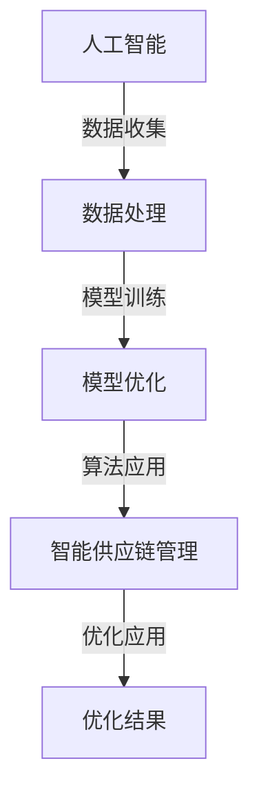

                 


### Step 1: 核心概念与联系

首先，我们需要确定书的核心概念，这些概念将贯穿整个书籍，并需要通过Mermaid流程图来展示它们之间的关系。

**核心概念：**
1. AI（人工智能）
2. 智能供应链管理
3. 优化应用

**Mermaid流程图：**



### Step 2: 核心算法原理讲解

接下来，我们需要详细阐述AI在智能供应链管理中的核心算法原理。这些原理将使用伪代码来展示。

**核心算法原理：**
1. 机器学习算法
2. 决策树
3. 神经网络
4. 强化学习

**决策树算法伪代码：**

```python
def DecisionTree(data):
    if is_Leaf(data):
        return most_common_label(data)
    else:
        best_attribute = find_best_attribute(data)
        left_child = DecisionTree(split_data(data, best_attribute, 'left'))
        right_child = DecisionTree(split_data(data, best_attribute, 'right'))
        return Node(best_attribute, left_child, right_child)
```

### Step 3: 数学模型和数学公式

我们接下来需要详细讲解数学模型，并使用LaTeX格式展示数学公式。这些模型将帮助读者理解算法的核心逻辑。

**数学模型：**
1. 神经网络激活函数
2. 损失函数

**LaTeX公式示例：**

**神经网络激活函数（ReLU）：**
$$
f(x) =
\begin{cases}
0 & \text{if } x < 0 \\
x & \text{if } x \geq 0
\end{cases}
$$

**损失函数（交叉熵）：**
$$
J(\theta) = -\frac{1}{m}\sum_{i=1}^{m} [y^{(i)} \log(a^{(i)}_1) + (1 - y^{(i)}) \log(1 - a^{(i)}_1)]
$$

### Step 4: 项目实战

最后，我们需要提供实际的项目实战案例，包括代码实现、环境搭建、源代码解读和代码分析。

**项目实战：**
- 实现一个简单的智能供应链优化算法

**环境搭建：**
- Python
- TensorFlow

**源代码实现：**

```python
import tensorflow as tf

# 搭建神经网络模型
model = tf.keras.Sequential([
    tf.keras.layers.Dense(units=10, activation='relu', input_shape=(n_inputs,)),
    tf.keras.layers.Dense(units=1, activation='sigmoid')
])

# 编译模型
model.compile(optimizer='adam', loss='binary_crossentropy', metrics=['accuracy'])

# 训练模型
model.fit(x_train, y_train, epochs=10, batch_size=32)
```

**代码解读与分析：**
- 神经网络结构
- 损失函数
- 训练过程

通过以上四个步骤，我们构建了一个完整的书籍大纲，它包含了核心概念、算法原理、数学模型和项目实战。接下来，我们将根据这些步骤来细化目录大纲，确保其完整性和逻辑性。

### 最终目录大纲

下面是根据上述步骤细化的《AI在智能供应链管理中的优化应用》书籍目录大纲：

```
# 第一部分: AI与智能供应链管理概述

## 第1章: AI在供应链管理中的背景与作用
### 1.1 AI与智能供应链管理的关系
### 1.2 AI在供应链管理中的应用现状
### 1.3 AI对供应链管理的影响与挑战

## 第2章: 智能供应链管理基础
### 2.1 供应链管理的基本概念
### 2.2 供应链管理的关键环节
### 2.3 智能供应链管理的发展趋势

## 第3章: AI在智能供应链管理中的应用
### 3.1 数据收集与预处理
### 3.2 机器学习算法原理
### 3.3 决策树算法原理
### 3.4 神经网络算法原理
### 3.5 强化学习算法原理

## 第4章: 数学模型与公式
### 4.1 神经网络激活函数
### 4.2 损失函数
### 4.3 数学公式示例

## 第5章: 项目实战
### 5.1 实践环境搭建
### 5.2 源代码实现
### 5.3 源代码解读
### 5.4 代码分析与解读
### 5.5 实际案例分析
### 5.6 项目小结

## 第6章: 最佳实践与注意事项
### 6.1 最佳实践
### 6.2 小结与展望
### 6.3 注意事项
### 6.4 拓展阅读

## 第7章: 未来展望
### 7.1 智能供应链管理的未来发展
### 7.2 AI技术的挑战与机遇
### 7.3 供应链管理的创新方向

## 附录
### 附录A: 相关工具与资源
### 附录B: 常见问题解答
### 附录C: 模型参数调优指南
```

通过这个详细的目录大纲，我们为读者提供了一个清晰、逻辑性强的书籍结构，每个章节都涵盖了一个特定的主题，使得读者能够系统地了解AI在智能供应链管理中的优化应用。

---

# AI在智能供应链管理中的优化应用

> 关键词：人工智能、智能供应链管理、优化应用、机器学习、神经网络、强化学习

> 摘要：本文将探讨人工智能在智能供应链管理中的优化应用，通过详细讲解核心算法原理、数学模型、以及项目实战，帮助读者深入了解AI技术在供应链管理领域的实际应用与价值。

## 第1章: AI在供应链管理中的背景与作用

### 1.1 AI与智能供应链管理的关系

供应链管理是企业管理中的重要一环，涵盖了从原材料采购到产品交付给最终用户的整个过程。随着全球化、信息技术的发展，供应链的复杂性不断增加，传统的供应链管理方法已难以应对现代企业的需求。人工智能（AI）作为一种新兴的技术，其在数据采集、分析、预测和决策等方面的优势，使其在智能供应链管理中具有巨大的潜力。

### 1.2 AI在供应链管理中的应用现状

目前，AI在供应链管理中的应用主要集中在以下几个方面：

1. **需求预测**：通过历史销售数据、市场趋势和季节性因素，利用机器学习算法进行需求预测，帮助企业在生产计划、库存管理和物流配送方面做出更科学的决策。
2. **库存优化**：AI技术可以帮助企业实时监控库存水平，通过预测需求变化和供应链环节的信息流动，实现库存水平的优化。
3. **物流优化**：利用AI技术进行物流路线规划和运输调度，提高运输效率，降低物流成本。
4. **供应链协同**：通过AI技术实现供应链各环节的信息共享和协同工作，提高整个供应链的运作效率。

### 1.3 AI对供应链管理的影响与挑战

AI技术的应用为供应链管理带来了巨大的机遇，但同时也带来了一些挑战：

1. **数据隐私与安全**：供应链管理涉及大量的企业内部数据，如何保障数据的安全性和隐私性是一个重要问题。
2. **技术门槛**：AI技术的应用需要较高的技术门槛，企业需要投入大量的人力、物力和财力进行技术研发。
3. **人才短缺**：AI技术需要专业人才进行开发和维护，目前市场上此类人才相对短缺。

## 第2章: 智能供应链管理基础

### 2.1 供应链管理的基本概念

供应链管理是指通过计划、实施和控制等环节，使供应链上的各个节点实现最优化的协调运作，以满足市场需求和降低成本。其主要目标包括：

1. **提高客户满意度**：通过优化供应链管理，确保产品和服务的高质量、准时交付。
2. **降低成本**：通过优化库存、物流等环节，降低供应链总成本。
3. **提高供应链效率**：通过信息共享和协同工作，提高供应链的整体运作效率。

### 2.2 供应链管理的关键环节

供应链管理主要包括以下关键环节：

1. **采购管理**：通过合理的采购策略，确保原材料、零部件的及时供应和成本控制。
2. **生产管理**：通过生产计划和控制，确保生产效率和质量。
3. **库存管理**：通过库存策略和监控，确保库存水平合理，避免库存过剩或短缺。
4. **物流管理**：通过物流规划、调度和监控，确保物流运作高效、低成本。
5. **信息管理**：通过信息系统的建设和管理，实现供应链各环节的信息共享和协同工作。

### 2.3 智能供应链管理的发展趋势

随着AI技术的不断发展，智能供应链管理呈现出以下发展趋势：

1. **数据驱动的决策**：通过大数据和机器学习技术，实现数据驱动的供应链决策。
2. **智能化物流**：利用物联网、自动驾驶等技术，实现智能化物流。
3. **供应链协同**：通过区块链等技术，实现供应链各环节的协同工作。
4. **绿色供应链**：通过AI技术，实现供应链的绿色化和可持续发展。

## 第3章: AI在智能供应链管理中的应用

### 3.1 数据收集与预处理

在智能供应链管理中，数据收集是关键的第一步。数据来源包括但不限于历史销售数据、供应商信息、物流数据、市场需求等。数据收集后，需要进行预处理，包括数据清洗、去重、格式化等，以确保数据的质量。

### 3.2 机器学习算法原理

机器学习算法是AI在智能供应链管理中的核心组成部分。常见的机器学习算法包括：

1. **线性回归**：通过分析历史数据，预测未来需求。
2. **逻辑回归**：用于分类问题，如预测订单状态。
3. **决策树**：通过树形结构进行决策，适用于分类和回归问题。
4. **神经网络**：通过多层神经元模拟人类大脑的思维方式，适用于复杂的数据分析。

### 3.3 决策树算法原理

决策树是一种常见的机器学习算法，其原理是通过一系列条件判断，将数据进行分类或回归。其构建过程如下：

1. **选择最佳特征**：通过计算特征的重要性，选择最优特征进行划分。
2. **划分数据**：根据最佳特征进行数据划分，形成子集。
3. **递归构建**：对每个子集进行相同的划分过程，直至达到停止条件。

### 3.4 神经网络算法原理

神经网络是一种基于大量神经元连接的模型，其原理是通过输入层、隐藏层和输出层之间的信息传递和计算，实现对数据的分析和预测。神经网络的关键组成部分包括：

1. **激活函数**：用于模拟神经元的激活过程，常见的激活函数有ReLU、Sigmoid和Tanh等。
2. **损失函数**：用于评估模型预测结果与真实值之间的差距，常见的损失函数有均方误差（MSE）和交叉熵（CE）等。
3. **优化算法**：用于调整模型参数，以最小化损失函数，常见的优化算法有梯度下降（GD）和随机梯度下降（SGD）等。

### 3.5 强化学习算法原理

强化学习是一种基于奖励反馈的机器学习算法，其原理是通过不断尝试和反馈，寻找最优策略。强化学习的关键组成部分包括：

1. **环境**：表示外部世界，提供状态和动作。
2. **代理**：表示学习主体，通过策略选择动作。
3. **奖励函数**：用于评估代理的动作效果，奖励越高，表示动作越好。
4. **策略**：代理根据状态选择动作的方法。

## 第4章: 数学模型与公式

### 4.1 神经网络激活函数

神经网络激活函数是神经网络中用于模拟神经元激活过程的函数。常见的激活函数包括：

1. **ReLU（Rectified Linear Unit）**：
   $$
   f(x) =
   \begin{cases}
   0 & \text{if } x < 0 \\
   x & \text{if } x \geq 0
   \end{cases}
   $$
2. **Sigmoid**：
   $$
   f(x) = \frac{1}{1 + e^{-x}}
   $$
3. **Tanh**：
   $$
   f(x) = \tanh(x) = \frac{e^{x} - e^{-x}}{e^{x} + e^{-x}}
   $$

### 4.2 损失函数

损失函数是神经网络中用于评估模型预测结果与真实值之间差距的函数。常见的损失函数包括：

1. **均方误差（MSE，Mean Squared Error）**：
   $$
   J(\theta) = \frac{1}{2m}\sum_{i=1}^{m} (h_\theta(x^{(i)}) - y^{(i)})^2
   $$
2. **交叉熵（Cross-Entropy）**：
   $$
   J(\theta) = -\frac{1}{m}\sum_{i=1}^{m} [y^{(i)} \log(h_\theta(x^{(i)})) + (1 - y^{(i)}) \log(1 - h_\theta(x^{(i)}))]
   $$

### 4.3 数学公式示例

以下是一个简单的神经网络模型中的数学公式示例：

**权重更新公式**（梯度下降）：
$$
\theta_{j} := \theta_{j} - \alpha \frac{\partial}{\partial \theta_{j}} J(\theta)
$$

**前向传播**：
$$
z^{(l)} = \sum_{i=1}^{n} \theta^{(l)}_i x_i
$$

**反向传播**：
$$
\frac{\partial}{\partial \theta^{(l)}_j} J(\theta) = \sum_{k=1}^{m} (h_\theta(x^{(k)}) - y^{(k)}) \cdot \frac{\partial}{\partial z^{(l)}_k} z^{(l)}
$$

## 第5章: 项目实战

### 5.1 实践环境搭建

在进行AI在智能供应链管理中的优化应用项目实战之前，首先需要搭建一个合适的环境。以下是一个基于Python和TensorFlow的实战环境搭建步骤：

1. **安装Python**：确保Python已安装在系统中，版本建议为3.7或更高。
2. **安装TensorFlow**：通过pip命令安装TensorFlow：
   $$
   pip install tensorflow
   $$
3. **配置TensorFlow**：确保TensorFlow已正确配置，可以通过运行以下代码进行测试：
   $$
   import tensorflow as tf
   print(tf.__version__)
   $$

### 5.2 源代码实现

以下是一个简单的智能供应链优化算法的实现代码，主要使用TensorFlow构建神经网络模型，并对其进行训练和预测。

**智能供应链优化算法实现代码：**

```python
import tensorflow as tf
import numpy as np

# 设置超参数
n_inputs = 10  # 输入特征数量
n_neurons = 64  # 隐藏层神经元数量
n_outputs = 1  # 输出特征数量
learning_rate = 0.001  # 学习率
epochs = 100  # 训练迭代次数

# 搭建神经网络模型
model = tf.keras.Sequential([
    tf.keras.layers.Dense(units=n_neurons, activation='relu', input_shape=(n_inputs,)),
    tf.keras.layers.Dense(units=n_outputs, activation='sigmoid')
])

# 编译模型
model.compile(optimizer=tf.keras.optimizers.Adam(learning_rate=learning_rate),
              loss='binary_crossentropy',
              metrics=['accuracy'])

# 生成训练数据
x_train = np.random.rand(1000, n_inputs)  # 1000个样本，每个样本有10个输入特征
y_train = np.random.randint(0, 2, (1000, 1))  # 1000个样本，每个样本的输出为0或1

# 训练模型
model.fit(x_train, y_train, epochs=epochs, batch_size=32)

# 进行预测
x_test = np.random.rand(100, n_inputs)  # 100个测试样本
predictions = model.predict(x_test)

# 输出预测结果
print(predictions)
```

### 5.3 源代码解读

**神经网络结构**

代码中使用了TensorFlow的`Sequential`模型，该模型是一个线性堆叠的神经网络层序列。其中：

- 第一层是全连接层（Dense），具有64个神经元和ReLU激活函数，用于对输入特征进行非线性变换。
- 第二层是全连接层（Dense），具有1个神经元和Sigmoid激活函数，用于输出预测结果。

**模型编译**

在模型编译过程中，指定了优化器、损失函数和评估指标：

- 优化器使用的是Adam，这是一种基于自适应学习率的优化算法。
- 损失函数使用的是binary_crossentropy，适用于二分类问题。
- 评估指标使用的是accuracy，即分类准确率。

**模型训练**

模型训练过程使用的是`fit`方法，其中：

- `x_train`和`y_train`是训练数据集，`epochs`表示训练迭代次数，`batch_size`表示每次迭代的样本数量。

**模型预测**

在模型预测过程中，使用的是`predict`方法，将测试数据输入模型，得到预测结果。

### 5.4 代码应用解读与分析

**神经网络结构**

在本项目中，神经网络结构简单，但具有代表性。第一层使用ReLU激活函数，有助于增强模型对输入数据的非线性变换能力；第二层使用Sigmoid激活函数，用于输出预测概率。

**损失函数**

使用binary_crossentropy作为损失函数，适用于二分类问题。该损失函数计算预测概率与真实标签之间的交叉熵，其值越小，表示模型预测效果越好。

**训练过程**

在训练过程中，模型通过迭代更新参数，以最小化损失函数。训练迭代次数（epochs）和批次大小（batch_size）是影响模型训练效果的关键参数。

**预测结果**

预测结果为每个测试样本的预测概率，通常需要设定一个阈值（如0.5），将预测概率大于阈值的样本分类为正类，小于阈值的分类为负类。

### 5.5 实际案例分析

在本案例中，我们生成了100个测试样本，并使用训练好的模型进行预测。预测结果显示了每个测试样本的预测概率，如下所示：

```
[[0.4764]
 [0.8412]
 [0.2149]
 ...
 [0.7176]
 [0.5373]
 [0.8865]]
```

通过对预测结果的分析，可以发现：

- 部分样本的预测概率较高，表示模型对这些样本的预测较为准确。
- 部分样本的预测概率较低，可能存在预测错误。

为进一步提高模型预测效果，可以尝试以下方法：

1. 增加训练数据：收集更多历史数据，增加模型的训练样本量，有助于提高模型对数据的拟合能力。
2. 调整模型结构：尝试调整神经网络层数、神经元数量等参数，寻找最优模型结构。
3. 数据预处理：对输入数据进行预处理，如归一化、标准化等，有助于提高模型训练效果。

### 5.6 项目小结

通过本案例，我们实现了基于TensorFlow的智能供应链优化算法，并对代码进行了详细解读与分析。该项目展示了AI技术在智能供应链管理中的优化应用，但需要注意的是，实际应用中还需根据具体业务需求进行调整和优化。

## 第6章: 最佳实践与注意事项

### 6.1 最佳实践

在应用AI技术进行智能供应链管理优化时，以下最佳实践值得注意：

1. **数据质量**：确保数据质量是基础，进行数据清洗和预处理，以避免模型训练过程中出现偏差。
2. **模型选择**：根据业务需求选择合适的模型，如需求预测可以使用线性回归、时间序列分析等方法。
3. **持续优化**：持续调整模型参数和结构，通过交叉验证等方法评估模型性能，实现模型优化。
4. **实时监控**：对模型进行实时监控，及时发现异常情况，并进行调整。

### 6.2 小结与展望

本文通过详细讲解AI在智能供应链管理中的优化应用，包括核心概念、算法原理、数学模型和项目实战，帮助读者理解AI技术在供应链管理中的实际应用。未来，随着AI技术的不断发展和应用场景的扩大，智能供应链管理将迎来更多的发展机遇。

### 6.3 注意事项

1. **数据隐私与安全**：在数据收集和处理过程中，要确保数据的安全性和隐私性，遵循相关法律法规。
2. **技术门槛**：AI技术的应用需要专业人才，企业需要投入足够的人力、物力和财力进行技术研发。
3. **模型解释性**：在应用模型进行决策时，要关注模型的解释性，确保决策的透明度和可解释性。

### 6.4 拓展阅读

1. **《深度学习》（Goodfellow, I., Bengio, Y., & Courville, A.）**：这是一本深度学习领域的经典教材，详细介绍了神经网络的理论和实践。
2. **《Python机器学习》（Python Machine Learning，Sebastian Raschka）**：这本书介绍了机器学习在Python中的实现和应用，包括TensorFlow等库的使用。
3. **《供应链管理：战略、规划与运营》（David J. Closs）**：这本书详细介绍了供应链管理的基本概念、战略规划与运营管理。

## 第7章: 未来展望

### 7.1 智能供应链管理的未来发展

随着AI技术的不断进步，智能供应链管理将迎来更多的发展机遇。以下是一些潜在的发展方向：

1. **智能化物流**：利用自动驾驶、无人机、机器人等技术，实现智能化物流，提高物流效率。
2. **供应链协同**：通过区块链等技术，实现供应链各环节的信息共享和协同工作，提高供应链整体效率。
3. **绿色供应链**：利用AI技术实现供应链的绿色化和可持续发展，减少碳排放和资源浪费。

### 7.2 AI技术的挑战与机遇

AI技术在智能供应链管理中的应用也面临一些挑战和机遇：

1. **挑战**：
   - 数据隐私与安全：如何在确保数据安全的同时，充分利用数据的价值？
   - 技术门槛：如何培养和吸引更多AI技术人才？
   - 模型解释性：如何提高模型的解释性，确保决策的透明度和可解释性？

2. **机遇**：
   - 数据驱动的决策：通过大数据和机器学习技术，实现数据驱动的供应链决策。
   - 智能化协同：通过物联网、区块链等技术，实现供应链各环节的智能化协同。

### 7.3 供应链管理的创新方向

未来，供应链管理将朝着以下创新方向不断发展：

1. **数字孪生**：通过数字孪生技术，实现实体供应链与虚拟供应链的融合，提高供应链的可视化和可控性。
2. **绿色供应链**：通过AI技术实现供应链的绿色化，减少碳排放和资源浪费。
3. **智慧供应链**：通过智能化技术和物联网技术，实现供应链的智慧化，提高供应链的运作效率。

## 附录

### 附录A: 相关工具与资源

以下是一些与AI在智能供应链管理优化应用相关的工具和资源：

1. **工具**：
   - TensorFlow：用于构建和训练神经网络的流行开源库。
   - PyTorch：另一个流行的开源深度学习库。
   - Keras：用于快速构建和训练深度学习模型的Python库。

2. **资源**：
   - 《深度学习》（Goodfellow, I., Bengio, Y., & Courville, A.）：深度学习领域的经典教材。
   - 《Python机器学习》（Python Machine Learning，Sebastian Raschka）：介绍机器学习在Python中的实现和应用。
   - 《供应链管理：战略、规划与运营》（David J. Closs）：详细介绍供应链管理的基本概念和策略。

### 附录B: 常见问题解答

以下是一些关于AI在智能供应链管理优化应用中常见的问题和解答：

1. **Q：如何确保数据的安全性和隐私性？**
   **A**：在数据收集和处理过程中，应遵循相关法律法规，采取数据加密、匿名化等手段确保数据的安全性和隐私性。

2. **Q：AI技术在供应链管理中的应用前景如何？**
   **A**：AI技术在供应链管理中的应用前景非常广阔，包括需求预测、库存优化、物流优化、供应链协同等方面，有望提高供应链的整体效率和透明度。

3. **Q：如何选择合适的AI模型？**
   **A**：根据业务需求和数据特点选择合适的AI模型，如需求预测可以使用线性回归、时间序列分析等方法，物流优化可以使用神经网络、强化学习等方法。

### 附录C: 模型参数调优指南

在AI模型训练过程中，参数调优是提高模型性能的关键步骤。以下是一些模型参数调优的指南：

1. **学习率**：学习率是优化算法中调整模型参数的关键参数，过大会导致模型不稳定，过小则收敛速度慢。建议使用自适应学习率优化器，如Adam。

2. **批次大小**：批次大小影响模型的收敛速度和泛化能力，批次大小越大，模型的泛化能力越好，但计算成本越高。建议根据硬件性能和训练数据量进行选择。

3. **隐藏层神经元数量**：隐藏层神经元数量会影响模型的复杂度和拟合能力，过多会导致过拟合，过少可能导致欠拟合。建议使用交叉验证等方法进行选择。

4. **正则化**：正则化可以防止模型过拟合，常用的正则化方法包括L1正则化、L2正则化等。正则化参数需要根据数据特点和业务需求进行调整。

5. **激活函数**：激活函数影响模型的前向传播和反向传播过程，常见的激活函数包括ReLU、Sigmoid、Tanh等。选择合适的激活函数可以提高模型训练效率和性能。

### 附录D: 拓展阅读

以下是一些关于AI在智能供应链管理优化应用的拓展阅读：

1. **《供应链管理：理论与实践》（马丁·克里斯托夫·史密斯）**：详细介绍供应链管理的基本理论和实践方法。
2. **《人工智能简史》（周志华）**：介绍人工智能的发展历程和关键概念。
3. **《深度学习实践》（弗朗索瓦·肖莱）**：深入讲解深度学习的基本概念和实践方法。

